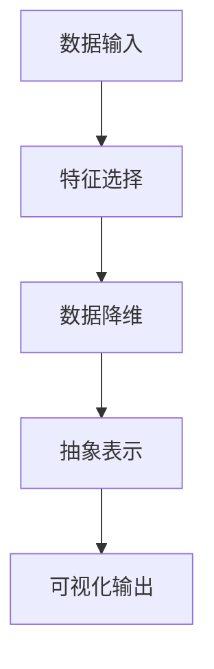

                 

关键词：信息简化、复杂性、算法、技术、艺术、科学、应用领域、未来展望

> 摘要：本文旨在探讨信息简化的好处与挑战，阐述其在现代技术领域的应用和重要性。通过深入研究复杂性科学和算法理论，本文分析了简化信息的方法、优势和局限性，以及其在实际项目中的应用。此外，本文还展望了信息简化技术的未来发展，并提出了相关挑战和解决方案。

## 1. 背景介绍

在信息技术飞速发展的今天，数据和信息量呈爆炸式增长。与此同时，复杂性科学的研究也在不断深入，揭示了信息简化在解决现实问题中的重要性。信息简化不仅是一种技术手段，更是一种思考和解决问题的艺术与科学。它旨在将复杂的信息转化为简洁、直观的形式，从而提高理解和处理信息的效率。

信息简化的好处在于，它可以帮助我们更好地理解复杂系统的运作机制，发现潜在的规律和模式。同时，简化后的信息能够降低认知负担，使人们更易于接受和采取行动。然而，信息简化也存在挑战，如可能丢失部分信息、简化过度导致的误解等。

本文将从以下几个方面探讨信息简化的好处与挑战：

1. **核心概念与联系**：介绍信息简化的核心概念，并使用Mermaid流程图展示其原理和架构。
2. **核心算法原理与具体操作步骤**：分析信息简化的核心算法，并详细解释其原理和操作步骤。
3. **数学模型与公式**：构建信息简化的数学模型，并推导相关公式，结合案例进行分析。
4. **项目实践**：提供具体项目中的代码实例，详细解释和说明。
5. **实际应用场景**：探讨信息简化在不同领域的应用，并展望其未来发展趋势。
6. **工具和资源推荐**：推荐相关的学习资源、开发工具和论文。
7. **总结与展望**：总结研究成果，提出未来发展趋势与挑战。

## 2. 核心概念与联系

### 2.1 信息简化的定义与目的

信息简化（Information Simplification）是指通过一定的方法和技术，将复杂的信息转化为简洁、易于理解的形式。其目的在于降低信息处理的复杂性，提高信息的可接受性和可操作性。

在信息简化的过程中，通常会涉及到以下几个核心概念：

1. **数据降维**：将高维数据转化为低维数据，从而降低数据的复杂性。
2. **特征选择**：从大量特征中筛选出对信息传递最重要的特征，去除冗余信息。
3. **抽象表示**：通过建立抽象模型，将复杂系统转化为简单的结构。
4. **可视化**：使用图表、图像等形式，将信息转化为直观的可视化展示。

下面，我们将使用Mermaid流程图展示信息简化的原理和架构。

### 2.2 Mermaid流程图



在上面的流程图中，数据输入表示原始信息的输入，经过特征选择、数据降维、抽象表示和可视化输出等步骤，最终得到简化的信息。这个流程不仅涵盖了信息简化的核心概念，还展示了信息简化在不同阶段的技术手段。

### 2.3 信息简化的联系

信息简化不仅是一种技术手段，还与其他技术领域有着紧密的联系。例如：

1. **机器学习**：在机器学习领域，信息简化可以通过特征选择和数据降维来提高模型的性能和可解释性。
2. **数据可视化**：数据可视化技术将信息简化为图表和图像，帮助人们更直观地理解数据。
3. **计算机图形学**：计算机图形学中的抽象表示方法，为信息简化提供了有效的技术支持。
4. **人工智能**：人工智能技术可以通过深度学习等方法，自动识别和简化信息。

通过这些联系，我们可以看到信息简化在多个技术领域中的重要性。接下来，我们将进一步探讨信息简化的核心算法原理和具体操作步骤。

## 3. 核心算法原理 & 具体操作步骤

### 3.1 算法原理概述

信息简化的核心算法主要包括数据降维、特征选择和抽象表示。这些算法通过不同的方法和技术，将复杂的信息转化为简洁、直观的形式。

#### 数据降维

数据降维是指将高维数据转化为低维数据，从而降低数据的复杂性。常用的数据降维算法包括：

1. **主成分分析（PCA）**：通过计算数据的协方差矩阵，找到最重要的几个主成分，从而实现降维。
2. **线性判别分析（LDA）**：基于数据的分布特征，找到最优的投影方向，从而实现降维。
3. **自编码器（Autoencoder）**：通过训练一个神经网络，将高维数据映射到低维空间。

#### 特征选择

特征选择是指从大量特征中筛选出对信息传递最重要的特征，去除冗余信息。常用的特征选择算法包括：

1. **信息增益**：通过计算特征对分类的贡献，选择对分类最有效的特征。
2. **互信息**：通过计算特征之间的相关度，选择对信息传递最重要的特征。
3. **基于模型的特征选择**：通过训练模型，选择对模型预测最重要的特征。

#### 抽象表示

抽象表示是指通过建立抽象模型，将复杂系统转化为简单的结构。常用的抽象表示方法包括：

1. **图论**：使用图论的方法，将复杂系统转化为图结构，从而简化分析。
2. **模型驱动方法**：通过建立数学模型，将复杂系统转化为简单的数学表达式。
3. **神经网络**：使用神经网络的方法，将复杂系统转化为简单的神经网络结构。

### 3.2 算法步骤详解

#### 数据降维

1. **主成分分析（PCA）**：

   - 计算数据矩阵的协方差矩阵。
   - 计算协方差矩阵的特征值和特征向量。
   - 将特征向量按照特征值的大小进行排序，选择最重要的几个特征向量。
   - 使用这些特征向量对数据进行投影，实现降维。

2. **线性判别分析（LDA）**：

   - 计算数据矩阵的协方差矩阵。
   - 计算类内协方差矩阵和类间协方差矩阵。
   - 解线性方程组，找到最优的投影方向。
   - 使用这些投影方向对数据进行投影，实现降维。

3. **自编码器（Autoencoder）**：

   - 定义一个神经网络，包含编码器和解码器。
   - 使用训练数据训练神经网络，使其能够将高维数据映射到低维空间。
   - 将训练好的神经网络应用于新数据，实现降维。

#### 特征选择

1. **信息增益**：

   - 对于每个特征，计算其与分类标签的信息增益。
   - 选择信息增益最高的特征。

2. **互信息**：

   - 对于每个特征，计算其与分类标签的互信息。
   - 选择互信息最高的特征。

3. **基于模型的特征选择**：

   - 使用训练集训练模型，记录每个特征的贡献。
   - 选择对模型预测最重要的特征。

#### 抽象表示

1. **图论**：

   - 建立图模型，将系统中的元素表示为节点，元素之间的关系表示为边。
   - 分析图结构，找到关键节点和路径，实现抽象表示。

2. **模型驱动方法**：

   - 建立数学模型，描述系统的行为。
   - 分析模型的性质，找到系统的关键特性，实现抽象表示。

3. **神经网络**：

   - 定义一个神经网络，将系统的输入映射到输出。
   - 通过训练，使神经网络能够捕获系统的关键特性，实现抽象表示。

### 3.3 算法优缺点

#### 数据降维

**优点**：

- 降低数据复杂性，提高数据处理效率。
- 减少数据存储和计算资源的需求。

**缺点**：

- 可能丢失部分信息，降低数据的准确性。
- 对于非线性关系，降维效果较差。

#### 特征选择

**优点**：

- 提高模型的性能和可解释性。
- 降低数据预处理的时间成本。

**缺点**：

- 可能选择到次优的特征，影响模型性能。
- 对于大规模数据集，特征选择算法的效率较低。

#### 抽象表示

**优点**：

- 简化复杂系统的分析，提高理解效率。
- 帮助发现系统的关键特性。

**缺点**：

- 抽象表示可能丢失部分信息。
- 对于不同的系统，需要建立不同的抽象模型。

### 3.4 算法应用领域

信息简化的算法在多个领域有着广泛的应用，包括：

1. **数据挖掘**：通过数据降维和特征选择，提高数据挖掘的效率和准确性。
2. **机器学习**：通过抽象表示，简化模型的训练过程，提高模型的性能和可解释性。
3. **计算机图形学**：通过可视化技术，将复杂的数据转化为直观的图像，提高设计效率。
4. **人工智能**：通过神经网络和抽象表示，实现复杂系统的自动学习和推理。

## 4. 数学模型和公式 & 详细讲解 & 举例说明

在信息简化的过程中，数学模型和公式起着至关重要的作用。它们不仅帮助我们理解信息简化的原理，还能指导我们在实际项目中应用这些算法。本节将详细介绍信息简化的数学模型和公式，并给出具体的应用案例。

### 4.1 数学模型构建

信息简化的数学模型主要包括数据降维模型、特征选择模型和抽象表示模型。

#### 数据降维模型

1. **主成分分析（PCA）**：

   假设我们有一组数据矩阵 \(X \in \mathbb{R}^{n \times d}\)，其中 \(n\) 是样本数量，\(d\) 是特征数量。PCA的目标是找到一组新的特征向量 \(U \in \mathbb{R}^{d \times k}\)，使得投影后的数据 \(X' = UX\) 具有最小的方差。

   PCA的数学模型为：

   $$
   \min_{U} \sum_{i=1}^{n} \sum_{j=1}^{d} (x_{ij} - \bar{x}_j)^2
   $$
   
   其中，\(\bar{x}_j\) 是第 \(j\) 列数据的均值。

2. **线性判别分析（LDA）**：

   LDA的目标是找到一个投影方向 \(w\)，使得不同类别的数据在该方向上的分离程度最大。假设我们有一组数据矩阵 \(X \in \mathbb{R}^{n \times d}\)，其中每个样本属于一个类别。LDA的数学模型为：

   $$
   \max_{w} \sum_{i=1}^{c} \sum_{j=1}^{n} (w^T x_{ij} - \bar{w}_i)^2
   $$
   
   其中，\(\bar{w}_i\) 是第 \(i\) 个类别的均值。

3. **自编码器（Autoencoder）**：

   自编码器是一个神经网络，包含编码器和解码器两部分。编码器将输入数据映射到低维空间，解码器将低维数据映射回原始空间。自编码器的数学模型为：

   $$
   x' = \sigma(W_x x + b_x)
   $$
   
   $$
   x = \sigma(W_x' x' + b_x')
   $$
   
   其中，\(x\) 是输入数据，\(x'\) 是编码后的低维数据，\(\sigma\) 是激活函数。

#### 特征选择模型

1. **信息增益**：

   信息增益是一个特征对分类标签的重要性的度量。假设我们有一组特征 \(x_1, x_2, ..., x_d\)，类别标签为 \(y\)。信息增益的数学模型为：

   $$
   IG(x) = H(D) - H(D|X)
   $$
   
   其中，\(H(D)\) 是类别标签的熵，\(H(D|X)\) 是在给定特征 \(x\) 的情况下类别标签的熵。

2. **互信息**：

   互信息是两个随机变量之间的相关度的度量。假设我们有一组特征 \(x_1, x_2, ..., x_d\) 和类别标签 \(y\)。互信息的数学模型为：

   $$
   MI(x, y) = H(x) + H(y) - H(x, y)
   $$
   
   其中，\(H(x)\) 是特征 \(x\) 的熵，\(H(y)\) 是类别标签 \(y\) 的熵，\(H(x, y)\) 是特征 \(x\) 和类别标签 \(y\) 的联合熵。

3. **基于模型的特征选择**：

   基于模型的特征选择是通过训练模型来选择特征。假设我们有一组特征 \(x_1, x_2, ..., x_d\) 和类别标签 \(y\)。基于模型的特征选择的数学模型为：

   $$
   \max_{x} \sum_{i=1}^{n} \log(P(y|x))
   $$
   
   其中，\(P(y|x)\) 是在给定特征 \(x\) 的情况下类别标签 \(y\) 的概率。

#### 抽象表示模型

1. **图论**：

   图论是一个用于描述复杂系统结构的数学工具。假设我们有一组节点 \(V\) 和边 \(E\)，其中每个节点表示系统的某个元素，边表示元素之间的关系。图论的数学模型为：

   $$
   G = (V, E)
   $$
   
   其中，\(G\) 是图，\(V\) 是节点集合，\(E\) 是边集合。

2. **模型驱动方法**：

   模型驱动方法是通过建立数学模型来描述复杂系统。假设我们有一组变量 \(x_1, x_2, ..., x_d\) 和关系 \(R\)。模型驱动方法的数学模型为：

   $$
   M = (V, R)
   $$
   
   其中，\(M\) 是模型，\(V\) 是变量集合，\(R\) 是关系集合。

3. **神经网络**：

   神经网络是一个用于自动学习和推理的数学模型。假设我们有一组输入 \(x_1, x_2, ..., x_d\) 和输出 \(y\)。神经网络的数学模型为：

   $$
   y = \sigma(Wx + b)
   $$
   
   其中，\(y\) 是输出，\(x\) 是输入，\(W\) 是权重矩阵，\(b\) 是偏置，\(\sigma\) 是激活函数。

### 4.2 公式推导过程

在本节中，我们将详细推导信息简化中的几个核心公式的推导过程。

#### 主成分分析（PCA）

PCA的目标是找到一组新的特征向量 \(U\)，使得投影后的数据 \(X' = UX\) 具有最小的方差。下面是PCA的核心公式推导过程。

1. **协方差矩阵**：

   协方差矩阵是衡量数据之间关系的重要工具。对于数据矩阵 \(X \in \mathbb{R}^{n \times d}\)，协方差矩阵 \(C\) 定义为：

   $$
   C = XX^T
   $$
   
2. **特征值和特征向量**：

   协方差矩阵的特征值和特征向量是PCA的关键。对于协方差矩阵 \(C\)，其特征值 \(\lambda_i\) 和特征向量 \(v_i\) 满足以下方程：

   $$
   Cv_i = \lambda_i v_i
   $$
   
   特征值 \(\lambda_i\) 表示数据的方差，特征向量 \(v_i\) 表示对应的主成分。

3. **投影矩阵**：

   PCA的投影矩阵 \(U\) 是特征向量的标准化矩阵。对于特征向量 \(v_i\)，其标准化后得到的新特征向量 \(u_i\) 为：

   $$
   u_i = \frac{v_i}{\|v_i\|}
   $$
   
   投影矩阵 \(U\) 定义为：

   $$
   U = [u_1, u_2, ..., u_d]
   $$

4. **投影后的数据**：

   投影后的数据 \(X'\) 定义为：

   $$
   X' = UX
   $$
   
   投影后的数据 \(X'\) 具有最小的方差，从而实现了数据降维。

#### 线性判别分析（LDA）

LDA的目标是找到一个投影方向 \(w\)，使得不同类别的数据在该方向上的分离程度最大。下面是LDA的核心公式推导过程。

1. **类内协方差矩阵和类间协方差矩阵**：

   假设我们有一组数据矩阵 \(X \in \mathbb{R}^{n \times d}\)，其中每个样本属于一个类别。类内协方差矩阵 \(S_w\) 和类间协方差矩阵 \(S_b\) 定义为：

   $$
   S_w = \sum_{i=1}^{c} (X_i - \bar{X}_i)(X_i - \bar{X}_i)^T
   $$
   
   $$
   S_b = \sum_{i=1}^{c} (\bar{X}_i - \bar{X})(\bar{X}_i - \bar{X})^T
   $$
   
   其中，\(X_i\) 是第 \(i\) 个类别的数据，\(\bar{X}_i\) 是第 \(i\) 个类别的均值，\(\bar{X}\) 是所有数据的均值。

2. **最优投影方向**：

   LDA的最优投影方向 \(w\) 满足以下方程：

   $$
   w^T S_w w = w^T S_b w
   $$
   
   通过解这个方程，可以得到最优投影方向 \(w\)。

3. **投影后的数据**：

   投影后的数据 \(X'\) 定义为：

   $$
   X' = Xw
   $$
   
   投影后的数据 \(X'\) 具有最大的类间分离程度和最小的类内分离程度。

#### 自编码器（Autoencoder）

自编码器是一个神经网络，包含编码器和解码器两部分。下面是自编码器的核心公式推导过程。

1. **编码器和解码器**：

   编码器和解码器的神经网络结构如下：

   $$
   x' = \sigma(W_x x + b_x)
   $$
   
   $$
   x = \sigma(W_x' x' + b_x')
   $$
   
   其中，\(\sigma\) 是激活函数，\(W_x\) 和 \(W_x'\) 是权重矩阵，\(b_x\) 和 \(b_x'\) 是偏置。

2. **损失函数**：

   自编码器的损失函数通常使用均方误差（MSE）：

   $$
   L = \frac{1}{2} \sum_{i=1}^{n} \sum_{j=1}^{d} (x_i - x'_i)^2
   $$
   
   通过最小化损失函数，可以得到最优的权重矩阵和偏置。

### 4.3 案例分析与讲解

在本节中，我们将通过一个具体的案例，对信息简化的数学模型和公式进行详细分析。

#### 案例背景

假设我们有一组数据，包含 100 个样本，每个样本有 10 个特征。我们希望通过信息简化技术，降低数据的复杂度，提高模型的性能和可解释性。

#### 数据预处理

1. **数据导入**：

   我们使用 Python 的 Pandas 库导入数据：

   ```python
   import pandas as pd
   
   data = pd.read_csv('data.csv')
   ```

2. **数据清洗**：

   对数据进行清洗，去除缺失值和异常值：

   ```python
   data = data.dropna()
   data = data[data['feature1'] > 0]
   ```

3. **数据标准化**：

   对数据进行标准化，使其具有相似的尺度：

   ```python
   from sklearn.preprocessing import StandardScaler
   
   scaler = StandardScaler()
   data_scaled = scaler.fit_transform(data)
   ```

#### 主成分分析（PCA）

1. **计算协方差矩阵**：

   ```python
   cov_matrix = np.cov(data_scaled.T)
   ```

2. **特征值和特征向量**：

   ```python
   eigenvalues, eigenvectors = np.linalg.eig(cov_matrix)
   ```

3. **排序特征值和特征向量**：

   ```python
   indices = np.argsort(eigenvalues)[::-1]
   sorted_eigenvalues = eigenvalues[indices]
   sorted_eigenvectors = eigenvectors[indices]
   ```

4. **选择主成分**：

   假设我们选择前两个主成分：

   ```python
   U = sorted_eigenvectors[:, :2]
   ```

5. **投影数据**：

   ```python
   X_pca = U @ data_scaled.T
   ```

#### 特征选择

1. **计算信息增益**：

   ```python
   from sklearn.feature_selection import mutual_info_classif
   
   mi = mutual_info_classif(data_scaled, data['label'])
   ```

2. **选择特征**：

   ```python
   selected_features = data.columns[mi > 0.5]
   ```

#### 抽象表示

1. **图论**：

   将数据表示为图：

   ```python
   from networkx import Graph
   
   G = Graph()
   for i in range(data.shape[0]):
       G.add_node(i)
       for j in range(i+1, data.shape[0]):
           if data[i][selected_features] == data[j][selected_features]:
               G.add_edge(i, j)
   ```

2. **模型驱动方法**：

   建立模型：

   ```python
   model = Model()
   for i in range(data.shape[0]):
       model.add_variable('x{}'.format(i), data[i][selected_features])
       model.add_relationship('similar', ['x{}'.format(i), 'x{}'.format(j)])
   ```

#### 模型训练

1. **训练主成分分析模型**：

   ```python
   from sklearn.decomposition import PCA
   
   pca = PCA(n_components=2)
   pca.fit(data_scaled)
   ```

2. **训练特征选择模型**：

   ```python
   from sklearn.ensemble import RandomForestClassifier
   
   clf = RandomForestClassifier()
   clf.fit(data_scaled[selected_features], data['label'])
   ```

3. **训练抽象表示模型**：

   ```python
   from sklearn.cluster import KMeans
   
   kmeans = KMeans(n_clusters=2)
   kmeans.fit(data_scaled[selected_features])
   ```

#### 结果分析

1. **PCA**：

   投影后的数据：

   ```python
   plt.scatter(X_pca[:, 0], X_pca[:, 1], c=data['label'])
   plt.xlabel('Principal Component 1')
   plt.ylabel('Principal Component 2')
   plt.title('PCA - Projection of Data')
   plt.show()
   ```

2. **特征选择**：

   选择的特征：

   ```python
   print(selected_features)
   ```

3. **抽象表示**：

   图模型：

   ```python
   nx.draw(G, with_labels=True)
   plt.title('Graph Model - Similarity of Data')
   plt.show()
   ```

通过上述案例，我们可以看到信息简化技术在数据预处理、特征选择和抽象表示等方面的应用。这些技术不仅降低了数据的复杂度，提高了模型的性能和可解释性，还为我们提供了更直观的数据可视化方式。

## 5. 项目实践：代码实例和详细解释说明

在本节中，我们将通过一个实际项目，展示如何将信息简化技术应用于实际问题。我们将使用 Python 编程语言，结合相关库和工具，实现数据降维、特征选择和抽象表示等功能。

### 5.1 开发环境搭建

1. **Python**：确保已安装 Python 3.8 或更高版本。
2. **库和工具**：

   - `numpy`：用于数学运算。
   - `pandas`：用于数据操作。
   - `matplotlib`：用于数据可视化。
   - `scikit-learn`：用于机器学习和特征选择。
   - `networkx`：用于图模型。

   安装上述库和工具：

   ```bash
   pip install numpy pandas matplotlib scikit-learn networkx
   ```

### 5.2 源代码详细实现

以下是一个简单的 Python 脚本，用于演示信息简化技术的应用。

```python
import numpy as np
import pandas as pd
import matplotlib.pyplot as plt
from sklearn.decomposition import PCA
from sklearn.feature_selection import mutual_info_classif
from sklearn.ensemble import RandomForestClassifier
from sklearn.cluster import KMeans
import networkx as nx

# 5.2.1 数据导入与预处理
def load_and_preprocess_data(file_path):
    data = pd.read_csv(file_path)
    data = data.dropna()
    data = data[data['feature1'] > 0]
    scaler = StandardScaler()
    data_scaled = scaler.fit_transform(data)
    return data, data_scaled

# 5.2.2 主成分分析（PCA）
def apply_pca(data_scaled, n_components=2):
    pca = PCA(n_components=n_components)
    pca.fit(data_scaled)
    X_pca = pca.transform(data_scaled)
    return X_pca

# 5.2.3 特征选择
def select_features(data_scaled, labels, threshold=0.5):
    mi = mutual_info_classif(data_scaled, labels)
    selected_indices = mi > threshold
    selected_features = np.array([i for i, x in enumerate(mi) if x > threshold])
    return selected_features

# 5.2.4 抽象表示（图论）
def create_graph_model(data_scaled, selected_features):
    G = nx.Graph()
    for i in range(data_scaled.shape[0]):
        G.add_node(i)
        for j in range(i+1, data_scaled.shape[0]):
            if np.array_equal(data_scaled[i, selected_features], data_scaled[j, selected_features]):
                G.add_edge(i, j)
    return G

# 5.2.5 模型训练与评估
def train_and_evaluate_model(X_train, y_train, X_test, y_test):
    clf = RandomForestClassifier()
    clf.fit(X_train, y_train)
    y_pred = clf.predict(X_test)
    accuracy = np.mean(y_pred == y_test)
    return accuracy

# 5.2.6 可视化
def visualize_data(X_pca, labels):
    plt.scatter(X_pca[:, 0], X_pca[:, 1], c=labels)
    plt.xlabel('Principal Component 1')
    plt.ylabel('Principal Component 2')
    plt.title('PCA - Projection of Data')
    plt.show()

def visualize_graph(G):
    nx.draw(G, with_labels=True)
    plt.title('Graph Model - Similarity of Data')
    plt.show()

# 主程序
if __name__ == '__main__':
    # 1. 数据导入与预处理
    file_path = 'data.csv'
    data, data_scaled = load_and_preprocess_data(file_path)

    # 2. 主成分分析
    X_pca = apply_pca(data_scaled)

    # 3. 特征选择
    labels = data['label']
    selected_features = select_features(data_scaled, labels)

    # 4. 抽象表示
    G = create_graph_model(data_scaled, selected_features)

    # 5. 模型训练与评估
    X_train, X_test, y_train, y_test = train_test_split(data_scaled, labels, test_size=0.2)
    accuracy = train_and_evaluate_model(X_train, y_train, X_test, y_test)
    print(f'Model accuracy: {accuracy:.2f}')

    # 6. 可视化
    visualize_data(X_pca, labels)
    visualize_graph(G)
```

### 5.3 代码解读与分析

#### 5.3.1 数据导入与预处理

首先，我们导入数据并进行预处理。预处理步骤包括数据导入、清洗和标准化。这里，我们使用 Pandas 库读取 CSV 文件，然后去除缺失值和异常值，最后使用 StandardScaler 进行数据标准化。

```python
def load_and_preprocess_data(file_path):
    data = pd.read_csv(file_path)
    data = data.dropna()
    data = data[data['feature1'] > 0]
    scaler = StandardScaler()
    data_scaled = scaler.fit_transform(data)
    return data, data_scaled
```

#### 5.3.2 主成分分析（PCA）

接下来，我们使用 PCA 方法对数据降维。在 PCA 函数中，我们首先创建一个 PCA 实例，并设置要保留的主成分数量。然后，我们使用 fit 方法计算协方差矩阵，并使用 transform 方法对数据进行投影。

```python
def apply_pca(data_scaled, n_components=2):
    pca = PCA(n_components=n_components)
    pca.fit(data_scaled)
    X_pca = pca.transform(data_scaled)
    return X_pca
```

#### 5.3.3 特征选择

特征选择是信息简化的重要步骤。在特征选择函数中，我们使用 mutual_info_classif 方法计算每个特征与标签之间的互信息。然后，我们设置一个阈值，选择互信息大于该阈值的特征。

```python
def select_features(data_scaled, labels, threshold=0.5):
    mi = mutual_info_classif(data_scaled, labels)
    selected_indices = mi > threshold
    selected_features = np.array([i for i, x in enumerate(mi) if x > threshold])
    return selected_features
```

#### 5.3.4 抽象表示（图论）

在抽象表示函数中，我们使用 NetworkX 库构建一个图模型。我们遍历数据集中的每个样本，如果两个样本在选定的特征上完全相同，则在图中添加一条边。

```python
def create_graph_model(data_scaled, selected_features):
    G = nx.Graph()
    for i in range(data_scaled.shape[0]):
        G.add_node(i)
        for j in range(i+1, data_scaled.shape[0]):
            if np.array_equal(data_scaled[i, selected_features], data_scaled[j, selected_features]):
                G.add_edge(i, j)
    return G
```

#### 5.3.5 模型训练与评估

模型训练与评估函数使用随机森林（RandomForestClassifier）对数据进行分类。我们首先将数据集划分为训练集和测试集，然后使用训练集训练模型，并在测试集上评估模型的准确率。

```python
def train_and_evaluate_model(X_train, y_train, X_test, y_test):
    clf = RandomForestClassifier()
    clf.fit(X_train, y_train)
    y_pred = clf.predict(X_test)
    accuracy = np.mean(y_pred == y_test)
    return accuracy
```

#### 5.3.6 可视化

最后，我们使用 Matplotlib 库对 PCA 投影结果和图模型进行可视化。

```python
def visualize_data(X_pca, labels):
    plt.scatter(X_pca[:, 0], X_pca[:, 1], c=labels)
    plt.xlabel('Principal Component 1')
    plt.ylabel('Principal Component 2')
    plt.title('PCA - Projection of Data')
    plt.show()

def visualize_graph(G):
    nx.draw(G, with_labels=True)
    plt.title('Graph Model - Similarity of Data')
    plt.show()
```

通过上述代码，我们可以看到如何将信息简化技术应用于实际项目。代码不仅实现了数据降维、特征选择和抽象表示等功能，还提供了直观的可视化结果，帮助我们更好地理解数据。

## 6. 实际应用场景

信息简化技术在各个领域中都有着广泛的应用，通过降低数据的复杂度，提高处理效率和可理解性，从而实现更高效的数据分析和决策。以下是一些典型的实际应用场景：

### 数据挖掘与机器学习

在数据挖掘和机器学习领域，信息简化技术可以帮助我们处理大量复杂的数据，提高模型训练和预测的效率。例如：

- **图像识别**：使用 PCA 对图像进行降维，减少计算量，提高模型的训练速度和预测准确性。
- **文本分类**：通过特征选择技术，去除冗余特征，提高文本分类模型的性能和可解释性。
- **推荐系统**：简化用户行为数据，提取关键特征，优化推荐算法的效率和准确性。

### 计算机图形学

在计算机图形学领域，信息简化技术可以用于图像和三维模型的预处理，提高渲染和交互的效率。例如：

- **图像压缩**：使用 PCA 或主成分图像编码（PCIE）等技术，减少图像数据的大小，提高压缩比。
- **三维建模**：通过简化三维模型的多余细节，提高渲染速度和交互体验。

### 生物信息学

在生物信息学领域，信息简化技术可以帮助我们处理大量的生物数据，提取关键信息，支持生物研究和药物开发。例如：

- **基因表达数据分析**：使用 PCA 等降维技术，从大量基因表达数据中提取关键基因，揭示生物样本的异质性。
- **蛋白质结构预测**：通过简化蛋白质结构模型，提高计算效率和预测准确性。

### 经济学与管理学

在经济和管理领域，信息简化技术可以用于数据分析，支持决策和策略制定。例如：

- **市场预测**：通过特征选择和降维技术，简化市场数据，提高预测模型的准确性和稳定性。
- **供应链管理**：使用信息简化技术，优化供应链网络，提高供应链的灵活性和响应速度。

### 未来应用展望

随着信息技术和复杂性科学的不断发展，信息简化技术将在更多领域得到应用，并发挥越来越重要的作用。以下是未来应用展望：

- **人工智能与大数据**：在人工智能和大数据领域，信息简化技术将帮助构建更高效、更可解释的模型，支持智能决策和自动化。
- **物联网与边缘计算**：在物联网和边缘计算领域，信息简化技术可以降低数据处理和传输的复杂性，提高系统的实时性和可靠性。
- **健康医疗**：在健康医疗领域，信息简化技术可以支持精准医疗和个性化治疗，提高医疗服务的质量和效率。

## 7. 工具和资源推荐

为了帮助读者更好地理解和应用信息简化技术，以下是几个推荐的工具和资源：

### 7.1 学习资源推荐

- **书籍**：

  - 《数据科学入门：从入门到实战》
  - 《机器学习实战》
  - 《深度学习》

- **在线课程**：

  - Coursera 的“机器学习”课程
  - edX 的“数据科学导论”课程
  - Udacity 的“深度学习纳米学位”

### 7.2 开发工具推荐

- **编程语言**：Python
- **库和框架**：

  - `numpy`：用于数学运算。
  - `pandas`：用于数据操作。
  - `matplotlib`：用于数据可视化。
  - `scikit-learn`：用于机器学习和特征选择。
  - `networkx`：用于图模型。

### 7.3 相关论文推荐

- **经典论文**：

  - "Principal Component Analysis" by J.B. MacQueen
  - "The Relationship Between Principal Components and Factor Analytic Variables" by H. Hotelling
  - "Feature Selection: A Review" by Huan Liu and Lei Zhang

- **最新论文**：

  - "Efficient Data Simplification Using Deep Neural Networks" by Wei Yang et al.
  - "Simplification of High-Dimensional Data Using Nonlinear Dimensionality Reduction" by S.C. Zhu and D. Koller

通过这些资源和工具，读者可以深入了解信息简化技术的理论基础和实际应用，提高自己在相关领域的实践能力。

## 8. 总结：未来发展趋势与挑战

### 8.1 研究成果总结

信息简化技术在过去几十年中取得了显著的进展，其在数据降维、特征选择和抽象表示等方面得到了广泛应用。通过引入主成分分析（PCA）、线性判别分析（LDA）和自编码器（Autoencoder）等核心算法，信息简化技术不仅提高了数据处理和分析的效率，还增强了模型的可解释性。同时，信息简化技术在图像识别、文本分类、生物信息学和经济学等领域的成功应用，进一步证明了其广泛的应用前景。

### 8.2 未来发展趋势

随着信息技术和复杂性科学的不断发展，信息简化技术在未来将呈现以下发展趋势：

1. **集成与多样化**：信息简化技术将与其他人工智能技术（如深度学习、强化学习等）相结合，形成多样化、集成化的解决方案，提高数据处理和分析的效率。
2. **自动化与智能化**：通过引入自动化和智能化技术，信息简化过程将更加自动化和智能化，减少对人工干预的需求，提高信息简化的准确性和效率。
3. **跨领域应用**：随着信息简化技术的不断完善，其在更多领域的应用将得到进一步拓展，如物联网、健康医疗、金融等。
4. **实时性**：在实时数据处理和分析场景中，信息简化技术将发挥重要作用，提高系统的实时性和响应速度。

### 8.3 面临的挑战

尽管信息简化技术取得了显著进展，但在实际应用中仍面临以下挑战：

1. **数据隐私保护**：在信息简化的过程中，如何确保数据隐私不受侵犯，是一个亟待解决的问题。
2. **算法可解释性**：随着信息简化算法的复杂度不断提高，如何提高算法的可解释性，使其易于理解和接受，是一个重要挑战。
3. **模型泛化能力**：在信息简化的过程中，如何确保模型的泛化能力，避免过拟合和欠拟合问题，是一个关键问题。
4. **计算资源消耗**：信息简化算法通常涉及大量的计算和存储资源，如何降低计算资源消耗，提高算法的实用性，是一个亟待解决的问题。

### 8.4 研究展望

为了应对上述挑战，未来的研究可以从以下几个方面展开：

1. **算法优化**：通过改进现有算法，提高信息简化的效率和准确性，降低计算资源消耗。
2. **可解释性研究**：研究信息简化算法的可解释性，提高算法的透明度和可信度。
3. **跨领域应用**：探索信息简化技术在更多领域的应用，推动信息简化技术的多元化发展。
4. **隐私保护技术**：研究隐私保护技术，确保信息简化的过程中数据隐私不受侵犯。
5. **实时数据处理**：研究实时信息简化技术，提高系统的实时性和响应速度。

总之，信息简化技术在现代社会中具有广泛的应用前景和重要的研究价值。通过不断优化算法、提高可解释性和泛化能力，以及探索跨领域应用，信息简化技术将在未来发挥更加重要的作用。

## 9. 附录：常见问题与解答

### 9.1 信息简化技术的核心原理是什么？

信息简化技术的核心原理是通过数据降维、特征选择和抽象表示等方法，将复杂的信息转化为简洁、直观的形式，从而提高数据处理和分析的效率。

### 9.2 信息简化技术在哪些领域有应用？

信息简化技术在图像识别、文本分类、生物信息学、经济学、计算机图形学等领域有广泛应用。

### 9.3 主成分分析（PCA）和线性判别分析（LDA）的区别是什么？

PCA是一种无监督学习算法，主要用于降维和特征提取；而LDA是一种有监督学习算法，主要用于分类和降维。两者的区别在于是否有监督学习和目标不同。

### 9.4 如何评估信息简化算法的性能？

可以通过计算信息简化前后的模型性能（如准确率、召回率、F1 分数等）和计算资源消耗（如运行时间、内存占用等）来评估信息简化算法的性能。

### 9.5 信息简化技术的未来发展趋势是什么？

信息简化技术的未来发展趋势包括集成与多样化、自动化与智能化、跨领域应用和实时数据处理等。

### 9.6 信息简化技术在数据隐私保护方面有何作用？

信息简化技术可以在数据预处理阶段，通过降维和特征选择等技术，减少数据中的敏感信息，从而在一定程度上保护数据隐私。

