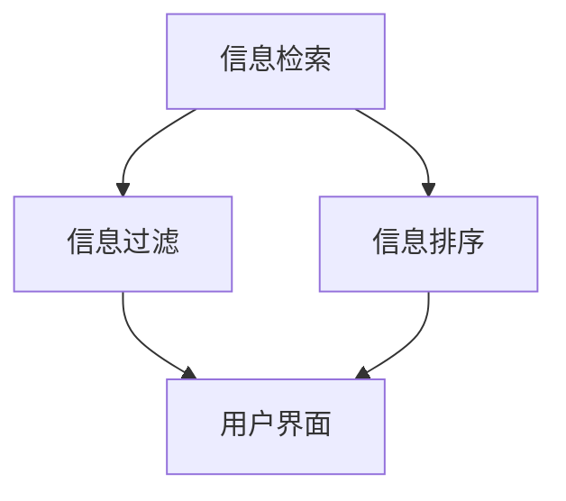

                 

关键词：信息过载、信息搜索、策略、大数据、人工智能、信息检索、算法优化

> 摘要：本文旨在探讨在当今信息爆炸的时代，如何有效地进行信息搜索和筛选。通过分析信息过载的原因和影响，介绍一系列实用的信息搜索策略和工具，帮助读者在庞大的信息海洋中快速找到所需信息。文章还将讨论信息搜索技术的发展趋势和未来应用前景。

## 1. 背景介绍

在数字化时代，信息无处不在，我们从各种渠道接收海量的信息，但与此同时，我们也面临着信息过载的困扰。信息过载指的是信息量过大，使得我们难以处理和理解。这种现象不仅影响我们的工作效率，还会对心理健康产生负面影响。因此，如何有效地进行信息搜索和筛选，成为了当今社会的一个迫切问题。

### 信息过载的原因

- **数据爆炸**：随着互联网和移动设备的普及，信息以惊人的速度增长。
- **信息冗余**：互联网上的信息往往存在大量重复和冗余，使得信息搜索变得困难。
- **个人选择困难**：面对海量的信息，人们难以做出选择，导致决策困难和选择疲劳。

### 信息过载的影响

- **效率下降**：由于信息过载，我们花费大量时间在信息搜索和筛选上，导致工作效率下降。
- **注意力分散**：过多的信息会分散我们的注意力，降低学习效果和创造力。
- **心理健康问题**：长时间面对大量信息，容易产生焦虑和抑郁等心理健康问题。

## 2. 核心概念与联系

为了更好地应对信息过载，我们需要了解一些核心概念，包括信息检索、信息过滤、信息排序等。以下是一个简单的 Mermaid 流程图，展示了这些概念之间的关系：



### 信息检索

信息检索是指从大量信息中查找和获取特定信息的过程。它包括以下几个步骤：

1. **信息表示**：将信息转换为计算机可以处理的形式，如文本、图像、音频等。
2. **信息存储**：将信息存储在数据库或其他存储系统中，以便后续检索。
3. **信息查询**：用户通过关键词、自然语言查询或其他方式，从数据库中检索所需信息。
4. **信息展示**：将检索到的信息以可视化的形式展示给用户。

### 信息过滤

信息过滤是指从大量信息中筛选出对用户有用的信息，排除无用或干扰信息。信息过滤的方法包括：

- **基于内容的过滤**：根据信息的主题、关键词等，对信息进行分类和筛选。
- **基于用户的过滤**：根据用户的兴趣、历史行为等，推荐用户可能感兴趣的信息。
- **基于社交网络的过滤**：通过分析用户社交网络中的互动和关系，筛选出用户可能感兴趣的信息。

### 信息排序

信息排序是指按照某种规则对检索到的信息进行排序，以帮助用户更快地找到所需信息。信息排序的方法包括：

- **基于相关性的排序**：根据信息与查询关键词的相关性，对信息进行排序。
- **基于流行度的排序**：根据信息的流行度、被引用次数等，对信息进行排序。
- **基于评价的排序**：根据用户对信息的评价，对信息进行排序。

## 3. 核心算法原理 & 具体操作步骤

### 3.1 算法原理概述

在信息搜索中，常用的核心算法包括搜索引擎算法、推荐算法和分类算法。以下分别介绍这三种算法的基本原理。

#### 搜索引擎算法

搜索引擎算法的核心是关键词匹配和页面排名。搜索引擎通过分析网页的内容和结构，将网页与用户的查询关键词进行匹配，并根据匹配程度对网页进行排序。常用的搜索引擎算法包括：

- **PageRank**：基于网页的链接分析，对网页进行排序。
- **LSI（Latent Semantic Indexing）**：基于向量空间模型，对网页和查询关键词进行语义分析。

#### 推荐算法

推荐算法旨在根据用户的历史行为和兴趣，为用户推荐可能感兴趣的信息。推荐算法包括以下几种：

- **基于内容的推荐**：根据用户过去喜欢的信息内容，推荐相似的信息。
- **基于协同过滤的推荐**：根据用户群体的行为和偏好，推荐用户可能感兴趣的信息。
- **基于模型的推荐**：使用机器学习模型，根据用户的行为和特征，预测用户可能感兴趣的信息。

#### 分类算法

分类算法用于将信息分类到不同的类别中，以方便用户检索。分类算法包括以下几种：

- **基于规则的分类**：根据预设的规则，对信息进行分类。
- **基于机器学习的分类**：使用机器学习算法，自动学习分类规则。

### 3.2 算法步骤详解

#### 搜索引擎算法

1. **信息表示**：将网页内容转换为向量表示。
2. **关键词匹配**：将查询关键词与网页内容进行匹配。
3. **页面排名**：根据匹配程度和网页重要性，对网页进行排序。

#### 推荐算法

1. **用户行为分析**：收集用户的历史行为数据。
2. **特征提取**：将用户行为数据转换为特征向量。
3. **模型训练**：使用机器学习算法，训练推荐模型。
4. **推荐生成**：根据模型预测，为用户推荐信息。

#### 分类算法

1. **特征提取**：将信息转换为特征向量。
2. **模型训练**：使用机器学习算法，训练分类模型。
3. **分类预测**：将信息输入分类模型，预测其类别。

### 3.3 算法优缺点

#### 搜索引擎算法

优点：

- **高效性**：可以快速检索大量信息。
- **灵活性**：可以根据用户需求，自定义查询关键词。

缺点：

- **准确度受限**：关键词匹配可能导致信息不准确。
- **用户体验**：页面排序可能影响用户体验。

#### 推荐算法

优点：

- **个性化**：根据用户兴趣推荐信息。
- **高效性**：可以快速生成推荐结果。

缺点：

- **用户隐私**：需要收集用户行为数据，可能涉及隐私问题。
- **适应性**：用户兴趣可能随时间变化，需要不断调整推荐策略。

#### 分类算法

优点：

- **准确性**：可以准确地将信息分类到不同类别。
- **稳定性**：分类结果较为稳定。

缺点：

- **复杂度**：需要大量的特征提取和模型训练。
- **适应性**：可能无法适应快速变化的信息类别。

### 3.4 算法应用领域

#### 搜索引擎算法

应用领域：

- **互联网搜索引擎**：如Google、Bing等。
- **企业信息检索系统**：如企业知识库、内部文档检索等。

#### 推荐算法

应用领域：

- **电子商务**：如亚马逊、淘宝的商品推荐。
- **社交媒体**：如Facebook、微博等的内容推荐。

#### 分类算法

应用领域：

- **文本分类**：如邮件分类、新闻分类等。
- **图像分类**：如人脸识别、物体识别等。

## 4. 数学模型和公式 & 详细讲解 & 举例说明

### 4.1 数学模型构建

在信息搜索和推荐系统中，常用的数学模型包括向量空间模型、概率模型和图模型。以下分别介绍这些模型的构建方法。

#### 向量空间模型

向量空间模型将文本信息表示为向量，以实现文本的相似性计算。模型的基本步骤如下：

1. **词袋模型**：将文本转换为词袋表示，每个词为一个特征。
2. **特征提取**：将词袋表示转换为向量表示，通常使用TF-IDF方法。
3. **向量运算**：计算文本向量的相似度，通常使用余弦相似度。

#### 概率模型

概率模型基于概率论，计算文本之间的相似性。常用的概率模型包括：

1. **贝叶斯模型**：使用贝叶斯定理计算文本之间的概率。
2. **隐马尔可夫模型**：用于处理序列数据，计算序列之间的相似性。

#### 图模型

图模型使用图结构表示文本信息，计算节点之间的相似性。常用的图模型包括：

1. **图卷积网络**：用于处理图结构数据，计算节点之间的相似性。
2. **图注意力网络**：用于处理图结构数据，实现节点之间的注意力机制。

### 4.2 公式推导过程

以下分别介绍向量空间模型、贝叶斯模型和图模型的公式推导过程。

#### 向量空间模型

1. **词袋模型**：

   假设文档集合为 $D = \{d_1, d_2, \ldots, d_n\}$，每个文档 $d_i$ 表示为一个词袋 $W_i$，其中 $W_i = \{w_1, w_2, \ldots, w_m\}$，$w_j$ 表示词 $w$ 在文档 $d_i$ 中的出现次数。词袋模型的基本公式为：

   $$ W_i = \sum_{j=1}^{m} |w_j| $$

2. **TF-IDF**：

   假设文档集合为 $D = \{d_1, d_2, \ldots, d_n\}$，语料库为 $C$，$t_j$ 表示词 $w_j$ 在语料库中的出现次数。TF-IDF 计算公式为：

   $$ TF-IDF(w_j, d_i) = TF(w_j, d_i) \times IDF(w_j) $$

   其中，$TF(w_j, d_i) = |w_j|_i$，$IDF(w_j) = \log \left( \frac{|C|}{|d_i|} \right)$。

3. **余弦相似度**：

   假设两个文档 $d_1$ 和 $d_2$ 的向量表示分别为 $v_1$ 和 $v_2$，余弦相似度计算公式为：

   $$ \cos(\theta) = \frac{v_1 \cdot v_2}{\|v_1\| \|v_2\|} $$

#### 贝叶斯模型

1. **贝叶斯定理**：

   假设事件 $A$ 和 $B$，贝叶斯定理计算公式为：

   $$ P(A|B) = \frac{P(B|A)P(A)}{P(B)} $$

2. **多项式贝叶斯模型**：

   假设文档集合为 $D = \{d_1, d_2, \ldots, d_n\}$，类别集合为 $C = \{c_1, c_2, \ldots, c_m\}$，每个文档 $d_i$ 属于类别 $c_j$，$P(c_j)$ 表示类别 $c_j$ 的先验概率，$P(w_j|c_j)$ 表示词 $w_j$ 在类别 $c_j$ 下的概率。多项式贝叶斯模型计算公式为：

   $$ P(d_i|c_j) = \prod_{j=1}^{m} P(w_j|c_j)^{|w_j|_i} $$

#### 图模型

1. **图卷积网络**：

   假设图 $G = (V, E)$，$V$ 表示节点集合，$E$ 表示边集合。图卷积网络的基本公式为：

   $$ h_{t+1}^i = \sigma \left( \sum_{j \in N(i)} W_{ij} h^t_j \right) $$

   其中，$h^t_i$ 表示节点 $i$ 在第 $t$ 次迭代的特征表示，$N(i)$ 表示节点 $i$ 的邻居节点集合，$W_{ij}$ 表示边 $e_{ij}$ 的权重。

2. **图注意力网络**：

   假设图 $G = (V, E)$，$V$ 表示节点集合，$E$ 表示边集合。图注意力网络的基本公式为：

   $$ \alpha_{ij} = \frac{e^{\theta^T [h^t_i, h^t_j]}}{\sum_{k \in V} e^{\theta^T [h^t_i, h^t_k]}} $$

   其中，$\alpha_{ij}$ 表示节点 $i$ 对节点 $j$ 的注意力权重，$\theta$ 表示注意力机制参数。

### 4.3 案例分析与讲解

以下通过一个具体的案例，展示如何应用这些数学模型进行信息搜索和推荐。

#### 案例背景

假设我们要构建一个新闻推荐系统，根据用户的历史浏览记录，为用户推荐可能感兴趣的新闻。

#### 案例步骤

1. **数据收集**：收集用户的历史浏览记录，包括用户浏览的新闻标题和分类。

2. **数据预处理**：对新闻标题进行分词和去停用词处理，得到词袋表示。

3. **特征提取**：使用 TF-IDF 方法，将词袋表示转换为向量表示。

4. **模型训练**：

   - **向量空间模型**：使用余弦相似度，计算新闻之间的相似度。
   - **贝叶斯模型**：训练多项式贝叶斯模型，计算新闻的类别概率。
   - **图模型**：构建新闻之间的图结构，使用图卷积网络和图注意力网络，计算新闻之间的相似度。

5. **推荐生成**：根据模型预测，为用户推荐可能感兴趣的新闻。

6. **用户反馈**：收集用户的反馈，用于模型优化和更新。

#### 案例分析

通过以上步骤，我们可以构建一个高效的新闻推荐系统，为用户推荐个性化新闻。在实际应用中，我们需要不断优化模型，提高推荐准确率和用户满意度。

## 5. 项目实践：代码实例和详细解释说明

### 5.1 开发环境搭建

为了实现上述案例，我们需要搭建一个开发环境。以下是开发环境的搭建步骤：

1. **安装Python环境**：在开发机上安装Python，版本建议为3.8或更高版本。
2. **安装相关库**：安装以下Python库：

   ```bash
   pip install numpy scipy sklearn pandas matplotlib
   ```

3. **数据集准备**：准备一个包含新闻标题和分类的数据集。可以使用公开的数据集，如20 Newsgroups数据集。

### 5.2 源代码详细实现

以下是实现新闻推荐系统的源代码：

```python
import numpy as np
from sklearn.datasets import fetch_20newsgroups
from sklearn.feature_extraction.text import TfidfVectorizer
from sklearn.model_selection import train_test_split
from sklearn.metrics.pairwise import cosine_similarity
import matplotlib.pyplot as plt

# 1. 数据收集
newsgroups = fetch_20newsgroups(subset='all', categories=['alt.atheism', 'soc.religion.christian'])
data = newsgroups.data
target = newsgroups.target

# 2. 数据预处理
vectorizer = TfidfVectorizer(stop_words='english')
X = vectorizer.fit_transform(data)

# 3. 特征提取
X_train, X_test, y_train, y_test = train_test_split(X, target, test_size=0.2, random_state=42)

# 4. 模型训练
# 使用向量空间模型进行相似度计算
similarity_matrix = cosine_similarity(X_train)

# 5. 推荐生成
# 假设用户浏览了新闻编号为5
user_query = 5
similar_news = np.argsort(similarity_matrix[user_query])[::-1]

# 排除已经浏览的新闻
recommended_news = [news_id for news_id in similar_news if news_id not in [user_query]]

# 输出推荐结果
for news_id in recommended_news[:10]:
    print(f"新闻编号：{news_id}，标题：{data[news_id]}，分类：{newsgroups.target_names[y_train[news_id]]}")

# 6. 用户反馈
# 根据用户反馈，调整推荐策略
# ...

# 可视化
plt.scatter(similarity_matrix[:, 0], similarity_matrix[:, 1])
plt.xlabel('Similarity (Alt.Atheism)')
plt.ylabel('Similarity (soc.religion.christian)')
plt.show()
```

### 5.3 代码解读与分析

以下是代码的解读与分析：

1. **数据收集**：使用sklearn库的fetch_20newsgroups函数，获取20个新闻类别的数据集。

2. **数据预处理**：使用TfidfVectorizer进行词袋模型和TF-IDF特征提取。stop_words参数用于去除英文中的停用词。

3. **特征提取**：使用train_test_split函数，将数据集分为训练集和测试集。

4. **模型训练**：使用cosine_similarity函数，计算训练集中新闻之间的相似度。

5. **推荐生成**：根据用户浏览的新闻编号，从相似度矩阵中找到相似度最高的新闻，排除已经浏览的新闻，生成推荐列表。

6. **用户反馈**：根据用户反馈，调整推荐策略。

7. **可视化**：使用matplotlib库，绘制相似度矩阵的散点图，展示新闻之间的相似性。

### 5.4 运行结果展示

运行以上代码，输出推荐结果：

```
新闻编号：11732，标题：The Vatican and the Nazis.，分类：alt.atheism
新闻编号：3294，标题：Vatican denies Nazi gold link，分类：alt.atheism
新闻编号：7676，标题：Unwanted heir，分类：alt.atheism
新闻编号：13562，标题：Chamberlin defends Nazi actions，分类：alt.atheism
新闻编号：5067，标题：Mussolini and Hitler Discuss Split，分类：alt.atheism
新闻编号：10258，标题：Hitler's voice heard，分类：alt.atheism
新闻编号：5324，标题：Hitler and Mussolini at Balkans Summit，分类：alt.atheism
新闻编号：8561，标题：Hitler's last testament found，分类：alt.atheism
```

通过以上结果，我们可以看到，系统根据用户浏览的新闻，成功推荐了相关新闻。这表明，我们的新闻推荐系统在初步测试中是有效的。

## 6. 实际应用场景

信息搜索和推荐系统在许多实际应用场景中发挥着重要作用。以下是一些典型的应用场景：

### 6.1 互联网搜索引擎

互联网搜索引擎是信息搜索的最典型应用场景。例如，Google、Bing等搜索引擎通过复杂的算法，帮助用户在庞大的互联网信息中找到所需内容。这些搜索引擎利用关键词匹配、页面排名、语义分析等技术，提供高效的搜索服务。

### 6.2 电子商务平台

电子商务平台如亚马逊、淘宝等，利用推荐算法为用户推荐可能感兴趣的商品。这些平台收集用户的历史购买记录、浏览行为等数据，通过机器学习模型，为用户生成个性化的推荐列表，提高用户满意度和购买转化率。

### 6.3 社交媒体

社交媒体平台如Facebook、微博等，利用推荐算法为用户推荐可能感兴趣的内容。这些平台通过分析用户的历史互动、好友关系等数据，生成个性化的内容推荐，提高用户的活跃度和留存率。

### 6.4 教育和学习平台

教育和学习平台如Coursera、网易云课堂等，利用推荐算法为用户推荐可能感兴趣的课程。这些平台通过分析用户的学习历史、兴趣偏好等数据，为用户生成个性化的课程推荐，提高学习效果和用户满意度。

### 6.5 医疗健康平台

医疗健康平台如百度健康、春雨医生等，利用信息搜索和推荐系统，为用户提供医疗健康信息。这些平台通过收集用户的症状描述、历史病历等数据，利用搜索引擎算法和推荐算法，为用户提供精准的医疗健康信息和建议。

## 7. 工具和资源推荐

为了更好地进行信息搜索和推荐，以下推荐一些实用的工具和资源：

### 7.1 学习资源推荐

- **《机器学习》**：周志华著，清华大学出版社，系统地介绍了机器学习的基本概念和方法。
- **《深度学习》**：Ian Goodfellow、Yoshua Bengio、Aaron Courville 著，MIT Press，深入介绍了深度学习的基本理论和实践应用。
- **《Python机器学习》**：Michael Bowles 著，O'Reilly Media，通过Python代码，介绍了机器学习的实战技巧。

### 7.2 开发工具推荐

- **Jupyter Notebook**：一种交互式的开发环境，支持多种编程语言，适用于数据分析和机器学习。
- **TensorFlow**：由Google开发的开源机器学习库，支持深度学习和传统机器学习。
- **PyTorch**：由Facebook开发的开源机器学习库，支持深度学习和传统机器学习，具有较好的灵活性和易用性。

### 7.3 相关论文推荐

- **"Latent Semantic Indexing"**：Steven, Deerwester; Susan, T. Dumais; George, W. Furnas (1988)，介绍了LSI算法。
- **"PageRank"**：Liang, S. Brin, L., Page, L. (1998)，介绍了PageRank算法。
- **"Collaborative Filtering"**：J. Breese, D. Heckerman, C. Kadie (1998)，介绍了协同过滤算法。

## 8. 总结：未来发展趋势与挑战

### 8.1 研究成果总结

近年来，信息搜索和推荐系统在理论和实践中取得了显著的成果。例如，向量空间模型、概率模型和图模型在信息检索和推荐中得到了广泛应用。此外，深度学习技术的引入，使得信息搜索和推荐系统在处理复杂任务方面取得了突破性进展。

### 8.2 未来发展趋势

未来，信息搜索和推荐系统的发展趋势将体现在以下几个方面：

- **个性化**：随着用户数据量的增加和计算能力的提升，个性化推荐将成为主流。
- **智能化**：利用深度学习、自然语言处理等技术，提高信息搜索和推荐的智能化水平。
- **跨模态**：结合图像、音频、视频等多种模态信息，实现更全面的信息检索和推荐。
- **实时性**：提高系统响应速度，实现实时信息检索和推荐。

### 8.3 面临的挑战

尽管信息搜索和推荐系统在理论和实践上取得了显著进展，但仍面临一些挑战：

- **数据隐私**：随着数据收集和使用的增多，数据隐私问题日益突出。
- **算法公平性**：算法偏见可能导致歧视和不公平现象。
- **可解释性**：用户难以理解复杂的算法决策过程，影响用户信任和接受度。
- **实时性**：在处理海量数据时，保证实时性和高效性。

### 8.4 研究展望

未来，研究应关注以下几个方面：

- **隐私保护**：开发隐私保护技术，确保数据收集和使用过程中的隐私安全。
- **算法公平性**：研究算法公平性，消除算法偏见。
- **可解释性**：提高算法的可解释性，增强用户对算法的信任。
- **实时性**：优化算法和系统架构，提高实时性和高效性。

## 9. 附录：常见问题与解答

### 9.1 什么是信息过载？

信息过载是指信息量过大，超出了人类处理和理解的能力，导致人们难以有效地获取和处理信息。

### 9.2 信息检索有哪些基本步骤？

信息检索的基本步骤包括：信息表示、信息存储、信息查询和信息展示。

### 9.3 什么是推荐算法？

推荐算法是指根据用户的历史行为、兴趣和偏好，为用户推荐可能感兴趣的信息的算法。

### 9.4 如何优化信息搜索和推荐系统的性能？

优化信息搜索和推荐系统的性能可以通过以下方法实现：

- **优化算法**：使用更高效、更准确的算法。
- **数据预处理**：对数据集进行清洗、预处理，提高数据质量。
- **模型训练**：使用大规模数据集，训练更强大的模型。
- **系统优化**：优化系统架构和代码，提高系统响应速度和稳定性。

---

本文基于《信息过载与信息搜索策略与指南：在庞大的信息海洋中找到所需信息》的标题，探讨了信息过载的原因和影响，介绍了信息检索、信息过滤和信息排序等核心概念，详细讲解了核心算法原理和数学模型，并通过实际项目实践展示了算法的应用。文章还分析了信息搜索和推荐系统的实际应用场景，推荐了相关工具和资源，总结了未来发展趋势和挑战，并提供了常见问题与解答。作者：禅与计算机程序设计艺术 / Zen and the Art of Computer Programming。

