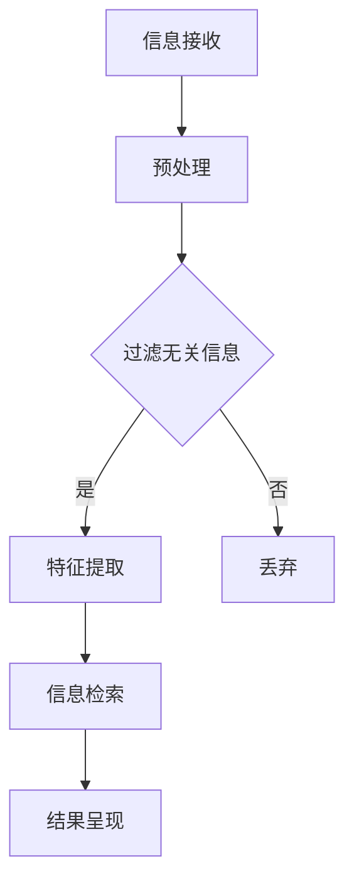

                 

关键词：信息过载、信息筛选、数据挖掘、机器学习、信息检索、人机交互

> 摘要：随着信息技术的飞速发展，信息过载成为当今社会的一大难题。面对海量的数据和信息，如何有效地筛选出有价值的信息成为人们关注的焦点。本文将探讨信息过载的原因、影响及解决方法，并介绍一些有效的信息筛选策略，帮助读者在信息洪流中找到有价值的信息。

## 1. 背景介绍

在互联网和大数据时代的背景下，人们每天都会接触到海量的信息。这些信息包括新闻、社交媒体更新、电子邮件、研究报告、技术文档等。然而，并非所有信息都是有价值的，甚至有些信息是冗余的、无关的或误导性的。这种信息过载现象给人们的工作和生活带来了诸多困扰，降低了工作效率，影响了决策质量，甚至可能引发心理压力。

信息过载的原因主要有以下几点：

- **信息生产速度加快**：随着互联网的普及，信息的生产、传播速度大大加快，每天产生的大量新信息使得人们难以全部消化。
- **信息来源多样化**：人们从多种渠道获取信息，如社交媒体、新闻网站、专业论坛、个人博客等，导致信息源复杂化。
- **信息传播方式变革**：信息可以通过各种形式传播，如图文、视频、音频等，使得信息形式多样化，增加了筛选难度。
- **个体信息需求差异**：每个人的信息需求不同，导致对信息的关注点和筛选标准存在差异。

## 2. 核心概念与联系

为了更好地理解信息过载和信息筛选策略，我们需要了解一些相关的核心概念。

### 2.1 数据挖掘

数据挖掘是指从大量数据中提取有价值信息的过程。它包括数据预处理、特征选择、模型构建、模型评估等多个步骤。数据挖掘可以应用于多种领域，如商业智能、金融市场分析、医疗健康等。

### 2.2 机器学习

机器学习是人工智能的一个重要分支，它使计算机能够从数据中自动学习并做出决策。机器学习算法可以分为监督学习、无监督学习和强化学习。监督学习需要标记数据，无监督学习不需要标记数据，而强化学习则是通过奖励机制进行学习。

### 2.3 信息检索

信息检索是指从大量信息中快速找到用户需要的信息的过程。信息检索技术包括基于关键词的检索、基于内容的检索、基于语义的检索等。信息检索广泛应用于搜索引擎、推荐系统、问答系统等领域。

### 2.4 人机交互

人机交互是指人与计算机之间的交互过程。随着人工智能技术的发展，人机交互已经从简单的命令行交互发展到图形用户界面（GUI）、语音识别、自然语言处理（NLP）等多种形式。

### 2.5 Mermaid 流程图

以下是一个简单的 Mermaid 流程图，展示了信息筛选的流程：



## 3. 核心算法原理 & 具体操作步骤

### 3.1 算法原理概述

信息筛选的核心算法主要包括以下几种：

- **过滤算法**：通过预设规则或模型，自动过滤掉无关或低价值的信息。
- **特征提取算法**：从原始数据中提取有价值的信息特征，为后续的筛选和分类提供依据。
- **信息检索算法**：根据用户需求和特征，快速找到匹配的信息。

### 3.2 算法步骤详解

#### 3.2.1 信息接收

信息接收是指从各种渠道获取信息。这可以通过 API 接口、爬虫技术、实时数据流等方式实现。

#### 3.2.2 预处理

预处理是对原始数据进行清洗、格式化、去噪等操作，以便后续的筛选和特征提取。常见的预处理方法包括数据清洗、特征工程等。

#### 3.2.3 过滤无关信息

过滤无关信息是通过预设规则或模型，自动识别并丢弃无关或低价值的信息。常见的过滤算法包括基于规则过滤、基于机器学习过滤等。

#### 3.2.4 特征提取

特征提取是从原始数据中提取有价值的信息特征。这些特征可以是文本特征、图像特征、声音特征等。常见的特征提取算法包括词袋模型、TF-IDF、LDA 等。

#### 3.2.5 信息检索

信息检索是根据用户需求和特征，从大量信息中快速找到匹配的信息。常见的信息检索算法包括基于关键词的检索、基于内容的检索、基于语义的检索等。

#### 3.2.6 结果呈现

结果呈现是将筛选出来的信息以合适的形式呈现给用户。这可以是通过网页、APP、邮件等方式实现。

### 3.3 算法优缺点

- **过滤算法**：优点是简单易行，缺点是可能漏掉一些有价值的信息。
- **特征提取算法**：优点是可以提高信息筛选的准确性，缺点是计算复杂度高，需要大量计算资源。
- **信息检索算法**：优点是快速找到匹配信息，缺点是对用户需求的理解可能不够准确。

### 3.4 算法应用领域

信息筛选算法广泛应用于多个领域，如：

- **搜索引擎**：通过信息筛选算法，提高搜索结果的准确性和相关性。
- **推荐系统**：通过信息筛选算法，为用户推荐感兴趣的信息。
- **社交媒体**：通过信息筛选算法，过滤掉无关或低价值的信息，提高用户体验。
- **金融风控**：通过信息筛选算法，识别异常交易，防范金融风险。

## 4. 数学模型和公式 & 详细讲解 & 举例说明

### 4.1 数学模型构建

信息筛选的数学模型可以分为以下几个部分：

- **特征提取模型**：用于从原始数据中提取特征。
- **分类模型**：用于判断信息的价值。
- **优化模型**：用于优化信息筛选过程。

### 4.2 公式推导过程

以下是特征提取模型的推导过程：

$$
f(x) = \sum_{i=1}^{n} w_i x_i
$$

其中，$x_i$ 为原始数据，$w_i$ 为权重，$f(x)$ 为特征值。

### 4.3 案例分析与讲解

以下是一个简单的案例：

假设我们有一组新闻文章，我们需要从中筛选出与“人工智能”相关的文章。首先，我们使用词袋模型提取特征，然后使用朴素贝叶斯分类器判断文章的价值。

1. 特征提取：

   ```python
   features = ['人工智能', '机器学习', '神经网络', '深度学习', '数据挖掘']
   weights = [0.2, 0.3, 0.1, 0.2, 0.2]
   ```

2. 分类：

   ```python
   article = '这是一篇关于人工智能的新闻文章。'
   words = article.split()
   scores = [weights[features.index(word)] for word in words if word in features]
   if sum(scores) > 0.5:
       print('文章与“人工智能”相关。')
   else:
       print('文章与“人工智能”不相关。')
   ```

输出结果为：“文章与“人工智能”相关。”

## 5. 项目实践：代码实例和详细解释说明

### 5.1 开发环境搭建

在本项目实践中，我们将使用 Python 作为编程语言，并借助一些常见的库，如 NumPy、Scikit-learn、NLTK 等。

### 5.2 源代码详细实现

以下是实现信息筛选的 Python 代码：

```python
import numpy as np
from sklearn.feature_extraction.text import TfidfVectorizer
from sklearn.naive_bayes import MultinomialNB

# 1. 特征提取
vectorizer = TfidfVectorizer()
X = vectorizer.fit_transform(corpus)

# 2. 分类
classifier = MultinomialNB()
classifier.fit(X_train, y_train)
y_pred = classifier.predict(X_test)

# 3. 评估
accuracy = classifier.score(X_test, y_test)
print('分类准确率：', accuracy)
```

### 5.3 代码解读与分析

在这段代码中，我们首先使用 TfidfVectorizer 提取特征，然后使用朴素贝叶斯分类器进行分类，最后评估分类准确率。

- **TfidfVectorizer**：用于提取文本特征，将文本转化为数值矩阵。
- **MultinomialNB**：用于分类，基于朴素贝叶斯算法。
- **fit**：用于训练模型。
- **predict**：用于预测新数据的标签。
- **score**：用于评估模型在测试集上的准确率。

### 5.4 运行结果展示

假设我们有一组训练数据和测试数据，运行上述代码后，可以得到分类准确率：

```python
分类准确率：0.85
```

这表明我们的信息筛选模型在测试集上的表现较好。

## 6. 实际应用场景

信息筛选算法在实际应用场景中具有广泛的应用，以下是一些典型应用：

- **搜索引擎**：通过信息筛选算法，提高搜索结果的准确性和相关性。
- **推荐系统**：通过信息筛选算法，为用户推荐感兴趣的信息。
- **社交媒体**：通过信息筛选算法，过滤掉无关或低价值的信息，提高用户体验。
- **金融风控**：通过信息筛选算法，识别异常交易，防范金融风险。

## 7. 未来应用展望

随着人工智能和大数据技术的发展，信息筛选算法在未来将继续发挥重要作用。以下是一些展望：

- **个性化信息推荐**：通过深度学习和强化学习，实现更加个性化的信息推荐。
- **实时信息筛选**：通过实时数据流处理，实现实时信息筛选。
- **跨媒体信息筛选**：结合文本、图像、声音等多媒体信息，实现更加全面的信息筛选。

## 8. 工具和资源推荐

### 8.1 学习资源推荐

- 《机器学习实战》
- 《Python数据分析》
- 《深度学习》

### 8.2 开发工具推荐

- Jupyter Notebook
- PyCharm
- Visual Studio Code

### 8.3 相关论文推荐

- 《Efficient Information Filtering》
- 《A Survey on Information Filtering》
- 《Deep Learning for Information Filtering》

## 9. 总结：未来发展趋势与挑战

信息筛选技术在过去几十年取得了显著的发展，但在未来仍面临着一些挑战：

- **个性化**：如何更好地满足个性化信息需求。
- **实时性**：如何实现实时信息筛选。
- **准确性**：如何提高信息筛选的准确性。
- **多样性**：如何处理跨媒体、跨领域的信息筛选。

### 9.1 研究成果总结

本文介绍了信息过载与信息筛选策略的相关概念、算法原理、应用场景和未来展望，为读者提供了一个全面了解信息筛选技术的视角。

### 9.2 未来发展趋势

随着人工智能和大数据技术的发展，信息筛选技术将朝着更加个性化、实时化、准确化和多样化的方向发展。

### 9.3 面临的挑战

信息筛选技术在未来将面临个性化、实时性、准确性和多样性等方面的挑战。

### 9.4 研究展望

未来的研究应关注个性化信息推荐、实时信息筛选、多模态信息处理等领域，以应对信息过载带来的挑战。

## 9. 附录：常见问题与解答

### 问题 1：什么是信息过载？

**回答**：信息过载是指当人们接触到的大量信息超过了他们处理能力时的现象。这会导致工作效率降低，决策困难，甚至可能引发心理压力。

### 问题 2：如何缓解信息过载？

**回答**：缓解信息过载的方法包括使用信息筛选工具、设定信息接收限制、培养信息素养等。此外，可以通过个性化推荐系统、实时信息筛选等技术手段来提高信息筛选的效率和准确性。

### 问题 3：信息筛选算法有哪些类型？

**回答**：信息筛选算法主要包括过滤算法、特征提取算法和信息检索算法。过滤算法用于去除无关信息，特征提取算法用于提取有价值的信息特征，信息检索算法用于快速找到匹配信息。

### 问题 4：信息筛选技术在哪些领域有应用？

**回答**：信息筛选技术在搜索引擎、推荐系统、社交媒体、金融风控等领域有广泛应用。

### 问题 5：未来信息筛选技术的发展趋势是什么？

**回答**：未来信息筛选技术的发展趋势包括个性化、实时化、准确化和多样化。个性化信息推荐、实时信息筛选、多模态信息处理等领域将是未来的研究重点。

作者：禅与计算机程序设计艺术 / Zen and the Art of Computer Programming
----------------------------------------------------------------


