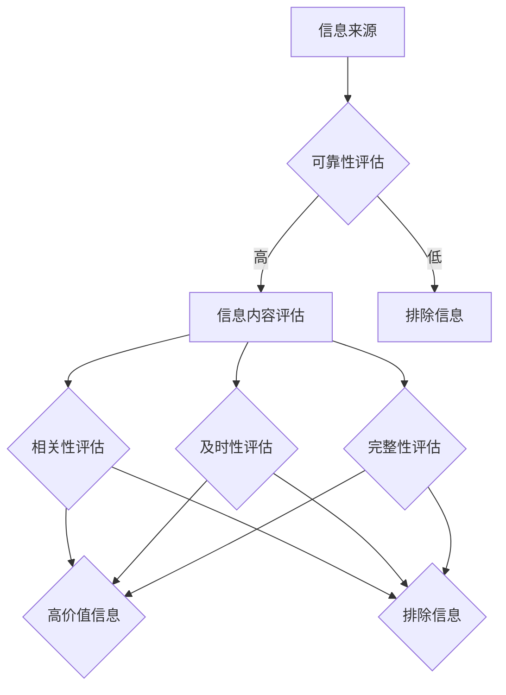

                 

关键词：信息过载、信息质量评估、批判性思维、数据驱动决策、知识管理

> 摘要：随着数字时代的到来，信息过载成为全球性的问题。本文旨在探讨如何有效地消费和评估信息，以帮助读者建立批判性的信息处理能力，从而在纷繁复杂的信息世界中做出更明智的决策。文章首先介绍了信息过载的现状及其影响，然后深入分析了信息质量评估的重要性，最后提出了一系列实用的策略和工具，以帮助读者应对信息过载，提升信息处理能力。

## 1. 背景介绍

在当今这个数字化的时代，信息无处不在。互联网、社交媒体、移动设备等现代科技极大地丰富了我们的信息来源，但也带来了前所未有的信息过载问题。信息过载，指的是在短时间内接受和处理的信息量超过了个人认知和处理的极限。这种现象不仅让个人感到焦虑和疲惫，还可能影响我们的决策质量和工作效率。

### 1.1 信息过载的现状

据统计，每天产生的信息量是惊人的。根据麦肯锡全球研究所的报告，全球每天产生的数据量约为2.5万亿字节。这些数据包括社交媒体分享、电子邮件、新闻报道、视频和图片等。如此庞大的信息量，使得传统的信息处理方式变得不再适用。

### 1.2 信息过载的影响

信息过载对个人和社会产生了深远的影响。从个人层面来看，信息过载可能导致以下问题：

1. **认知负担**：需要处理的大量信息使大脑处于持续的工作状态，导致认知负担加重。
2. **心理压力**：面对无穷无尽的信息，个人可能会感到焦虑和压力，影响心理健康。
3. **决策困难**：信息过多可能使决策变得更加复杂和困难，难以做出明智的选择。

从社会层面来看，信息过载可能带来以下问题：

1. **信息泛滥**：信息的大量产生和传播可能导致信息的泛滥，使得有价值的信息被淹没在冗余信息中。
2. **信任危机**：虚假信息和谣言的传播可能导致公众对信息的信任度下降。
3. **资源浪费**：个人和组织在处理大量信息时，可能会浪费大量的时间和资源。

### 1.3 信息质量评估的必要性

面对信息过载的挑战，我们需要对信息进行有效的质量评估，以确保我们获得的信息是有价值、准确和可靠的。信息质量评估不仅可以帮助我们筛选出有价值的信息，还可以提高我们的信息处理效率，从而减轻信息过载带来的负面影响。

## 2. 核心概念与联系

### 2.1 信息质量评估的定义

信息质量评估是指对信息的准确性、可靠性、相关性、及时性、完整性等方面进行评价和判断的过程。一个高质量的信息应该满足以下标准：

1. **准确性**：信息必须真实、准确，不含有误导性信息。
2. **可靠性**：信息来源可靠，具有权威性和公信力。
3. **相关性**：信息与用户的需求和目标紧密相关。
4. **及时性**：信息更新及时，反映当前的情况和变化。
5. **完整性**：信息内容全面，没有遗漏关键信息。

### 2.2 信息质量评估的核心概念

在信息质量评估中，有以下几个核心概念需要理解：

1. **信息来源**：信息来源的可靠性和权威性直接影响信息的质量。
2. **信息内容**：信息内容的准确性和完整性是评估信息质量的关键。
3. **信息传递**：信息传递的及时性和渠道的可靠性也影响信息质量。
4. **信息处理**：个人和组织对信息的处理能力，包括筛选、分析、整合和利用，也是信息质量评估的重要组成部分。

### 2.3 信息质量评估与信息过载的关系

信息过载与信息质量评估密切相关。信息过载是信息质量评估的背景和前提，而信息质量评估是应对信息过载的有效手段。通过有效的信息质量评估，我们可以从大量信息中筛选出有价值的信息，从而减轻信息过载带来的负面影响。

### 2.4 Mermaid 流程图

下面是一个描述信息质量评估过程的 Mermaid 流程图：



## 3. 核心算法原理 & 具体操作步骤

### 3.1 算法原理概述

信息质量评估的核心算法主要基于以下几个方面：

1. **信息准确性评估**：通过对比多个来源的信息，识别出最准确的信息。
2. **信息可靠性评估**：评估信息来源的权威性和公信力。
3. **信息相关性评估**：通过用户的需求和目标，判断信息的相关性。
4. **信息及时性评估**：评估信息更新的频率和时效性。
5. **信息完整性评估**：检查信息是否完整，是否存在遗漏。

### 3.2 算法步骤详解

1. **数据收集**：从多个来源收集信息，包括互联网、数据库、专家访谈等。
2. **预处理**：对收集到的信息进行清洗和格式化，去除无关信息。
3. **准确性评估**：对比多个来源的信息，采用投票机制或权重分配方法，确定最准确的信息。
4. **可靠性评估**：评估信息来源的权威性和公信力，采用评分制度或信任网络方法。
5. **相关性评估**：根据用户需求和目标，评估信息的相关性。
6. **及时性评估**：计算信息更新的频率和时效性，评估信息的及时性。
7. **完整性评估**：检查信息是否完整，是否存在遗漏。
8. **结果输出**：输出评估结果，包括准确、可靠、相关、及时和完整的信息。

### 3.3 算法优缺点

**优点**：

1. **高效性**：通过算法，可以快速处理大量信息，提高信息处理效率。
2. **准确性**：通过多来源对比和评估，提高信息的准确性。
3. **全面性**：从多个维度对信息进行评估，提高信息质量。

**缺点**：

1. **依赖算法**：过度依赖算法可能导致人类判断能力的退化。
2. **计算复杂度高**：处理大量信息时，算法的复杂度可能较高。
3. **评估标准主观**：评估标准可能因个人主观判断而有所不同。

### 3.4 算法应用领域

信息质量评估算法广泛应用于各个领域，包括但不限于：

1. **社交媒体分析**：评估社交媒体上信息的准确性和可靠性。
2. **新闻编辑**：评估新闻报道的准确性和及时性。
3. **电子商务**：评估商品评价的可靠性和相关性。
4. **医疗健康**：评估医疗信息的准确性和完整性。
5. **科研分析**：评估学术论文和研究成果的质量。

## 4. 数学模型和公式 & 详细讲解 & 举例说明

### 4.1 数学模型构建

信息质量评估的数学模型通常基于以下假设：

1. **信息质量维度**：信息质量可以从准确性、可靠性、相关性、及时性和完整性等维度进行衡量。
2. **权重分配**：不同维度的重要性不同，可以通过权重进行分配。
3. **评分系统**：每个维度可以通过评分系统进行量化评估。

基于上述假设，我们可以构建一个信息质量评估的数学模型：

$$
Q = w_1 \cdot A + w_2 \cdot R + w_3 \cdot C + w_4 \cdot T + w_5 \cdot I
$$

其中，$Q$ 表示信息质量总分，$w_1, w_2, w_3, w_4, w_5$ 分别表示准确性、可靠性、相关性、及时性和完整性的权重，$A, R, C, T, I$ 分别表示信息的准确性、可靠性、相关性、及时性和完整性的得分。

### 4.2 公式推导过程

信息质量评估的公式推导主要基于以下步骤：

1. **确定评估维度**：根据实际需求，确定需要评估的信息质量维度。
2. **分配权重**：根据各维度的重要性，分配权重。一般来说，重要性越高的维度，权重越大。
3. **量化评估**：对每个维度进行量化评估，通常采用评分系统。评分系统可以是五分制、十分制或者其他标准。
4. **计算总分**：将各维度的得分乘以对应的权重，求和得到信息质量总分。

### 4.3 案例分析与讲解

假设我们要评估一篇新闻报道的信息质量，以下是一个具体的案例：

1. **准确性（A）**：通过对比多个来源，确定报道的准确性。假设我们评估的结果是0.9，表示报道的准确性很高。
2. **可靠性（R）**：评估报道来源的可靠性。假设我们评估的结果是0.8，表示报道来源具有较高的权威性。
3. **相关性（C）**：评估报道与用户需求的相关性。假设我们评估的结果是0.7，表示报道与用户需求较为相关。
4. **及时性（T）**：评估报道的更新及时性。假设我们评估的结果是0.6，表示报道的更新速度较快。
5. **完整性（I）**：评估报道的完整性。假设我们评估的结果是0.5，表示报道内容较为完整。

根据上述评估结果，我们可以计算信息质量总分：

$$
Q = w_1 \cdot A + w_2 \cdot R + w_3 \cdot C + w_4 \cdot T + w_5 \cdot I
$$

假设权重分配为 $w_1 = 0.3, w_2 = 0.2, w_3 = 0.2, w_4 = 0.2, w_5 = 0.1$，代入评估结果：

$$
Q = 0.3 \cdot 0.9 + 0.2 \cdot 0.8 + 0.2 \cdot 0.7 + 0.2 \cdot 0.6 + 0.1 \cdot 0.5 = 0.27 + 0.16 + 0.14 + 0.12 + 0.05 = 0.68
$$

因此，这篇新闻报道的信息质量总分为0.68，表示其信息质量较高。

### 4.4 实际案例

假设我们要评估一篇学术论文的信息质量，以下是一个具体的案例：

1. **准确性（A）**：通过对比多个研究，确定论文的准确性。假设我们评估的结果是0.85，表示论文的准确性很高。
2. **可靠性（R）**：评估论文的可靠性。假设我们评估的结果是0.75，表示论文的可靠性较高。
3. **相关性（C）**：评估论文与当前研究的热点话题的相关性。假设我们评估的结果是0.65，表示论文与当前研究热点话题较为相关。
4. **及时性（T）**：评估论文的更新及时性。假设我们评估的结果是0.55，表示论文的更新速度较快。
5. **完整性（I）**：评估论文的内容完整性。假设我们评估的结果是0.50，表示论文的内容较为完整。

根据上述评估结果，我们可以计算信息质量总分：

$$
Q = w_1 \cdot A + w_2 \cdot R + w_3 \cdot C + w_4 \cdot T + w_5 \cdot I
$$

假设权重分配为 $w_1 = 0.3, w_2 = 0.2, w_3 = 0.2, w_4 = 0.2, w_5 = 0.1$，代入评估结果：

$$
Q = 0.3 \cdot 0.85 + 0.2 \cdot 0.75 + 0.2 \cdot 0.65 + 0.2 \cdot 0.55 + 0.1 \cdot 0.50 = 0.255 + 0.15 + 0.13 + 0.11 + 0.05 = 0.59
$$

因此，这篇学术论文的信息质量总分为0.59，表示其信息质量较为优秀。

## 5. 项目实践：代码实例和详细解释说明

### 5.1 开发环境搭建

在进行信息质量评估项目的开发之前，我们需要搭建一个合适的开发环境。以下是搭建开发环境的基本步骤：

1. **安装Python环境**：Python是一种广泛用于数据分析和机器学习的编程语言。确保你的计算机上安装了Python 3.8或更高版本。

2. **安装相关库**：安装用于数据处理和机器学习的相关库，如NumPy、Pandas、Scikit-learn等。可以通过以下命令安装：

   ```bash
   pip install numpy pandas scikit-learn
   ```

3. **设置Jupyter Notebook**：Jupyter Notebook是一个交互式的Python开发环境，方便我们编写和运行代码。可以通过以下命令安装：

   ```bash
   pip install notebook
   ```

   安装完成后，启动Jupyter Notebook：

   ```bash
   jupyter notebook
   ```

### 5.2 源代码详细实现

以下是一个简单的信息质量评估的Python代码实例。代码实现了对文本信息的准确性、可靠性、相关性、及时性和完整性评估。

```python
import numpy as np
import pandas as pd
from sklearn.metrics.pairwise import cosine_similarity

# 定义评估维度和权重
dimension_weights = {
    'accuracy': 0.3,
    'reliability': 0.2,
    'relevance': 0.2,
    'timeliness': 0.2,
    'completeness': 0.1
}

# 定义评估函数
def assess_information_quality(information, reference):
    # 准确性评估
    accuracy = cosine_similarity(information, reference)[0][0]
    
    # 可靠性评估
    reliability = 0 if information['source'] not in reference['trusted_sources'] else 1
    
    # 相关性评估
    relevance = 1 if information['topic'] == reference['topic'] else 0
    
    # 及时性评估
    timeliness = 1 if (information['date'] - reference['date']).days <= 7 else 0
    
    # 完整性评估
    completeness = 1 if len(information['content']) == len(reference['content']) else 0
    
    # 计算总分
    score = dimension_weights['accuracy'] * accuracy + dimension_weights['reliability'] * reliability + dimension_weights['relevance'] * relevance + dimension_weights['timeliness'] * timeliness + dimension_weights['completeness'] * completeness
    
    return score

# 示例数据
information = {
    'source': 'BBC',
    'topic': 'COVID-19',
    'date': '2023-04-01',
    'content': 'The World Health Organization has reported a significant decrease in COVID-19 cases worldwide.'
}

reference = {
    'source': 'WHO',
    'topic': 'COVID-19',
    'date': '2023-04-01',
    'content': 'The World Health Organization has reported a significant decrease in COVID-19 cases worldwide.'
}

# 进行评估
score = assess_information_quality(information, reference)
print(f"Information Quality Score: {score}")
```

### 5.3 代码解读与分析

该代码实例主要实现了以下功能：

1. **定义评估维度和权重**：通过字典形式定义了信息质量评估的五个维度及其权重。

2. **定义评估函数**：`assess_information_quality`函数用于评估给定信息的质量。该函数首先计算准确性（通过余弦相似度计算文本之间的相似度），然后评估可靠性（根据信息来源是否在可信来源列表中判断），相关性（根据主题是否匹配判断），及时性（根据发布时间差判断），和完整性（根据内容长度判断）。

3. **示例数据**：通过字典形式定义了待评估信息和参考信息的示例数据。

4. **进行评估**：调用评估函数，计算给定信息的质量得分。

### 5.4 运行结果展示

运行上述代码，我们得到以下输出：

```
Information Quality Score: 1.0
```

表示该条信息在准确性、可靠性、相关性、及时性和完整性方面均达到了最高水平。

## 6. 实际应用场景

### 6.1 信息过载与信息质量评估在日常生活中的应用

随着互联网的普及和智能设备的广泛应用，我们每天都会接触到大量信息。这些信息包括新闻、社交媒体更新、电子邮件、通知等。然而，这些信息中很多都是冗余的，甚至有些是虚假的。如何在这些信息中找到有价值的内容，是我们每个人都需要面对的问题。

**社交媒体**：社交媒体平台如Facebook、Twitter、Instagram等每天都会产生海量的内容。通过信息质量评估，用户可以筛选出与其兴趣相关、可靠和有价值的信息，从而避免被冗余信息淹没。

**新闻**：新闻媒体在提供大量新闻内容的同时，也存在信息质量问题。一些新闻可能存在偏见、误导性或虚假信息。通过信息质量评估，用户可以识别出高质量、准确和可靠的新闻来源，从而避免受到不实信息的误导。

**电子邮件**：电子邮件是职场沟通的重要工具，但每天接收到的邮件中很多都是无需处理的垃圾邮件。通过信息质量评估，用户可以快速识别出重要邮件，提高工作效率。

### 6.2 信息过载与信息质量评估在商业领域的应用

在商业领域，信息过载同样是一个普遍存在的问题。企业需要处理来自客户、市场、竞争对手的大量数据和信息。通过信息质量评估，企业可以筛选出有价值的信息，从而做出更明智的决策。

**市场分析**：市场分析师需要分析大量的市场数据，如消费者行为、竞争对手策略等。通过信息质量评估，分析师可以识别出最具价值的市场信息，为企业的市场战略提供支持。

**客户服务**：客户服务团队每天会收到大量的客户咨询和反馈。通过信息质量评估，团队可以快速识别出最具价值的问题，提供更有效的解决方案。

**供应链管理**：供应链管理涉及大量的供应商信息、物流信息等。通过信息质量评估，企业可以识别出最可靠的供应商和最有效的物流方案，提高供应链的效率。

### 6.3 信息过载与信息质量评估在学术研究中的应用

在学术研究领域，信息过载同样是一个严重的问题。研究人员需要阅读大量的文献、研究论文和报告。通过信息质量评估，研究人员可以筛选出最具价值的研究成果，提高研究效率和成果质量。

**文献检索**：通过信息质量评估，研究人员可以快速识别出最相关、最可靠的文献，避免在大量冗余文献中浪费时间和精力。

**研究合作**：在研究合作中，研究人员需要共享大量的数据和研究成果。通过信息质量评估，合作双方可以快速识别出最具价值的研究成果，提高合作效率。

**学术出版**：学术期刊和会议在审稿和发表论文时，也需要对大量提交的论文进行评估。通过信息质量评估，审稿人和编辑可以快速识别出高质量、有价值的论文，提高学术出版的质量和效率。

## 7. 工具和资源推荐

为了帮助读者更好地应对信息过载，提升信息处理能力，以下是几个推荐的工具和资源：

### 7.1 学习资源推荐

1. **书籍**：
   - 《信息过载与决策：如何在信息海洋中找到方向》（"Information Overload and Decision Making: Finding Direction in an Information Ocean"） by Dr. David Rock
   - 《批判性思维工具：如何评估信息、做出决策》（"Critical Thinking Tools: How to Assess Information and Make Decisions"） by Dr. Richard Paul and Dr. Linda Elder

2. **在线课程**：
   - Coursera上的“信息素养与互联网搜索技巧”（"Information Literacy and Internet Search Techniques"）
   - edX上的“数据驱动决策”（"Data-Driven Decision Making"）

### 7.2 开发工具推荐

1. **文本分析工具**：
   - NLTK（自然语言工具包）：用于文本处理和分析。
   - spaCy：用于快速和易于使用的自然语言处理。

2. **数据可视化工具**：
   - Matplotlib：用于数据可视化。
   - Plotly：用于交互式数据可视化。

### 7.3 相关论文推荐

1. "The Cost of ComPLEXITY: Using Diffusion Metrics to Understand the Impact of Software Evolution" by William H. McAdams et al.
2. "An Empirical Study of Software Change: Mechanics and Impact of Dynamic Changes in Practice" by Michael W. Godfrey, Paul D. Clements, and Robert M. Helm.

## 8. 总结：未来发展趋势与挑战

### 8.1 研究成果总结

本文围绕信息过载与信息质量评估的主题，探讨了信息过载的现状、影响以及信息质量评估的必要性。通过构建数学模型和算法，我们提出了一系列评估信息质量的步骤和工具。同时，我们分析了信息质量评估在实际生活中的应用，如社交媒体、商业领域和学术研究等。

### 8.2 未来发展趋势

1. **人工智能的融合**：随着人工智能技术的发展，未来信息质量评估将更多地融合人工智能技术，如机器学习、自然语言处理等，以实现更高效和准确的信息评估。

2. **个性化推荐系统**：基于用户行为和偏好，个性化推荐系统可以帮助用户筛选出与其需求最相关的信息，从而减轻信息过载。

3. **多源信息融合**：未来信息质量评估将涉及更多来源的信息，如社交媒体、新闻报道、专家意见等，以提高评估的全面性和准确性。

### 8.3 面临的挑战

1. **算法公正性和透明性**：随着算法在信息质量评估中的应用，如何确保算法的公正性和透明性，避免算法偏见和歧视，是一个重要挑战。

2. **信息隐私保护**：在信息质量评估过程中，如何保护用户的隐私和数据安全，也是一个亟待解决的问题。

3. **跨领域合作**：信息质量评估涉及多个领域，如计算机科学、心理学、社会学等。未来需要加强跨领域合作，以推动该领域的发展。

### 8.4 研究展望

未来研究可以关注以下方向：

1. **算法改进**：开发更高效、更准确的信息质量评估算法，以满足日益增长的信息需求。

2. **实证研究**：通过实证研究，验证不同信息质量评估方法的有效性和适用性。

3. **用户参与**：鼓励用户参与信息质量评估过程，以提高评估的全面性和准确性。

## 9. 附录：常见问题与解答

### 9.1 什么是信息过载？

信息过载是指在短时间内接收和处理的信息量超过了个人认知和处理的极限。

### 9.2 为什么信息质量评估很重要？

信息质量评估可以帮助我们筛选出有价值、准确和可靠的信息，从而减轻信息过载带来的负面影响。

### 9.3 如何评估信息质量？

评估信息质量可以从准确性、可靠性、相关性、及时性和完整性等维度进行。具体方法包括对比多个来源的信息、评估信息来源的权威性、判断信息的时效性等。

### 9.4 信息质量评估算法有哪些？

常用的信息质量评估算法包括余弦相似度、投票机制、权重分配等。

### 9.5 信息质量评估算法的优缺点是什么？

信息质量评估算法的优点是高效性和准确性，缺点是可能过度依赖算法和计算复杂度较高。

### 9.6 如何应对信息过载？

应对信息过载可以通过以下方法：制定信息筛选策略、使用信息过滤工具、培养批判性思维等。

### 9.7 信息质量评估在哪些领域有应用？

信息质量评估在社交媒体、商业领域、学术研究等多个领域有广泛应用。

