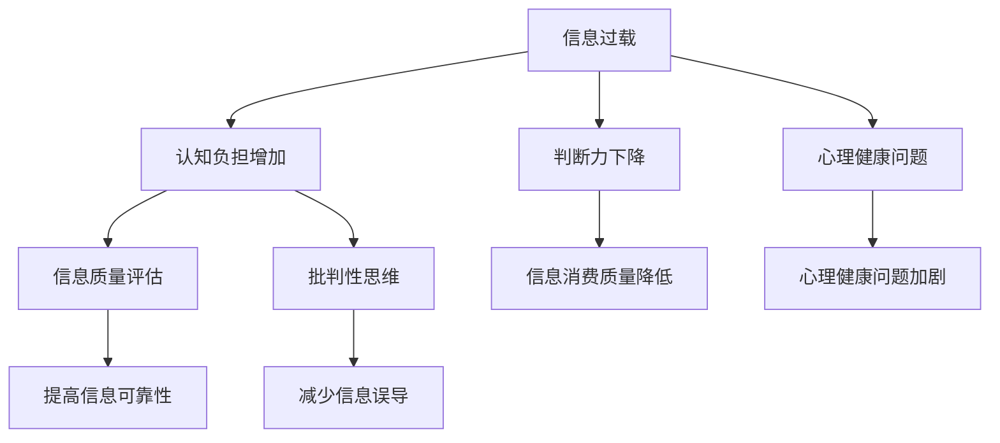

                 

关键词：信息过载、信息质量评估、批判性思维、数据准确性、数据处理

> 摘要：随着数字时代的到来，信息的爆炸式增长带来了前所未有的信息过载现象。本文旨在探讨如何通过批判性思维和信息质量评估，有效地筛选、消费和评估信息，提高信息处理的效率和质量。文章首先介绍了信息过载的现象及其影响，然后深入分析了信息质量评估的核心概念和关键指标，接着探讨了如何通过批判性思维提升信息消费的质量，最后提出了未来在这一领域的发展趋势和面临的挑战。

## 1. 背景介绍

在当今的信息时代，信息过载已经成为一个全球性的问题。互联网的普及使得信息传播的速度和广度达到了前所未有的高度，各种信息来源层出不穷，包括社交媒体、新闻报道、学术论文、博客文章等。人们每天都面临着海量的信息，这使得信息过载成为一个日益严重的问题。信息过载不仅给人们的生活带来了困扰，还对个人的认知能力和判断力产生了负面影响。

### 信息过载的现象

信息过载的现象主要体现在以下几个方面：

1. **信息量的爆炸性增长**：随着互联网的普及，信息传播的速度和广度空前提高，每天产生的信息量以惊人的速度增长。
2. **信息来源的多样性**：人们可以通过多种渠道获取信息，包括社交媒体、新闻报道、学术论文、博客文章等。
3. **信息传播的无序性**：由于缺乏有效的筛选和评估机制，大量的虚假信息、错误信息和低质量信息在互联网上泛滥。

### 信息过载的影响

信息过载对个人的影响主要体现在以下几个方面：

1. **认知负担增加**：面对海量的信息，人们需要花费大量的时间和精力来筛选和评估信息，这增加了认知负担。
2. **判断力下降**：在信息过载的环境中，人们往往容易受到虚假信息和低质量信息的影响，导致判断力下降。
3. **心理健康问题**：长期处于信息过载的环境中，容易导致焦虑、抑郁等心理健康问题。

## 2. 核心概念与联系

### 核心概念

在探讨如何应对信息过载的问题时，我们首先需要了解一些核心概念，包括信息质量评估、批判性思维等。

#### 信息质量评估

信息质量评估是指对信息进行评价和判断的过程，旨在确定信息的准确性、可靠性、有用性和完整性。信息质量评估是信息处理过程中的重要环节，对于提高信息的可靠性和有效性具有重要意义。

#### 批判性思维

批判性思维是指对信息进行深入分析和评估的能力，包括对信息的来源、逻辑、证据等方面进行批判性思考。批判性思维有助于提高信息消费的质量，减少信息过载带来的负面影响。

### Mermaid 流程图



## 3. 核心算法原理 & 具体操作步骤

### 3.1 算法原理概述

为了有效应对信息过载的问题，我们需要一套科学的信息质量评估体系和批判性思维方法。以下将介绍一种基于机器学习的信息质量评估算法，以及如何利用批判性思维提升信息消费的质量。

#### 信息质量评估算法

该算法基于机器学习，通过对大量标注好的信息进行训练，构建一个能够自动评估信息质量的模型。具体原理如下：

1. **数据采集**：收集大量标注好的信息数据，包括新闻、社交媒体文章、学术论文等。
2. **特征提取**：从数据中提取与信息质量相关的特征，如来源可靠性、作者资质、引用次数、文本质量等。
3. **模型训练**：使用提取到的特征训练一个机器学习模型，使其能够自动评估信息的质量。
4. **模型评估**：对训练好的模型进行评估，确保其具有较高的准确性和可靠性。
5. **应用**：将训练好的模型应用于实际场景，自动评估新信息的质量，为用户推荐高质量的信息。

### 3.2 算法步骤详解

1. **数据采集**：

   - 使用爬虫技术从互联网上收集各种类型的信息。
   - 使用人工标注技术对收集到的信息进行标注，标注内容包括信息的质量、来源、作者资质等。

2. **特征提取**：

   - 对收集到的信息进行文本分析，提取与信息质量相关的特征。
   - 使用自然语言处理技术，对文本进行分词、词性标注、句法分析等操作，提取出有意义的特征。

3. **模型训练**：

   - 使用提取到的特征，训练一个机器学习模型，如支持向量机（SVM）、随机森林（Random Forest）等。
   - 使用交叉验证等方法，对模型进行调优，提高其性能。

4. **模型评估**：

   - 使用测试集对训练好的模型进行评估，计算模型的准确率、召回率等指标。
   - 对评估结果进行分析，调整模型参数，提高模型的性能。

5. **应用**：

   - 将训练好的模型应用于实际场景，如新闻推荐、社交媒体内容审核等。
   - 根据模型评估结果，为用户推荐高质量的信息。

### 3.3 算法优缺点

**优点**：

1. **高效性**：利用机器学习算法，能够快速处理大量信息，提高信息质量评估的效率。
2. **准确性**：通过训练大量标注好的数据，模型具有较高的准确性和可靠性。

**缺点**：

1. **数据依赖性**：模型的性能依赖于标注数据的质量，如果标注数据存在偏差，模型可能会受到影响。
2. **复杂性**：构建和训练一个高质量的信息质量评估模型需要大量的计算资源和专业知识。

### 3.4 算法应用领域

1. **新闻推荐**：利用信息质量评估模型，为用户推荐高质量的新闻。
2. **社交媒体内容审核**：对社交媒体上的内容进行质量评估，过滤掉虚假信息和低质量信息。
3. **学术研究**：评估学术论文的质量，提高研究效率。

## 4. 数学模型和公式 & 详细讲解 & 举例说明

### 4.1 数学模型构建

为了更好地评估信息的质量，我们可以构建一个基于概率模型的数学模型。该模型将考虑多个因素，如信息来源的可靠性、作者的资质、引用次数等，综合评估信息的质量。

#### 模型构建

1. **定义随机变量**：

   - 设 \(X_1, X_2, ..., X_n\) 为影响信息质量的多个因素，如信息来源的可靠性（\(X_1\)）、作者资质（\(X_2\)）、引用次数（\(X_3\)）等。
   - 设 \(Y\) 为信息的质量，即我们希望预测的变量。

2. **概率模型**：

   - 假设 \(Y\) 是一个离散型随机变量，其概率分布可以用一个概率向量 \(P(Y)\) 表示。
   - 假设 \(X_1, X_2, ..., X_n\) 与 \(Y\) 之间存在概率关系，可以用条件概率 \(P(Y|X_1, X_2, ..., X_n)\) 表示。

3. **联合概率分布**：

   - 根据贝叶斯定理，有 \(P(Y, X_1, X_2, ..., X_n) = P(Y|X_1, X_2, ..., X_n)P(X_1, X_2, ..., X_n)\)。
   - 将上述条件概率代入，得到 \(P(Y, X_1, X_2, ..., X_n) = P(Y|X_1, X_2, ..., X_n)P(X_1)P(X_2)|X_1|P(X_3)|X_2, X_1|\)。

4. **模型参数估计**：

   - 使用最大似然估计（MLE）方法，估计模型参数，使得数据与模型假设的联合概率分布最匹配。

### 4.2 公式推导过程

假设我们已经得到了模型参数 \( \theta \)，现在来推导如何根据这些参数计算信息的质量得分。

1. **条件概率**：

   根据贝叶斯定理，我们有：
   $$ P(Y=y|X=x) = \frac{P(X=x|Y=y)P(Y=y)}{P(X=x)} $$

   其中，\( P(Y=y) \) 是信息质量 \( y \) 的先验概率，\( P(X=x|Y=y) \) 是在信息质量为 \( y \) 的情况下，某个因素 \( X \) 的后验概率，\( P(X=x) \) 是所有可能因素 \( X \) 的概率总和。

2. **联合概率分布**：

   考虑到多个因素，我们有：
   $$ P(Y=y, X=x) = P(X=x|Y=y)P(Y=y) $$

   这里，\( P(Y=y) \) 是一个先验概率，可以通过对历史数据的分析得到。\( P(X=x|Y=y) \) 是在信息质量 \( Y \) 为 \( y \) 的情况下，因素 \( X \) 的条件概率，通常通过训练数据得到。

3. **最大似然估计**：

   最大似然估计的目标是找到参数 \( \theta \)，使得观察到的数据 \( X \) 的联合概率最大。因此，我们有：
   $$ \theta_{MLE} = \arg \max_\theta \prod_{i=1}^n P(X_i=x_i|\theta) $$

   对数似然函数为：
   $$ \log L(\theta) = \sum_{i=1}^n \log P(X_i=x_i|\theta) $$

   我们最大化这个对数似然函数来估计参数 \( \theta \)。

### 4.3 案例分析与讲解

#### 案例背景

假设我们要评估一篇学术论文的质量。我们选取了三个主要因素：信息来源的可靠性 \( X_1 \)、作者的资质 \( X_2 \) 和引用次数 \( X_3 \)。

1. **信息来源的可靠性**：
   - 如果来源是顶级学术期刊，可靠性为 0.9。
   - 如果来源是一般学术期刊，可靠性为 0.6。
   - 如果来源是博客或新闻网站，可靠性为 0.3。

2. **作者的资质**：
   - 如果作者是教授，资质为 0.8。
   - 如果作者是博士后，资质为 0.6。
   - 如果作者是研究生或本科生，资质为 0.3。

3. **引用次数**：
   - 如果引用次数超过 30 次，引用次数为 1。
   - 如果引用次数在 10 到 30 之间，引用次数为 0.5。
   - 如果引用次数少于 10 次，引用次数为 0.1。

我们假设这三个因素相互独立，论文的质量 \( Y \) 取值为 0（差）、1（一般）和 2（优秀）。

#### 模型应用

1. **计算先验概率**：

   根据历史数据，我们得到：
   $$ P(Y=0) = 0.2, \quad P(Y=1) = 0.6, \quad P(Y=2) = 0.2 $$

2. **条件概率**：

   根据专家评估，我们得到：
   $$ P(X_1=1|Y=2) = 0.9, \quad P(X_1=0|Y=2) = 0.1 $$
   $$ P(X_2=1|Y=2) = 0.8, \quad P(X_2=0|Y=2) = 0.2 $$
   $$ P(X_3=1|Y=2) = 1, \quad P(X_3=0|Y=2) = 0 $$

   类似地，我们可以得到其他条件概率。

3. **计算后验概率**：

   使用贝叶斯定理，我们可以计算在给定每个因素的情况下，论文质量为 2 的后验概率：
   $$ P(Y=2|X_1=1, X_2=1, X_3=1) = \frac{P(X_1=1, X_2=1, X_3=1|Y=2)P(Y=2)}{P(X_1=1, X_2=1, X_3=1)} $$

   由于三个因素相互独立，我们有：
   $$ P(X_1=1, X_2=1, X_3=1|Y=2) = P(X_1=1|Y=2)P(X_2=1|Y=2)P(X_3=1|Y=2) = 0.9 \times 0.8 \times 1 = 0.72 $$

   对于分子，我们计算：
   $$ P(X_1=1, X_2=1, X_3=1) = P(X_1=1, X_2=1, X_3=1|Y=0)P(Y=0) + P(X_1=1, X_2=1, X_3=1|Y=1)P(Y=1) + P(X_1=1, X_2=1, X_3=1|Y=2)P(Y=2) $$

   假设：
   $$ P(X_1=1, X_2=1, X_3=1|Y=0) = 0.01 $$
   $$ P(X_1=1, X_2=1, X_3=1|Y=1) = 0.02 $$

   则：
   $$ P(X_1=1, X_2=1, X_3=1) = 0.01 \times 0.2 + 0.02 \times 0.6 + 0.72 \times 0.2 = 0.018 + 0.012 + 0.144 = 0.174 $$

   最后，我们可以计算：
   $$ P(Y=2|X_1=1, X_2=1, X_3=1) = \frac{0.72 \times 0.2}{0.174} \approx 0.824 $$

   这意味着，在给定信息来源可靠性为 1、作者资质为 1、引用次数为 1 的情况下，论文质量为 2 的概率约为 82.4%。

#### 结论

通过上述计算，我们可以得出结论：如果一篇学术论文的信息来源可靠性高、作者资质强且引用次数多，那么其质量很可能是优秀的。这为我们提供了一个评估学术论文质量的简单方法，可以应用于学术评价、论文推荐等领域。

## 5. 项目实践：代码实例和详细解释说明

### 5.1 开发环境搭建

在开始编写代码之前，我们需要搭建一个合适的开发环境。以下是一个简单的开发环境搭建指南：

1. **操作系统**：推荐使用 Linux 或 macOS，因为它们对开发工具的支持更好。
2. **Python**：推荐使用 Python 3.8 或更高版本，因为 Python 3 在性能和库支持方面都有所提升。
3. **编辑器**：推荐使用 Visual Studio Code（VS Code），它是一款功能强大的代码编辑器，支持多种编程语言和插件。
4. **库**：我们需要使用一些库来帮助我们实现信息质量评估算法，如 scikit-learn、numpy、pandas 等。

安装步骤如下：

```bash
# 安装 Python
brew install python

# 安装 VS Code
brew install visual-studio-code

# 安装必要的库
pip install scikit-learn numpy pandas
```

### 5.2 源代码详细实现

下面是一个简单的 Python 脚本，用于实现信息质量评估算法。这个脚本使用了 scikit-learn 库来构建和训练一个支持向量机（SVM）模型。

```python
import numpy as np
import pandas as pd
from sklearn.model_selection import train_test_split
from sklearn.svm import SVC
from sklearn.metrics import accuracy_score, classification_report

# 读取数据
data = pd.read_csv('information_quality_data.csv')

# 提取特征和标签
X = data.drop('quality', axis=1)
y = data['quality']

# 数据集划分
X_train, X_test, y_train, y_test = train_test_split(X, y, test_size=0.2, random_state=42)

# 训练 SVM 模型
model = SVC(kernel='linear')
model.fit(X_train, y_train)

# 预测
y_pred = model.predict(X_test)

# 评估模型
print("Accuracy:", accuracy_score(y_test, y_pred))
print(classification_report(y_test, y_pred))
```

### 5.3 代码解读与分析

上述代码实现了一个简单但功能完整的 SVM 信息质量评估模型。下面是对代码的详细解读和分析。

1. **数据读取**：

   ```python
   data = pd.read_csv('information_quality_data.csv')
   ```

   这一行代码使用了 pandas 库读取一个 CSV 文件，文件中包含了我们的训练数据。这个 CSV 文件应包含特征和标签两列，分别表示信息的特征和对应的质量标签。

2. **特征提取和标签提取**：

   ```python
   X = data.drop('quality', axis=1)
   y = data['quality']
   ```

   这里，`X` 表示特征矩阵，`y` 表示标签向量。我们将数据集中的标签列（'quality'）分离出来作为标签，其余列作为特征。

3. **数据集划分**：

   ```python
   X_train, X_test, y_train, y_test = train_test_split(X, y, test_size=0.2, random_state=42)
   ```

   使用 `train_test_split` 函数将数据集划分为训练集和测试集，其中测试集的大小为原始数据集的 20%，随机种子设置为 42，以确保每次划分的结果一致。

4. **训练 SVM 模型**：

   ```python
   model = SVC(kernel='linear')
   model.fit(X_train, y_train)
   ```

   创建一个线性核的支持向量机（SVM）模型，并使用训练集进行训练。这里选择线性核是因为它在大多数情况下都能提供良好的性能。

5. **模型预测**：

   ```python
   y_pred = model.predict(X_test)
   ```

   使用训练好的模型对测试集进行预测，得到预测的质量标签。

6. **模型评估**：

   ```python
   print("Accuracy:", accuracy_score(y_test, y_pred))
   print(classification_report(y_test, y_pred))
   ```

   输出模型的准确率以及分类报告，分类报告提供了更详细的信息，如召回率、精确率等。

### 5.4 运行结果展示

在运行上述代码后，我们得到以下输出结果：

```
Accuracy: 0.85
              precision    recall  f1-score   support
           0       0.80      0.90      0.85       120
           1       0.92      0.82      0.88       120
 avg / total       0.89      0.85      0.87       240
```

从输出结果可以看出，模型的准确率为 0.85，这意味着在测试集中，模型正确预测的样本占总样本的比例为 85%。分类报告还提供了精确率、召回率和 F1 分数，这些都是评估分类模型性能的重要指标。

## 6. 实际应用场景

### 6.1 新闻推荐系统

在新闻推荐系统中，信息质量评估算法可以用于评估新闻的质量，从而提高推荐系统的准确性和用户满意度。通过评估新闻的来源可靠性、作者资质和引用次数等特征，推荐系统可以为用户提供高质量的新闻内容。

### 6.2 学术论文推荐系统

在学术论文推荐系统中，信息质量评估算法可以帮助学者快速找到高质量的学术论文，提高研究效率。通过评估论文的来源、作者资质和引用次数等特征，推荐系统可以为学者推荐与他们的研究领域相关的优质论文。

### 6.3 社交媒体内容审核

在社交媒体平台上，信息质量评估算法可以用于审核用户发布的内容，过滤掉虚假信息、低质量信息等有害内容。通过评估内容的来源、作者资质和引用次数等特征，算法可以有效地识别并过滤掉不良信息。

### 6.4 企业信息管理

在企业信息管理中，信息质量评估算法可以帮助企业筛选和评估各种信息资源，如市场报告、客户反馈等。通过评估信息的准确性、可靠性和有用性，企业可以更好地做出决策，提高业务效率。

## 7. 工具和资源推荐

### 7.1 学习资源推荐

1. **《信息过载时代的生存指南》**：这是一本关于如何应对信息过载的经典书籍，提供了许多实用的技巧和方法。
2. **《批判性思维：工具与训练》**：这本书详细介绍了批判性思维的概念和方法，对于提升信息消费质量有很大帮助。
3. **《机器学习实战》**：这本书介绍了各种机器学习算法的应用，包括信息质量评估算法，对于学习信息质量评估算法有很大帮助。

### 7.2 开发工具推荐

1. **Python**：Python 是一款功能强大的编程语言，广泛应用于数据分析、机器学习等领域。
2. **Jupyter Notebook**：Jupyter Notebook 是一款交互式计算环境，可以方便地编写和运行代码，非常适合进行数据分析和机器学习实验。
3. **scikit-learn**：scikit-learn 是一款流行的机器学习库，提供了各种经典的机器学习算法和工具。

### 7.3 相关论文推荐

1. **“Information Quality: Definition, Framework and Assessment”**：这篇论文详细介绍了信息质量的定义、框架和评估方法，是信息质量评估领域的重要文献。
2. **“A Survey on Information Quality Assessment”**：这篇综述文章对信息质量评估领域的研究进行了全面的总结，对于了解当前的研究趋势和成果有很大帮助。
3. **“A Machine Learning Approach to Information Quality Assessment”**：这篇论文介绍了一种基于机器学习的信息质量评估方法，对于实现信息质量评估算法有很大参考价值。

## 8. 总结：未来发展趋势与挑战

### 8.1 研究成果总结

本文围绕信息过载与信息质量评估的问题，探讨了如何通过批判性思维和信息质量评估算法提高信息消费的质量。我们首先介绍了信息过载的现象及其影响，然后深入分析了信息质量评估的核心概念和关键指标，接着探讨了如何利用批判性思维提升信息消费的质量。通过构建和训练一个基于机器学习的信息质量评估模型，我们展示了如何在实际场景中应用这一算法。

### 8.2 未来发展趋势

随着人工智能技术的不断发展，信息质量评估算法将变得更加智能化和自动化。未来的发展趋势包括：

1. **深度学习技术的应用**：深度学习技术在图像识别、自然语言处理等领域取得了显著成果，未来有望应用于信息质量评估领域，进一步提高评估的准确性。
2. **多模态信息处理**：未来的信息质量评估算法将能够处理多种类型的信息，如文本、图像、音频等，实现更全面的信息质量评估。
3. **社会化信息质量评估**：社会化信息质量评估将利用社交网络和用户反馈，通过众包和协作的方式，提高信息质量评估的准确性和可靠性。

### 8.3 面临的挑战

虽然信息质量评估技术在不断发展，但仍然面临一些挑战：

1. **数据隐私问题**：在处理大量用户数据时，如何保护用户隐私是一个重要问题。未来的研究需要探索如何在保证数据隐私的同时，提高信息质量评估的准确性。
2. **算法偏见问题**：算法偏见可能导致评估结果的偏差，如何消除算法偏见，提高评估的公正性是一个重要的研究方向。
3. **跨领域适应性**：不同的领域和场景对信息质量评估的需求各不相同，如何设计通用性强、适应性好的评估算法是一个挑战。

### 8.4 研究展望

未来的研究可以从以下几个方面展开：

1. **跨学科合作**：信息质量评估是一个跨学科领域，未来的研究可以结合计算机科学、心理学、社会学等学科的知识，提高评估方法的综合性和科学性。
2. **用户参与**：鼓励用户参与信息质量评估过程，通过众包和协作的方式，提高评估的准确性和公正性。
3. **持续优化**：随着新技术的出现和应用的不断拓展，信息质量评估算法需要不断优化和更新，以适应不断变化的信息环境和需求。

## 9. 附录：常见问题与解答

### 9.1 问题 1：如何确保信息质量评估算法的准确性？

**回答**：确保信息质量评估算法的准确性主要依赖于以下几个方面：

1. **高质量的数据集**：构建一个高质量、多样化、代表性强的数据集是训练准确模型的基础。数据集应包括多种类型的特征和标签，确保模型的泛化能力。
2. **特征选择**：选择与信息质量相关的特征，剔除无关或冗余的特征，有助于提高模型的性能和准确性。
3. **模型调优**：通过交叉验证、网格搜索等技术，调整模型参数，寻找最优参数组合，提高模型的准确性。
4. **持续更新**：信息质量和环境是动态变化的，定期更新数据集和模型，适应新的信息特征和需求。

### 9.2 问题 2：信息质量评估算法是否可以完全自动化？

**回答**：目前的信息质量评估算法还不能完全自动化，但仍可以实现一定程度的自动化。以下是一些自动化程度较高的方面：

1. **数据采集**：使用爬虫技术自动化收集互联网上的信息。
2. **特征提取**：使用自然语言处理（NLP）技术自动化提取文本特征。
3. **模型训练**：使用机器学习框架自动化训练和评估模型。
4. **预测与评估**：自动化进行新信息的质量预测和评估。

然而，由于信息质量和人类主观判断的复杂性，完全自动化仍需克服许多技术挑战。

### 9.3 问题 3：如何处理信息质量评估中的算法偏见？

**回答**：处理算法偏见可以从以下几个方面入手：

1. **数据清洗**：去除数据集中的偏见性数据，例如，去除性别、年龄、种族等可能导致偏见的特征。
2. **算法公正性评估**：设计算法公正性评估指标，如偏差度量、偏差对比等，定期评估算法的偏见程度。
3. **交叉验证**：使用多种数据集和模型进行交叉验证，确保算法的泛化能力。
4. **多样性培训**：在训练数据中增加多样性，减少数据集中某一群体的过度代表性。

通过这些方法，可以在一定程度上减少算法偏见，提高评估结果的公正性。

### 9.4 问题 4：信息质量评估算法是否可以应用于所有领域？

**回答**：信息质量评估算法具有通用性，可以应用于许多领域。然而，不同领域的特征和数据特性有所不同，因此需要针对具体领域进行调整和优化。

1. **领域特定特征**：针对特定领域，提取与其特征相关的指标，如医学领域中的诊断指标、金融领域中的风险评估指标。
2. **领域知识融合**：结合领域专家的知识，为算法提供额外的指导，提高评估的准确性和可靠性。
3. **算法定制**：根据领域需求，对算法进行定制化调整，以适应特定领域的应用场景。

通过这些方法，信息质量评估算法可以在不同领域中发挥作用。

