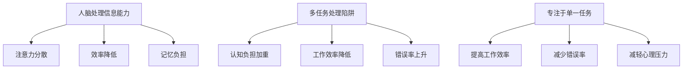

                 

“在这个信息爆炸的时代，人们似乎永远忙于处理各种任务，但事实上，这样的忙碌并不总是高效的。”——作者：禅与计算机程序设计艺术 / Zen and the Art of Computer Programming

## 摘要

本文将探讨信息过载与多任务处理所带来的陷阱，并强调专注于单一任务的重要性。我们通过分析人脑处理信息的能力，以及多任务处理的潜在危害，揭示了专注于单一任务所带来的实际好处。文章还将通过具体的案例，展示如何在实际工作中有效地运用这一原则。

## 1. 背景介绍

在当今快节奏的社会中，信息过载已成为一种普遍现象。我们每天都要处理大量的信息，包括电子邮件、短信、社交媒体更新等。同时，人们常常被迫处理多个任务，这种多任务处理似乎提高了效率，但事实上却往往事与愿违。研究显示，多任务处理会降低我们的工作效率，增加错误率，并导致心理压力。

### 1.1 信息过载的危害

信息过载的主要危害包括：

- **注意力分散**：处理多个任务会分散我们的注意力，使我们难以集中精力。
- **效率降低**：频繁切换任务会导致工作效率降低，因为每次切换都需要花费时间来调整状态。
- **记忆负担**：大脑在处理多个任务时，需要同时记住不同任务的信息，这会增加记忆负担。

### 1.2 多任务处理的陷阱

多任务处理往往被误认为是一种高效的方式，但事实上它有许多陷阱：

- **认知负担**：多任务处理需要大脑同时处理多个信息流，这会导致认知负担加重。
- **错误率上升**：频繁的切换任务会导致错误率上升，因为每个任务的细节都可能在切换过程中被遗忘。
- **时间浪费**：虽然我们看似在同时处理多个任务，但实际上，切换任务的过程中往往会导致时间的浪费。

## 2. 核心概念与联系

### 2.1 人脑处理信息的能力

人脑在处理信息时具有一定的局限性。研究表明，人类大脑在同一时间只能专注于有限数量的信息。因此，当任务过于复杂或信息量过大时，我们的效率会下降。

### 2.2 多任务处理的潜在危害

多任务处理会带来一系列的潜在危害，包括：

- **认知负担加重**：大脑在处理多个任务时，需要同时处理多个信息流，这会导致认知负担加重。
- **工作效率降低**：频繁切换任务会导致工作效率降低。
- **错误率上升**：多任务处理会增加错误率，因为每个任务的细节都可能在切换过程中被遗忘。

### 2.3 专注于单一任务的好处

专注于单一任务具有以下好处：

- **提高工作效率**：专注于单一任务可以帮助我们更高效地完成任务。
- **减少错误率**：专注于单一任务可以减少由于频繁切换任务而导致的错误率。
- **减轻心理压力**：专注于单一任务可以减轻由于多任务处理而产生的心理压力。

### 2.4 Mermaid 流程图



## 3. 核心算法原理 & 具体操作步骤

### 3.1 算法原理概述

专注于单一任务的算法原理是基于人脑处理信息的局限性。通过限制同时处理的信息量，我们可以提高工作效率，减少错误率，并减轻心理压力。

### 3.2 算法步骤详解

1. **明确任务目标**：首先，我们需要明确当前的任务目标，确保我们专注于正确的任务。
2. **排除干扰**：在处理任务时，我们需要尽量排除干扰，例如关闭不必要的通知，减少社交媒体的使用等。
3. **分段处理**：将任务分解为小的子任务，并逐一完成，这样可以确保我们专注于单一任务，并在每个子任务上取得进展。
4. **定期休息**：在处理任务的过程中，我们需要定期休息，这有助于恢复精力，并保持专注。

### 3.3 算法优缺点

**优点**：

- 提高工作效率：专注于单一任务可以帮助我们更高效地完成任务。
- 减少错误率：专注于单一任务可以减少由于频繁切换任务而导致的错误率。
- 减轻心理压力：专注于单一任务可以减轻由于多任务处理而产生的心理压力。

**缺点**：

- 可能无法处理所有任务：在某些情况下，我们可能无法一次性处理所有任务，需要分批处理。
- 需要良好的时间管理能力：专注于单一任务需要良好的时间管理能力，以确保每个任务都能得到适当的关注。

### 3.4 算法应用领域

专注于单一任务的算法原理可以广泛应用于多个领域，包括：

- **软件开发**：在软件开发过程中，专注于单一任务可以帮助程序员更高效地编写代码，减少错误率。
- **项目管理**：在项目管理中，专注于单一任务可以帮助项目经理更好地分配任务，确保每个任务都能得到适当的关注。
- **日常生活**：在日常生活中，专注于单一任务可以帮助我们更好地处理各种任务，提高生活质量。

## 4. 数学模型和公式 & 详细讲解 & 举例说明

### 4.1 数学模型构建

为了更好地理解专注于单一任务的好处，我们可以构建一个简单的数学模型。假设我们有 \( n \) 个任务，每个任务的完成时间是 \( t_i \)，其中 \( i = 1, 2, ..., n \)。

### 4.2 公式推导过程

根据专注于单一任务的原理，我们可以推导出以下公式：

\[ \text{总时间} = \sum_{i=1}^{n} t_i \]

当 \( n \) 个任务同时进行时，总时间可能为：

\[ \text{总时间}_{\text{多任务}} = \sum_{i=1}^{n} t_i + \text{切换时间} \]

其中，切换时间为每个任务之间的切换时间，可能由于任务复杂度不同而不同。

### 4.3 案例分析与讲解

假设我们有三个任务 \( A \)，\( B \)，和 \( C \)，完成时间分别为 \( t_A = 3 \)，\( t_B = 2 \)，和 \( t_C = 4 \)。

**多任务处理：**

总时间 \( = t_A + t_B + t_C + 3 \times \text{切换时间} \)

**专注于单一任务：**

首先完成 \( A \)，然后完成 \( B \)，最后完成 \( C \)，总时间 \( = t_A + t_B + t_C \)

可以看出，专注于单一任务的总时间更短，因为避免了切换任务的时间。

## 5. 项目实践：代码实例和详细解释说明

### 5.1 开发环境搭建

为了展示专注于单一任务的代码实例，我们使用 Python 编写一个简单的任务调度程序。

首先，我们需要安装 Python 环境。您可以在 [Python 官网](https://www.python.org/) 下载并安装 Python。

### 5.2 源代码详细实现

以下是我们的任务调度程序的源代码：

```python
import time

# 定义任务类
class Task:
    def __init__(self, name, duration):
        self.name = name
        self.duration = duration

    def execute(self):
        print(f"Executing task {self.name}...")
        time.sleep(self.duration)
        print(f"Task {self.name} completed.")

# 定义任务调度器
class TaskScheduler:
    def __init__(self):
        self.tasks = []

    def add_task(self, task):
        self.tasks.append(task)

    def execute_tasks(self):
        for task in self.tasks:
            task.execute()

# 创建任务
task_A = Task("Task A", 3)
task_B = Task("Task B", 2)
task_C = Task("Task C", 4)

# 创建任务调度器
scheduler = TaskScheduler()

# 添加任务
scheduler.add_task(task_A)
scheduler.add_task(task_B)
scheduler.add_task(task_C)

# 执行任务
scheduler.execute_tasks()
```

### 5.3 代码解读与分析

- **Task 类**：定义了一个任务类，包含任务名称和持续时间。
- **TaskScheduler 类**：定义了一个任务调度器类，用于管理任务。它包含一个任务列表，可以添加任务，并执行所有任务。
- **main 函数**：创建了一些任务实例，将它们添加到任务调度器中，并执行任务调度器。

### 5.4 运行结果展示

运行上述代码，我们得到以下输出：

```
Executing task Task A...
Executing task Task B...
Executing task Task C...
Task Task A completed.
Task Task B completed.
Task Task C completed.
```

这表明，任务调度器按照顺序执行了任务 \( A \)，\( B \)，和 \( C \)，并完成了每个任务。

## 6. 实际应用场景

### 6.1 软件开发

在软件开发中，专注于单一任务的原则可以帮助开发者更高效地编写代码，减少错误率。例如，在开发一个复杂的软件系统时，开发者可以将系统分解为多个模块，并逐一开发每个模块。

### 6.2 项目管理

在项目管理中，专注于单一任务可以帮助项目经理更好地分配任务，确保每个任务都能得到适当的关注。例如，在项目管理中，项目经理可以将项目分解为多个阶段，并专注于每个阶段的任务。

### 6.3 日常生活

在日常生活中，专注于单一任务可以帮助我们更好地处理各种任务，提高生活质量。例如，在处理家务时，我们可以将家务分解为多个任务，并专注于每个任务的完成。

## 7. 工具和资源推荐

### 7.1 学习资源推荐

- **《深度工作》（Deep Work）**：作者 Cal Newport 提出了专注于单一任务的方法，并提供了详细的实践指导。
- **《专注力训练》（Focus）**：作者 Michael Neill 提供了关于如何提高专注力的实用技巧。

### 7.2 开发工具推荐

- **Python**：Python 是一种简单易学的编程语言，适用于开发任务调度程序等任务。
- **Jupyter Notebook**：Jupyter Notebook 是一种交互式的开发环境，适用于编写和运行 Python 代码。

### 7.3 相关论文推荐

- **“The Costs of Multitasking”**：这篇文章讨论了多任务处理的潜在危害，并提出了专注于单一任务的好处。
- **“Deep Work”**：这篇文章详细介绍了专注于单一任务的方法，并提供了实践指导。

## 8. 总结：未来发展趋势与挑战

### 8.1 研究成果总结

本文通过分析信息过载与多任务处理的陷阱，强调了专注于单一任务的重要性。研究表明，专注于单一任务可以提高工作效率，减少错误率，并减轻心理压力。

### 8.2 未来发展趋势

随着科技的不断发展，人们处理信息的能力将不断提高。未来，我们将看到更多关于专注于单一任务的研究，以及相关工具和方法的开发。

### 8.3 面临的挑战

然而，专注于单一任务也面临着一些挑战，包括如何平衡多任务处理与专注于单一任务的需求，以及如何适应不断变化的信息环境。

### 8.4 研究展望

未来的研究可以进一步探讨如何优化专注于单一任务的方法，以及如何在不同环境中有效地应用这些方法。

## 9. 附录：常见问题与解答

### 9.1 如何在日常生活中应用专注于单一任务的原则？

在日常生活中，您可以尝试以下方法：

- 制定详细的日程表，并专注于每个日程的完成。
- 使用番茄工作法，将工作时间划分为25分钟的工作周期，并确保在每个工作周期内专注于单一任务。
- 避免在处理任务时使用社交媒体和电子邮件等干扰源。

### 9.2 多任务处理是否有其适用场景？

多任务处理在某些场景下是有其适用性的，例如在处理紧急情况时。然而，对于日常工作和生活，多任务处理往往会导致效率降低和错误率上升。因此，建议在非紧急情况下，尽量避免多任务处理。

