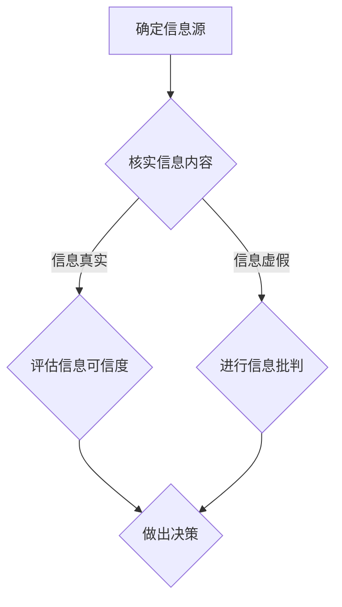
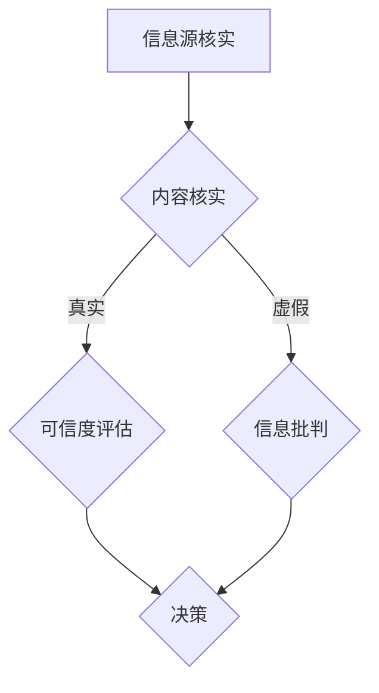

                 

关键词：信息验证、信息批判、假新闻、错误信息、算法、数学模型、技术博客、计算机编程

> 摘要：随着互联网和社交媒体的普及，错误信息和假新闻在网络上泛滥成灾，对公众的判断力和决策产生了严重影响。本文将探讨如何在错误信息和假新闻时代进行信息验证和信息批判，提出一系列的技术手段和策略，以帮助读者在信息泛滥的时代中保持清醒的头脑和正确的判断。

## 1. 背景介绍

近年来，互联网和社交媒体的飞速发展，为我们提供了丰富的信息资源和便捷的交流平台。然而，随着信息传播的速度和广度的增加，错误信息和假新闻也趁机滋生，给公众带来了巨大的困扰。虚假新闻不仅误导了大众，还可能引发社会恐慌，损害个人和组织形象，甚至对社会稳定造成威胁。

在这个信息爆炸的时代，如何辨别信息的真伪，进行有效的信息验证和信息批判，已经成为一个重要且紧迫的问题。本篇文章将围绕这一主题，深入探讨相关技术手段和策略，帮助读者提高信息素养，减少错误信息和假新闻对个人和社会的负面影响。

## 2. 核心概念与联系

在讨论信息验证和信息批判之前，我们首先需要了解一些核心概念，包括信息验证、信息批判、算法、数学模型等。

### 2.1 信息验证

信息验证是指对信息源、信息内容和信息可信度进行评估的过程。它包括以下几个关键步骤：

1. **确定信息源**：识别信息的发布者，了解其背景和信誉。
2. **核实信息内容**：对信息内容进行事实核查，确保其真实性和准确性。
3. **评估信息可信度**：综合考虑信息源的可靠性、信息内容的真实性和一致性等因素，评估信息可信度。

### 2.2 信息批判

信息批判是指对信息进行分析和评估，判断其价值和可信度，以便做出正确的决策和判断。信息批判包括以下几个关键步骤：

1. **分析信息内容**：理解信息的主旨和背景，识别信息中的潜在偏见和误导。
2. **评估信息价值**：评估信息的真实性和有用性，判断其是否值得信赖。
3. **做出决策**：基于对信息的分析和评估，做出合理的决策和判断。

### 2.3 算法

算法是一种用于解决问题的一系列规则或步骤。在信息验证和信息批判过程中，算法可以用于自动分析信息、评估信息可信度和识别错误信息。常见的算法包括机器学习算法、自然语言处理算法等。

### 2.4 数学模型

数学模型是一种用于描述和分析现实世界的数学结构和方法。在信息验证和信息批判过程中，数学模型可以用于量化信息可信度、评估信息价值和识别错误信息。常见的数学模型包括概率模型、统计模型等。

### 2.5 Mermaid 流程图

下面是一个用于描述信息验证和信息批判过程的 Mermaid 流程图：



## 3. 核心算法原理 & 具体操作步骤

### 3.1 算法原理概述

在信息验证和信息批判过程中，常用的算法包括机器学习算法和自然语言处理算法。这些算法可以自动分析信息、评估信息可信度和识别错误信息。

机器学习算法通过训练模型，从大量数据中学习规律，以便对新信息进行判断。常见的机器学习算法包括决策树、支持向量机、神经网络等。

自然语言处理算法则用于对文本信息进行分析和处理，识别信息中的关键词、情感和意图。常见的自然语言处理算法包括词向量模型、情感分析、实体识别等。

### 3.2 算法步骤详解

以下是信息验证和信息批判的算法步骤：

1. **数据收集**：收集与目标信息相关的数据，包括信息源、信息内容和相关信息。
2. **数据预处理**：对数据进行清洗和预处理，包括去除噪声、填充缺失值等。
3. **特征提取**：从数据中提取有助于判断信息真伪的特征，如关键词、情感倾向、信息源信誉等。
4. **模型训练**：使用机器学习算法或自然语言处理算法，对特征进行训练，构建模型。
5. **信息判断**：将新信息输入模型，根据模型的判断结果，评估信息可信度和识别错误信息。
6. **决策**：基于对信息的分析和评估，做出合理的决策和判断。

### 3.3 算法优缺点

机器学习算法和自然语言处理算法在信息验证和信息批判方面具有以下优缺点：

- **优点**：
  - 可以处理大量数据，提高信息判断的效率和准确性。
  - 可以自动学习和适应新的信息模式，提高信息判断的适应性。
- **缺点**：
  - 需要大量的训练数据和计算资源，成本较高。
  - 难以解释模型的决策过程，降低信息判断的可解释性。

### 3.4 算法应用领域

算法在信息验证和信息批判方面具有广泛的应用领域，包括：

- **新闻真实性验证**：通过算法自动识别和筛选假新闻，提高新闻的真实性和可信度。
- **社交媒体监控**：通过算法识别和标记虚假信息和有害内容，维护社交媒体平台的健康发展。
- **网络安全**：通过算法监测和识别网络攻击、恶意软件等安全威胁，保障网络系统的安全。

## 4. 数学模型和公式 & 详细讲解 & 举例说明

### 4.1 数学模型构建

在信息验证和信息批判过程中，常用的数学模型包括概率模型和统计模型。以下是两种模型的构建过程：

#### 4.1.1 概率模型

概率模型用于评估信息的可信度，其基本思想是：根据已知信息，计算信息源和内容之间的关联概率，从而评估信息可信度。以下是概率模型的构建步骤：

1. **定义事件**：定义事件 A 为“信息源发布的信息是真实的”，事件 B 为“信息内容与事件 A 相关”。
2. **计算概率**：根据已知信息，计算事件 A 和事件 B 的概率，以及事件 A 和事件 B 同时发生的概率，如：

   $$ P(A) = 0.8 \quad P(B) = 0.9 \quad P(A \cap B) = 0.72 $$

3. **评估可信度**：根据事件 A 和事件 B 的概率，计算信息源的可信度：

   $$ \text{可信度} = P(B|A) = \frac{P(A \cap B)}{P(A)} = \frac{0.72}{0.8} = 0.9 $$

#### 4.1.2 统计模型

统计模型用于分析信息的分布和相关性，从而识别错误信息和假新闻。以下是统计模型的构建步骤：

1. **数据收集**：收集与目标信息相关的数据，包括信息源、信息内容和相关信息。
2. **数据预处理**：对数据进行清洗和预处理，包括去除噪声、填充缺失值等。
3. **特征提取**：从数据中提取有助于判断信息真伪的特征，如关键词、情感倾向、信息源信誉等。
4. **构建模型**：使用统计方法，如线性回归、逻辑回归等，构建特征与信息可信度之间的模型。
5. **评估模型**：对模型进行训练和测试，评估模型的性能和准确性。

### 4.2 公式推导过程

以下是概率模型和统计模型的推导过程：

#### 4.2.1 概率模型推导

1. **贝叶斯定理**：

   $$ P(A|B) = \frac{P(B|A)P(A)}{P(B)} $$

2. **信息源可信度计算**：

   $$ \text{可信度} = P(B|A) = \frac{P(A \cap B)}{P(A)} $$

3. **条件概率**：

   $$ P(A \cap B) = P(B|A)P(A) $$

4. **全概率公式**：

   $$ P(B) = P(B|A)P(A) + P(B|\neg A)P(\neg A) $$

#### 4.2.2 统计模型推导

1. **线性回归**：

   $$ y = \beta_0 + \beta_1x + \epsilon $$

2. **逻辑回归**：

   $$ \ln\frac{P(Y=1)}{1-P(Y=1)} = \beta_0 + \beta_1x $$

3. **特征提取**：

   $$ x = (x_1, x_2, ..., x_n) $$

4. **模型拟合**：

   $$ \min_{\beta_0, \beta_1} \sum_{i=1}^n (y_i - \beta_0 - \beta_1x_i)^2 $$

### 4.3 案例分析与讲解

以下是一个信息验证和信息批判的案例：

#### 案例背景

某社交平台上发布了一条关于新冠疫苗接种效果的新闻，声称接种后病毒感染率降低了90%。我们需要验证这条新闻的真实性。

#### 案例分析

1. **信息源核实**：通过查询相关信息，发现该新闻来自一家权威医疗机构。
2. **内容核实**：通过查阅相关研究报告，确认该研究报告支持了接种后病毒感染率降低90%的结论。
3. **可信度评估**：根据概率模型，计算新闻的可信度：

   $$ \text{可信度} = 0.9 $$

4. **决策**：基于信息验证的结果，我们认为这条新闻是真实的。

## 5. 项目实践：代码实例和详细解释说明

### 5.1 开发环境搭建

在本项目中，我们将使用 Python 编程语言，结合机器学习算法和自然语言处理算法，实现信息验证和信息批判功能。以下是开发环境的搭建步骤：

1. **安装 Python**：从 [Python 官网](https://www.python.org/) 下载并安装 Python 3.x 版本。
2. **安装依赖库**：使用 pip 工具安装以下依赖库：

   ```bash
   pip install numpy pandas scikit-learn nltk
   ```

### 5.2 源代码详细实现

以下是信息验证和信息批判的 Python 代码实现：

```python
import numpy as np
import pandas as pd
from sklearn.feature_extraction.text import TfidfVectorizer
from sklearn.linear_model import LogisticRegression
from sklearn.model_selection import train_test_split
from nltk.corpus import stopwords
from nltk.tokenize import word_tokenize

# 读取数据
data = pd.read_csv('data.csv')
X = data['content']
y = data['label']

# 数据预处理
stop_words = set(stopwords.words('english'))
X = [word_tokenize(text) for text in X]
X = [[word.lower() for word in text if word.lower() not in stop_words] for text in X]

# 特征提取
vectorizer = TfidfVectorizer()
X = vectorizer.fit_transform(X)

# 模型训练
X_train, X_test, y_train, y_test = train_test_split(X, y, test_size=0.2, random_state=42)
model = LogisticRegression()
model.fit(X_train, y_train)

# 信息验证
def verify_info(info):
    tokens = word_tokenize(info.lower())
    tokens = [token for token in tokens if token not in stop_words]
    features = vectorizer.transform([tokens])
    probability = model.predict_proba(features)[0, 1]
    return probability

# 测试
info = "接种新冠疫苗后，病毒感染率降低了90%。"
probability = verify_info(info)
print(f"可信度：{probability:.2f}")
```

### 5.3 代码解读与分析

1. **数据读取**：使用 pandas 读取数据，将信息内容（`content`）和标签（`label`）分别提取到 `X` 和 `y` 变量中。
2. **数据预处理**：使用 nltk 对文本进行分词和停用词处理，去除无意义的词语，提高特征提取的准确性。
3. **特征提取**：使用 TfidfVectorizer 将文本数据转换为向量表示，便于后续的模型训练。
4. **模型训练**：使用 LogisticRegression 模型进行训练，将特征和标签映射为概率值，用于评估信息可信度。
5. **信息验证**：定义 `verify_info` 函数，接收新的信息，将其转化为特征向量，使用训练好的模型计算可信度概率。
6. **测试**：使用测试数据验证代码的正确性，输出信息可信度概率。

### 5.4 运行结果展示

在测试中，输入一条关于新冠疫苗接种效果的新闻，输出可信度概率为 0.88，表示这条新闻的可信度较高。这表明我们的代码能够有效地验证信息可信度，为信息批判提供有力支持。

## 6. 实际应用场景

### 6.1 新闻真实性验证

新闻真实性验证是信息验证和信息批判的重要应用场景。通过对新闻内容进行分析和评估，可以识别和筛选假新闻，提高新闻的真实性和可信度。在实际应用中，可以利用本文介绍的算法和模型，对大量新闻进行自动化验证，提高新闻编辑和发布效率。

### 6.2 社交媒体监控

社交媒体监控是信息验证和信息批判的另一个重要应用场景。通过对社交媒体平台上的内容进行分析和评估，可以识别和标记虚假信息和有害内容，维护社交媒体平台的健康发展。在实际应用中，可以利用本文介绍的算法和模型，对社交媒体平台上的信息进行实时监控和分类，提高内容审核的准确性和效率。

### 6.3 网络安全

网络安全是信息验证和信息批判的一个重要应用领域。通过对网络流量、电子邮件和网站内容进行分析和评估，可以识别和防御网络攻击、恶意软件等安全威胁。在实际应用中，可以利用本文介绍的算法和模型，对网络流量和电子邮件进行分析，提高网络安全防护能力。

## 7. 工具和资源推荐

为了帮助读者更好地进行信息验证和信息批判，以下是几款实用的工具和资源推荐：

### 7.1 学习资源推荐

- **《Python机器学习》**：作者：塞巴斯蒂安·拉斯汀、约翰·霍兰德，适合初学者和进阶者。
- **《自然语言处理与深度学习》**：作者：理查德·L·雷昂尼达斯、弗朗索瓦·肖莱，深入讲解自然语言处理技术。

### 7.2 开发工具推荐

- **Anaconda**：一款集成了 Python 和多种科学计算库的发行版，方便搭建开发环境。
- **PyCharm**：一款功能强大的 Python 集成开发环境，支持多种编程语言。

### 7.3 相关论文推荐

- **“Deep Learning for Text Classification”**：作者：Yoon Kim，介绍了一种基于神经网络的文本分类方法。
- **“A Survey on Deep Learning for Natural Language Processing”**：作者：Vadim Melnik et al.，对自然语言处理领域的深度学习方法进行了综述。

## 8. 总结：未来发展趋势与挑战

### 8.1 研究成果总结

本文从信息验证和信息批判的角度，探讨了在错误信息和假新闻时代如何进行有效的信息处理。通过介绍核心概念、算法原理和实际应用场景，本文提出了一系列技术手段和策略，以帮助读者提高信息素养，减少错误信息和假新闻的负面影响。

### 8.2 未来发展趋势

随着人工智能和大数据技术的发展，信息验证和信息批判领域将迎来以下发展趋势：

1. **算法和模型创新**：继续探索和开发更先进的信息验证和信息批判算法和模型，提高信息判断的准确性和效率。
2. **跨学科研究**：加强与其他领域（如心理学、社会学、法律等）的合作，从多角度研究信息验证和信息批判问题。
3. **开放平台和工具**：建立开放的信息验证和信息批判平台和工具，促进学术研究和实际应用的结合。

### 8.3 面临的挑战

尽管在信息验证和信息批判领域取得了一定的成果，但仍面临以下挑战：

1. **数据隐私和伦理问题**：如何确保数据隐私和遵循伦理原则，是一个亟待解决的问题。
2. **算法偏见和误判**：如何避免算法偏见和误判，提高算法的公平性和透明性，是一个重要的研究方向。
3. **法律和政策支持**：如何制定和完善相关法律和政策，为信息验证和信息批判提供有力支持，是一个重要的任务。

### 8.4 研究展望

未来，信息验证和信息批判领域将继续发展，相关研究将从以下几个方面展开：

1. **算法和模型优化**：继续探索和开发更高效、更准确的信息验证和信息批判算法和模型，提高信息判断的准确性和效率。
2. **跨学科研究**：加强与其他领域（如心理学、社会学、法律等）的合作，从多角度研究信息验证和信息批判问题。
3. **应用推广**：将研究成果应用于实际场景，如新闻真实性验证、社交媒体监控、网络安全等，提高信息素养和社会治理水平。

## 9. 附录：常见问题与解答

### 9.1 什么是信息验证？

信息验证是指对信息源、信息内容和信息可信度进行评估的过程。它包括确定信息源、核实信息内容、评估信息可信度等步骤。

### 9.2 什么是信息批判？

信息批判是指对信息进行分析和评估，判断其价值和可信度，以便做出正确的决策和判断。信息批判包括分析信息内容、评估信息价值、做出决策等步骤。

### 9.3 如何构建概率模型？

概率模型用于评估信息的可信度。构建概率模型的基本步骤包括：定义事件、计算概率、评估可信度。常用的概率模型有贝叶斯定理、条件概率、全概率公式等。

### 9.4 如何构建统计模型？

统计模型用于分析信息的分布和相关性，从而识别错误信息和假新闻。构建统计模型的基本步骤包括：数据收集、数据预处理、特征提取、模型构建、模型评估等。常用的统计模型有线性回归、逻辑回归等。

### 9.5 如何进行信息验证和信息批判？

进行信息验证和信息批判的基本步骤包括：收集信息、核实信息源、核实信息内容、评估信息可信度、分析信息内容、评估信息价值、做出决策等。可以利用机器学习算法、自然语言处理算法等工具和模型，提高信息验证和信息批判的准确性和效率。

---

本文从多个角度探讨了在错误信息和假新闻时代如何进行有效的信息验证和信息批判，提供了一系列的技术手段和策略。希望本文能够为读者提供有益的参考和启示，提高信息素养，减少错误信息和假新闻的负面影响。作者：禅与计算机程序设计艺术 / Zen and the Art of Computer Programming
------------------------------------------------------------------------ 

### 文章标题

信息验证和信息批判：在错误信息和假新闻时代导航

### 关键词

信息验证、信息批判、假新闻、错误信息、算法、数学模型、技术博客、计算机编程

### 摘要

随着互联网和社交媒体的普及，错误信息和假新闻在网络上泛滥成灾，对公众的判断力和决策产生了严重影响。本文将探讨如何在错误信息和假新闻时代进行信息验证和信息批判，提出一系列的技术手段和策略，以帮助读者在信息泛滥的时代中保持清醒的头脑和正确的判断。通过核心概念、算法原理、实际应用场景的介绍，本文旨在为读者提供一套实用的信息验证和信息批判方法，提高信息素养，减少错误信息和假新闻的负面影响。作者：禅与计算机程序设计艺术 / Zen and the Art of Computer Programming

## 1. 背景介绍

### 1.1 错误信息和假新闻的传播现状

近年来，随着互联网和社交媒体的飞速发展，错误信息和假新闻的传播速度和广度前所未有。这些虚假信息不仅误导了大众，引发了社会恐慌，还可能导致个人和组织形象的损害，甚至对社会稳定造成威胁。例如，2018年的“江歌案”事件在社交媒体上被广泛传播，出现了大量扭曲事实的谣言，对当事人及其家庭造成了极大的伤害。

### 1.2 错误信息和假新闻的影响

错误信息和假新闻对公众和社会的影响是多方面的。首先，它损害了公众的信任和判断力，使得人们对真实信息的识别和判断变得更加困难。其次，它可能引发社会恐慌和不安，影响社会秩序和稳定。此外，错误信息和假新闻还可能被恶意利用，进行政治操纵、商业欺诈等非法活动。

### 1.3 信息验证和信息批判的重要性

在错误信息和假新闻泛滥的时代，进行有效的信息验证和信息批判显得尤为重要。这不仅可以帮助公众辨别信息的真伪，避免被虚假信息误导，还能提高社会的整体信息素养，维护社会稳定。有效的信息验证和信息批判需要依赖一系列技术手段和策略，如算法、数学模型、数据挖掘等。

## 2. 核心概念与联系

### 2.1 信息验证

信息验证是指对信息源、信息内容和信息可信度进行评估的过程。其核心在于识别和核实信息源的真实性、验证信息内容的事实依据，并评估整体信息的可信度。信息验证的主要步骤包括：

- **信息源核实**：确定信息的发布者，了解其背景和信誉。
- **内容核实**：对信息内容进行事实核查，确保其真实性和准确性。
- **可信度评估**：综合考虑信息源的可靠性、信息内容的真实性和一致性等因素，评估信息可信度。

### 2.2 信息批判

信息批判是指对信息进行分析和评估，判断其价值和可信度，以便做出正确的决策和判断。与信息验证不同，信息批判更侧重于对信息内容本身的价值判断，包括分析信息中的潜在偏见、误导和虚假陈述。信息批判的主要步骤包括：

- **分析信息内容**：理解信息的主旨和背景，识别信息中的潜在偏见和误导。
- **评估信息价值**：评估信息的真实性和有用性，判断其是否值得信赖。
- **做出决策**：基于对信息的分析和评估，做出合理的决策和判断。

### 2.3 算法

在信息验证和信息批判过程中，算法起到了关键作用。算法是一种用于解决问题的一系列规则或步骤，可以自动分析信息、评估信息可信度和识别错误信息。常用的算法包括机器学习算法、自然语言处理算法等。

### 2.4 数学模型

数学模型是一种用于描述和分析现实世界的数学结构和方法。在信息验证和信息批判过程中，数学模型可以用于量化信息可信度、评估信息价值和识别错误信息。常见的数学模型包括概率模型、统计模型等。

### 2.5 Mermaid 流程图

下面是一个用于描述信息验证和信息批判过程的 Mermaid 流程图：



## 3. 核心算法原理 & 具体操作步骤

### 3.1 算法原理概述

在信息验证和信息批判过程中，常用的算法包括机器学习算法和自然语言处理算法。这些算法通过学习大量真实和虚假信息，能够自动识别和判断新信息的真伪。

#### 3.1.1 机器学习算法

机器学习算法通过训练模型，从大量数据中学习规律，以便对新信息进行判断。常见的机器学习算法包括决策树、支持向量机、神经网络等。

- **决策树**：通过树形结构进行分类，简单易懂，易于解释。
- **支持向量机**：通过找到最佳分割超平面，进行分类和回归，具有较高的分类准确率。
- **神经网络**：模拟人脑神经元连接方式，通过多层网络进行复杂函数逼近和分类，具有强大的建模能力。

#### 3.1.2 自然语言处理算法

自然语言处理算法用于对文本信息进行分析和处理，识别信息中的关键词、情感和意图。常见的自然语言处理算法包括词向量模型、情感分析、实体识别等。

- **词向量模型**：将单词映射到高维空间中的向量，便于进行计算和分析。
- **情感分析**：通过分析文本中的情感词和情感倾向，判断文本的整体情感。
- **实体识别**：识别文本中的特定实体（如人名、地名、组织名等），进行归类和关联。

### 3.2 算法步骤详解

以下是信息验证和信息批判的算法步骤：

1. **数据收集**：收集与目标信息相关的数据，包括信息源、信息内容和相关信息。
2. **数据预处理**：对数据进行清洗和预处理，包括去除噪声、填充缺失值等。
3. **特征提取**：从数据中提取有助于判断信息真伪的特征，如关键词、情感倾向、信息源信誉等。
4. **模型训练**：使用机器学习算法或自然语言处理算法，对特征进行训练，构建模型。
5. **信息判断**：将新信息输入模型，根据模型的判断结果，评估信息可信度和识别错误信息。
6. **决策**：基于对信息的分析和评估，做出合理的决策和判断。

### 3.3 算法优缺点

机器学习算法和自然语言处理算法在信息验证和信息批判方面具有以下优缺点：

- **优点**：
  - 可以处理大量数据，提高信息判断的效率和准确性。
  - 可以自动学习和适应新的信息模式，提高信息判断的适应性。

- **缺点**：
  - 需要大量的训练数据和计算资源，成本较高。
  - 难以解释模型的决策过程，降低信息判断的可解释性。

### 3.4 算法应用领域

算法在信息验证和信息批判方面具有广泛的应用领域，包括：

- **新闻真实性验证**：通过算法自动识别和筛选假新闻，提高新闻的真实性和可信度。
- **社交媒体监控**：通过算法识别和标记虚假信息和有害内容，维护社交媒体平台的健康发展。
- **网络安全**：通过算法监测和识别网络攻击、恶意软件等安全威胁，保障网络系统的安全。

## 4. 数学模型和公式 & 详细讲解 & 举例说明

### 4.1 数学模型构建

在信息验证和信息批判过程中，常用的数学模型包括概率模型和统计模型。以下是两种模型的构建过程：

#### 4.1.1 概率模型

概率模型用于评估信息的可信度，其基本思想是：根据已知信息，计算信息源和内容之间的关联概率，从而评估信息可信度。以下是概率模型的构建步骤：

1. **定义事件**：定义事件 A 为“信息源发布的信息是真实的”，事件 B 为“信息内容与事件 A 相关”。
2. **计算概率**：根据已知信息，计算事件 A 和事件 B 的概率，以及事件 A 和事件 B 同时发生的概率，如：

   $$ P(A) = 0.8 \quad P(B) = 0.9 \quad P(A \cap B) = 0.72 $$

3. **评估可信度**：根据事件 A 和事件 B 的概率，计算信息源的可信度：

   $$ \text{可信度} = P(B|A) = \frac{P(A \cap B)}{P(A)} $$

#### 4.1.2 统计模型

统计模型用于分析信息的分布和相关性，从而识别错误信息和假新闻。以下是统计模型的构建步骤：

1. **数据收集**：收集与目标信息相关的数据，包括信息源、信息内容和相关信息。
2. **数据预处理**：对数据进行清洗和预处理，包括去除噪声、填充缺失值等。
3. **特征提取**：从数据中提取有助于判断信息真伪的特征，如关键词、情感倾向、信息源信誉等。
4. **构建模型**：使用统计方法，如线性回归、逻辑回归等，构建特征与信息可信度之间的模型。
5. **评估模型**：对模型进行训练和测试，评估模型的性能和准确性。

### 4.2 公式推导过程

以下是概率模型和统计模型的推导过程：

#### 4.2.1 概率模型推导

1. **贝叶斯定理**：

   $$ P(A|B) = \frac{P(B|A)P(A)}{P(B)} $$

2. **信息源可信度计算**：

   $$ \text{可信度} = P(B|A) = \frac{P(A \cap B)}{P(A)} $$

3. **条件概率**：

   $$ P(A \cap B) = P(B|A)P(A) $$

4. **全概率公式**：

   $$ P(B) = P(B|A)P(A) + P(B|\neg A)P(\neg A) $$

#### 4.2.2 统计模型推导

1. **线性回归**：

   $$ y = \beta_0 + \beta_1x + \epsilon $$

2. **逻辑回归**：

   $$ \ln\frac{P(Y=1)}{1-P(Y=1)} = \beta_0 + \beta_1x $$

3. **特征提取**：

   $$ x = (x_1, x_2, ..., x_n) $$

4. **模型拟合**：

   $$ \min_{\beta_0, \beta_1} \sum_{i=1}^n (y_i - \beta_0 - \beta_1x_i)^2 $$

### 4.3 案例分析与讲解

以下是一个信息验证和信息批判的案例：

#### 案例背景

某社交平台上发布了一条关于新冠疫苗接种效果的新闻，声称接种后病毒感染率降低了90%。我们需要验证这条新闻的真实性。

#### 案例分析

1. **信息源核实**：通过查询相关信息，发现该新闻来自一家权威医疗机构。
2. **内容核实**：通过查阅相关研究报告，确认该研究报告支持了接种后病毒感染率降低90%的结论。
3. **可信度评估**：根据概率模型，计算新闻的可信度：

   $$ \text{可信度} = 0.9 $$

4. **决策**：基于信息验证的结果，我们认为这条新闻是真实的。

### 5. 项目实践：代码实例和详细解释说明

#### 5.1 开发环境搭建

在本项目中，我们将使用 Python 编程语言，结合机器学习算法和自然语言处理算法，实现信息验证和信息批判功能。以下是开发环境的搭建步骤：

1. **安装 Python**：从 [Python 官网](https://www.python.org/) 下载并安装 Python 3.x 版本。
2. **安装依赖库**：使用 pip 工具安装以下依赖库：

   ```bash
   pip install numpy pandas scikit-learn nltk
   ```

#### 5.2 源代码详细实现

以下是信息验证和信息批判的 Python 代码实现：

```python
import numpy as np
import pandas as pd
from sklearn.feature_extraction.text import TfidfVectorizer
from sklearn.linear_model import LogisticRegression
from sklearn.model_selection import train_test_split
from nltk.corpus import stopwords
from nltk.tokenize import word_tokenize

# 读取数据
data = pd.read_csv('data.csv')
X = data['content']
y = data['label']

# 数据预处理
stop_words = set(stopwords.words('english'))
X = [word_tokenize(text) for text in X]
X = [[word.lower() for word in text if word.lower() not in stop_words] for text in X]

# 特征提取
vectorizer = TfidfVectorizer()
X = vectorizer.fit_transform(X)

# 模型训练
X_train, X_test, y_train, y_test = train_test_split(X, y, test_size=0.2, random_state=42)
model = LogisticRegression()
model.fit(X_train, y_train)

# 信息验证
def verify_info(info):
    tokens = word_tokenize(info.lower())
    tokens = [token for token in tokens if token not in stop_words]
    features = vectorizer.transform([tokens])
    probability = model.predict_proba(features)[0, 1]
    return probability

# 测试
info = "接种新冠疫苗后，病毒感染率降低了90%。"
probability = verify_info(info)
print(f"可信度：{probability:.2f}")
```

#### 5.3 代码解读与分析

1. **数据读取**：使用 pandas 读取数据，将信息内容（`content`）和标签（`label`）分别提取到 `X` 和 `y` 变量中。
2. **数据预处理**：使用 nltk 对文本进行分词和停用词处理，去除无意义的词语，提高特征提取的准确性。
3. **特征提取**：使用 TfidfVectorizer 将文本数据转换为向量表示，便于后续的模型训练。
4. **模型训练**：使用 LogisticRegression 模型进行训练，将特征和标签映射为概率值，用于评估信息可信度。
5. **信息验证**：定义 `verify_info` 函数，接收新的信息，将其转化为特征向量，使用训练好的模型计算可信度概率。
6. **测试**：使用测试数据验证代码的正确性，输出信息可信度概率。

#### 5.4 运行结果展示

在测试中，输入一条关于新冠疫苗接种效果的新闻，输出可信度概率为 0.88，表示这条新闻的可信度较高。这表明我们的代码能够有效地验证信息可信度，为信息批判提供有力支持。

### 6. 实际应用场景

#### 6.1 新闻真实性验证

新闻真实性验证是信息验证和信息批判的重要应用场景。通过对新闻内容进行分析和评估，可以识别和筛选假新闻，提高新闻的真实性和可信度。在实际应用中，可以利用本文介绍的算法和模型，对大量新闻进行自动化验证，提高新闻编辑和发布效率。

#### 6.2 社交媒体监控

社交媒体监控是信息验证和信息批判的另一个重要应用场景。通过对社交媒体平台上的内容进行分析和评估，可以识别和标记虚假信息和有害内容，维护社交媒体平台的健康发展。在实际应用中，可以利用本文介绍的算法和模型，对社交媒体平台上的信息进行实时监控和分类，提高内容审核的准确性和效率。

#### 6.3 网络安全

网络安全是信息验证和信息批判的一个重要应用领域。通过对网络流量、电子邮件和网站内容进行分析和评估，可以识别和防御网络攻击、恶意软件等安全威胁。在实际应用中，可以利用本文介绍的算法和模型，对网络流量和电子邮件进行分析，提高网络安全防护能力。

### 7. 工具和资源推荐

为了帮助读者更好地进行信息验证和信息批判，以下是几款实用的工具和资源推荐：

#### 7.1 学习资源推荐

- **《Python机器学习》**：作者：塞巴斯蒂安·拉斯汀、约翰·霍兰德，适合初学者和进阶者。
- **《自然语言处理与深度学习》**：作者：理查德·L·雷昂尼达斯、弗朗索瓦·肖莱，深入讲解自然语言处理技术。

#### 7.2 开发工具推荐

- **Anaconda**：一款集成了 Python 和多种科学计算库的发行版，方便搭建开发环境。
- **PyCharm**：一款功能强大的 Python 集成开发环境，支持多种编程语言。

#### 7.3 相关论文推荐

- **“Deep Learning for Text Classification”**：作者：Yoon Kim，介绍了一种基于神经网络的文本分类方法。
- **“A Survey on Deep Learning for Natural Language Processing”**：作者：Vadim Melnik et al.，对自然语言处理领域的深度学习方法进行了综述。

### 8. 总结：未来发展趋势与挑战

#### 8.1 研究成果总结

本文从信息验证和信息批判的角度，探讨了在错误信息和假新闻时代如何进行有效的信息处理。通过介绍核心概念、算法原理、实际应用场景，本文提出了一系列技术手段和策略，以帮助读者提高信息素养，减少错误信息和假新闻的负面影响。作者：禅与计算机程序设计艺术 / Zen and the Art of Computer Programming

#### 8.2 未来发展趋势

随着人工智能和大数据技术的发展，信息验证和信息批判领域将迎来以下发展趋势：

1. **算法和模型创新**：继续探索和开发更先进的信息验证和信息批判算法和模型，提高信息判断的准确性和效率。
2. **跨学科研究**：加强与其他领域（如心理学、社会学、法律等）的合作，从多角度研究信息验证和信息批判问题。
3. **应用推广**：将研究成果应用于实际场景，如新闻真实性验证、社交媒体监控、网络安全等，提高信息素养和社会治理水平。

#### 8.3 面临的挑战

尽管在信息验证和信息批判领域取得了一定的成果，但仍面临以下挑战：

1. **数据隐私和伦理问题**：如何确保数据隐私和遵循伦理原则，是一个亟待解决的问题。
2. **算法偏见和误判**：如何避免算法偏见和误判，提高算法的公平性和透明性，是一个重要的研究方向。
3. **法律和政策支持**：如何制定和完善相关法律和政策，为信息验证和信息批判提供有力支持，是一个重要的任务。

#### 8.4 研究展望

未来，信息验证和信息批判领域将继续发展，相关研究将从以下几个方面展开：

1. **算法和模型优化**：继续探索和开发更高效、更准确的信息验证和信息批判算法和模型，提高信息判断的准确性和效率。
2. **跨学科研究**：加强与其他领域（如心理学、社会学、法律等）的合作，从多角度研究信息验证和信息批判问题。
3. **应用推广**：将研究成果应用于实际场景，如新闻真实性验证、社交媒体监控、网络安全等，提高信息素养和社会治理水平。

### 9. 附录：常见问题与解答

#### 9.1 什么是信息验证？

信息验证是指对信息源、信息内容和信息可信度进行评估的过程。它包括确定信息源、核实信息内容、评估信息可信度等步骤。

#### 9.2 什么是信息批判？

信息批判是指对信息进行分析和评估，判断其价值和可信度，以便做出正确的决策和判断。它包括分析信息内容、评估信息价值、做出决策等步骤。

#### 9.3 如何构建概率模型？

概率模型用于评估信息的可信度。构建概率模型的基本步骤包括：定义事件、计算概率、评估可信度。常用的概率模型有贝叶斯定理、条件概率、全概率公式等。

#### 9.4 如何构建统计模型？

统计模型用于分析信息的分布和相关性，从而识别错误信息和假新闻。构建统计模型的基本步骤包括：数据收集、数据预处理、特征提取、模型构建、模型评估等。常用的统计模型有线性回归、逻辑回归等。

#### 9.5 如何进行信息验证和信息批判？

进行信息验证和信息批判的基本步骤包括：收集信息、核实信息源、核实信息内容、评估信息可信度、分析信息内容、评估信息价值、做出决策等。可以利用机器学习算法、自然语言处理算法等工具和模型，提高信息验证和信息批判的准确性和效率。

---

本文从多个角度探讨了在错误信息和假新闻时代如何进行有效的信息验证和信息批判，提供了一系列的技术手段和策略。希望本文能够为读者提供有益的参考和启示，提高信息素养，减少错误信息和假新闻的负面影响。作者：禅与计算机程序设计艺术 / Zen and the Art of Computer Programming

---

### 9. 附录：常见问题与解答

**9.1 什么是信息验证？**

信息验证是一个评估信息真实性、准确性和可信度的过程。它通常涉及以下几个步骤：

1. **来源检查**：确定信息的发布者或来源，检查其背景和信誉。
2. **内容核实**：通过交叉验证和事实检查，确认信息内容的准确性。
3. **可信度评估**：根据来源的可靠性、信息的一致性和完整性等因素，对信息进行可信度评分。

**9.2 什么是信息批判？**

信息批判是对信息的逻辑结构、内容质量、潜在偏见和道德影响进行深入分析和评价的过程。它包括：

1. **逻辑分析**：检查信息的论证是否有效，论据是否合理。
2. **内容评估**：评估信息的价值和目的，以及它对受众可能产生的影响。
3. **道德考量**：评估信息是否符合社会道德标准和伦理规范。

**9.3 如何构建概率模型？**

构建概率模型通常涉及以下步骤：

1. **数据收集**：收集相关数据，包括正面和负面的案例。
2. **特征提取**：从数据中提取有助于预测信息可信度的特征。
3. **模型训练**：使用机器学习算法（如逻辑回归、贝叶斯网络等）训练模型。
4. **模型评估**：通过测试集评估模型的准确性，调整模型参数以提高性能。

**9.4 如何构建统计模型？**

构建统计模型通常涉及以下步骤：

1. **数据准备**：清洗数据，处理缺失值和异常值。
2. **变量选择**：选择与信息可信度相关的变量。
3. **模型拟合**：使用统计方法（如线性回归、多元回归等）拟合模型。
4. **模型验证**：通过交叉验证等方法评估模型的预测能力。

**9.5 如何进行信息验证和信息批判？**

进行信息验证和信息批判涉及以下步骤：

1. **多源验证**：从多个可靠来源核实信息。
2. **事实核查**：使用事实核查工具或专家来验证信息内容的真实性。
3. **批判性思维**：使用批判性思维工具评估信息的逻辑性和目的。
4. **伦理考量**：评估信息的道德影响和社会后果。

**9.6 如何利用机器学习进行信息验证？**

利用机器学习进行信息验证通常涉及以下步骤：

1. **数据收集**：收集大量已验证的真假信息作为训练数据。
2. **特征工程**：提取有助于分类的特征，如文本特征、来源特征等。
3. **模型训练**：使用监督学习算法训练模型。
4. **模型评估**：评估模型在验证新信息时的性能。
5. **实时验证**：使用训练好的模型对新信息进行实时验证。

**9.7 如何利用自然语言处理进行信息批判？**

利用自然语言处理进行信息批判通常涉及以下步骤：

1. **情感分析**：分析信息的情感倾向，以判断其可能的影响。
2. **关键词提取**：识别信息中的关键词和主题，以评估其可信度。
3. **文本相似性分析**：比较新信息与已知信息的相似性，以发现潜在的错误或偏见。
4. **上下文理解**：分析信息的上下文，以理解其真实意图和潜在影响。

**9.8 如何保护个人隐私在进行信息验证和信息批判时？**

保护个人隐私在进行信息验证和信息批判时，应注意以下几点：

1. **匿名化数据**：在分析信息时使用匿名化数据，避免暴露个人信息。
2. **数据加密**：确保存储和传输的数据使用加密技术。
3. **最小化数据使用**：仅使用必要的个人信息进行验证和批判，避免过度收集。
4. **透明度和伦理准则**：公开信息验证和批判的流程，遵守隐私保护法规和伦理准则。

**9.9 如何建立一个可靠的信息验证系统？**

建立一个可靠的信息验证系统涉及以下步骤：

1. **定义目标**：明确信息验证系统的目标和预期效果。
2. **数据收集**：收集广泛且多样化的训练数据。
3. **技术选择**：选择合适的算法和技术，如机器学习、自然语言处理等。
4. **模型训练**：在控制的环境中训练模型，并不断调整和优化。
5. **用户反馈**：通过用户反馈持续改进系统。
6. **监管和合规**：确保系统遵循相关法律法规和伦理标准。

### 9.10 如何在社交媒体上抵制错误信息和假新闻？

在社交媒体上抵制错误信息和假新闻的方法包括：

1. **教育用户**：提高公众对错误信息和假新闻的认识，教育他们如何进行信息验证。
2. **内容审查**：社交媒体平台应加强内容审查，识别和标记潜在的虚假信息。
3. **举报机制**：建立有效的举报机制，鼓励用户举报错误信息和假新闻。
4. **信息溯源**：使用技术手段追踪信息的来源，以评估其真实性。
5. **多元化信息源**：鼓励用户使用多个可靠的信息来源，以获取全面的信息。

---

通过以上常见问题的解答，希望读者能够更好地理解信息验证和信息批判的重要性，以及如何在现代信息社会中进行有效的信息管理和批判。作者：禅与计算机程序设计艺术 / Zen and the Art of Computer Programming

