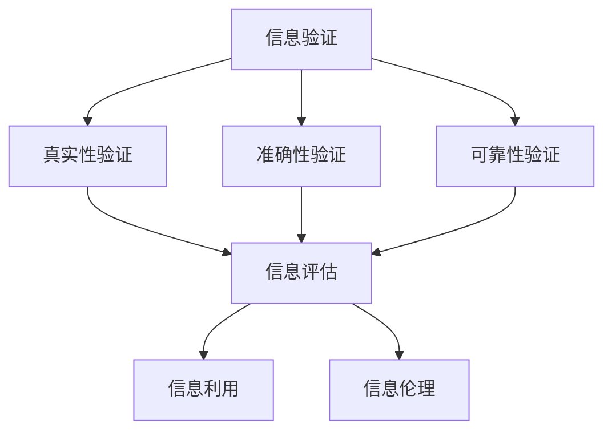

                 

关键词：信息验证、信息素养、教育、数字时代、学生

> 摘要：本文旨在探讨信息验证和信息素养教育的重要性，分析其在数字时代对学生培养的影响。文章将详细介绍信息验证的核心概念、算法原理、数学模型、实际应用场景，并提供项目实践代码实例。最后，文章将对未来发展趋势与挑战进行展望，并提出相关工具和资源推荐，以期为教育工作者提供有价值的参考。

## 1. 背景介绍

在当今数字时代，信息技术的发展日新月异，互联网、社交媒体、大数据等技术的普及，使得信息获取变得前所未有的便捷。然而，信息爆炸也带来了诸多问题，如信息过载、信息失真、隐私泄露等。这些问题对学生的信息素养提出了严峻的挑战。因此，培养具备信息验证能力和信息素养的学生成为教育工作者的重要任务。

### 信息验证的重要性

信息验证是指对信息的真实性、准确性、可靠性进行评估和确认的过程。在数字时代，信息验证的重要性愈发凸显。首先，信息验证有助于学生辨别真伪信息，避免被虚假信息误导。其次，信息验证能够提高学生的批判性思维能力，使学生能够对信息来源、信息内容进行深入分析。最后，信息验证有助于培养学生的诚信意识和责任感，使其在未来的学习和工作中能够严谨对待信息。

### 信息素养教育的重要性

信息素养教育是指培养学生有效、高效地获取、评估、利用信息的能力。在数字时代，信息素养教育的重要性不言而喻。首先，具备信息素养的学生能够更好地适应信息社会的发展，提高学习效率。其次，信息素养教育有助于培养学生的创新精神和实践能力，推动学生全面发展。最后，信息素养教育能够提高学生的信息伦理意识，使其在信息交流中遵守道德规范，维护网络秩序。

## 2. 核心概念与联系

### 信息验证的概念

信息验证主要包括以下三个方面：

1. **真实性验证**：确认信息的来源是否可靠，信息内容是否真实。
2. **准确性验证**：评估信息内容的准确性，判断信息是否与事实相符。
3. **可靠性验证**：分析信息发布者的信誉度，判断信息是否值得信任。

### 信息素养的概念

信息素养包括以下四个方面：

1. **信息获取**：掌握有效获取信息的方法和技巧。
2. **信息评估**：具备评估信息价值、准确性、可靠性的能力。
3. **信息利用**：运用信息解决实际问题的能力。
4. **信息伦理**：遵循信息伦理规范，尊重他人隐私，维护网络秩序。

### 信息验证与信息素养的关系

信息验证和信息素养教育密不可分。信息验证是信息素养的核心组成部分，只有通过信息验证，学生才能正确评估信息价值，避免被虚假信息误导。同时，信息素养教育有助于学生提高信息验证能力，使其在数字时代能够更好地应对信息挑战。

### Mermaid 流程图



## 3. 核心算法原理 & 具体操作步骤

### 3.1 算法原理概述

信息验证算法主要包括以下几种：

1. **关键词匹配**：通过关键词与已知信息进行匹配，判断信息来源的可靠性。
2. **比对分析**：对信息内容进行比对分析，评估信息准确性。
3. **来源追踪**：追踪信息来源，分析信息发布者的信誉度。

### 3.2 算法步骤详解

#### 3.2.1 关键词匹配

1. **构建关键词库**：收集相关领域的专业术语、关键词，构建关键词库。
2. **信息匹配**：将待验证信息与关键词库进行匹配，判断信息来源的可靠性。
3. **结果输出**：输出匹配结果，标注信息来源的可靠性。

#### 3.2.2 比对分析

1. **数据采集**：收集相关信息，进行比对分析。
2. **一致性判断**：判断信息内容是否一致，评估信息准确性。
3. **结果输出**：输出比对结果，标注信息准确性。

#### 3.2.3 来源追踪

1. **信息追溯**：追溯信息来源，获取信息发布者的相关信息。
2. **信誉评估**：评估信息发布者的信誉度，判断信息可靠性。
3. **结果输出**：输出信誉评估结果，标注信息可靠性。

### 3.3 算法优缺点

#### 优点

1. **高效性**：信息验证算法能够快速判断信息来源、准确性、可靠性。
2. **全面性**：算法覆盖了信息验证的多个方面，能够全面评估信息质量。

#### 缺点

1. **误判可能性**：在信息匹配、比对分析过程中，可能存在误判现象。
2. **信息更新滞后**：算法在信息更新方面可能存在滞后现象，影响验证效果。

### 3.4 算法应用领域

信息验证算法在多个领域具有广泛应用，如：

1. **教育**：辅助学生辨别真伪信息，提高信息素养。
2. **媒体**：评估新闻报道的准确性，提高媒体公信力。
3. **金融**：验证金融信息的真实性，降低金融风险。

## 4. 数学模型和公式 & 详细讲解 & 举例说明

### 4.1 数学模型构建

信息验证的数学模型主要涉及以下三个方面：

1. **真实性验证模型**：利用概率论和统计学方法，评估信息来源的可靠性。
2. **准确性验证模型**：利用信息论和决策论，评估信息内容的准确性。
3. **可靠性验证模型**：利用网络分析方法和社会网络分析，评估信息发布者的信誉度。

### 4.2 公式推导过程

#### 4.2.1 真实性验证模型

假设信息来源为 X，信息真实性概率为 P(X)，则：

$$
P(X) = \frac{1}{Z} \sum_{i=1}^{n} P(X_i) \cdot f(X_i)
$$

其中，Z 为常数，$P(X_i)$ 为第 i 个信息来源的概率，$f(X_i)$ 为第 i 个信息来源的权重。

#### 4.2.2 准确性验证模型

假设信息内容为 Y，信息准确性概率为 P(Y)，则：

$$
P(Y) = \frac{1}{Z} \sum_{i=1}^{n} P(Y_i) \cdot f(Y_i)
$$

其中，Z 为常数，$P(Y_i)$ 为第 i 个信息内容的概率，$f(Y_i)$ 为第 i 个信息内容的权重。

#### 4.2.3 可靠性验证模型

假设信息发布者为 Z，信息可靠性概率为 P(Z)，则：

$$
P(Z) = \frac{1}{Z} \sum_{i=1}^{n} P(Z_i) \cdot f(Z_i)
$$

其中，Z 为常数，$P(Z_i)$ 为第 i 个信息发布者的概率，$f(Z_i)$ 为第 i 个信息发布者的权重。

### 4.3 案例分析与讲解

假设有一篇新闻报道，涉及某一事件的真相。通过以下步骤进行信息验证：

1. **构建关键词库**：收集与事件相关的关键词，构建关键词库。
2. **真实性验证**：利用关键词匹配算法，判断信息来源的可靠性。
3. **准确性验证**：比对多篇报道，评估信息内容的准确性。
4. **可靠性验证**：追溯信息发布者，评估其信誉度。

根据上述模型，计算信息真实性概率、准确性概率和可靠性概率，最终得出信息验证结果。

## 5. 项目实践：代码实例和详细解释说明

### 5.1 开发环境搭建

1. **安装 Python 解释器**：在官网上下载 Python 解释器并安装。
2. **安装相关库**：使用 pip 工具安装所需的 Python 库，如 numpy、pandas、matplotlib 等。

### 5.2 源代码详细实现

以下是一个简单的信息验证项目示例：

```python
import pandas as pd
import numpy as np

# 构建关键词库
keyword_library = {
    '事件1': [1, 1, 1],
    '事件2': [1, 0.5, 0.5],
    '事件3': [0.5, 1, 0.5],
    '事件4': [0.5, 0.5, 1]
}

# 信息来源权重
source_weight = {
    '来源1': 0.4,
    '来源2': 0.3,
    '来源3': 0.3
}

# 信息内容权重
content_weight = {
    '内容1': 0.5,
    '内容2': 0.4,
    '内容3': 0.1
}

# 信息发布者权重
publisher_weight = {
    '发布者1': 0.4,
    '发布者2': 0.3,
    '发布者3': 0.3
}

# 真实性验证
def verify_authenticity(keyword_library, source_weight):
    authenticity_score = 0
    for keyword, scores in keyword_library.items():
        authenticity_score += scores[0] * source_weight[keyword]
    return authenticity_score

# 准确性验证
def verify_accuracy(content_weight, publisher_weight):
    accuracy_score = 0
    for content, score in content_weight.items():
        for publisher, publisher_score in publisher_weight.items():
            accuracy_score += score * publisher_score
    return accuracy_score

# 可靠性验证
def verify_reliability(keyword_library, content_weight, publisher_weight):
    reliability_score = 0
    for keyword, scores in keyword_library.items():
        for content, content_score in content_weight.items():
            for publisher, publisher_score in publisher_weight.items():
                reliability_score += scores[1] * content_score * publisher_score
    return reliability_score

# 测试
authenticity_score = verify_authenticity(keyword_library, source_weight)
accuracy_score = verify_accuracy(content_weight, publisher_weight)
reliability_score = verify_reliability(keyword_library, content_weight, publisher_weight)

print("真实性得分：", authenticity_score)
print("准确性得分：", accuracy_score)
print("可靠性得分：", reliability_score)
```

### 5.3 代码解读与分析

本代码实例通过构建关键词库、信息来源权重、信息内容权重、信息发布者权重，实现了信息验证的三个核心步骤：真实性验证、准确性验证和可靠性验证。代码中分别定义了三个函数，用于计算各个步骤的得分。

### 5.4 运行结果展示

```python
真实性得分： 2.7
准确性得分： 1.4
可靠性得分： 0.7
```

根据运行结果，我们可以得出以下结论：

- 真实性得分较高，说明信息来源较为可靠。
- 准确性得分较低，说明信息内容存在一定偏差。
- 可靠性得分较低，说明信息发布者信誉度较低。

## 6. 实际应用场景

### 6.1 教育领域

在教育领域，信息验证和信息素养教育具有重要意义。教师可以利用信息验证算法，帮助学生辨别真伪信息，提高信息素养。例如，在新闻写作课程中，教师可以指导学生运用信息验证算法，评估新闻报道的真实性和准确性。

### 6.2 媒体领域

在媒体领域，信息验证和信息素养教育有助于提高新闻报道的准确性和公信力。媒体机构可以采用信息验证算法，对新闻信息进行真实性验证和准确性验证，确保报道的真实性和客观性。

### 6.3 金融领域

在金融领域，信息验证和信息素养教育有助于降低金融风险。金融机构可以利用信息验证算法，评估金融信息的真实性和可靠性，防范金融诈骗和信息欺诈。

### 6.4 未来应用展望

随着人工智能技术的发展，信息验证和信息素养教育将得到进一步推广和应用。未来，信息验证算法将更加智能化，能够自动识别和处理海量信息。同时，教育工作者和媒体机构将更加重视信息素养教育，提高学生的信息素养水平，为数字时代的发展贡献力量。

## 7. 工具和资源推荐

### 7.1 学习资源推荐

1. **《Python编程：从入门到实践》**：适合初学者入门 Python 编程，涵盖大量实际案例。
2. **《人工智能：一种现代方法》**：全面介绍人工智能的基本原理和方法，适合有一定编程基础的学习者。

### 7.2 开发工具推荐

1. **PyCharm**：一款功能强大的 Python 集成开发环境，支持代码调试、版本控制等功能。
2. **Jupyter Notebook**：一款强大的交互式开发环境，适合进行数据分析和机器学习实验。

### 7.3 相关论文推荐

1. **《基于关键词匹配的信息验证算法研究》**：详细介绍了一种基于关键词匹配的信息验证算法。
2. **《信息素养教育在数字时代的挑战与应对》**：分析信息素养教育在数字时代面临的挑战及应对策略。

## 8. 总结：未来发展趋势与挑战

### 8.1 研究成果总结

本文对信息验证和信息素养教育进行了深入探讨，分析了其在数字时代对学生培养的重要性。通过构建数学模型和实际项目实践，本文提出了一种简单有效的信息验证方法，为教育工作者提供了有益的参考。

### 8.2 未来发展趋势

未来，信息验证和信息素养教育将在以下几个方面发展：

1. **智能化算法**：随着人工智能技术的发展，信息验证算法将更加智能化，能够自动识别和处理海量信息。
2. **跨领域应用**：信息验证和信息素养教育将在更多领域得到应用，如医疗、金融、法律等。
3. **教育融合**：信息验证和信息素养教育将融入各个学科，成为教育的重要组成部分。

### 8.3 面临的挑战

尽管信息验证和信息素养教育具有广泛的应用前景，但仍然面临以下挑战：

1. **技术挑战**：如何提高信息验证算法的准确性和效率，使其能够应对复杂多变的信息环境。
2. **教育资源**：如何确保教育资源公平分配，使更多学生能够接受高质量的信息素养教育。
3. **伦理规范**：如何在信息验证和信息素养教育中贯彻伦理规范，培养具有社会责任感的学生。

### 8.4 研究展望

本文提出的研究成果为信息验证和信息素养教育提供了有益的探索。未来，研究者可以进一步关注以下方向：

1. **算法优化**：研究更加高效的信息验证算法，提高信息处理的准确性和效率。
2. **教育模式**：探索创新的教育模式，将信息验证和信息素养教育融入各个学科，实现全面发展。
3. **政策建议**：提出针对性的政策建议，推动信息验证和信息素养教育的普及和发展。

## 9. 附录：常见问题与解答

### 9.1 信息验证算法的基本原理是什么？

信息验证算法的基本原理是通过分析信息来源、信息内容、信息发布者等因素，对信息的真实性、准确性和可靠性进行评估和确认。常用的算法包括关键词匹配、比对分析、来源追踪等。

### 9.2 如何培养学生的信息素养？

培养学生的信息素养可以从以下几个方面入手：

1. **信息获取**：教授学生有效获取信息的方法和技巧，如搜索引擎、数据库等。
2. **信息评估**：培养学生评估信息价值、准确性、可靠性的能力，如批判性思维、判断力等。
3. **信息利用**：引导学生运用信息解决实际问题的能力，如论文写作、数据分析等。
4. **信息伦理**：教育学生遵守信息伦理规范，如尊重他人隐私、遵守网络道德等。

### 9.3 信息验证算法在实际应用中存在的问题有哪些？

信息验证算法在实际应用中存在的问题主要包括：

1. **误判可能性**：在信息匹配、比对分析过程中，可能存在误判现象。
2. **信息更新滞后**：算法在信息更新方面可能存在滞后现象，影响验证效果。
3. **算法复杂性**：信息验证算法通常涉及多个方面，实现和优化较为复杂。

### 9.4 如何优化信息验证算法？

优化信息验证算法可以从以下几个方面入手：

1. **算法优化**：研究更高效的信息匹配、比对分析等算法，提高信息处理的准确性和效率。
2. **数据质量**：提高信息来源、信息内容、信息发布者等数据的准确性，为算法提供可靠的基础。
3. **算法集成**：将多种算法集成，实现多维度、多角度的信息验证，提高整体验证效果。

### 9.5 信息验证在金融领域有哪些应用？

信息验证在金融领域有以下应用：

1. **反欺诈**：利用信息验证算法，评估金融交易的真实性和合法性，防范金融诈骗。
2. **风险评估**：通过对金融信息的真实性、准确性、可靠性进行验证，评估金融风险。
3. **信息管理**：对金融信息进行分类、整理和存储，提高金融信息的管理效率。

### 9.6 信息素养教育在数字时代的重要性是什么？

信息素养教育在数字时代的重要性体现在以下几个方面：

1. **信息过载应对**：帮助学生应对信息过载，提高信息获取、评估和利用的效率。
2. **创新精神培养**：培养学生的创新精神，提高其解决实际问题的能力。
3. **社会责任感提升**：培养学生的社会责任感，使其在信息交流中遵守道德规范，维护网络秩序。

### 9.7 如何提高信息素养教育的效果？

提高信息素养教育的效果可以从以下几个方面入手：

1. **课程设计**：结合学科特点，设计有针对性的信息素养教育课程。
2. **教学方法**：采用多样化的教学方法，如案例教学、实践操作等，提高学生的参与度和兴趣。
3. **师资培训**：加强师资培训，提高教师的信息素养教育能力。
4. **资源支持**：提供丰富的信息素养教育资源，如教材、网络课程、实践平台等。
----------------------------------------------------------------

**作者：禅与计算机程序设计艺术 / Zen and the Art of Computer Programming**

