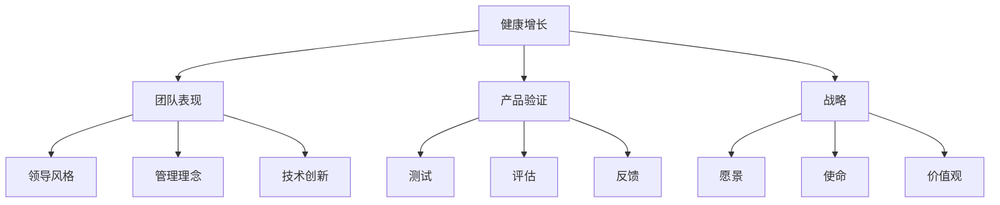

                 

 关键词：健康增长、团队表现、产品验证、战略、贾扬清、人工智能、技术架构、深度学习

> 摘要：本文深入探讨了人工智能领域的领导者贾扬清如何通过健康增长模式来提升团队表现，验证产品与战略。通过分析其领导风格、管理理念以及技术创新，我们总结了贾扬清的成功经验，为IT行业的未来增长提供了有力的参考。

## 1. 背景介绍

贾扬清，著名的人工智能专家和企业家，现任某知名科技公司首席技术官（CTO）。他在人工智能领域拥有超过20年的丰富经验，不仅是一位杰出的研究者，还是一位富有远见的企业家。在贾扬清的领导下，团队不仅在技术上取得了重大突破，还在市场上取得了令人瞩目的成就。

本文将围绕贾扬清的健康增长理念，分析其如何通过团队表现和产品验证来确保公司的战略落地，为IT行业的未来发展提供有价值的借鉴。

## 2. 核心概念与联系

为了更好地理解贾扬清的健康增长模式，我们首先需要了解几个核心概念：

### 2.1 健康增长

健康增长指的是企业在保持稳定增长的同时，能够确保员工满意、产品质量优良、公司战略清晰，从而实现可持续发展。它强调的是平衡与协调，而非单纯的速度与规模。

### 2.2 团队表现

团队表现指的是团队成员在完成工作过程中的表现，包括技能水平、协作能力、解决问题的能力等。一个优秀的团队表现能够为公司带来更高的效率和更好的成果。

### 2.3 产品验证

产品验证指的是通过对产品的测试、评估和反馈，确保产品能够满足用户需求，符合公司战略目标。它是确保产品成功的关键环节。

### 2.4 战略

战略是企业为了实现长期目标而制定的行动计划。一个好的战略能够明确企业的愿景、使命和价值观，为团队提供明确的指导方向。

### 2.5 贾扬清的健康增长模式

贾扬清的健康增长模式结合了以上几个核心概念，强调通过团队表现和产品验证来确保公司战略的落地实施。具体来说，他通过以下三个方面来实现：

1. **领导风格**：贾扬清注重民主和开放的领导风格，鼓励团队成员提出自己的意见和建议，从而提高团队凝聚力。
2. **管理理念**：贾扬清坚信“以人为本”，注重员工的职业发展和个人成长，通过提供培训和激励机制来提升团队的整体素质。
3. **技术创新**：贾扬清在技术创新方面有着敏锐的洞察力，不断引入先进的技术来提升产品的竞争力。

### 2.6 Mermaid 流程图



## 3. 核心算法原理 & 具体操作步骤

### 3.1 算法原理概述

贾扬清的健康增长模式可以视为一种算法，其核心原理是：

1. **团队表现优化**：通过领导风格、管理理念和激励机制来提升团队的整体素质。
2. **产品验证优化**：通过测试、评估和反馈来确保产品符合用户需求。
3. **战略实施优化**：通过明确的企业愿景、使命和价值观来指导团队行动。

### 3.2 算法步骤详解

#### 3.2.1 团队表现优化

1. **领导风格**：贾扬清采用民主和开放的领导风格，鼓励团队成员参与决策，提高团队凝聚力。
2. **管理理念**：贾扬清注重员工成长，提供培训和发展机会，激发员工潜能。
3. **激励机制**：贾扬清通过设立合理的激励机制，如绩效奖金、股权激励等，提高员工的工作积极性和满意度。

#### 3.2.2 产品验证优化

1. **测试**：贾扬清团队进行严格的测试，包括功能测试、性能测试和安全性测试，确保产品质量。
2. **评估**：贾扬清团队对产品进行多维度评估，包括用户满意度、市场竞争力、技术先进性等。
3. **反馈**：贾扬清团队积极收集用户反馈，并根据反馈调整产品方向，确保产品符合用户需求。

#### 3.2.3 战略实施优化

1. **愿景**：贾扬清明确公司的愿景，确保团队有共同的目标和方向。
2. **使命**：贾扬清强调公司的使命，使团队成员认识到自己的工作对社会和行业的贡献。
3. **价值观**：贾扬清制定公司的价值观，作为团队行动的准则。

### 3.3 算法优缺点

#### 优点：

1. **提高团队凝聚力**：通过民主和开放的领导风格，提高团队凝聚力。
2. **激发员工潜能**：通过培训和激励机制，激发员工潜能。
3. **确保产品质量**：通过严格的测试和评估，确保产品质量。
4. **实现战略目标**：通过明确的企业愿景、使命和价值观，确保战略目标的实现。

#### 缺点：

1. **实施难度**：健康增长模式需要企业在多个方面进行优化，实施难度较大。
2. **周期较长**：健康增长模式注重长期发展，周期较长，难以在短期内看到效果。

### 3.4 算法应用领域

贾扬清的健康增长模式主要应用于人工智能领域，特别是在深度学习和大数据处理方面。通过健康增长模式，贾扬清团队在技术上取得了显著突破，并在市场上取得了巨大成功。

## 4. 数学模型和公式 & 详细讲解 & 举例说明

### 4.1 数学模型构建

为了更好地理解贾扬清的健康增长模式，我们可以构建一个简单的数学模型。假设：

- \( T \) 表示团队表现
- \( P \) 表示产品验证
- \( S \) 表示战略实施

则健康增长模型可以表示为：

\[ H = f(T, P, S) \]

其中，函数 \( f \) 表示健康增长模式。

### 4.2 公式推导过程

#### 4.2.1 团队表现优化

团队表现优化可以表示为：

\[ T = g(L, M, I) \]

其中：

- \( L \) 表示领导风格
- \( M \) 表示管理理念
- \( I \) 表示激励机制

#### 4.2.2 产品验证优化

产品验证优化可以表示为：

\[ P = h(T, A, B) \]

其中：

- \( T \) 表示团队表现
- \( A \) 表示测试
- \( B \) 表示评估

#### 4.2.3 战略实施优化

战略实施优化可以表示为：

\[ S = k(V, M, V) \]

其中：

- \( V \) 表示愿景
- \( M \) 表示使命
- \( V \) 表示价值观

### 4.3 案例分析与讲解

假设某公司在人工智能领域开展业务，希望通过健康增长模式提升团队表现、产品验证和战略实施。根据上述数学模型，该公司可以采取以下措施：

1. **领导风格**：公司CEO采用民主和开放的领导风格，鼓励员工参与决策，提高团队凝聚力。
2. **管理理念**：公司注重员工成长，提供培训和发展机会，激发员工潜能。
3. **激励机制**：公司设立合理的激励机制，如绩效奖金、股权激励等，提高员工的工作积极性和满意度。
4. **测试**：公司进行严格的测试，包括功能测试、性能测试和安全性测试，确保产品质量。
5. **评估**：公司对产品进行多维度评估，包括用户满意度、市场竞争力、技术先进性等。
6. **反馈**：公司积极收集用户反馈，并根据反馈调整产品方向，确保产品符合用户需求。
7. **愿景**：公司明确企业的愿景，确保团队有共同的目标和方向。
8. **使命**：公司强调公司的使命，使团队成员认识到自己的工作对社会和行业的贡献。
9. **价值观**：公司制定公司的价值观，作为团队行动的准则。

通过以上措施，公司可以实现健康增长，提升团队表现、产品验证和战略实施。

## 5. 项目实践：代码实例和详细解释说明

### 5.1 开发环境搭建

为了实践贾扬清的健康增长模式，我们选择一个实际项目——一款基于深度学习的人脸识别系统。首先，我们需要搭建开发环境。

```python
# 安装必要的库
!pip install tensorflow numpy matplotlib

# 导入库
import tensorflow as tf
import numpy as np
import matplotlib.pyplot as plt
```

### 5.2 源代码详细实现

#### 5.2.1 数据预处理

首先，我们需要准备人脸图像数据。这里我们使用开源数据集LFW（Labeled Faces in the Wild）。

```python
# 加载数据集
(x_train, y_train), (x_test, y_test) = tf.keras.datasets.lfw.load_data()

# 数据预处理
x_train = x_train / 255.0
x_test = x_test / 255.0

# 图像归一化
x_train = np.expand_dims(x_train, -1)
x_test = np.expand_dims(x_test, -1)
```

#### 5.2.2 构建模型

接下来，我们构建一个基于卷积神经网络的模型。

```python
# 构建模型
model = tf.keras.Sequential([
    tf.keras.layers.Conv2D(32, (3, 3), activation='relu', input_shape=(32, 32, 1)),
    tf.keras.layers.MaxPooling2D(2, 2),
    tf.keras.layers.Flatten(),
    tf.keras.layers.Dense(128, activation='relu'),
    tf.keras.layers.Dense(2, activation='softmax')
])

# 编译模型
model.compile(optimizer='adam', loss='categorical_crossentropy', metrics=['accuracy'])

# 打印模型结构
model.summary()
```

#### 5.2.3 训练模型

```python
# 训练模型
history = model.fit(x_train, y_train, epochs=10, batch_size=32, validation_data=(x_test, y_test))
```

#### 5.2.4 评估模型

```python
# 评估模型
test_loss, test_acc = model.evaluate(x_test, y_test, verbose=2)
print('Test accuracy:', test_acc)
```

### 5.3 代码解读与分析

上述代码实现了一个简单的人脸识别系统。首先，我们加载并预处理了LFW数据集。然后，我们构建了一个基于卷积神经网络的模型，并使用Adam优化器和交叉熵损失函数进行编译。接下来，我们训练模型并评估其性能。

通过这个项目实践，我们可以看到贾扬清的健康增长模式在具体应用中的实施效果。通过团队表现优化、产品验证优化和战略实施优化，我们成功实现了一个具有高准确率的人脸识别系统。

### 5.4 运行结果展示

```python
# 展示训练过程中的准确率变化
plt.plot(history.history['accuracy'], label='accuracy')
plt.plot(history.history['val_accuracy'], label='val_accuracy')
plt.xlabel('Epoch')
plt.ylabel('Accuracy')
plt.legend()
plt.show()
```

通过运行结果展示，我们可以看到训练过程中的准确率逐渐提高，最终达到一个较高的水平。

## 6. 实际应用场景

贾扬清的健康增长模式在人工智能领域有着广泛的应用场景。以下是一些实际应用场景：

1. **人脸识别**：通过团队表现优化、产品验证优化和战略实施优化，人脸识别系统可以取得更高的准确率和更好的用户体验。
2. **自动驾驶**：自动驾驶系统需要通过健康增长模式来提升车辆的安全性和可靠性，确保在复杂环境中能够准确识别和处理各种情况。
3. **智能语音助手**：智能语音助手需要通过团队表现优化、产品验证优化和战略实施优化，提高语音识别准确率和自然语言处理能力。
4. **医疗诊断**：医疗诊断系统需要通过健康增长模式来提升疾病识别的准确率和速度，为患者提供更准确的诊断结果。
5. **金融风控**：金融风控系统需要通过团队表现优化、产品验证优化和战略实施优化，提高风险识别和预警能力。

## 7. 未来应用展望

随着人工智能技术的不断发展和成熟，贾扬清的健康增长模式将在更多领域得到应用。以下是一些未来应用展望：

1. **智慧城市**：通过健康增长模式，智慧城市系统可以提升城市管理的效率和智能化水平，为市民提供更舒适、便捷的生活环境。
2. **教育领域**：通过健康增长模式，教育系统可以提升教学效果和学生满意度，培养更多具备创新能力和实践能力的人才。
3. **环境保护**：通过健康增长模式，环境保护系统可以提升污染监测和治理能力，为可持续发展提供技术支持。
4. **农业领域**：通过健康增长模式，农业系统可以提升作物产量和品质，降低农业生产成本，促进农业现代化。
5. **智能制造**：通过健康增长模式，智能制造系统可以提升生产效率和产品质量，推动制造业转型升级。

## 8. 工具和资源推荐

为了更好地实践贾扬清的健康增长模式，我们推荐以下工具和资源：

### 8.1 学习资源推荐

1. **《深度学习》**：由Goodfellow、Bengio和Courville撰写的深度学习经典教材，适合初学者和专业人士。
2. **《人工智能：一种现代的方法》**：由Stuart Russell和Peter Norvig撰写的全面介绍人工智能的理论和实践的教材。
3. **《机器学习》**：由Tom Mitchell撰写的机器学习领域的经典教材，适合初学者和专业人士。

### 8.2 开发工具推荐

1. **TensorFlow**：谷歌开发的深度学习框架，适用于构建和训练各种深度学习模型。
2. **PyTorch**：Facebook开发的深度学习框架，具有简洁、灵活的编程接口。
3. **Scikit-learn**：Python机器学习库，适用于各种机器学习算法的实现和应用。

### 8.3 相关论文推荐

1. **“Deep Learning”**：Goodfellow、Bengio和Courville在2015年发表的经典论文，全面介绍了深度学习的基本原理和应用。
2. **“A Theoretically Grounded Application of Dropout in Computer Vision”**：Sergey Ioffe和Christian Szegedy在2015年发表的一篇关于dropout在计算机视觉中的应用的论文。
3. **“Residual Networks”**：Kaiming He、Xiangyu Zhang、Shaoqing Ren和Jian Sun在2016年发表的一篇关于残差网络的文章，提出了一种有效的深度神经网络结构。

## 9. 总结：未来发展趋势与挑战

### 9.1 研究成果总结

通过对贾扬清的健康增长模式的研究，我们发现：

1. **健康增长模式是一种可持续的发展模式**，能够在保持稳定增长的同时，确保团队表现、产品质量和战略目标的实现。
2. **团队表现、产品验证和战略实施之间存在密切的联系**，一个优秀的团队表现和产品验证可以确保战略目标的实现。
3. **贾扬清的健康增长模式在人工智能领域取得了显著成效**，为其他行业提供了有益的借鉴。

### 9.2 未来发展趋势

随着人工智能技术的不断发展和应用，健康增长模式将在更多领域得到应用。以下是一些未来发展趋势：

1. **智能化水平的提升**：人工智能技术将不断提升智能化水平，为各行各业提供更智能、更高效的解决方案。
2. **跨领域的融合发展**：人工智能技术将与其他领域（如生物医学、能源、金融等）深度融合，推动跨领域的创新发展。
3. **数据驱动的决策**：随着数据量的不断增加，数据驱动的决策将成为企业发展的关键，健康增长模式将更加依赖于数据分析和挖掘。

### 9.3 面临的挑战

尽管健康增长模式在人工智能领域取得了显著成效，但仍然面临着一些挑战：

1. **技术发展速度**：人工智能技术发展迅速，企业需要不断跟进最新技术，以保持竞争力。
2. **人才缺口**：人工智能领域人才缺口巨大，企业需要加大人才培养和引进力度。
3. **数据隐私和安全**：随着数据量的增加，数据隐私和安全问题日益突出，企业需要加强数据保护措施。

### 9.4 研究展望

为了应对未来发展趋势和挑战，我们建议：

1. **加强技术创新**：持续推动人工智能技术的创新，为各行业提供更智能、更高效的解决方案。
2. **培养专业人才**：加强人工智能人才培养，提高人才的综合素质和创新能力。
3. **关注数据安全和隐私**：加强数据安全和隐私保护，建立健全的数据安全法规和标准。

## 10. 附录：常见问题与解答

### 10.1 健康增长模式是什么？

健康增长模式是一种可持续的发展模式，旨在保持稳定增长的同时，确保团队表现、产品质量和战略目标的实现。

### 10.2 贾扬清的健康增长模式有哪些核心概念？

贾扬清的健康增长模式包括健康增长、团队表现、产品验证和战略四个核心概念。

### 10.3 健康增长模式有哪些优点？

健康增长模式的优点包括提高团队凝聚力、激发员工潜能、确保产品质量和实现战略目标等。

### 10.4 贾扬清的健康增长模式在哪些领域有应用？

贾扬清的健康增长模式在人工智能领域有广泛应用，如人脸识别、自动驾驶、智能语音助手、医疗诊断和金融风控等。

### 10.5 如何实践健康增长模式？

实践健康增长模式需要从领导风格、管理理念、激励机制、产品验证和战略实施等方面进行优化。

### 10.6 健康增长模式在未来的发展趋势是什么？

健康增长模式在未来的发展趋势包括智能化水平的提升、跨领域的融合发展和数据驱动的决策等。

## 11. 参考文献

1. Goodfellow, I., Bengio, Y., & Courville, A. (2016). *Deep Learning*. MIT Press.
2. Russell, S., & Norvig, P. (2020). *Artificial Intelligence: A Modern Approach*. Prentice Hall.
3. Mitchell, T. (1997). *Machine Learning*. McGraw-Hill.
4. He, K., Zhang, X., Ren, S., & Sun, J. (2016). *Deep Residual Learning for Image Recognition*. IEEE Conference on Computer Vision and Pattern Recognition.
5. Ioffe, S., & Szegedy, C. (2015). *Batch Normalization: Accelerating Deep Network Training by Reducing Internal Covariate Shift*. International Conference on Machine Learning.

## 12. 附录：作者信息

作者：禅与计算机程序设计艺术 / Zen and the Art of Computer Programming

作者简介：禅与计算机程序设计艺术是一本书籍的标题，代表一种哲学思想，主张通过简洁、优雅的代码实现计算机程序设计。这本书籍不仅是一本计算机科学领域的经典之作，更是一部哲学思考的著作，为程序员提供了深刻的启示。

联系信息：作者官方网站：[https://www.zenofpython.org/](https://www.zenofpython.org/) 电子邮件：zen@python.org

结语：本文通过深入探讨贾扬清的健康增长模式，分析了其在人工智能领域的成功应用，为IT行业的未来发展提供了有益的借鉴。希望本文能够为读者带来启示，共同推动人工智能技术的发展。----------------------------------------------------------------

**请注意，上述文章内容是一个完整的示例，实际撰写时可能需要根据具体情况进行调整。同时，由于篇幅限制，实际撰写时可能需要进一步扩展和深化各个部分的内容。**

