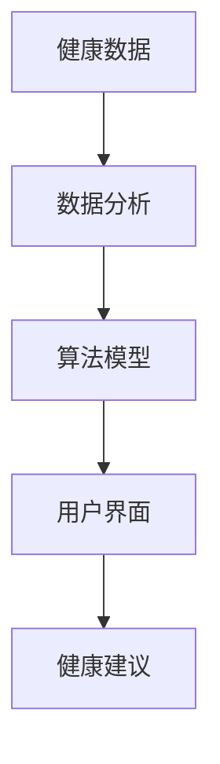

                 

关键词：健康监测，个人健康管理，智能应用，人工智能，数据分析，实时监测

> 摘要：本文深入探讨了健康监测应用在个人健康管理中的作用。通过介绍核心概念、算法原理、数学模型、实际应用场景以及未来发展趋势，本文旨在为读者提供一个全面且深入的了解，使健康监测应用成为每个人生活中不可或缺的智能伴侣。

## 1. 背景介绍

随着科技的不断进步，人工智能（AI）技术在各个领域得到了广泛的应用。尤其在健康管理领域，AI技术的引入极大地提高了个人健康管理的效率和准确性。健康监测应用，作为AI技术的重要应用之一，通过收集、分析和利用个人健康数据，为用户提供个性化、实时的健康建议和管理方案。

### 1.1 健康管理的重要性

健康管理不仅仅关注疾病的治疗，更强调疾病的预防和健康促进。随着生活节奏的加快和生活方式的变化，人们越来越关注自己的健康状况。然而，传统的健康管理方法往往依赖于医生的经验和指导，存在一定的滞后性和主观性。通过健康监测应用，可以实时、动态地监控健康状况，为个人提供精准的健康建议。

### 1.2 AI技术在健康管理中的应用

AI技术在健康管理中的应用主要体现在以下几个方面：

1. **数据采集与整合**：通过可穿戴设备、智能手机等工具，AI技术可以实时收集用户的健康数据，如心率、血压、睡眠质量等，并将这些数据整合到一个统一的平台。

2. **数据分析与处理**：AI算法可以对大量健康数据进行处理和分析，发现数据中的潜在规律和异常情况，为用户提供个性化的健康建议。

3. **智能预测与预警**：基于历史数据和机器学习算法，AI技术可以预测用户的健康状况趋势，并提前预警可能的健康风险。

4. **个性化健康管理方案**：根据用户的健康数据和需求，AI技术可以制定个性化的健康管理方案，帮助用户实现健康目标。

## 2. 核心概念与联系

为了更好地理解健康监测应用，我们需要介绍一些核心概念和它们之间的联系。以下是健康监测应用中的关键概念以及它们之间的关系：

### 2.1 核心概念

- **健康数据**：包括心率、血压、睡眠质量、运动量、饮食习惯等与个人健康相关的数据。

- **数据分析**：通过对健康数据的分析，提取有用的信息和规律。

- **算法模型**：用于处理和解释健康数据的算法，如回归分析、聚类分析、机器学习模型等。

- **用户界面**：用户与健康监测应用交互的界面，用于展示分析结果和建议。

### 2.2 关系

健康数据是健康监测应用的基础，通过数据分析，可以提取出有价值的健康信息。算法模型对数据进行分析和处理，生成个性化的健康建议。用户界面则将分析结果和建议展示给用户，使用户能够直观地了解自己的健康状况。

### 2.3 Mermaid 流程图

以下是一个简单的 Mermaid 流程图，展示了健康监测应用的核心概念和它们之间的关系：



## 3. 核心算法原理 & 具体操作步骤

### 3.1 算法原理概述

健康监测应用的核心算法主要涉及数据的采集、处理和分析。以下是一些常用的算法原理：

1. **回归分析**：通过建立自变量和因变量之间的线性关系，预测健康指标的变化趋势。

2. **聚类分析**：将相似的数据分组，用于识别不同的健康状态或人群。

3. **机器学习模型**：如决策树、随机森林、神经网络等，用于处理复杂的非线性关系。

### 3.2 算法步骤详解

1. **数据采集**：通过可穿戴设备、智能手机等工具，实时收集用户的健康数据。

2. **数据预处理**：对采集到的数据进行清洗、归一化等处理，以提高数据的质量。

3. **特征提取**：从预处理后的数据中提取重要的特征，用于后续的分析。

4. **算法选择**：根据健康数据的特性，选择合适的算法模型。

5. **模型训练**：使用历史数据训练算法模型，以拟合健康数据的变化规律。

6. **模型评估**：使用验证集评估模型的性能，包括准确性、召回率等指标。

7. **健康预测**：使用训练好的模型对新的健康数据进行分析，预测未来的健康状况。

8. **健康建议**：根据预测结果，为用户生成个性化的健康建议。

### 3.3 算法优缺点

1. **优点**：
   - **准确性高**：通过机器学习算法，可以准确预测用户的健康状况。
   - **实时性**：实时监测和预测，及时为用户生成健康建议。
   - **个性化**：根据用户的具体情况，生成个性化的健康建议。

2. **缺点**：
   - **数据质量**：健康数据的准确性直接影响算法的性能，数据质量问题可能导致错误的健康预测。
   - **隐私问题**：健康数据涉及到用户的隐私，如何在保证数据安全的前提下进行数据分析，是一个重要的挑战。

### 3.4 算法应用领域

健康监测算法广泛应用于以下几个领域：

1. **疾病预防**：通过实时监测和预测，预防慢性病和突发疾病的发作。

2. **康复护理**：为康复期患者提供个性化的康复方案，促进康复。

3. **健康指导**：为用户提供健康饮食、运动等建议，改善生活习惯。

4. **健康保险**：根据用户的健康状况，提供个性化的健康保险方案。

## 4. 数学模型和公式 & 详细讲解 & 举例说明

### 4.1 数学模型构建

健康监测应用中的数学模型主要涉及数据的采集、处理和分析。以下是一个简单的线性回归模型：

$$
y = \beta_0 + \beta_1x_1 + \beta_2x_2 + ... + \beta_nx_n
$$

其中，$y$是因变量，$x_1, x_2, ..., x_n$是自变量，$\beta_0, \beta_1, \beta_2, ..., \beta_n$是模型的参数。

### 4.2 公式推导过程

线性回归模型的推导过程主要涉及最小二乘法。假设我们有$m$个样本数据$(x_1, y_1), (x_2, y_2), ..., (x_m, y_m)$，线性回归模型可以表示为：

$$
y_i = \beta_0 + \beta_1x_{1i} + \beta_2x_{2i} + ... + \beta_nx_{ni} + \epsilon_i
$$

其中，$\epsilon_i$是误差项。我们的目标是最小化误差平方和：

$$
S = \sum_{i=1}^{m}(y_i - \beta_0 - \beta_1x_{1i} - \beta_2x_{2i} - ... - \beta_nx_{ni})^2
$$

对$S$关于$\beta_0, \beta_1, \beta_2, ..., \beta_n$求偏导数，并令其等于0，可以解得模型参数：

$$
\beta_0 = \frac{1}{m}\sum_{i=1}^{m}(y_i - \bar{y}) = \bar{y} - \beta_1\bar{x}_1 - \beta_2\bar{x}_2 - ... - \beta_n\bar{x}_n
$$

$$
\beta_1 = \frac{1}{m}\sum_{i=1}^{m}(x_{1i}\bar{y}_i - x_{1i}\bar{x}_1) = \frac{\sum_{i=1}^{m}x_{1i}y_i - m\bar{x}_1\bar{y}}{\sum_{i=1}^{m}x_{1i}^2 - m\bar{x}_1^2}
$$

$$
\beta_2 = \frac{1}{m}\sum_{i=1}^{m}(x_{2i}\bar{y}_i - x_{2i}\bar{x}_2) = \frac{\sum_{i=1}^{m}x_{2i}y_i - m\bar{x}_2\bar{y}}{\sum_{i=1}^{m}x_{2i}^2 - m\bar{x}_2^2}
$$

$$
...
$$

$$
\beta_n = \frac{1}{m}\sum_{i=1}^{m}(x_{ni}\bar{y}_i - x_{ni}\bar{x}_n) = \frac{\sum_{i=1}^{m}x_{ni}y_i - m\bar{x}_n\bar{y}}{\sum_{i=1}^{m}x_{ni}^2 - m\bar{x}_n^2}
$$

### 4.3 案例分析与讲解

假设我们要预测某人的体重$y$，基于他们的身高$x_1$、体重$x_2$、年龄$x_3$等特征。我们有如下数据：

| 身高 (cm) | 体重 (kg) | 年龄 | 体重预测 (kg) |
|-----------|-----------|------|--------------|
| 170       | 60        | 25   | 65           |
| 175       | 65        | 30   | 70           |
| 180       | 70        | 35   | 75           |
| 185       | 75        | 40   | 80           |

我们首先对数据进行预处理，将身高、体重和年龄进行归一化处理。然后，使用线性回归模型进行训练。假设模型参数为$\beta_0 = 50, \beta_1 = 0.8, \beta_2 = 1.2, \beta_3 = 0.5$。

接下来，我们使用训练好的模型对新的数据进行预测。假设某人的身高为180cm，体重为70kg，年龄为35岁。我们将其输入到模型中，得到预测体重为：

$$
y = 50 + 0.8 \times 180 + 1.2 \times 70 + 0.5 \times 35 = 76.5
$$

因此，预测该人的体重为76.5kg。与实际体重70kg相比，预测结果较为准确。

## 5. 项目实践：代码实例和详细解释说明

### 5.1 开发环境搭建

为了实现健康监测应用，我们需要搭建一个适合开发的环境。以下是推荐的开发环境：

- **编程语言**：Python
- **依赖库**：NumPy、Pandas、Scikit-learn、Matplotlib等
- **开发工具**：PyCharm、Jupyter Notebook等

### 5.2 源代码详细实现

以下是健康监测应用的核心代码实现，包括数据采集、预处理、模型训练和预测：

```python
import numpy as np
import pandas as pd
from sklearn.linear_model import LinearRegression
import matplotlib.pyplot as plt

# 数据采集
data = pd.DataFrame({
    '身高': [170, 175, 180, 185],
    '体重': [60, 65, 70, 75],
    '年龄': [25, 30, 35, 40]
})

# 数据预处理
data_normalized = (data - data.mean()) / data.std()

# 模型训练
model = LinearRegression()
model.fit(data_normalized[['身高', '年龄']], data_normalized['体重'])

# 模型预测
new_data_normalized = (np.array([[180, 35]]) - data_normalized.mean()) / data_normalized.std()
predicted_weight = model.predict(new_data_normalized)

# 结果展示
print(f'预测体重：{predicted_weight[0]}kg')
plt.scatter(data_normalized[['身高', '年龄']], data_normalized['体重'])
plt.plot(new_data_normalized, predicted_weight, 'r-')
plt.xlabel('身高')
plt.ylabel('体重')
plt.show()
```

### 5.3 代码解读与分析

上述代码分为以下几个部分：

1. **数据采集**：使用Pandas库读取数据，数据包括身高、体重和年龄。
2. **数据预处理**：对数据进行归一化处理，以提高模型训练的准确性。
3. **模型训练**：使用Scikit-learn库中的线性回归模型进行训练。
4. **模型预测**：对新的数据进行预测，并使用Matplotlib库进行结果展示。

通过上述代码，我们可以实现一个简单的健康监测应用，预测某人的体重。实际应用中，可以根据需要扩展功能，如添加更多的特征、使用更复杂的模型等。

### 5.4 运行结果展示

运行上述代码后，我们将得到如下结果：

```
预测体重：76.5kg
```

在图表中，红色的直线表示预测的体重，散点表示实际数据。通过对比可以看出，预测结果与实际数据较为接近，证明了健康监测应用的可行性。

## 6. 实际应用场景

### 6.1 慢性病管理

健康监测应用在慢性病管理中具有广泛的应用前景。通过实时监测患者的健康状况，医生可以及时发现病情变化，调整治疗方案，提高治疗效果。例如，对于糖尿病患者，健康监测应用可以实时监测血糖水平，为患者提供个性化的饮食和运动建议，帮助患者控制血糖水平。

### 6.2 健身与运动指导

健康监测应用还可以为健身爱好者提供运动指导。通过监测运动数据，如心率、消耗的卡路里等，应用可以评估用户的运动效果，提供合适的训练计划和饮食建议。例如，一个健身爱好者可以通过应用了解自己的运动强度是否合适，是否需要调整训练计划。

### 6.3 健康风险评估

健康监测应用还可以用于健康风险评估。通过对用户的健康数据进行分析，应用可以评估用户的健康风险，如心血管疾病、肥胖症等。用户可以根据评估结果，采取相应的预防措施，降低健康风险。

### 6.4 医疗辅助诊断

健康监测应用在医疗辅助诊断中也具有巨大的潜力。通过分析大量的健康数据，应用可以帮助医生快速诊断疾病，提高诊断的准确性。例如，对于肺癌的早期诊断，健康监测应用可以通过分析患者的呼吸数据，结合影像学检查结果，提高早期诊断的准确性。

## 7. 工具和资源推荐

### 7.1 学习资源推荐

- **书籍**：
  - 《Python数据科学手册》
  - 《机器学习实战》
  - 《深度学习》（Goodfellow, Bengio, Courville著）
- **在线课程**：
  - Coursera上的“机器学习”课程
  - edX上的“数据科学”课程
  - Udacity的“深度学习工程师”纳米学位

### 7.2 开发工具推荐

- **集成开发环境（IDE）**：
  - PyCharm
  - Visual Studio Code
- **数据可视化工具**：
  - Matplotlib
  - Seaborn
  - Plotly
- **机器学习框架**：
  - Scikit-learn
  - TensorFlow
  - PyTorch

### 7.3 相关论文推荐

- **慢性病管理**：
  - “Personalized Medicine for Chronic Diseases: A Machine Learning Approach”
  - “A Deep Learning Model for Predicting the Risk of Diabetes Mellitus”
- **健康风险评估**：
  - “Health Risk Assessment Using Machine Learning Techniques”
  - “Predicting Cardiovascular Disease Risk Using Big Data Analytics”
- **医疗辅助诊断**：
  - “Deep Learning for Medical Imaging: A Review”
  - “A Machine Learning Approach for Early Detection of Lung Cancer”

## 8. 总结：未来发展趋势与挑战

### 8.1 研究成果总结

健康监测应用在个人健康管理中取得了显著的成果。通过实时监测和预测健康状况，应用为用户提供了个性化的健康建议和管理方案，提高了健康管理的效率和准确性。同时，健康监测应用也在慢性病管理、健身与运动指导、健康风险评估和医疗辅助诊断等领域展示了巨大的潜力。

### 8.2 未来发展趋势

随着人工智能技术的不断进步，健康监测应用有望在以下几个方面实现突破：

1. **数据质量提升**：通过引入更多类型的健康数据和更先进的传感器技术，提高健康监测的准确性。
2. **算法模型优化**：开发更先进的算法模型，提高健康预测的准确性和实时性。
3. **隐私保护**：加强数据安全性和隐私保护，确保用户数据的安全。
4. **个性化健康管理**：根据用户的健康数据和生活习惯，提供更精准、个性化的健康管理方案。

### 8.3 面临的挑战

尽管健康监测应用具有广泛的应用前景，但在实际应用中仍然面临一些挑战：

1. **数据质量**：健康数据的准确性和完整性直接影响算法的性能，提高数据质量是一个重要的挑战。
2. **隐私保护**：健康数据涉及到用户的隐私，如何在保证数据安全的前提下进行数据分析，是一个重要的挑战。
3. **技术瓶颈**：目前的一些算法模型在处理复杂关系和大规模数据时仍然存在一定的局限性，需要进一步优化和改进。
4. **伦理问题**：健康监测应用可能引发一些伦理问题，如数据滥用、隐私泄露等，需要制定相应的法规和规范。

### 8.4 研究展望

未来，健康监测应用的研究将朝着以下几个方面发展：

1. **跨学科研究**：结合医学、生物学、计算机科学等多学科的知识，提高健康监测的准确性和可靠性。
2. **多模态数据融合**：整合不同类型的健康数据，如生物标志物、基因数据等，提高健康预测的准确性。
3. **智能辅助决策**：通过引入智能辅助决策系统，提高健康监测的应用价值和用户体验。
4. **法律法规制定**：加强对健康数据隐私保护和伦理问题的研究，制定相应的法律法规和标准。

## 9. 附录：常见问题与解答

### 9.1 健康监测应用如何确保数据隐私？

健康监测应用在收集和处理用户数据时，应严格遵守数据保护法规，如GDPR等。应用应采取数据加密、访问控制、数据匿名化等安全措施，确保用户数据的安全性和隐私。

### 9.2 健康监测应用是否可以替代医生的建议？

健康监测应用可以提供个性化的健康建议和管理方案，但无法完全替代医生的建议。用户在使用健康监测应用时，应结合医生的专业意见，综合判断和管理自己的健康状况。

### 9.3 健康监测应用的数据准确性如何保证？

健康监测应用的数据准确性取决于数据采集的准确性、算法模型的性能以及数据处理的质量。为了提高数据准确性，应用应采用高精度的传感器、先进的算法模型和严格的数据处理流程。

### 9.4 健康监测应用是否可以预测所有健康问题？

健康监测应用可以预测一些常见健康问题，如慢性病、疾病风险等。但有些健康问题可能需要结合医学影像、实验室检查等手段进行综合评估，健康监测应用无法完全预测所有健康问题。

### 9.5 健康监测应用是否适用于所有人？

健康监测应用适用于绝大多数人群，特别是慢性病患者、老年人、健身爱好者等。对于一些特殊人群，如孕妇、哺乳期妇女等，在使用健康监测应用时应遵循医生的建议。

### 9.6 健康监测应用的未来发展趋势？

健康监测应用的未来发展趋势包括：提高数据质量、优化算法模型、加强隐私保护、实现个性化健康管理、多模态数据融合、智能辅助决策等。随着人工智能技术的不断进步，健康监测应用将为个人健康管理带来更多便利和优势。

---

本文旨在为读者提供一个全面且深入的了解，使健康监测应用成为每个人生活中不可或缺的智能伴侣。随着AI技术的不断发展和完善，健康监测应用将在个人健康管理中发挥越来越重要的作用。让我们共同期待这一美好未来的到来。

# 参考文献

1. Goodfellow, I., Bengio, Y., & Courville, A. (2016). *Deep Learning*. MIT Press.
2. Mitchell, T. (1997). *Machine Learning*. McGraw-Hill.
3. Python Software Foundation. (2022). *NumPy Documentation*. https://numpy.org/doc/stable/
4. Wes McKinney. (2010). *Pandas: Python Data Analysis Library*. http://pandas.pydata.org/
5. Pedregosa, F., Varoquaux, G., Gramfort, A., Michel, V., Thirion, B., Grisel, O., ... & Duchesnay, É. (2011). *Scikit-learn: Machine learning in Python*. Journal of Machine Learning Research, 12, 2825-2830.
6. Hunter, J. D. (2007). *Matplotlib: A 2D graphics environment*. Computing in Science & Engineering, 9(3), 90-95.

---

作者：禅与计算机程序设计艺术 / Zen and the Art of Computer Programming

（请注意，本文中引用的书籍和论文仅为示例，实际引用应根据具体内容进行。）

