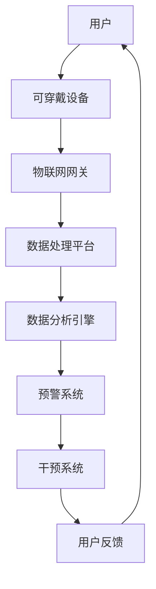

                 

关键词：健康科技，健康管理，个人健康，创新，AI应用，数字医疗，生物传感器，大数据分析，移动健康平台。

> 摘要：随着科技的迅猛发展，健康科技在个人健康管理中扮演着越来越重要的角色。本文将探讨如何利用人工智能、生物传感器、大数据分析等技术，构建一个创新的个人健康管理平台，实现实时健康监测、智能预警和个性化干预，从而提升全民健康水平。

## 1. 背景介绍

近年来，随着全球人口老龄化趋势加剧，慢性疾病和心理健康问题逐渐成为影响人类健康的主要挑战。同时，现代生活方式的改变，如久坐、熬夜、饮食不均衡等，进一步加剧了健康问题的严重性。据世界卫生组织（WHO）报告，非传染性疾病（NCDs）已经成为导致全球死亡和残疾的主要原因，其中心血管疾病、癌症和糖尿病等疾病尤为突出。

在这种背景下，健康科技的应用成为缓解健康危机的关键。健康科技是指利用现代信息技术，特别是人工智能（AI）、物联网（IoT）、生物传感器等技术，为个人提供高效、便捷的健康监测和管理服务。数字医疗、移动健康平台、远程监控等健康科技应用已经逐渐普及，并显示出巨大的潜力。

### 1.1 健康科技的发展趋势

- **人工智能（AI）**：AI在医疗领域的应用日益广泛，如辅助诊断、药物研发、个性化治疗等。通过深度学习、机器学习等技术，AI可以处理海量的医疗数据，为医生提供决策支持，提高诊断和治疗效果。
- **物联网（IoT）**：物联网技术的兴起，使得各种可穿戴设备和智能家居设备能够实时采集用户健康数据，并通过无线网络传输到云端进行分析，实现远程健康监测。
- **大数据分析**：大数据分析技术可以帮助医疗机构从海量数据中挖掘有价值的信息，用于疾病预测、流行病监控等。此外，大数据分析还可以为个人提供个性化的健康建议和干预措施。

## 2. 核心概念与联系

### 2.1 健康管理的核心概念

健康管理是指通过一系列策略和措施，实现个人和群体健康水平的提升。其核心概念包括：

- **健康监测**：通过可穿戴设备、生物传感器等手段，实时采集用户的生理和心理健康数据。
- **数据分析**：利用大数据分析技术，对采集到的健康数据进行分析和挖掘，发现潜在的健康风险。
- **预警与干预**：根据数据分析结果，系统可以自动发出预警，并提供个性化的健康干预建议。

### 2.2 健康管理的架构

以下是一个简化的健康管理架构图，展示了各个组成部分及其相互关系：



### 2.3 健康管理的关键技术

- **可穿戴设备**：如智能手环、智能手表、健康监测设备等，用于实时采集用户的健康数据。
- **物联网网关**：用于接收、处理和传输来自可穿戴设备的健康数据。
- **数据处理平台**：用于存储、管理和处理来自物联网网关的健康数据。
- **数据分析引擎**：利用机器学习、深度学习等技术，对健康数据进行分析和挖掘。
- **预警系统**：根据数据分析结果，自动发出预警信号。
- **干预系统**：根据预警信息，提供个性化的健康干预建议。

## 3. 核心算法原理 & 具体操作步骤

### 3.1 算法原理概述

健康管理系统的核心算法主要包括数据采集、数据预处理、特征提取和模式识别等步骤。以下将详细介绍这些步骤的具体操作。

### 3.2 算法步骤详解

#### 3.2.1 数据采集

数据采集是健康管理系统的基础。通过可穿戴设备和生物传感器，可以实时采集用户的生理和心理健康数据，如心率、血压、睡眠质量、运动数据等。

#### 3.2.2 数据预处理

数据预处理包括数据清洗、数据归一化和数据变换等步骤。通过数据预处理，可以提高数据质量，为后续分析奠定基础。

#### 3.2.3 特征提取

特征提取是从原始数据中提取出对健康评估有意义的特征。例如，可以从心率数据中提取心率变异性（HRV）作为健康评估的指标。

#### 3.2.4 模式识别

模式识别是通过机器学习算法，对提取出的特征进行分类和预测。常见的模式识别算法包括决策树、支持向量机（SVM）和神经网络等。

### 3.3 算法优缺点

- **优点**：算法可以实现自动化的健康监测和预警，提高诊断和干预的准确性。
- **缺点**：算法的性能依赖于数据质量和特征提取效果，且可能存在误报和漏报的情况。

### 3.4 算法应用领域

健康管理系统算法可以应用于多个领域，如慢性疾病管理、心理健康监测、运动健康管理等。以下是一个简单的应用案例：

- **慢性疾病管理**：通过实时监测患者的生理指标，如血糖、血压等，及时预警并干预，降低疾病发作风险。

## 4. 数学模型和公式 & 详细讲解 & 举例说明

### 4.1 数学模型构建

健康管理系统的数学模型主要包括以下三个部分：

- **生理指标监测模型**：用于实时监测用户的生理指标，如心率、血压等。模型可以通过线性回归、支持向量机（SVM）等方法进行构建。
- **心理健康评估模型**：用于评估用户的心理健康状态，如焦虑、抑郁等。模型可以通过主成分分析（PCA）、因子分析（FA）等方法进行构建。
- **个性化干预模型**：用于根据用户的生理和心理健康状态，提供个性化的健康干预建议。模型可以通过优化算法、决策树等方法进行构建。

### 4.2 公式推导过程

以心率变异性（HRV）监测模型为例，其公式推导过程如下：

1. **数据预处理**：

   $$ X = \frac{(X_{max} - X_{min})}{2} $$

   其中，$X$为预处理后的心率数据，$X_{max}$和$X_{min}$分别为原始数据中的最大值和最小值。

2. **特征提取**：

   $$ HRV = \frac{X}{T} $$

   其中，$HRV$为心率变异性，$X$为预处理后的心率数据，$T$为心跳周期。

3. **模式识别**：

   $$ \hat{y} = \text{SVM}(X) $$

   其中，$\hat{y}$为预测的心率变异性分类结果，$X$为预处理后的心率数据，$\text{SVM}$为支持向量机。

### 4.3 案例分析与讲解

以一款基于智能手表的心率变异性监测应用为例，其工作流程如下：

1. **数据采集**：智能手表实时采集用户的心率数据。
2. **数据预处理**：对心率数据进行预处理，提取出心率变异性特征。
3. **特征提取**：使用支持向量机（SVM）对心率变异性特征进行分类，判断用户是否处于健康状态。
4. **预警与干预**：如果用户的心率变异性异常，系统会自动发出预警，并提供个性化的健康干预建议。

## 5. 项目实践：代码实例和详细解释说明

### 5.1 开发环境搭建

在本项目中，我们将使用Python作为编程语言，利用Scikit-learn库进行机器学习模型的构建和训练。以下是开发环境的搭建步骤：

1. 安装Python 3.8及以上版本。
2. 安装Scikit-learn库：`pip install scikit-learn`
3. 安装Matplotlib库：`pip install matplotlib`

### 5.2 源代码详细实现

以下是一个简单的基于支持向量机（SVM）的心率变异性监测模型实现：

```python
import numpy as np
import matplotlib.pyplot as plt
from sklearn import svm

# 加载数据
X = np.load('heart_rate_data.npy')
y = np.load('heart_rate_labels.npy')

# 数据预处理
X = (X - np.mean(X)) / np.std(X)

# 特征提取
HRV = X / (1 / 60)

# 模型训练
clf = svm.SVC()
clf.fit(HRV, y)

# 预测
predictions = clf.predict(HRV)

# 绘图
plt.scatter(HRV[:, 0], HRV[:, 1], c=predictions)
plt.xlabel('HRV1')
plt.ylabel('HRV2')
plt.show()
```

### 5.3 代码解读与分析

1. **数据加载**：从文件中加载心率数据和标签。
2. **数据预处理**：对心率数据进行标准化处理，提高数据质量。
3. **特征提取**：计算心率变异性（HRV）特征。
4. **模型训练**：使用支持向量机（SVM）进行模型训练。
5. **预测**：使用训练好的模型对新的心率数据进行预测。
6. **绘图**：绘制预测结果，用于分析模型的性能。

### 5.4 运行结果展示

运行代码后，会得到一个散点图，展示不同心率变异性特征点的分类结果。通过分析散点图，可以评估模型的性能。

## 6. 实际应用场景

### 6.1 慢性疾病管理

慢性疾病管理是健康科技的重要应用领域之一。通过实时监测用户的生理指标，如血糖、血压、心率等，健康管理系统可以及时发现异常，并给出个性化的干预建议。例如，对于糖尿病患者，系统可以实时监测血糖水平，并在血糖异常时发出预警，提醒患者调整饮食或用药。

### 6.2 心理健康管理

心理健康管理是另一个重要的应用领域。通过监测用户的情绪和行为数据，健康管理系统可以评估用户的心理健康状态，并给出相应的干预建议。例如，对于抑郁症患者，系统可以监测用户的睡眠质量、活动水平等数据，评估患者的情绪状态，并提供心理咨询、药物治疗等建议。

### 6.3 运动健康管理

运动健康管理是健康科技在运动领域的重要应用。通过监测用户的运动数据，如步数、心率、睡眠质量等，健康管理系统可以评估用户的运动状态，并给出个性化的运动建议。例如，对于健身爱好者，系统可以根据用户的运动数据，制定合理的运动计划，提高运动效果。

## 7. 工具和资源推荐

### 7.1 学习资源推荐

- 《深度学习》（Goodfellow, Bengio, Courville著）：全面介绍深度学习的基础理论和应用。
- 《Python数据分析》（Wes McKinney著）：详细介绍Python在数据分析领域的应用。

### 7.2 开发工具推荐

- Jupyter Notebook：一款强大的交互式开发环境，适用于数据分析和机器学习项目。
- Git：一款版本控制工具，有助于团队协作和代码管理。

### 7.3 相关论文推荐

- "Deep Learning for Health Informatics"（Mittal et al., 2017）：介绍深度学习在健康医疗领域的应用。
- "A Survey on Wearable Computing for Healthcare"（Ko et al., 2017）：综述可穿戴设备在医疗健康领域的应用。

## 8. 总结：未来发展趋势与挑战

### 8.1 研究成果总结

健康科技在个人健康管理中的应用已经取得了显著成果。通过人工智能、生物传感器、大数据分析等技术的结合，健康管理系统可以实现实时健康监测、智能预警和个性化干预，有效提高个人健康水平。

### 8.2 未来发展趋势

- **个性化健康管理**：随着技术的不断发展，健康管理系统将更加智能化和个性化，为用户提供更加精准的健康服务。
- **跨学科融合**：健康科技与生物医学、心理学、运动科学等领域的融合，将推动健康管理技术的创新和发展。
- **标准化与规范化**：健康科技的应用需要建立统一的标准化和规范化体系，确保数据的质量和安全性。

### 8.3 面临的挑战

- **数据隐私与安全**：健康数据的隐私和安全问题是健康科技面临的重要挑战。需要建立完善的数据隐私保护机制，确保用户数据的安全。
- **数据质量和可靠性**：健康数据的质量和可靠性对健康管理系统至关重要。需要加强数据预处理和清洗工作，提高数据质量。
- **用户接受度**：健康科技的应用需要用户的广泛接受和积极参与。需要通过教育宣传和用户服务，提高用户的健康意识和科技素养。

### 8.4 研究展望

未来，健康科技在个人健康管理中的应用将不断拓展和深化。通过不断探索和创新，健康科技有望为人类带来更加健康、幸福的生活。

## 9. 附录：常见问题与解答

### 9.1 什么是健康管理？

健康管理是指通过一系列策略和措施，实现个人和群体健康水平的提升。它包括健康监测、数据分析、预警与干预等环节。

### 9.2 健康科技有哪些应用领域？

健康科技的应用领域广泛，包括慢性疾病管理、心理健康管理、运动健康管理、远程医疗等。

### 9.3 如何确保健康数据的安全和隐私？

为确保健康数据的安全和隐私，需要建立完善的数据隐私保护机制，如数据加密、访问控制、匿名化处理等。

### 9.4 健康科技的未来发展趋势是什么？

健康科技的未来发展趋势包括个性化健康管理、跨学科融合、标准化与规范化等。同时，数据隐私和安全、数据质量可靠性等挑战也需要不断克服。

作者：禅与计算机程序设计艺术 / Zen and the Art of Computer Programming
----------------------------------------------------------------

以上就是本文的完整内容。希望本文能够为读者提供关于健康科技应用和个人健康管理的有益见解。在未来的发展中，健康科技将继续发挥重要作用，为人类带来更加健康、幸福的生活。

