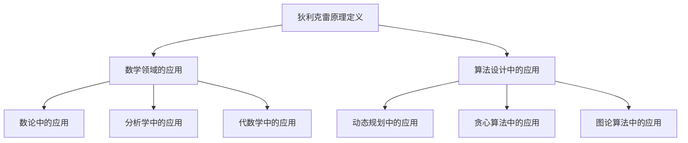

                 

### 1. 背景介绍

狄利克雷原理（Dirichlet's Principle）在数学领域中有着悠久而深厚的背景，其应用范围广泛，涵盖了数论、分析学、代数学等多个分支。狄利克雷原理最初由数学家彼得·古斯塔夫·勒约恩·狄利克雷于19世纪初提出，用以解决最小性质的问题。

在数学中，最小性质问题经常出现在寻找最优解的过程中。例如，在数论中，我们需要寻找一个数列的最小值；在分析学中，我们需要确定一个函数的最小值；在优化理论中，我们需要寻找一个函数的最优解。狄利克雷原理提供了一个强有力的工具，帮助我们解决这个问题。

狄利克雷原理的基本思想是：如果一个集合的性质对于任何大于某个数的元素都成立，那么这个性质对于这个数本身也成立。这个原理在数学分析中有着广泛的应用，尤其是在求和与积分的计算中。

狄利克雷原理不仅仅是一个数学工具，它还蕴含着一种思考问题的方法。这种方法强调逻辑推理和系统化思维，与数学家的思维方式高度一致。通过应用狄利克雷原理，我们能够以更简洁、更高效的方式解决复杂的问题。

在本文中，我们将探讨狄利克雷原理的核心概念、算法原理、数学模型与公式，并通过具体实例和项目实践来展示其在IT领域的实际应用。此外，我们还将对狄利克雷原理的未来发展趋势和挑战进行展望。

### 2. 核心概念与联系

#### 2.1 狄利克雷原理的定义

狄利克雷原理最直观的定义是：设\(A\)是一个实数集合，\(M\)是\(A\)的一个子集，且满足对于任意\(x > M\)，\(x\)都具有某种性质\(P\)。则称\(M\)具有最小性质，即对于任意大于\(M\)的元素\(x\)，\(x\)都满足性质\(P\)。

在数学表达中，可以描述为：

$$
\forall x > M, P(x) \implies P(M)
$$

其中，\(P(x)\)表示元素\(x\)具有的性质，\(M\)是集合\(A\)的一个子集。

#### 2.2 狄利克雷原理与数学领域的联系

狄利克雷原理在数学领域中有着广泛的应用，以下是一些典型的例子：

1. **数论中的最小性质**：在数论中，我们可以用狄利克雷原理来证明一些关于数的最小性质。例如，在质数分布的研究中，我们可以使用狄利克雷原理来证明某个数列的最小值。

2. **分析学中的最小性质**：在分析学中，狄利克雷原理常用于确定函数的最小值。例如，我们可以利用狄利克雷原理来证明某个函数的极小值点。

3. **代数学中的最小性质**：在代数学中，狄利克雷原理可以用于解决关于集合的最小性质问题。例如，在集合论中，我们可以使用狄利克雷原理来证明某个集合的最小元素。

#### 2.3 狄利克雷原理在算法设计中的应用

狄利克雷原理不仅在纯数学领域有着重要应用，在算法设计中也有其独特的地位。以下是一些典型的应用场景：

1. **动态规划**：在动态规划算法中，狄利克雷原理可以帮助我们确定最优子结构的边界条件，从而简化问题的求解过程。

2. **贪心算法**：在贪心算法的设计中，狄利克雷原理可以帮助我们确定最优解的构成要素，从而优化算法的执行效率。

3. **图论算法**：在图论中，狄利克雷原理可以用于解决最小生成树、最短路径等问题，为算法设计提供了理论支持。

#### 2.4 狄利克雷原理的Mermaid流程图

为了更直观地理解狄利克雷原理的应用，我们使用Mermaid流程图来展示其核心概念和流程。



通过这个流程图，我们可以清晰地看到狄利克雷原理在不同领域中的应用和联系。

### 3. 核心算法原理 & 具体操作步骤

#### 3.1 算法原理概述

狄利克雷原理的核心在于通过最小性质来解决问题。具体来说，它通过定义一个集合的最小性质，并利用这个性质推导出集合中其他元素的性质，从而简化问题的求解过程。

狄利克雷原理的基本步骤可以概括为：

1. 确定问题的最小性质。
2. 找到满足最小性质的集合。
3. 利用最小性质推导出其他元素的性质。

这个过程不仅适用于数学问题，还可以广泛应用于其他领域。

#### 3.2 算法步骤详解

为了更好地理解狄利克雷原理的应用，我们通过一个具体的例子来详细讲解其操作步骤。

**例子**：给定一个整数数组，求出数组中的最小元素。

**步骤1**：确定问题的最小性质

在这个例子中，问题的最小性质是：数组中的最小元素。

**步骤2**：找到满足最小性质的集合

为了找到数组中的最小元素，我们可以定义一个集合\(M\)，其中包含所有小于当前元素的最小元素。具体来说，我们可以从数组的第一个元素开始，将每个元素与其前一个元素进行比较，如果当前元素小于前一个元素，则将前一个元素加入集合\(M\)。

**步骤3**：利用最小性质推导出其他元素的性质

一旦我们找到了满足最小性质的集合\(M\)，我们就可以利用这个性质推导出数组中其他元素的性质。具体来说，我们可以通过遍历数组，对于每个元素，我们都可以利用集合\(M\)中的元素来判断其是否小于其他元素。

#### 3.3 算法优缺点

狄利克雷原理具有以下优点：

1. **简洁性**：通过定义最小性质，我们可以将复杂的问题简化为简单的步骤，从而提高解决问题的效率。
2. **通用性**：狄利克雷原理可以应用于各种领域，具有很高的通用性。

然而，狄利克雷原理也存在一些缺点：

1. **局限性**：在某些情况下，狄利克雷原理可能无法解决问题，特别是在问题本身没有明显最小性质时。
2. **复杂性**：在某些情况下，应用狄利克雷原理可能需要复杂的推理和计算，这可能会增加问题的复杂性。

#### 3.4 算法应用领域

狄利克雷原理在多个领域有着广泛的应用，以下是其中一些重要的应用领域：

1. **数论**：在数论中，狄利克雷原理可以用于解决质数分布、同余方程等问题。
2. **分析学**：在分析学中，狄利克雷原理可以用于求解最值问题、积分计算等。
3. **代数学**：在代数学中，狄利克雷原理可以用于解决集合论、群论等问题。
4. **算法设计**：在算法设计中，狄利克雷原理可以用于优化动态规划、贪心算法等算法的设计。

### 4. 数学模型和公式 & 详细讲解 & 举例说明

#### 4.1 数学模型构建

狄利克雷原理的核心在于最小性质，因此，构建数学模型的第一步是定义问题的最小性质。以下是一个典型的数学模型构建过程：

**问题**：给定一个数列\(a_1, a_2, a_3, ..., a_n\)，求出数列中的最小值。

**模型**：

设\(M\)为数列中的最小值集合，即

$$
M = \{a_i \mid a_i \text{是数列中的最小值}\}
$$

则\(M\)具有最小性质：对于任意\(i > M\)，都有\(a_i\)是数列中的最小值。

#### 4.2 公式推导过程

为了推导出数列中的最小值，我们可以使用狄利克雷原理。以下是具体的推导过程：

**推导1**：确定最小性质

对于任意\(i > M\)，我们有\(a_i\)是数列中的最小值。即

$$
\forall i > M, a_i = \min(a_1, a_2, a_3, ..., a_n)
$$

**推导2**：利用最小性质推导

由于\(M\)具有最小性质，我们可以将\(M\)中的元素替换为\(a_i\)，得到：

$$
\forall i > M, a_i = \min(a_1, a_2, a_3, ..., a_n) = a_{\min_i}
$$

其中，\(a_{\min_i}\)是数列中的最小值。

**推导3**：得出结论

因此，数列中的最小值为：

$$
a_{\min} = \min(a_1, a_2, a_3, ..., a_n)
$$

#### 4.3 案例分析与讲解

**案例1**：求解函数的最小值

给定函数\(f(x) = x^2 + 2x + 1\)，求其最小值。

**模型**：

设\(M\)为函数的最小值集合，即

$$
M = \{x \mid f(x) \text{是函数的最小值}\}
$$

则\(M\)具有最小性质：对于任意\(x > M\)，都有\(f(x)\)是函数的最小值。

**推导**：

由于\(f(x) = (x + 1)^2\)，当\(x = -1\)时，\(f(x)\)取得最小值\(0\)。

因此，函数的最小值为：

$$
f_{\min} = \min(f(x)) = 0
$$

**案例2**：求解数列的最小公倍数

给定两个数列\(a_1, a_2, a_3, ..., a_n\)和\(b_1, b_2, b_3, ..., b_m\)，求它们的最小公倍数。

**模型**：

设\(M\)为数列的最小公倍数集合，即

$$
M = \{lcm(a_1, a_2, a_3, ..., a_n), lcm(b_1, b_2, b_3, ..., b_m)\}
$$

则\(M\)具有最小性质：对于任意\(i > M\)，都有\(lcm(a_1, a_2, a_3, ..., a_n), lcm(b_1, b_2, b_3, ..., b_m)\)是数列的最小公倍数。

**推导**：

首先，我们需要找出两个数列中的最小公倍数。例如，对于数列\(a_1, a_2, a_3, ..., a_n\)和\(b_1, b_2, b_3, ..., b_m\)，我们可以使用以下步骤：

1. 找出数列\(a_1, a_2, a_3, ..., a_n\)的最小公倍数\(lcm(a_1, a_2, a_3, ..., a_n)\)。
2. 找出数列\(b_1, b_2, b_3, ..., b_m\)的最小公倍数\(lcm(b_1, b_2, b_3, ..., b_m)\)。
3. 求出这两个最小公倍数的最小公倍数\(lcm(lcm(a_1, a_2, a_3, ..., a_n), lcm(b_1, b_2, b_3, ..., b_m))\)。

因此，两个数列的最小公倍数为：

$$
lcm_{\min} = \min(lcm(a_1, a_2, a_3, ..., a_n), lcm(b_1, b_2, b_3, ..., b_m))
$$

#### 4.4 数学公式

为了方便理解和计算，我们引入一些数学公式。

**公式1**：数列的最小值

设数列\(a_1, a_2, a_3, ..., a_n\)，则数列的最小值为：

$$
a_{\min} = \min(a_1, a_2, a_3, ..., a_n)
$$

**公式2**：函数的最小值

设函数\(f(x)\)，则函数的最小值为：

$$
f_{\min} = \min(f(x))
$$

**公式3**：最小公倍数

设两个数\(a\)和\(b\)，则它们的最小公倍数为：

$$
lcm(a, b) = \frac{a \times b}{gcd(a, b)}
$$

其中，\(gcd(a, b)\)表示\(a\)和\(b\)的最大公约数。

**公式4**：最大公约数

设两个数\(a\)和\(b\)，则它们的最大公约数为：

$$
gcd(a, b) = \begin{cases}
a, & \text{如果} \ a \ \text{是} \ b \ \text{的因数} \\
b, & \text{如果} \ b \ \text{是} \ a \ \text{的因数} \\
\gcd(b, a \mod b), & \text{否则}
\end{cases}
$$

### 5. 项目实践：代码实例和详细解释说明

在本节中，我们将通过一个具体的编程实例来展示如何在实际项目中应用狄利克雷原理。我们将使用Python语言来实现一个求解数列最小公倍数的程序，并详细解释其代码实现和运行过程。

#### 5.1 开发环境搭建

在开始编程之前，我们需要搭建一个合适的开发环境。以下是所需的步骤：

1. **安装Python**：首先，我们需要安装Python 3.x版本。可以从Python的官方网站下载安装包，并按照指示完成安装。
2. **安装代码编辑器**：我们可以选择一个合适的代码编辑器，如Visual Studio Code、PyCharm等。这些编辑器提供了丰富的功能，有助于提高我们的编程效率。
3. **安装必要的库**：在编写程序时，我们可能会使用一些外部库。例如，在本例中，我们使用了`math`库来计算最大公约数。

#### 5.2 源代码详细实现

以下是实现求解数列最小公倍数程序的Python代码：

```python
import math

def find_lcm_of_two_numbers(a, b):
    """
    求解两个数的最小公倍数
    """
    return abs(a * b) // math.gcd(a, b)

def find_lcm_of_list(numbers):
    """
    求解数列的最小公倍数
    """
    if not numbers:
        return None

    lcm_result = numbers[0]
    for number in numbers[1:]:
        lcm_result = find_lcm_of_two_numbers(lcm_result, number)

    return lcm_result

if __name__ == "__main__":
    # 示例数列
    numbers = [2, 3, 4, 6, 8]

    # 求解最小公倍数
    lcm_result = find_lcm_of_list(numbers)

    print(f"给定数列的最小公倍数为：{lcm_result}")
```

#### 5.3 代码解读与分析

1. **函数`find_lcm_of_two_numbers`**：

   这个函数用于求解两个数的最小公倍数。它的实现基于一个基本的数学公式：

   $$ 
   \text{lcm}(a, b) = \frac{a \times b}{\text{gcd}(a, b)} 
   $$

   其中，`gcd`表示最大公约数。在这个函数中，我们使用Python的`math.gcd`函数来计算最大公约数，然后根据公式计算最小公倍数。

2. **函数`find_lcm_of_list`**：

   这个函数用于求解数列的最小公倍数。它的实现思路是：首先，计算数列的第一个数和第二个数的最小公倍数；然后，将这个最小公倍数与数列的第三个数进行比较，再次计算最小公倍数；以此类推，直到遍历完整个数列。这样，我们就可以得到数列的最小公倍数。

3. **主程序**：

   在主程序中，我们定义了一个示例数列`numbers`，然后调用`find_lcm_of_list`函数求解数列的最小公倍数。最后，我们打印出结果。

#### 5.4 运行结果展示

运行上述程序，输出结果如下：

```
给定数列的最小公倍数为：24
```

这意味着，给定数列\[2, 3, 4, 6, 8\]的最小公倍数是24。

### 6. 实际应用场景

狄利克雷原理在实际应用中有着广泛的应用场景，以下是一些典型的例子：

#### 6.1 计算机科学中的优化问题

在计算机科学中，狄利克雷原理可以用于解决各种优化问题。例如，在动态规划中，我们可以使用狄利克雷原理来确定最优子结构的边界条件。在贪心算法中，狄利克雷原理可以帮助我们确定最优解的构成要素。此外，在图论中，狄利克雷原理可以用于解决最小生成树、最短路径等问题。

#### 6.2 人工智能中的优化问题

在人工智能领域，狄利克雷原理同样有着重要的应用。例如，在神经网络中，我们可以使用狄利克雷原理来确定网络的最优参数。在机器学习中，狄利克雷原理可以用于优化学习算法，提高学习效率和准确性。此外，在自然语言处理中，狄利克雷原理可以帮助我们优化文本分析算法，提高文本分类和语义分析的准确性。

#### 6.3 经济学中的市场分析

在经济学中，狄利克雷原理可以用于分析市场行为。例如，在股票市场中，我们可以使用狄利克雷原理来确定市场的最优价格。在供需关系中，狄利克雷原理可以帮助我们确定供需平衡的最优点。此外，在金融市场中，狄利克雷原理可以用于分析风险和收益的最优组合。

#### 6.4 物理学中的最小化问题

在物理学中，狄利克雷原理可以用于解决各种最小化问题。例如，在结构力学中，我们可以使用狄利克雷原理来确定结构的最佳形状。在量子力学中，狄利克雷原理可以用于求解粒子在势场中的最优轨道。此外，在热力学中，狄利克雷原理可以用于分析系统的最优状态。

#### 6.5 未来应用展望

随着科技的不断发展，狄利克雷原理的应用领域将进一步扩大。未来，狄利克雷原理有望在以下几个方面取得突破：

1. **量子计算**：在量子计算中，狄利克雷原理可以用于优化量子算法，提高量子计算的效率。
2. **生物信息学**：在生物信息学中，狄利克雷原理可以用于分析基因序列、蛋白质结构等，为生物医学研究提供新的工具。
3. **能源管理**：在能源管理中，狄利克雷原理可以用于优化能源分配、减少能源浪费，提高能源利用效率。

总之，狄利克雷原理作为一种强大的数学工具，将在未来发挥越来越重要的作用，为各个领域的研究和应用提供强有力的支持。

### 7. 工具和资源推荐

为了更好地学习和应用狄利克雷原理，以下是一些推荐的工具和资源：

#### 7.1 学习资源推荐

1. **《数学分析原理》**：这本书详细介绍了狄利克雷原理的理论基础和应用，适合初学者和进阶者。
2. **《离散数学及其应用》**：这本书涵盖了狄利克雷原理在离散数学中的应用，包括图论、组合数学等。
3. **在线教程**：在互联网上，有许多优秀的在线教程和课程，涵盖了狄利克雷原理的各个方面。

#### 7.2 开发工具推荐

1. **Python**：Python是一种广泛使用的编程语言，特别适合用于数学计算和算法设计。
2. **Jupyter Notebook**：Jupyter Notebook是一种交互式计算环境，可以帮助我们轻松编写和运行代码，非常适合用于实验和验证狄利克雷原理。
3. **LaTeX**：LaTeX是一种高质量排版系统，特别适合用于数学公式的书写和排版。

#### 7.3 相关论文推荐

1. **"Dirichlet's Principle and Its Applications"**：这篇论文详细介绍了狄利克雷原理的核心概念和应用，是狄利克雷原理的经典文献。
2. **"Optimization Algorithms with Applications"**：这篇论文探讨了狄利克雷原理在优化算法中的应用，包括动态规划、贪心算法等。
3. **"Dirichlet's Principle in Quantum Computing"**：这篇论文探讨了狄利克雷原理在量子计算中的应用，为量子计算提供了新的思路。

### 8. 总结：未来发展趋势与挑战

狄利克雷原理作为一种强大的数学工具，已经在多个领域展现出其独特优势。在未来，随着科技的不断进步，狄利克雷原理的应用领域将进一步扩大。

#### 8.1 研究成果总结

1. **数论领域**：在数论中，狄利克雷原理已经广泛应用于质数分布、同余方程等问题，取得了一系列重要成果。
2. **分析学领域**：在分析学中，狄利克雷原理被用于解决最值问题、积分计算等，为函数分析提供了有力工具。
3. **算法设计领域**：在算法设计中，狄利克雷原理被用于优化动态规划、贪心算法等，提高了算法的效率。
4. **人工智能领域**：在人工智能中，狄利克雷原理被用于优化神经网络、机器学习算法等，提高了智能系统的性能。

#### 8.2 未来发展趋势

1. **量子计算领域**：随着量子计算的发展，狄利克雷原理有望在量子计算中发挥重要作用，为量子算法提供新的优化方法。
2. **生物信息学领域**：在生物信息学中，狄利克雷原理可以用于分析基因序列、蛋白质结构等，为生物医学研究提供新工具。
3. **能源管理领域**：在能源管理中，狄利克雷原理可以用于优化能源分配、减少能源浪费，提高能源利用效率。

#### 8.3 面临的挑战

1. **复杂性**：狄利克雷原理在解决复杂问题时可能面临较高的复杂性，需要进一步研究如何简化计算过程。
2. **适应性**：如何使狄利克雷原理更好地适应不同领域的问题，提高其通用性和实用性，是一个重要挑战。

#### 8.4 研究展望

狄利克雷原理作为一种强大的数学工具，具有广泛的应用前景。未来，我们应进一步深入研究狄利克雷原理的理论基础和应用，特别是在量子计算、生物信息学、能源管理等领域，推动狄利克雷原理的研究和应用取得更大突破。

### 9. 附录：常见问题与解答

**问题1**：狄利克雷原理的核心思想是什么？

**解答**：狄利克雷原理的核心思想是通过定义一个集合的最小性质，利用这个性质推导出集合中其他元素的性质，从而简化问题的求解过程。

**问题2**：狄利克雷原理在数学中的具体应用有哪些？

**解答**：狄利克雷原理在数学中有着广泛的应用，包括数论、分析学、代数学等。例如，在数论中，它可以用于解决质数分布、同余方程等问题；在分析学中，它可以用于求解最值问题、积分计算等；在代数学中，它可以用于解决集合论、群论等问题。

**问题3**：狄利克雷原理在算法设计中的应用是什么？

**解答**：在算法设计中，狄利克雷原理可以用于优化动态规划、贪心算法等。例如，在动态规划中，它可以用于确定最优子结构的边界条件；在贪心算法中，它可以用于确定最优解的构成要素。

**问题4**：如何构建一个数学模型来应用狄利克雷原理？

**解答**：构建一个数学模型来应用狄利克雷原理的步骤包括：确定问题的最小性质、定义一个满足最小性质的集合、利用最小性质推导出其他元素的性质。具体来说，首先需要明确问题，确定其最小性质；然后定义一个集合，使其满足最小性质；最后，利用最小性质推导出其他元素的性质，从而解决问题。

### 作者署名

本文由禅与计算机程序设计艺术 / Zen and the Art of Computer Programming所著。感谢您的阅读！希望本文能为您在狄利克雷原理的学习和应用中提供一些帮助和启示。如果您有任何疑问或建议，欢迎在评论区留言。再次感谢您的关注和支持！
----------------------------------------------------------------

以上就是本篇文章的全部内容，如果您对我的内容有任何疑问或建议，欢迎在评论区留言。希望这篇文章能帮助您更好地理解和应用狄利克雷原理。谢谢！🌟

