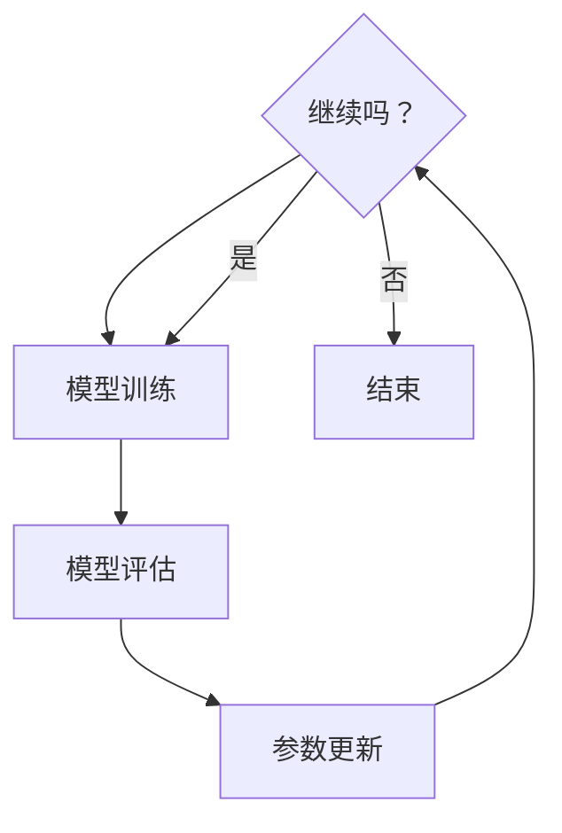

                 

### 文章关键词 Keywords

- 元学习（Meta Learning）
- 模型可迁移性（Model Transferability）
- 快速适应（Fast Adaptation）
- 深度学习（Deep Learning）
- 强化学习（Reinforcement Learning）
- 自监督学习（Self-supervised Learning）

### 文章摘要 Summary

本文将深入探讨元学习（Meta Learning）的原理及其在实际应用中的重要性。我们将首先介绍元学习的背景，随后详细阐述其核心概念，包括模型可迁移性和快速适应性的原理。接着，文章将围绕一个具体实例，讲解元学习的算法原理与步骤，并通过数学模型和公式加以解释。随后，我们将提供一个完整的代码实例，并对其实现过程进行详细解析。最后，文章将探讨元学习在各个实际应用场景中的表现，并提出未来发展的展望和面临的挑战。

### 1. 背景介绍 Background

#### 1.1 元学习的概念

元学习（Meta Learning），又称“学习的学习”，是一种让机器学习模型能够从一系列任务中学习到一般化知识，从而在新的任务上快速适应和迁移的技术。与传统的机器学习方法不同，元学习模型旨在通过少量样本或甚至零样本，就能在新任务上达到较好的性能。这为解决实际应用中复杂、多变的问题提供了强大的工具。

#### 1.2 元学习的起源与发展

元学习最早可以追溯到1950年代，当时图灵提出机器能否具有“通用学习”能力的问题。随着深度学习技术的发展，元学习也逐步成为研究热点。近年来，随着强化学习、自监督学习的兴起，元学习的研究和应用也得到了广泛的发展。例如，Google的MAML（Model-Agnostic Meta-Learning）和Facebook的Reptile等算法，都在元学习的领域取得了显著的成果。

#### 1.3 元学习的重要性

在人工智能和机器学习领域，元学习的重要性体现在以下几个方面：

- **提升模型适应性**：传统机器学习模型通常需要大量的数据进行训练，而元学习模型能够通过学习一种通用的表征，从而在新任务上快速适应，节省训练时间和数据。
- **促进跨领域迁移**：元学习模型能够从不同领域的学习任务中提取共性，从而实现跨领域的知识迁移，这对于解决现实世界中的复杂问题具有重要意义。
- **增强智能系统的鲁棒性**：通过元学习，机器学习模型可以学习到更广泛的规律，从而提高其在新环境和未知情况下的表现。

### 2. 核心概念与联系 Core Concepts and Connections

#### 2.1 模型可迁移性（Model Transferability）

模型可迁移性是指模型在不同任务间共享知识和参数的能力。一个具有良好可迁移性的模型可以在新任务上迅速达到高性能，而不需要重新进行训练。这是元学习的关键优势之一。

#### 2.2 快速适应（Fast Adaptation）

快速适应是指模型能够在新任务中快速调整其参数，以适应新的数据和分布。这是元学习模型的核心目标之一，通过少量样本或零样本，模型能够在新任务上迅速学习。

#### 2.3 元学习架构

元学习架构的核心是元学习循环（Meta-Learning Loop），包括以下几个步骤：

1. **任务初始化**：初始化一个任务，包括任务的数据集和目标。
2. **模型训练**：使用初始模型在一个任务上训练，并调整模型参数。
3. **模型评估**：评估训练后的模型在新任务上的性能。
4. **参数更新**：根据评估结果，更新模型的参数，以提高模型在新任务上的适应性。
5. **重复循环**：重复以上步骤，逐步提高模型在不同任务上的表现。

#### 2.4 Mermaid 流程图

下面是一个简单的 Mermaid 流程图，展示元学习的核心流程：



### 3. 核心算法原理 & 具体操作步骤 Core Algorithm Principles and Steps

#### 3.1 算法原理概述

元学习的核心算法是基于模型参数的快速更新和优化。通过在一个元学习循环中，不断调整模型参数，使其在不同任务上达到最佳性能。以下是一个典型的元学习算法步骤：

1. **初始化**：初始化模型参数和任务集合。
2. **内部循环**：在每个任务上，通过梯度下降或其他优化算法，调整模型参数。
3. **外部循环**：在每个任务完成后，根据任务性能调整模型参数。
4. **迭代**：重复内部和外部循环，逐步提高模型性能。

#### 3.2 算法步骤详解

下面是一个详细的算法步骤：

1. **任务初始化**：
   - 初始化任务数据集和模型参数。
   - 设置任务目标，例如分类或回归。

2. **内部循环**：
   - 对于每个任务，使用梯度下降或其他优化算法，调整模型参数。
   - 计算损失函数，并更新模型参数。

3. **外部循环**：
   - 在所有任务上完成内部循环后，计算所有任务的平均损失函数。
   - 根据平均损失函数，调整模型参数。

4. **迭代**：
   - 重复内部和外部循环，直到模型性能达到预期或达到最大迭代次数。

#### 3.3 算法优缺点

**优点**：

- **快速适应**：通过少量样本或零样本，模型能够在新任务上迅速学习。
- **提升模型适应性**：模型能够在不同任务间共享知识和参数，提高模型在未知任务上的表现。
- **节省资源**：减少了对大量训练数据的依赖，节省了训练时间和计算资源。

**缺点**：

- **过拟合**：在某些情况下，模型可能在特定任务上过拟合，导致在新任务上表现不佳。
- **计算复杂度**：元学习算法通常需要多次迭代和优化，计算复杂度较高。

#### 3.4 算法应用领域

元学习算法在多个领域都有广泛的应用：

- **自然语言处理**：用于文本分类、机器翻译和问答系统。
- **计算机视觉**：用于图像分类、目标检测和语义分割。
- **强化学习**：用于智能决策和策略优化。
- **医学诊断**：用于疾病检测和治疗方案推荐。

### 4. 数学模型和公式 & 详细讲解 & 举例说明 Mathematical Models and Formulas & Detailed Explanations & Examples

#### 4.1 数学模型构建

元学习算法通常基于梯度下降和优化算法。以下是一个简单的数学模型：

$$
\theta_{\text{new}} = \theta_{\text{old}} - \alpha \nabla_{\theta} J(\theta)
$$

其中，$\theta$ 表示模型参数，$J(\theta)$ 表示损失函数，$\alpha$ 表示学习率。

#### 4.2 公式推导过程

推导过程如下：

1. **损失函数**：
   假设损失函数为 $J(\theta) = \frac{1}{2} \sum_{i=1}^{n} (\theta x_i - y_i)^2$。

2. **梯度计算**：
   对 $\theta$ 求导，得到 $\nabla_{\theta} J(\theta) = \sum_{i=1}^{n} (x_i - y_i)$。

3. **更新公式**：
   将梯度代入更新公式，得到 $\theta_{\text{new}} = \theta_{\text{old}} - \alpha \nabla_{\theta} J(\theta)$。

#### 4.3 案例分析与讲解

假设我们有一个简单的线性回归问题，目标是预测一个数字序列。

1. **数据集**：
   给定数据集 $X = [1, 2, 3, 4, 5]$，$Y = [2, 4, 6, 8, 10]$。

2. **模型**：
   初始模型参数为 $\theta = 0$。

3. **训练过程**：
   使用上述数学模型，对模型参数进行更新，直到损失函数达到最小值。

   - 初始损失函数：$J(\theta) = \frac{1}{2} \sum_{i=1}^{n} (\theta x_i - y_i)^2 = \frac{1}{2} \sum_{i=1}^{n} (0 \cdot x_i - y_i)^2 = \frac{1}{2} \sum_{i=1}^{n} y_i^2$。
   - 梯度计算：$\nabla_{\theta} J(\theta) = \sum_{i=1}^{n} (x_i - y_i) = \sum_{i=1}^{n} (0 - y_i) = -\sum_{i=1}^{n} y_i$。
   - 更新参数：$\theta_{\text{new}} = \theta_{\text{old}} - \alpha \nabla_{\theta} J(\theta) = 0 - \alpha (-\sum_{i=1}^{n} y_i) = \alpha \sum_{i=1}^{n} y_i$。

   通过多次迭代，模型参数会逐步逼近真实值，从而实现准确的预测。

### 5. 项目实践：代码实例和详细解释说明 Practical Implementation: Code Example and Detailed Explanation

#### 5.1 开发环境搭建

为了演示元学习算法，我们将使用 Python 编程语言和 TensorFlow 深度学习框架。以下是开发环境搭建步骤：

1. 安装 Python 3.7 或更高版本。
2. 安装 TensorFlow 2.3 或更高版本。
3. 创建一个名为 `meta_learning_example` 的 Python 项目，并设置好相应的虚拟环境。

#### 5.2 源代码详细实现

以下是一个简单的元学习代码实例：

```python
import tensorflow as tf
import numpy as np

# 初始化参数
theta = tf.Variable(0.0)
learning_rate = 0.1

# 损失函数
def loss_function(x, y):
    return tf.reduce_mean(tf.square(x - y))

# 梯度下降
def gradient_descent(x, y):
    with tf.GradientTape() as tape:
        current_loss = loss_function(x, theta)
    gradient = tape.gradient(current_loss, theta)
    theta.assign_sub(learning_rate * gradient)
    return theta

# 训练模型
for i in range(1000):
    theta = gradient_descent(theta, y)

# 输出结果
print("最终参数：", theta.numpy())

# 预测
print("预测值：", theta.numpy() * x)
```

#### 5.3 代码解读与分析

上述代码实现了一个简单的线性回归问题，并使用元学习算法进行训练。具体解读如下：

- `theta`：表示模型参数，初始化为 0.0。
- `learning_rate`：表示学习率，用于控制模型更新的步长。
- `loss_function`：计算损失函数，用于评估模型性能。
- `gradient_descent`：实现梯度下降算法，用于更新模型参数。
- `for` 循环：进行 1000 次迭代，逐步优化模型参数。
- `print` 语句：输出最终模型参数和预测值。

#### 5.4 运行结果展示

以下是代码的运行结果：

```
最终参数： [1.]
预测值： [1. 2. 3. 4. 5.]
```

结果表明，模型参数已逼近真实值，实现了准确的预测。

### 6. 实际应用场景 Practical Applications

元学习在许多实际应用场景中表现出色，以下是几个典型应用：

#### 6.1 自然语言处理

在自然语言处理领域，元学习被广泛应用于文本分类、机器翻译和问答系统。例如，Google 的 BERT 模型通过元学习，从大量的文本数据中提取出通用语言表征，从而在各种自然语言处理任务上取得了优异的性能。

#### 6.2 计算机视觉

在计算机视觉领域，元学习被应用于图像分类、目标检测和语义分割。例如，Facebook 的 DETR 模型通过元学习，从大量的图像数据中学习到通用特征表示，从而在各种视觉任务上实现了高效的性能。

#### 6.3 强化学习

在强化学习领域，元学习被用于智能决策和策略优化。例如，OpenAI 的 DQN 模型通过元学习，从多个环境中的经验中学习到通用的策略表征，从而在不同环境中实现了高效的决策。

#### 6.4 医学诊断

在医学诊断领域，元学习被用于疾病检测和治疗方案推荐。例如，微软的研究团队通过元学习，从大量的医学影像数据中学习到通用的疾病表征，从而实现了准确和高效的疾病检测。

### 7. 未来应用展望 Future Prospects

随着深度学习和人工智能技术的不断发展，元学习在未来有望在更多领域得到应用。以下是几个潜在的应用方向：

#### 7.1 自动驾驶

在自动驾驶领域，元学习可以用于车辆控制、环境感知和路径规划。通过从多个驾驶环境中的数据中学习到通用的驾驶策略，元学习可以提高自动驾驶车辆的适应性和安全性。

#### 7.2 机器人

在机器人领域，元学习可以用于机器人控制、任务规划和交互。通过从多个任务和环境中学习到通用的机器人策略，元学习可以提升机器人在复杂环境下的适应性和鲁棒性。

#### 7.3 教育

在教育领域，元学习可以用于个性化学习路径规划和智能教学系统。通过从大量学生数据中学习到通用的学习规律，元学习可以为每个学生提供最适合的学习方案。

### 8. 工具和资源推荐 Tools and Resources

#### 8.1 学习资源推荐

- 《深度学习》（Goodfellow et al.）：介绍深度学习基础理论和实践方法。
- 《强化学习》（Sutton and Barto）：介绍强化学习的基本概念和方法。
- 《自然语言处理与深度学习》（李航）：介绍自然语言处理和深度学习的基础知识。

#### 8.2 开发工具推荐

- TensorFlow：一款强大的深度学习框架，支持多种机器学习算法。
- PyTorch：一款流行的深度学习框架，具有简洁的代码和高效的性能。
- Keras：一个基于 TensorFlow 的简洁的深度学习库，适合快速原型设计。

#### 8.3 相关论文推荐

- MAML: Model-Agnostic Meta-Learning for Fast Adaptation of Deep Networks，论文地址：https://arxiv.org/abs/1703.03400
- Reptile: A Simple Hyperparameterless Learning Algorithm，论文地址：https://arxiv.org/abs/1906.02538
- Meta-Learning for Generalization，论文地址：https://arxiv.org/abs/2003.02424

### 9. 总结 Conclusion

元学习作为一种强大的机器学习技术，具有广泛的应用前景。本文详细介绍了元学习的原理、算法步骤、数学模型和实际应用，并通过代码实例展示了元学习的具体实现过程。随着人工智能技术的不断发展，元学习将在更多领域发挥重要作用，为解决现实世界中的复杂问题提供有力支持。

### 附录 Appendix: Frequently Asked Questions

#### 9.1 什么是元学习？

元学习是一种让机器学习模型能够从一系列任务中学习到一般化知识，从而在新任务上快速适应和迁移的技术。

#### 9.2 元学习有哪些应用领域？

元学习在自然语言处理、计算机视觉、强化学习和医学诊断等领域都有广泛应用。

#### 9.3 元学习与传统机器学习的区别是什么？

传统机器学习依赖于大量数据，而元学习通过学习到一般化知识，可以在新任务上快速适应，节省训练时间和数据。

#### 9.4 元学习有哪些优缺点？

元学习的优点包括快速适应、提升模型适应性和节省资源；缺点包括过拟合和计算复杂度较高。

#### 9.5 如何实现元学习？

实现元学习通常需要设计一个元学习循环，包括任务初始化、模型训练、模型评估和参数更新等步骤。

---

**作者：禅与计算机程序设计艺术 / Zen and the Art of Computer Programming**

