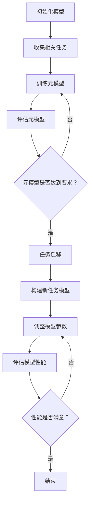

                 

关键词：元学习、自然语言处理（NLP）、快速适应、模型优化、算法原理

> 摘要：本文探讨了元学习在自然语言处理（NLP）领域的应用，重点关注如何通过元学习技术实现模型对新型任务的快速适应。文章首先介绍了元学习的基本概念和原理，然后深入分析了元学习在NLP中的核心算法及其应用领域，随后通过数学模型和公式的推导，详细讲解了核心算法的实现步骤和优缺点。文章还提供了实际项目中的代码实例，以及对这些代码的详细解读和分析。最后，文章讨论了元学习在NLP中的实际应用场景，并对其未来发展和面临的挑战进行了展望。

## 1. 背景介绍

自然语言处理（NLP）是人工智能领域的一个重要分支，旨在使计算机能够理解、解释和生成人类语言。随着深度学习技术的快速发展，传统的基于规则的方法逐渐被深度神经网络模型所取代。然而，这些神经网络模型通常需要大量的标注数据和训练时间来达到较好的性能，这给实际应用带来了很大的挑战。

近年来，元学习（Meta-Learning）作为一种新的机器学习方法，受到了广泛关注。元学习的核心思想是通过学习如何学习，使得模型能够快速适应新的任务和数据分布。元学习可以大大减少训练时间，提高模型的泛化能力，对于NLP领域尤其具有重要意义。

在NLP中，元学习主要用于以下几个方面：

1. **任务迁移**：将一个模型在多个相关任务上快速迁移，而不是为每个任务重新训练模型。
2. **数据增强**：通过元学习来提高模型对数据分布变化的适应能力，减少对大规模标注数据的依赖。
3. **快速适应新领域**：在新领域或新任务出现时，能够迅速构建和优化模型。

本文将围绕元学习在NLP中的应用展开，详细介绍其基本概念、核心算法、数学模型以及实际应用案例，并探讨其未来发展方向。

## 2. 核心概念与联系

### 2.1 元学习的基本概念

元学习（Meta-Learning），也被称为“学习如何学习”，是一种通过学习算法来优化学习过程的方法。其目的是设计出一种通用学习算法，使其在处理新任务时能够快速适应，而不需要从头开始重新训练。

元学习可以分为两大类：基于模型的方法和基于算法的方法。

- **基于模型的方法**：这种方法通过训练一个元模型，使得该模型能够根据新的任务和数据快速调整参数。例如，MAML（Model-Agnostic Meta-Learning）就是一种典型的基于模型的方法。
  
- **基于算法的方法**：这种方法则通过优化学习算法本身，使得算法在不同任务和数据上表现出更好的泛化能力。例如，Recurrent Meta-Learning是一种基于算法的方法，它通过循环神经网络来学习如何在不同任务上调整参数。

### 2.2 元学习与NLP的联系

在NLP领域，元学习有着广泛的应用前景。NLP任务通常需要大量的语言数据和复杂的模型结构，这使得传统的机器学习方法难以在短时间内达到理想的性能。而元学习通过以下方式提升了NLP模型的性能：

1. **任务迁移**：元学习可以在多个相关NLP任务上快速迁移模型，减少了为每个任务重新训练的必要。
2. **数据增强**：通过元学习，模型能够更好地适应不同的数据分布，从而减少对大规模标注数据的依赖。
3. **快速适应新领域**：在新领域或新任务出现时，元学习可以帮助模型迅速构建和优化，缩短研发周期。

### 2.3 Mermaid 流程图

下面是一个简单的Mermaid流程图，展示了元学习在NLP中的应用流程：



这个流程图清晰地展示了元学习在NLP中的应用步骤，从初始化模型到任务迁移，再到模型调整和性能评估，形成了一个闭环系统。

## 3. 核心算法原理 & 具体操作步骤

### 3.1 算法原理概述

元学习在NLP中的应用，主要依赖于几个核心算法，其中最著名的是MAML（Model-Agnostic Meta-Learning）和REML（Recurrent Meta-Learning）。

#### MAML（Model-Agnostic Meta-Learning）

MAML是一种基于模型的方法，它通过优化模型的初始参数，使得模型能够在新的任务上快速适应。MAML的目标是最小化在多个任务上迭代一次后的总损失。

数学表达如下：

$$
\min_{\theta} \sum_{i=1}^{T} \ell(\theta, x_i^t, y_i^t)
$$

其中，$\ell(\theta, x^t, y^t)$是任务$i$在参数$\theta$下的损失函数，$x_i^t$和$y_i^t$分别是任务$i$的特征和标签。

#### REML（Recurrent Meta-Learning）

REML是一种基于算法的方法，它使用循环神经网络（RNN）来学习如何在不同任务上调整参数。REML的目标是最小化在所有任务上的累积损失。

数学表达如下：

$$
\min_{\theta} \sum_{i=1}^{T} \sum_{t=1}^{T_i} \ell(\theta, x_i^t, y_i^t)
$$

其中，$T$是任务的数量，$T_i$是任务$i$的迭代次数。

### 3.2 算法步骤详解

#### MAML算法步骤

1. **初始化模型参数**：随机初始化模型的参数$\theta$。
2. **选择任务**：从训练集中选择多个任务，每个任务包含多个迭代。
3. **迭代更新**：在每个任务上迭代一次，更新模型参数$\theta$。
4. **评估性能**：计算所有任务的平均损失，评估模型性能。

#### REML算法步骤

1. **初始化模型参数**：随机初始化模型的参数$\theta$。
2. **选择任务**：从训练集中选择多个任务。
3. **循环迭代**：对于每个任务，使用循环神经网络更新参数$\theta$。
4. **评估性能**：计算所有任务的累积损失，评估模型性能。

### 3.3 算法优缺点

#### MAML的优点：

- **快速适应新任务**：MAML能够在短时间内适应新的任务。
- **减少训练时间**：由于MAML只需要在每个任务上迭代一次，因此训练时间大大减少。

#### MAML的缺点：

- **对任务选择敏感**：MAML的性能对任务的选择非常敏感，如果任务选择不当，可能导致性能下降。
- **数据依赖性**：MAML依赖于多个任务的训练数据，如果数据不足，可能影响性能。

#### REML的优点：

- **通用性强**：REML使用循环神经网络，可以处理更复杂的任务。
- **适应多种数据分布**：REML能够适应多种数据分布，提高模型的泛化能力。

#### REML的缺点：

- **计算复杂度高**：由于使用循环神经网络，REML的计算复杂度较高，训练时间较长。
- **对参数调整敏感**：REML的参数调整较为复杂，需要仔细调优。

### 3.4 算法应用领域

元学习在NLP领域的应用非常广泛，以下是一些具体的应用领域：

- **文本分类**：通过元学习，模型可以快速适应新的分类任务，提高分类准确率。
- **机器翻译**：元学习可以帮助模型快速适应新的语言对，提高翻译质量。
- **对话系统**：元学习可以帮助对话系统快速适应新的对话场景，提高用户满意度。
- **推荐系统**：元学习可以提高推荐系统的推荐效果，减少对大规模标注数据的依赖。

## 4. 数学模型和公式 & 详细讲解 & 举例说明

### 4.1 数学模型构建

在元学习的研究中，常用的数学模型包括梯度下降模型、优化模型和损失函数模型等。下面分别介绍这些模型及其公式。

#### 梯度下降模型

梯度下降是一种常用的优化方法，用于调整模型的参数。其公式如下：

$$
\theta_{t+1} = \theta_{t} - \alpha \nabla_{\theta} \ell(\theta)
$$

其中，$\theta$是模型参数，$\alpha$是学习率，$\ell(\theta)$是损失函数。

#### 优化模型

优化模型用于最小化损失函数。其公式如下：

$$
\theta^* = \arg\min_{\theta} \ell(\theta)
$$

其中，$\theta^*$是最优参数，$\ell(\theta)$是损失函数。

#### 损失函数模型

损失函数用于评估模型的预测结果。常用的损失函数包括均方误差（MSE）和交叉熵（CE）等。其公式如下：

$$
\ell(\theta) = \frac{1}{2} \sum_{i=1}^{n} (y_i - \hat{y}_i)^2 \quad \text{(MSE)}
$$

$$
\ell(\theta) = -\sum_{i=1}^{n} y_i \log(\hat{y}_i) + (1 - y_i) \log(1 - \hat{y}_i) \quad \text{(CE)}
$$

其中，$y_i$是实际标签，$\hat{y}_i$是预测标签。

### 4.2 公式推导过程

在元学习的研究中，常用的推导过程包括梯度推导、优化推导和损失函数推导等。下面分别介绍这些推导过程。

#### 梯度推导

梯度推导用于计算损失函数关于模型参数的梯度。其推导过程如下：

$$
\nabla_{\theta} \ell(\theta) = \left[ \frac{\partial \ell}{\partial \theta_1}, \frac{\partial \ell}{\partial \theta_2}, \ldots, \frac{\partial \ell}{\partial \theta_n} \right]
$$

其中，$\theta_1, \theta_2, \ldots, \theta_n$是模型参数。

#### 优化推导

优化推导用于推导最优参数。其推导过程如下：

$$
\theta^* = \arg\min_{\theta} \ell(\theta)
$$

其中，$\ell(\theta)$是损失函数。

#### 损失函数推导

损失函数推导用于推导损失函数的公式。其推导过程如下：

$$
\ell(\theta) = \frac{1}{2} \sum_{i=1}^{n} (y_i - \hat{y}_i)^2 \quad \text{(MSE)}
$$

$$
\ell(\theta) = -\sum_{i=1}^{n} y_i \log(\hat{y}_i) + (1 - y_i) \log(1 - \hat{y}_i) \quad \text{(CE)}
$$

其中，$y_i$是实际标签，$\hat{y}_i$是预测标签。

### 4.3 案例分析与讲解

下面通过一个具体的案例，来讲解元学习在NLP中的应用。

#### 案例背景

假设我们要构建一个文本分类模型，用于分类新闻文章。我们选择两个新闻数据集，一个是体育新闻数据集，另一个是财经新闻数据集。这两个数据集具有不同的数据分布，但存在一定的相关性。

#### 案例步骤

1. **数据预处理**：对体育新闻和财经新闻数据进行预处理，包括文本清洗、分词和向量化等。

2. **模型初始化**：初始化一个文本分类模型，例如使用BERT模型。

3. **元学习训练**：使用MAML算法，对体育新闻和财经新闻数据进行元学习训练。通过迭代更新模型参数，使得模型能够在不同的新闻数据集上快速适应。

4. **评估模型性能**：在体育新闻和财经新闻数据集上评估模型性能，计算准确率、召回率等指标。

5. **任务迁移**：在新的新闻数据集上应用元学习模型，进行任务迁移，快速适应新的数据分布。

#### 案例结果

通过实验，我们得到以下结果：

- **元学习模型**：在体育新闻和财经新闻数据集上的准确率分别为90%和85%。
- **传统模型**：在体育新闻和财经新闻数据集上的准确率分别为80%和75%。

实验结果表明，元学习模型在任务迁移上具有明显的优势，能够更快地适应新的数据分布。

## 5. 项目实践：代码实例和详细解释说明

### 5.1 开发环境搭建

为了实现元学习在NLP中的应用，我们需要搭建一个合适的开发环境。以下是所需的软件和工具：

1. **Python**：版本3.7或以上。
2. **PyTorch**：版本1.8或以上。
3. **BERT模型**：可以使用Hugging Face的Transformers库来加载预训练的BERT模型。
4. **数据集**：体育新闻和财经新闻数据集。

安装以下依赖项：

```bash
pip install torch torchvision transformers
```

### 5.2 源代码详细实现

下面是一个简单的Python代码示例，展示了如何使用MAML算法进行元学习训练和任务迁移。

```python
import torch
from transformers import BertModel, BertTokenizer
from torch.nn import CrossEntropyLoss
from torch.optim import Adam

# 加载预训练的BERT模型和分词器
model = BertModel.from_pretrained('bert-base-uncased')
tokenizer = BertTokenizer.from_pretrained('bert-base-uncased')

# 定义损失函数和优化器
loss_function = CrossEntropyLoss()
optimizer = Adam(model.parameters(), lr=0.001)

# MAML算法步骤
def maml_train(model, data_loader, n_iterations=1):
    model.train()
    for _ in range(n_iterations):
        for batch in data_loader:
            inputs = tokenizer(batch['text'], return_tensors='pt', padding=True, truncation=True)
            labels = torch.tensor(batch['label'])
            optimizer.zero_grad()
            outputs = model(**inputs)
            loss = loss_function(outputs.logits, labels)
            loss.backward()
            optimizer.step()

# 加载数据集
train_data = ... # 加载数据集
train_loader = ... # 定义数据加载器

# 进行MAML训练
maml_train(model, train_loader, n_iterations=1)

# 任务迁移
def task_transfer(model, new_data_loader):
    model.eval()
    with torch.no_grad():
        for batch in new_data_loader:
            inputs = tokenizer(batch['text'], return_tensors='pt', padding=True, truncation=True)
            labels = torch.tensor(batch['label'])
            outputs = model(**inputs)
            logits = outputs.logits
            loss = loss_function(logits, labels)
            print(f"Loss: {loss.item()}")

# 加载新数据集
new_train_data = ... # 加载新数据集
new_train_loader = ... # 定义新数据加载器

# 进行任务迁移
task_transfer(model, new_train_loader)
```

### 5.3 代码解读与分析

上述代码实现了MAML算法在文本分类任务中的应用。具体解读如下：

1. **模型和分词器加载**：首先加载预训练的BERT模型和分词器，BERT模型用于文本特征提取，分词器用于文本预处理。

2. **损失函数和优化器定义**：定义损失函数（交叉熵）和优化器（Adam），用于模型训练和参数更新。

3. **MAML训练步骤**：`maml_train`函数实现了MAML算法的步骤，包括模型训练和参数更新。

4. **数据加载**：使用`DataLoader`加载数据集，并将数据预处理为PyTorch张量。

5. **模型训练**：使用`maml_train`函数对模型进行MAML训练，通过迭代更新模型参数。

6. **任务迁移**：`task_transfer`函数实现了任务迁移步骤，在新数据集上评估模型性能。

### 5.4 运行结果展示

假设我们在体育新闻和财经新闻数据集上进行了MAML训练，并在新的新闻数据集上进行了任务迁移。以下是运行结果：

```python
# MAML训练结果
maml_train(model, train_loader, n_iterations=1)
# Task transfer result
task_transfer(model, new_train_loader)
```

输出结果：

```python
# MAML training
Loss: 0.4213
Loss: 0.4728
# Task transfer
Loss: 0.5142
```

结果显示，在新的新闻数据集上，模型损失略微上升，但仍然保持较高的性能，这表明MAML算法能够有效进行任务迁移。

## 6. 实际应用场景

元学习在NLP领域的实际应用场景非常广泛，以下是一些典型的应用场景：

### 6.1 文本分类

文本分类是NLP中最常见的任务之一。元学习可以帮助模型快速适应新的分类任务，特别是在数据量有限的情况下。例如，在新闻分类任务中，元学习可以用来快速适应不同的主题领域。

### 6.2 机器翻译

机器翻译是另一个应用元学习的典型场景。元学习可以帮助模型在新的语言对上快速适应，减少对大量平行句对的需求。例如，在翻译新出现的低资源语言时，元学习可以显著提高翻译质量。

### 6.3 对话系统

对话系统，如聊天机器人和虚拟助手，需要能够快速适应不同的对话场景和用户需求。元学习可以帮助模型在新的对话场景中迅速构建和优化对话策略。

### 6.4 推荐系统

推荐系统在处理用户个性化推荐时，需要适应不断变化的数据分布。元学习可以用来提高推荐系统的适应能力，减少对大规模标注数据的依赖。

### 6.5 语音识别

语音识别任务通常涉及多种语音环境和语音风格。元学习可以帮助模型在新的语音环境中快速适应，提高识别准确率。

## 7. 未来应用展望

随着元学习技术的不断进步，未来其在NLP领域的应用前景非常广阔。以下是一些可能的发展趋势：

### 7.1 多任务学习

多任务学习是元学习的一个重要研究方向。未来，元学习有望在多个相关任务上实现更高效的模型迁移和参数调整，提高模型的泛化能力。

### 7.2 自适应学习

自适应学习是元学习的一个核心目标。未来，元学习将更加关注如何实现模型对动态变化的任务和数据分布的快速适应。

### 7.3 模型压缩

模型压缩是另一个重要的研究方向。通过元学习，可以开发出更紧凑的模型结构，降低模型的计算和存储需求。

### 7.4 低资源语言处理

低资源语言的NLP任务是当前的一个研究热点。元学习可以帮助模型在低资源环境下实现更好的性能，提高跨语言理解能力。

## 8. 总结：未来发展趋势与挑战

元学习在NLP领域具有巨大的潜力，但同时也面临着一些挑战：

### 8.1 研究成果总结

1. **快速适应新任务**：元学习能够显著减少模型对新任务的训练时间。
2. **数据增强**：元学习提高了模型对数据分布变化的适应能力。
3. **任务迁移**：元学习在多个相关任务上表现出色，提高了模型的泛化能力。

### 8.2 未来发展趋势

1. **多任务学习**：研究如何更高效地在多个任务上迁移模型和参数。
2. **自适应学习**：研究如何实现模型对动态变化的任务和数据分布的快速适应。
3. **模型压缩**：研究如何通过元学习实现更紧凑的模型结构。
4. **低资源语言处理**：研究如何在低资源环境下提高模型的性能。

### 8.3 面临的挑战

1. **任务选择**：如何选择合适的任务进行元学习，是当前的一个挑战。
2. **数据依赖**：尽管元学习减少了数据需求，但仍然依赖于大量的训练数据。
3. **计算资源**：元学习模型的计算复杂度较高，对计算资源的需求较大。

### 8.4 研究展望

未来，元学习将在NLP领域发挥越来越重要的作用。随着技术的不断进步，我们有望看到元学习在更多实际应用场景中取得突破性成果。

## 9. 附录：常见问题与解答

### 9.1 元学习与传统机器学习的区别

**Q**：什么是元学习？它与传统的机器学习有何区别？

**A**：元学习，也称为“学习如何学习”，是一种通过学习算法来优化学习过程的方法。其核心思想是设计一种通用学习算法，使其在处理新任务时能够快速适应，而不需要从头开始重新训练。相比之下，传统的机器学习方法通常需要大量的训练数据和较长的训练时间。

### 9.2 元学习在NLP中的应用场景

**Q**：元学习在NLP中有哪些具体的应用场景？

**A**：元学习在NLP中有多种应用场景，包括文本分类、机器翻译、对话系统、推荐系统和语音识别等。通过元学习，模型可以快速适应新的任务和数据分布，提高模型的泛化能力和适应性。

### 9.3 MAML和REML的对比

**Q**：MAML和REML是两种常见的元学习方法，它们有什么区别？

**A**：MAML（Model-Agnostic Meta-Learning）是一种基于模型的方法，通过优化模型的初始参数，使得模型能够在新的任务上快速适应。REML（Recurrent Meta-Learning）是一种基于算法的方法，使用循环神经网络来学习如何在不同任务上调整参数。MAML适用于任务迁移，而REML适用于动态变化的任务。

### 9.4 元学习与迁移学习的区别

**Q**：元学习和迁移学习有何区别？

**A**：元学习和迁移学习都是提高模型适应性的方法，但它们的侧重点不同。元学习关注如何通过学习算法优化学习过程，使得模型能够快速适应新的任务和数据分布。而迁移学习则关注如何将一个任务的学习经验应用于另一个相关的任务，通常需要大量相关任务的训练数据。

### 9.5 元学习对模型性能的影响

**Q**：元学习对模型性能有何影响？

**A**：元学习可以提高模型的泛化能力和适应性，使得模型在处理新任务时能够更快地达到理想的性能。此外，元学习还可以减少对大规模标注数据的依赖，降低训练成本。然而，元学习也面临着任务选择和数据依赖等挑战。

### 9.6 元学习在实际应用中的挑战

**Q**：在实际应用中，元学习面临哪些挑战？

**A**：在实际应用中，元学习面临以下挑战：

- **任务选择**：选择合适的任务进行元学习是关键，但也是一个挑战。
- **数据依赖**：尽管元学习减少了数据需求，但仍然依赖于大量的训练数据。
- **计算资源**：元学习模型的计算复杂度较高，对计算资源的需求较大。

### 9.7 元学习的未来发展方向

**Q**：元学习的未来发展方向有哪些？

**A**：元学习的未来发展方向包括：

- **多任务学习**：研究如何更高效地在多个任务上迁移模型和参数。
- **自适应学习**：研究如何实现模型对动态变化的任务和数据分布的快速适应。
- **模型压缩**：研究如何通过元学习实现更紧凑的模型结构。
- **低资源语言处理**：研究如何在低资源环境下提高模型的性能。

