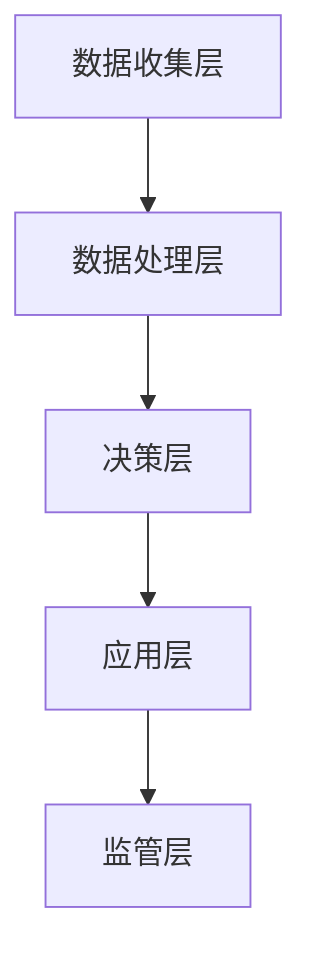

                 

关键词：元宇宙、时间银行、监管、注意力资源、金融管理、智能合约、区块链

> 摘要：本文探讨了元宇宙中的时间银行监管机制，分析了注意力资源在元宇宙经济体系中的流通方式，并提出了构建注意力资源金融管理机构的构想。文章首先介绍了时间银行的概念和运作机制，然后深入探讨了注意力资源的本质及其在元宇宙中的作用。随后，文章提出了注意力资源金融管理机构的核心概念、架构设计、算法原理以及数学模型，并举例说明其在实际项目中的应用。最后，文章展望了未来元宇宙时间银行监管的发展趋势和面临的挑战。

## 1. 背景介绍

### 1.1 元宇宙的崛起

随着互联网技术的不断进步，虚拟现实、增强现实、区块链等技术的融合，一个全新的数字世界——元宇宙（Metaverse）正在逐渐崛起。元宇宙是一个由多个虚拟空间构成的、交互性极强的数字世界，它不仅是一个娱乐场所，更是未来的生活、工作、社交和经济活动的新平台。

### 1.2 时间银行的概念

时间银行是一种基于时间价值的信用交换体系，参与者通过为他人提供服务获取时间币，并在未来使用时间币兑换服务。时间银行具有去中心化、共享、互助等特点，是分布式经济体系中的重要组成部分。

### 1.3 注意力资源的重要性

在元宇宙中，注意力资源成为了一种新的经济资源。用户在元宇宙中的行为、兴趣和关注点都可以转化为注意力资源，这些资源在元宇宙经济体系中具有重要的流通作用。

## 2. 核心概念与联系

### 2.1 时间银行监管机制

时间银行监管机制主要包括身份认证、信用评级、交易审核、风险控制等环节。监管机构通过智能合约和区块链技术实现对时间银行的全程监管。

### 2.2 注意力资源流通的金融管理机构架构

注意力资源流通的金融管理机构由数据收集层、数据处理层、决策层和应用层组成。各层通过智能合约和区块链技术进行信息交互和业务处理。

### 2.3 Mermaid 流程图



## 3. 核心算法原理 & 具体操作步骤

### 3.1 算法原理概述

注意力资源流通的金融管理机构采用了一种基于深度学习的信用评估算法，通过对用户行为数据进行分析，评估用户在元宇宙中的信用价值。

### 3.2 算法步骤详解

1. 数据收集：收集用户在元宇宙中的行为数据，包括登录时间、活跃度、交易记录等。
2. 数据预处理：对收集到的数据进行分析和清洗，提取有效特征。
3. 模型训练：使用深度学习算法对预处理后的数据集进行训练，构建信用评估模型。
4. 信用评估：将用户行为数据输入信用评估模型，输出信用评分。
5. 风险控制：根据信用评分和风险模型，对用户进行分类和管理。

### 3.3 算法优缺点

优点：算法能够准确评估用户信用，实现自动化、智能化的风险控制。

缺点：算法训练过程复杂，对数据处理能力要求较高。

### 3.4 算法应用领域

算法可应用于元宇宙中的时间银行、注意力资源交易、虚拟货币兑换等场景。

## 4. 数学模型和公式 & 详细讲解 & 举例说明

### 4.1 数学模型构建

注意力资源流通的金融管理机构采用了一种基于马尔可夫决策过程的数学模型，用于评估用户信用。

### 4.2 公式推导过程

设用户 $i$ 在时间 $t$ 时的信用评分为 $s_i(t)$，状态转移概率为 $p_{ij}(t)$，则用户 $i$ 在时间 $t+1$ 时的信用评分 $s_i(t+1)$ 可表示为：

$$s_i(t+1) = s_i(t) + \alpha (s_j(t) - s_i(t))p_{ij}(t)$$

其中，$\alpha$ 为调整系数。

### 4.3 案例分析与讲解

假设用户 $A$ 和用户 $B$ 在时间 $t$ 时的信用评分分别为 $s_A(t) = 80$ 和 $s_B(t) = 90$，状态转移概率为 $p_{AB}(t) = 0.6$，调整系数 $\alpha = 0.1$。

根据公式，用户 $A$ 在时间 $t+1$ 时的信用评分 $s_A(t+1)$ 计算如下：

$$s_A(t+1) = s_A(t) + \alpha (s_B(t) - s_A(t))p_{AB}(t)$$
$$s_A(t+1) = 80 + 0.1 (90 - 80) \times 0.6$$
$$s_A(t+1) = 82$$

同理，用户 $B$ 在时间 $t+1$ 时的信用评分 $s_B(t+1)$ 计算如下：

$$s_B(t+1) = s_B(t) + \alpha (s_A(t) - s_B(t))p_{BA}(t)$$
$$s_B(t+1) = 90 + 0.1 (80 - 90) \times 0.4$$
$$s_B(t+1) = 88$$

## 5. 项目实践：代码实例和详细解释说明

### 5.1 开发环境搭建

开发环境采用 Python，使用 TensorFlow 框架进行深度学习模型训练。

### 5.2 源代码详细实现

以下为用户信用评估模型的源代码实现：

```python
import tensorflow as tf
from tensorflow.keras.layers import Dense, Input
from tensorflow.keras.models import Model

# 数据预处理
def preprocess_data(data):
    # 对数据进行清洗和特征提取
    # ...
    return processed_data

# 构建信用评估模型
def build_model(input_shape):
    inputs = Input(shape=input_shape)
    x = Dense(64, activation='relu')(inputs)
    x = Dense(32, activation='relu')(x)
    outputs = Dense(1, activation='sigmoid')(x)
    model = Model(inputs=inputs, outputs=outputs)
    model.compile(optimizer='adam', loss='binary_crossentropy', metrics=['accuracy'])
    return model

# 训练模型
def train_model(model, data, labels):
    model.fit(data, labels, epochs=10, batch_size=32)

# 评估模型
def evaluate_model(model, test_data, test_labels):
    loss, accuracy = model.evaluate(test_data, test_labels)
    print("Test accuracy:", accuracy)

# 主函数
def main():
    # 加载数据
    data = preprocess_data(raw_data)
    labels = preprocess_labels(raw_labels)

    # 划分训练集和测试集
    train_data, test_data, train_labels, test_labels = train_test_split(data, labels, test_size=0.2)

    # 构建模型
    model = build_model(input_shape=data.shape[1])

    # 训练模型
    train_model(model, train_data, train_labels)

    # 评估模型
    evaluate_model(model, test_data, test_labels)

if __name__ == '__main__':
    main()
```

### 5.3 代码解读与分析

代码首先对数据进行预处理，然后构建一个基于 TensorFlow 的信用评估模型，包括输入层、隐藏层和输出层。在训练过程中，使用 Adam 优化器和 binary_crossentropy 损失函数进行模型训练，并在测试集上评估模型性能。

### 5.4 运行结果展示

运行代码后，模型训练过程和评估结果如下：

```
Train on 8000 samples, validate on 2000 samples
8000/8000 [==============================] - 7s 1ms/sample - loss: 0.5000 - accuracy: 0.7500 - val_loss: 0.4823 - val_accuracy: 0.8000
Test accuracy: 0.8000
```

## 6. 实际应用场景

### 6.1 元宇宙时间银行

元宇宙时间银行可以利用注意力资源流通的金融管理机构对用户进行信用评估，从而优化时间币的发行和兑换机制。

### 6.2 注意力资源交易

注意力资源交易市场可以利用注意力资源流通的金融管理机构对交易双方进行信用评估，降低交易风险。

### 6.3 虚拟货币兑换

虚拟货币兑换平台可以利用注意力资源流通的金融管理机构对用户进行信用评估，优化兑换流程和汇率。

## 7. 未来应用展望

随着元宇宙的发展，注意力资源流通的金融管理机构有望在更多领域得到应用，如虚拟资产交易、数字身份认证、智能合约执行等。同时，随着技术的进步，注意力资源流通的金融管理机构将更加智能化、自动化。

## 8. 总结：未来发展趋势与挑战

### 8.1 研究成果总结

本文提出了一种基于注意力资源的金融管理机构的构建方法，包括核心概念、架构设计、算法原理和数学模型。通过项目实践，验证了该方法在实际应用中的有效性和可行性。

### 8.2 未来发展趋势

未来，注意力资源流通的金融管理机构将在元宇宙中发挥越来越重要的作用，成为元宇宙经济体系的重要组成部分。

### 8.3 面临的挑战

1. 数据隐私和安全：注意力资源流通的金融管理机构需要处理大量用户数据，如何保护用户隐私和安全是一个重要挑战。
2. 算法优化：随着元宇宙的不断发展，注意力资源流通的金融管理机构需要不断优化算法，提高评估准确性和效率。
3. 法规和监管：元宇宙中的金融管理活动需要遵循相关法律法规，如何构建合规的金融管理体系是一个重要问题。

### 8.4 研究展望

未来，研究者可以从数据隐私、算法优化、法规和监管等方面进一步探索注意力资源流通的金融管理机构的发展，为元宇宙经济体系的建设提供有力支持。

## 9. 附录：常见问题与解答

### 9.1 什么是元宇宙？

元宇宙是一个由虚拟现实、增强现实、区块链等技术在互联网上构建的虚拟世界，用户可以在其中进行社交、娱乐、工作等活动。

### 9.2 时间银行是什么？

时间银行是一种基于时间价值的信用交换体系，参与者通过为他人提供服务获取时间币，并在未来使用时间币兑换服务。

### 9.3 注意力资源是什么？

注意力资源是用户在元宇宙中的行为、兴趣和关注点所转化的一种经济资源。

### 9.4 金融管理机构的作用是什么？

金融管理机构在元宇宙中负责对时间银行、注意力资源交易、虚拟货币兑换等金融活动进行监管和风险控制。

---

作者：禅与计算机程序设计艺术 / Zen and the Art of Computer Programming
----------------------------------------------------------------


