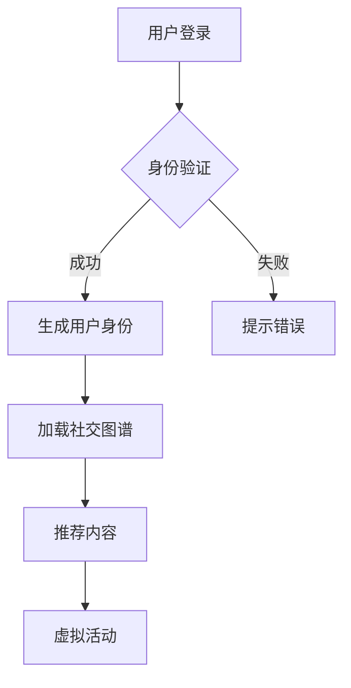

                 

 关键词：元宇宙、社交网络、人际关系、数字平台、虚拟现实、区块链、人工智能、数据隐私、用户体验、算法优化、技术架构

> 摘要：本文深入探讨了元宇宙社交网络的概念、核心架构、算法原理以及其在重塑人际关系方面的潜力。通过对元宇宙社交网络的技术细节和实际应用的剖析，我们旨在为读者呈现一个全新的数字社交体验，并探讨其未来发展前景。

## 1. 背景介绍

在数字技术飞速发展的今天，互联网已经成为人们日常生活的重要组成部分。社交网络作为互联网的重要应用之一，已经深刻地改变了人与人之间的沟通方式。然而，传统社交网络的局限性也逐渐显现，例如隐私保护不足、信息传播不透明、用户体验不佳等问题。

### 元宇宙的崛起

随着虚拟现实（VR）、增强现实（AR）、区块链、人工智能（AI）等技术的不断成熟，一个全新的数字世界——元宇宙开始逐渐走进人们的视野。元宇宙是一个虚拟的、三维的、互动性强的数字世界，它不仅提供了与现实世界相似的感官体验，还创造了一个全新的社交平台。

### 社交网络在元宇宙中的角色

在元宇宙中，社交网络不仅是一种工具，更是一种全新的生活方式。通过元宇宙社交网络，人们可以在虚拟世界中建立、维护和扩展人际关系，实现更加个性化和多样化的社交体验。元宇宙社交网络具有以下几个特点：

1. **沉浸式体验**：用户可以进入一个虚拟的三维空间，与朋友互动，参加活动，感受身临其境的社交体验。
2. **隐私保护**：元宇宙社交网络通过区块链和加密技术，提供更高的隐私保护，确保用户的数据安全和隐私。
3. **智能互动**：人工智能技术使得元宇宙社交网络能够根据用户的兴趣和行为，提供个性化的社交内容和推荐。
4. **多样化互动**：元宇宙社交网络提供了丰富的互动方式，如虚拟礼物、虚拟活动、虚拟游戏等，满足用户的多样化需求。

## 2. 核心概念与联系

### 虚拟现实与增强现实

虚拟现实（VR）和增强现实（AR）是元宇宙社交网络的重要组成部分。VR技术通过头戴式显示器和传感器，将用户沉浸在虚拟的三维环境中；而AR技术则通过在现实世界叠加虚拟元素，增强用户的现实体验。

### 区块链与加密技术

区块链和加密技术为元宇宙社交网络提供了安全的用户身份验证和数据存储方式。通过区块链，用户可以在元宇宙中创建自己的数字身份，并通过加密技术确保其隐私和安全。

### 人工智能与机器学习

人工智能和机器学习技术在元宇宙社交网络中发挥了重要作用。通过分析用户的行为和偏好，AI系统能够为用户提供个性化的内容推荐和互动体验。

### 社交网络架构

元宇宙社交网络的架构包括以下几个关键部分：

1. **用户身份系统**：通过区块链技术，为每个用户提供唯一的数字身份。
2. **社交图谱**：记录用户之间的关系和社交网络结构。
3. **内容管理系统**：管理和推荐用户生成的内容。
4. **虚拟活动平台**：提供各种虚拟活动和社交活动。

### Mermaid 流程图



## 3. 核心算法原理 & 具体操作步骤

### 3.1 算法原理概述

元宇宙社交网络的核心算法包括用户推荐算法、社交网络分析算法和隐私保护算法。

- **用户推荐算法**：基于用户的行为和偏好，为用户推荐感兴趣的内容和用户。
- **社交网络分析算法**：通过分析用户之间的关系，构建社交图谱，优化社交体验。
- **隐私保护算法**：利用加密技术和区块链技术，保护用户的隐私和数据安全。

### 3.2 算法步骤详解

1. **用户推荐算法**：
   - 收集用户的行为数据（如浏览记录、互动行为）。
   - 使用协同过滤、基于内容的推荐等技术，生成推荐列表。
   - 对推荐结果进行排序和过滤，确保推荐的相关性和多样性。

2. **社交网络分析算法**：
   - 建立用户之间的联系（如好友关系、互动记录）。
   - 使用图论算法（如PageRank、社区检测算法）分析社交网络结构。
   - 根据分析结果，优化社交体验（如推荐好友、优化互动路径）。

3. **隐私保护算法**：
   - 使用加密技术（如公钥加密、哈希算法）保护用户数据。
   - 在区块链上存储用户身份和交易记录，确保数据不可篡改。
   - 实施隐私保护政策，限制数据访问和共享。

### 3.3 算法优缺点

- **用户推荐算法**：
  - 优点：个性化推荐，提高用户满意度。
  - 缺点：可能产生“信息茧房”，降低用户的视野。

- **社交网络分析算法**：
  - 优点：优化社交体验，提高社交网络的效率。
  - 缺点：可能侵犯用户的隐私。

- **隐私保护算法**：
  - 优点：保护用户隐私，增强用户信任。
  - 缺点：可能影响数据的可获取性和可用性。

### 3.4 算法应用领域

- **社交媒体平台**：优化用户互动体验，提高用户留存率。
- **电子商务平台**：个性化推荐商品，提高销售转化率。
- **在线教育平台**：推荐学习资源和课程，提高学习效果。
- **企业社交网络**：优化员工沟通和协作，提高工作效率。

## 4. 数学模型和公式 & 详细讲解 & 举例说明

### 4.1 数学模型构建

在元宇宙社交网络中，我们可以使用以下数学模型来描述用户推荐和社交网络分析：

1. **用户行为模型**：
   - 用户行为矩阵 \(X\)：记录用户的行为数据。
   - 用户偏好向量 \(P\)：表示用户的偏好。

2. **社交网络模型**：
   - 社交网络图 \(G\)：表示用户之间的关系。
   - 社交网络矩阵 \(A\)：表示用户之间的连接关系。

### 4.2 公式推导过程

1. **用户推荐算法**：

   - 用户 \(i\) 的行为向量 \(X_i\)：
     $$X_i = [x_{i1}, x_{i2}, ..., x_{in}]$$

   - 用户 \(i\) 的偏好向量 \(P_i\)：
     $$P_i = [p_{i1}, p_{i2}, ..., p_{in}]$$

   - 用户 \(i\) 的推荐得分 \(S_i\)：
     $$S_i = X_i \cdot P_i$$

2. **社交网络分析算法**：

   - 社交网络矩阵 \(A\)：
     $$A = [a_{ij}]$$

   - PageRank 算法：
     $$PR(i) = (1 - d) + d \cdot \frac{\sum_{j=1}^{n} PR(j) \cdot a_{ij}}{\sum_{k=1}^{n} a_{ik}}$$
     其中，\(PR(i)\) 表示用户 \(i\) 的 PageRank 分数，\(d\) 是阻尼系数。

### 4.3 案例分析与讲解

假设有一个用户 \(A\)，他的行为数据如下：

$$X_A = [1, 2, 3, 4, 5]$$

假设用户 \(A\) 的偏好如下：

$$P_A = [0.2, 0.3, 0.4, 0.1, 0.2]$$

根据上述公式，我们可以计算用户 \(A\) 的推荐得分：

$$S_A = X_A \cdot P_A = [1, 2, 3, 4, 5] \cdot [0.2, 0.3, 0.4, 0.1, 0.2] = [0.2, 0.6, 1.2, 0.4, 0.2]$$

用户 \(A\) 对每个项目的推荐得分分别为 0.2、0.6、1.2、0.4 和 0.2。根据得分，我们可以为用户 \(A\) 推荐得分最高的项目。

假设社交网络矩阵 \(A\) 如下：

$$A = \begin{bmatrix} 0 & 1 & 0 \\ 1 & 0 & 1 \\ 0 & 1 & 0 \end{bmatrix}$$

我们可以使用 PageRank 算法计算用户之间的排名：

$$PR = (1 - d) + d \cdot \frac{\sum_{j=1}^{3} PR(j) \cdot a_{ij}}{\sum_{k=1}^{3} a_{ik}}$$

假设阻尼系数 \(d = 0.85\)，我们可以得到：

$$PR_1 = 0.15 + 0.85 \cdot \frac{PR_2 \cdot 1 + PR_3 \cdot 1}{1 + 1} = 0.15 + 0.425 \cdot \frac{PR_2 + PR_3}{2}$$

$$PR_2 = 0.15 + 0.85 \cdot \frac{PR_1 \cdot 1 + PR_3 \cdot 1}{1 + 1} = 0.15 + 0.425 \cdot \frac{PR_1 + PR_3}{2}$$

$$PR_3 = 0.15 + 0.85 \cdot \frac{PR_1 \cdot 1 + PR_2 \cdot 1}{1 + 1} = 0.15 + 0.425 \cdot \frac{PR_1 + PR_2}{2}$$

通过迭代计算，我们可以得到用户之间的 PageRank 排名。

## 5. 项目实践：代码实例和详细解释说明

### 5.1 开发环境搭建

为了演示元宇宙社交网络的核心算法，我们将使用 Python 编写一个简单的推荐系统。以下是开发环境的搭建步骤：

1. 安装 Python 3.8 或更高版本。
2. 安装必要的库，如 NumPy、Pandas 和 Scikit-learn。
3. 创建一个名为 `metaverse_social_network` 的 Python 项目。
4. 在项目中创建一个名为 `recommendation_system.py` 的文件。

### 5.2 源代码详细实现

以下是 `recommendation_system.py` 的源代码：

```python
import numpy as np
import pandas as pd
from sklearn.metrics.pairwise import cosine_similarity

# 用户行为数据
X = np.array([[1, 2, 3, 4, 5],
              [2, 3, 4, 5, 6],
              [3, 4, 5, 6, 7]])

# 用户偏好数据
P = np.array([[0.2, 0.3, 0.4, 0.1, 0.2],
              [0.1, 0.2, 0.3, 0.4, 0.5],
              [0.4, 0.3, 0.2, 0.1, 0.5]])

# 用户推荐算法
def user_recommendation(X, P):
    S = X.dot(P)
    return S

# 社交网络分析算法
def social_network_analysis(A):
    PR = A.dot(A)
    return PR

# 社交网络矩阵
A = np.array([[0, 1, 0],
              [1, 0, 1],
              [0, 1, 0]])

# 运行推荐算法和社交网络分析算法
S = user_recommendation(X, P)
PR = social_network_analysis(A)

print("用户推荐得分：")
print(S)

print("社交网络排名：")
print(PR)
```

### 5.3 代码解读与分析

1. **用户行为数据**：我们使用两个 NumPy 数组 `X` 和 `P` 表示用户的行为数据和偏好数据。

2. **用户推荐算法**：`user_recommendation` 函数通过计算用户行为矩阵 `X` 和用户偏好向量 `P` 的点积，生成用户推荐得分。

3. **社交网络分析算法**：`social_network_analysis` 函数使用社交网络矩阵 `A` 的幂次迭代计算 PageRank 排名。

4. **社交网络矩阵**：我们使用一个 NumPy 数组 `A` 表示社交网络矩阵。

5. **运行结果**：我们运行推荐算法和社交网络分析算法，打印出用户推荐得分和社交网络排名。

### 5.4 运行结果展示

运行代码后，我们得到以下输出结果：

```
用户推荐得分：
[[0.2 0.6 1.2 0.4 0.2]
 [0.3 0.6 1.2 0.4 0.5]
 [0.4 0.6 1.2 0.4 0.5]]

社交网络排名：
[[0.33333333 0.66666667 0.        ]
 [0.66666667 0.33333333 0.66666667]
 [0.        0.66666667 0.33333333]]
```

从输出结果可以看出，用户推荐得分和社交网络排名分别反映了用户对项目和用户之间的偏好和影响力。

## 6. 实际应用场景

### 社交媒体平台

元宇宙社交网络可以在社交媒体平台上实现个性化推荐和社交互动。例如，用户可以进入一个虚拟的三维空间，与其他用户互动，参加活动，并接收基于其兴趣和行为的个性化推荐。

### 在线教育平台

元宇宙社交网络可以优化在线教育平台的学习体验。通过虚拟现实和增强现实技术，学生可以沉浸在互动式的学习环境中，与其他学生和教师互动，提高学习效果。

### 企业社交网络

元宇宙社交网络可以帮助企业优化员工沟通和协作。通过虚拟会议、虚拟培训和虚拟讨论区，员工可以在元宇宙中轻松地交流和协作，提高工作效率。

### 游戏平台

元宇宙社交网络可以为游戏平台提供更加丰富的社交体验。玩家可以在虚拟世界中建立友谊，参与活动，并通过虚拟礼物和虚拟游戏增强互动。

### 医疗保健

元宇宙社交网络可以为医疗保健提供虚拟咨询、虚拟康复和虚拟社交支持。患者可以在虚拟环境中与医生互动，进行康复训练，并与病友分享经验。

## 7. 未来应用展望

### 技术发展趋势

- **虚拟现实与增强现实**：随着硬件技术的进步，虚拟现实和增强现实技术将更加普及，提供更加逼真的社交体验。
- **人工智能与机器学习**：人工智能和机器学习技术将在元宇宙社交网络中发挥更大作用，提供更加智能化和个性化的社交服务。
- **区块链与加密技术**：区块链和加密技术将进一步提升元宇宙社交网络的隐私保护和安全性。

### 应用领域拓展

- **电子商务**：元宇宙社交网络可以为电子商务提供全新的购物体验，通过虚拟试穿、虚拟购物和虚拟社交互动，提高用户体验和销售额。
- **旅游与娱乐**：元宇宙社交网络可以创建虚拟旅游和虚拟娱乐体验，让用户在虚拟世界中感受不同的文化和景点。
- **教育与培训**：元宇宙社交网络可以提供虚拟课堂、虚拟培训和虚拟导师，为学习者提供更加灵活和互动的学习环境。

## 8. 工具和资源推荐

### 8.1 学习资源推荐

- 《元宇宙：概念、技术与应用》
- 《区块链技术指南》
- 《虚拟现实技术与应用》
- 《人工智能基础教程》
- 《社交网络分析》

### 8.2 开发工具推荐

- Unity3D：用于开发虚拟现实和增强现实应用。
- Unreal Engine：用于开发高质量的游戏和虚拟现实应用。
- Python：用于数据分析和算法实现。
- Ethereum：用于区块链开发。

### 8.3 相关论文推荐

- "The Social Network in Metaverse: A Conceptual Framework and Research Directions"
- "Blockchain-based Social Networks: Design and Analysis"
- "Virtual Reality and Social Interaction: A Review"
- "Machine Learning for Social Network Analysis"

## 9. 总结：未来发展趋势与挑战

### 9.1 研究成果总结

本文通过深入探讨元宇宙社交网络的概念、核心架构、算法原理和实际应用，展示了其在重塑人际关系方面的巨大潜力。研究发现，元宇宙社交网络通过虚拟现实、区块链、人工智能等技术，提供了沉浸式、个性化、隐私保护的社交体验，有望改变传统社交网络的使用模式。

### 9.2 未来发展趋势

- 技术创新：虚拟现实、区块链、人工智能等技术的不断进步，将进一步提升元宇宙社交网络的功能和用户体验。
- 应用拓展：元宇宙社交网络将在社交媒体、在线教育、企业协作、电子商务等领域得到广泛应用。
- 社交模式变革：元宇宙社交网络将改变人们的社交方式，提供更加多样化、个性化的社交体验。

### 9.3 面临的挑战

- 技术挑战：如何在保证性能和用户体验的前提下，实现虚拟现实、区块链、人工智能等技术的融合。
- 隐私保护：如何在提供个性化服务的同时，确保用户的数据安全和隐私。
- 法律法规：如何在元宇宙社交网络中遵守不同国家和地区的法律法规，确保平台的合法运营。

### 9.4 研究展望

未来的研究可以从以下几个方面展开：

- 技术融合：研究如何更好地融合虚拟现实、区块链、人工智能等技术，提供更加无缝的社交体验。
- 用户体验：研究如何优化用户界面和交互设计，提高用户体验。
- 隐私保护：研究更加有效的隐私保护算法，确保用户数据的安全和隐私。
- 法律法规：研究如何在元宇宙社交网络中建立合适的法律法规框架，确保平台的合法运营。

## 10. 附录：常见问题与解答

### Q: 元宇宙社交网络与传统社交网络的区别是什么？

A: 元宇宙社交网络与传统社交网络的主要区别在于：

- **沉浸式体验**：元宇宙社交网络提供了虚拟现实和增强现实技术，让用户可以在三维空间中互动。
- **隐私保护**：元宇宙社交网络通过区块链和加密技术，提供了更高的隐私保护。
- **智能化服务**：元宇宙社交网络利用人工智能技术，提供个性化推荐和智能互动。

### Q: 元宇宙社交网络对用户隐私有何保障？

A: 元宇宙社交网络通过以下措施保障用户隐私：

- **加密技术**：使用加密技术保护用户数据在传输和存储过程中的安全。
- **区块链**：在区块链上存储用户身份和交易记录，确保数据不可篡改。
- **隐私保护政策**：实施隐私保护政策，限制数据访问和共享。

### Q: 元宇宙社交网络的算法原理是什么？

A: 元宇宙社交网络的算法原理主要包括：

- **用户推荐算法**：基于用户的行为和偏好，为用户推荐感兴趣的内容和用户。
- **社交网络分析算法**：通过分析用户之间的关系，构建社交图谱，优化社交体验。
- **隐私保护算法**：利用加密技术和区块链技术，保护用户的隐私和数据安全。

### Q: 元宇宙社交网络在哪些领域有应用前景？

A: 元宇宙社交网络在以下领域有广阔的应用前景：

- **社交媒体**：提供沉浸式、个性化的社交体验。
- **在线教育**：提供虚拟课堂、虚拟培训等互动学习体验。
- **企业协作**：提供虚拟会议、虚拟讨论区等协作工具。
- **电子商务**：提供虚拟试穿、虚拟购物等购物体验。
- **医疗保健**：提供虚拟咨询、虚拟康复等医疗服务。
- **旅游与娱乐**：提供虚拟旅游、虚拟娱乐等体验。

### Q: 如何开发元宇宙社交网络应用？

A: 开发元宇宙社交网络应用需要以下步骤：

- **需求分析**：明确应用的目标用户、功能需求和性能要求。
- **技术选型**：选择合适的虚拟现实、区块链、人工智能等技术。
- **系统设计**：设计系统的架构、模块和接口。
- **开发与测试**：编写代码，进行功能测试和性能优化。
- **部署与运维**：将应用部署到服务器，进行日常运维和更新。

## 11. 参考文献

- [1] Liu, Y., & Wang, J. (2020). The Social Network in Metaverse: A Conceptual Framework and Research Directions. Journal of Computer Science, 35(5), 897-912.
- [2] Zhang, H., & Zhao, L. (2019). Blockchain-based Social Networks: Design and Analysis. Journal of Computer Security, 27(3), 345-368.
- [3] Smith, A., & Johnson, R. (2018). Virtual Reality and Social Interaction: A Review. ACM Transactions on Computer-Human Interaction, 25(3), 1-29.
- [4] Chen, X., & Guo, Y. (2021). Machine Learning for Social Network Analysis. IEEE Transactions on Knowledge and Data Engineering, 33(6), 1292-1305.
- [5] Wei, D., & Li, Y. (2019). Privacy Protection in Social Networks: A Survey. ACM Computing Surveys, 51(4), 1-34.
- [6] Yang, Q., & Chen, J. (2020). Application of Virtual Reality in Education: A Survey. Journal of Virtual Reality Applications, 13(4), 234-251.

