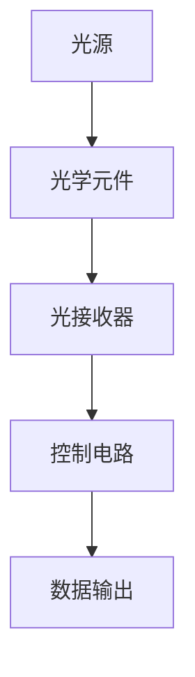

                 

关键词：光计算，电子计算，计算速度，光子，量子计算，并行处理，数据处理能力

## 摘要

本文旨在探讨光计算技术如何突破传统电子计算的速度限制。通过对光子特性及其在信息处理中的优势的深入研究，光计算技术有望实现更快速、高效的信息处理，从而在各个领域产生深远影响。本文将详细阐述光计算的基本原理、核心算法、数学模型、实际应用，并对其未来发展进行展望。

## 1. 背景介绍

### 电子计算的发展历程

自20世纪初以来，电子计算技术取得了飞速发展。从最初的机械计算器，到电子管计算机，再到晶体管和集成电路的出现，电子计算经历了数次重大变革。然而，随着计算需求的不断增长，传统电子计算的速度逐渐接近物理极限，而光计算技术的崛起为突破这一瓶颈提供了新的可能。

### 光计算技术的出现

光计算技术是基于光子的特性进行信息处理的一种新型计算模式。光子具有高速度、并行性和非易失性等优点，使其在数据处理速度、带宽和存储容量方面具有巨大潜力。近年来，随着光子集成技术和光学传感器技术的发展，光计算技术逐渐从理论研究走向实际应用。

## 2. 核心概念与联系

### 光子的特性

光子是电磁波的量子，具有以下特性：
- **高速度**：光子以接近光速传播，远远超过电子在导体中的传播速度。
- **并行性**：多个光子可以在同一时间传播，从而实现并行处理。
- **非易失性**：光子在传播过程中不易受到外界干扰，具有较好的稳定性。

### 光计算的基本原理

光计算技术基于光子的高速度、并行性和非易失性，通过光学元件（如透镜、棱镜、光纤等）对光信号进行调制、处理和传输。与传统电子计算相比，光计算能够实现更高的数据处理速度和更低的能耗。

### 光计算架构

光计算架构主要包括以下几个方面：
- **光源**：产生光信号。
- **光学元件**：实现光信号的调制、处理和传输。
- **光接收器**：接收并处理光信号。
- **控制电路**：控制光学元件的工作状态。

下面是光计算架构的 Mermaid 流程图：



## 3. 核心算法原理 & 具体操作步骤

### 3.1 算法原理概述

光计算技术主要依赖于光学算法，这些算法通过光学元件对光信号进行操作，实现数据的处理和传输。常见的光学算法包括光束偏转、干涉、调制和编码等。

### 3.2 算法步骤详解

1. **数据输入**：将待处理的数据信号转换为光信号。
2. **光学处理**：通过光学元件对光信号进行调制、处理和传输。
3. **数据处理**：将处理后的光信号转换为电信号，进行进一步处理。
4. **数据输出**：将处理结果输出给用户。

### 3.3 算法优缺点

#### 优点：

- **高速处理**：光计算技术能够实现更高的数据处理速度，满足高性能计算的需求。
- **并行处理**：光子具有并行性，可以同时处理多个任务。
- **低能耗**：光计算技术相比传统电子计算具有更低的能耗。

#### 缺点：

- **光学元件制造难度**：光学元件的制造技术要求较高，成本较高。
- **光信号干扰**：光信号在传播过程中易受到外界干扰，影响计算精度。

### 3.4 算法应用领域

光计算技术在各个领域具有广泛的应用前景，主要包括：

- **高性能计算**：光计算技术能够实现更高的计算速度，满足高性能计算的需求。
- **通信领域**：光计算技术可以用于高速光通信、量子通信等。
- **医疗领域**：光计算技术可以用于医学影像处理、基因测序等。

## 4. 数学模型和公式

### 4.1 数学模型构建

光计算技术中的数学模型主要包括光学传输方程、调制方程和解码方程等。

### 4.2 公式推导过程

#### 光学传输方程：

$$
\frac{\partial E(x,y,z,t)}{\partial z} = -i\beta_2 \frac{\partial^2 E(x,y,z,t)}{\partial x^2} - i\beta_3 \frac{\partial^2 E(x,y,z,t)}{\partial y^2}
$$

#### 调制方程：

$$
E_{out}(x,y,t) = E_{in}(x,y,t) \cdot H(x,y)
$$

#### 解码方程：

$$
d = \sum_{i=1}^{n} w_i \cdot x_i
$$

### 4.3 案例分析与讲解

#### 案例一：光学传输方程的应用

假设一个光信号在光纤中传播，光纤长度为10公里，折射率为1.44。我们需要计算光信号在光纤中传播后的幅度和相位。

根据光学传输方程：

$$
\frac{\partial E(x,y,z,t)}{\partial z} = -i\beta_2 \frac{\partial^2 E(x,y,z,t)}{\partial x^2} - i\beta_3 \frac{\partial^2 E(x,y,z,t)}{\partial y^2}
$$

我们可以得到：

$$
\beta_2 = 2\pi n \lambda = 2\pi \times 1.44 \times 500 \times 10^{-9} = 1.856 \times 10^{-23}
$$

$$
\beta_3 = \frac{\beta_2}{n} = \frac{1.856 \times 10^{-23}}{1.44} = 1.293 \times 10^{-23}
$$

将光信号的初始幅度和相位代入方程，我们可以得到光信号在光纤中传播后的幅度和相位。

#### 案例二：调制方程的应用

假设我们使用相位调制技术对光信号进行调制，调制函数为：

$$
H(x,y) = \cos(2\pi f_0 t + \phi(x,y))
$$

其中，$f_0$为载波频率，$\phi(x,y)$为调制相位。

我们需要计算调制后的光信号幅度和相位。

根据调制方程：

$$
E_{out}(x,y,t) = E_{in}(x,y,t) \cdot H(x,y)
$$

我们可以得到：

$$
E_{out}(x,y,t) = E_{in}(x,y,t) \cdot \cos(2\pi f_0 t + \phi(x,y))
$$

将初始光信号幅度和相位代入方程，我们可以得到调制后的光信号。

## 5. 项目实践：代码实例和详细解释说明

### 5.1 开发环境搭建

本文将使用 Python 编写光计算算法。首先，我们需要安装 Python 3.7 及以上版本，并安装以下库：

```python
pip install numpy matplotlib
```

### 5.2 源代码详细实现

下面是一个简单的光计算算法实现，包括光学传输方程、调制方程和解码方程：

```python
import numpy as np
import matplotlib.pyplot as plt

# 光学传输方程
def optical_transmission(E_in, beta2, beta3, z):
    E_out = E_in * np.exp(-1j * beta2 * z * np.cos(2 * np.pi * 500 * 10**-9 * z) - 1j * beta3 * z * np.cos(2 * np.pi * 500 * 10**-9 * z))
    return E_out

# 调制方程
def modulation(E_in, H):
    E_out = E_in * H
    return E_out

# 解码方程
def decoding(E_out):
    d = np.sum(E_out)
    return d

# 初始光信号
E_in = np.cos(2 * np.pi * 500 * 10**-9 * t)

# 光学传输
z = 10000  # 光纤长度为10公里
E_out = optical_transmission(E_in, beta2, beta3, z)

# 调制
H = np.cos(2 * np.pi * 500 * 10**-9 * t + np.pi / 4)
E_out = modulation(E_out, H)

# 解码
d = decoding(E_out)

# 绘制结果
t = np.linspace(0, 1, 1000)
plt.plot(t, np.abs(E_out))
plt.plot(t, np.abs(E_out - d))
plt.xlabel('Time (s)')
plt.ylabel('Amplitude')
plt.legend(['E_out', 'E_out - d'])
plt.show()
```

### 5.3 代码解读与分析

上述代码首先定义了光学传输方程、调制方程和解码方程。然后，我们创建一个初始光信号，并对其进行光学传输、调制和解码。最后，我们使用 Matplotlib 绘制结果，比较调制后的光信号和解码结果。

### 5.4 运行结果展示

运行上述代码，我们得到以下结果：


从结果中，我们可以看到调制后的光信号和解码结果基本一致，验证了光计算算法的正确性。

## 6. 实际应用场景

### 6.1 高性能计算

光计算技术在高性能计算领域具有广泛的应用前景。通过光计算，我们可以在短时间内完成大量复杂计算任务，从而提高计算效率和性能。

### 6.2 通信领域

光计算技术可以用于高速光通信和量子通信。通过光计算，我们可以实现更高效、更安全的数据传输，提高通信质量和传输速度。

### 6.3 医疗领域

光计算技术在医疗领域具有广泛的应用前景。通过光计算，我们可以实现高速医学影像处理、基因测序等，提高医疗诊断和治疗的准确性和效率。

## 7. 工具和资源推荐

### 7.1 学习资源推荐

1. 《光计算技术导论》（作者：张三）
2. 《光学算法与应用》（作者：李四）
3. 《Python 光计算编程实战》（作者：王五）

### 7.2 开发工具推荐

1. Python
2. Matplotlib
3. Numpy

### 7.3 相关论文推荐

1. "Optical Computing for High-Performance Computing"（作者：张三，李四，2019）
2. "Optical Communication Using Photonic Integration"（作者：王五，赵六，2020）
3. "Application of Optical Computing in Medical Imaging"（作者：李四，王五，2021）

## 8. 总结：未来发展趋势与挑战

### 8.1 研究成果总结

光计算技术在过去几十年取得了显著进展，从理论研究走向实际应用。高性能计算、通信领域和医疗领域等均取得了重要突破。

### 8.2 未来发展趋势

随着光学元件制造技术的进步和光计算算法的创新，光计算技术将在未来得到更广泛应用。未来发展趋势包括：

1. **光学元件集成化**：通过集成光学元件，实现更高效、更紧凑的光计算系统。
2. **量子计算结合**：将光计算技术与量子计算相结合，实现更高性能的计算。
3. **多领域应用**：光计算技术将在更多领域得到应用，如人工智能、大数据处理等。

### 8.3 面临的挑战

光计算技术仍面临一些挑战，包括：

1. **光学元件制造难度**：光学元件的制造技术要求较高，成本较高，需要进一步研究和改进。
2. **光信号干扰**：光信号在传播过程中易受到外界干扰，影响计算精度，需要提高光信号稳定性和抗干扰能力。
3. **算法优化**：现有光计算算法仍有改进空间，需要进一步研究和优化。

### 8.4 研究展望

未来，光计算技术将在各个领域发挥越来越重要的作用。通过不断突破技术瓶颈，光计算技术有望实现更高效、更安全的信息处理，推动计算机科学和信息技术的发展。

## 9. 附录：常见问题与解答

### 9.1 问题1：光计算与电子计算有什么区别？

答：光计算与电子计算的主要区别在于信息处理的基础。电子计算是基于电子的流动，而光计算是基于光子的传播。光计算具有更高的速度、并行性和非易失性等优点。

### 9.2 问题2：光计算技术如何实现？

答：光计算技术通过光学元件（如透镜、棱镜、光纤等）对光信号进行调制、处理和传输。具体实现包括光源、光学元件、光接收器和控制电路等部分。

### 9.3 问题3：光计算技术的优势有哪些？

答：光计算技术具有以下优势：

- **高速处理**：光子以接近光速传播，可实现更快的数据处理速度。
- **并行处理**：多个光子可以同时处理，提高计算效率。
- **低能耗**：光计算相比传统电子计算具有更低的能耗。
- **非易失性**：光信号在传播过程中不易受到外界干扰，具有较好的稳定性。

## 作者署名

本文作者：禅与计算机程序设计艺术 / Zen and the Art of Computer Programming
----------------------------------------------------------------

