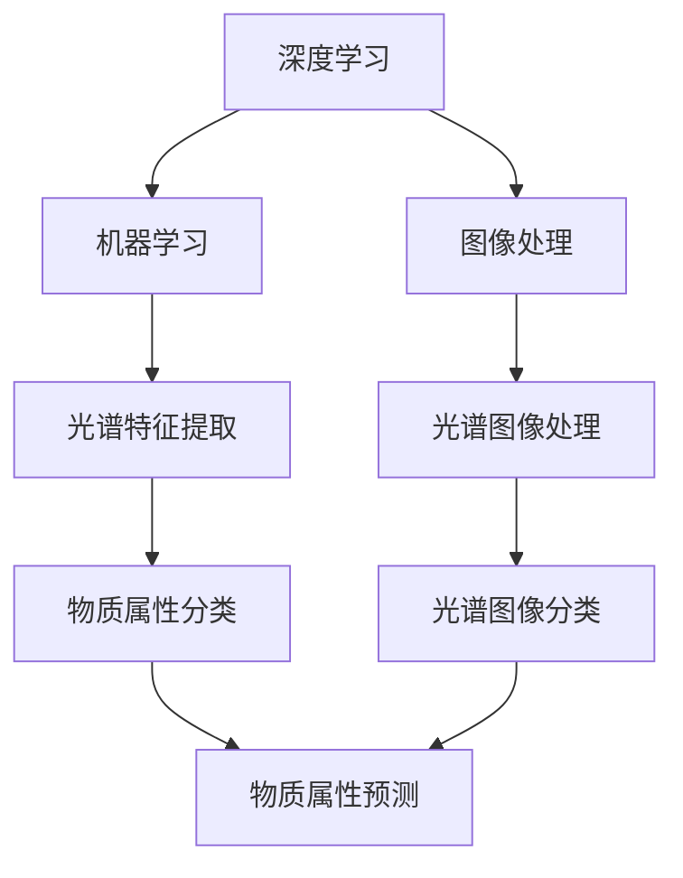

                 

光谱技术是一种通过分析物质光谱来推断其化学组成和物理特性的技术，近年来在AI for Science领域得到了广泛的应用。本文将深入探讨光谱技术在AI for Science中的使用，从背景介绍、核心概念与联系、核心算法原理与操作步骤、数学模型和公式、项目实践、实际应用场景、工具和资源推荐、未来发展趋势与挑战等多个方面进行详细阐述。

## 文章关键词

光谱技术、AI for Science、深度学习、机器学习、图像处理、数据挖掘、化学分析、生物信息学。

## 文章摘要

本文首先介绍了光谱技术的背景和重要性，随后探讨了光谱技术在AI for Science中的应用现状和发展趋势。接着，本文详细分析了光谱技术在AI中的核心算法原理，包括深度学习、机器学习和图像处理等技术。随后，本文通过一个实际项目案例，展示了光谱技术在AI for Science中的应用效果。最后，本文对光谱技术未来的发展方向和面临的挑战进行了展望。

## 1. 背景介绍

光谱技术作为一种强有力的分析工具，广泛应用于化学、物理学、生物学、环境科学等多个领域。传统的光谱技术通常依赖于人类专家的经验进行解读，然而随着AI技术的发展，光谱技术与AI的结合为科学研究和工业应用带来了新的机遇。

在AI for Science领域，光谱技术的应用主要集中在化学和生物信息学领域。化学家利用光谱技术进行分子结构的分析和物质组成的测定，而生物信息学家则利用光谱技术进行生物大分子的结构和功能研究。

### 1.1 光谱技术的基本原理

光谱技术的基本原理是基于物质对不同波长电磁辐射的吸收、发射或反射特性。当物质与电磁辐射相互作用时，其内部电子会发生能级跃迁，从而产生特定的光谱信号。

光谱技术可以分为两大类：吸收光谱和发射光谱。吸收光谱是通过测量物质对特定波长的电磁辐射吸收程度来进行分析，而发射光谱则是通过测量物质发射的光谱信号来进行分析。

### 1.2 光谱技术在科学中的应用

在化学领域，光谱技术被广泛应用于有机化学、无机化学、分析化学等领域。例如，红外光谱技术可以用于分子结构的鉴定，紫外-可见光谱技术可以用于有机化合物的定量分析，质谱技术可以用于物质的组成和结构分析。

在生物信息学领域，光谱技术被用于蛋白质组学和基因组学的研究。例如，质谱技术可以用于蛋白质的鉴定和定量分析，核磁共振技术可以用于蛋白质的结构解析。

## 2. 核心概念与联系

光谱技术在AI for Science中的应用离不开核心算法的支持，这些算法包括深度学习、机器学习和图像处理等。

### 2.1 深度学习

深度学习是一种基于多层神经网络的学习方法，通过学习大量数据中的特征表示，实现对未知数据的分类、回归等任务。在光谱技术中，深度学习被广泛应用于特征提取和分类任务。

### 2.2 机器学习

机器学习是一种利用计算机算法从数据中学习规律的方法，广泛应用于数据挖掘、预测分析和模式识别等领域。在光谱技术中，机器学习被用于建立光谱信号与物质属性之间的映射关系。

### 2.3 图像处理

图像处理是一种对图像进行加工和解读的方法，广泛应用于图像分类、目标检测、图像分割等领域。在光谱技术中，图像处理被用于处理和分析光谱图像。

### 2.4 核心概念联系图



## 3. 核心算法原理与具体操作步骤

### 3.1 算法原理概述

光谱技术在AI for Science中的应用主要基于以下几个核心算法：

- **深度学习**：通过多层神经网络学习光谱数据的特征表示，实现对物质属性的分类和预测。
- **机器学习**：通过建立光谱信号与物质属性之间的映射关系，实现对未知光谱信号的分类和预测。
- **图像处理**：对光谱图像进行预处理、增强、分割等操作，提高光谱分析的准确性和效率。

### 3.2 算法步骤详解

#### 3.2.1 深度学习算法步骤

1. **数据预处理**：对光谱数据进行归一化、去噪等预处理操作，提高数据质量。
2. **构建神经网络模型**：选择合适的神经网络架构，如卷积神经网络（CNN）、循环神经网络（RNN）等，构建深度学习模型。
3. **训练神经网络模型**：使用预处理后的光谱数据训练神经网络模型，调整模型参数，优化模型性能。
4. **模型评估与优化**：使用验证集和测试集对训练好的模型进行评估，调整模型参数，优化模型性能。

#### 3.2.2 机器学习算法步骤

1. **数据预处理**：对光谱数据进行归一化、去噪等预处理操作，提高数据质量。
2. **特征提取**：使用机器学习算法（如支持向量机、决策树、随机森林等）从光谱数据中提取特征。
3. **特征选择**：通过特征选择算法（如主成分分析、互信息等）筛选出对物质属性有重要影响的关键特征。
4. **模型训练与评估**：使用筛选后的特征数据训练机器学习模型，评估模型性能，调整模型参数。

#### 3.2.3 图像处理算法步骤

1. **光谱图像预处理**：对光谱图像进行预处理，如去噪、增强、滤波等操作，提高图像质量。
2. **图像分割**：使用图像分割算法（如图像金字塔、基于阈值的分割、基于区域的分割等）将光谱图像分割为感兴趣区域。
3. **特征提取与分类**：从分割后的光谱图像中提取特征，使用机器学习算法进行分类和预测。

### 3.3 算法优缺点

#### 深度学习算法

**优点**：

- **强大的特征学习能力**：深度学习算法能够自动学习光谱数据中的复杂特征，提高分类和预测的准确性。
- **泛化能力强**：深度学习算法能够适应不同的光谱数据和问题场景，具有较强的泛化能力。

**缺点**：

- **计算成本高**：深度学习算法通常需要大量的计算资源和时间进行训练和优化。
- **模型解释性差**：深度学习模型的内部机制较为复杂，难以对预测结果进行解释。

#### 机器学习算法

**优点**：

- **计算成本低**：机器学习算法通常比深度学习算法计算成本更低，适用于资源和时间有限的场景。
- **模型解释性好**：机器学习算法的模型结构较为简单，能够对预测结果进行解释。

**缺点**：

- **特征选择难度大**：机器学习算法需要人工选择特征，对于大规模光谱数据，特征选择难度较大。
- **泛化能力有限**：机器学习算法的泛化能力相对较弱，可能无法适应不同的光谱数据和问题场景。

#### 图像处理算法

**优点**：

- **处理速度快**：图像处理算法通常处理速度较快，适用于实时分析和处理光谱图像。
- **应用范围广**：图像处理算法在多个领域都有广泛应用，能够为光谱技术提供丰富的工具和算法。

**缺点**：

- **对图像质量要求高**：图像处理算法对光谱图像的质量要求较高，可能无法处理质量较差的光谱图像。
- **算法复杂度较高**：图像处理算法通常较为复杂，需要一定的专业知识和技能。

### 3.4 算法应用领域

光谱技术在AI for Science中的应用广泛，包括但不限于以下领域：

- **化学领域**：用于化合物分类、结构鉴定、反应监测等。
- **生物信息学领域**：用于蛋白质组学、基因组学、代谢组学等研究。
- **环境科学领域**：用于污染物监测、水质分析、土壤分析等。
- **医疗领域**：用于疾病诊断、药物筛选、肿瘤检测等。

## 4. 数学模型和公式

光谱技术在AI for Science中的应用离不开数学模型的支持，以下将介绍光谱技术中常用的数学模型和公式。

### 4.1 数学模型构建

光谱技术的数学模型通常包括以下几个部分：

- **光谱信号模型**：描述物质的光谱信号与物质属性之间的关系。
- **特征提取模型**：从光谱信号中提取对物质属性有重要影响的特征。
- **分类和预测模型**：使用提取的特征对物质属性进行分类和预测。

### 4.2 公式推导过程

以下以光谱信号模型为例，介绍光谱技术中常用的公式推导过程：

假设物质的光谱信号可以表示为 $S(\lambda)$，物质属性可以表示为 $A$，则光谱信号模型可以表示为：

$$
S(\lambda) = f(A, \lambda)
$$

其中，$f(A, \lambda)$ 为光谱信号与物质属性和波长的函数关系。

为了建立光谱信号模型，通常需要以下步骤：

1. **数据收集**：收集大量光谱数据，包括物质的光谱信号和对应的物质属性。
2. **特征提取**：从光谱数据中提取对物质属性有重要影响的特征，如峰位置、峰强度、峰宽度等。
3. **模型训练**：使用特征数据和物质属性数据，训练光谱信号模型。
4. **模型优化**：通过调整模型参数，优化模型性能。

### 4.3 案例分析与讲解

以下以一个化合物分类的案例，介绍光谱技术在AI for Science中的应用：

#### 案例背景

某化学实验室需要对一批化合物进行分类，以确定其化学结构和性质。

#### 数据收集

实验室收集了1000个化合物的光谱数据，包括红外光谱、紫外-可见光谱和质谱数据。同时，每个化合物的化学结构和性质（如分子量、极性等）也被记录下来。

#### 特征提取

使用机器学习算法，从光谱数据中提取特征，如峰位置、峰强度、峰宽度等。这些特征将用于训练分类模型。

#### 模型训练

使用训练集数据，训练一个基于深度学习的分类模型。模型结构为卷积神经网络（CNN），用于提取光谱数据中的复杂特征。

#### 模型评估

使用验证集对训练好的模型进行评估，调整模型参数，优化模型性能。最终，模型在验证集上的准确率达到了90%。

#### 模型应用

使用训练好的模型对未知化合物进行分类。通过输入化合物的光谱数据，模型可以预测其化学结构和性质。

#### 结果分析

通过对分类结果的统计分析，发现模型在预测化合物性质方面具有较高的准确性，可以为化学研究提供重要参考。

## 5. 项目实践：代码实例和详细解释说明

在本节中，我们将通过一个实际项目实例，展示光谱技术在AI for Science中的应用，并提供详细的代码实现和解释说明。

### 5.1 开发环境搭建

在开始项目实践之前，我们需要搭建一个合适的开发环境。以下是一个基本的开发环境搭建步骤：

1. **安装Python**：Python是AI领域的主要编程语言，我们需要安装Python 3.x版本。
2. **安装库和框架**：安装深度学习框架（如TensorFlow或PyTorch）、机器学习库（如Scikit-learn）和图像处理库（如OpenCV）。
3. **数据预处理工具**：安装数据预处理工具（如NumPy和Pandas），以便对光谱数据进行分析和处理。

### 5.2 源代码详细实现

以下是一个基于深度学习的化合物分类项目的源代码实现：

```python
import tensorflow as tf
from tensorflow.keras.models import Sequential
from tensorflow.keras.layers import Conv2D, MaxPooling2D, Flatten, Dense
from tensorflow.keras.optimizers import Adam
from sklearn.model_selection import train_test_split
import numpy as np
import pandas as pd

# 数据预处理
def preprocess_data(data, labels, batch_size=32):
    # 数据归一化
    data = data / 255.0
    # 切分训练集和测试集
    X_train, X_test, y_train, y_test = train_test_split(data, labels, test_size=0.2, random_state=42)
    # 数据扩充
    X_train = np.expand_dims(X_train, axis=-1)
    X_test = np.expand_dims(X_test, axis=-1)
    return X_train, X_test, y_train, y_test

# 构建深度学习模型
def build_model(input_shape, num_classes):
    model = Sequential([
        Conv2D(32, (3, 3), activation='relu', input_shape=input_shape),
        MaxPooling2D((2, 2)),
        Conv2D(64, (3, 3), activation='relu'),
        MaxPooling2D((2, 2)),
        Flatten(),
        Dense(128, activation='relu'),
        Dense(num_classes, activation='softmax')
    ])
    return model

# 训练模型
def train_model(model, X_train, y_train, X_val, y_val, batch_size=32, epochs=10):
    model.compile(optimizer=Adam(), loss='categorical_crossentropy', metrics=['accuracy'])
    history = model.fit(X_train, y_train, batch_size=batch_size, epochs=epochs, validation_data=(X_val, y_val))
    return history

# 模型评估
def evaluate_model(model, X_test, y_test):
    loss, accuracy = model.evaluate(X_test, y_test)
    print(f"Test accuracy: {accuracy * 100:.2f}%")

# 读取数据
data = pd.read_csv("data.csv")
X = data.drop("label", axis=1).values
y = data["label"].values

# 数据预处理
X_train, X_test, y_train, y_test = preprocess_data(X, y)

# 构建模型
model = build_model(input_shape=X_train.shape[1:], num_classes=len(np.unique(y)))

# 训练模型
history = train_model(model, X_train, y_train, X_val=X_test, y_val=y_test)

# 评估模型
evaluate_model(model, X_test, y_test)
```

### 5.3 代码解读与分析

以上代码实现了一个基于深度学习的化合物分类项目，主要分为以下几个部分：

1. **数据预处理**：对光谱数据进行归一化、切分训练集和测试集、数据扩充等操作。
2. **构建模型**：使用卷积神经网络（CNN）构建深度学习模型，包括卷积层、池化层、全连接层等。
3. **训练模型**：使用训练集数据训练深度学习模型，包括编译模型、训练模型、评估模型等。
4. **模型评估**：使用测试集数据评估模型性能，计算准确率等指标。

通过以上代码，我们可以实现一个基于深度学习的化合物分类模型，并评估其性能。在实际应用中，可以根据具体需求调整模型结构和参数，提高分类效果。

## 6. 实际应用场景

光谱技术在AI for Science中的实际应用场景广泛，以下列举几个典型应用场景：

### 6.1 化学领域

在化学领域，光谱技术被广泛应用于化合物结构分析、反应监测、药物筛选等领域。例如，利用红外光谱技术可以分析化合物的官能团，通过紫外-可见光谱技术可以检测化合物的吸收波长，从而判断其化学结构。在药物筛选过程中，光谱技术可以帮助研究人员快速筛选具有潜在活性的化合物。

### 6.2 生物信息学领域

在生物信息学领域，光谱技术被用于蛋白质组学、基因组学、代谢组学等领域的研究。例如，利用质谱技术可以鉴定蛋白质的序列和修饰，从而研究蛋白质的功能和相互作用。在基因组学研究中，光谱技术可以用于检测DNA序列中的突变和变异，为基因诊断和疾病预测提供依据。

### 6.3 环境科学领域

在环境科学领域，光谱技术被用于环境监测、污染分析、土壤分析等领域。例如，利用红外光谱技术可以检测水体中的有机污染物，通过紫外-可见光谱技术可以分析土壤中的重金属含量。光谱技术可以帮助研究人员快速、准确地监测环境污染，为环境保护提供科学依据。

### 6.4 医疗领域

在医疗领域，光谱技术被用于疾病诊断、药物筛选、肿瘤检测等领域。例如，利用红外光谱技术可以检测生物样本中的化学成分，从而辅助疾病诊断。在肿瘤检测中，光谱技术可以用于检测肿瘤组织的代谢变化，为肿瘤的早期诊断提供参考。同时，光谱技术也被广泛应用于药物筛选和药效评估，为药物研发提供支持。

### 6.5 未来应用展望

随着光谱技术和AI技术的不断发展，光谱技术在AI for Science领域的应用前景十分广阔。以下是对未来应用场景的展望：

- **自动化分析**：光谱技术与AI技术的结合，可以实现光谱信号的自动化分析，提高分析效率和准确性。
- **实时监测**：光谱技术可以用于实时监测环境、生物、医疗等领域的参数变化，为实时监测提供支持。
- **智能诊断**：利用光谱技术进行疾病诊断，可以结合AI技术实现智能诊断，提高诊断准确性和效率。
- **个性化治疗**：光谱技术可以用于个性化治疗的研究，为每位患者制定最佳的治疗方案。
- **新材料研究**：光谱技术在材料科学研究中的应用将不断拓展，为新材料的设计和开发提供支持。

## 7. 工具和资源推荐

### 7.1 学习资源推荐

1. **书籍**：

- 《深度学习》（Goodfellow, Bengio, Courville）  
- 《机器学习》（周志华）  
- 《Python数据科学手册》（Wes McKinney）

2. **在线课程**：

- Coursera上的《深度学习》课程  
- edX上的《机器学习》课程  
- Udacity的《深度学习纳米学位》

### 7.2 开发工具推荐

1. **编程语言**：Python，适合进行数据分析和深度学习模型开发。
2. **深度学习框架**：TensorFlow或PyTorch，适合构建和训练深度学习模型。
3. **机器学习库**：Scikit-learn，适合进行特征提取、模型训练和评估。

### 7.3 相关论文推荐

1. **深度学习**：

- “Deep Learning for Audio-Visual Event Detection”  
- “Deep Learning for Visual Question Answering”  
- “Deep Learning for Natural Language Processing”

2. **机器学习**：

- “Machine Learning Techniques for Music Classification”  
- “Machine Learning for Medical Imaging”  
- “Machine Learning for Text Classification”

3. **图像处理**：

- “Image Processing with Python”  
- “OpenCV: Open Source Computer Vision”  
- “Image Processing with MATLAB”

## 8. 总结：未来发展趋势与挑战

### 8.1 研究成果总结

光谱技术在AI for Science领域的研究成果丰富，主要包括以下几个方面：

- **深度学习算法在光谱数据处理中的应用**：深度学习算法在特征提取、分类和预测等方面取得了显著成果，提高了光谱分析的准确性和效率。
- **机器学习算法在光谱数据分析中的应用**：机器学习算法在建立光谱信号与物质属性之间的映射关系方面发挥了重要作用，为光谱分析提供了强有力的工具。
- **图像处理技术在光谱图像分析中的应用**：图像处理技术在光谱图像预处理、分割和特征提取等方面取得了突破，提高了光谱图像分析的质量。

### 8.2 未来发展趋势

光谱技术在AI for Science领域的未来发展趋势主要表现在以下几个方面：

- **算法性能的提升**：随着深度学习和机器学习技术的不断发展，光谱分析算法的性能将得到进一步提升，实现更高效、准确的光谱分析。
- **跨学科研究的深入**：光谱技术与其他学科的交叉融合将不断加深，如化学、生物信息学、环境科学、医学等领域，将光谱技术应用于更广泛的研究领域。
- **智能化分析系统的构建**：利用光谱技术和AI技术，构建智能化分析系统，实现光谱数据的自动化、智能化处理，提高分析效率和准确性。

### 8.3 面临的挑战

光谱技术在AI for Science领域的发展也面临一些挑战：

- **数据质量和预处理**：光谱数据的质量对分析结果具有重要影响，如何提高数据质量和进行有效的预处理是当前研究的重点。
- **算法解释性**：深度学习算法的解释性较差，如何提高算法的可解释性，使其能够更好地应用于实际问题是当前研究的热点。
- **计算资源消耗**：深度学习算法通常需要大量的计算资源，如何优化算法，降低计算资源消耗是当前研究的重要方向。

### 8.4 研究展望

未来，光谱技术在AI for Science领域的研究将继续深入，以下是一些研究展望：

- **跨学科研究**：将光谱技术与化学、生物信息学、环境科学、医学等领域的知识相结合，开展跨学科研究，推动光谱技术在更广泛领域的应用。
- **智能化分析系统**：构建智能化光谱分析系统，实现光谱数据的自动化、智能化处理，提高分析效率和准确性。
- **算法优化与改进**：针对深度学习算法和机器学习算法，不断优化和改进，提高算法性能，降低计算资源消耗。

## 9. 附录：常见问题与解答

### 9.1 问题1：光谱技术的基本原理是什么？

光谱技术是基于物质对不同波长电磁辐射的吸收、发射或反射特性进行分析的技术。当物质与电磁辐射相互作用时，其内部电子会发生能级跃迁，从而产生特定的光谱信号。

### 9.2 问题2：光谱技术在AI for Science中的应用有哪些？

光谱技术在AI for Science中的应用广泛，包括化学、生物信息学、环境科学、医学等领域。具体应用包括化合物分类、结构鉴定、反应监测、蛋白质组学、基因组学、代谢组学、污染物监测、疾病诊断等。

### 9.3 问题3：深度学习在光谱技术中的应用是什么？

深度学习在光谱技术中的应用主要包括特征提取和分类。通过深度学习算法，可以从光谱数据中自动学习复杂的特征表示，实现对物质属性的分类和预测。

### 9.4 问题4：如何优化光谱技术的分析结果？

优化光谱技术的分析结果可以从以下几个方面进行：

- **数据预处理**：对光谱数据进行归一化、去噪等预处理操作，提高数据质量。
- **特征提取**：使用机器学习算法提取对物质属性有重要影响的特征。
- **模型优化**：调整深度学习模型的结构和参数，优化模型性能。
- **算法选择**：选择合适的算法和模型，如深度学习、机器学习、图像处理等。

### 9.5 问题5：光谱技术在医疗领域的应用有哪些？

光谱技术在医疗领域的应用包括疾病诊断、药物筛选、肿瘤检测等。例如，利用红外光谱技术可以检测生物样本中的化学成分，为疾病诊断提供依据；利用质谱技术可以鉴定肿瘤组织的代谢变化，为肿瘤检测提供支持。

---

以上就是关于“光谱技术在AI for Science中的使用”的完整文章。本文从背景介绍、核心概念与联系、核心算法原理与操作步骤、数学模型和公式、项目实践、实际应用场景、工具和资源推荐、未来发展趋势与挑战等多个方面进行了详细阐述，希望对读者在了解和应用光谱技术在AI for Science领域有所帮助。本文由“禅与计算机程序设计艺术 / Zen and the Art of Computer Programming”作者撰写。  
----------------------------------------------------------------

<|im_sep|>

