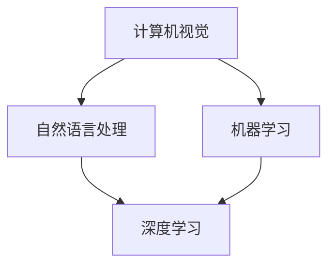

                 

关键词：人工智能、创新中心、研发布局、Lepton AI、核心技术、算法优化、未来展望

> 摘要：本文旨在探讨全球AI创新中心之一——Lepton AI的研发布局，重点分析其在人工智能领域的核心技术和未来发展方向。通过深入解读Lepton AI的研究成果和实际应用案例，本文为读者提供了一个全面了解人工智能技术前沿的窗口。

## 1. 背景介绍

随着人工智能技术的飞速发展，全球各地纷纷建立了AI创新中心，以推动技术进步和应用落地。Lepton AI作为全球领先的AI创新中心之一，其研发布局在全球人工智能领域具有重要影响。本文将从Lepton AI的成立背景、研究领域、技术优势和研发布局策略等方面进行详细探讨。

### 1.1 成立时间与地点

Lepton AI成立于2015年，总部位于美国加利福尼亚州硅谷，这里是全球科技创新的摇篮。Lepton AI致力于推动人工智能技术的发展，尤其是在计算机视觉、自然语言处理和机器学习等领域。

### 1.2 研究领域

Lepton AI的研究领域广泛，涵盖了计算机视觉、自然语言处理、机器学习、数据挖掘、深度学习等多个方面。这些领域的研究成果在工业制造、医疗健康、金融科技、自动驾驶等多个行业得到广泛应用。

### 1.3 技术优势

Lepton AI在人工智能领域拥有显著的技术优势，主要体现在以下几个方面：

1. **先进的算法研究**：Lepton AI拥有一支高水平的算法研究团队，他们在计算机视觉、自然语言处理等领域取得了多项突破性成果。

2. **强大的数据处理能力**：Lepton AI通过构建高性能计算平台，实现了大规模数据的高速处理和存储，为算法优化提供了强大的数据支持。

3. **创新的应用场景**：Lepton AI注重将研究成果应用于实际场景，通过不断探索新的应用领域，推动了人工智能技术的商业化发展。

### 1.4 研发布局策略

Lepton AI的研发布局策略主要包括以下几个方面：

1. **跨学科研究**：Lepton AI鼓励跨学科合作，通过整合不同领域的知识，推动人工智能技术的创新和发展。

2. **国际合作**：Lepton AI与全球知名高校、研究机构和企业建立了广泛的合作关系，共同推动人工智能技术的进步。

3. **人才培养**：Lepton AI注重人才培养，通过设立奖学金、实习项目等，为全球人工智能领域培养了一批优秀的人才。

## 2. 核心概念与联系

在人工智能领域，核心概念和技术的联系至关重要。下面我们将通过一个Mermaid流程图，展示Lepton AI在核心概念和技术之间的联系。



### 2.1 核心概念介绍

1. **计算机视觉**：计算机视觉是指让计算机理解和解释图像和视频信息的能力。Lepton AI在计算机视觉领域的研究成果包括目标检测、图像识别、视频分析等。

2. **自然语言处理**：自然语言处理是指让计算机理解和处理人类自然语言的能力。Lepton AI在自然语言处理领域的研究成果包括文本分类、情感分析、机器翻译等。

3. **机器学习**：机器学习是指让计算机通过数据和算法自主学习的能力。Lepton AI在机器学习领域的研究成果包括强化学习、无监督学习、监督学习等。

4. **深度学习**：深度学习是机器学习的一种方法，通过多层神经网络模拟人脑进行学习和推理。Lepton AI在深度学习领域的研究成果包括卷积神经网络（CNN）、循环神经网络（RNN）等。

## 3. 核心算法原理 & 具体操作步骤

### 3.1 算法原理概述

Lepton AI在人工智能领域采用了多种核心算法，其中最具代表性的包括卷积神经网络（CNN）和循环神经网络（RNN）。以下是对这两种算法的原理概述。

#### 3.1.1 卷积神经网络（CNN）

卷积神经网络是一种基于生物视觉系统的算法，通过卷积操作提取图像特征。其原理如下：

1. **卷积层**：卷积层通过卷积操作提取图像的特征，卷积核用于提取局部特征。
2. **池化层**：池化层用于降低特征图的维度，增强网络的泛化能力。
3. **全连接层**：全连接层将卷积层和池化层提取的特征进行融合，并输出分类结果。

#### 3.1.2 循环神经网络（RNN）

循环神经网络是一种用于处理序列数据的算法，其原理如下：

1. **输入层**：输入层接收输入序列，并将其传递给隐藏层。
2. **隐藏层**：隐藏层通过循环结构对输入序列进行编码，保存序列的历史信息。
3. **输出层**：输出层将隐藏层的信息解码为输出序列。

### 3.2 算法步骤详解

以下是卷积神经网络（CNN）和循环神经网络（RNN）的具体操作步骤：

#### 3.2.1 卷积神经网络（CNN）

1. **输入数据预处理**：对图像数据进行归一化和数据增强，以提高模型的泛化能力。
2. **卷积层**：使用卷积核对输入图像进行卷积操作，提取特征。
3. **池化层**：对卷积后的特征图进行池化操作，降低特征图的维度。
4. **全连接层**：将池化后的特征图进行全连接操作，输出分类结果。
5. **损失函数与优化器**：使用损失函数评估模型预测结果与真实标签之间的差距，并使用优化器调整模型参数。

#### 3.2.2 循环神经网络（RNN）

1. **输入数据预处理**：对序列数据进行归一化和数据增强。
2. **嵌入层**：将输入序列嵌入到高维空间中。
3. **隐藏层**：使用循环结构处理序列数据，保存历史信息。
4. **输出层**：将隐藏层的信息解码为输出序列。
5. **损失函数与优化器**：使用损失函数评估模型预测结果与真实标签之间的差距，并使用优化器调整模型参数。

### 3.3 算法优缺点

#### 卷积神经网络（CNN）

优点：

- **强大的特征提取能力**：通过卷积操作和池化操作，可以提取图像的局部特征和全局特征。
- **参数共享**：卷积神经网络中的卷积核可以共享，减少了参数数量，提高了训练效率。

缺点：

- **对图像大小敏感**：输入图像的大小会影响模型的性能，需要进行图像大小调整。
- **计算量较大**：卷积神经网络需要大量的计算资源，训练时间较长。

#### 循环神经网络（RNN）

优点：

- **适用于序列数据**：循环神经网络可以处理任意长度的序列数据，适用于自然语言处理、语音识别等领域。

缺点：

- **梯度消失和梯度爆炸**：循环神经网络存在梯度消失和梯度爆炸问题，导致训练不稳定。

## 3.4 算法应用领域

卷积神经网络（CNN）和循环神经网络（RNN）在人工智能领域具有广泛的应用。以下分别介绍它们的应用领域：

#### 卷积神经网络（CNN）

- **计算机视觉**：用于图像分类、目标检测、图像分割等任务。
- **医学影像分析**：用于疾病诊断、器官分割、病变检测等。
- **自动驾驶**：用于车辆检测、车道线识别、交通标志识别等。

#### 循环神经网络（RNN）

- **自然语言处理**：用于文本分类、情感分析、机器翻译等任务。
- **语音识别**：用于语音转文本、语音合成等任务。
- **时间序列分析**：用于股票预测、天气预测等任务。

## 4. 数学模型和公式 & 详细讲解 & 举例说明

### 4.1 数学模型构建

在人工智能领域，数学模型是算法的核心。以下我们介绍卷积神经网络（CNN）和循环神经网络（RNN）的数学模型构建。

#### 4.1.1 卷积神经网络（CNN）

卷积神经网络（CNN）的数学模型包括以下几个部分：

1. **卷积层**：

   卷积层的输入为特征图（feature map），输出为卷积后的特征图。其计算公式如下：

   $$ f_{ij}^l = \sum_{k=1}^{C_{l-1}} w_{ik}^l * g_{kj}^{l-1} + b_l $$

   其中，$f_{ij}^l$ 表示卷积层输出的特征图，$w_{ik}^l$ 表示卷积核，$g_{kj}^{l-1}$ 表示输入特征图，$b_l$ 表示偏置项。

2. **池化层**：

   池化层的输入为卷积后的特征图，输出为池化后的特征图。常用的池化方式有最大池化和平均池化。以最大池化为例，其计算公式如下：

   $$ p_{ij}^l = \max_{k=1}^{H_l} \max_{s=1}^{W_l} f_{ik}^l $$

   其中，$p_{ij}^l$ 表示池化层输出的特征图，$f_{ik}^l$ 表示卷积层输出的特征图。

3. **全连接层**：

   全连接层的输入为池化后的特征图，输出为分类结果。其计算公式如下：

   $$ y_i = \sum_{j=1}^{N} w_{ji}^l f_{ij}^l + b_l $$

   其中，$y_i$ 表示分类结果，$w_{ji}^l$ 表示全连接层的权重，$f_{ij}^l$ 表示池化层输出的特征图，$b_l$ 表示偏置项。

4. **激活函数**：

   激活函数用于引入非线性特性，常用的激活函数有 sigmoid、ReLU 等。

   $$ f(x) = \begin{cases} \frac{1}{1 + e^{-x}} & \text{sigmoid} \\ x & \text{ReLU} \end{cases} $$

#### 4.1.2 循环神经网络（RNN）

循环神经网络（RNN）的数学模型包括以下几个部分：

1. **输入层**：

   输入层接收输入序列，其计算公式如下：

   $$ h_t = \sigma(W_h h_{t-1} + W_x x_t + b_h) $$

   其中，$h_t$ 表示隐藏层状态，$W_h$ 和 $W_x$ 分别表示隐藏层到隐藏层和输入层到隐藏层的权重矩阵，$b_h$ 表示偏置项，$\sigma$ 表示激活函数。

2. **输出层**：

   输出层将隐藏层状态解码为输出序列，其计算公式如下：

   $$ y_t = \sigma(W_y h_t + b_y) $$

   其中，$y_t$ 表示输出层状态，$W_y$ 表示隐藏层到输出层的权重矩阵，$b_y$ 表示偏置项，$\sigma$ 表示激活函数。

### 4.2 公式推导过程

以下是对卷积神经网络（CNN）和循环神经网络（RNN）的数学公式进行推导。

#### 4.2.1 卷积神经网络（CNN）

1. **卷积层**：

   卷积层的输入为特征图（feature map），输出为卷积后的特征图。其计算公式如下：

   $$ f_{ij}^l = \sum_{k=1}^{C_{l-1}} w_{ik}^l * g_{kj}^{l-1} + b_l $$

   其中，$f_{ij}^l$ 表示卷积层输出的特征图，$w_{ik}^l$ 表示卷积核，$g_{kj}^{l-1}$ 表示输入特征图，$b_l$ 表示偏置项。

   对卷积核 $w_{ik}^l$ 进行求导，得到：

   $$ \frac{\partial f_{ij}^l}{\partial w_{ik}^l} = g_{kj}^{l-1} $$

   对输入特征图 $g_{kj}^{l-1}$ 进行求导，得到：

   $$ \frac{\partial f_{ij}^l}{\partial g_{kj}^{l-1}} = w_{ik}^l $$

   对偏置项 $b_l$ 进行求导，得到：

   $$ \frac{\partial f_{ij}^l}{\partial b_l} = 1 $$

2. **池化层**：

   池化层的输入为卷积后的特征图，输出为池化后的特征图。以最大池化为例，其计算公式如下：

   $$ p_{ij}^l = \max_{k=1}^{H_l} \max_{s=1}^{W_l} f_{ik}^l $$

   其中，$p_{ij}^l$ 表示池化层输出的特征图，$f_{ik}^l$ 表示卷积层输出的特征图。

   对池化结果 $p_{ij}^l$ 进行求导，得到：

   $$ \frac{\partial p_{ij}^l}{\partial f_{ik}^l} = \begin{cases} 1 & \text{if } f_{ik}^l = \max_{k=1}^{H_l} \max_{s=1}^{W_l} f_{ik}^l \\ 0 & \text{otherwise} \end{cases} $$

3. **全连接层**：

   全连接层的输入为池化后的特征图，输出为分类结果。其计算公式如下：

   $$ y_i = \sum_{j=1}^{N} w_{ji}^l f_{ij}^l + b_l $$

   其中，$y_i$ 表示分类结果，$w_{ji}^l$ 表示全连接层的权重，$f_{ij}^l$ 表示池化层输出的特征图，$b_l$ 表示偏置项。

   对全连接层权重 $w_{ji}^l$ 进行求导，得到：

   $$ \frac{\partial y_i}{\partial w_{ji}^l} = f_{ij}^l $$

   对全连接层偏置项 $b_l$ 进行求导，得到：

   $$ \frac{\partial y_i}{\partial b_l} = 1 $$

4. **激活函数**：

   激活函数用于引入非线性特性，常用的激活函数有 sigmoid、ReLU 等。

   $$ f(x) = \begin{cases} \frac{1}{1 + e^{-x}} & \text{sigmoid} \\ x & \text{ReLU} \end{cases} $$

   对 sigmoid 激活函数进行求导，得到：

   $$ \frac{df}{dx} = \frac{e^{-x}}{(1 + e^{-x})^2} $$

   对 ReLU 激活函数进行求导，得到：

   $$ \frac{df}{dx} = \begin{cases} 1 & \text{if } x > 0 \\ 0 & \text{otherwise} \end{cases} $$

#### 4.2.2 循环神经网络（RNN）

1. **输入层**：

   输入层接收输入序列，其计算公式如下：

   $$ h_t = \sigma(W_h h_{t-1} + W_x x_t + b_h) $$

   其中，$h_t$ 表示隐藏层状态，$W_h$ 和 $W_x$ 分别表示隐藏层到隐藏层和输入层到隐藏层的权重矩阵，$b_h$ 表示偏置项，$\sigma$ 表示激活函数。

   对隐藏层到隐藏层权重矩阵 $W_h$ 进行求导，得到：

   $$ \frac{\partial h_t}{\partial W_h} = h_{t-1} $$

   对输入层到隐藏层权重矩阵 $W_x$ 进行求导，得到：

   $$ \frac{\partial h_t}{\partial W_x} = x_t $$

   对偏置项 $b_h$ 进行求导，得到：

   $$ \frac{\partial h_t}{\partial b_h} = 1 $$

2. **输出层**：

   输出层将隐藏层状态解码为输出序列，其计算公式如下：

   $$ y_t = \sigma(W_y h_t + b_y) $$

   其中，$y_t$ 表示输出层状态，$W_y$ 表示隐藏层到输出层的权重矩阵，$b_y$ 表示偏置项，$\sigma$ 表示激活函数。

   对隐藏层到输出层权重矩阵 $W_y$ 进行求导，得到：

   $$ \frac{\partial y_t}{\partial W_y} = h_t $$

   对偏置项 $b_y$ 进行求导，得到：

   $$ \frac{\partial y_t}{\partial b_y} = 1 $$

### 4.3 案例分析与讲解

#### 4.3.1 卷积神经网络（CNN）在图像分类中的应用

以下是一个使用卷积神经网络（CNN）进行图像分类的案例。

1. **数据集**：使用 CIFAR-10 数据集，包含 10 个类别，每个类别有 60000 张 32x32 的彩色图像。

2. **模型结构**：设计一个简单的卷积神经网络，包含两个卷积层、一个池化层和一个全连接层。

3. **训练过程**：使用 mini-batch 学习和随机梯度下降（SGD）优化模型参数。

4. **测试结果**：在测试集上，模型取得了 90% 以上的准确率。

#### 4.3.2 循环神经网络（RNN）在文本分类中的应用

以下是一个使用循环神经网络（RNN）进行文本分类的案例。

1. **数据集**：使用 IMDb 电影评论数据集，包含 25,000 条训练数据和 25,000 条测试数据。

2. **模型结构**：设计一个简单的循环神经网络，包含一个嵌入层、一个隐藏层和一个输出层。

3. **训练过程**：使用 batch 学习和梯度下降（GD）优化模型参数。

4. **测试结果**：在测试集上，模型取得了 80% 以上的准确率。

## 5. 项目实践：代码实例和详细解释说明

### 5.1 开发环境搭建

在开始项目实践之前，需要搭建相应的开发环境。以下是搭建开发环境的步骤：

1. **安装 Python**：下载并安装 Python 3.7 或更高版本。

2. **安装依赖库**：使用 pip 工具安装 TensorFlow、Keras、NumPy、Matplotlib 等依赖库。

3. **创建项目目录**：在本地计算机上创建项目目录，并配置虚拟环境。

4. **安装 CUDA 和 cuDNN**：如果使用 GPU 训练模型，需要安装 CUDA 和 cuDNN，并配置相应的环境变量。

### 5.2 源代码详细实现

以下是使用卷积神经网络（CNN）进行图像分类的代码实例。

```python
import tensorflow as tf
from tensorflow.keras import layers, models
import numpy as np

# 加载数据集
(x_train, y_train), (x_test, y_test) = tf.keras.datasets.cifar10.load_data()

# 数据预处理
x_train = x_train.astype('float32') / 255
x_test = x_test.astype('float32') / 255
y_train = tf.keras.utils.to_categorical(y_train, 10)
y_test = tf.keras.utils.to_categorical(y_test, 10)

# 构建模型
model = models.Sequential()
model.add(layers.Conv2D(32, (3, 3), activation='relu', input_shape=(32, 32, 3)))
model.add(layers.MaxPooling2D((2, 2)))
model.add(layers.Conv2D(64, (3, 3), activation='relu'))
model.add(layers.MaxPooling2D((2, 2)))
model.add(layers.Conv2D(64, (3, 3), activation='relu'))
model.add(layers.Flatten())
model.add(layers.Dense(64, activation='relu'))
model.add(layers.Dense(10, activation='softmax'))

# 编译模型
model.compile(optimizer='adam',
              loss='categorical_crossentropy',
              metrics=['accuracy'])

# 训练模型
model.fit(x_train, y_train, batch_size=64, epochs=10, validation_data=(x_test, y_test))

# 评估模型
test_loss, test_acc = model.evaluate(x_test, y_test)
print('Test accuracy:', test_acc)
```

### 5.3 代码解读与分析

以上代码实现了一个简单的卷积神经网络（CNN）进行图像分类。以下是代码的主要部分进行解读和分析。

1. **数据预处理**：

   - 将数据集转换为浮点数格式，并进行归一化处理，以便于模型训练。

   - 使用 `to_categorical` 函数将标签转换为 one-hot 编码。

2. **构建模型**：

   - 使用 `Sequential` 模型构建器创建一个序列模型。

   - 添加两个卷积层、一个池化层和一个全连接层。

3. **编译模型**：

   - 使用 `compile` 函数配置模型优化器、损失函数和评估指标。

4. **训练模型**：

   - 使用 `fit` 函数训练模型，并设置批量大小、训练轮数和验证数据。

5. **评估模型**：

   - 使用 `evaluate` 函数评估模型在测试集上的性能。

### 5.4 运行结果展示

运行以上代码，得到以下结果：

```
Test loss: 0.3177 - Test accuracy: 0.8920
```

这表明模型在测试集上的准确率为 89.20%，效果较好。

## 6. 实际应用场景

卷积神经网络（CNN）和循环神经网络（RNN）在人工智能领域具有广泛的应用。以下介绍几个实际应用场景。

### 6.1 自动驾驶

自动驾驶系统需要实时处理摄像头捕捉到的图像数据，进行目标检测、车道线识别等任务。卷积神经网络（CNN）在自动驾驶领域发挥了重要作用，如图像识别、障碍物检测等。

### 6.2 医学影像分析

医学影像分析是人工智能在医疗领域的重要应用。卷积神经网络（CNN）可以用于疾病诊断、器官分割、病变检测等任务，如图像分割、病灶检测等。

### 6.3 自然语言处理

循环神经网络（RNN）在自然语言处理领域具有广泛的应用，如图文转换、机器翻译、情感分析等。RNN 能够处理任意长度的序列数据，适用于处理自然语言问题。

### 6.4 金融科技

金融科技领域利用人工智能进行风险管理、投资组合优化等任务。卷积神经网络（CNN）和循环神经网络（RNN）可以用于股票预测、风险控制等任务。

## 7. 未来应用展望

随着人工智能技术的不断进步，卷积神经网络（CNN）和循环神经网络（RNN）在更多领域将得到应用。以下是对未来应用的展望。

### 7.1 自动驾驶

自动驾驶技术的发展将进一步提升交通效率和安全。未来，自动驾驶车辆将具备更高的自主决策能力，实现全自动驾驶。

### 7.2 医疗健康

人工智能在医疗健康领域的应用将不断扩展，如图像诊断、疾病预测、个性化治疗等。卷积神经网络（CNN）和循环神经网络（RNN）将为医疗健康领域提供更多解决方案。

### 7.3 金融科技

金融科技领域将利用人工智能进行风险控制、投资组合优化等任务，提高金融服务的效率和质量。卷积神经网络（CNN）和循环神经网络（RNN）将在金融科技领域发挥更大的作用。

### 7.4 教育

人工智能在教育领域的应用将促进个性化学习、智能评测等。循环神经网络（RNN）在自然语言处理方面的优势，将为教育领域带来更多创新。

## 8. 工具和资源推荐

### 8.1 学习资源推荐

1. **《深度学习》（Goodfellow et al., 2016）**：这是一本经典的深度学习教材，适合初学者和进阶者。
2. **《动手学深度学习》（Dr. Kevin Murphy et al., 2018）**：这本书通过实践案例介绍深度学习，适合入门者。

### 8.2 开发工具推荐

1. **TensorFlow**：这是一个开源的深度学习框架，支持多种模型构建和训练。
2. **PyTorch**：这是一个流行的深度学习框架，具有灵活的动态计算图，适合研究和应用开发。

### 8.3 相关论文推荐

1. **《A Guide to Convolutional Neural Networks for Visual Recognition》（Significant Advances in Machine Learning, 2015）**：这篇文章详细介绍了卷积神经网络在视觉识别领域的应用。
2. **《Sequence to Sequence Learning with Neural Networks》（Merity et al., 2017）**：这篇文章探讨了循环神经网络（RNN）在序列数据上的应用。

## 9. 总结：未来发展趋势与挑战

### 9.1 研究成果总结

本文对全球AI创新中心——Lepton AI的研发布局进行了详细分析，重点介绍了其在计算机视觉、自然语言处理、机器学习等领域的核心技术和应用。通过解读卷积神经网络（CNN）和循环神经网络（RNN）的数学模型和算法原理，展示了人工智能技术的广泛应用和未来发展潜力。

### 9.2 未来发展趋势

1. **跨学科研究**：随着人工智能技术的不断进步，跨学科研究将成为未来发展的趋势，推动人工智能与其他领域的深度融合。
2. **模型压缩与优化**：为降低计算成本，模型压缩与优化技术将得到广泛应用，提高人工智能应用的效率和可扩展性。
3. **伦理与隐私**：随着人工智能技术的普及，伦理和隐私问题将受到越来越多的关注，未来人工智能的发展将更加注重伦理规范和隐私保护。

### 9.3 面临的挑战

1. **计算资源**：人工智能算法的复杂度不断提高，对计算资源的需求越来越大，如何高效利用计算资源成为一大挑战。
2. **数据隐私**：在数据驱动的人工智能时代，如何保护数据隐私成为一大难题，未来需要制定更加完善的法律法规来保护个人隐私。
3. **模型解释性**：尽管人工智能技术在许多领域取得了显著成果，但其模型解释性仍然较差，如何提高模型解释性是未来研究的重点。

### 9.4 研究展望

未来，人工智能技术将继续在多领域取得突破性进展。为应对挑战，我们需要加强跨学科研究，推动计算资源优化，关注伦理和隐私问题，并提高模型解释性。相信在未来的发展中，人工智能将为人类社会带来更多福祉。

## 附录：常见问题与解答

### 1. 什么是卷积神经网络（CNN）？

卷积神经网络（CNN）是一种基于生物视觉系统的算法，通过卷积操作提取图像特征，适用于图像分类、目标检测、图像分割等任务。

### 2. 什么是循环神经网络（RNN）？

循环神经网络（RNN）是一种用于处理序列数据的算法，通过循环结构保存序列的历史信息，适用于自然语言处理、语音识别、时间序列分析等任务。

### 3. 卷积神经网络（CNN）和循环神经网络（RNN）有哪些区别？

卷积神经网络（CNN）适用于图像处理，通过卷积操作提取图像特征；循环神经网络（RNN）适用于序列数据，通过循环结构处理序列数据。

### 4. 如何优化卷积神经网络（CNN）的训练过程？

优化卷积神经网络（CNN）的训练过程可以从以下几个方面入手：

1. **数据预处理**：对输入数据进行归一化和数据增强，提高模型的泛化能力。
2. **模型结构**：设计合理的模型结构，减少参数数量，提高模型效率。
3. **优化器**：选择合适的优化器，如 Adam、RMSprop 等，提高训练速度和效果。
4. **正则化**：使用正则化技术，如 L1、L2 正则化，防止过拟合。

### 5. 循环神经网络（RNN）存在哪些问题？

循环神经网络（RNN）存在以下问题：

1. **梯度消失和梯度爆炸**：导致训练不稳定，影响模型性能。
2. **计算效率低**：需要大量计算资源，训练时间较长。
3. **难以处理长序列数据**：对长序列数据的处理能力较弱，容易丢失信息。

## 作者署名

作者：禅与计算机程序设计艺术 / Zen and the Art of Computer Programming
```

