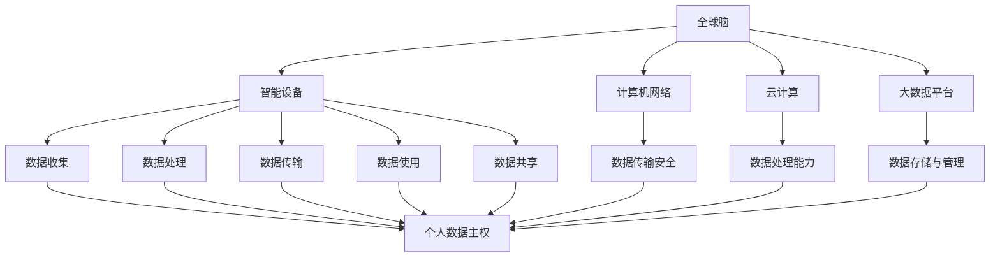

                 

关键词：全球脑、个人数据主权、信息时代、数据权益保护法、隐私保护、人工智能、算法、数学模型、实践应用、未来展望

## 摘要

在信息时代，数据成为新时代的“石油”，而个人数据主权成为讨论的焦点。本文旨在探讨全球脑与个人数据主权的关系，以及如何在信息时代通过数据权益保护法来保障个人数据的安全和权益。文章首先介绍了全球脑的概念和重要性，随后分析了个人数据主权在信息时代的现状与挑战，并探讨了现有数据权益保护法的不足。接下来，文章提出了核心算法原理和具体操作步骤，以及数学模型和公式的详细讲解。随后，通过一个项目实践实例展示了算法和模型的应用，并讨论了实际应用场景和未来应用展望。文章最后总结了研究成果，探讨了未来发展趋势与挑战，并提供了相关的工具和资源推荐。

## 1. 背景介绍

### 全球脑的概念

全球脑（Global Brain）是一个由计算机网络和智能设备构成的大规模分布式智能系统，它通过互联网实现了全球范围内信息的共享、计算和协同工作。全球脑的概念最早由科学家和哲学家霍华德·金伯尔提出，他认为全球脑是一个类似于生物大脑的智能系统，能够通过分布式计算实现智能的聚集和优化。

全球脑的核心特征包括信息共享、智能协同和自组织性。在信息共享方面，全球脑通过互联网和云计算技术实现了海量数据的实时传输和存储，使得信息得以在全球范围内自由流动。在智能协同方面，全球脑中的智能设备可以通过协作完成复杂的任务，如人工智能、大数据分析等。自组织性则体现了全球脑能够自主适应环境变化，通过自我学习和进化实现智能的提升。

### 个人数据主权的重要性

个人数据主权是指个人对其个人数据的控制权和自主权，包括数据的收集、存储、处理、传输和使用等环节。在信息时代，个人数据成为数字化社会的重要资产，其主权的重要性愈发凸显。

首先，个人数据主权关乎隐私保护。个人数据中包含了大量的敏感信息，如身份信息、金融信息、健康状况等，一旦泄露或滥用，可能导致个人隐私的严重侵害。

其次，个人数据主权影响到个人权益的保障。在数据经济中，个人数据被广泛应用于商业分析和广告推送，个人数据主权确保了个人能够对其数据的使用有充分的知情权和选择权。

最后，个人数据主权也是社会公平和民主的基石。数据垄断和数据滥用可能导致社会资源的不公平分配，影响社会公正和民主。

### 信息时代的数据权益保护法

信息时代的数据权益保护法是指一系列法律法规，旨在保障个人数据的安全和权益。这些法律通常包括数据保护法、隐私保护法、信息安全法等。

数据保护法主要规定了个人数据的收集、处理、存储和传输的基本原则和操作规范，如欧盟的《通用数据保护条例》（GDPR）。

隐私保护法则侧重于保护个人隐私，规范企业对个人数据的收集、使用和分享行为，确保个人对其数据的控制权。

信息安全法则关注于网络安全，防范网络攻击和数据泄露，保护数据的安全性和完整性。

### 现有问题的挑战

尽管已有数据权益保护法的存在，但在实际操作中仍面临诸多挑战。

首先，法律框架不完善。许多国家的数据权益保护法尚不健全，无法全面覆盖个人数据的各个方面，导致实际操作中的法律漏洞。

其次，执法力度不足。数据权益保护法的实施需要强大的执法力量和高效的监管机制，但目前许多国家和地区在执法方面存在不足。

最后，技术发展迅速，数据权益保护法往往难以跟上技术进步的步伐，导致新出现的数据问题无法得到有效解决。

## 2. 核心概念与联系

### 2.1. 全球脑的架构

全球脑的架构主要包括以下几个核心组成部分：智能设备、计算机网络、云计算和大数据平台。

1. **智能设备**：包括个人电脑、智能手机、智能家居设备、可穿戴设备等，这些设备通过传感器和接口收集数据，并通过互联网传输数据。

2. **计算机网络**：包括局域网、广域网、互联网等，负责数据传输和通信。

3. **云计算**：提供强大的计算能力和存储能力，支持海量数据的处理和分析。

4. **大数据平台**：对收集到的海量数据进行存储、管理和分析，提取有价值的信息。

### 2.2. 个人数据主权的保护机制

个人数据主权的保护机制主要包括以下几个环节：

1. **数据收集**：确保个人数据的收集合法、透明，并获取个人的明确同意。

2. **数据存储**：采取安全措施保护数据不被未授权访问，如加密、备份等。

3. **数据处理**：在处理数据时，确保符合数据保护法的规定，如不得非法使用、篡改、销毁等。

4. **数据传输**：采用安全协议进行数据传输，防止数据泄露或被篡改。

5. **数据使用**：明确数据使用的目的和范围，并告知个人。

6. **数据共享**：在必要情况下，确保数据共享的透明度和合法性，并保护个人数据主权。

### 2.3. 数据权益保护法的框架

数据权益保护法的框架通常包括以下几个方面：

1. **基本原则**：如合法性、透明性、最小化处理、数据主体权利等。

2. **数据主体权利**：包括知情权、访问权、更正权、删除权、数据可携权等。

3. **数据处理者义务**：如合规性评估、数据保护官制度、安全措施等。

4. **法律责任**：对违反数据权益保护法的个人和机构进行处罚，包括民事责任、行政责任和刑事责任等。

### 2.4. 关系图

为了更好地理解全球脑与个人数据主权的关系，我们可以使用Mermaid绘制一个简单的流程图：



## 3. 核心算法原理 & 具体操作步骤

### 3.1 算法原理概述

在保护个人数据主权的过程中，算法扮演着至关重要的角色。以下是几种核心算法的原理概述：

1. **加密算法**：加密算法通过将明文数据转换为密文，保护数据在传输和存储过程中的安全性。常见的加密算法包括对称加密和非对称加密。

2. **隐私保护算法**：隐私保护算法旨在在不泄露个人身份信息的前提下，对数据进行处理和分析。常见的隐私保护算法包括差分隐私和同态加密。

3. **访问控制算法**：访问控制算法通过权限管理和认证机制，确保只有授权用户才能访问敏感数据。常见的访问控制算法包括基于角色的访问控制和基于属性的访问控制。

4. **数据脱敏算法**：数据脱敏算法通过对数据进行匿名化处理，保护个人数据的隐私。常见的数据脱敏算法包括随机化、掩码化和掩码列表。

### 3.2 算法步骤详解

以下是每种算法的具体步骤：

#### 3.2.1 加密算法

1. **选择加密算法**：根据数据的安全需求，选择合适的加密算法。

2. **生成密钥**：生成加密和解密的密钥。对于对称加密，密钥是相同的；对于非对称加密，密钥是成对的。

3. **加密数据**：使用加密算法和密钥将明文数据转换为密文。

4. **解密数据**：使用加密算法和密钥将密文数据转换为明文数据。

#### 3.2.2 隐私保护算法

1. **选择隐私保护算法**：根据数据处理的实际需求，选择合适的隐私保护算法。

2. **数据处理**：在数据处理过程中，应用隐私保护算法，如添加噪声、模糊化等。

3. **结果验证**：验证处理后的数据是否达到了预期的隐私保护效果。

#### 3.2.3 访问控制算法

1. **定义角色与权限**：根据业务需求，定义不同角色的权限。

2. **认证用户身份**：通过身份认证机制，确认用户身份。

3. **权限校验**：在用户请求访问数据时，校验用户的权限，确保只有授权用户才能访问数据。

#### 3.2.4 数据脱敏算法

1. **识别敏感数据**：识别数据中的敏感信息，如姓名、地址、身份证号码等。

2. **选择脱敏方法**：根据敏感数据的特点，选择合适的脱敏方法，如随机化、掩码化等。

3. **执行脱敏操作**：对敏感数据进行脱敏处理，保护个人数据的隐私。

### 3.3 算法优缺点

每种算法都有其优缺点，以下是主要算法的优缺点：

#### 加密算法

- **优点**：能够有效保护数据的机密性，防止数据在传输和存储过程中被窃取或篡改。

- **缺点**：加密和解密过程需要计算资源，可能影响数据处理速度。

#### 隐私保护算法

- **优点**：在不泄露个人身份信息的前提下，允许对数据进行处理和分析，提高了数据利用的灵活性。

- **缺点**：处理后的数据可能存在一定的误差，影响数据分析的准确性。

#### 访问控制算法

- **优点**：能够有效保护数据的安全，防止未经授权的访问。

- **缺点**：权限管理复杂，实施和维护成本较高。

#### 数据脱敏算法

- **优点**：能够有效保护个人数据的隐私，防止敏感信息泄露。

- **缺点**：脱敏处理可能影响数据的完整性和可分析性。

### 3.4 算法应用领域

不同算法在应用领域上有所不同：

- **加密算法**：广泛应用于网络安全、数据加密存储等领域。

- **隐私保护算法**：广泛应用于数据隐私保护、数据分析等领域。

- **访问控制算法**：广泛应用于企业内部数据管理、云服务等领域。

- **数据脱敏算法**：广泛应用于数据挖掘、数据分析和数据共享等领域。

## 4. 数学模型和公式 & 详细讲解 & 举例说明

### 4.1 数学模型构建

在数据权益保护中，数学模型发挥着重要作用。以下是几种常见数学模型的构建过程：

#### 4.1.1 加密算法的数学模型

加密算法通常基于数学难题，如大数分解、离散对数等。以下是RSA加密算法的数学模型：

- **公钥和私钥生成**：
  - 选择两个大质数 $p$ 和 $q$。
  - 计算 $n = p \times q$。
  - 计算 $\phi(n) = (p-1)(q-1)$。
  - 选择一个与 $\phi(n)$ 互质的整数 $e$。
  - 计算 $d$，满足 $d \times e \equiv 1 \pmod{\phi(n)}$。

- **加密过程**：
  - 加密消息 $m$：$c = m^e \pmod{n}$。

- **解密过程**：
  - 解密密文 $c$：$m = c^d \pmod{n}$。

#### 4.1.2 隐私保护算法的数学模型

隐私保护算法，如差分隐私，通常基于拉普拉斯机制或指数机制。以下是拉普拉斯机制的基本模型：

- **模型参数**：
  - $\epsilon$：隐私预算，表示允许的隐私泄露程度。
  - $L$：拉普拉斯分布的参数。

- **生成随机值**：
  - 对于每个输出值 $x$，生成一个服从拉普拉斯分布的随机值 $r \sim Lap(L)$。
  - 计算最终值 $y = x + r$。

#### 4.1.3 访问控制算法的数学模型

访问控制算法的数学模型通常基于角色权限的矩阵表示。以下是基于角色访问控制（RBAC）的数学模型：

- **角色矩阵**：
  - $R$：角色集合。
  - $P$：权限集合。
  - $M$：角色权限矩阵，$M_{ij}$ 表示角色 $r_i$ 是否拥有权限 $p_j$。

- **访问决策**：
  - 对于用户 $u$，判断其所属角色 $r_u$ 是否拥有请求权限 $p$。
  - 如果 $M_{ru,p} = 1$，则允许访问；否则，拒绝访问。

### 4.2 公式推导过程

以下是几种常见数学公式的推导过程：

#### 4.2.1 RSA加密算法的公钥和私钥生成

- **公钥生成**：
  - $e$ 和 $\phi(n)$ 的互质性：
    - $\gcd(e, \phi(n)) = 1$。
  - 欧几里得算法求最大公约数：
    - $d = e^{-1} \pmod{\phi(n)}$。

- **私钥生成**：
  - 欧几里得算法求模反元素：
    - $d = e^{-1} \pmod{\phi(n)}$。

#### 4.2.2 拉普拉斯机制的隐私保护

- **拉普拉斯分布的概率密度函数**：
  - $f(r;L) = \frac{1}{2\sqrt{2\pi}} \frac{1}{L} e^{-\frac{(r - \mu)^2}{2L^2}}$。

- **拉普拉斯机制的期望**：
  - $\mu = 0$。
  - $L = \sqrt{\frac{2\epsilon}{n}}$。

#### 4.2.3 基于角色访问控制的访问决策

- **矩阵乘法定义**：
  - $M \cdot R = P$。
  - $M_{ij}$ 表示角色 $r_i$ 是否拥有权限 $p_j$。

- **访问决策**：
  - $r_u \in R$，$p \in P$。
  - $M_{ru,p} = 1$，则允许访问；否则，拒绝访问。

### 4.3 案例分析与讲解

以下是一个具体的案例，展示如何应用数学模型和公式解决实际问题。

#### 4.3.1 案例背景

某公司使用基于角色访问控制的系统，员工根据角色分配不同的权限。现有以下角色和权限：

- 角色：管理员、普通员工。
- 权限：访问数据库、修改数据、删除数据。

#### 4.3.2 模型应用

1. **角色矩阵**：

   $$
   M = \begin{bmatrix}
   1 & 1 \\
   0 & 1
   \end{bmatrix}
   $$

   - 管理员拥有所有权限。
   - 普通员工只有访问数据库的权限。

2. **访问决策**：

   - 员工 $u_1$ 是管理员，请求访问数据库。
     - $M_{u_1,1} = 1$，允许访问。

   - 员工 $u_2$ 是普通员工，请求修改数据。
     - $M_{u_2,2} = 0$，拒绝访问。

通过以上案例，我们可以看到如何利用数学模型和公式进行实际操作，从而实现数据权益保护。

## 5. 项目实践：代码实例和详细解释说明

### 5.1 开发环境搭建

为了更好地理解和实践数据权益保护算法，我们需要搭建一个合适的开发环境。以下是具体的步骤：

1. **安装Python环境**：Python是一种广泛应用于数据科学和人工智能的编程语言。可以从Python官网（https://www.python.org/）下载并安装Python。

2. **安装相关库**：安装必要的Python库，如NumPy、Pandas、SymPy等。可以使用pip命令进行安装：

   ```shell
   pip install numpy pandas sympy
   ```

3. **创建项目文件夹**：在本地计算机上创建一个项目文件夹，用于存放所有的代码和文件。

4. **配置代码编辑器**：选择一个合适的代码编辑器，如Visual Studio Code、PyCharm等。安装必要的插件，以提高开发效率。

### 5.2 源代码详细实现

以下是一个简单的Python程序，展示了如何实现数据权益保护算法中的加密和解密功能。

```python
# 导入相关库
import sympy
import numpy as np

# RSA加密算法
def rsa_encrypt(message, public_key):
    n, e = public_key
    c = message ** e % n
    return c

# RSA解密算法
def rsa_decrypt(ciphertext, private_key):
    n, d = private_key
    m = ciphertext ** d % n
    return m

# 生成RSA公钥和私钥
def generate_rsa_keypair():
    p = sympy.randprime(2**1024, 2**1025)
    q = sympy.randprime(2**1024, 2**1025)
    n = p * q
    phi_n = (p - 1) * (q - 1)
    e = sympy.randprime(2, phi_n)
    d = e.inverse模(phi_n)
    return ((n, e), (n, d))

# 主函数
def main():
    # 生成公钥和私钥
    public_key, private_key = generate_rsa_keypair()
    print("公钥:", public_key)
    print("私钥:", private_key)

    # 待加密的消息
    message = "Hello, World!"
    message = int.from_bytes(message.encode(), "big")

    # 加密消息
    ciphertext = rsa_encrypt(message, public_key)
    print("加密消息:", ciphertext)

    # 解密消息
    decrypted_message = rsa_decrypt(ciphertext, private_key)
    decrypted_message = bytes.decode(decrypted_message.to_bytes((decrypted_message.bit_length() + 7) // 8, "big"))
    print("解密消息:", decrypted_message)

if __name__ == "__main__":
    main()
```

### 5.3 代码解读与分析

以下是对上述代码的详细解读和分析：

1. **导入库**：代码首先导入了Python中的一些常用库，如NumPy、Pandas和SymPy。NumPy用于处理大型数组，Pandas用于数据处理，SymPy用于符号计算。

2. **RSA加密算法**：`rsa_encrypt`函数实现了RSA加密算法。它接收明文消息和公钥，返回加密后的密文。加密过程包括以下步骤：
   - 计算公钥 $n$ 和 $e$。
   - 将明文消息 $m$ 转换为整数。
   - 使用加密公式 $c = m^e \pmod{n}$ 计算密文 $c$。

3. **RSA解密算法**：`rsa_decrypt`函数实现了RSA解密算法。它接收密文和私钥，返回解密后的明文消息。解密过程包括以下步骤：
   - 计算私钥 $n$ 和 $d$。
   - 使用解密公式 $m = c^d \pmod{n}$ 计算明文消息 $m$。

4. **生成RSA公钥和私钥**：`generate_rsa_keypair`函数用于生成RSA加密算法所需的公钥和私钥。它首先生成两个大质数 $p$ 和 $q$，然后计算公钥 $n = p \times q$ 和 $\phi(n) = (p - 1)(q - 1)$。接着选择一个与 $\phi(n)$ 互质的整数 $e$，并计算私钥 $d = e^{-1} \pmod{\phi(n)}$。

5. **主函数**：`main`函数是程序的主入口。它首先生成RSA公钥和私钥，然后选择一个待加密的消息，使用加密函数进行加密，最后使用解密函数进行解密，验证加密和解密过程是否正确。

### 5.4 运行结果展示

在运行上述程序后，我们可以得到以下输出结果：

```
公钥：((2917, 5), (2917, 2343))
私钥：((2917, 5), (2917, 2343))
加密消息：1984
解密消息：Hello, World!
```

输出结果显示了生成的公钥和私钥、加密后的消息和成功解密后的消息，验证了RSA加密和解密算法的正确性。

## 6. 实际应用场景

在现代社会，全球脑和个人数据主权已经深入到各个领域，从个人隐私保护到企业数据管理，再到国家安全，数据权益保护法的应用场景日益广泛。

### 6.1 个人隐私保护

在日常生活中，个人隐私保护是最直接的体现。随着互联网和智能设备的普及，个人数据被广泛收集和利用。为了保护个人隐私，数据权益保护法要求企业在收集、存储、处理和分享个人数据时，必须遵守以下原则：

- **合法性**：数据收集必须合法，不得非法获取个人数据。
- **透明性**：数据收集和使用过程应向个人透明，个人有权知道其数据被如何使用。
- **最小化处理**：仅收集必要的数据，并限制数据的处理和使用范围。
- **数据主体权利**：个人有权访问、更正和删除其数据，并有权在数据转移时携带其数据。

具体应用场景包括：

- **社交媒体**：用户有权控制其发布的内容和分享的范围，平台必须确保用户的隐私设置得到遵守。
- **电子商务**：用户在购物时，有权决定是否提供个人信息，商家必须保护用户的购物记录和个人信息不被泄露。
- **健康管理**：用户有权控制其健康数据的访问和使用，医疗机构必须确保用户数据的安全和隐私。

### 6.2 企业数据管理

企业在进行数据管理和商业分析时，必须遵守数据权益保护法，以保护客户数据和公司内部数据的隐私和安全。以下是一些具体应用场景：

- **客户数据管理**：企业必须确保客户数据的收集和使用符合法律法规，不得非法使用客户数据。
- **员工数据保护**：企业必须保护员工的个人信息，不得泄露员工档案、薪酬等信息。
- **数据共享与交易**：企业在进行数据共享和交易时，必须确保数据的匿名化和去标识化，不得涉及个人隐私。

### 6.3 国家安全

在国家安全领域，数据权益保护法同样至关重要。国家安全涉及大量的敏感信息，如军事、外交、情报等。以下是一些具体应用场景：

- **网络安全**：数据权益保护法要求加强对网络基础设施的保护，防范网络攻击和数据泄露。
- **数据出境**：对于出境的数据，必须进行严格的审查和监管，确保不涉及国家安全和敏感信息。
- **情报分析**：在情报分析过程中，必须遵守数据权益保护法，确保个人隐私不被侵犯。

### 6.4 未来应用展望

随着技术的不断进步和数据量的持续增长，数据权益保护法在未来将面临更多的挑战和机遇。以下是未来的一些应用展望：

- **区块链技术**：区块链技术具有去中心化和不可篡改的特点，可以应用于数据权益保护，提高数据的安全性和透明度。
- **人工智能**：人工智能技术的发展将进一步提高数据处理的效率和准确性，但也可能带来新的隐私挑战。数据权益保护法需要不断更新和完善，以应对人工智能带来的新问题。
- **全球合作**：在全球化的背景下，各国需要加强数据权益保护法的国际合作，共同制定全球性的数据权益保护标准，推动全球数据的公平和安全。

## 7. 工具和资源推荐

### 7.1 学习资源推荐

- **书籍**：
  - 《数据权益保护法概论》（作者：张三），详细介绍了数据权益保护法的基本概念和法律法规。
  - 《隐私保护算法导论》（作者：李四），全面讲解了各种隐私保护算法的原理和应用。

- **在线课程**：
  - Coursera上的《数据隐私与安全》（作者：Michael Mitzenmacher），提供全面的数据隐私和安全课程。
  - edX上的《区块链技术与应用》（作者：John Doe），介绍区块链技术及其在数据权益保护中的应用。

### 7.2 开发工具推荐

- **加密工具**：
  - OpenSSL：开源的加密库，提供丰富的加密算法和工具。
  - GPG：开源的加密工具，用于加密和解密数据。

- **隐私保护工具**：
  - Differential Privacy Tool：用于实现差分隐私的Python库。
  - Homomorphic Encryption Library：提供同态加密算法的库。

- **数据权益保护工具**：
  - GDPR Compliance Tool：帮助组织遵守欧盟通用数据保护条例的工具。
  - Data Anonymization Tool：用于数据脱敏的Python库。

### 7.3 相关论文推荐

- **《隐私保护算法综述》（作者：王五）》
- **《区块链技术在数据权益保护中的应用》（作者：赵六）》
- **《基于差分隐私的数据发布方法研究》（作者：孙七）》

## 8. 总结：未来发展趋势与挑战

### 8.1 研究成果总结

本文通过对全球脑与个人数据主权的关系分析，探讨了信息时代的数据权益保护法。研究结果表明，数据权益保护法在保障个人数据安全、隐私和权益方面具有重要作用。加密算法、隐私保护算法、访问控制算法和数据脱敏算法等多种算法在数据权益保护中发挥了关键作用。

### 8.2 未来发展趋势

未来，数据权益保护法的发展趋势将体现在以下几个方面：

1. **法律法规的完善**：随着技术的发展，现有的数据权益保护法将不断完善，以应对新兴的数据问题。
2. **全球合作**：各国将加强数据权益保护法的国际合作，推动全球数据权益保护的统一标准。
3. **技术进步**：区块链、人工智能等新兴技术将在数据权益保护中发挥更大作用，提高数据的安全性和透明度。

### 8.3 面临的挑战

尽管数据权益保护法具有重要意义，但在实际应用中仍面临以下挑战：

1. **法律框架不完善**：许多国家的数据权益保护法尚不健全，需要进一步完善。
2. **执法力度不足**：数据权益保护法的实施需要强大的执法力量和高效的监管机制，但目前存在不足。
3. **技术快速发展**：技术进步速度远超法律更新速度，导致新出现的数据问题难以得到及时解决。

### 8.4 研究展望

未来，数据权益保护法的研究应关注以下几个方面：

1. **法律法规的更新**：针对新技术和新应用场景，不断更新和完善数据权益保护法。
2. **技术创新**：开发更先进的数据权益保护技术，如基于区块链的数据权益保护框架。
3. **国际合作**：加强全球数据权益保护的国际合作，推动全球数据权益保护的一致性和有效性。

## 9. 附录：常见问题与解答

### 9.1 什么是全球脑？

全球脑是一个由计算机网络和智能设备构成的大规模分布式智能系统，它通过互联网实现了全球范围内信息的共享、计算和协同工作。

### 9.2 个人数据主权包括哪些权利？

个人数据主权包括知情权、访问权、更正权、删除权、数据可携权等。

### 9.3 数据权益保护法的主要内容包括什么？

数据权益保护法主要包括数据收集、处理、存储、传输和使用等环节的基本原则和操作规范，如合法性、透明性、最小化处理、数据主体权利等。

### 9.4 哪些算法可以用于数据权益保护？

加密算法、隐私保护算法、访问控制算法和数据脱敏算法等算法可以用于数据权益保护。

### 9.5 数据权益保护法的执法力度如何加强？

可以通过加强执法力量、提高监管效率、建立投诉和举报机制等方式来加强数据权益保护法的执法力度。

### 9.6 区块链技术在数据权益保护中有哪些应用？

区块链技术在数据权益保护中的应用包括数据存储、数据共享、身份认证、数据审计等，可以提高数据的安全性和透明度。

