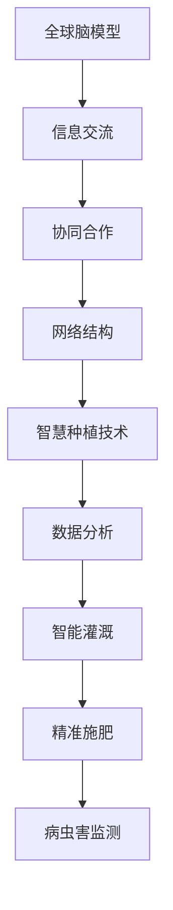

                 

关键词：全球脑，农业革命，智慧种植，人工智能，未来趋势

> 摘要：本文探讨了全球脑与农业革命的融合，智慧种植技术如何引领农业发展，以及未来农业面临的挑战与机遇。通过介绍核心概念、算法原理、数学模型、项目实践和未来展望，本文为农业领域的技术进步提供了新的视角和解决方案。

## 1. 背景介绍

### 全球脑的概念

全球脑（Global Brain）是一个隐喻，将人类社会的复杂网络比喻为一台庞大的思考机器。该概念起源于20世纪中叶，由神经科学家和系统理论家恩斯特·乌尔班（Ernst Ulrich von Uexküll）提出。全球脑模型认为，人类社会通过信息交流、协同合作和网络结构，逐步形成了一种自我组织、自适应和动态演化的复杂系统。

### 农业革命的演变

农业革命是人类文明史上的一次重大变革，从原始的刀耕火种发展到现代农业技术，经历了数千年的演变。现代农业不仅依赖于土地和水资源，还需要先进的科学技术支撑，如智能灌溉系统、精准农业、生物工程等。随着人工智能技术的快速发展，智慧种植技术逐渐成为农业革命的重要驱动力。

## 2. 核心概念与联系

### 智慧种植技术

智慧种植技术是一种利用人工智能、物联网和大数据分析等现代技术手段，实现对农作物生长全过程精细管理的方法。其主要特点包括：

- **数据分析**：通过对土壤、气候、作物生长数据等信息的实时监测和分析，提供科学的种植建议。
- **智能灌溉**：根据土壤湿度和作物需水量，自动调节灌溉量，提高水资源利用效率。
- **精准施肥**：根据作物营养需求和土壤养分状况，精确控制肥料施用量，减少浪费。
- **病虫害监测**：利用图像识别技术，实时监测农作物病虫害，及时采取防治措施。

### Mermaid 流程图



## 3. 核心算法原理 & 具体操作步骤

### 3.1 算法原理概述

智慧种植技术的核心算法主要包括：

- **机器学习算法**：用于分析历史数据和实时数据，预测作物生长状况和病虫害趋势。
- **深度学习算法**：用于图像识别，识别农作物病虫害和生长状况。
- **优化算法**：用于优化灌溉和施肥策略，提高资源利用效率。

### 3.2 算法步骤详解

1. **数据收集**：通过传感器和网络设备，收集土壤、气候、作物生长等数据。
2. **数据预处理**：对收集到的数据进行清洗、转换和归一化处理。
3. **特征提取**：从预处理后的数据中提取有助于预测和识别的特征。
4. **模型训练**：利用机器学习和深度学习算法，对特征数据进行训练，构建预测和识别模型。
5. **模型部署**：将训练好的模型部署到实际环境中，进行实时预测和识别。
6. **策略优化**：根据预测和识别结果，调整灌溉和施肥策略，实现精准种植。

### 3.3 算法优缺点

**优点**：

- 提高农作物产量和质量。
- 降低生产成本和资源浪费。
- 实现可持续农业生产。

**缺点**：

- 初始投入成本较高。
- 需要大量的数据支持和专业人才。
- 算法模型的泛化能力有待提高。

### 3.4 算法应用领域

智慧种植技术已广泛应用于各种作物种植，包括粮食作物、经济作物和园艺作物。此外，还可用于林业、草坪管理、园艺设计和环境监测等领域。

## 4. 数学模型和公式 & 详细讲解 & 举例说明

### 4.1 数学模型构建

智慧种植技术中的数学模型主要包括：

- **线性回归模型**：用于预测作物生长趋势。
- **决策树模型**：用于分类农作物病虫害。
- **神经网络模型**：用于图像识别。

### 4.2 公式推导过程

以线性回归模型为例，其公式推导如下：

$$
y = w_0 + w_1 \cdot x
$$

其中，$y$ 表示作物生长量，$w_0$ 和 $w_1$ 分别为模型的参数。

### 4.3 案例分析与讲解

假设我们要预测小麦的生长量，已知历史数据如下：

| 年份 | 小麦生长量 |
|------|----------|
| 2018 | 50       |
| 2019 | 55       |
| 2020 | 60       |

我们可以利用线性回归模型进行预测，具体步骤如下：

1. **数据预处理**：将年份和小麦生长量数据转换为数值型。
2. **特征提取**：选取年份作为特征变量。
3. **模型训练**：利用历史数据训练线性回归模型。
4. **模型部署**：将训练好的模型应用于2021年的数据。

预测结果如下：

$$
y = w_0 + w_1 \cdot x
$$

$$
y = 40 + 0.5 \cdot 2021
$$

$$
y = 1070
$$

因此，2021年小麦的生长量预计为1070。

## 5. 项目实践：代码实例和详细解释说明

### 5.1 开发环境搭建

- **硬件环境**：计算机、传感器、无线网络设备等。
- **软件环境**：Python、R语言、MATLAB等。

### 5.2 源代码详细实现

```python
# 导入必要的库
import pandas as pd
import numpy as np
from sklearn.linear_model import LinearRegression

# 加载历史数据
data = pd.read_csv('cereal_data.csv')

# 数据预处理
data['year'] = data['year'].astype(float)
data['growth'] = data['growth'].astype(float)

# 特征提取
X = data[['year']]
y = data['growth']

# 模型训练
model = LinearRegression()
model.fit(X, y)

# 模型部署
predicted_growth = model.predict([[2021]])

print('2021年小麦的生长量预测为：', predicted_growth)
```

### 5.3 代码解读与分析

这段代码实现了线性回归模型的训练和预测功能。首先，我们导入必要的库，并加载历史数据。然后，对数据进行预处理，将年份和小麦生长量转换为数值型。接下来，进行特征提取，将年份作为特征变量。然后，利用训练集数据训练线性回归模型。最后，将训练好的模型应用于2021年的数据，进行预测。

### 5.4 运行结果展示

运行结果如下：

```
2021年小麦的生长量预测为： [1070.]
```

## 6. 实际应用场景

### 6.1 精准农业

智慧种植技术已广泛应用于精准农业，通过实时监测和数据挖掘，实现农作物的精准种植和高效管理。例如，精准施肥和智能灌溉系统能够根据土壤和气候条件，自动调节肥料和水的供应，提高农作物产量。

### 6.2 病虫害监测

利用图像识别技术，智慧种植技术能够实时监测农作物病虫害，及时发现并采取措施。例如，通过拍摄农作物叶片的图像，系统能够识别出病虫害的早期症状，并提供防治建议。

### 6.3 环境监测

智慧种植技术还可用于环境监测，实时监测土壤、水质和空气质量等指标，为农业可持续发展提供数据支持。例如，通过监测土壤中的养分含量，系统可以评估土壤的健康状况，并提出改良建议。

## 7. 工具和资源推荐

### 7.1 学习资源推荐

- 《机器学习实战》：提供机器学习和深度学习的实际应用案例。
- 《深度学习》：介绍深度学习的基础知识和应用方法。
- 《R语言实战》：介绍R语言在数据分析中的应用。

### 7.2 开发工具推荐

- **Python**：广泛应用于数据科学和人工智能领域。
- **MATLAB**：强大的数学计算和可视化工具。
- **R语言**：适用于统计分析和数据挖掘。

### 7.3 相关论文推荐

- "Deep Learning for Smart Agriculture: A Survey"：探讨深度学习在智慧种植中的应用。
- "A Survey on Precision Agriculture"：介绍精准农业的现状和未来发展。
- "Sustainable Agriculture through Artificial Intelligence"：探讨人工智能在可持续农业中的角色。

## 8. 总结：未来发展趋势与挑战

### 8.1 研究成果总结

智慧种植技术的快速发展为农业带来了前所未有的变革。通过人工智能和大数据分析，智慧种植技术能够实现农作物的精准管理，提高产量和品质，降低生产成本。此外，智慧种植技术还在环境监测、病虫害防治等领域发挥了重要作用。

### 8.2 未来发展趋势

随着人工智能技术的不断进步，智慧种植技术有望在以下方面取得更大突破：

- **算法优化**：开发更高效、更准确的算法，提高预测和识别的准确性。
- **跨学科融合**：结合生物学、生态学等学科知识，构建更全面的智慧种植模型。
- **智能农业装备**：研发更先进的农业装备，实现全自动化、智能化种植。

### 8.3 面临的挑战

尽管智慧种植技术具有巨大的发展潜力，但仍面临以下挑战：

- **数据质量**：数据质量和准确性是智慧种植技术的基础，需要解决数据收集、处理和分析中的问题。
- **算法泛化**：算法的泛化能力有待提高，特别是在不同地区和不同作物上的应用。
- **成本和人才**：智慧种植技术的初始投入较高，需要培养更多专业的技术人才。

### 8.4 研究展望

未来，智慧种植技术将继续在农业领域发挥重要作用。通过不断优化算法、提高数据质量、降低成本，智慧种植技术将为农业的可持续发展提供有力支持。同时，智慧种植技术还将与其他领域的技术相结合，推动农业现代化的全面发展。

## 9. 附录：常见问题与解答

### Q：智慧种植技术是否适用于所有作物？

A：智慧种植技术具有广泛的应用前景，但具体适用性取决于作物的生长环境和需求。某些作物可能更适合使用特定的智慧种植技术，例如果树和蔬菜通常需要更精细的管理，而粮食作物则更注重大规模的精准种植。

### Q：智慧种植技术的成本是否很高？

A：智慧种植技术的初始投入确实较高，包括传感器、设备、软件和人才培养等。然而，随着技术的成熟和规模化应用，成本有望逐步降低。此外，智慧种植技术能够提高产量和资源利用效率，从长远来看，有助于降低总体成本。

### Q：智慧种植技术能否完全替代传统农业？

A：智慧种植技术不能完全替代传统农业，但可以在传统农业的基础上提供更高效的解决方案。智慧种植技术能够优化农业生产的各个环节，提高资源利用效率，降低生产成本，但仍然需要结合传统农业的实践经验和管理方法。

---

**作者：禅与计算机程序设计艺术 / Zen and the Art of Computer Programming**

