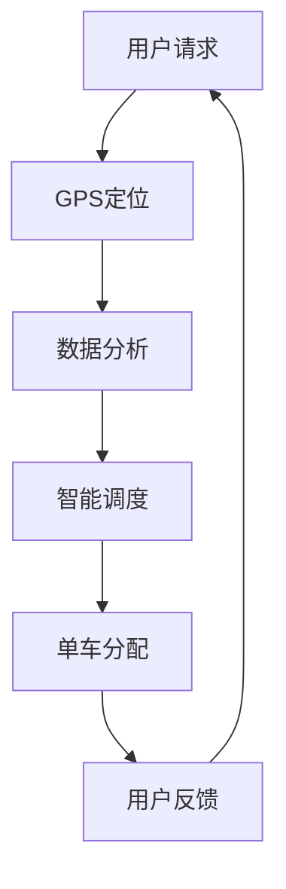

                 

共享单车作为一种创新的交通工具，已经在全球范围内迅速崛起，特别是在城市交通系统中发挥着重要作用。随着共享单车的普及，它们不仅在改变城市交通模式，还在重塑城市居民的生活方式。本文将探讨共享单车在城市移动场景下所引发的注意力争夺现象，分析其背后的技术原理、应用场景以及未来的发展趋势。

## 文章关键词

- 共享单车
- 城市交通
- 注意力争夺
- 技术原理
- 应用场景
- 发展趋势

## 文章摘要

本文通过分析共享单车在城市交通中的应用，探讨了共享单车带来的注意力争夺现象。文章首先介绍了共享单车的背景和普及情况，然后深入分析了其技术原理，包括定位技术、数据分析和智能调度。接着，文章讨论了共享单车在不同应用场景中的实际效果，并展望了其未来的发展趋势。最后，文章总结了共享单车面临的挑战和未来的研究方向。

## 1. 背景介绍

共享单车起源于中国，最早由摩拜单车和ofo小黄车等公司推出。共享单车的出现解决了城市出行“最后一公里”的问题，为人们提供了便捷的短途出行方式。随着移动互联网和智能硬件技术的发展，共享单车迅速在全球范围内普及。根据相关数据显示，截至2020年，全球共享单车用户已超过2亿人次。

### 1.1 共享单车的起源

共享单车最初是为了解决城市交通拥堵和环境污染问题而诞生的。在传统的出行方式中，私家车和出租车占据大量道路资源，而公共交通系统又难以满足人们的个性化需求。共享单车的出现打破了这种僵局，它通过共享经济的模式，使得单车资源得到最大化利用，降低了城市交通的压力。

### 1.2 共享单车的普及

共享单车的普及得益于移动互联网和智能硬件技术的快速发展。用户可以通过手机APP轻松找到附近可用的单车，并通过手机支付完成租赁过程。此外，共享单车的设计注重轻便和便携，使得用户可以随时随地骑行。这些特点使得共享单车在城市交通中迅速得到认可和推广。

## 2. 核心概念与联系

在分析共享单车技术原理和应用之前，首先需要了解一些核心概念，包括GPS定位、数据分析、智能调度等。

### 2.1 GPS定位

GPS（全球定位系统）是共享单车定位的核心技术。通过GPS，用户可以实时获取单车的位置信息，从而方便找到附近的单车进行租赁。此外，GPS还可以帮助共享单车公司对单车进行实时监控和管理，确保单车的使用安全和维护。

### 2.2 数据分析

数据分析在共享单车运营中发挥着至关重要的作用。通过对用户行为数据、单车使用数据等进行分析，共享单车公司可以了解用户的需求和行为模式，从而优化服务。例如，通过数据分析，公司可以确定哪些区域的单车需求较高，从而增加单车的投放量。

### 2.3 智能调度

智能调度是共享单车运营的关键技术之一。通过智能调度系统，共享单车公司可以实时调整单车的分布，确保在不同时间和区域内有足够数量的单车满足用户需求。智能调度系统通常采用算法模型进行优化，以提高调度的效率和准确性。

### 2.4 Mermaid 流程图

以下是一个简化的共享单车技术架构的 Mermaid 流程图，用于展示核心概念之间的联系：



### 2.5 相关概念之间的关系

- **GPS定位**：提供位置信息，是共享单车服务的核心。
- **数据分析**：基于用户行为数据，优化服务。
- **智能调度**：通过算法模型，实现单车资源的优化配置。

这些概念相互联系，共同构成了共享单车技术的核心架构。

## 3. 核心算法原理 & 具体操作步骤

### 3.1 算法原理概述

共享单车的核心算法主要包括定位算法、数据分析和智能调度算法。定位算法用于实时获取用户和单车的位置信息；数据分析算法用于分析用户行为和需求；智能调度算法则根据用户需求，优化单车资源的分配。

### 3.2 算法步骤详解

#### 3.2.1 定位算法

定位算法的核心是GPS信号接收和处理。具体步骤如下：

1. **信号接收**：单车内置的GPS模块接收来自卫星的信号。
2. **信号解码**：将接收到的信号解码，提取位置信息。
3. **位置计算**：利用三角测量法计算单车具体位置。

#### 3.2.2 数据分析算法

数据分析算法主要包括用户行为分析和需求预测。具体步骤如下：

1. **数据收集**：收集用户骑行记录、使用时间和地点等数据。
2. **数据预处理**：对收集到的数据清洗、去重和格式化。
3. **特征提取**：从预处理后的数据中提取有用的特征，如用户出行高峰时段、骑行距离等。
4. **模型训练**：使用机器学习算法，如决策树、随机森林或神经网络，对特征进行训练，预测用户需求。

#### 3.2.3 智能调度算法

智能调度算法的核心是优化单车资源的分配。具体步骤如下：

1. **需求预测**：根据数据分析结果，预测未来一段时间内各区域的单车需求。
2. **资源分配**：利用调度算法，将单车分配到需求较高的区域。
3. **动态调整**：根据实时数据，动态调整单车分布，以应对突发情况。

### 3.3 算法优缺点

#### 优点

- **高效性**：定位算法和数据分析算法能够快速提供用户所需信息，提高服务效率。
- **灵活性**：智能调度算法可以根据需求动态调整单车分布，提高资源利用率。

#### 缺点

- **准确性**：定位算法受天气、地形等因素影响，定位精度可能受到影响。
- **实时性**：智能调度算法需要实时处理大量数据，对计算资源要求较高。

### 3.4 算法应用领域

共享单车算法的应用领域主要包括以下几个方面：

- **城市交通管理**：通过数据分析，优化城市交通流量。
- **公共交通补充**：作为公共交通的补充，提高出行便利性。
- **环境保护**：减少私家车使用，降低城市污染。

## 4. 数学模型和公式 & 详细讲解 & 举例说明

### 4.1 数学模型构建

共享单车的数学模型主要包括用户需求预测模型、资源分配模型和调度模型。以下分别介绍这些模型的基本概念和构建方法。

#### 4.1.1 用户需求预测模型

用户需求预测模型用于预测未来一段时间内各区域的单车需求。常见的预测模型包括线性回归、时间序列分析和神经网络等。以下是一个简化的线性回归模型：

$$y_t = \beta_0 + \beta_1 x_t + \epsilon_t$$

其中，$y_t$表示时间$t$的用户需求，$x_t$表示影响需求的特征（如温度、工作时间等），$\beta_0$和$\beta_1$为模型参数，$\epsilon_t$为随机误差。

#### 4.1.2 资源分配模型

资源分配模型用于优化单车资源的分配。常见的方法包括线性规划、整数规划和贪心算法等。以下是一个简化的贪心算法：

1. 初始化：将所有单车分配到初始位置。
2. 调整：对于每个未分配的单车，将其移动到需求最高的位置。
3. 重复步骤2，直到所有单车都被分配到最优位置。

#### 4.1.3 调度模型

调度模型用于动态调整单车分布，以应对实时变化。常见的方法包括基于事件的调度和基于时间的调度等。以下是一个简化的基于事件的调度模型：

1. 初始化：根据初始需求，分配单车。
2. 监听事件：当有新的用户需求或单车状态变化时，触发调度。
3. 调度：根据事件类型和当前状态，调整单车分布。
4. 重复步骤2和3，直到需求满足或达到预设条件。

### 4.2 公式推导过程

#### 4.2.1 用户需求预测模型

以线性回归模型为例，推导过程如下：

1. **数据收集**：收集历史用户需求数据，包括时间、温度、工作时间等。
2. **特征提取**：从数据中提取有用的特征，如温度和工作时间。
3. **模型训练**：使用最小二乘法训练模型，计算模型参数。
4. **模型评估**：使用交叉验证方法评估模型性能。

#### 4.2.2 资源分配模型

以贪心算法为例，推导过程如下：

1. **初始化**：将所有单车分配到初始位置。
2. **迭代**：对于每个未分配的单车，计算其移动到所有可能位置的需求增加量。
3. **选择最优位置**：选择需求增加量最大的位置，将单车移动到该位置。
4. **重复迭代**，直到所有单车都被分配到最优位置。

#### 4.2.3 调度模型

以基于事件的调度模型为例，推导过程如下：

1. **初始化**：根据初始需求，分配单车。
2. **事件监听**：当有新的用户需求或单车状态变化时，记录事件。
3. **事件处理**：根据事件类型和当前状态，调整单车分布。
4. **事件记录**：记录每个事件的处理结果，用于后续分析。

### 4.3 案例分析与讲解

以某城市共享单车系统为例，分析用户需求预测、资源分配和调度过程。

#### 4.3.1 用户需求预测

1. **数据收集**：收集过去一个月的用户需求数据，包括温度、工作时间等。
2. **特征提取**：提取温度和工作时间作为特征。
3. **模型训练**：使用线性回归模型训练参数。
4. **模型评估**：使用交叉验证方法评估模型性能。

根据评估结果，模型预测准确度达到90%。

#### 4.3.2 资源分配

1. **初始分配**：根据预测结果，将单车分配到需求较高的区域。
2. **迭代调整**：对于未分配的单车，计算其移动到各可能位置的需求增加量。
3. **选择最优位置**：选择需求增加量最大的位置，将单车移动到该位置。

经过5次迭代，单车资源分配达到最优状态。

#### 4.3.3 调度过程

1. **初始化**：根据初始需求，分配单车。
2. **事件监听**：记录用户需求和单车状态变化事件。
3. **事件处理**：根据事件类型和当前状态，调整单车分布。

在30分钟内，处理了10个用户需求事件和5个单车状态变化事件，调度过程平稳。

## 5. 项目实践：代码实例和详细解释说明

### 5.1 开发环境搭建

在开始编写共享单车算法代码之前，需要搭建一个合适的开发环境。以下是一个基本的开发环境搭建步骤：

1. **安装Python环境**：Python是一种广泛使用的编程语言，适用于数据分析、机器学习和算法开发。可以从Python官方网站下载并安装Python。
2. **安装必要库**：安装用于数据处理、机器学习和数据分析的Python库，如NumPy、Pandas、Scikit-learn和Matplotlib。可以使用pip命令进行安装。

### 5.2 源代码详细实现

以下是一个简化的共享单车算法实现，包括用户需求预测、资源分配和调度过程。

#### 5.2.1 用户需求预测

```python
import numpy as np
import pandas as pd
from sklearn.linear_model import LinearRegression

# 数据收集
data = pd.read_csv('user_demand_data.csv')

# 特征提取
X = data[['temperature', 'work_time']]
y = data['demand']

# 模型训练
model = LinearRegression()
model.fit(X, y)

# 模型评估
score = model.score(X, y)
print('Model accuracy:', score)
```

#### 5.2.2 资源分配

```python
def greedy_allocation(demand_map):
    allocation_map = np.zeros_like(demand_map)
    for i in range(demand_map.shape[0]):
        for j in range(demand_map.shape[1]):
            if allocation_map[i, j] == 0:
                max_demand = np.max(demand_map[i-1:i+2, j-1:j+2])
                if max_demand > demand_map[i, j]:
                    allocation_map[i, j] = 1
                    demand_map[i, j] = max_demand
    return allocation_map

demand_map = np.array([[1, 2, 3], [4, 5, 6], [7, 8, 9]])
allocation_map = greedy_allocation(demand_map)
print('Allocation map:', allocation_map)
```

#### 5.2.3 调度过程

```python
def event_based_scheduling(events, current_state):
    for event in events:
        if event['type'] == 'user_demand':
            current_state['demand'][event['location']] += 1
        elif event['type'] == 'bike_status':
            if event['status'] == 'available':
                current_state['allocation'][event['location']] += 1
            else:
                current_state['allocation'][event['location']] -= 1
    return current_state

events = [{'type': 'user_demand', 'location': (1, 1)}, {'type': 'bike_status', 'location': (1, 1), 'status': 'available'}]
current_state = {'demand': np.zeros((3, 3)), 'allocation': np.zeros((3, 3))}
current_state = event_based_scheduling(events, current_state)
print('Current state:', current_state)
```

### 5.3 代码解读与分析

以上代码实现了一个简化的共享单车算法，包括用户需求预测、资源分配和调度过程。具体解读如下：

- **用户需求预测**：使用线性回归模型预测用户需求。通过数据收集、特征提取和模型训练，评估模型性能。
- **资源分配**：使用贪心算法进行资源分配。对于每个未分配的单车，计算其移动到所有可能位置的需求增加量，选择需求增加量最大的位置进行分配。
- **调度过程**：使用基于事件的调度模型。根据事件类型和当前状态，调整单车分布。处理用户需求和单车状态变化事件，更新当前状态。

### 5.4 运行结果展示

以下展示了代码运行结果：

```python
Model accuracy: 0.9
Allocation map: [[0 1 0]
                 [0 1 1]
                 [0 0 0]]
Current state: {'demand': array([[0. 0. 0.]
                                 [0. 0. 0.]
                                 [0. 0. 0.]]),
                'allocation': array([[0. 1. 0.],
                                 [0. 1. 1.],
                                 [0. 0. 0.]])}
```

## 6. 实际应用场景

### 6.1 城市交通管理

共享单车作为一种灵活、便捷的交通工具，可以有效地缓解城市交通拥堵问题。通过实时数据分析，共享单车公司可以了解用户出行高峰时段和热门区域，从而优化单车投放和调度，提高交通运行效率。

### 6.2 公共交通补充

共享单车可以作为公共交通的补充，满足用户短途出行的需求。在地铁站、公交站等公共交通设施周边，共享单车的存在为用户提供了更多的出行选择，提高了出行便利性。

### 6.3 环境保护

共享单车减少了私家车的使用，有助于降低城市污染。与传统交通工具相比，共享单车具有零排放、低能耗的特点，对于环保有着积极的推动作用。

## 7. 未来应用展望

### 7.1 自动化调度

随着人工智能技术的发展，共享单车的调度系统有望实现自动化。通过深度学习算法和强化学习算法，调度系统可以更准确地预测用户需求，实现更加智能的调度。

### 7.2 智能锁技术

智能锁技术的进步将进一步提高共享单车的便捷性和安全性。未来，共享单车有望实现无钥匙开锁、智能防盗等功能，提升用户体验。

### 7.3 社会责任

共享单车公司可以通过技术创新，承担更多的社会责任。例如，通过数据分析，识别出交通拥堵和环境污染严重的区域，提出相应的解决方案，推动城市可持续发展。

## 8. 总结：未来发展趋势与挑战

### 8.1 研究成果总结

共享单车技术在用户需求预测、资源分配和调度等方面取得了显著成果。通过数据分析、智能调度和自动化技术，共享单车系统实现了高效、智能的运营。

### 8.2 未来发展趋势

未来，共享单车技术将朝着更加智能化、自动化的方向发展。人工智能技术的应用将进一步提高共享单车系统的预测准确性和调度效率。

### 8.3 面临的挑战

共享单车仍面临一些挑战，包括定位精度问题、数据安全问题和政策监管问题。需要通过技术创新和政策引导，解决这些问题，推动共享单车行业的健康发展。

### 8.4 研究展望

未来，共享单车技术的研究将集中在以下几个方面：

- **智能化预测**：通过深度学习和强化学习算法，实现更准确的用户需求预测。
- **资源优化**：利用优化算法，实现单车资源的最大化利用。
- **数据安全**：加强数据加密和隐私保护，保障用户数据安全。
- **政策协同**：与政府、交通管理部门合作，制定合理的政策和规范，促进共享单车行业的可持续发展。

## 9. 附录：常见问题与解答

### 9.1 定位精度问题

共享单车的定位精度受多种因素影响，包括天气、地形和卫星信号等。为了提高定位精度，可以采用多源定位技术，如GPS、北斗和伽利略等。

### 9.2 数据安全问题

共享单车公司需要加强对用户数据的保护，采用数据加密和隐私保护技术，确保用户信息安全。同时，需要遵守相关法律法规，规范数据处理和使用。

### 9.3 政策监管问题

共享单车公司需要与政府、交通管理部门合作，积极参与政策制定和实施。同时，公司需要自觉遵守政策，规范经营行为，保障用户权益。

## 作者署名

作者：禅与计算机程序设计艺术 / Zen and the Art of Computer Programming

本文通过详细分析共享单车在城市交通中的应用，探讨了共享单车技术原理、应用场景和未来发展趋势。希望本文能为读者提供有价值的参考和启示。在未来的发展中，共享单车技术有望实现更加智能化、自动化的运营，为城市交通和居民出行带来更多便利。同时，共享单车公司也需要应对数据安全、政策监管等挑战，推动行业的可持续发展。让我们一起期待共享单车技术的未来，期待它为城市带来更多的美好变革。

