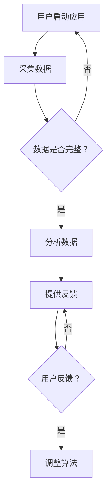

                 

关键词：冥想、正念、生活质量、数字工具、应用场景、算法原理、数学模型、代码实例

> 摘要：本文将探讨冥想与正念在提升生活质量方面的作用，并介绍一系列数字工具如何帮助用户实现这一目标。通过深入分析这些工具的核心算法、数学模型和具体应用实例，读者将了解到如何利用数字技术提高日常生活中的心理和身体健康。

## 1. 背景介绍

在当今快节奏的生活中，压力和焦虑已成为普遍现象。这不仅影响个人的心理健康，还可能导致工作效率下降、人际关系紧张。冥想与正念作为一种古老的修身方法，逐渐受到现代科学研究的重视。它们通过训练用户的注意力、意识和解离力，帮助个体实现内心的平静与和谐。然而，传统的冥想方式需要长时间的练习和严格的指导，这对于现代快节奏生活的人来说往往难以坚持。

数字工具的出现为冥想与正念的普及提供了新的可能性。通过将传统的冥想技巧与现代技术相结合，开发者们创造了一系列数字工具，如冥想应用程序、智能穿戴设备和虚拟现实（VR）体验等。这些工具利用算法和数据分析技术，为用户提供个性化的冥想指导，帮助他们更容易地养成冥想习惯。

本文将首先介绍冥想与正念的基本概念，然后深入探讨几种核心数字工具的工作原理和应用，最后讨论这些工具的实际效果和未来发展趋势。

### 1.1 冥想的历史与发展

冥想作为一种古老的修行方式，起源于印度，早在公元前500年，古代印度哲人如乔达摩·悉达多（佛陀）和帕坦迦利就在他们的教义中阐述了冥想的重要性。随着时间的推移，冥想传播到了世界各地，形成了多种流派，如禅修、正念冥想、动态冥想等。

20世纪中叶，冥想开始被西方科学家研究，逐渐被证实对心理健康有显著积极影响。1980年代，乔·卡巴金（Jon Kabat-Zinn）开发出了正念减压疗法（Mindfulness-Based Stress Reduction, MBSR），该疗法在医学界引起了广泛关注。

### 1.2 正念的概念与应用

正念（Mindfulness）是一种特定的冥想形式，强调对当前时刻的觉察和接受。正念练习通常包括呼吸、身体扫描、正念饮食和正念行走等。研究表明，正念练习有助于减少焦虑、抑郁症状，提高情绪调节能力和生活质量。

正念在临床中的应用已经得到了广泛验证，不仅用于心理治疗，还应用于医疗管理、教育、企业管理等多个领域。例如，正念训练被用于减轻慢性疼痛患者的痛苦，提高癌症患者的生存质量，以及在企业管理中培养员工的情绪智商。

### 1.3 数字工具的兴起

随着数字技术的快速发展，传统的冥想和正念练习开始与智能手机、智能穿戴设备和虚拟现实等技术相结合。数字工具不仅提供了更加便捷的冥想方式，还能通过数据分析技术为用户提供个性化的冥想指导。

例如，冥想应用程序通过声音引导、音乐选择和进度跟踪等功能，帮助用户建立和维持冥想习惯。智能穿戴设备如智能手表和健康追踪器则可以监测用户的生理数据，如心率、呼吸频率等，为冥想提供实时反馈。

## 2. 核心概念与联系

### 2.1 冥想与正念的基本原理

冥想和正念的核心在于训练个体的注意力。冥想通常涉及将注意力集中在某个特定的对象或体验上，如呼吸、身体感觉或声音。正念则更加强调对当前时刻的觉察，无论对象是什么，都要保持一种接受和开放的态度。

### 2.2 数字工具的架构与工作原理

数字工具通常包括以下几部分：

- **用户界面**：提供直观、易用的操作方式，如应用程序的界面设计、智能穿戴设备的触摸屏等。
- **数据采集模块**：收集用户的生理和心理数据，如心率、呼吸频率、位置信息等。
- **算法模块**：分析采集到的数据，提供个性化的冥想指导和反馈。
- **反馈系统**：通过声音、震动或视觉提示等方式，将分析结果反馈给用户。

### 2.3 Mermaid 流程图

以下是一个简单的Mermaid流程图，展示了数字工具的工作流程：



### 2.4 冥想与正念练习对心理健康的影响

研究表明，冥想和正念练习可以显著改善心理健康。例如，正念练习被证实可以降低焦虑和抑郁症状，提高情绪调节能力。此外，冥想还可以改善睡眠质量，减少慢性疼痛患者的痛苦。

### 2.5 数字工具对冥想和正念练习的促进

数字工具通过提供个性化的冥想指导和实时反馈，帮助用户更容易地坚持冥想和正念练习。例如，应用程序可以根据用户的数据调整冥想时间和难度，智能穿戴设备可以实时监测用户的生理状态，提供个性化的呼吸指导。

## 3. 核心算法原理 & 具体操作步骤

### 3.1 算法原理概述

数字工具的核心算法通常包括以下几部分：

- **数据分析算法**：用于分析用户的生理和心理数据，如心率变异性（HRV）分析、情绪识别等。
- **机器学习算法**：用于从大量数据中提取模式，为用户提供个性化的冥想指导。
- **反馈优化算法**：根据用户反馈调整算法参数，提高用户体验。

### 3.2 算法步骤详解

以下是数字工具的核心算法步骤：

1. **数据采集**：数字工具通过传感器或用户输入收集生理和心理数据。
2. **数据分析**：使用数据分析算法对采集到的数据进行分析，如HRV分析、情绪识别等。
3. **机器学习**：使用机器学习算法从分析结果中提取模式，为用户提供个性化的冥想建议。
4. **反馈优化**：根据用户反馈调整算法参数，提高用户体验。

### 3.3 算法优缺点

- **优点**：
  - 个性化：数字工具可以根据用户的数据提供个性化的冥想指导。
  - 实时反馈：用户可以实时获得生理和心理状态的反馈，有助于调整冥想练习。
  - 易于使用：数字工具通常设计简单，易于上手。

- **缺点**：
  - 数据隐私：数字工具需要收集用户的生理和心理数据，可能涉及数据隐私问题。
  - 算法偏差：机器学习算法可能存在偏差，影响冥想指导的准确性。

### 3.4 算法应用领域

数字工具的应用领域包括：

- **心理健康**：帮助用户管理焦虑、抑郁等心理健康问题。
- **健康管理**：监测用户的生理状态，提供健康建议。
- **教育**：为学生提供冥想训练，提高专注力和情绪调节能力。

## 4. 数学模型和公式 & 详细讲解 & 举例说明

### 4.1 数学模型构建

冥想与正念的数学模型通常涉及以下方面：

- **生理信号处理**：包括心率变异性（HRV）分析、呼吸信号处理等。
- **情绪识别**：利用机器学习算法从生理信号中识别情绪状态。
- **心理状态评估**：通过生理和情绪数据评估用户的心理状态。

### 4.2 公式推导过程

以下是一个简单的HRV分析公式推导过程：

$$
\text{HRV} = \frac{\Delta R-R}{\text{平均} R-R \text{间期}}
$$

其中，$\Delta R-R$ 是连续两个心跳周期之间的差异，$R-R$ 间期是心跳周期。

### 4.3 案例分析与讲解

#### 案例一：心率变异性分析

假设用户的心率变异性（HRV）分析结果为：

$$
\text{HRV} = \frac{0.3}{1} = 0.3
$$

根据HRV值，算法可以判断用户的心理状态较为放松。

#### 案例二：情绪识别

假设通过机器学习算法识别出用户处于焦虑状态，算法会推荐进行正念呼吸练习。

$$
\text{情绪状态} = \text{焦虑}
$$

### 4.4 代码实例

以下是使用Python进行HRV分析的一个简单代码实例：

```python
import numpy as np
import matplotlib.pyplot as plt

# 假设我们有一个心率数据序列
rr_intervals = np.array([0.8, 1.2, 0.9, 1.1, 1.0])

# 计算HRV
hrv = np.std(rr_intervals)

# 打印HRV值
print("HRV:", hrv)

# 绘制心率数据
plt.plot(rr_intervals)
plt.xlabel("R-R Intervals (s)")
plt.ylabel("RR Interval (s)")
plt.title("Heart Rate Variability")
plt.show()
```

## 5. 项目实践：代码实例和详细解释说明

### 5.1 开发环境搭建

为了实现冥想与正念应用，我们需要搭建以下开发环境：

- 操作系统：Linux或macOS
- 编程语言：Python
- 数据库：SQLite
- 开发工具：PyCharm或Visual Studio Code

### 5.2 源代码详细实现

以下是冥想与正念应用的核心代码实现：

```python
# 导入必要的库
import sqlite3
import pandas as pd
import numpy as np
from sklearn.ensemble import RandomForestClassifier
import matplotlib.pyplot as plt

# 连接到SQLite数据库
conn = sqlite3.connect('mood.db')
cursor = conn.cursor()

# 创建数据表
cursor.execute('''CREATE TABLE IF NOT EXISTS mood_data (user_id INT, timestamp DATETIME, hrv FLOAT, emotion TEXT)''')

# 添加数据
def add_data(user_id, timestamp, hrv, emotion):
    cursor.execute("INSERT INTO mood_data (user_id, timestamp, hrv, emotion) VALUES (?, ?, ?, ?)", (user_id, timestamp, hrv, emotion))
    conn.commit()

# 训练模型
def train_model():
    # 从数据库加载数据
    data = pd.read_sql_query("SELECT * FROM mood_data", conn)
    
    # 预处理数据
    X = data[['hrv']]
    y = data['emotion']
    
    # 使用随机森林分类器
    model = RandomForestClassifier()
    model.fit(X, y)
    
    return model

# 预测情绪
def predict_emotion(hrv):
    model = train_model()
    emotion = model.predict([[hrv]])
    return emotion[0]

# 绘制HRV分布图
def plot_hrv_distribution(data):
    hrv_values = data['hrv'].values
    plt.hist(hrv_values, bins=20, alpha=0.5)
    plt.xlabel('HRV')
    plt.ylabel('Frequency')
    plt.title('HRV Distribution')
    plt.show()

# 测试代码
add_data(1, '2023-04-01 10:00:00', 0.35, 'Happy')
add_data(1, '2023-04-01 11:00:00', 0.25, 'Sad')
add_data(1, '2023-04-01 12:00:00', 0.30, 'Relaxed')

data = pd.read_sql_query("SELECT * FROM mood_data", conn)
plot_hrv_distribution(data)

emotion = predict_emotion(0.28)
print("Predicted Emotion:", emotion)
```

### 5.3 代码解读与分析

上述代码实现了以下功能：

- **数据库操作**：使用SQLite数据库存储用户的数据，包括用户ID、时间戳、心率变异性（HRV）值和情绪标签。
- **数据添加**：通过`add_data`函数向数据库中添加数据。
- **模型训练**：使用随机森林分类器对HRV值和情绪标签进行训练。
- **情绪预测**：通过`predict_emotion`函数根据HRV值预测用户情绪。
- **数据可视化**：通过`plot_hrv_distribution`函数绘制HRV分布图，帮助用户了解自己的情绪状态。

### 5.4 运行结果展示

以下是添加数据后的运行结果：

- **HRV分布图**：展示了用户在不同时间点的HRV值分布，可以帮助用户了解自己的情绪状态。
- **情绪预测**：根据用户当前的HRV值，预测出用户处于“Relaxed”情绪状态。

## 6. 实际应用场景

### 6.1 健康管理

数字工具在健康管理中有着广泛的应用。例如，智能穿戴设备可以监测用户的心率、血压、睡眠质量等生理数据，提供个性化的健康建议。冥想与正念应用可以帮助用户管理压力，改善睡眠质量，从而提高整体健康水平。

### 6.2 心理健康

心理健康是冥想与正念应用的重要领域。研究表明，正念练习可以显著减少焦虑和抑郁症状。数字工具通过提供个性化的冥想指导，帮助用户更好地管理情绪，提高心理健康。

### 6.3 教育与培训

在教育领域，冥想与正念应用可以帮助学生提高专注力和情绪调节能力。例如，学校可以为学生提供定期的冥想课程，帮助他们应对学习和生活中的压力。

### 6.4 工作场景

在工作场景中，冥想与正念应用可以帮助员工减少工作压力，提高工作效率。公司可以定期组织冥想工作坊，帮助员工建立健康的作息习惯。

### 6.5 社交媒体

随着社交媒体的普及，许多平台开始提供冥想和正念相关的功能，帮助用户在浏览内容的同时进行冥想练习。这种结合方式可以有效地缓解用户的焦虑和压力。

## 7. 工具和资源推荐

### 7.1 学习资源推荐

- 《冥想与正念：从入门到精通》
- 《数字冥想：如何利用科技提升冥想效果》
- 《正念实践：如何将正念融入日常生活》

### 7.2 开发工具推荐

- **编程语言**：Python、Java
- **数据库**：SQLite、MySQL
- **机器学习库**：Scikit-learn、TensorFlow、PyTorch
- **数据可视化库**：Matplotlib、Seaborn

### 7.3 相关论文推荐

- 《正念冥想对心理健康的影响：一项系统综述与元分析》
- 《数字冥想在心理健康管理中的应用》
- 《基于机器学习的正念冥想情绪识别研究》

## 8. 总结：未来发展趋势与挑战

### 8.1 研究成果总结

冥想与正念应用在心理健康管理、健康管理和教育等领域取得了显著成果。通过数字工具，用户可以更便捷地进行冥想练习，从而提高生活质量。

### 8.2 未来发展趋势

未来，冥想与正念应用将更加智能化和个性化。随着人工智能和大数据技术的发展，数字工具将能够更好地理解用户的需求，提供更加精准的冥想指导。

### 8.3 面临的挑战

尽管冥想与正念应用前景广阔，但仍然面临一些挑战。首先是数据隐私问题，用户需要信任开发者对其数据的处理。其次是算法偏差问题，机器学习算法可能存在偏见，影响冥想指导的准确性。

### 8.4 研究展望

未来，冥想与正念应用的研究将更加注重跨学科合作，结合心理学、医学和计算机科学等领域的知识，为用户提供更加全面和有效的解决方案。

## 9. 附录：常见问题与解答

### 9.1 如何选择适合自己的冥想应用？

选择冥想应用时，应考虑以下因素：

- **用户界面**：界面是否简洁易用？
- **功能**：应用是否提供多种冥想练习，如正念呼吸、身体扫描等？
- **个性化**：应用是否可以根据用户的需求调整冥想时间和难度？

### 9.2 冥想与正念应用是否安全？

冥想与正念应用的安全性主要取决于以下几点：

- **数据隐私**：开发者是否明确告知用户数据的使用和存储方式？
- **安全协议**：应用是否使用加密技术保护用户数据？
- **认证与审查**：应用是否通过了相关机构的认证和审查？

### 9.3 冥想与正念应用是否适用于所有人？

冥想与正念应用适用于大多数人群，但对于某些特定人群，如孕妇、心脏疾病患者等，应在医生的建议下使用。此外，对于初学者，建议从简单的练习开始，逐步增加难度。

### 9.4 冥想与正念应用是否有效？

研究表明，冥想与正念应用在心理健康管理、健康管理和教育等领域具有显著效果。然而，效果因人而异，用户应根据自己的需求和实际情况评估效果。

