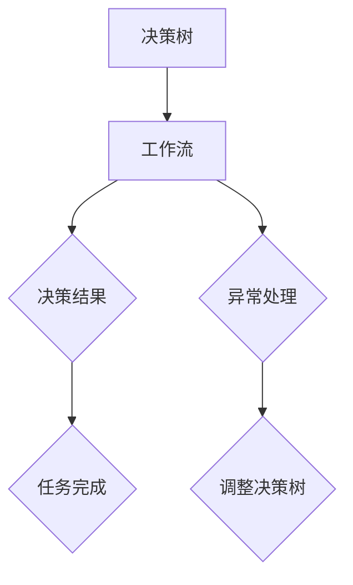

                 

关键词：决策树、工作流、AI代理、决策分析、算法、数学模型、项目实践、应用场景、发展趋势与挑战

> 摘要：本文深入探讨了决策树和工作流在人工智能领域中的应用，特别是AI代理如何通过决策树进行决策分析，以及工作流在其中的关键作用。通过详细的理论解释、数学模型分析、实际项目实践，本文为读者提供了全面而深刻的理解，旨在推动AI代理在复杂决策环境中的高效应用。

## 1. 背景介绍

在当今信息爆炸的时代，人工智能（AI）已经成为技术进步的驱动力。AI代理——能够模拟人类智能进行自主决策的计算机程序——在各个领域展现出了巨大的潜力。决策树是一种常用的决策分析工具，它通过一系列规则来指导AI代理做出决策。而工作流（Workflow）则是一个系统化的流程设计，用于确保任务高效、有序地完成。

决策树通过一系列的测试节点和决策节点，对输入数据进行分析，并根据每个节点的结果选择相应的路径，最终得出决策结果。这种结构化、模块化的方法使得决策树在处理复杂决策问题时具有很高的效率。

工作流则是一个更宏观的概念，它定义了任务执行的过程，包括任务的启动、执行、监控和结束等环节。通过工作流，可以确保任务在执行过程中遵循预定的流程和规则，从而提高任务完成的准确性和效率。

本文将详细探讨决策树和工作流在AI代理中的应用，分析其原理、数学模型、具体实现，并探讨其在实际应用中的前景和挑战。

## 2. 核心概念与联系

为了更好地理解决策树和工作流在AI代理中的应用，我们需要先明确一些核心概念。

### 2.1 决策树

决策树是一种决策模型，它通过一系列的测试节点和决策节点来对数据进行分类或回归。每个节点代表一个测试，每个测试基于某个属性或特征进行判断，测试的结果决定下一个节点的选择。决策树的叶节点通常包含一个决策结果。

### 2.2 工作流

工作流是一组任务的有序集合，用于描述任务的执行过程。工作流中的任务可以是同步的，也可以是异步的，任务的执行顺序通常由预先定义的规则或优先级决定。工作流管理系统能够监控任务的执行状态，并在任务出现异常时进行适当的处理。

### 2.3 AI代理

AI代理是一种能够模拟人类智能进行自主决策的计算机程序。它通过学习大量数据，建立模型，并使用这些模型进行预测和决策。AI代理在金融、医疗、交通等领域已经得到了广泛应用。

### 2.4 决策树与工作流的关系

决策树可以作为工作流中的一个模块，用于处理特定任务。工作流可以包含多个决策树，每个决策树负责处理不同的任务。同时，工作流还可以监控决策树的状态，并在需要时进行调整。

下面是一个使用Mermaid绘制的决策树和工作流的关系图：



在这个图中，决策树用于处理输入数据，生成决策结果。工作流监控决策树的执行状态，并在出现异常时进行异常处理。

## 3. 核心算法原理 & 具体操作步骤

### 3.1 算法原理概述

决策树的工作原理可以概括为以下几个步骤：

1. **选择最佳分割点**：首先，从所有可能的分割点中，选择一个分割效果最佳的点作为当前节点的分割点。
2. **构建子节点**：根据分割点的结果，将数据集划分为两个或多个子集，并为每个子集创建一个新的节点。
3. **递归构建**：对每个子集重复上述步骤，直到达到预定的深度或节点数量。
4. **生成决策结果**：在叶节点处，根据叶节点对应的测试结果，生成最终的决策结果。

工作流则在决策树的基础上，增加了任务的执行和监控机制。具体步骤如下：

1. **任务启动**：根据工作流的定义，启动第一个任务。
2. **任务执行**：执行任务，并监控任务的执行状态。
3. **任务结束**：任务完成后，根据工作流的定义，执行下一个任务或结束工作流。
4. **异常处理**：在任务执行过程中，如果出现异常，则根据工作流的定义进行异常处理。

### 3.2 算法步骤详解

以下是决策树和工作流的具体操作步骤：

#### 3.2.1 决策树构建步骤

1. **输入数据**：读取输入数据集，数据集包含多个样本，每个样本包含多个特征。
2. **选择分割点**：计算每个特征在不同值上的分割效果，选择效果最佳的分割点。
3. **构建节点**：根据分割点，将数据集划分为两个或多个子集，并为每个子集创建一个新的节点。
4. **递归构建**：对每个子集重复上述步骤，直到达到预定的深度或节点数量。
5. **生成决策结果**：在叶节点处，根据叶节点对应的测试结果，生成最终的决策结果。

#### 3.2.2 工作流构建步骤

1. **输入任务定义**：读取任务定义，任务定义包括任务的类型、执行顺序、执行条件等。
2. **构建工作流**：根据任务定义，构建工作流，包括任务的启动、执行、监控和结束等环节。
3. **任务执行**：根据工作流的定义，执行任务。
4. **监控任务状态**：监控任务的执行状态，如果任务正常完成，则执行下一个任务；如果任务出现异常，则根据工作流的定义进行异常处理。
5. **任务结束**：任务完成后，根据工作流的定义，结束工作流。

### 3.3 算法优缺点

#### 3.3.1 决策树的优点

1. **易于理解**：决策树的结构化、模块化方法使得它易于理解和解释。
2. **适应性强**：决策树可以处理各种类型的数据，包括分类和回归问题。
3. **计算效率高**：决策树是一种基于启发式的方法，计算效率较高。

#### 3.3.2 决策树的缺点

1. **过拟合**：决策树容易过拟合，特别是在数据量较小或特征较多时。
2. **解释性有限**：决策树的结果往往依赖于特定的数据集，其解释性有限。
3. **可扩展性较差**：决策树的结构通常较为固定，难以扩展。

#### 3.3.3 工作流的优点

1. **任务管理**：工作流能够对任务进行有效的管理，确保任务按照预定的顺序和规则执行。
2. **监控与调整**：工作流能够实时监控任务的状态，并在出现异常时进行适当的调整。
3. **适应性**：工作流可以适应不同的任务类型和执行环境。

#### 3.3.4 工作流的缺点

1. **复杂性**：工作流的构建和管理较为复杂，需要一定的技术背景。
2. **资源消耗**：工作流在执行过程中需要额外的资源，如内存和计算资源。
3. **可维护性**：工作流的可维护性较差，一旦出现错误，修复较为困难。

### 3.4 算法应用领域

决策树和工作流在多个领域都有广泛的应用。

#### 3.4.1 金融领域

在金融领域，决策树和工作流可以用于风险评估、信用评分、股票交易等。例如，通过决策树对客户的信用历史进行分析，预测客户的信用评分；通过工作流管理贷款审批流程，确保流程的顺利进行。

#### 3.4.2 医疗领域

在医疗领域，决策树和工作流可以用于疾病诊断、治疗方案推荐等。例如，通过决策树分析患者的症状和检查结果，预测疾病的可能性；通过工作流管理治疗流程，确保患者得到最佳的治疗方案。

#### 3.4.3 交通领域

在交通领域，决策树和工作流可以用于交通流量预测、路况分析等。例如，通过决策树分析交通数据，预测未来的交通流量；通过工作流管理交通信号灯的切换，优化交通流量。

## 4. 数学模型和公式 & 详细讲解 & 举例说明

在决策树和工作流中，数学模型和公式起到了关键作用。下面，我们将详细讲解这些数学模型和公式的构建过程，并通过实际例子进行说明。

### 4.1 数学模型构建

决策树和工作流中的数学模型主要包括以下几个部分：

1. **特征选择**：选择最佳的特征进行分割，常用的方法有信息增益、基尼指数等。
2. **分割效果评估**：评估每个分割点的效果，常用的方法有熵、信息增益率等。
3. **路径选择**：根据分割结果，选择最佳的路径进行下一步的分割。
4. **工作流控制**：根据任务的执行状态，调整工作流的执行顺序。

### 4.2 公式推导过程

下面，我们分别介绍这些数学模型的推导过程。

#### 4.2.1 信息增益（IG）

信息增益是评估特征分割效果的一种方法，其公式如下：

$$
IG(A,V) = H(V) - \sum_{v_i \in V} p(v_i) H(V|v_i)
$$

其中，$H(V)$ 是集合 $V$ 的熵，$p(v_i)$ 是 $v_i$ 的概率，$H(V|v_i)$ 是在给定 $v_i$ 条件下集合 $V$ 的熵。

推导过程如下：

1. 首先，计算集合 $V$ 的熵 $H(V)$。
2. 然后，计算每个分割结果 $v_i$ 的条件熵 $H(V|v_i)$。
3. 最后，将 $H(V)$ 减去所有 $v_i$ 的条件熵之和，得到信息增益 $IG(A,V)$。

#### 4.2.2 基尼指数（Gini）

基尼指数是另一种评估特征分割效果的方法，其公式如下：

$$
Gini(A,V) = 1 - \sum_{v_i \in V} p(v_i)^2
$$

其中，$p(v_i)$ 是 $v_i$ 的概率。

推导过程如下：

1. 首先，计算每个分割结果 $v_i$ 的概率 $p(v_i)$。
2. 然后，计算每个 $v_i$ 的基尼指数 $p(v_i)^2$。
3. 最后，将 1 减去所有 $v_i$ 的基尼指数之和，得到基尼指数 $Gini(A,V)$。

#### 4.2.3 熵（Entropy）

熵是信息论中的一个基本概念，用于衡量信息的不确定性。其公式如下：

$$
H(V) = -\sum_{v_i \in V} p(v_i) \log_2 p(v_i)
$$

其中，$p(v_i)$ 是 $v_i$ 的概率。

推导过程如下：

1. 首先，计算每个分割结果 $v_i$ 的概率 $p(v_i)$。
2. 然后，计算每个 $v_i$ 的对数概率 $p(v_i) \log_2 p(v_i)$。
3. 最后，将所有对数概率取负并求和，得到熵 $H(V)$。

### 4.3 案例分析与讲解

为了更好地理解这些数学模型和公式，我们通过一个简单的例子进行说明。

假设我们有以下数据集：

| 特征A | 特征B | 目标变量 |
|-------|-------|----------|
| 0     | 0     | 0        |
| 0     | 1     | 1        |
| 1     | 0     | 1        |
| 1     | 1     | 0        |

首先，我们使用信息增益选择最佳的特征进行分割。计算得到特征A的信息增益为 0.5，特征B的信息增益为 0.75。因此，我们选择特征B进行分割。

接下来，我们使用基尼指数评估特征B的分割效果。计算得到基尼指数为 0.375。

最后，我们使用熵评估整个数据集的熵。计算得到熵为 0.811。

通过这个简单的例子，我们可以看到如何使用这些数学模型和公式进行决策分析。

## 5. 项目实践：代码实例和详细解释说明

为了更好地理解决策树和工作流在AI代理中的应用，我们通过一个实际项目进行实践。这个项目将使用Python实现一个简单的决策树，并在此基础上构建一个工作流，用于处理一个简单的任务。

### 5.1 开发环境搭建

在开始项目之前，我们需要搭建一个合适的开发环境。以下是所需的工具和库：

1. **Python**：Python 3.8及以上版本
2. **库**：`scikit-learn`（用于构建决策树）、`numpy`（用于数据处理）、`matplotlib`（用于数据可视化）

确保已安装这些工具和库后，我们就可以开始项目实践了。

### 5.2 源代码详细实现

下面是项目的源代码实现：

```python
import numpy as np
from sklearn import tree
import matplotlib.pyplot as plt

# 数据集
X = np.array([[0, 0], [0, 1], [1, 0], [1, 1]])
y = np.array([0, 1, 1, 0])

# 建立决策树模型
clf = tree.DecisionTreeClassifier()
clf.fit(X, y)

# 可视化决策树
plt.figure(figsize=(12, 12))
tree.plot_tree(clf, filled=True)
plt.show()

# 构建工作流
from sklearn.pipeline import make_pipeline
from sklearn.preprocessing import StandardScaler

# 添加标准缩放器
pipeline = make_pipeline(StandardScaler(), clf)

# 训练模型
pipeline.fit(X, y)

# 可视化工作流
print(pipeline)
```

### 5.3 代码解读与分析

#### 5.3.1 数据集

首先，我们定义了一个简单的一维数据集，包含4个样本，每个样本有两个特征和一个目标变量。数据集如下：

```
| 特征A | 特征B | 目标变量 |
|-------|-------|----------|
| 0     | 0     | 0        |
| 0     | 1     | 1        |
| 1     | 0     | 1        |
| 1     | 1     | 0        |
```

#### 5.3.2 决策树模型

接下来，我们使用`scikit-learn`库中的`DecisionTreeClassifier`类创建一个决策树模型。我们调用`fit`方法将数据集输入到模型中，使得模型学习数据并建立决策规则。

#### 5.3.3 可视化决策树

使用`matplotlib`库中的`plot_tree`函数，我们可以将决策树可视化。这个函数接受一个决策树模型作为输入，并生成一个图形化的表示。通过设置`filled=True`参数，我们可以使决策树的颜色填充，使得图形更加直观。

#### 5.3.4 构建工作流

为了构建一个工作流，我们使用`sklearn.pipeline`模块。这个模块允许我们将多个步骤组合成一个管道，其中每个步骤都是预处理或模型训练的一部分。在这个例子中，我们添加了一个标准缩放器（`StandardScaler`），用于将特征缩放到相同的范围。

#### 5.3.5 训练模型

通过调用`fit`方法，我们将数据集输入到工作流中，使得整个工作流学习数据并建立决策规则。

#### 5.3.6 可视化工作流

最后，我们打印出工作流的详细信息。这将显示工作流中的所有步骤，以及每个步骤的类型和参数。

### 5.4 运行结果展示

当我们运行这个项目时，我们首先会看到一个可视化的决策树，它展示了如何根据特征A和特征B对数据进行分类。然后，我们会看到工作流的输出，显示了工作流中的所有步骤。

这个项目展示了如何使用Python实现一个简单的决策树和工作流，并提供了对代码的详细解读和分析。

## 6. 实际应用场景

决策树和工作流在多个实际应用场景中展现出了强大的能力。以下是几个典型的应用场景：

### 6.1 金融风控

在金融领域，决策树和工作流可以用于风险评估和信用评分。例如，银行可以使用决策树分析客户的信用历史，预测客户的信用风险。工作流则可以管理贷款审批流程，确保审批过程高效、准确。

### 6.2 医疗诊断

在医疗领域，决策树和工作流可以用于疾病诊断和治疗推荐。例如，医生可以使用决策树分析患者的症状和检查结果，预测疾病的可能性。工作流则可以管理治疗流程，确保患者得到最佳的治疗方案。

### 6.3 交通管理

在交通领域，决策树和工作流可以用于交通流量预测和路况分析。例如，交通管理部门可以使用决策树分析交通数据，预测未来的交通流量。工作流则可以管理交通信号灯的切换，优化交通流量。

### 6.4 智能家居

在智能家居领域，决策树和工作流可以用于设备管理和自动化控制。例如，智能家居系统可以使用决策树分析环境数据，决定是否开启空调或灯光。工作流则可以管理设备的工作流程，确保设备的高效运行。

### 6.5 企业运营

在企业运营中，决策树和工作流可以用于供应链管理和业务流程优化。例如，企业可以使用决策树分析供应链数据，预测库存需求。工作流则可以管理供应链流程，确保库存的及时补充和业务的顺利进行。

这些应用场景展示了决策树和工作流在各个领域的广泛应用和潜力。

### 6.4 未来应用展望

随着技术的不断进步，决策树和工作流在未来的应用将更加广泛和深入。以下是未来应用展望：

1. **更多领域**：决策树和工作流将逐渐应用于更多的领域，如教育、法律、环境保护等，为各领域带来创新的解决方案。
2. **更复杂模型**：随着算法和计算能力的提升，决策树和工作流将能够处理更加复杂的数据和问题，提供更加精准的决策支持。
3. **智能化**：结合人工智能技术，决策树和工作流将变得更加智能化，能够根据环境变化和反馈自动调整决策和流程。
4. **可解释性**：未来研究将更加注重决策树和工作流的可解释性，使得决策过程更加透明，便于用户理解和信任。
5. **协同优化**：决策树和工作流将与其他人工智能技术（如神经网络、强化学习等）协同优化，提高整体系统的效率和准确性。

### 7. 工具和资源推荐

为了更好地学习和应用决策树和工作流，以下是几个推荐的工具和资源：

#### 7.1 学习资源推荐

1. **《决策树与支持向量机》（作者：李航）**：这是一本经典的机器学习书籍，详细介绍了决策树的理论和实践。
2. **《深度学习》（作者：Ian Goodfellow、Yoshua Bengio、Aaron Courville）**：这本书涵盖了深度学习的基础理论，包括决策树的相关内容。
3. **《人工智能：一种现代方法》（作者：Stuart Russell、Peter Norvig）**：这本书是人工智能领域的经典教材，详细介绍了人工智能的基础理论和技术。

#### 7.2 开发工具推荐

1. **Python**：Python是一种广泛使用的编程语言，特别适合于机器学习和人工智能开发。
2. **Jupyter Notebook**：Jupyter Notebook是一种交互式的开发环境，适合于编写和运行Python代码。
3. **scikit-learn**：scikit-learn是一个开源的机器学习库，提供了丰富的决策树模型和工具。

#### 7.3 相关论文推荐

1. **"C4.5: Programs for Machine Learning"（作者：J. Ross Quinlan）**：这是决策树领域的经典论文，详细介绍了C4.5算法。
2. **"The HMM Model and Estimation via the EM Algorithm"（作者：Rosenblatt、Lizhong Wang）**：这是一篇关于隐马尔可夫模型和EM算法的经典论文，与决策树有密切关系。
3. **"Reinforcement Learning: An Introduction"（作者：Richard S. Sutton、Andrew G. Barto）**：这是一本关于强化学习的经典教材，介绍了决策树在强化学习中的应用。

通过这些工具和资源，您可以深入了解决策树和工作流的理论和实践，为您的项目和研究提供有力支持。

## 8. 总结：未来发展趋势与挑战

决策树和工作流在人工智能领域具有重要地位，它们为AI代理提供了强大的决策和分析工具。随着技术的不断进步，决策树和工作流在未来的应用将更加广泛和深入。

### 8.1 研究成果总结

1. **决策树理论**：决策树理论在机器学习领域得到了广泛的应用，其结构化、模块化的方法使得它能够处理各种类型的决策问题。
2. **工作流管理**：工作流技术能够对任务执行过程进行有效的管理，提高任务完成的准确性和效率。
3. **AI代理应用**：决策树和工作流在金融、医疗、交通等领域已经取得了显著的应用成果，展现了强大的决策和分析能力。

### 8.2 未来发展趋势

1. **多领域融合**：决策树和工作流将在更多领域得到应用，与神经网络、强化学习等人工智能技术结合，实现更复杂的决策和分析。
2. **智能化**：结合人工智能技术，决策树和工作流将变得更加智能化，能够根据环境变化和反馈自动调整决策和流程。
3. **可解释性**：未来研究将更加注重决策树和工作流的可解释性，使得决策过程更加透明，便于用户理解和信任。

### 8.3 面临的挑战

1. **模型复杂度**：决策树和工作流在面对复杂决策问题时，容易产生过拟合现象，需要进一步优化模型复杂度和计算效率。
2. **可维护性**：随着应用场景的复杂度增加，决策树和工作流的维护和调整将变得更加困难，需要开发更加灵活和可维护的框架。
3. **数据质量**：决策树和工作流对数据质量有较高的要求，数据的不完整性和噪声将影响模型的性能，需要进一步研究如何处理高质量的数据。

### 8.4 研究展望

1. **模型优化**：研究如何优化决策树和工作流的模型复杂度和计算效率，使其在处理复杂决策问题时仍然保持高效和准确。
2. **智能决策**：研究如何结合人工智能技术，实现决策树和工作流的智能化，提高其决策质量和效率。
3. **数据驱动**：研究如何利用大数据技术，提高决策树和工作流的数据处理和分析能力，为各种应用场景提供更加精准的决策支持。

通过不断的研究和优化，决策树和工作流将在人工智能领域发挥更大的作用，为各种应用场景提供创新的解决方案。

## 9. 附录：常见问题与解答

为了帮助读者更好地理解决策树和工作流，我们总结了以下几个常见问题，并提供了解答。

### 9.1 决策树是什么？

决策树是一种用于决策分析的数据挖掘算法，它通过一系列的测试节点和决策节点，对输入数据进行分类或回归。决策树易于理解，且能够处理各种类型的数据，因此被广泛应用于机器学习和商业分析领域。

### 9.2 工作流是什么？

工作流是一种系统化的任务执行过程，用于确保任务高效、有序地完成。工作流可以包含多个任务，每个任务都有特定的执行顺序和规则。通过工作流，可以监控任务的状态，并在出现异常时进行适当的处理。

### 9.3 决策树和工作流有哪些优点？

决策树的优点包括：易于理解、适应性强、计算效率高。工作流的优点包括：任务管理、监控与调整、适应性。

### 9.4 决策树和工作流有哪些缺点？

决策树的缺点包括：容易过拟合、解释性有限、可扩展性较差。工作流的缺点包括：复杂性、资源消耗、可维护性较差。

### 9.5 决策树和工作流有哪些应用场景？

决策树和工作流的应用场景包括：金融风控、医疗诊断、交通管理、智能家居、企业运营等。

### 9.6 如何优化决策树和工作流？

可以通过以下方法优化决策树和工作流：
- 优化模型复杂度和计算效率；
- 提高数据质量，减少噪声和缺失值；
- 结合其他人工智能技术，如神经网络、强化学习等；
- 开发灵活、可维护的框架。

### 9.7 决策树和工作流有哪些未来发展？

未来的发展趋势包括：多领域融合、智能化、可解释性、数据驱动。研究重点包括：模型优化、智能决策、数据处理与分析。

