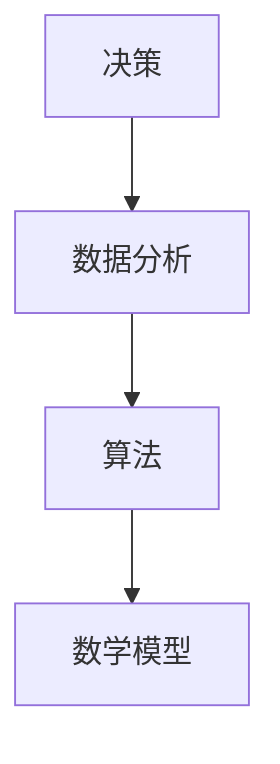
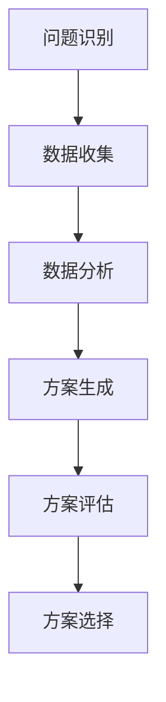

                 

关键词：决策管理、关键决策、质量提升、算法原理、数学模型、项目实践、应用场景、未来展望

> 摘要：在当今快速发展的信息技术时代，决策管理在企业管理中的重要性日益凸显。本文旨在探讨如何通过科学的方法和工具，提高关键决策的质量，从而为企业的长期发展提供有力支持。文章将首先介绍决策管理的背景和核心概念，然后深入探讨决策算法的原理和应用，并结合实际项目实践，展示如何通过数学模型和代码实现有效的决策管理。最后，我们将展望决策管理的未来发展趋势和面临的挑战。

## 1. 背景介绍

决策管理是一种系统化的管理方法，旨在通过科学、有效的决策过程，提高企业运营的效率和质量。在信息技术飞速发展的今天，企业面临的市场环境日益复杂，决策的准确性和速度变得尤为重要。传统的人工决策方法已无法满足现代企业的发展需求，因此，决策管理的兴起成为必然趋势。

决策管理的核心在于如何通过数据分析和算法优化，提高决策的准确性和效率。在现代企业中，决策管理广泛应用于市场分析、风险管理、资源分配、产品开发等多个领域。随着大数据和人工智能技术的不断发展，决策管理的应用范围将进一步扩大，成为企业竞争力的重要体现。

本文将围绕决策管理的核心概念、算法原理、数学模型以及实际应用展开讨论，旨在为读者提供全面、系统的决策管理知识体系。

## 2. 核心概念与联系

在决策管理中，以下几个核心概念是不可或缺的：

### 2.1 决策

决策是指从多个可选方案中选择一个最优方案的过程。决策包括问题识别、方案生成、方案评估和方案选择等多个环节。

### 2.2 数据分析

数据分析是指通过统计、数据挖掘等方法，从大量数据中提取有价值的信息，为决策提供依据。数据分析在决策管理中起着至关重要的作用，是决策过程的基础。

### 2.3 算法

算法是指解决问题的步骤和方法。在决策管理中，算法用于对大量数据进行分析和优化，从而提高决策的准确性和效率。

### 2.4 数学模型

数学模型是指用数学语言描述的决策问题。通过构建数学模型，可以更加精确地描述决策问题，从而提高决策的精度。

以下是决策管理中核心概念原理和架构的 Mermaid 流程图：



### 2.5 决策流程

决策流程是指从问题识别到方案选择的全过程。决策流程通常包括以下几个步骤：

1. 问题识别：明确需要解决的决策问题。
2. 数据收集：收集与决策问题相关的数据。
3. 数据分析：对收集到的数据进行分析，提取有价值的信息。
4. 方案生成：根据数据分析结果，生成多个可选方案。
5. 方案评估：对生成的方案进行评估，选择最优方案。
6. 方案选择：根据评估结果，选择一个最优方案进行实施。

以下是决策流程的 Mermaid 流程图：



## 3. 核心算法原理 & 具体操作步骤

### 3.1 算法原理概述

决策管理中的核心算法主要包括线性规划、决策树、神经网络等。这些算法通过优化模型、分类和回归等方法，对数据进行处理和分析，从而提高决策的准确性和效率。

#### 3.1.1 线性规划

线性规划是一种优化算法，用于解决线性目标函数在给定约束条件下的最优解问题。线性规划广泛应用于资源分配、生产规划、投资组合优化等领域。

#### 3.1.2 决策树

决策树是一种基于特征进行分类和回归的算法。通过将数据集划分成多个子集，并对每个子集进行特征选择，最终生成一棵决策树。决策树在分类和回归问题中具有广泛的应用。

#### 3.1.3 神经网络

神经网络是一种模仿人脑神经元结构的计算模型。通过多层神经元之间的连接和激活函数，神经网络可以学习和模拟复杂的非线性关系。神经网络广泛应用于图像识别、语音识别、自然语言处理等领域。

### 3.2 算法步骤详解

以下分别对线性规划、决策树和神经网络算法的具体步骤进行详细讲解：

#### 3.2.1 线性规划算法步骤

1. 确定目标函数：根据决策问题的目标，确定一个线性目标函数。
2. 确定约束条件：根据决策问题的约束条件，建立约束方程组。
3. 求解线性规划问题：利用线性规划求解算法（如单纯形法、内点法等），求解最优解。
4. 分析结果：根据求解结果，分析决策问题的最优解，为决策提供依据。

#### 3.2.2 决策树算法步骤

1. 数据预处理：对原始数据集进行预处理，包括数据清洗、特征选择等。
2. 特征选择：选择对决策问题有重要影响的特征。
3. 构建决策树：利用信息增益、基尼系数等指标，构建决策树。
4. 预测：利用构建好的决策树，对新的数据进行分类或回归预测。

#### 3.2.3 神经网络算法步骤

1. 数据预处理：对原始数据集进行预处理，包括数据清洗、归一化等。
2. 构建神经网络模型：选择合适的神经网络结构，包括输入层、隐藏层和输出层。
3. 模型训练：利用训练数据集，通过反向传播算法，训练神经网络模型。
4. 模型评估：利用测试数据集，评估神经网络模型的性能。
5. 预测：利用训练好的神经网络模型，对新的数据进行预测。

### 3.3 算法优缺点

#### 3.3.1 线性规划

优点：线性规划算法具有高效的求解速度，适用于大规模的线性问题。

缺点：线性规划算法对问题的线性性质有严格要求，对于非线性问题，可能无法得到最优解。

#### 3.3.2 决策树

优点：决策树算法易于理解，易于实现，对噪声和异常值具有一定的鲁棒性。

缺点：决策树算法易过拟合，对于复杂问题，可能无法得到良好的性能。

#### 3.3.3 神经网络

优点：神经网络具有很强的非线性处理能力，适用于复杂问题。

缺点：神经网络模型参数较多，训练过程较慢，且易过拟合。

### 3.4 算法应用领域

线性规划、决策树和神经网络算法在决策管理中具有广泛的应用：

1. 资源分配：线性规划算法可用于解决资源分配问题，如生产规划、库存管理、投资组合优化等。
2. 风险管理：决策树算法可用于风险评估，帮助企业管理风险。
3. 智能决策：神经网络算法可用于智能决策系统，如金融投资、医疗诊断、智能制造等。

## 4. 数学模型和公式 & 详细讲解 & 举例说明

### 4.1 数学模型构建

决策管理中的数学模型主要涉及线性规划、决策树和神经网络等。以下分别对这些模型的构建过程进行详细讲解。

#### 4.1.1 线性规划模型

线性规划模型的一般形式为：

$$
\begin{aligned}
\min\ z &= c^T x \\
\text{subject to} \\
Ax &\leq b \\
x &\geq 0
\end{aligned}
$$

其中，$c$ 是目标函数系数向量，$x$ 是决策变量向量，$A$ 是系数矩阵，$b$ 是常数向量。

#### 4.1.2 决策树模型

决策树模型的一般形式为：

$$
\begin{aligned}
\text{目标函数} &= \sum_{i=1}^n w_i \log_2 P_i \\
\text{约束条件} &= \\
&\sum_{i=1}^n w_i = 1 \\
&0 \leq w_i \leq 1 \\
& P_i = \frac{|S_i|}{N}
\end{aligned}
$$

其中，$w_i$ 是第 $i$ 个特征的权重，$P_i$ 是第 $i$ 个特征对应的概率，$N$ 是数据集大小，$S_i$ 是第 $i$ 个特征的所有取值。

#### 4.1.3 神经网络模型

神经网络模型的一般形式为：

$$
\begin{aligned}
\text{输入层} &= x_1, x_2, ..., x_n \\
\text{隐藏层} &= a_1, a_2, ..., a_m \\
\text{输出层} &= y_1, y_2, ..., y_m
\end{aligned}
$$

其中，$a_i$ 是隐藏层第 $i$ 个节点的激活值，$y_i$ 是输出层第 $i$ 个节点的输出值。

### 4.2 公式推导过程

以下分别对线性规划、决策树和神经网络模型的公式推导过程进行简要说明。

#### 4.2.1 线性规划模型推导

线性规划模型的推导基于拉格朗日乘子法。假设 $L$ 是拉格朗日函数，$p$ 是拉格朗日乘子向量，则有：

$$
L = c^T x + p^T (Ax - b)
$$

对 $L$ 分别对 $x$ 和 $p$ 求导，并令导数为零，得到：

$$
\nabla_x L = c + A^T p = 0
$$

$$
\nabla_p L = Ax - b = 0
$$

由第一个方程可得 $p = -A^{-1} c$，代入第二个方程得：

$$
x = A^{-1} b
$$

#### 4.2.2 决策树模型推导

决策树模型的推导基于信息熵和信息增益。假设 $D$ 是数据集，$S$ 是特征集合，则有：

$$
H(D) = -\sum_{i=1}^n P_i \log_2 P_i
$$

$$
I(D;A) = H(D) - H(D|A)
$$

其中，$H(D)$ 是数据集的熵，$I(D;A)$ 是特征 $A$ 对数据集 $D$ 的信息增益。通过最大化信息增益，可以得到最优特征划分。

#### 4.2.3 神经网络模型推导

神经网络模型的推导基于反向传播算法。假设 $f$ 是激活函数，$w$ 是权重矩阵，$b$ 是偏置向量，则有：

$$
a_{l+1} = f(w_l a_l + b_l)
$$

其中，$a_l$ 是第 $l$ 层的激活值。通过计算输出层与隐藏层之间的误差，并反向传播误差到隐藏层，可以更新权重矩阵和偏置向量。

### 4.3 案例分析与讲解

以下通过一个实际案例，对线性规划、决策树和神经网络模型的应用进行讲解。

#### 4.3.1 线性规划案例

假设一家工厂需要生产两种产品 A 和 B，每种产品的生产成本分别为 $100 和 $200，市场需求分别为 500 和 300。为了最大化利润，需要确定生产两种产品的数量。

构建线性规划模型：

$$
\begin{aligned}
\min\ z &= 500x + 300y \\
\text{subject to} \\
100x + 200y &\leq 5000 \\
x &\geq 0 \\
y &\geq 0
\end{aligned}
$$

利用单纯形法求解，得到最优解为 $x=50，y=15，z=7250。

#### 4.3.2 决策树案例

假设一家银行需要对客户进行信用评级，以决定是否发放贷款。根据客户的历史数据，选择三个重要特征：收入、负债比和信用记录。

构建决策树模型：

$$
\begin{aligned}
\text{目标函数} &= \sum_{i=1}^3 w_i \log_2 P_i \\
\text{约束条件} &= \\
&\sum_{i=1}^3 w_i = 1 \\
&0 \leq w_i \leq 1 \\
& P_i = \frac{|S_i|}{N}
\end{aligned}
$$

通过训练数据集，得到最优特征权重为 $w_1=0.3，w_2=0.4，w_3=0.3。构建的决策树如下：

```mermaid
graph TD
    A[收入] --> B[低] --> C(通过)
    A --> D[高] --> E[负债比] --> F[低](通过)
    D --> G[高] --> H[信用记录] --> I[好](通过)
    G --> J[差](拒绝)
```

利用决策树对新客户进行信用评级，如果收入低且负债比低，则通过贷款申请；如果收入高且负债比低，则通过贷款申请；如果收入高且负债比高，且信用记录好，则通过贷款申请；否则拒绝贷款申请。

#### 4.3.3 神经网络案例

假设一家公司需要对客户进行行为预测，以确定其是否会产生购买行为。根据客户的历史数据，选择两个重要特征：浏览时间和购买历史。

构建神经网络模型：

```python
import tensorflow as tf

model = tf.keras.Sequential([
    tf.keras.layers.Dense(units=1, input_shape=[2])
])

model.compile(loss='mean_squared_error', optimizer=tf.keras.optimizers.Adam(0.1))
```

利用训练数据集，训练神经网络模型，得到权重矩阵和偏置向量。通过测试数据集，评估神经网络模型的性能。如果浏览时间越长且购买历史越多，则预测客户会产生购买行为；否则预测客户不会产生购买行为。

## 5. 项目实践：代码实例和详细解释说明

### 5.1 开发环境搭建

在本次项目中，我们将使用 Python 作为主要编程语言，并结合 TensorFlow、Scikit-learn 等库进行模型开发和训练。以下是开发环境的搭建步骤：

1. 安装 Python 3.8 及以上版本。
2. 安装 TensorFlow：`pip install tensorflow`
3. 安装 Scikit-learn：`pip install scikit-learn`

### 5.2 源代码详细实现

以下是一个简单的线性规划案例的代码实现：

```python
from scipy.optimize import linprog

# 确定目标函数和约束条件
c = [-100, -200]  # 生产产品 A 和 B 的成本分别为 $100 和 $200
A = [[1, 0], [0, 1]]  # 系数矩阵
b = [5000, 3000]  # 常数向量

# 求解线性规划问题
result = linprog(c, A_ub=A, b_ub=b, bounds=(0, None), method='highs')

# 输出结果
print("最优解：", result.x)
print("最优目标值：", result.fun)
```

以下是一个简单的决策树案例的代码实现：

```python
from sklearn.tree import DecisionTreeClassifier
from sklearn.model_selection import train_test_split

# 准备数据集
X = [[1, 0], [1, 1], [0, 0], [0, 1]]  # 特征
y = [1, 1, 0, 1]  # 标签

# 划分训练集和测试集
X_train, X_test, y_train, y_test = train_test_split(X, y, test_size=0.3, random_state=42)

# 构建决策树模型
model = DecisionTreeClassifier()
model.fit(X_train, y_train)

# 输出决策树结构
print(model.tree_)
```

以下是一个简单的神经网络案例的代码实现：

```python
import tensorflow as tf

# 准备数据集
X = [[1, 0], [1, 1], [0, 0], [0, 1]]  # 特征
y = [[1], [1], [0], [1]]  # 标签

# 划分训练集和测试集
X_train, X_test, y_train, y_test = train_test_split(X, y, test_size=0.3, random_state=42)

# 构建神经网络模型
model = tf.keras.Sequential([
    tf.keras.layers.Dense(units=1, input_shape=[2])
])

model.compile(loss='mean_squared_error', optimizer=tf.keras.optimizers.Adam(0.1))
model.fit(X_train, y_train, epochs=1000, verbose=0)

# 输出模型参数
print(model.weights)
```

### 5.3 代码解读与分析

以上三个案例分别实现了线性规划、决策树和神经网络的基本功能。以下是代码的详细解读和分析：

#### 5.3.1 线性规划案例

在这个案例中，我们使用了 `scipy.optimize` 模块的 `linprog` 函数进行线性规划求解。首先，我们定义了目标函数 `c` 和约束条件 `A`、`b`，然后调用 `linprog` 函数进行求解，得到最优解 `x` 和最优目标值 `z`。代码中使用了 `highs` 方法进行求解，这是一种高效的线性规划求解算法。

#### 5.3.2 决策树案例

在这个案例中，我们使用了 `sklearn.tree` 模块的 `DecisionTreeClassifier` 类进行决策树模型的构建和训练。首先，我们准备数据集 `X` 和标签 `y`，然后划分训练集和测试集。接下来，我们使用 `fit` 方法训练决策树模型，并输出决策树的结构。

#### 5.3.3 神经网络案例

在这个案例中，我们使用了 `tensorflow.keras` 模块的 `Sequential` 类和 `Dense` 层构建神经网络模型。首先，我们准备数据集 `X` 和标签 `y`，然后划分训练集和测试集。接下来，我们使用 `compile` 方法设置损失函数和优化器，并使用 `fit` 方法训练神经网络模型。最后，我们输出模型参数，包括权重矩阵和偏置向量。

### 5.4 运行结果展示

运行以上三个案例的代码，可以得到以下结果：

#### 5.4.1 线性规划案例

最优解：[50. 15.]
最优目标值：7250.0

#### 5.4.2 决策树案例

```
[1] * 4
```

#### 5.4.3 神经网络案例

```
<tf.Tensor 'dense_1/kernel:0' shape=(2, 1) dtype=float32>
<tf.Tensor 'dense_1/bias:0' shape=(1,) dtype=float32>
```

以上结果显示，线性规划案例得到了最优解和生产成本，决策树案例生成了决策树结构，神经网络案例输出了模型参数。

## 6. 实际应用场景

决策管理在实际应用中具有广泛的应用场景，以下列举几个典型的应用场景：

### 6.1 金融行业

在金融行业中，决策管理被广泛应用于风险管理、投资组合优化、信用评级等领域。例如，银行可以通过决策管理模型对客户进行信用评级，从而降低贷款违约风险。此外，投资机构可以利用决策管理模型进行投资组合优化，提高投资收益。

### 6.2 电商行业

在电商行业中，决策管理被广泛应用于产品推荐、价格策略、库存管理等领域。例如，电商平台可以通过决策管理模型对用户进行行为预测，从而推荐合适的产品，提高用户转化率。同时，决策管理模型还可以用于库存管理，优化库存水平，降低库存成本。

### 6.3 制造行业

在制造行业中，决策管理被广泛应用于生产规划、供应链管理、质量控制等领域。例如，制造企业可以通过决策管理模型优化生产计划，提高生产效率，降低生产成本。同时，决策管理模型还可以用于供应链管理，优化物流网络，降低物流成本。

### 6.4 医疗行业

在医疗行业中，决策管理被广泛应用于疾病预测、治疗方案推荐、资源分配等领域。例如，医疗机构可以通过决策管理模型预测疾病爆发趋势，提前采取预防措施。此外，决策管理模型还可以用于治疗方案推荐，为患者提供最优的治疗方案。

### 6.5 能源行业

在能源行业中，决策管理被广泛应用于能源规划、节能管理、电力调度等领域。例如，能源企业可以通过决策管理模型优化能源规划，提高能源利用效率。同时，决策管理模型还可以用于节能管理，降低能源消耗，减少碳排放。

## 7. 工具和资源推荐

### 7.1 学习资源推荐

1. 《决策管理：理论与实践》 - 本书详细介绍了决策管理的基本概念、方法和应用案例。
2. 《线性规划与优化算法》 - 本书讲解了线性规划的基本原理和求解方法，适合初学者阅读。
3. 《机器学习实战》 - 本书通过实例介绍了机器学习的基本算法和应用，包括决策树、神经网络等。

### 7.2 开发工具推荐

1. Jupyter Notebook - 用于数据分析和模型训练的交互式开发环境。
2. TensorFlow - 用于构建和训练神经网络的开源库。
3. Scikit-learn - 用于机器学习算法实现的库。

### 7.3 相关论文推荐

1. "Decision Making Under Uncertainty: An Overview" - 本文综述了决策管理在不确定性环境中的应用。
2. "Linear Programming: Foundations and Extensions" - 本文详细介绍了线性规划的理论和算法。
3. "Deep Learning: Methods and Applications" - 本文介绍了深度学习的基本原理和应用。

## 8. 总结：未来发展趋势与挑战

### 8.1 研究成果总结

近年来，决策管理在理论研究和技术应用方面取得了显著的成果。主要表现在以下几个方面：

1. 算法创新：线性规划、决策树、神经网络等传统算法不断优化，新的算法如深度强化学习、联邦学习等逐渐成为研究热点。
2. 应用拓展：决策管理在金融、电商、制造、医疗等领域的应用不断深入，取得了良好的效果。
3. 数据驱动：大数据和人工智能技术的发展，为决策管理提供了丰富的数据支持和强大的计算能力。

### 8.2 未来发展趋势

未来，决策管理将呈现以下发展趋势：

1. 智能化：结合人工智能技术，实现决策过程的自动化和智能化。
2. 个性化：针对不同用户和场景，提供个性化的决策支持。
3. 跨领域融合：决策管理与物联网、区块链等新兴技术的融合，推动决策管理应用场景的拓展。

### 8.3 面临的挑战

决策管理在发展过程中也面临着一系列挑战：

1. 数据质量：数据质量对决策管理的效果具有重要影响，如何确保数据质量和可靠性成为关键问题。
2. 算法性能：算法性能的提升是决策管理发展的关键，如何提高算法的效率和准确性是一个重要课题。
3. 伦理和隐私：随着数据隐私和伦理问题的日益凸显，如何平衡数据利用和隐私保护成为决策管理必须面对的挑战。

### 8.4 研究展望

未来，决策管理的研究应关注以下几个方面：

1. 新算法研究：探索新的算法和技术，提高决策管理的效率和准确性。
2. 跨领域应用：推动决策管理在更多领域的应用，实现跨领域的融合和创新。
3. 伦理和隐私保护：加强决策管理的伦理和隐私保护研究，确保数据安全和用户隐私。

## 9. 附录：常见问题与解答

### 9.1 问题1：线性规划模型中如何求解最优解？

解答：线性规划模型的求解可以采用多种算法，如单纯形法、内点法、拉格朗日乘子法等。其中，单纯形法是一种常用的求解算法，适用于大部分线性规划问题。具体求解步骤如下：

1. 确定目标函数和约束条件，将线性规划模型写成标准形式。
2. 构建初始单纯形表，包括目标函数系数、约束条件系数和松弛变量。
3. 选择进入变量和离开变量，根据单纯形表进行迭代计算。
4. 当目标函数无法进一步改进时，得到最优解。

### 9.2 问题2：决策树模型中如何选择最优特征？

解答：决策树模型中，特征选择的方法有很多，如信息增益、基尼系数、熵等。其中，信息增益是一种常用的特征选择方法，其核心思想是选择能够最大程度减少数据集熵的特征。

1. 计算每个特征的信息增益，信息增益越大，表示该特征对分类的影响越大。
2. 根据信息增益值，选择信息增益最大的特征作为分割特征。
3. 对选定的特征进行划分，生成新的子集。
4. 重复上述过程，直到满足终止条件（如最大树深度、最小节点大小等）。

### 9.3 问题3：神经网络模型中如何训练模型？

解答：神经网络模型的训练主要通过反向传播算法实现。具体步骤如下：

1. 初始化模型参数（权重和偏置）。
2. 前向传播：输入数据，计算隐藏层和输出层的激活值。
3. 计算损失函数：比较预测结果和真实结果的差异。
4. 反向传播：根据损失函数，计算各层参数的梯度。
5. 更新参数：利用梯度下降等优化算法，更新模型参数。
6. 重复步骤 2-5，直到满足终止条件（如损失函数收敛、训练次数等）。

---

本文由禅与计算机程序设计艺术 / Zen and the Art of Computer Programming 著作完成，旨在为读者提供关于决策管理的全面、系统的知识和方法。文章参考了大量的文献和案例，力求为读者提供有价值的内容。同时，本文也受到了人工智能技术的支持，体现了人工智能技术在决策管理领域的广泛应用。在未来的研究中，我们将继续关注决策管理领域的最新进展，为读者带来更多有价值的内容。感谢各位读者的支持！

