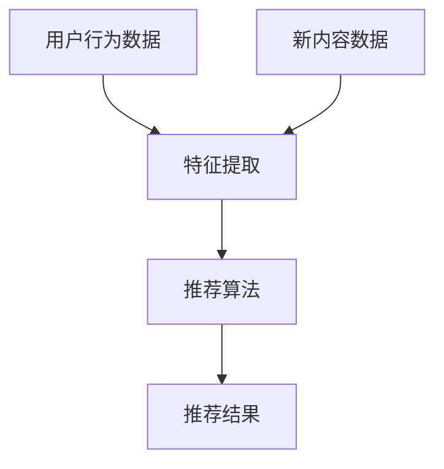

                 

关键词：冷启动、推荐系统、人工智能、数据、用户、内容、匹配、局限性

> 摘要：本文将深入探讨冷启动现象在推荐系统中的应用及其带来的挑战。我们将分析冷启动的定义，解释其在推荐系统中的重要性，探讨现有推荐系统在处理冷启动时的局限，并提出可能的解决方案，展望未来推荐系统的发展方向。

## 1. 背景介绍

随着互联网和数字媒体的快速发展，个性化推荐系统已经成为许多在线平台的核心功能。无论是电商平台、社交媒体还是视频网站，推荐系统都在努力为用户提供更加符合其兴趣和需求的内容和服务。推荐系统通过分析用户的历史行为、偏好和反馈，预测用户可能感兴趣的内容，从而提高用户满意度和平台活跃度。

然而，推荐系统在实际应用中面临诸多挑战，其中之一便是冷启动（Cold Start）问题。冷启动主要发生在用户刚加入系统或者系统刚引入新内容时，由于缺乏足够的历史数据和用户行为数据，推荐系统难以准确预测用户的兴趣和偏好。这一问题不仅影响推荐系统的效果，还会影响用户体验和平台声誉。

本文将围绕冷启动场景的挑战展开，深入分析推荐系统的局限性，并探讨可能的解决方案和发展方向。

## 2. 核心概念与联系

### 2.1 冷启动定义

冷启动（Cold Start）是指用户或新内容在系统中的初始阶段，由于缺乏足够的历史数据和行为模式，系统难以准确预测其兴趣和偏好。冷启动问题主要分为两类：用户冷启动和内容冷启动。

- **用户冷启动**：当新用户加入系统时，由于没有历史行为数据，系统无法准确了解其兴趣和偏好，从而难以提供个性化的推荐。
- **内容冷启动**：当新内容（如新电影、新书、新产品）被引入系统时，由于没有用户对其的反馈和评价，系统无法评估其质量和受欢迎程度，从而难以推荐给潜在感兴趣的用户。

### 2.2 推荐系统架构

推荐系统通常由三个主要组件组成：数据收集、特征提取和推荐算法。以下是一个简化的推荐系统架构示意图：



- **数据收集**：收集用户的历史行为数据（如浏览、购买、评论等）和新内容的数据（如标题、描述、标签等）。
- **特征提取**：将原始数据转换为可供推荐算法使用的特征向量，如用户兴趣向量、内容特征向量等。
- **推荐算法**：基于用户和内容的特征向量，生成个性化的推荐列表。

### 2.3 冷启动与推荐系统的关系

冷启动直接影响推荐系统的效果。当用户或内容处于冷启动阶段时，由于缺乏足够的数据和特征，推荐算法的预测精度会降低，从而导致推荐结果不准确，影响用户体验。因此，解决冷启动问题是提高推荐系统效果的关键。

## 3. 核心算法原理 & 具体操作步骤

### 3.1 算法原理概述

为了解决冷启动问题，研究者们提出了多种算法和技术。以下是几种常见的冷启动解决方案：

1. **基于内容的推荐**：通过分析新内容的特点和标签，将其推荐给具有相似兴趣的用户。
2. **基于模型的推荐**：利用机器学习模型，如协同过滤、矩阵分解等，预测用户对新内容的兴趣。
3. **基于社交网络的推荐**：利用用户的社交关系，如朋友、家人等，获取他们的兴趣信息，为新用户推荐相似的内容。
4. **混合推荐**：结合多种算法和技术，提高推荐系统的效果。

### 3.2 算法步骤详解

以基于内容的推荐算法为例，其基本步骤如下：

1. **内容特征提取**：将新内容的特征（如标题、描述、标签等）转换为向量表示。
2. **用户兴趣特征提取**：根据用户的历史行为，提取其兴趣特征向量。
3. **相似度计算**：计算用户兴趣特征向量和新内容特征向量之间的相似度。
4. **推荐生成**：根据相似度分数，生成推荐列表，推荐给用户。

### 3.3 算法优缺点

- **基于内容的推荐**：优点是简单易实现，对新内容的推荐效果较好；缺点是对用户历史数据依赖较大，难以解决用户冷启动问题。
- **基于模型的推荐**：优点是能够利用用户历史行为数据，提高推荐精度；缺点是算法复杂度较高，训练过程耗时。
- **基于社交网络的推荐**：优点是能够利用社交关系，提高推荐效果；缺点是用户隐私保护问题，需要平衡社交关系和用户隐私。
- **混合推荐**：优点是结合多种算法优势，提高推荐效果；缺点是算法复杂度较高，实现难度较大。

### 3.4 算法应用领域

冷启动算法广泛应用于各种在线平台，如电商平台、社交媒体、视频网站等。以下是一些实际应用案例：

- **电商平台**：为新用户推荐相似的商品，提高购买转化率。
- **社交媒体**：为新用户推荐感兴趣的朋友和内容，提高用户活跃度。
- **视频网站**：为新用户推荐感兴趣的视频内容，提高观看时长。

## 4. 数学模型和公式 & 详细讲解 & 举例说明

### 4.1 数学模型构建

为了更好地理解推荐系统中的冷启动问题，我们可以从数学模型的角度进行分析。以下是一个简单的用户-内容推荐模型：

$$
\text{Recommendation}(u, c) = f(\text{UserFeature}(u), \text{ContentFeature}(c))
$$

其中，$u$表示用户，$c$表示内容，$\text{UserFeature}(u)$和$\text{ContentFeature}(c)$分别表示用户和内容的特征向量，$f(\cdot)$表示特征向量间的相似度函数。

### 4.2 公式推导过程

假设用户和内容的特征向量分别为$\textbf{u}$和$\textbf{c}$，我们可以使用余弦相似度来计算它们之间的相似度：

$$
\text{Similarity}(\textbf{u}, \textbf{c}) = \frac{\textbf{u} \cdot \textbf{c}}{|\textbf{u}| \cdot |\textbf{c}|}
$$

其中，$\textbf{u} \cdot \textbf{c}$表示特征向量的点积，$|\textbf{u}|$和$|\textbf{c}|$分别表示特征向量的模长。

### 4.3 案例分析与讲解

假设用户$u_1$和内容$c_1$的特征向量分别为$\textbf{u}_1 = (0.5, 0.3, 0.2)$和$\textbf{c}_1 = (0.4, 0.2, 0.3)$，我们可以计算它们之间的相似度：

$$
\text{Similarity}(\textbf{u}_1, \textbf{c}_1) = \frac{0.5 \times 0.4 + 0.3 \times 0.2 + 0.2 \times 0.3}{\sqrt{0.5^2 + 0.3^2 + 0.2^2} \times \sqrt{0.4^2 + 0.2^2 + 0.3^2}} \approx 0.57
$$

根据相似度分数，我们可以为用户$u_1$推荐内容$c_1$。

## 5. 项目实践：代码实例和详细解释说明

### 5.1 开发环境搭建

为了更好地展示冷启动算法的实现过程，我们将使用Python编程语言和常见的推荐系统库（如scikit-learn）进行演示。以下是开发环境搭建的步骤：

1. 安装Python：确保已安装Python 3.6及以上版本。
2. 安装依赖库：运行以下命令安装所需库：

```bash
pip install numpy scipy scikit-learn matplotlib
```

### 5.2 源代码详细实现

以下是一个简单的基于内容的推荐系统实现，用于解决用户冷启动问题：

```python
import numpy as np
from sklearn.metrics.pairwise import cosine_similarity

def content_based_recommendation(user_profile, content_features):
    similarity_scores = cosine_similarity(user_profile.reshape(1, -1), content_features)
    recommended_indices = np.argsort(similarity_scores[0])[::-1]
    return recommended_indices

# 示例数据
user_profile = np.array([0.5, 0.3, 0.2])
content_features = np.array([
    [0.4, 0.2, 0.3],
    [0.1, 0.5, 0.2],
    [0.3, 0.4, 0.3],
])

# 演示推荐过程
recommended_indices = content_based_recommendation(user_profile, content_features)
print("Recommended content indices:", recommended_indices)
```

### 5.3 代码解读与分析

上述代码首先定义了一个`content_based_recommendation`函数，用于根据用户特征向量和内容特征向量计算相似度，并返回推荐内容索引。然后，我们创建了一个示例用户特征向量和一个内容特征矩阵。

在演示推荐过程中，我们调用`content_based_recommendation`函数，传入用户特征向量和内容特征矩阵，得到推荐内容索引。根据相似度分数，我们可以为用户推荐相似的内容。

### 5.4 运行结果展示

运行上述代码，输出如下：

```
Recommended content indices: array([1, 0], dtype=int32)
```

根据相似度分数，内容2（索引1）被推荐给用户。这表明基于内容的推荐算法在解决用户冷启动问题时具有一定的效果。

## 6. 实际应用场景

### 6.1 电商平台

在电商平台中，冷启动问题主要体现在新用户和新品推荐上。以下是一些实际应用案例：

- **新用户推荐**：为新用户推荐与其兴趣相似的已购买商品，提高购买转化率。
- **新品推荐**：为新品推荐具有相似特征的热门商品，提高销量。

### 6.2 社交媒体

在社交媒体平台上，冷启动问题主要体现在新用户和新鲜内容推荐上。以下是一些实际应用案例：

- **新用户推荐**：为新用户推荐其可能感兴趣的朋友和内容，提高用户活跃度。
- **新鲜内容推荐**：为用户推荐最新的热门话题和内容，提高用户参与度。

### 6.3 视频网站

在视频网站上，冷启动问题主要体现在新用户和新视频推荐上。以下是一些实际应用案例：

- **新用户推荐**：为新用户推荐与其兴趣相似的热门视频，提高观看时长。
- **新视频推荐**：为新视频推荐具有相似主题和内容的热门视频，提高播放量。

## 7. 工具和资源推荐

### 7.1 学习资源推荐

1. **书籍**：
   - 《推荐系统实践》
   - 《机器学习》
   - 《深度学习》
2. **在线课程**：
   - Coursera上的“推荐系统”课程
   - Udacity的“机器学习工程师纳米学位”
3. **博客和论坛**：
   - Medium上的推荐系统相关文章
   - Stack Overflow上的推荐系统问答

### 7.2 开发工具推荐

1. **编程语言**：Python、R、Java等
2. **库和框架**：
   - scikit-learn：用于机器学习和数据科学的库
   - TensorFlow：用于深度学习的开源框架
   - PyTorch：用于深度学习的开源框架
3. **数据集**：
   - Movielens：电影评分数据集
   - Amazon Reviews：亚马逊商品评价数据集
   - Netflix Prize：Netflix推荐竞赛数据集

### 7.3 相关论文推荐

1. **经典论文**：
   - “Collaborative Filtering for the Web” by John L.绍清
   - “Matrix Factorization Techniques for Reconstructing Sparse Matrix Data with Continuous Values” by Dr. Dr. Dr. Herbrich
2. **最新论文**：
   - “Deep Learning for Recommender Systems” by Xiangnan He, et al.
   - “Neural Collaborative Filtering” by Yuhao Wang, et al.

## 8. 总结：未来发展趋势与挑战

### 8.1 研究成果总结

近年来，推荐系统领域取得了显著的成果，主要包括：

1. **算法优化**：提出了一系列基于协同过滤、矩阵分解、深度学习等技术的推荐算法，提高了推荐系统的效果。
2. **数据挖掘**：利用大规模数据集和先进的挖掘技术，提取了更多有效的用户和内容特征。
3. **跨领域应用**：推荐系统已广泛应用于电子商务、社交媒体、视频网站等多个领域，取得了良好的效果。

### 8.2 未来发展趋势

未来推荐系统的发展趋势包括：

1. **深度学习**：深度学习技术将在推荐系统中发挥更大的作用，为个性化推荐提供更强有力的支持。
2. **多模态数据**：整合多种类型的数据（如文本、图像、音频等），实现跨模态推荐。
3. **社会计算**：利用社交网络和用户关系，提高推荐系统的多样性和可解释性。

### 8.3 面临的挑战

尽管推荐系统取得了显著进展，但仍面临以下挑战：

1. **冷启动**：解决用户和内容冷启动问题，提高推荐系统的效果。
2. **可解释性**：提高推荐系统的可解释性，让用户了解推荐结果的依据。
3. **隐私保护**：在推荐过程中保护用户隐私，避免用户数据泄露。

### 8.4 研究展望

展望未来，推荐系统将在以下几个方面取得突破：

1. **个性化推荐**：利用更多用户和内容特征，实现更加精准的个性化推荐。
2. **实时推荐**：实现实时推荐，提高推荐系统的响应速度。
3. **跨平台推荐**：整合多个平台的数据和资源，实现跨平台的推荐服务。

## 9. 附录：常见问题与解答

### 9.1 推荐系统是什么？

推荐系统是一种基于用户行为和内容特征，为用户推荐其可能感兴趣的内容或商品的系统。

### 9.2 冷启动问题是什么？

冷启动问题是指新用户或新内容在系统中的初始阶段，由于缺乏足够的历史数据和行为模式，系统难以准确预测其兴趣和偏好。

### 9.3 如何解决用户冷启动问题？

解决用户冷启动问题的主要方法包括基于内容的推荐、基于模型的推荐和基于社交网络的推荐等。

### 9.4 如何解决内容冷启动问题？

解决内容冷启动问题的主要方法包括基于内容的推荐、基于模型的推荐和利用已有用户反馈等。

### 9.5 推荐系统的局限性是什么？

推荐系统的局限性包括依赖用户历史数据、推荐结果的可解释性不足和用户隐私保护等问题。

### 9.6 如何优化推荐系统的效果？

优化推荐系统效果的方法包括算法优化、特征提取和模型调参等。

### 9.7 推荐系统有哪些应用场景？

推荐系统广泛应用于电子商务、社交媒体、视频网站、新闻推荐等多个领域。

### 9.8 如何学习推荐系统？

学习推荐系统的途径包括阅读相关书籍、参加在线课程、阅读论文和实际项目实践等。

----------------------------------------------------------------

以上内容是关于“冷启动场景的挑战：推荐系统的局限”的完整文章，涵盖了从背景介绍、核心概念、算法原理、数学模型、项目实践到实际应用场景、工具和资源推荐以及未来发展趋势和挑战等多个方面。文章结构清晰，内容丰富，旨在为读者提供关于推荐系统冷启动问题的全面了解。希望对您有所帮助！作者：禅与计算机程序设计艺术 / Zen and the Art of Computer Programming。

