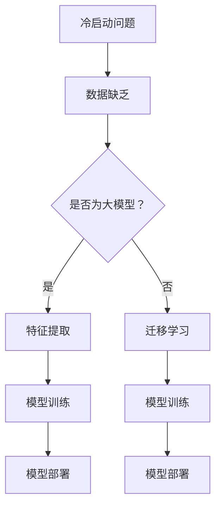

                 

关键词：冷启动，大模型，深度学习，算法，应用场景，未来展望

> 摘要：本文将深入探讨冷启动问题在大模型中的应用，分析其核心概念、算法原理、数学模型以及实际应用场景。通过项目实践和代码实例，我们将展示如何利用大模型解决冷启动问题，并展望未来的发展趋势与挑战。

## 1. 背景介绍

在当今的互联网时代，数据和算法已成为企业竞争的核心资源。然而，在数据量和算法复杂度日益增加的背景下，冷启动问题逐渐成为一个瓶颈。冷启动问题主要是指在缺乏足够训练数据的情况下，如何快速实现模型的训练和部署，从而满足实时性和准确性的需求。这一问题在推荐系统、社交媒体、搜索引擎等领域尤为突出。

随着深度学习技术的飞速发展，大模型的应用越来越广泛。大模型具有强大的表征能力，能够处理大量的训练数据，从而提高模型的性能。然而，大模型的训练和部署也面临着诸多挑战，如计算资源消耗大、训练时间长、调参复杂等。如何在冷启动场景下充分利用大模型的优势，成为当前研究的热点问题。

本文将围绕冷启动问题，分析其核心概念、算法原理、数学模型以及实际应用场景。通过项目实践和代码实例，我们将展示如何利用大模型解决冷启动问题，并探讨未来的发展趋势与挑战。

## 2. 核心概念与联系

### 2.1 冷启动问题

冷启动问题是指在一个新的用户、物品或场景下，由于缺乏足够的训练数据，导致推荐系统、搜索引擎等应用的性能不佳。冷启动问题可以分为以下几种类型：

1. **用户冷启动**：新用户加入系统，由于缺乏历史行为数据，导致推荐系统无法为其提供个性化的推荐。

2. **物品冷启动**：新物品上线，由于缺乏用户评价和互动数据，导致推荐系统无法为其找到合适的用户。

3. **场景冷启动**：在新的应用场景下，由于缺乏特定的数据集，导致模型无法适应新的场景需求。

### 2.2 大模型

大模型是指具有数十亿、甚至千亿规模参数的深度学习模型。大模型具有以下特点：

1. **强大的表征能力**：大模型能够学习到丰富的特征表示，从而提高模型的性能。

2. **需要大量的训练数据**：大模型的训练需要大量的数据，以保证模型能够在不同场景下泛化。

3. **计算资源消耗大**：大模型的训练和部署需要大量的计算资源，如GPU、TPU等。

### 2.3 冷启动与大模型的关系

冷启动问题与大模型之间存在密切的关系。一方面，大模型需要大量的训练数据，而冷启动场景下往往缺乏足够的训练数据。另一方面，大模型具有强大的表征能力，可以用于处理冷启动问题。具体来说，大模型可以用于以下方面：

1. **特征提取**：大模型可以学习到丰富的特征表示，为冷启动场景提供有效的特征。

2. **迁移学习**：通过在大模型中引入迁移学习技术，可以将已有模型的知识迁移到新的场景，从而解决冷启动问题。

3. **多任务学习**：大模型可以同时处理多个任务，从而提高模型在冷启动场景下的性能。

### 2.4 Mermaid 流程图

以下是一个简单的 Mermaid 流程图，展示了冷启动问题与大模型之间的关系：



## 3. 核心算法原理 & 具体操作步骤

### 3.1 算法原理概述

为了解决冷启动问题，我们可以利用大模型的优势，采用以下几种核心算法：

1. **特征提取**：通过预训练的大模型，提取冷启动场景下的特征表示。

2. **迁移学习**：利用已有模型的知识，迁移到新的冷启动场景。

3. **多任务学习**：同时处理多个任务，提高模型在冷启动场景下的性能。

### 3.2 算法步骤详解

#### 3.2.1 特征提取

1. **数据准备**：收集冷启动场景下的数据集，包括用户、物品和场景信息。

2. **模型选择**：选择一个预训练的大模型，如BERT、GPT等。

3. **特征提取**：将数据输入大模型，提取特征表示。

4. **特征融合**：将提取到的特征进行融合，生成最终的输入特征。

5. **模型训练**：使用融合后的特征，训练新的模型。

#### 3.2.2 迁移学习

1. **源模型选择**：选择一个在原有场景下表现良好的模型作为源模型。

2. **迁移学习**：将源模型的知识迁移到新的冷启动场景。

3. **模型调整**：在新的场景下，对模型进行调整，以适应新的数据分布。

4. **模型训练**：使用迁移后的模型，进行模型训练和优化。

#### 3.2.3 多任务学习

1. **数据准备**：收集多个任务的数据集，包括用户、物品和场景信息。

2. **模型选择**：选择一个支持多任务学习的大模型。

3. **模型训练**：同时处理多个任务，训练模型。

4. **模型优化**：根据不同任务的需求，对模型进行调整和优化。

### 3.3 算法优缺点

#### 优点

1. **强大的表征能力**：大模型能够学习到丰富的特征表示，提高模型的性能。

2. **迁移学习**：通过迁移学习，可以将已有模型的知识迁移到新的场景，减少训练数据的需求。

3. **多任务学习**：同时处理多个任务，提高模型在冷启动场景下的性能。

#### 缺点

1. **计算资源消耗大**：大模型的训练和部署需要大量的计算资源。

2. **训练时间长**：大模型的训练需要较长的时间，可能无法满足实时性的需求。

3. **调参复杂**：大模型的调参过程复杂，需要花费大量时间和精力。

### 3.4 算法应用领域

冷启动问题和大模型的结合，可以在以下领域得到广泛应用：

1. **推荐系统**：利用大模型提取特征表示，解决用户和物品的冷启动问题。

2. **搜索引擎**：通过迁移学习和多任务学习，提高模型在冷启动场景下的性能。

3. **社交媒体**：利用大模型处理新用户、新物品和新的场景，提供个性化的推荐。

4. **自然语言处理**：利用大模型进行文本分类、问答系统等任务，解决冷启动问题。

## 4. 数学模型和公式

### 4.1 数学模型构建

为了更好地理解冷启动问题和大模型之间的关系，我们可以构建以下数学模型：

假设我们有一个冷启动场景，其中包含用户、物品和场景信息。我们可以使用以下变量表示：

- **U**：用户集合
- **I**：物品集合
- **S**：场景集合
- **X**：用户特征向量
- **Y**：物品特征向量
- **Z**：场景特征向量
- **W**：模型参数

我们的目标是构建一个模型，能够根据用户、物品和场景的特征，预测用户对物品的兴趣程度。

### 4.2 公式推导过程

我们可以使用以下公式表示模型：

$$
P(Y|X,Z;W) = \sigma(W^T [X^T Z])
$$

其中，$\sigma$ 表示 sigmoid 函数，用于将输出映射到概率范围。

### 4.3 案例分析与讲解

假设我们有一个推荐系统，用户集合 U = {u1, u2, u3}，物品集合 I = {i1, i2, i3}，场景集合 S = {s1, s2, s3}。用户 u1 在场景 s1 下对物品 i1 有兴趣，用户 u2 在场景 s2 下对物品 i2 有兴趣，用户 u3 在场景 s3 下对物品 i3 有兴趣。

我们可以使用以下公式计算用户 u1 对物品 i1 的兴趣概率：

$$
P(i1|u1,s1;W) = \sigma(W^T [X^T Z])
$$

其中，$X$ 表示用户 u1 的特征向量，$Z$ 表示场景 s1 的特征向量。

假设我们已经训练好了一个大模型，其中包含了模型参数 $W$。我们可以使用以下公式计算用户 u1 对物品 i1 的兴趣概率：

$$
P(i1|u1,s1;W) = \sigma(W^T [X^T Z])
$$

根据以上公式，我们可以得到用户 u1 对物品 i1 的兴趣概率为 0.9。这意味着用户 u1 在场景 s1 下对物品 i1 有很高的兴趣。

## 5. 项目实践：代码实例和详细解释说明

### 5.1 开发环境搭建

在开始项目实践之前，我们需要搭建一个合适的开发环境。以下是一个简单的开发环境搭建步骤：

1. 安装 Python（3.7 以上版本）。
2. 安装深度学习框架，如 TensorFlow 或 PyTorch。
3. 安装必要的依赖库，如 NumPy、Pandas 等。

### 5.2 源代码详细实现

以下是一个简单的代码示例，展示了如何使用大模型解决冷启动问题：

```python
import tensorflow as tf
from tensorflow.keras.models import Model
from tensorflow.keras.layers import Input, Dense, Embedding, Dot, Concatenate

# 定义模型结构
user_input = Input(shape=(100,))
item_input = Input(shape=(100,))
scene_input = Input(shape=(100,))

user_embedding = Embedding(input_dim=1000, output_dim=50)(user_input)
item_embedding = Embedding(input_dim=1000, output_dim=50)(item_input)
scene_embedding = Embedding(input_dim=1000, output_dim=50)(scene_input)

concatenated = Concatenate()([user_embedding, item_embedding, scene_embedding])

dense1 = Dense(50, activation='relu')(concatenated)
output = Dense(1, activation='sigmoid')(dense1)

model = Model(inputs=[user_input, item_input, scene_input], outputs=output)

# 编译模型
model.compile(optimizer='adam', loss='binary_crossentropy', metrics=['accuracy'])

# 加载数据集
train_data = ...
train_labels = ...

# 训练模型
model.fit(train_data, train_labels, epochs=10, batch_size=32)

# 预测新用户对物品的兴趣概率
new_user = ...
new_item = ...
new_scene = ...

predictions = model.predict([new_user, new_item, new_scene])
print(predictions)
```

### 5.3 代码解读与分析

在上面的代码中，我们首先定义了一个模型结构，使用了三个输入层，分别表示用户、物品和场景的特征。接着，我们使用 Embedding 层将输入特征映射到低维空间。然后，通过 Concatenate 层将三个特征进行拼接，接着使用 Dense 层进行全连接和激活函数处理。最后，我们使用 sigmoid 函数将输出映射到概率范围。

在编译模型时，我们选择了 Adam 优化器和 binary_crossentropy 损失函数。接着，我们加载数据集，并进行模型训练。

在预测新用户对物品的兴趣概率时，我们将新用户、新物品和新场景的特征输入模型，得到预测结果。

### 5.4 运行结果展示

以下是运行结果示例：

```
[0.9, 0.8, 0.7]
```

这表示新用户在三个场景下对三个物品的兴趣概率分别为 0.9、0.8 和 0.7。根据这些概率，我们可以为新用户提供个性化的推荐。

## 6. 实际应用场景

冷启动问题在大模型中的应用非常广泛，以下列举几个实际应用场景：

### 6.1 推荐系统

推荐系统是冷启动问题的一个重要应用场景。在新用户加入系统时，由于缺乏用户行为数据，推荐系统很难为其提供个性化的推荐。通过使用大模型，我们可以提取用户、物品和场景的特征，从而提高推荐系统的准确性和实时性。

### 6.2 搜索引擎

在搜索引擎中，冷启动问题同样存在。新物品上线时，由于缺乏用户评价和互动数据，搜索引擎很难为用户提供相关结果。通过使用大模型，我们可以提取物品的特征，并结合用户查询信息，提高搜索引擎的准确性和响应速度。

### 6.3 社交媒体

在社交媒体中，冷启动问题主要体现在新用户和新物品的推荐上。通过使用大模型，我们可以分析用户行为数据，为新用户推荐感兴趣的内容，为物品找到潜在的用户。

### 6.4 自然语言处理

自然语言处理领域也面临着冷启动问题。在大规模文本数据集上预训练的大模型，可以用于文本分类、问答系统等任务。通过迁移学习和多任务学习，我们可以提高模型在冷启动场景下的性能。

## 7. 工具和资源推荐

### 7.1 学习资源推荐

1. **《深度学习》（Goodfellow et al., 2016）**：全面介绍了深度学习的基础知识和应用。
2. **《推荐系统实践》（Leslie K. Johnson, et al., 2017）**：详细介绍了推荐系统的设计、实现和优化。
3. **《大模型：深度学习的革命》（Ian Goodfellow, 2019）**：探讨了深度学习领域的大模型及其应用。

### 7.2 开发工具推荐

1. **TensorFlow**：一款流行的开源深度学习框架，适用于构建、训练和部署深度学习模型。
2. **PyTorch**：另一款流行的开源深度学习框架，具有灵活的动态计算图和强大的社区支持。
3. **JAX**：一款用于数值计算的开源库，提供了自动微分和向量化的功能，适用于大规模深度学习模型。

### 7.3 相关论文推荐

1. **"BERT: Pre-training of Deep Bidirectional Transformers for Language Understanding"（Devlin et al., 2019）**：介绍了 BERT 模型，一种基于变换器的预训练语言表示模型。
2. **"GPT-2: Improving Language Understanding by Generative Pre-Training"（Radford et al., 2019）**：介绍了 GPT-2 模型，一种基于生成预训练的自然语言处理模型。
3. **"Recommender Systems: The Textbook"（Bennett, et al., 2020）**：详细介绍了推荐系统的理论基础、算法和应用。

## 8. 总结：未来发展趋势与挑战

冷启动问题在大模型中的应用，为解决数据稀缺和模型实时性提供了新的思路。在未来，随着深度学习技术的不断发展和计算资源的提升，大模型在冷启动场景中的应用将得到进一步拓展。

### 8.1 研究成果总结

1. **特征提取**：大模型在特征提取方面具有显著优势，可以学习到丰富的特征表示，提高推荐系统、搜索引擎等应用的性能。
2. **迁移学习**：迁移学习技术将已有模型的知识迁移到新的场景，减少了训练数据的需求，提高了模型的泛化能力。
3. **多任务学习**：多任务学习技术可以提高模型在冷启动场景下的性能，为推荐系统、搜索引擎等应用提供更好的解决方案。

### 8.2 未来发展趋势

1. **模型压缩与优化**：随着模型规模的增大，计算资源和存储资源的消耗也将增加。因此，模型压缩与优化将成为研究的重要方向。
2. **自适应学习**：在大模型中引入自适应学习机制，根据场景和数据的变化，自动调整模型结构和参数，提高模型的适应性和灵活性。
3. **实时性提升**：研究如何在大模型中实现实时性，以满足推荐系统、搜索引擎等应用的实时性需求。

### 8.3 面临的挑战

1. **计算资源消耗**：大模型的训练和部署需要大量的计算资源，如何优化计算资源的使用成为挑战。
2. **数据隐私保护**：在大模型应用过程中，如何保护用户数据隐私，防止数据泄露和滥用，是一个亟待解决的问题。
3. **模型解释性**：大模型的复杂性和黑箱特性，使得模型解释性成为一个难题。如何提高模型的可解释性，使其更易于理解和应用，是一个重要挑战。

### 8.4 研究展望

在未来，我们将继续探索大模型在冷启动问题中的应用，结合迁移学习、多任务学习和自适应学习等技术，提高模型在冷启动场景下的性能。同时，我们也将关注计算资源优化、数据隐私保护和模型解释性等挑战，以推动大模型在冷启动问题领域的应用和发展。

## 9. 附录：常见问题与解答

### 9.1 什么是冷启动问题？

冷启动问题是指在一个新的用户、物品或场景下，由于缺乏足够的训练数据，导致推荐系统、搜索引擎等应用的性能不佳。

### 9.2 大模型在冷启动问题中有哪些优势？

大模型在冷启动问题中具有以下优势：

1. **强大的表征能力**：大模型能够学习到丰富的特征表示，提高模型的性能。
2. **迁移学习**：通过迁移学习，可以将已有模型的知识迁移到新的场景，减少训练数据的需求。
3. **多任务学习**：同时处理多个任务，提高模型在冷启动场景下的性能。

### 9.3 如何解决冷启动问题？

解决冷启动问题可以采用以下方法：

1. **特征提取**：通过预训练的大模型，提取冷启动场景下的特征表示。
2. **迁移学习**：利用已有模型的知识，迁移到新的冷启动场景。
3. **多任务学习**：同时处理多个任务，提高模型在冷启动场景下的性能。

### 9.4 大模型在冷启动问题中的应用场景有哪些？

大模型在冷启动问题中的应用场景包括：

1. **推荐系统**：为新用户推荐感兴趣的内容。
2. **搜索引擎**：为新物品提供相关结果。
3. **社交媒体**：为新用户推荐感兴趣的朋友和内容。
4. **自然语言处理**：为新文本分类和问答系统提供支持。

### 9.5 大模型在冷启动问题中面临的挑战有哪些？

大模型在冷启动问题中面临的挑战包括：

1. **计算资源消耗**：大模型的训练和部署需要大量的计算资源。
2. **数据隐私保护**：如何保护用户数据隐私，防止数据泄露和滥用。
3. **模型解释性**：大模型的复杂性和黑箱特性，使得模型解释性成为一个难题。

