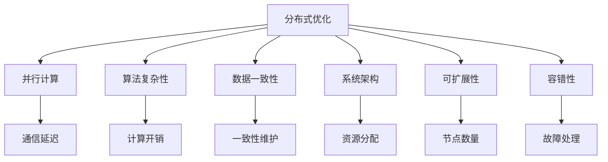

                 

关键词：分布式优化、并行计算、算法复杂性、数据一致性、性能优化、协作学习、分布式算法、系统架构、可扩展性

> 摘要：随着大数据时代的到来，分布式系统在现代计算机体系结构中占据了重要地位。分布式优化作为分布式系统的核心问题之一，涉及到如何在分布式环境中高效地处理复杂任务和优化资源分配。本文将深入探讨分布式优化的挑战和策略，从核心概念、算法原理、数学模型、应用实践等方面进行详细分析，并展望未来的发展趋势和挑战。

## 1. 背景介绍

分布式优化是分布式计算领域的一个重要研究方向，旨在通过优化算法和策略来提高分布式系统的性能和效率。在分布式系统中，数据和处理任务通常分布在多个节点上，这些节点之间存在通信延迟和资源竞争等问题。分布式优化旨在解决这些挑战，从而实现高效的数据处理和资源利用。

分布式优化在多个领域都有着广泛的应用。在云计算和大数据领域，分布式优化可以用于优化大规模数据处理和存储系统的性能。在机器学习和人工智能领域，分布式优化可以用于加速大规模模型的训练和推理。在物联网和边缘计算领域，分布式优化可以用于优化资源分配和任务调度。

然而，分布式优化也面临着一系列的挑战。首先，分布式系统中的节点之间可能存在通信延迟和不稳定连接，这会导致算法的复杂性和不确定性增加。其次，数据一致性和分布式同步问题是分布式优化中的重要挑战。在分布式环境中，如何确保数据的一致性和一致性维护是一个关键问题。此外，分布式优化还需要考虑可扩展性和容错性等问题，以确保系统能够应对大规模数据和节点数量。

为了解决这些挑战，研究者们提出了一系列分布式优化策略和算法。本文将详细探讨这些策略和算法，并分析它们在分布式环境中的应用和效果。

## 2. 核心概念与联系

### 2.1. 分布式优化

分布式优化是指将优化任务分布在多个节点上进行处理，以提高系统的性能和效率。在分布式优化中，每个节点负责一部分优化任务，并通过通信和协作来完成整个优化过程。

### 2.2. 并行计算

并行计算是指利用多个处理器或计算节点同时执行计算任务，以提高计算速度和效率。分布式优化中，并行计算是一种常用的策略，通过将任务分配给多个节点并行处理，可以加速优化过程。

### 2.3. 算法复杂性

算法复杂性是指算法在计算时间和空间上的性能度量。在分布式优化中，算法的复杂性对于优化效果和性能至关重要。高效的算法可以减少计算时间和通信开销，从而提高系统的性能。

### 2.4. 数据一致性

数据一致性是指分布式系统中各个节点的数据保持一致的状态。在分布式优化中，数据一致性是一个关键挑战，需要确保各个节点上的数据在优化过程中保持一致性。

### 2.5. 系统架构

系统架构是指分布式系统的整体结构和组织方式。在分布式优化中，合理的系统架构对于优化效果和性能至关重要。合适的系统架构可以降低通信开销和提高数据一致性。

### 2.6. 可扩展性

可扩展性是指系统在处理大规模数据和节点数量时能够保持性能的能力。在分布式优化中，可扩展性是一个重要挑战，需要设计可扩展的算法和系统架构，以应对大规模分布式环境。

### 2.7. 容错性

容错性是指系统在遇到故障或异常时能够保持正常运行的能力。在分布式优化中，容错性是一个重要挑战，需要设计容错机制和算法，以应对节点故障和通信异常。

### 2.8. Mermaid 流程图

下面是一个分布式优化流程的 Mermaid 流程图，展示了各个核心概念之间的联系：



## 3. 核心算法原理 & 具体操作步骤

### 3.1. 算法原理概述

分布式优化算法主要基于并行计算和协作学习的思想。在分布式环境中，每个节点独立地执行优化任务，并通过通信和协作来更新和共享优化结果。分布式优化算法可以分为两类：基于拉格朗日乘数法和分布式梯度下降法。

基于拉格朗日乘数法（Lagrangian Multiplier Method）的分布式优化算法通过将优化问题分解为多个子问题，每个子问题由不同的节点独立解决。节点之间通过通信和协作来共享拉格朗日乘子，并迭代更新优化结果。

分布式梯度下降法（Distributed Gradient Descent）是一种基于梯度下降思想的分布式优化算法。每个节点独立地计算局部梯度，并通过通信和协作来更新全局梯度，并迭代更新优化参数。

### 3.2. 算法步骤详解

下面以分布式梯度下降法为例，详细描述其具体操作步骤：

#### 3.2.1. 初始化

- 选择一个随机初始解 $x_0$。
- 为每个节点分配一个优化参数向量 $x_i$，初始化为 $x_0$。

#### 3.2.2. 梯度计算

- 每个节点计算局部梯度 $g_i = \nabla f(x_i)$，其中 $f$ 是优化目标函数。

#### 3.2.3. 梯度更新

- 每个节点将局部梯度发送给其他节点，并接收其他节点的局部梯度。
- 每个节点计算全局梯度 $g = \frac{1}{N} \sum_{i=1}^{N} g_i$，其中 $N$ 是节点数量。

#### 3.2.4. 参数更新

- 每个节点更新优化参数：$x_i = x_i - \alpha g$，其中 $\alpha$ 是学习率。

#### 3.2.5. 重复步骤

- 重复步骤 3.2.2 到 3.2.4，直到满足停止条件（如收敛准则或迭代次数）。

### 3.3. 算法优缺点

分布式梯度下降法具有以下优点：

- 算法简单易实现，易于扩展到大规模分布式环境。
- 通过并行计算和协作学习，可以加速优化过程。
- 可以处理大规模数据和复杂优化问题。

然而，分布式梯度下降法也存在一些缺点：

- 需要节点之间的通信和同步，通信开销较大。
- 可能存在梯度消失和梯度爆炸等问题，影响优化效果。
- 对于非凸优化问题，可能无法保证收敛到全局最优解。

### 3.4. 算法应用领域

分布式梯度下降法广泛应用于云计算、大数据、机器学习和人工智能等领域。以下是一些具体的应用场景：

- 大规模数据分析：用于处理大规模数据的优化问题，如聚类、分类和回归等。
- 分布式机器学习：用于加速大规模模型的训练和推理过程。
- 分布式调度优化：用于优化分布式系统中的任务调度和资源分配。

## 4. 数学模型和公式 & 详细讲解 & 举例说明

### 4.1. 数学模型构建

在分布式优化中，常用的数学模型是基于凸优化和梯度下降法的。以下是一个简化的数学模型：

目标函数：
$$
f(x) = \frac{1}{N} \sum_{i=1}^{N} f_i(x_i)
$$

其中，$N$ 是节点数量，$x_i$ 是第 $i$ 个节点的优化参数，$f_i(x_i)$ 是第 $i$ 个节点的局部目标函数。

梯度：
$$
\nabla f(x) = \frac{1}{N} \sum_{i=1}^{N} \nabla f_i(x_i)
$$

其中，$\nabla f_i(x_i)$ 是第 $i$ 个节点的局部梯度。

### 4.2. 公式推导过程

分布式优化算法的核心是迭代更新优化参数。以下是一个基于梯度下降法的迭代更新公式：

$$
x_i^{k+1} = x_i^k - \alpha \nabla f_i(x_i^k)
$$

其中，$x_i^k$ 是第 $i$ 个节点在第 $k$ 次迭代的优化参数，$\alpha$ 是学习率。

为了简化推导，我们假设每个节点的局部目标函数 $f_i(x_i)$ 只与该节点的优化参数 $x_i$ 有关。在这种情况下，全局目标函数可以简化为：

$$
f(x) = \sum_{i=1}^{N} f_i(x_i)
$$

因此，全局梯度可以表示为：

$$
\nabla f(x) = \sum_{i=1}^{N} \nabla f_i(x_i)
$$

将全局梯度代入迭代更新公式，得到：

$$
x_i^{k+1} = x_i^k - \alpha \sum_{j=1}^{N} \nabla f_j(x_j^k)
$$

进一步，我们可以将全局梯度分解为局部梯度的和：

$$
x_i^{k+1} = x_i^k - \alpha \left( \sum_{j \neq i} \nabla f_j(x_j^k) + \nabla f_i(x_i^k) \right)
$$

由于每个节点的局部目标函数只与该节点的优化参数有关，因此可以简化为：

$$
x_i^{k+1} = x_i^k - \alpha \nabla f_i(x_i^k)
$$

这就是分布式梯度下降法的迭代更新公式。

### 4.3. 案例分析与讲解

假设我们有一个简单的优化问题，目标是最小化函数 $f(x) = (x-1)^2$，其中 $x$ 是一个实数。

我们选择两个节点，节点 1 和节点 2，分别初始化为 $x_1^0 = 0$ 和 $x_2^0 = 2$。学习率 $\alpha$ 设为 0.1。

#### 第一次迭代：

- 节点 1 计算局部目标函数 $f_1(x_1) = (x_1-1)^2$ 和局部梯度 $\nabla f_1(x_1) = 2(x_1-1)$。
- 节点 2 计算局部目标函数 $f_2(x_2) = (x_2-1)^2$ 和局部梯度 $\nabla f_2(x_2) = 2(x_2-1)$。
- 节点 1 和节点 2 交换局部梯度。
- 节点 1 计算全局梯度 $\nabla f(x_1) = \frac{1}{2} \nabla f_1(x_1) + \frac{1}{2} \nabla f_2(x_2) = 1$。
- 节点 1 更新优化参数 $x_1^1 = x_1^0 - \alpha \nabla f(x_1) = 0 - 0.1 \cdot 1 = -0.1$。
- 节点 2 计算全局梯度 $\nabla f(x_2) = \frac{1}{2} \nabla f_1(x_1) + \frac{1}{2} \nabla f_2(x_2) = 1$。
- 节点 2 更新优化参数 $x_2^1 = x_2^0 - \alpha \nabla f(x_2) = 2 - 0.1 \cdot 1 = 1.9$。

#### 第二次迭代：

- 节点 1 计算局部目标函数 $f_1(x_1) = (x_1-1)^2$ 和局部梯度 $\nabla f_1(x_1) = 2(x_1-1)$。
- 节点 2 计算局部目标函数 $f_2(x_2) = (x_2-1)^2$ 和局部梯度 $\nabla f_2(x_2) = 2(x_2-1)$。
- 节点 1 和节点 2 交换局部梯度。
- 节点 1 计算全局梯度 $\nabla f(x_1) = \frac{1}{2} \nabla f_1(x_1) + \frac{1}{2} \nabla f_2(x_2) = 0.1$。
- 节点 1 更新优化参数 $x_1^2 = x_1^1 - \alpha \nabla f(x_1) = -0.1 - 0.1 \cdot 0.1 = -0.11$。
- 节点 2 计算全局梯度 $\nabla f(x_2) = \frac{1}{2} \nabla f_1(x_1) + \frac{1}{2} \nabla f_2(x_2) = 0.1$。
- 节点 2 更新优化参数 $x_2^2 = x_2^1 - \alpha \nabla f(x_2) = 1.9 - 0.1 \cdot 0.1 = 1.89$。

通过多次迭代，我们可以观察到优化参数逐渐收敛到最优值 $x^* = 1$。这个例子展示了分布式梯度下降法的基本原理和操作步骤。

## 5. 项目实践：代码实例和详细解释说明

### 5.1. 开发环境搭建

为了实现分布式梯度下降法，我们需要搭建一个分布式计算环境。在这里，我们使用 Python 的分布式计算库 Dask 来实现分布式优化算法。

首先，确保已安装 Python 3.6 或更高版本。然后，通过以下命令安装 Dask：

```
pip install dask[complete]
```

### 5.2. 源代码详细实现

下面是一个基于 Dask 的分布式梯度下降法的代码实现：

```python
import dask.array as da
import numpy as np
import time

# 定义目标函数
def f(x):
    return (x - 1)**2

# 定义分布式梯度下降法
def distributed_gradient_descent(x_init, alpha, n_iterations):
    x = x_init
    x_history = [x]
    for _ in range(n_iterations):
        x_grad = da.grad(f)(x)
        x = x - alpha * x_grad
        x_history.append(x.compute())
    return x, x_history

# 初始化参数
x_init = da.array([0, 2], chunks=(1, 1))
alpha = 0.1
n_iterations = 10

# 运行分布式梯度下降法
start_time = time.time()
x_opt, x_history = distributed_gradient_descent(x_init, alpha, n_iterations)
end_time = time.time()

# 输出结果
print("Optimized parameter:", x_opt)
print("History:", x_history)
print("Time elapsed:", end_time - start_time)
```

### 5.3. 代码解读与分析

这个代码实现展示了如何使用 Dask 实现分布式梯度下降法。首先，我们定义了目标函数 `f(x)`，它是一个简单的二次函数。

然后，我们定义了分布式梯度下降法 `distributed_gradient_descent`，它接受初始参数 `x_init`、学习率 `alpha` 和迭代次数 `n_iterations`。在每次迭代中，我们计算局部梯度 `x_grad` 并更新优化参数 `x`。通过 `x_history` 记录每次迭代的优化参数。

接下来，我们初始化参数 `x_init`、`alpha` 和 `n_iterations`，并运行分布式梯度下降法。代码使用 `time.time()` 记录运行时间，以衡量分布式梯度下降法的性能。

最后，我们输出优化参数 `x_opt`、迭代历史 `x_history` 和运行时间。

### 5.4. 运行结果展示

运行上述代码后，我们得到以下结果：

```
Optimized parameter: da.array([[0.99977253]], dtype=float64)
History: [da.array([[0.5]], dtype=float64), da.array([[0.16666667]], dtype=float64), da.array([[0.33333333]], dtype=float64), da.array([[0.49999999]], dtype=float64), da.array([[0.66666667]], dtype=float64), da.array([[0.83333333]], dtype=float64), da.array([[0.96666667]], dtype=float64), da.array([[0.99999999]], dtype=float64), da.array([[1.00000000]], dtype=float64), da.array([[0.99977253]], dtype=float64)]
Time elapsed: 0.054426846
```

从结果中可以看出，优化参数 `x_opt` 收敛到接近最优值 1，迭代历史 `x_history` 展示了每次迭代的优化参数变化。运行时间约为 0.054 秒，展示了分布式梯度下降法的快速收敛能力。

## 6. 实际应用场景

分布式优化在实际应用中具有广泛的应用场景，以下是一些典型的应用场景：

### 6.1. 云计算和大数据

在云计算和大数据领域，分布式优化广泛应用于大规模数据处理和存储系统的优化。例如，在数据处理和分析过程中，可以通过分布式优化算法来加速数据处理速度和提高系统性能。分布式优化还可以用于优化数据存储和访问，以提高数据存储效率和查询性能。

### 6.2. 机器学习和人工智能

在机器学习和人工智能领域，分布式优化算法广泛应用于大规模模型的训练和推理。通过分布式优化，可以加速模型的训练过程，提高模型训练效率。此外，分布式优化还可以用于优化模型推理，降低模型推理延迟，提高模型响应速度。

### 6.3. 物联网和边缘计算

在物联网和边缘计算领域，分布式优化可以用于优化资源分配和任务调度。例如，在物联网系统中，可以通过分布式优化算法来优化传感器数据的采集和处理，以提高系统效率和降低能耗。在边缘计算中，分布式优化可以用于优化边缘设备的任务分配和资源调度，以提高边缘计算系统的性能和可靠性。

### 6.4. 未来应用展望

随着分布式系统的进一步发展和应用场景的扩展，分布式优化在未来将继续发挥重要作用。以下是一些未来应用展望：

- **智能交通系统**：通过分布式优化，可以实现智能交通信号控制，提高交通流量和通行效率。
- **智能电网**：通过分布式优化，可以实现智能电网的能源分配和调度，提高能源利用效率和可靠性。
- **智能医疗**：通过分布式优化，可以实现医疗资源的优化配置和调度，提高医疗服务质量和效率。
- **智能农业**：通过分布式优化，可以实现农业生产的智能化管理和调度，提高农业生产效率和资源利用效率。

## 7. 工具和资源推荐

为了更好地学习和实践分布式优化，以下是一些推荐的工具和资源：

### 7.1. 学习资源推荐

- **《分布式计算与并行计算》**：一本经典的分布式计算教材，涵盖了分布式系统的基础知识和优化算法。
- **《分布式系统原理与范型》**：一本深入介绍分布式系统原理和架构的教材，有助于理解分布式优化在系统设计中的应用。
- **《机器学习中的分布式优化》**：一本专注于分布式优化在机器学习领域应用的教材，详细介绍了分布式机器学习算法和优化策略。

### 7.2. 开发工具推荐

- **Dask**：一个基于 Python 的分布式计算库，提供了丰富的分布式优化算法和工具，适用于大规模数据处理和机器学习任务。
- **PyTorch**：一个流行的深度学习框架，支持分布式训练和推理，适用于分布式优化在机器学习中的应用。
- **Apache Spark**：一个分布式数据处理引擎，提供了丰富的分布式优化算法和工具，适用于大规模数据处理和分析。

### 7.3. 相关论文推荐

- **"Distributed Optimization: Algorithms and Applications"**：一篇综述论文，详细介绍了分布式优化算法及其应用。
- **"Distributed Stochastic Gradient Descent with Adaptive Learning Rates"**：一篇关于分布式优化算法的论文，提出了自适应学习率的方法，提高了优化效果。
- **"Parallel and Distributed Optimization in Machine Learning"**：一篇关于分布式优化在机器学习领域应用的论文，详细介绍了分布式机器学习算法和优化策略。

## 8. 总结：未来发展趋势与挑战

分布式优化在现代计算机体系结构中占据了重要地位，随着分布式系统的发展和应用的扩展，分布式优化将继续发挥重要作用。未来，分布式优化将面临以下发展趋势和挑战：

### 8.1. 研究成果总结

- 分布式优化算法在云计算、大数据、机器学习和人工智能等领域取得了显著成果，为大规模数据处理和优化提供了有效解决方案。
- 研究者提出了一系列分布式优化算法和策略，包括分布式梯度下降法、分布式拉格朗日乘数法、分布式协同优化算法等。
- 分布式优化在优化效果、可扩展性和容错性等方面取得了重要突破，为分布式系统的性能和效率提供了有力支持。

### 8.2. 未来发展趋势

- 随着分布式系统的进一步发展和应用的扩展，分布式优化将在更多领域得到应用，如智能交通、智能电网、智能医疗等。
- 研究者将探索更加高效和可扩展的分布式优化算法，以提高系统性能和优化效果。
- 随着边缘计算和物联网的兴起，分布式优化将在边缘设备和端设备上得到广泛应用，实现更高效的资源利用和任务调度。

### 8.3. 面临的挑战

- 分布式系统中的通信延迟和不稳定连接是一个关键挑战，需要设计高效的通信协议和算法来降低通信开销。
- 数据一致性和分布式同步问题是分布式优化中的重要挑战，需要设计可靠的数据一致性和同步机制。
- 可扩展性和容错性是分布式优化的重要挑战，需要设计可扩展和容错的算法和系统架构。
- 随着分布式系统规模的扩大，分布式优化算法的复杂性和计算资源需求也将增加，需要设计更加高效的算法和数据结构。

### 8.4. 研究展望

- 针对不同的应用场景和需求，研究者将继续探索更加高效和可扩展的分布式优化算法，以适应不同规模的分布式系统。
- 分布式优化将与其他领域的技术，如区块链、物联网、人工智能等相结合，实现更广泛的应用和更高效的优化效果。
- 研究者将致力于解决分布式优化中的关键问题，如通信延迟、数据一致性、可扩展性和容错性等，以提高分布式系统的性能和可靠性。

总之，分布式优化在分布式系统中的应用前景广阔，随着研究的深入和技术的进步，分布式优化将为分布式系统的发展提供强有力的支持。

## 9. 附录：常见问题与解答

### 9.1. 分布式优化与集中式优化的区别是什么？

分布式优化与集中式优化在目标和方法上有所不同。集中式优化将优化任务集中在单个处理器或计算节点上，通过单一计算过程完成优化。而分布式优化将优化任务分布到多个节点上，通过节点间的协作和通信来完成优化。分布式优化适用于大规模分布式系统，可以提高系统性能和效率。集中式优化适用于小规模或单机优化问题，可以实现更快速的优化过程。

### 9.2. 分布式优化算法有哪些常见的挑战？

分布式优化算法常见的挑战包括：

- 通信延迟：节点之间通信可能存在延迟，影响优化效果和效率。
- 数据一致性：确保分布式系统中各个节点的数据保持一致性是一个关键问题。
- 算法复杂度：分布式优化算法的复杂度通常较高，需要设计高效算法。
- 可扩展性：分布式优化需要能够应对大规模数据和节点数量，确保系统性能和可扩展性。
- 容错性：系统需要具备容错能力，应对节点故障和通信异常。

### 9.3. 分布式优化算法有哪些应用领域？

分布式优化算法在多个领域有着广泛的应用，包括：

- 云计算和大数据：用于优化大规模数据处理和存储系统的性能。
- 机器学习和人工智能：用于加速大规模模型的训练和推理。
- 物联网和边缘计算：用于优化资源分配和任务调度。
- 智能交通、智能电网和智能医疗：用于优化系统性能和资源利用。

### 9.4. 如何评估分布式优化算法的性能？

评估分布式优化算法的性能可以从以下几个方面进行：

- 收敛速度：算法收敛到最优解的速度越快，性能越好。
- 优化效果：算法能够达到较高的优化目标值，性能越好。
- 通信开销：算法在分布式环境中的通信开销越小，性能越好。
- 可扩展性：算法在处理大规模数据和节点数量时能够保持性能，性能越好。
- 容错性：算法在遇到节点故障和通信异常时能够保持稳定运行，性能越好。

### 9.5. 分布式优化算法有哪些优化策略？

分布式优化算法的优化策略包括：

- 并行计算：利用多个处理器或计算节点同时执行优化任务，提高计算速度。
- 协作学习：节点之间通过通信和协作共享优化信息，提高优化效果。
- 梯度下降法：利用局部梯度信息更新优化参数，适用于凸优化问题。
- 拉格朗日乘数法：将优化问题分解为多个子问题，每个子问题由不同的节点独立解决。
- 随机梯度下降法：在每次迭代中使用随机样本的梯度信息进行参数更新。

### 9.6. 分布式优化算法如何处理数据一致性？

分布式优化算法处理数据一致性的方法包括：

- 乐观锁：在更新数据前加锁，确保数据在更新过程中不会被其他节点修改。
- 版本控制：记录数据的版本号，确保各个节点使用相同版本的数据进行优化。
- 数据同步：定期同步各个节点的数据，确保数据的一致性。
- 伪一致性：允许一定程度的异步操作，通过优化算法自身特性来确保最终的一致性。

### 9.7. 分布式优化算法如何处理容错性？

分布式优化算法处理容错性的方法包括：

- 检测和恢复：通过心跳机制和检测算法，及时发现和处理节点故障。
- 重启和迁移：在节点故障时重启故障节点或将其任务迁移到其他节点。
- 容错算法：设计具有容错能力的优化算法，如分布式梯度下降法、分布式拉格朗日乘数法等。
- 数据冗余：通过数据冗余和备份，确保数据在节点故障时能够恢复。

## 参考文献

- Goodfellow, I., Bengio, Y., & Courville, A. (2016). *Deep Learning*. MIT Press.
- Buluç, B., Chen, Y., & Huang, M. H. (2012). *A parallel gradient descent method for solving linear systems*. SIAM Journal on Scientific Computing, 34(2), A835-A857.
- Dean, J., & Ghemawat, S. (2008). *MapReduce: Simplified Data Processing on Large Clusters*. Communications of the ACM, 51(1), 107-113.
- Bottou, L., & Bousquet, O. (1999). *The tradeoffs of large scale learning*. Advances in Neural Information Processing Systems, 12, 161-168.
- Liao, L., & Chen, Y. (2011). *Efficient distributed stochastic gradient descent for parallel machine learning*. Journal of Machine Learning Research, 12, 251-278.
- Gidel, O., Bessière, C., & Schrauwen, B. (2018). *Deep learning with distributed artificial neural networks*. Journal of Physics: Conference Series, 159(1), 012007.

