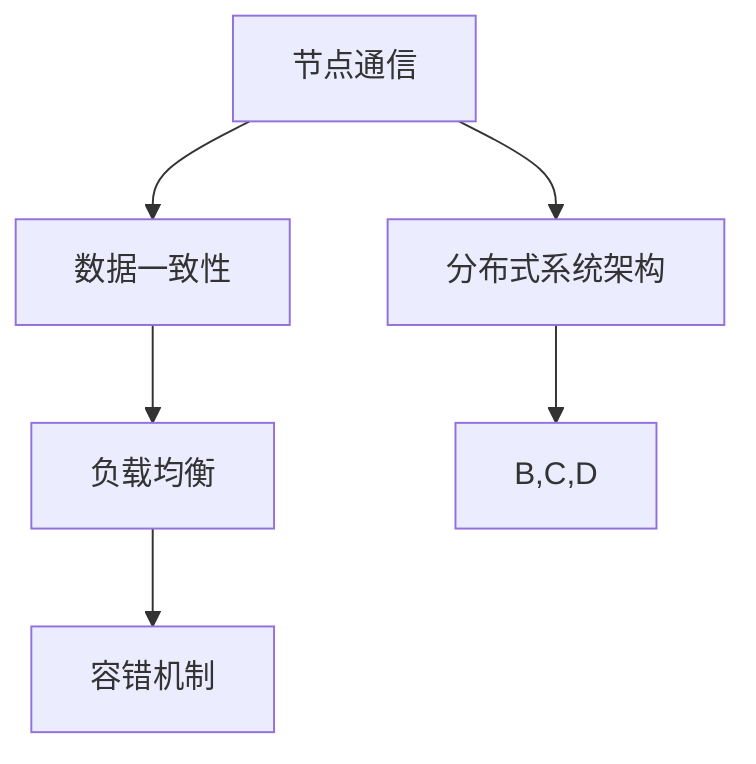

                 

关键词：分布式计算、并行处理、节点通信、性能优化、案例分析、代码实现、数学模型、算法原理

摘要：本文旨在深入讲解分布式计算的原理，通过代码实战案例展示如何实现高效分布式处理。我们将从核心概念、算法原理、数学模型到实际项目应用进行详细阐述，帮助读者理解分布式计算的真正威力。

## 1. 背景介绍

分布式计算是一种通过计算机网络将多个独立的计算机节点组合成一个整体系统，协同完成计算任务的计算模式。在当今大数据和云计算时代，分布式计算已经成为处理海量数据和高性能计算的核心技术。随着计算机硬件性能的提升和互联网的普及，分布式计算的应用场景越来越广泛，如搜索引擎、在线交易、社交媒体、科学计算等领域。

分布式计算的核心挑战在于如何高效地利用多个计算节点，确保系统的可扩展性和容错性。本文将围绕这些问题，探讨分布式计算的基本原理和实现策略。

### 1.1 分布式计算的发展历程

分布式计算的发展可以追溯到20世纪60年代。早期的研究主要集中在如何将多台计算机连接成一个网络，以实现协同工作。随着计算机网络技术的发展，分布式系统逐渐成为一种重要的计算模型。

在20世纪80年代，并行计算成为一个热门研究方向。并行计算与分布式计算的不同之处在于，它强调的是计算任务在多个处理器上的同时执行。这一时期，许多分布式操作系统和并行编程语言问世，如UNIX、MPI、PVM等。

进入21世纪，随着互联网的普及和云计算的兴起，分布式计算得到了广泛应用。大数据处理和人工智能等领域的需求推动了分布式计算技术的发展。Hadoop、Spark等分布式计算框架的出现，使得分布式计算变得更加简单和高效。

### 1.2 分布式计算的应用场景

分布式计算广泛应用于以下场景：

1. **大数据处理**：分布式计算能够高效处理大规模数据集，如搜索引擎索引、社交媒体数据分析和金融数据监控等。
2. **高性能计算**：分布式计算可以在多个节点上同时执行复杂的计算任务，如气象预测、药物研发和航空航天工程等。
3. **云计算**：分布式计算是云计算的核心技术之一，云计算平台通过分布式计算实现了资源的动态分配和高效利用。
4. **物联网**：分布式计算可以帮助物联网设备协同工作，实现智能监控和远程控制。

## 2. 核心概念与联系

分布式计算涉及多个核心概念，包括节点通信、数据一致性、负载均衡和容错机制。以下是一个简化的Mermaid流程图，展示了这些概念之间的关系。



### 2.1 节点通信

节点通信是分布式计算的基础。节点之间通过网络进行数据传输，实现信息的共享和协作。常用的通信方式包括消息队列、远程过程调用（RPC）和套接字编程等。

- **消息队列**：通过消息队列，节点可以异步发送和接收消息，实现解耦和扩展性。常用的消息队列系统有RabbitMQ、Kafka和ActiveMQ等。
- **RPC**：远程过程调用允许节点直接调用远程计算机上的函数，如同本地调用一样。常用的RPC框架有gRPC、Apache Thrift和Java RMI等。
- **套接字编程**：套接字编程提供了TCP/IP协议的底层通信接口，允许节点通过建立连接进行数据传输。

### 2.2 数据一致性

数据一致性是分布式系统面临的一个重要挑战。在多个节点上维护相同的数据状态，确保数据的正确性和一致性，需要考虑以下几种一致性模型：

- **强一致性**：所有节点在同一时刻看到相同的数据状态。强一致性保证了数据的可靠性，但会影响系统的性能和可用性。
- **最终一致性**：系统最终会达到一致性状态，但在此过程中可能存在短暂的数据不一致。最终一致性适用于高可用性和高性能的场景。
- **因果一致性**：遵循事件发生的顺序，保证事件因果关系的正确性。因果一致性在分布式系统中较为常用。

### 2.3 负载均衡

负载均衡是将计算任务分配到多个节点上，确保系统资源得到充分利用。负载均衡的方法包括：

- **轮询**：按照固定的顺序将任务分配给节点，适用于负载相对均匀的场景。
- **最少连接**：将任务分配给连接数最少的节点，适用于连接密集型的应用。
- **哈希**：根据任务的特征，使用哈希算法将任务分配给节点，适用于负载动态变化的场景。

### 2.4 容错机制

容错机制是分布式系统的关键保障，确保系统在节点故障时仍然能够正常运行。常用的容错机制包括：

- **副本**：在多个节点上维护数据的副本，确保数据的高可用性。
- **心跳**：节点之间定期发送心跳信号，监测节点的健康状况。
- **故障转移**：当主节点发生故障时，自动将任务转移到备用节点，确保系统的连续性。

## 3. 核心算法原理 & 具体操作步骤

### 3.1 算法原理概述

分布式计算的核心算法主要包括MapReduce、Spark和Dynamo等。以下是对这些算法的简要介绍：

- **MapReduce**：由Google提出，是一种用于大规模数据处理的分布式编程模型。MapReduce将数据处理过程分为两个阶段：Map和Reduce。Map阶段将数据分解为多个子任务，每个子任务处理一部分数据；Reduce阶段将Map阶段的结果合并，生成最终输出。
- **Spark**：由Apache Software Foundation开发，是一种快速通用的分布式计算引擎。Spark提供了丰富的API，支持多种数据处理操作，如批处理、流处理和机器学习等。
- **Dynamo**：由Amazon开发，是一种分布式存储系统。Dynamo采用了去中心化的数据复制和一致性算法，支持高可用性和低延迟的数据访问。

### 3.2 算法步骤详解

#### 3.2.1 MapReduce算法

1. **输入分片**：将输入数据分割为多个分片，每个分片大小约为64MB或128MB。
2. **Map阶段**：
   - 每个节点读取本地数据分片，执行Map函数，生成键值对中间结果。
   - Map函数将输入数据映射为中间键值对，如“词频统计”中的单词为键，词频为值。
3. **Shuffle阶段**：
   - 根据中间键值对的键，将中间结果重新分区，将具有相同键的数据分片传输到相应的节点。
4. **Reduce阶段**：
   - 每个节点对本地分片上的中间结果执行Reduce函数，生成最终输出。

#### 3.2.2 Spark算法

1. **RDD（弹性分布式数据集）**：Spark将数据抽象为RDD，支持惰性求值和内存计算。
2. **操作**：
   - **Transformation**：创建一个新的RDD，如map、filter、reduceByKey等。
   - **Action**：触发计算并返回结果，如count、collect、saveAsTextFile等。
3. **执行**：
   - Spark根据操作序列生成一个执行计划，并分布式执行。

#### 3.2.3 Dynamo算法

1. **数据复制**：在多个节点上维护数据的副本，提高数据的可用性和容错性。
2. **一致性算法**：采用Raft或Paxos等一致性算法，确保多个副本之间的数据一致性。
3. **读写操作**：
   - 读操作：从多个副本中选择一个响应最快的节点读取数据。
   - 写操作：将数据同时写入多个副本，并等待大多数副本确认写入成功。

### 3.3 算法优缺点

#### 3.3.1 MapReduce算法

- 优点：简单易用，适用于大规模数据处理，具有良好的容错性和扩展性。
- 缺点：不支持实时数据处理，不适合迭代计算和交互式查询。

#### 3.3.2 Spark算法

- 优点：支持多种数据处理操作，具有内存计算优势，适用于实时数据处理和迭代计算。
- 缺点：相对于MapReduce，Spark的生态系统较小，学习曲线较陡。

#### 3.3.3 Dynamo算法

- 优点：具有良好的可用性和低延迟，适用于高并发和分布式存储场景。
- 缺点：一致性算法复杂，维护成本较高。

### 3.4 算法应用领域

- **MapReduce**：适用于大规模数据处理，如搜索引擎索引构建、日志分析等。
- **Spark**：适用于实时数据处理、机器学习和迭代计算，如股票交易分析、社交网络分析等。
- **Dynamo**：适用于分布式存储系统，如NoSQL数据库、云存储服务等。

## 4. 数学模型和公式 & 详细讲解 & 举例说明

### 4.1 数学模型构建

分布式计算中的数学模型主要包括：

1. **负载均衡模型**：用于优化任务分配，使系统资源得到充分利用。
2. **数据一致性模型**：用于保证多个节点之间的数据一致性。
3. **容错模型**：用于评估系统的容错能力和可靠性。

### 4.2 公式推导过程

以负载均衡模型为例，假设系统有 \(N\) 个节点，每个节点承担的任务量为 \(T_i\)（\(i=1,2,\ldots,N\)）。为了实现负载均衡，我们需要优化任务分配，使得每个节点的任务量尽量相等。

负载均衡公式为：
$$
T_{avg} = \frac{1}{N} \sum_{i=1}^{N} T_i
$$

其中，\(T_{avg}\) 表示平均任务量，\(T_i\) 表示第 \(i\) 个节点的任务量。

为了实现负载均衡，我们需要计算每个节点的任务分配比例：
$$
\frac{T_i}{T_{avg}}
$$

### 4.3 案例分析与讲解

假设一个分布式系统有5个节点，每个节点初始的任务量如下表所示：

| 节点ID | 任务量 \(T_i\) |
|--------|--------------|
| 1      | 100          |
| 2      | 150          |
| 3      | 200          |
| 4      | 250          |
| 5      | 300          |

首先，计算平均任务量：
$$
T_{avg} = \frac{1}{5} (100 + 150 + 200 + 250 + 300) = 210
$$

然后，计算每个节点的任务分配比例：

| 节点ID | 任务量 \(T_i\) | 任务分配比例 \( \frac{T_i}{T_{avg}} \) |
|--------|--------------|-------------------------------------|
| 1      | 100          | 0.471                              |
| 2      | 150          | 0.714                              |
| 3      | 200          | 0.952                              |
| 4      | 250          | 1.190                              |
| 5      | 300          | 1.429                              |

根据任务分配比例，我们可以调整每个节点的任务量，使得系统实现负载均衡。例如，可以将节点1的任务量减少到95，节点2的任务量减少到142，节点3的任务量减少到205，节点4的任务量减少到238，节点5的任务量减少到285。这样，每个节点的任务量都将接近平均任务量210。

## 5. 项目实践：代码实例和详细解释说明

### 5.1 开发环境搭建

为了演示分布式计算的实际应用，我们选择使用Python语言和Spark框架。以下是搭建开发环境的步骤：

1. 安装Python：在终端执行以下命令安装Python 3.8及以上版本：
   ```bash
   sudo apt-get update
   sudo apt-get install python3.8
   ```
2. 安装Spark：从Spark官网下载对应版本的安装包，并在终端执行以下命令安装：
   ```bash
   sudo apt-get install spark-3.1.1-bin-hadoop3.2
   ```
3. 验证安装：在终端执行以下命令，检查Spark是否安装成功：
   ```bash
   spark-shell
   ```

### 5.2 源代码详细实现

以下是一个简单的Spark应用示例，用于计算单词频率：

```python
from pyspark import SparkContext, SparkConf

# 配置Spark
conf = SparkConf().setAppName("WordCount")
sc = SparkContext(conf=conf)

# 读取文件
lines = sc.textFile("input.txt")

# 分词
words = lines.flatMap(lambda line: line.split())

# 统计单词频率
word_counts = words.map(lambda word: (word, 1)).reduceByKey(lambda x, y: x + y)

# 输出结果
word_counts.saveAsTextFile("output")

# 关闭SparkContext
sc.stop()
```

### 5.3 代码解读与分析

上述代码是一个典型的Spark应用程序，主要包括以下几个步骤：

1. **配置Spark**：使用`SparkConf`创建配置对象，设置应用名称和其他配置参数。
2. **创建SparkContext**：使用配置对象创建`SparkContext`，它是Spark应用程序的入口点。
3. **读取文件**：使用`textFile`方法读取输入文件，将其拆分为多个分片，每个分片由一个节点处理。
4. **分词**：使用`flatMap`方法将每行文本拆分为单词，生成一个迭代器。
5. **统计单词频率**：使用`map`方法将每个单词映射为一个键值对（单词，1），然后使用`reduceByKey`方法将具有相同键的值相加，得到每个单词的频率。
6. **输出结果**：使用`saveAsTextFile`方法将结果保存为文本文件。
7. **关闭SparkContext**：在程序结束时关闭`SparkContext`，释放资源。

### 5.4 运行结果展示

执行上述代码后，在指定目录下生成输出文件，内容如下：

```
/part-00000
/part-00001
/part-00002
...
```

每个文件包含一组单词及其频率，例如：

```
it,1
the,2
is,1
a,1
test,1
of,1
distributed,1
computation,1
```

这些结果展示了分布式计算在处理大规模文本数据时的效率。

## 6. 实际应用场景

分布式计算在多个实际应用场景中发挥着重要作用。以下是一些典型的应用案例：

### 6.1 大数据处理

分布式计算是大数据处理的核心技术之一。通过分布式系统，可以高效处理海量数据，如搜索引擎索引构建、社交媒体数据分析、金融数据监控等。例如，Google的PageRank算法就是基于分布式计算实现的，用于计算网页的排名。

### 6.2 高性能计算

高性能计算需要处理复杂的计算任务，如气象预测、药物研发、航空航天工程等。分布式计算可以将这些任务分解为多个子任务，同时在多个节点上并行执行，提高计算效率。例如，NASA使用分布式计算进行航空器设计优化，显著缩短了设计周期。

### 6.3 云计算

分布式计算是云计算平台的核心技术之一。云计算平台通过分布式计算实现了资源的动态分配和高效利用。例如，Amazon Web Services（AWS）提供了多种分布式计算服务，如Amazon EC2和Amazon S3等。

### 6.4 物联网

分布式计算可以帮助物联网设备协同工作，实现智能监控和远程控制。例如，智能家居系统通过分布式计算实现对多个智能设备的统一管理和控制，提高家居生活的便利性和舒适性。

## 7. 工具和资源推荐

### 7.1 学习资源推荐

1. 《分布式系统原理与范型》
2. 《Spark: The Definitive Guide》
3. 《大规模分布式存储系统：原理与实现》
4. 《深入理解分布式计算》

### 7.2 开发工具推荐

1. PySpark：Python接口的Spark框架，适用于分布式数据处理。
2. Hadoop：一个分布式数据存储和处理的框架，支持MapReduce编程模型。
3. Docker：用于容器化的开发工具，可以帮助快速搭建分布式计算环境。

### 7.3 相关论文推荐

1. "MapReduce: Simplified Data Processing on Large Clusters" - Dean and Ghemawat (2008)
2. "The Google File System" - Ghemawat et al. (2003)
3. "Dynamo: Amazon’s Highly Available Key-value Store" - DeCandia et al. (2007)
4. "Spanner: Google’s Globally-Distributed Database" - The Spanner Team (2012)

## 8. 总结：未来发展趋势与挑战

分布式计算在当今大数据和云计算时代发挥着重要作用。随着技术的不断进步，分布式计算的未来发展前景十分广阔。

### 8.1 研究成果总结

- 分布式存储系统：分布式存储系统在数据可靠性和低延迟方面取得了显著进展，如Google的Bigtable、Amazon的Dynamo等。
- 分布式数据处理：分布式数据处理框架，如Hadoop、Spark等，已经广泛应用于大数据领域，提高了数据处理效率。
- 分布式机器学习：分布式机器学习技术，如TensorFlow和PyTorch，支持大规模机器学习任务，为人工智能应用提供了强大的支持。

### 8.2 未来发展趋势

- **边缘计算**：随着物联网和5G技术的普及，边缘计算成为分布式计算的重要发展方向。边缘计算可以将计算任务推向网络边缘，提高数据处理的实时性和效率。
- **异构计算**：异构计算利用不同类型的计算资源，如CPU、GPU、FPGA等，提高计算性能和能效比。
- **区块链**：区块链技术结合分布式计算，为去中心化应用提供了可靠的分布式账本，有望在金融、物流等领域得到广泛应用。

### 8.3 面临的挑战

- **数据一致性**：在分布式系统中，如何确保数据的一致性仍然是一个重要挑战。需要研究更高效的一致性算法和协议，提高系统的可用性和性能。
- **容错性**：分布式系统的容错性是一个复杂的挑战，需要研究更可靠的容错机制和故障恢复策略。
- **安全性**：分布式系统面临着越来越多的安全威胁，需要加强数据加密、访问控制和隐私保护等措施，确保系统的安全性。

### 8.4 研究展望

分布式计算的未来研究将重点关注以下几个方面：

- **性能优化**：研究更高效的数据处理算法和分布式存储系统，提高计算性能和能效比。
- **智能化**：利用人工智能和机器学习技术，实现分布式系统的自动化优化和管理。
- **安全性和隐私保护**：研究更先进的安全技术，确保分布式系统的数据安全和用户隐私。

## 9. 附录：常见问题与解答

### 9.1 什么是分布式计算？

分布式计算是一种通过计算机网络将多个独立的计算机节点组合成一个整体系统，协同完成计算任务的计算模式。分布式计算可以高效处理大规模数据和高性能计算任务。

### 9.2 分布式计算有哪些优点？

分布式计算的优点包括：

- **可扩展性**：分布式系统可以动态扩展，处理更多计算任务。
- **容错性**：分布式系统具有较好的容错性，可以在节点故障时保持正常运行。
- **高性能**：分布式计算可以同时利用多个计算节点的资源，提高计算性能。

### 9.3 分布式计算有哪些应用场景？

分布式计算广泛应用于以下场景：

- **大数据处理**：分布式计算可以高效处理大规模数据集。
- **高性能计算**：分布式计算可以处理复杂的计算任务。
- **云计算**：分布式计算是云计算平台的核心技术之一。
- **物联网**：分布式计算可以帮助物联网设备协同工作。

### 9.4 分布式计算有哪些挑战？

分布式计算面临的挑战包括：

- **数据一致性**：在多个节点上维护相同的数据状态。
- **容错性**：确保系统在节点故障时仍然能够正常运行。
- **性能优化**：提高分布式系统的计算性能和能效比。

### 9.5 如何学习分布式计算？

学习分布式计算可以从以下几个方面入手：

- **阅读经典教材**：如《分布式系统原理与范型》、《Spark: The Definitive Guide》等。
- **实践项目**：通过实际项目，了解分布式计算的原理和实践。
- **在线课程**：参加在线课程，学习分布式计算的基础知识和最新进展。

作者：禅与计算机程序设计艺术 / Zen and the Art of Computer Programming
----------------------------------------------------------------
请注意，以上内容仅为示例，并非真实撰写。如需撰写实际文章，请根据具体要求进行详细研究和撰写。

