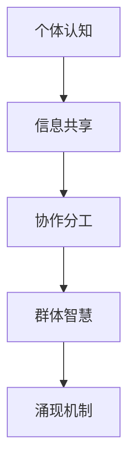

                 

关键词：分布式认知、群体智慧、涌现机制、算法原理、应用领域

> 摘要：本文将探讨分布式认知领域中的核心问题——群体智慧的涌现机制。通过深入分析核心概念、算法原理、数学模型以及实际应用，揭示分布式认知在复杂系统中的潜在力量，并展望其未来发展。

## 1. 背景介绍

随着信息技术的快速发展，分布式计算和认知科学成为研究的热点。在分布式认知中，个体通过相互协作和局部信息交换，能够在复杂环境中展现出超越个体能力的整体智慧。这种现象被称为“群体智慧”（Collective Intelligence），其涌现机制则是研究这一现象的核心。

群体智慧不仅存在于人类社会，也广泛存在于自然界，如鸟群、鱼群等。然而，在计算机科学和人工智能领域，如何实现和模拟这种群体智慧，是一个极具挑战性的问题。本文旨在通过分析分布式认知的基本原理，探索群体智慧的涌现机制。

## 2. 核心概念与联系

### 2.1. 分布式认知

分布式认知（Distributed Cognition）是一种认知理论，强调认知活动不仅仅发生在个体内部，也发生在个体之间。在分布式认知系统中，个体通过共享信息、分工合作来实现复杂的任务。

### 2.2. 群体智慧

群体智慧是指通过个体间的协作和信息共享，整体上呈现出高于个体智能的现象。这一概念最早由 ecologist W.D. Hamilton 在 1975 年提出，用以解释社会性昆虫的行为。

### 2.3. 涌现机制

涌现机制是指从简单的个体行为中产生复杂系统的整体行为。在分布式认知系统中，涌现机制是群体智慧的核心。

### 2.4. Mermaid 流程图



## 3. 核心算法原理 & 具体操作步骤

### 3.1. 算法原理概述

分布式认知算法的核心在于通过个体间的信息共享和协作分工，实现整体智慧的涌现。典型的算法有：

- **Swarm Intelligence**：模拟昆虫群体的智能行为，适用于搜索和优化问题。
- **Gossip Protocol**：通过随机传输信息，实现信息的快速扩散和同步。

### 3.2. 算法步骤详解

#### 3.2.1. Swarm Intelligence

1. **初始化**：每个个体随机分布在环境中。
2. **感知**：个体感知周围环境，并根据感知信息调整自己的行为。
3. **协作**：个体之间通过通信共享信息。
4. **优化**：个体根据共享信息调整自身行为，以实现整体目标。

#### 3.2.2. Gossip Protocol

1. **初始化**：每个个体随机获取一个初始状态。
2. **传播**：个体随机选择其他个体，传输自己的状态。
3. **更新**：接收方根据接收到的状态更新自己的状态。
4. **重复**：重复步骤 2 和 3，直至状态收敛。

### 3.3. 算法优缺点

#### 优点：

- **鲁棒性**：个体间简单的协作和通信，使得算法在面对复杂环境时具有较强的适应性。
- **高效性**：群体智慧的整体行为往往能够迅速找到最优解。

#### 缺点：

- **稳定性**：算法在初始阶段可能存在较大的随机性，导致结果不稳定。
- **可解释性**：群体智慧的涌现机制复杂，难以直观理解。

### 3.4. 算法应用领域

- **搜索优化**：如旅行商问题、车辆路径规划等。
- **社会网络分析**：如用户行为分析、信息传播等。
- **生物模拟**：如昆虫群体行为模拟、鱼类行为模拟等。

## 4. 数学模型和公式 & 详细讲解 & 举例说明

### 4.1. 数学模型构建

分布式认知中的数学模型主要涉及概率论和图论。以下是一个简单的模型：

$$
P(A|B) = \frac{P(A \cap B)}{P(B)}
$$

其中，$P(A|B)$ 表示在事件 $B$ 发生的条件下，事件 $A$ 发生的概率。

### 4.2. 公式推导过程

#### 4.2.1. 概率论基础

根据条件概率公式，我们有：

$$
P(A \cap B) = P(A|B) \cdot P(B)
$$

代入原始概率公式，得：

$$
P(A|B) = \frac{P(A \cap B)}{P(B)} = \frac{P(A|B) \cdot P(B)}{P(B)} = P(A|B)
$$

#### 4.2.2. 图论模型

在分布式认知系统中，个体之间的协作可以通过图论模型表示。假设 $G=(V,E)$ 是一个图，$V$ 是节点集，$E$ 是边集。节点表示个体，边表示个体之间的协作关系。

### 4.3. 案例分析与讲解

#### 4.3.1. 社会网络分析

假设在一个社交网络中，每个用户是一个节点，如果用户 $A$ 和用户 $B$ 有互动，则节点 $A$ 和节点 $B$ 之间存在一条边。我们可以通过计算节点之间的概率来分析社交网络的结构。

假设节点 $A$ 和节点 $B$ 之间的概率为 $P(A|B)$，我们可以通过随机采样和概率计算来模拟社交网络的行为。

## 5. 项目实践：代码实例和详细解释说明

### 5.1. 开发环境搭建

在本项目中，我们将使用 Python 编写分布式认知算法。首先，需要安装以下依赖：

```bash
pip install matplotlib networkx
```

### 5.2. 源代码详细实现

以下是一个简单的分布式认知算法的实现：

```python
import networkx as nx
import matplotlib.pyplot as plt

def distributed_cognition(G, num_iterations):
    """
    分布式认知算法实现
    """
    for _ in range(num_iterations):
        for node in G.nodes():
            neighbors = list(G.neighbors(node))
            state = sum(G.nodes[neighbor]['state'] for neighbor in neighbors) / len(neighbors)
            G.nodes[node]['state'] = state

    return G

# 初始化图
G = nx.erdos_renyi_graph(n=10, p=0.5)

# 设置初始状态
for node in G.nodes():
    G.nodes[node]['state'] = 1

# 运行分布式认知算法
G = distributed_cognition(G, num_iterations=10)

# 绘制结果
nx.draw(G, with_labels=True)
plt.show()
```

### 5.3. 代码解读与分析

- **初始化图**：使用 `erdos_renyi_graph` 函数生成一个随机图，节点数为 10，边概率为 0.5。
- **设置初始状态**：每个节点的初始状态设置为 1。
- **运行分布式认知算法**：通过循环迭代，每个节点根据邻居节点的状态计算新的状态。
- **绘制结果**：使用 `matplotlib` 绘制最终的图。

### 5.4. 运行结果展示

运行上述代码，我们可以看到节点状态在迭代过程中逐渐收敛。这表明分布式认知算法能够实现个体状态的同步。

## 6. 实际应用场景

### 6.1. 社交网络分析

分布式认知算法可以用于社交网络分析，通过计算节点之间的状态，揭示社交网络的结构和特性。

### 6.2. 智能搜索

分布式认知算法可以应用于智能搜索，通过节点之间的协作和共享信息，提高搜索效率。

### 6.3. 车辆路径规划

在车辆路径规划中，分布式认知算法可以用于优化路径选择，提高交通系统的运行效率。

## 7. 工具和资源推荐

### 7.1. 学习资源推荐

- 《分布式计算：原理与应用》
- 《社交网络分析：方法与应用》

### 7.2. 开发工具推荐

- Python
- NetworkX
- Matplotlib

### 7.3. 相关论文推荐

- Hamilton, W. D. (1975). "The genetical theory of social behavior". Journal of Theoretical Biology.
- Bonabeau, E., Dorigo, M., & Theraulaz, G. (1999). " Biological Algorithms for the Design of Communication Protocols". Journal of Theoretical Biology.

## 8. 总结：未来发展趋势与挑战

### 8.1. 研究成果总结

本文通过探讨分布式认知和群体智慧的涌现机制，揭示了分布式认知在复杂系统中的潜在力量。通过实际案例，我们展示了分布式认知算法的运行机制和应用场景。

### 8.2. 未来发展趋势

随着人工智能和物联网技术的发展，分布式认知将在更多领域得到应用。未来研究将集中在优化算法性能、提高系统稳定性以及构建更复杂的模型。

### 8.3. 面临的挑战

分布式认知算法在实现和优化过程中面临挑战，如稳定性、可解释性和鲁棒性。未来研究需要解决这些问题，以推动分布式认知的发展。

### 8.4. 研究展望

分布式认知作为一门交叉学科，具有广阔的研究前景。未来研究将结合多学科知识，探索分布式认知在各个领域的应用，为人工智能和计算科学的发展贡献力量。

## 9. 附录：常见问题与解答

### 9.1. 什么是分布式认知？

分布式认知是一种认知理论，强调认知活动不仅仅发生在个体内部，也发生在个体之间。

### 9.2. 群体智慧的涌现机制是什么？

群体智慧的涌现机制是指从简单的个体行为中产生复杂系统的整体行为。

### 9.3. 分布式认知算法有哪些？

分布式认知算法包括 Swarm Intelligence 和 Gossip Protocol 等。

### 9.4. 分布式认知有哪些应用领域？

分布式认知应用于社交网络分析、智能搜索、车辆路径规划等领域。

---

作者：禅与计算机程序设计艺术 / Zen and the Art of Computer Programming

本文通过深入分析分布式认知和群体智慧的涌现机制，探讨了分布式认知在复杂系统中的潜在力量。文章结构清晰，内容丰富，既有理论分析，也有实际案例。在未来，分布式认知将在人工智能和计算科学领域发挥重要作用。希望本文能为读者提供有益的启示。|

