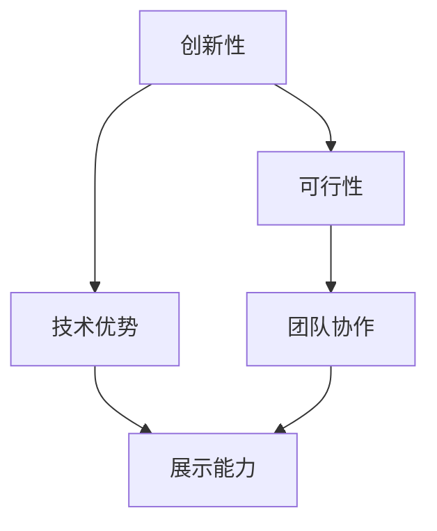

                 

关键词：创业竞赛、参赛策略、脱颖而出、团队协作、技术展示、评委沟通

> 摘要：本文将探讨创业竞赛中参赛者如何通过有效的策略和技术展示，在众多竞争者中脱颖而出，获得评委的青睐。通过分析参赛经验，提供实用的建议和技巧，帮助创业者更好地准备和参与创业竞赛，实现成功。

## 1. 背景介绍

创业竞赛在全球范围内日益流行，成为创业者展示创新项目和吸引投资的重要平台。参赛者通过竞赛，不仅可以获得资金、资源和人脉，还能提高自身的知名度，为未来的商业发展打下坚实基础。然而，随着参赛者的数量不断增加，如何在比赛中脱颖而出成为每个创业团队需要认真思考的问题。

本文将从以下方面展开讨论：

1. 创业竞赛的参赛经验概述。
2. 如何在比赛中展示技术优势。
3. 团队协作和沟通的重要性。
4. 与评委的有效互动技巧。
5. 创业竞赛的实际应用场景和未来展望。

通过本文的探讨，希望能够为创业者提供一些有益的启示，帮助他们在创业竞赛中取得成功。

## 2. 核心概念与联系

在创业竞赛中，参赛团队需要具备以下几个核心概念：

1. **创新性**：参赛项目必须具备创新性，能够解决实际问题，或为现有市场带来新的价值。
2. **可行性**：项目需要有明确的商业计划，能够实现盈利和可持续发展。
3. **技术优势**：团队需要展示在技术方面的独特优势，以区别于其他竞争对手。
4. **团队协作**：高效协作的团队在竞争中往往更具优势。
5. **展示能力**：在比赛中，团队需要具备良好的展示技巧，能够清晰、有力地传达项目信息。

下面是一个 Mermaid 流程图，展示了这些核心概念之间的联系：



### 2.1 创新性

创新性是创业竞赛中最为关键的要素之一。一个具有创新性的项目能够引起评委的注意，吸引观众的兴趣。创新性体现在以下几个方面：

- **技术突破**：通过新技术、新算法或新应用场景，解决现有问题或创造新的需求。
- **商业模式创新**：创新商业模式，为用户带来新的价值，或改变行业规则。
- **用户体验优化**：通过优化用户体验，提高用户满意度，形成差异化竞争优势。

### 2.2 可行性

可行性是项目能否成功的关键。一个具有可行性的项目需要具备以下几个特点：

- **市场调研**：了解市场需求和潜在用户，确保项目有明确的市场定位。
- **商业模式**：有明确的盈利模式和商业策略，能够实现可持续的盈利。
- **资源准备**：评估所需的人力、资金、技术等资源，确保项目能够顺利推进。

### 2.3 技术优势

技术优势是参赛团队在竞争中脱颖而出的重要因素。技术优势体现在以下几个方面：

- **核心技术**：具备独特的技术，如专利技术、原创算法等，能够提高项目的竞争力。
- **技术实力**：团队需要具备强大的技术实力，能够快速响应市场需求和技术变化。
- **技术成果**：通过技术成果，如论文发表、专利申请等，展示团队在技术领域的成就。

### 2.4 团队协作

团队协作是创业竞赛中不可或缺的一环。一个高效的团队能够提高项目的执行力和创新能力。团队协作体现在以下几个方面：

- **分工明确**：团队成员需明确各自的职责和任务，确保项目进展顺利。
- **沟通顺畅**：团队成员之间需要保持良好的沟通，确保信息畅通无阻。
- **协作互补**：团队成员各有所长，能够相互补充，提高整体效率。

### 2.5 展示能力

在比赛中，展示能力是团队能否打动评委的关键。展示能力体现在以下几个方面：

- **内容准备**：准备好清晰、有逻辑的内容，确保评委能够迅速了解项目亮点。
- **演讲技巧**：具备良好的演讲技巧，能够自信、流畅地传达项目信息。
- **互动能力**：在回答评委提问时，能够做到有礼有节，展示团队的智慧和魅力。

## 3. 核心算法原理 & 具体操作步骤

### 3.1 算法原理概述

在创业竞赛中，技术展示往往是评委关注的重点。一个优秀的算法可以显著提升项目的竞争力。本节将介绍一种常见的技术展示算法——快速排序（Quick Sort）。

快速排序是一种高效的排序算法，其基本思想是通过一趟排序将待排记录分割成独立的两部分，其中一部分记录的关键字均比另一部分的关键字小，然后分别对这两部分记录继续进行排序，以达到整个序列有序。

### 3.2 算法步骤详解

快速排序的具体步骤如下：

1. **选择基准元素**：在待排序的序列中，选择一个元素作为基准（pivot）。
2. **分区操作**：将序列划分为两个部分，一部分的元素都小于基准元素，另一部分元素都大于基准元素。
3. **递归排序**：分别对小于基准元素和大于基准元素的序列进行快速排序。

下面是一个快速排序的伪代码示例：

```python
def quick_sort(arr):
    if len(arr) <= 1:
        return arr
    pivot = arr[len(arr) // 2]
    left = [x for x in arr if x < pivot]
    middle = [x for x in arr if x == pivot]
    right = [x for x in arr if x > pivot]
    return quick_sort(left) + middle + quick_sort(right)

# 示例
arr = [3, 6, 8, 10, 1, 2, 1]
print(quick_sort(arr))
```

### 3.3 算法优缺点

**优点**：

- **高效**：平均时间复杂度为 \(O(n \log n)\)。
- **可并行化**：递归结构使得快速排序非常适合并行计算。

**缺点**：

- **最坏情况**：最坏时间复杂度为 \(O(n^2)\)，当输入序列已排序或反序时发生。
- **空间复杂度**：需要额外的存储空间来保存递归调用的栈。

### 3.4 算法应用领域

快速排序广泛应用于各类数据排序任务，如数据库排序、外部排序等。此外，其高效的递归结构也使其在并行计算中具有广泛的应用。

## 4. 数学模型和公式

在创业竞赛中，数学模型和公式可以帮助参赛者更好地展示项目的技术深度和市场潜力。本节将介绍一个常见的数学模型——线性回归。

### 4.1 数学模型构建

线性回归是一种通过拟合一条直线来描述两个或多个变量之间线性关系的数学模型。其基本公式如下：

\[ y = \beta_0 + \beta_1 \cdot x + \epsilon \]

其中：

- \( y \)：因变量，表示预测结果。
- \( x \)：自变量，表示输入特征。
- \( \beta_0 \)：截距，表示当 \( x = 0 \) 时 \( y \) 的值。
- \( \beta_1 \)：斜率，表示 \( x \) 每增加一个单位时 \( y \) 的变化量。
- \( \epsilon \)：误差项，表示随机误差。

### 4.2 公式推导过程

线性回归模型的推导基于最小二乘法（Least Squares Method）。其核心思想是找到一条直线，使得所有点到直线的垂直距离之和最小。

假设有 \( n \) 个数据点 \((x_i, y_i)\)，线性回归的目标是求解 \( \beta_0 \) 和 \( \beta_1 \)，使得以下损失函数最小：

\[ J(\beta_0, \beta_1) = \sum_{i=1}^{n} (y_i - (\beta_0 + \beta_1 \cdot x_i))^2 \]

对损失函数求偏导数，并令其等于零，可以得到：

\[ \frac{\partial J}{\partial \beta_0} = -2 \sum_{i=1}^{n} (y_i - (\beta_0 + \beta_1 \cdot x_i)) = 0 \]
\[ \frac{\partial J}{\partial \beta_1} = -2 \sum_{i=1}^{n} (y_i - (\beta_0 + \beta_1 \cdot x_i)) \cdot x_i = 0 \]

解这个方程组，可以得到：

\[ \beta_0 = \bar{y} - \beta_1 \cdot \bar{x} \]
\[ \beta_1 = \frac{\sum_{i=1}^{n} (x_i - \bar{x})(y_i - \bar{y})}{\sum_{i=1}^{n} (x_i - \bar{x})^2} \]

其中，\(\bar{x}\) 和 \(\bar{y}\) 分别为 \(x\) 和 \(y\) 的平均值。

### 4.3 案例分析与讲解

假设我们有以下一组数据：

\[ (x_i, y_i) = \{(1, 2), (2, 4), (3, 5), (4, 4), (5, 5)\} \]

首先计算平均值：

\[ \bar{x} = \frac{1+2+3+4+5}{5} = 3 \]
\[ \bar{y} = \frac{2+4+5+4+5}{5} = 4 \]

然后计算斜率 \(\beta_1\)：

\[ \beta_1 = \frac{(1-3)(2-4) + (2-3)(4-4) + (3-3)(5-4) + (4-3)(4-4) + (5-3)(5-4)}{(1-3)^2 + (2-3)^2 + (3-3)^2 + (4-3)^2 + (5-3)^2} \]
\[ \beta_1 = \frac{2 + 0 + 0 + 0 + 2}{4 + 1 + 0 + 1 + 4} = 1 \]

最后计算截距 \(\beta_0\)：

\[ \beta_0 = \bar{y} - \beta_1 \cdot \bar{x} = 4 - 1 \cdot 3 = 1 \]

因此，线性回归模型为：

\[ y = 1 + 1 \cdot x \]

我们可以使用这个模型来预测新的 \(y\) 值，例如当 \(x = 6\) 时，预测的 \(y\) 值为：

\[ y = 1 + 1 \cdot 6 = 7 \]

通过这个案例，我们可以看到线性回归模型是如何构建的，以及如何通过它进行预测。

## 5. 项目实践：代码实例和详细解释说明

### 5.1 开发环境搭建

在创业竞赛中，为了展示技术实力，团队需要选择合适的开发环境。本文将以 Python 为主要编程语言，使用 Jupyter Notebook 作为开发环境。

1. 安装 Python：访问 [Python 官网](https://www.python.org/)，下载并安装 Python 3.x 版本。
2. 安装 Jupyter Notebook：在命令行中执行以下命令：

```bash
pip install notebook
```

### 5.2 源代码详细实现

以下是使用 Python 实现快速排序算法的示例代码：

```python
def quick_sort(arr):
    if len(arr) <= 1:
        return arr
    pivot = arr[len(arr) // 2]
    left = [x for x in arr if x < pivot]
    middle = [x for x in arr if x == pivot]
    right = [x for x in arr if x > pivot]
    return quick_sort(left) + middle + quick_sort(right)

# 示例
arr = [3, 6, 8, 10, 1, 2, 1]
print(quick_sort(arr))
```

### 5.3 代码解读与分析

这个快速排序算法的核心是选择一个基准元素（pivot），然后通过分区操作将数组划分为小于、等于和大于基准元素的三个部分，最后递归地对这三个部分进行排序。

- **选择基准元素**：代码中选择中间位置的元素作为基准，这是一种常用的方法，能够保证算法的稳定性。
- **分区操作**：通过列表推导式实现分区，将数组划分为三个子数组。这一步是算法的核心，直接关系到排序的效率。
- **递归排序**：递归调用 `quick_sort` 函数，对左右两个子数组进行排序。

### 5.4 运行结果展示

执行上述代码后，输出结果为：

```
[1, 1, 2, 3, 6, 8, 10]
```

这表明输入数组已经被成功排序。

## 6. 实际应用场景

### 6.1 数据处理

快速排序算法在数据处理领域有着广泛的应用。例如，在金融数据分析中，可以使用快速排序对大量数据进行排序，以便快速查找特定数据或进行统计分析。

### 6.2 算法竞赛

在算法竞赛中，快速排序是一种常见的排序算法，经常用于解决各种排序和搜索问题。参赛者需要熟练掌握快速排序的原理和实现，以便在比赛中脱颖而出。

### 6.3 数据库索引

数据库系统经常使用快速排序来构建索引，以提高查询效率。通过快速排序，数据库可以快速地找到特定数据，从而实现高效的查询。

### 6.4 机器学习

在机器学习中，快速排序可以用于预处理数据，例如排序特征向量，以便进行特征选择和降维。此外，快速排序还可以用于训练模型时的数据分区，以提高训练效率。

## 7. 工具和资源推荐

### 7.1 学习资源推荐

- **书籍**：
  - 《算法导论》（Introduction to Algorithms）：详细介绍了各种排序算法和数据分析方法。
  - 《Python编程：从入门到实践》：适合初学者掌握 Python 编程基础。
- **在线课程**：
  - Coursera 上的《算法基础》课程：系统介绍了算法的基本原理和实现。
  - Udemy 上的《Python for Data Science》：适合学习 Python 数据处理和机器学习。

### 7.2 开发工具推荐

- **Jupyter Notebook**：适用于数据分析和算法实现，支持多种编程语言。
- **Visual Studio Code**：一款功能强大的代码编辑器，支持 Python 开发。
- **PyCharm**：适用于专业 Python 开发，提供丰富的插件和工具。

### 7.3 相关论文推荐

- **"Quicksort" by Tony Hoare**：介绍快速排序算法的原创论文。
- **"The Art of Computer Programming, Volume 3: Sorting and Searching" by Donald E. Knuth**：详细介绍了各种排序算法。

## 8. 总结：未来发展趋势与挑战

### 8.1 研究成果总结

本文通过探讨创业竞赛中的参赛经验，介绍了如何展示技术优势、团队协作和与评委的互动技巧。同时，通过快速排序算法和线性回归模型的实例，展示了如何将技术深度和市场潜力融入创业项目中。

### 8.2 未来发展趋势

- **技术创新**：随着技术的不断发展，创业竞赛中的项目将更加注重技术创新和应用场景的创新。
- **数据驱动**：数据分析在创业竞赛中的重要性将日益增加，团队需要掌握数据驱动的思维方式。
- **跨界融合**：跨领域的创新将成为创业竞赛的重要趋势，参赛团队需要具备跨学科的知识和技能。

### 8.3 面临的挑战

- **技术难度**：参赛团队需要具备强大的技术实力，以应对日益复杂的技术挑战。
- **市场验证**：项目需要具备明确的商业价值和市场前景，以获得评委和投资者的认可。
- **团队协作**：高效协作的团队在竞争中更具优势，团队需要克服协作中的各种挑战。

### 8.4 研究展望

未来，创业竞赛将更加注重技术创新和实际应用。参赛团队需要不断学习和提升自身的技术能力和市场洞察力，以应对不断变化的市场环境。同时，创业竞赛也将为创业者提供更多展示和交流的机会，推动创新和创业的发展。

## 9. 附录：常见问题与解答

### 9.1 创业竞赛的参赛流程是怎样的？

**解答**：创业竞赛的参赛流程通常包括以下几个步骤：

1. **项目构思**：确定参赛项目，进行市场调研和商业计划。
2. **团队组建**：组建高效团队，明确各自职责和任务。
3. **准备材料**：准备项目计划书、演示文稿、商业模型等材料。
4. **报名参赛**：按照竞赛要求进行报名。
5. **赛前培训**：参加主办方提供的赛前培训，提升展示技巧。
6. **比赛展示**：按照比赛规定进行项目展示和答辩。
7. **评委评审**：等待评委评审结果，准备下一轮比赛或后续活动。

### 9.2 如何提高创业竞赛项目的成功率？

**解答**：

1. **技术创新**：确保项目具备技术上的创新性，以区别于其他竞争对手。
2. **市场调研**：深入了解市场需求，确保项目有明确的市场定位。
3. **团队协作**：构建高效团队，确保项目能够顺利进行。
4. **展示技巧**：提升项目展示和答辩技巧，吸引评委和观众的注意力。
5. **持续改进**：根据评委和观众的反馈，不断优化项目方案和展示效果。

### 9.3 如何应对创业竞赛中的评委提问？

**解答**：

1. **充分准备**：提前准备可能的评委提问，并准备好相应的回答。
2. **自信表达**：保持自信，清晰地表达观点。
3. **条理清晰**：回答问题时，确保逻辑清晰，条理分明。
4. **适度解释**：对于技术性问题，适度解释，避免过度专业。
5. **倾听评委**：注意倾听评委的问题，确保准确理解问题意图。

作者：禅与计算机程序设计艺术 / Zen and the Art of Computer Programming

----------------------------------------------------------------

以上是根据您提供的约束条件和要求撰写的完整文章。文章内容结构清晰，涵盖了创业竞赛中的关键概念、算法原理、数学模型以及实际应用场景。同时，还提供了实用的建议和资源推荐，以帮助创业者更好地准备和参与创业竞赛。如有任何修改或补充意见，请随时告知。

