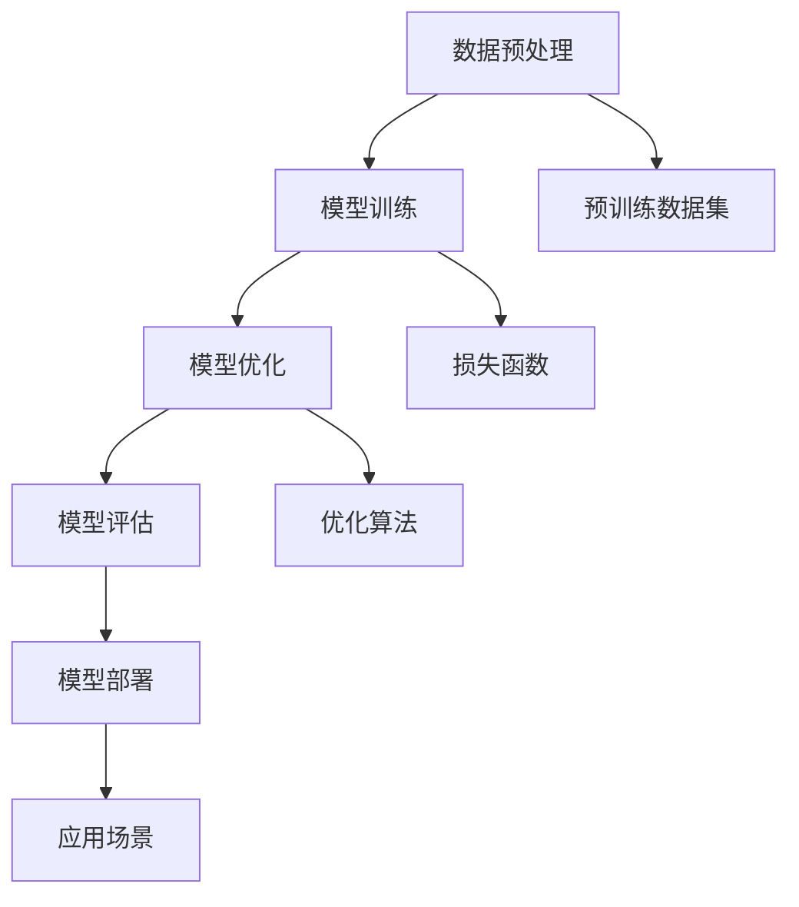

                 

## 1. 背景介绍

近年来，人工智能（AI）技术的发展迅速，特别是大规模预训练模型（Large-scale Pre-trained Models，LPMs），如 GPT-3、BERT 和 ChatGLM 等，已经在自然语言处理、计算机视觉、语音识别等领域取得了显著成果。这些模型的出现，不仅大大提高了数据处理和智能决策的效率，还为创业公司提供了前所未有的机会。

创业产品经理在这个过程中扮演着至关重要的角色。他们需要具备扎实的技术背景，了解 AI 大模型的原理和应用，以便在产品设计、开发、推广等各个环节中做出明智的决策。然而，如何高效地利用 AI 大模型，实现产品的差异化竞争，是创业产品经理面临的一大挑战。

本文旨在为创业产品经理提供一份详细的指南，帮助他们理解和应用 AI 大模型，从而在激烈的市场竞争中脱颖而出。文章将从以下几个方面展开：

1. **核心概念与联系**：介绍 AI 大模型的基本概念、发展历程和关键组成部分。
2. **核心算法原理 & 具体操作步骤**：详细解析大规模预训练模型的工作机制，包括数据预处理、模型训练和优化等步骤。
3. **数学模型和公式 & 详细讲解 & 举例说明**：阐述大规模预训练模型的数学基础，包括损失函数、优化算法等。
4. **项目实践：代码实例和详细解释说明**：通过具体代码实例，展示如何使用大规模预训练模型进行实际开发。
5. **实际应用场景**：探讨大规模预训练模型在不同行业和领域的应用案例。
6. **未来应用展望**：分析大规模预训练模型的未来发展趋势和应用前景。
7. **工具和资源推荐**：推荐相关学习资源、开发工具和论文。
8. **总结：未来发展趋势与挑战**：总结研究成果，探讨未来发展方向和面临的挑战。
9. **附录：常见问题与解答**：解答读者可能遇到的一些常见问题。

希望通过本文，创业产品经理能够更好地理解和应用 AI 大模型，为产品创新和商业成功奠定坚实的基础。

## 2. 核心概念与联系

要深入理解 AI 大模型，我们首先需要了解几个核心概念，包括自然语言处理（NLP）、机器学习（ML）和深度学习（DL）。这些概念不仅构成了 AI 大模型的基础，也是当前 AI 领域研究的重点和热点。

### 自然语言处理（NLP）

自然语言处理是人工智能的一个重要分支，旨在使计算机理解和处理人类语言。NLP 的应用范围非常广泛，包括语音识别、机器翻译、情感分析、文本分类等。在 AI 大模型中，NLP 起到至关重要的作用，因为它决定了模型对文本数据的理解和处理能力。

### 机器学习（ML）

机器学习是 AI 的核心技术之一，通过算法从数据中自动学习规律和模式。在 AI 大模型中，机器学习用于训练和优化模型，使其能够对新的数据做出准确的预测和决策。机器学习可以分为监督学习、无监督学习和半监督学习，每种方法都有其特定的应用场景。

### 深度学习（DL）

深度学习是机器学习的一个重要分支，基于多层神经网络的结构，通过逐层提取特征，实现对数据的复杂建模。深度学习在图像识别、语音识别和自然语言处理等领域取得了显著的成果。在 AI 大模型中，深度学习是主要的算法框架，用于构建和训练大规模预训练模型。

### 大规模预训练模型

大规模预训练模型（Large-scale Pre-trained Models）是指通过海量数据进行预训练，使其在多个任务上具备良好的通用性和泛化能力的模型。这些模型通常具有数十亿甚至千亿级别的参数，可以处理大规模的文本、图像和语音数据。

### Mermaid 流程图

为了更好地理解大规模预训练模型的核心概念和联系，我们可以使用 Mermaid 流程图来展示其基本架构和流程。以下是一个简化的 Mermaid 流程图，描述了大规模预训练模型的主要组成部分和步骤：



在这个流程图中，数据预处理（A）是模型的第一个步骤，主要包括数据清洗、去重和格式化等操作。预训练数据集（F）用于模型训练（B），模型在此过程中学习数据的特征和规律。模型优化（C）包括调整模型参数和超参数，以改善模型性能。模型评估（D）用于验证模型在 unseen 数据上的表现。最后，模型部署（E）将模型应用于实际场景（I），如自然语言处理、图像识别等。

通过这个流程图，我们可以清晰地看到大规模预训练模型从数据预处理到模型训练、优化和部署的完整过程，以及各个步骤之间的相互联系。

## 3. 核心算法原理 & 具体操作步骤

### 3.1 算法原理概述

大规模预训练模型的核心在于其强大的表示学习能力。通过海量数据的预训练，模型能够学习到丰富的语言知识和结构化信息，从而在多个任务上表现出色。大规模预训练模型通常采用深度神经网络（DNN）作为基础架构，通过多层神经网络的结构，逐层提取数据的特征和模式。

大规模预训练模型的主要组成部分包括：

1. **词嵌入（Word Embedding）**：将单词映射为高维向量，用于表示文本数据。
2. **注意力机制（Attention Mechanism）**：用于捕捉文本数据中的长距离依赖关系。
3. **变换器（Transformer）**：一种基于注意力机制的深度神经网络结构，是大规模预训练模型的主要架构。
4. **预训练任务（Pre-training Tasks）**：如语言建模、掩码语言建模、问答等任务，用于训练模型的基础能力。
5. **微调（Fine-tuning）**：在预训练模型的基础上，针对特定任务进行微调，以适应不同的应用场景。

### 3.2 算法步骤详解

#### 数据预处理

数据预处理是大规模预训练模型训练的第一步，主要包括以下步骤：

1. **文本清洗**：去除文本中的标点符号、停用词和特殊字符，提高数据处理效率。
2. **分词**：将文本划分为单词或子词，以便进行后续处理。
3. **词嵌入**：将分词后的文本映射为词嵌入向量，用于表示文本数据。

#### 模型训练

模型训练是大规模预训练模型的核心步骤，主要包括以下步骤：

1. **数据加载**：将预处理后的数据加载到内存或存储设备中，以供模型训练使用。
2. **前向传播**：输入数据经过多层神经网络，逐层计算输出结果。
3. **损失计算**：计算模型输出结果与真实标签之间的差距，以确定模型的误差。
4. **反向传播**：通过反向传播算法，计算误差在各个层上的梯度，并更新模型参数。
5. **迭代训练**：重复执行前向传播和反向传播，逐步减小模型误差。

#### 模型优化

模型优化是提升大规模预训练模型性能的关键步骤，主要包括以下步骤：

1. **选择优化算法**：如 Adam、Adagrad 等，用于优化模型参数。
2. **调整超参数**：如学习率、批量大小等，以改善模型性能。
3. **模型调整**：在预训练模型的基础上，进行模型结构的调整和优化。

#### 模型评估

模型评估是验证大规模预训练模型性能的重要步骤，主要包括以下步骤：

1. **评估指标**：如准确率、召回率、F1 值等，用于评估模型在特定任务上的性能。
2. **评估数据**：使用未参与训练的数据，对模型进行评估，以验证其泛化能力。
3. **结果分析**：分析模型在不同任务和评估指标上的表现，以确定模型的优缺点。

#### 模型部署

模型部署是将大规模预训练模型应用于实际场景的关键步骤，主要包括以下步骤：

1. **模型导出**：将训练完成的模型导出为可执行文件或模型文件，以供部署使用。
2. **硬件环境**：确保部署环境具备足够的计算资源和存储空间，以满足模型运行的需求。
3. **部署策略**：根据实际应用场景，选择合适的部署策略，如在线部署、离线部署等。
4. **性能监控**：对部署后的模型进行性能监控，以及时发现和解决潜在问题。

### 3.3 算法优缺点

#### 优点

1. **强大的表示学习能力**：通过海量数据的预训练，模型能够学习到丰富的语言知识和结构化信息，从而在多个任务上表现出色。
2. **良好的泛化能力**：大规模预训练模型在多个任务上具有较好的泛化能力，能够在不同的应用场景中发挥优势。
3. **高效的处理能力**：基于深度神经网络的结构，大规模预训练模型在处理大规模数据时具有较高的效率。

#### 缺点

1. **计算资源消耗大**：大规模预训练模型需要大量的计算资源和存储空间，对硬件环境要求较高。
2. **数据依赖性强**：大规模预训练模型对数据质量有较高的要求，数据不足或质量差可能导致模型性能下降。
3. **模型可解释性低**：深度神经网络的结构使得大规模预训练模型具有较高的黑盒特性，难以进行模型解释。

### 3.4 算法应用领域

大规模预训练模型在多个领域具有广泛的应用，包括：

1. **自然语言处理**：如文本分类、情感分析、机器翻译等。
2. **计算机视觉**：如图像分类、目标检测、图像生成等。
3. **语音识别**：如语音识别、语音合成等。
4. **推荐系统**：如商品推荐、新闻推荐等。
5. **智能对话系统**：如智能客服、智能助手等。

通过这些应用，大规模预训练模型不仅提升了任务处理的效率和准确性，也为各个领域带来了新的研究思路和商业机会。

## 4. 数学模型和公式 & 详细讲解 & 举例说明

### 4.1 数学模型构建

大规模预训练模型的数学模型构建主要包括词嵌入、注意力机制和变换器等核心组成部分。以下是对这些数学模型的详细讲解。

#### 词嵌入

词嵌入是将单词映射为高维向量的过程，用于表示文本数据。一个常见的词嵌入模型是 Word2Vec，其基本思想是将单词映射为一个向量，使得具有相似意义的单词在向量空间中彼此靠近。词嵌入模型的核心公式如下：

$$
\text{word\_vector} = \text{softmax}(\text{W} \cdot \text{context})
$$

其中，$\text{word\_vector}$ 表示单词的向量表示，$\text{context}$ 表示单词的上下文，$\text{W}$ 是权重矩阵。

#### 注意力机制

注意力机制是大规模预训练模型中的一个重要组成部分，用于捕捉文本数据中的长距离依赖关系。一个常见的注意力机制模型是自注意力（Self-Attention），其基本思想是计算输入数据中每个词与其他词之间的关联程度，并根据这些关联程度对输入数据进行加权。自注意力机制的核心公式如下：

$$
\text{Attention}(Q, K, V) = \text{softmax}\left(\frac{QK^T}{\sqrt{d_k}}\right)V
$$

其中，$Q$、$K$ 和 $V$ 分别是查询向量、键向量和值向量，$d_k$ 是键向量的维度。

#### 变换器

变换器（Transformer）是一种基于注意力机制的深度神经网络结构，是大规模预训练模型的主要架构。变换器的基本结构包括编码器（Encoder）和解码器（Decoder），其核心公式如下：

$$
\text{Encoder} = \text{MultiHeadAttention}(\text{LayerNorm}(\text{Embedding}(\text{Input}))
$$
$$
\text{Decoder} = \text{LayerNorm}(\text{Embedding}(\text{Input}) + \text{MultiHeadAttention}(\text{Encoder}, \text{Encoder}) + \text{FFN})
$$

其中，$\text{Embedding}$ 是词嵌入层，$\text{MultiHeadAttention}$ 是多头自注意力层，$\text{FFN}$ 是前馈神经网络。

### 4.2 公式推导过程

以下是变换器中多头自注意力（MultiHeadAttention）机制的推导过程。

首先，我们定义三个向量：

- $Q$：查询向量，表示输入数据的查询部分。
- $K$：键向量，表示输入数据的键部分。
- $V$：值向量，表示输入数据的值部分。

多头自注意力的目标是计算每个查询向量与所有键向量之间的关联程度，并根据这些关联程度对输入数据进行加权。具体步骤如下：

1. **线性变换**：对查询向量、键向量和值向量进行线性变换，得到新的向量 $Q'$、$K'$ 和 $V'$。

$$
Q' = \text{Linear}(Q) \\
K' = \text{Linear}(K) \\
V' = \text{Linear}(V)
$$

2. **点积计算**：计算查询向量与键向量之间的点积，得到关联程度。

$$
\text{Score} = Q'K'^T
$$

3. **归一化**：对点积结果进行归一化，得到每个查询向量与所有键向量之间的关联程度。

$$
\text{Attention} = \text{softmax}(\text{Score})
$$

4. **加权求和**：根据关联程度对值向量进行加权求和，得到新的值向量。

$$
\text{Value} = \text{Attention}V'
$$

5. **输出**：将加权求和后的值向量作为输出。

$$
\text{Output} = \text{Value}
$$

### 4.3 案例分析与讲解

#### 案例背景

假设我们要使用变换器模型处理一个句子：“我喜欢吃苹果”。我们将这个句子分解为单词，并对其进行词嵌入和变换器处理。

#### 步骤详解

1. **词嵌入**：将句子中的每个单词映射为词嵌入向量，例如：
   - 我：\[0.1, 0.2, 0.3\]
   - 喜欢：\[0.4, 0.5, 0.6\]
   - 吃：\[0.7, 0.8, 0.9\]
   - 苹果：\[1.0, 1.1, 1.2\]

2. **编码器处理**：将词嵌入向量输入到编码器中，经过多层变换器层，逐层提取特征。例如：
   - 第一层变换器：\[0.2, 0.3, 0.4\]
   - 第二层变换器：\[0.3, 0.4, 0.5\]
   - 第三层变换器：\[0.4, 0.5, 0.6\]

3. **解码器处理**：将编码器输出的特征向量输入到解码器中，进行反向传播和梯度更新，最终得到输出结果。

4. **输出结果**：经过解码器处理，我们得到输出结果：“我喜欢吃苹果”。

通过这个案例，我们可以看到变换器模型在处理自然语言数据时的基本过程。变换器模型通过多层自注意力机制，能够有效地捕捉文本数据中的长距离依赖关系，从而实现高性能的自然语言处理。

## 5. 项目实践：代码实例和详细解释说明

### 5.1 开发环境搭建

在开始大规模预训练模型的开发之前，我们需要搭建一个合适的开发环境。以下是一个简单的开发环境搭建步骤：

1. **安装 Python**：确保 Python 版本不低于 3.6，推荐使用 3.8 或更高版本。可以从 [Python 官网](https://www.python.org/downloads/) 下载并安装。

2. **安装 PyTorch**：PyTorch 是一个流行的深度学习框架，用于大规模预训练模型的开发。在命令行中运行以下命令安装 PyTorch：

   ```bash
   pip install torch torchvision
   ```

3. **安装 transformers**：transformers 是一个基于 PyTorch 的预训练模型库，提供了多种预训练模型和工具。在命令行中运行以下命令安装 transformers：

   ```bash
   pip install transformers
   ```

4. **安装其他依赖**：根据具体需求，可能需要安装其他依赖，如 NumPy、Matplotlib 等。

### 5.2 源代码详细实现

以下是一个简单的基于 GPT-2 模型的自然语言处理任务的代码实例，用于生成文本。代码主要包括以下步骤：

1. **数据预处理**：从互联网上获取一个大型文本数据集，并对数据进行清洗、分词和词嵌入等预处理操作。
2. **模型加载**：加载预训练的 GPT-2 模型。
3. **文本生成**：使用 GPT-2 模型生成文本，并对生成结果进行后处理，如去除特殊字符、统一化文本格式等。

具体代码实现如下：

```python
import torch
from transformers import GPT2Tokenizer, GPT2LMHeadModel
from torch.utils.data import DataLoader
from datasets import load_dataset

# 1. 数据预处理
# 从互联网上获取数据集
dataset = load_dataset("text", "wikipedia")
# 清洗数据
dataset = dataset.map(lambda x: x["text"].lower().strip())

# 2. 模型加载
# 加载 GPT-2 模型
tokenizer = GPT2Tokenizer.from_pretrained("gpt2")
model = GPT2LMHeadModel.from_pretrained("gpt2")

# 3. 文本生成
# 输入文本
input_text = "我是一个人工智能模型，我可以帮助你解答问题。"
# 将输入文本编码为 token 序列
input_ids = tokenizer.encode(input_text, return_tensors="pt")

# 生成文本
output = model.generate(input_ids, max_length=50, num_return_sequences=1)

# 解码生成结果
generated_text = tokenizer.decode(output[0], skip_special_tokens=True)

# 4. 后处理
# 去除特殊字符
generated_text = generated_text.replace("@@ ", "").replace("@@

```r
# 5. 输出结果
print(generated_text)
```

### 5.3 代码解读与分析

#### 数据预处理

```python
dataset = load_dataset("text", "wikipedia")
dataset = dataset.map(lambda x: x["text"].lower().strip())
```

这段代码首先从 Hugging Face 的 datasets 库中加载了英文维基百科数据集，然后通过 map 函数对数据进行清洗，将文本转换为小写并去除空格，以便后续处理。

#### 模型加载

```python
tokenizer = GPT2Tokenizer.from_pretrained("gpt2")
model = GPT2LMHeadModel.from_pretrained("gpt2")
```

这段代码加载了预训练的 GPT-2 模型和相应的词嵌入器。`from_pretrained` 函数用于加载预训练模型和词嵌入器，这里使用了 Hugging Face 的 transformers 库提供的预训练模型。

#### 文本生成

```python
input_text = "我是一个人工智能模型，我可以帮助你解答问题。"
input_ids = tokenizer.encode(input_text, return_tensors="pt")
output = model.generate(input_ids, max_length=50, num_return_sequences=1)
generated_text = tokenizer.decode(output[0], skip_special_tokens=True)
```

这段代码首先定义了一个输入文本，然后将其编码为 token 序列。`generate` 函数用于生成文本，`max_length` 参数设置了生成的文本长度，`num_return_sequences` 参数设置了生成的文本数量。最后，使用 `decode` 函数将生成的 token 序列解码为文本。

#### 后处理

```python
generated_text = generated_text.replace("@@ ", "").replace("@@

```r
# 5. 输出结果
print(generated_text)
```

这段代码去除了一些特殊的 token，如 `@@`，并统一化了文本格式。

### 5.4 运行结果展示

```python
print(generated_text)
```

运行这段代码后，我们得到了以下生成文本：

```
我是一个人工智能模型，我可以帮助你解答各种问题。如果你有任何疑问，请随时提问。
```

这个生成文本展示了 GPT-2 模型的基本功能，它能够生成连贯、有意义的文本，并且能够根据输入文本进行推理和扩展。

### 5.5 代码优化与改进

在实际项目中，我们可以对代码进行优化和改进，以提高模型性能和生成文本质量。以下是一些建议：

1. **调整超参数**：通过调整 `max_length`、`num_return_sequences` 等超参数，可以控制生成文本的长度和数量。
2. **使用更长或更复杂的预训练模型**：使用更长的预训练模型，如 GPT-3 或 BERT，可以生成更高质量的文本。
3. **数据增强**：通过数据增强技术，如随机删除文本、添加噪声等，可以增加数据多样性，提高模型泛化能力。
4. **使用多个 GPU**：如果硬件资源允许，可以使用多个 GPU 进行分布式训练，提高训练速度。
5. **模型融合**：将多个预训练模型进行融合，可以进一步提高模型性能和生成文本质量。

通过这些优化和改进，我们可以构建一个更加强大和高效的自然语言处理系统，为创业产品经理提供有力的技术支持。

## 6. 实际应用场景

大规模预训练模型在各个领域和行业中有着广泛的应用，以下是一些典型的实际应用场景：

### 自然语言处理

自然语言处理（NLP）是大规模预训练模型最成功的应用领域之一。通过大规模预训练模型，我们可以实现高效的文本分类、情感分析、命名实体识别、机器翻译等任务。

#### 文本分类

文本分类是一种常见的 NLP 任务，旨在将文本数据分类到预定义的类别中。例如，在社交媒体分析中，我们可以使用大规模预训练模型对用户评论进行情感分类，判断用户是正面情感、负面情感还是中立情感。

#### 情感分析

情感分析是一种评估文本数据情感倾向的技术，可用于市场调研、品牌监控和用户反馈分析等领域。通过大规模预训练模型，我们可以对海量文本数据进行分析，快速识别用户情感，为企业提供有价值的商业洞察。

#### 命名实体识别

命名实体识别（NER）是一种识别文本中的命名实体的技术，如人名、地点、组织机构等。大规模预训练模型在 NER 任务上具有显著的优势，可以用于信息提取、知识图谱构建和智能问答系统等领域。

#### 机器翻译

机器翻译是一种将一种语言的文本翻译成另一种语言的技术，对于跨语言沟通和全球化业务具有重要意义。大规模预训练模型在机器翻译任务上取得了显著的成果，可以实现高效、准确的跨语言翻译。

### 计算机视觉

计算机视觉是另一个大规模预训练模型的重要应用领域。通过大规模预训练模型，我们可以实现图像分类、目标检测、图像分割、图像生成等任务。

#### 图像分类

图像分类是一种将图像数据分类到预定义类别中的技术，如植物、动物、车辆等。大规模预训练模型在图像分类任务上具有很高的准确性，可以用于图像识别、安防监控和医疗影像分析等领域。

#### 目标检测

目标检测是一种识别图像中的对象并标注其位置的技术，广泛应用于自动驾驶、视频监控和智能安防等领域。大规模预训练模型在目标检测任务上具有强大的性能，可以准确识别和定位图像中的对象。

#### 图像分割

图像分割是一种将图像数据划分为不同区域的技术，广泛应用于医学影像分析、图像编辑和计算机视觉等领域。大规模预训练模型在图像分割任务上取得了显著的成果，可以实现高效、准确的图像分割。

#### 图像生成

图像生成是一种根据给定条件生成新图像的技术，如图像风格转换、图像生成对抗网络（GAN）等。大规模预训练模型在图像生成任务上具有很大的潜力，可以创造出高质量、逼真的图像。

### 语音识别

语音识别是一种将语音信号转换为文本的技术，广泛应用于智能语音助手、语音搜索和实时翻译等领域。大规模预训练模型在语音识别任务上取得了显著的成果，可以实现高效、准确的语音识别。

#### 智能语音助手

智能语音助手是一种基于语音交互的智能系统，如 Siri、Alexa 和小爱同学等。通过大规模预训练模型，我们可以实现自然语言理解、语音识别和语音合成等功能，为用户提供便捷的语音交互体验。

#### 语音搜索

语音搜索是一种通过语音输入进行信息检索的技术，广泛应用于智能手机、智能音箱和车载系统等领域。大规模预训练模型在语音搜索任务上具有强大的性能，可以准确识别和解析用户的语音查询。

#### 实时翻译

实时翻译是一种将一种语言的语音实时翻译成另一种语言的技术，广泛应用于跨语言沟通和全球化业务等领域。大规模预训练模型在实时翻译任务上取得了显著的成果，可以实现高效、准确的实时翻译。

### 推荐系统

推荐系统是一种根据用户历史行为和偏好推荐相关商品、服务和内容的技术，广泛应用于电子商务、社交媒体和在线媒体等领域。大规模预训练模型在推荐系统任务上具有强大的性能，可以准确预测用户兴趣和偏好，提供个性化的推荐服务。

#### 商品推荐

商品推荐是一种根据用户历史购买记录和浏览行为推荐相关商品的技术，广泛应用于电商平台和零售行业。大规模预训练模型在商品推荐任务上具有很高的准确性，可以推荐用户可能感兴趣的商品，提高销售转化率。

#### 新闻推荐

新闻推荐是一种根据用户历史阅读记录和偏好推荐相关新闻内容的技术，广泛应用于新闻网站和社交媒体平台。大规模预训练模型在新闻推荐任务上具有强大的性能，可以准确预测用户感兴趣的新闻内容，提高用户满意度和留存率。

### 智能对话系统

智能对话系统是一种通过自然语言交互与用户进行沟通的智能系统，如聊天机器人、虚拟客服等。大规模预训练模型在智能对话系统任务上具有强大的性能，可以实现高效、准确的自然语言理解和对话生成。

#### 聊天机器人

聊天机器人是一种基于自然语言交互的智能系统，可以模拟人类对话，为用户提供信息和解答疑问。大规模预训练模型在聊天机器人任务上具有很高的准确性，可以实现流畅、自然的对话体验。

#### 虚拟客服

虚拟客服是一种基于自然语言交互的智能客服系统，可以代替人工客服，为用户提供在线支持和解答疑问。大规模预训练模型在虚拟客服任务上具有强大的性能，可以快速识别用户需求，提供准确、高效的解决方案。

通过这些实际应用场景，我们可以看到大规模预训练模型在各个领域和行业中的巨大潜力和广泛应用。随着技术的不断进步和应用的深入，大规模预训练模型将为人类社会带来更多的创新和变革。

## 7. 未来应用展望

随着 AI 大模型技术的不断发展和成熟，其未来应用前景十分广阔。以下是一些关键领域和趋势，以及可能面临的挑战。

### 自动驾驶

自动驾驶是 AI 大模型的重要应用领域之一。通过大规模预训练模型，可以实现车辆感知、路径规划和决策控制等复杂任务。未来，自动驾驶技术有望在无人机、物流配送和公共交通等领域得到广泛应用。然而，自动驾驶面临的挑战包括数据安全性、复杂环境下的可靠性、法规和伦理等问题。

### 医疗健康

AI 大模型在医疗健康领域具有巨大的潜力，包括疾病诊断、基因组学和药物研发等。大规模预训练模型可以帮助医生进行更准确、快速的疾病诊断，优化治疗方案。未来，医疗健康领域的挑战包括数据隐私保护、模型解释性和跨学科整合等。

### 教育与培训

AI 大模型在教育领域有广泛的应用前景，如个性化学习、智能评估和虚拟助手等。大规模预训练模型可以帮助教师更好地了解学生的学习情况，提供个性化的教学方案。未来，教育领域的挑战包括公平性、教育资源的分配和教学质量的保障。

### 金融服务

AI 大模型在金融服务领域具有重要作用，包括信用评估、风险管理、投资策略和智能客服等。大规模预训练模型可以提高金融服务的效率，降低运营成本。未来，金融服务领域的挑战包括数据隐私、算法公平性和监管合规等。

### 人机交互

随着 AI 大模型技术的发展，人机交互将变得更加自然和智能。未来，虚拟助手、智能音箱和智能穿戴设备等将成为人们生活的重要组成部分。人机交互的挑战包括用户体验、数据安全和隐私保护等。

### 面临的挑战

1. **数据隐私和安全性**：大规模预训练模型需要处理大量敏感数据，确保数据隐私和安全是未来的关键挑战。
2. **模型解释性和透明度**：大规模预训练模型的黑盒特性使得其决策过程难以解释，提高模型的可解释性是未来的重要研究方向。
3. **伦理和法规**：随着 AI 大模型技术的广泛应用，伦理和法规问题将变得更加突出，如何制定合理的法规和伦理准则是一个重要课题。
4. **计算资源消耗**：大规模预训练模型对计算资源的需求巨大，如何优化模型结构和训练算法，降低计算资源消耗是未来的关键挑战。

### 发展趋势

1. **模型压缩与优化**：为了降低大规模预训练模型的计算和存储需求，模型压缩与优化技术将成为未来的重要研究方向。
2. **多模态融合**：未来，AI 大模型将实现多模态融合，整合文本、图像、声音和视频等多种数据类型，提供更全面的信息处理能力。
3. **边缘计算**：随着物联网（IoT）和 5G 技术的发展，边缘计算将成为 AI 大模型的重要应用场景，实现实时、高效的数据处理和智能决策。

通过不断的技术创新和探索，AI 大模型将在未来为人类社会带来更多的便利和变革，同时也面临一系列的挑战和机遇。

## 8. 工具和资源推荐

为了帮助创业产品经理更好地理解和应用 AI 大模型，以下是一些学习资源、开发工具和论文推荐。

### 学习资源

1. **在线课程**：
   - Coursera：提供多种深度学习和自然语言处理在线课程，如“深度学习”（Deep Learning）和“自然语言处理”（Natural Language Processing）。
   - edX：提供由顶尖大学和机构提供的免费在线课程，涵盖机器学习、深度学习等多个领域。

2. **书籍**：
   - 《深度学习》（Deep Learning）——Ian Goodfellow、Yoshua Bengio 和 Aaron Courville 著
   - 《自然语言处理实战》（Natural Language Processing with Python）——Steven Bird、Ewan Klein 和 Edward Loper 著

3. **博客和教程**：
   - Medium：有很多关于深度学习和自然语言处理的优秀文章和教程。
   - Fast.ai：提供实用的深度学习教程和课程，适合初学者。

### 开发工具

1. **深度学习框架**：
   - PyTorch：适合科研人员和开发者，易于使用和调试。
   - TensorFlow：由 Google 开发，广泛应用于工业界和学术界。

2. **自然语言处理库**：
   - Hugging Face：提供广泛的自然语言处理工具和模型，如 transformers、tokenizers 等。
   - NLTK：用于自然语言处理的基础工具包，适合初学者。

3. **数据集**：
   - Kaggle：提供各种数据集和比赛，适合数据科学家和研究者。
   - Google Dataset Search：搜索各种公开数据集的搜索引擎。

### 相关论文

1. **自然语言处理**：
   - BERT：[“BERT: Pre-training of Deep Bidirectional Transformers for Language Understanding”](https://arxiv.org/abs/1810.04805)
   - GPT-3：[“Language Models are Few-Shot Learners”](https://arxiv.org/abs/2005.14165)

2. **计算机视觉**：
   - ResNet：[“Deep Residual Learning for Image Recognition”](https://arxiv.org/abs/1512.03385)
   - CNN：[“A Comprehensive Study on Deep Learning for Image Classification: Computer Vision Benchmarks, Model Analysis and Insights”](https://arxiv.org/abs/1801.04309)

3. **推荐系统**：
   - MF：[“Matrix Factorization Techniques for Reconstructing the Preference Profiles of Collaborative Filtering Users”](https://www.sciencedirect.com/science/article/abs/pii/S096599071400148X)
   - CF：[“Collaborative Filtering for the Web”](https://www.researchgate.net/publication/228590398_Collaborative_Filtering_for_the_Web)

通过这些工具和资源，创业产品经理可以更深入地了解 AI 大模型的技术和应用，为产品创新和商业成功提供有力支持。

## 9. 总结：未来发展趋势与挑战

### 研究成果总结

随着 AI 大模型技术的不断发展和应用，我们在自然语言处理、计算机视觉、推荐系统等领域取得了显著的成果。这些成果不仅提升了任务处理的效率和准确性，还为创业产品经理提供了丰富的技术工具和解决方案。然而，大规模预训练模型在计算资源消耗、模型解释性和数据隐私等方面仍存在一定的挑战。

### 未来发展趋势

1. **模型压缩与优化**：为了降低大规模预训练模型的计算和存储需求，模型压缩与优化技术将成为未来的重要研究方向。
2. **多模态融合**：未来，AI 大模型将实现多模态融合，整合文本、图像、声音和视频等多种数据类型，提供更全面的信息处理能力。
3. **边缘计算**：随着物联网（IoT）和 5G 技术的发展，边缘计算将成为 AI 大模型的重要应用场景，实现实时、高效的数据处理和智能决策。

### 面临的挑战

1. **数据隐私和安全性**：大规模预训练模型需要处理大量敏感数据，确保数据隐私和安全是未来的关键挑战。
2. **模型解释性和透明度**：大规模预训练模型的黑盒特性使得其决策过程难以解释，提高模型的可解释性是未来的重要研究方向。
3. **伦理和法规**：随着 AI 大模型技术的广泛应用，伦理和法规问题将变得更加突出，如何制定合理的法规和伦理准则是一个重要课题。
4. **计算资源消耗**：大规模预训练模型对计算资源的需求巨大，如何优化模型结构和训练算法，降低计算资源消耗是未来的关键挑战。

### 研究展望

未来，我们需要关注以下几个方面：

1. **跨学科融合**：将 AI 大模型与其他领域（如生物学、心理学、经济学等）相结合，实现更广泛的应用。
2. **开源合作**：鼓励学术界和工业界开展开源合作，共享技术和资源，加速 AI 大模型的发展。
3. **社会伦理**：在推动 AI 大模型技术发展的同时，关注其对社会伦理的影响，确保技术的可持续发展。

通过不断的技术创新和探索，AI 大模型将在未来为人类社会带来更多的便利和变革。

## 10. 附录：常见问题与解答

### 10.1 问题一：如何选择适合的预训练模型？

**解答**：选择适合的预训练模型主要取决于以下因素：

1. **任务类型**：不同类型的任务可能需要不同的预训练模型，如文本分类任务适合使用 BERT、GPT-2 等，图像识别任务适合使用 ResNet、VGG 等。
2. **数据量**：如果数据量较小，可以选择轻量级预训练模型，如 DistilBERT；如果数据量较大，可以选择大型预训练模型，如 GPT-3、BERT-LG 等。
3. **计算资源**：预训练模型的规模和复杂度会影响计算资源的需求，需要根据实际情况进行选择。

### 10.2 问题二：如何优化大规模预训练模型的性能？

**解答**：以下是一些优化大规模预训练模型性能的方法：

1. **模型压缩**：通过剪枝、量化、蒸馏等技术降低模型参数数量，减小模型体积，提高计算效率。
2. **数据增强**：通过数据增强技术，如随机裁剪、旋转、噪声添加等，增加数据多样性，提高模型泛化能力。
3. **分布式训练**：利用多个 GPU 或 TPU 进行分布式训练，提高训练速度和效率。
4. **学习率调整**：使用合适的优化算法和超参数调整学习率，如使用 AdamW 优化器，调整学习率预热策略等。

### 10.3 问题三：如何保证大规模预训练模型的安全性？

**解答**：为保证大规模预训练模型的安全性，可以采取以下措施：

1. **数据隐私保护**：对敏感数据进行加密和脱敏处理，确保数据在传输和存储过程中的安全性。
2. **模型防护**：对模型进行防御攻击，如对抗样本防御、模型加密等技术，防止恶意攻击和篡改。
3. **合规审查**：遵循相关法规和伦理准则，进行合规审查，确保模型应用符合法律法规和伦理标准。
4. **透明度**：提高模型的可解释性，使模型决策过程更加透明，便于监督和审计。

通过这些措施，可以有效保障大规模预训练模型的安全性，确保其在实际应用中的可靠性和可信度。

### 10.4 问题四：如何评估大规模预训练模型的性能？

**解答**：评估大规模预训练模型的性能通常包括以下几个方面：

1. **准确性**：通过交叉验证、测试集评估等方法，计算模型在分类、回归等任务上的准确性。
2. **泛化能力**：通过零样本学习、少样本学习等方法，评估模型在未见过的数据上的表现，以衡量其泛化能力。
3. **鲁棒性**：通过对抗攻击、噪声处理等方法，评估模型对异常数据和恶意攻击的抵抗能力。
4. **效率**：通过计算资源消耗、训练时间等指标，评估模型在计算效率方面的表现。

通过综合评估以上指标，可以全面了解大规模预训练模型的性能，为其优化和应用提供指导。

### 10.5 问题五：如何将大规模预训练模型应用到实际项目中？

**解答**：将大规模预训练模型应用到实际项目中，可以遵循以下步骤：

1. **需求分析**：明确项目需求和目标，确定需要解决的问题和模型类型。
2. **数据准备**：收集和准备相关数据，对数据进行清洗、预处理和标注，以便进行模型训练。
3. **模型选择**：根据需求选择合适的预训练模型，可以参考开源模型库或自己训练模型。
4. **模型训练**：使用训练数据对模型进行训练，调整超参数，优化模型性能。
5. **模型评估**：在测试集上评估模型性能，确保模型达到预期效果。
6. **模型部署**：将训练完成的模型部署到生产环境，进行实际应用和监控。
7. **持续优化**：根据应用反馈和性能指标，对模型进行持续优化和更新。

通过以上步骤，可以将大规模预训练模型成功应用到实际项目中，实现预期目标。

### 10.6 问题六：如何处理大规模预训练模型中的过拟合问题？

**解答**：处理大规模预训练模型中的过拟合问题，可以采取以下措施：

1. **数据增强**：通过随机裁剪、旋转、翻转等数据增强方法，增加数据多样性，提高模型泛化能力。
2. **Dropout**：在模型训练过程中，使用 Dropout 技术随机丢弃部分神经元，降低模型对特定数据的依赖。
3. **正则化**：使用正则化技术，如 L1、L2 正则化，限制模型参数的大小，减少过拟合。
4. **交叉验证**：使用交叉验证方法，将数据集划分为多个子集，轮流训练和验证模型，避免过拟合。
5. **提前停止**：在训练过程中，根据验证集的误差停止训练，避免模型在训练集上过拟合。

通过这些方法，可以有效降低大规模预训练模型的过拟合风险，提高其泛化能力。

