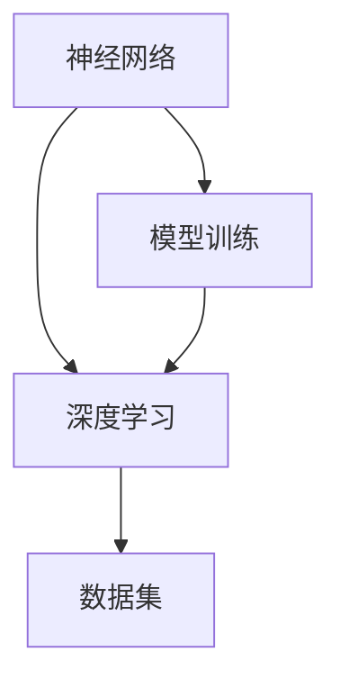

                 

关键词：创业、产品经理、AI、大模型、技术解析、未来展望

摘要：本文旨在探讨创业产品经理在AI大模型时代所面临的技术挑战和机遇。通过对AI大模型的原理、应用领域和未来发展趋势的深入分析，结合实际案例，本文将帮助读者理解大模型在创业中的关键作用，以及如何在竞争中脱颖而出。

## 1. 背景介绍

近年来，随着计算能力的提升、数据量的爆发式增长以及算法的不断创新，人工智能（AI）技术取得了飞速发展。特别是在深度学习领域的突破，使得AI大模型成为当前研究的热点。大模型不仅能够在各种复杂任务中展现出超凡的能力，还推动了自然语言处理、计算机视觉等领域的革新。对于创业产品经理而言，AI大模型既带来了前所未有的机遇，也带来了诸多挑战。

## 2. 核心概念与联系

为了更好地理解AI大模型，我们首先需要了解几个核心概念，如神经网络、深度学习、数据集等。以下是这些概念之间的联系和关系的Mermaid流程图：



### 2.1 神经网络

神经网络是模拟人脑神经元连接方式的计算模型。它通过层叠的神经元节点（层）来对输入数据进行处理和传递。

### 2.2 深度学习

深度学习是一种通过多层神经网络进行学习的算法。与传统机器学习方法相比，深度学习能够自动从大量数据中提取特征，并在复杂任务中取得显著效果。

### 2.3 数据集

数据集是训练神经网络的基本素材。高质量的训练数据集对于模型的性能至关重要。

### 2.4 模型训练

模型训练是通过调整网络中的权重和偏置来优化模型性能的过程。深度学习算法依赖于大量的数据来调整这些参数，以达到更高的准确性。

## 3. 核心算法原理 & 具体操作步骤

### 3.1 算法原理概述

AI大模型的核心在于其复杂的神经网络架构和庞大的参数规模。这些模型通常通过以下几个步骤进行训练：

1. 数据预处理
2. 模型构建
3. 训练与优化
4. 模型评估与调整

### 3.2 算法步骤详解

#### 3.2.1 数据预处理

数据预处理是训练大模型的重要一步。它包括数据清洗、归一化、数据增强等操作，以提高模型的鲁棒性和泛化能力。

#### 3.2.2 模型构建

模型构建是通过设计网络架构来定义模型的层次结构和连接方式。常见的架构包括卷积神经网络（CNN）、循环神经网络（RNN）、Transformer等。

#### 3.2.3 训练与优化

训练过程是通过反向传播算法来调整网络参数，以最小化预测误差。优化算法如Adam、SGD等可以加速训练过程。

#### 3.2.4 模型评估与调整

模型评估是使用测试集来评估模型的性能。如果性能不满足要求，可以通过调整模型架构、参数或数据预处理方法来优化模型。

### 3.3 算法优缺点

#### 优点：

1. 高效处理大量数据
2. 自动提取复杂特征
3. 适用于各种复杂任务
4. 能够实现端到端的学习

#### 缺点：

1. 训练过程需要大量计算资源和时间
2. 对数据质量有较高要求
3. 模型解释性较低

### 3.4 算法应用领域

AI大模型广泛应用于自然语言处理、计算机视觉、语音识别、推荐系统等领域。以下是一些具体的应用场景：

1. 文本生成与摘要
2. 图像分类与生成
3. 语音识别与合成
4. 推荐算法优化

## 4. 数学模型和公式 & 详细讲解 & 举例说明

### 4.1 数学模型构建

AI大模型通常基于概率图模型和优化理论。以下是一个简单的神经网络模型构建过程：

$$
y = \sigma(W \cdot x + b)
$$

其中，\( \sigma \) 是激活函数，\( W \) 是权重矩阵，\( x \) 是输入特征，\( b \) 是偏置。

### 4.2 公式推导过程

以下是一个简单的神经网络模型前向传播和反向传播的推导过程：

#### 前向传播：

$$
z = W \cdot x + b
$$

$$
a = \sigma(z)
$$

#### 反向传播：

$$
\delta_a = \frac{\partial L}{\partial a}
$$

$$
\delta_z = \delta_a \cdot \sigma'(z)
$$

$$
\frac{\partial L}{\partial W} = x^T \cdot \delta_z
$$

$$
\frac{\partial L}{\partial b} = \delta_z
$$

### 4.3 案例分析与讲解

以下是一个简单的文本分类任务案例：

#### 模型构建：

使用一个单层神经网络，输入特征是文本的词向量，输出是标签的概率分布。

#### 数据预处理：

将文本转换为词向量，使用数据增强技术来提高模型鲁棒性。

#### 训练与优化：

通过梯度下降优化算法来调整网络参数，以最小化损失函数。

#### 模型评估：

使用测试集来评估模型的分类准确率。

## 5. 项目实践：代码实例和详细解释说明

### 5.1 开发环境搭建

在本文中，我们使用Python和TensorFlow来构建和训练神经网络模型。

### 5.2 源代码详细实现

```python
import tensorflow as tf

# 模型构建
model = tf.keras.Sequential([
    tf.keras.layers.Embedding(input_dim=vocab_size, output_dim=embedding_dim),
    tf.keras.layers.GlobalAveragePooling1D(),
    tf.keras.layers.Dense(units=num_classes, activation='softmax')
])

# 模型编译
model.compile(optimizer='adam', loss='categorical_crossentropy', metrics=['accuracy'])

# 模型训练
model.fit(x_train, y_train, epochs=10, validation_data=(x_val, y_val))
```

### 5.3 代码解读与分析

上述代码实现了一个简单的文本分类模型。首先，我们使用`Embedding`层将文本转换为词向量。接着，通过`GlobalAveragePooling1D`层来聚合词向量信息。最后，使用`Dense`层来输出分类结果。

### 5.4 运行结果展示

在训练过程中，我们可以通过`model.fit()`函数来监控模型的训练进度和性能。训练完成后，可以使用`model.evaluate()`函数来评估模型在测试集上的表现。

## 6. 实际应用场景

AI大模型在创业中的应用场景非常广泛。以下是一些具体的应用案例：

1. **智能客服**：使用自然语言处理大模型来构建智能客服系统，提高客户满意度和服务效率。
2. **推荐系统**：利用大模型进行用户行为分析和内容推荐，提高用户留存率和活跃度。
3. **内容审核**：使用图像和文本分类大模型来自动审核社区内容，减少人工审核工作量。
4. **金融风控**：通过大规模数据分析和模式识别，提高金融业务的风险预测能力。

## 7. 未来应用展望

随着AI大模型的不断发展，未来将有更多的创业机会。以下是一些可能的应用趋势：

1. **个性化服务**：通过大模型来实现更加个性化的用户体验，满足用户的个性化需求。
2. **智能制造**：利用AI大模型进行智能生产规划和优化，提高生产效率和产品质量。
3. **医疗健康**：通过AI大模型进行疾病预测和诊断，提供更加精准和高效的医疗服务。

## 8. 工具和资源推荐

为了更好地掌握AI大模型技术，以下是一些推荐的学习资源和开发工具：

1. **学习资源**：
   - 《深度学习》（Goodfellow, Bengio, Courville）
   - 《动手学深度学习》（阿斯顿·张）
2. **开发工具**：
   - TensorFlow
   - PyTorch
   - JAX
3. **相关论文推荐**：
   - “Attention Is All You Need”
   - “BERT: Pre-training of Deep Bidirectional Transformers for Language Understanding”

## 9. 总结：未来发展趋势与挑战

AI大模型在创业中具有巨大的潜力，但同时也面临诸多挑战。未来发展趋势包括更高效的训练算法、更鲁棒的大模型以及跨领域的应用。然而，我们也需要关注数据隐私、模型解释性等伦理问题。总之，创业产品经理需要不断学习和适应AI大模型的技术变革，以抓住机遇，应对挑战。

## 10. 附录：常见问题与解答

### Q: AI大模型如何训练？

A: AI大模型的训练通常包括数据预处理、模型构建、训练与优化、模型评估等步骤。具体流程如下：
1. 数据预处理：清洗、归一化、数据增强等操作。
2. 模型构建：设计网络架构，如CNN、RNN、Transformer等。
3. 训练与优化：通过反向传播算法调整网络参数，优化模型性能。
4. 模型评估：使用测试集评估模型性能，调整模型架构或参数。

### Q: AI大模型的应用领域有哪些？

A: AI大模型的应用领域非常广泛，包括自然语言处理、计算机视觉、语音识别、推荐系统、金融风控、医疗健康等。以下是一些具体的应用案例：
- 文本生成与摘要
- 图像分类与生成
- 语音识别与合成
- 推荐算法优化
- 疾病预测与诊断
- 智能客服系统

### Q: 如何提高AI大模型的训练效率？

A: 提高AI大模型的训练效率可以从以下几个方面入手：
1. 使用更高效的训练算法，如Adam、AdaGrad等。
2. 使用分布式训练，如Horovod、TFDS等。
3. 使用GPU或TPU等高性能硬件进行训练。
4. 优化数据加载和预处理流程，减少I/O瓶颈。
5. 使用模型剪枝和量化技术来减少模型大小和计算复杂度。

### Q: AI大模型的安全性如何保障？

A: 保障AI大模型的安全性需要从以下几个方面考虑：
1. 数据隐私保护：使用加密技术保护用户数据。
2. 模型安全性评估：定期对模型进行安全评估，检测潜在的攻击和漏洞。
3. 模型可解释性：提高模型的可解释性，帮助用户理解模型的决策过程。
4. 模型更新与维护：及时更新和修复模型中的漏洞。
5. 法律法规遵守：遵循相关法律法规，确保模型应用的合法性。

### Q: 如何避免AI大模型导致的偏见？

A: 避免AI大模型导致的偏见可以从以下几个方面着手：
1. 数据质量：确保训练数据的质量和多样性，避免数据偏差。
2. 数据预处理：使用数据增强和重新采样等技术来平衡数据分布。
3. 模型训练：使用对抗性训练等方法来提高模型的鲁棒性。
4. 模型评估：在评估模型时，使用交叉验证和外部数据集等方法来检测模型偏差。
5. 模型审核：定期对模型进行审核，确保其公平性和透明性。

### Q: AI大模型的发展方向是什么？

A: AI大模型的发展方向包括以下几个方面：
1. 更高效的大模型训练算法。
2. 更鲁棒的模型，能够处理不确定性和异常情况。
3. 跨领域的模型融合，如将计算机视觉与自然语言处理相结合。
4. 模型的可解释性和透明性，提高用户对模型的信任。
5. 模型的部署和优化，提高模型在实际应用中的性能和效率。

### Q: 如何在创业中使用AI大模型？

A: 在创业中使用AI大模型可以采取以下策略：
1. 明确业务需求：了解业务目标，确定AI大模型的应用场景和目标。
2. 数据积累：收集和整理业务相关的数据，确保数据质量和多样性。
3. 技术选型：选择适合业务需求的技术和框架，如TensorFlow、PyTorch等。
4. 模型训练：设计和训练合适的AI大模型，优化模型性能。
5. 模型部署：将训练好的模型部署到生产环境，确保模型稳定运行。
6. 持续迭代：根据业务反馈和模型性能，持续优化和迭代模型。
7. 风险控制：关注模型的安全性和公平性，确保业务合规性。

### Q: 如何评估AI大模型的性能？

A: 评估AI大模型的性能可以从以下几个方面入手：
1. 准确率：评估模型在分类任务中的准确率。
2. 召回率：评估模型在检索任务中的召回率。
3. 覆盖率：评估模型对数据集的覆盖率。
4. 时间效率：评估模型训练和预测的效率。
5. 成本效益：评估模型训练和部署的成本和收益。

### Q: AI大模型在创业中的优势是什么？

A: AI大模型在创业中的优势包括：
1. 高效处理大量数据：能够快速处理和分析海量数据，帮助创业公司快速获取洞察。
2. 自动提取特征：能够自动从数据中提取有价值的信息，降低人力成本。
3. 提高决策质量：通过数据分析，为创业决策提供科学依据。
4. 降低开发成本：基于开源框架和现成的模型，可以节省开发时间和成本。
5. 增强竞争力：通过创新的AI技术应用，提高产品和服务的竞争力。
6. 提高用户体验：通过个性化推荐和智能客服等应用，提升用户体验。

### Q: 如何确保AI大模型的应用合规性？

A: 确保AI大模型的应用合规性可以采取以下措施：
1. 遵循相关法律法规：确保模型应用符合国家和地区的数据保护、隐私保护等相关法律法规。
2. 用户知情同意：在模型应用过程中，确保用户了解并同意数据收集、使用和共享的方式。
3. 数据安全保护：采取加密、访问控制等技术手段保护用户数据安全。
4. 公平性和透明性：确保模型决策的公平性和透明性，避免歧视和偏见。
5. 定期审计和评估：定期对模型应用进行审计和评估，确保其合规性。
6. 专业培训和指导：对相关人员提供专业培训和指导，确保他们了解合规要求。

### Q: AI大模型在医疗健康领域的应用有哪些？

A: AI大模型在医疗健康领域的应用非常广泛，包括：
1. 疾病预测：通过分析患者的病史、基因信息等数据，预测疾病风险。
2. 疾病诊断：通过分析医学影像、实验室检测数据等，帮助医生进行疾病诊断。
3. 药物研发：通过虚拟筛选和药物组合优化，加速新药研发过程。
4. 医疗机器人：通过AI技术，开发辅助医生进行手术、护理等任务的机器人。
5. 医疗知识图谱：构建医学知识图谱，提供全面、准确的医学信息查询服务。

### Q: 如何确保AI大模型的应用伦理？

A: 确保AI大模型的应用伦理可以采取以下措施：
1. 透明性：确保模型的决策过程透明，用户能够理解模型的决策依据。
2. 公平性：确保模型在不同群体中的公平性，避免歧视和偏见。
3. 数据隐私保护：采取加密、匿名化等技术手段，保护用户隐私。
4. 模型可解释性：提高模型的可解释性，帮助用户理解模型的决策过程。
5. 持续监测与评估：定期对模型应用进行监测和评估，确保其遵循伦理标准。
6. 遵循法律法规：确保模型应用符合国家和地区的数据保护、隐私保护等相关法律法规。
7. 专业培训和指导：对相关人员提供专业培训和指导，确保他们了解伦理要求。
8. 社会责任：承担社会责任，关注模型应用对社会和环境的影响。

### Q: AI大模型在金融领域的应用有哪些？

A: AI大模型在金融领域的应用非常广泛，包括：
1. 风险评估：通过分析历史数据和实时数据，评估投资风险。
2. 贷款审批：利用大模型进行信用评分和贷款审批，提高审批效率。
3. 交易策略：通过分析市场数据，制定高效的交易策略。
4. 资产配置：根据用户风险偏好和市场需求，提供个性化的资产配置建议。
5. 风暴预警：利用大数据分析和模式识别，预测金融市场波动和风险。
6. 反欺诈检测：通过异常检测和模式识别，发现和防止金融欺诈行为。

### Q: 如何应对AI大模型的过拟合问题？

A: 应对AI大模型的过拟合问题可以采取以下措施：
1. 数据增强：通过增加数据量或对现有数据进行变换，提高模型的泛化能力。
2. 正则化：使用正则化技术，如L1、L2正则化，减少模型复杂度。
3. 早停法：在训练过程中，提前停止训练，防止模型过拟合。
4. 交叉验证：使用交叉验证方法，评估模型的泛化能力。
5. 模型集成：将多个模型进行集成，提高预测的稳定性和准确性。
6. 特征选择：选择对模型性能有显著影响的特征，减少无关特征的影响。
7. 模型简化：简化模型架构，减少参数数量，提高模型的泛化能力。

### Q: 如何评估AI大模型的泛化能力？

A: 评估AI大模型的泛化能力可以从以下几个方面入手：
1. 交叉验证：使用交叉验证方法，评估模型在不同数据集上的性能。
2. 测试集评估：使用独立的测试集，评估模型的泛化能力。
3. 特征重要性分析：分析模型对各个特征的重要性，评估模型对不同特征的依赖程度。
4. 对抗性测试：通过生成对抗性样本，评估模型的鲁棒性和泛化能力。
5. 实际应用场景评估：在实际应用场景中，评估模型的性能和稳定性。
6. 持续监测与评估：定期对模型进行监测和评估，确保其泛化能力。

### Q: 如何优化AI大模型的性能？

A: 优化AI大模型的性能可以从以下几个方面入手：
1. 算法优化：选择合适的训练算法，如梯度下降、Adam等，优化模型性能。
2. 模型架构优化：设计合理的网络架构，提高模型的效率和准确性。
3. 特征工程：选择和提取对模型性能有显著影响的特征，提高模型的泛化能力。
4. 数据预处理：优化数据预处理流程，提高数据质量和多样性。
5. 模型剪枝：通过剪枝技术，减少模型参数数量，提高模型效率和性能。
6. 模型量化：通过量化技术，降低模型复杂度和计算成本，提高模型性能。
7. 模型压缩：通过压缩技术，减少模型大小和计算复杂度，提高模型性能。
8. 模型并行化：利用分布式训练和并行计算技术，加速模型训练过程。

### Q: 如何评估AI大模型的成本效益？

A: 评估AI大模型的成本效益可以从以下几个方面入手：
1. 训练成本：计算模型训练所需的时间、计算资源和数据成本。
2. 部署成本：计算模型部署到生产环境所需的硬件、软件和人力成本。
3. 运维成本：计算模型在生产环境中的维护、监控和升级成本。
4. 预测成本：计算模型进行预测所需的计算资源和时间成本。
5. 收益分析：分析模型应用带来的直接和间接收益，如提高销售额、降低运营成本等。
6. 投资回报率（ROI）：计算模型投资的回报率，评估模型的经济效益。
7. 成本效益分析：综合考虑成本和收益，评估模型的综合效益。

### Q: 如何选择合适的AI大模型框架？

A: 选择合适的AI大模型框架可以从以下几个方面入手：
1. 项目需求：根据项目需求，选择适合的框架，如TensorFlow、PyTorch等。
2. 性能要求：考虑模型的训练和预测性能，选择适合的框架。
3. 社区支持：选择具有活跃社区和丰富资源的框架，方便学习和解决问题。
4. 可扩展性：考虑模型的扩展性，选择能够支持大规模数据和复杂任务的框架。
5. 开发效率：选择易于使用和开发的框架，提高开发效率。
6. 兼容性：考虑与现有系统和工具的兼容性，选择能够无缝集成的框架。
7. 安全性：选择具有良好安全性和隐私保护机制的框架。

### Q: 如何在创业中使用AI大模型进行风险评估？

A: 在创业中使用AI大模型进行风险评估可以采取以下步骤：
1. 数据收集：收集与风险评估相关的历史数据和实时数据，如客户行为数据、市场数据等。
2. 数据预处理：对数据进行清洗、归一化和预处理，提高数据质量和多样性。
3. 模型构建：选择合适的模型框架和算法，构建风险评估模型。
4. 模型训练：使用训练数据对模型进行训练，优化模型性能。
5. 模型评估：使用测试数据评估模型性能，确保模型的准确性和稳定性。
6. 风险预测：使用训练好的模型对新的数据进行风险评估，预测潜在风险。
7. 风险控制：根据评估结果，制定相应的风险控制策略，降低风险。
8. 持续迭代：根据实际业务需求和评估结果，不断优化和迭代模型。

### Q: 如何使用AI大模型进行个性化推荐？

A: 使用AI大模型进行个性化推荐可以采取以下步骤：
1. 数据收集：收集用户行为数据、偏好数据、内容数据等，用于构建推荐模型。
2. 数据预处理：对数据进行清洗、归一化和预处理，提高数据质量和多样性。
3. 模型构建：选择合适的模型框架和算法，构建推荐模型。
4. 模型训练：使用训练数据对模型进行训练，优化模型性能。
5. 模型评估：使用测试数据评估模型性能，确保模型的准确性和稳定性。
6. 用户画像：使用训练好的模型对用户进行画像，提取用户兴趣和偏好。
7. 内容匹配：根据用户画像和内容特征，匹配推荐内容。
8. 推荐策略：设计合适的推荐策略，如基于内容的推荐、基于协同过滤的推荐等。
9. 推荐结果：输出推荐结果，展示给用户。
10. 持续迭代：根据用户反馈和推荐效果，不断优化和迭代模型。

### Q: 如何在AI大模型应用中保护用户隐私？

A: 在AI大模型应用中保护用户隐私可以采取以下措施：
1. 数据匿名化：对用户数据进行匿名化处理，避免直接使用用户个人信息。
2. 数据加密：对用户数据进行加密存储和传输，防止数据泄露。
3. 隐私保护算法：使用隐私保护算法，如差分隐私、同态加密等，保护用户隐私。
4. 访问控制：设置严格的访问控制策略，确保只有授权人员可以访问用户数据。
5. 用户同意：在数据收集和使用过程中，获取用户明确同意，确保用户知情权。
6. 数据最小化：仅收集和处理与业务需求直接相关的数据，避免过度收集。
7. 数据留存：设置合理的数据留存期限，确保数据使用合法合规。
8. 数据审计：定期对数据使用情况进行审计，确保数据使用合规合法。
9. 数据泄露应急响应：制定数据泄露应急响应计划，及时应对数据泄露事件。

### Q: 如何评估AI大模型在业务中的应用效果？

A：评估AI大模型在业务中的应用效果可以采取以下步骤：
1. **业务目标定义**：明确AI大模型应用的业务目标，如提升销售额、降低成本、优化用户体验等。
2. **关键性能指标（KPI）设定**：基于业务目标，设定具体的关键性能指标，例如准确率、召回率、点击率、转化率、客户满意度等。
3. **模型评估**：使用独立的测试集或验证集对模型进行评估，计算设定的KPI值。
4. **对比分析**：将AI大模型的结果与现有业务流程或基准模型进行比较，分析改进幅度和效果。
5. **实际业务影响分析**：分析AI大模型对业务流程、员工工作效率、客户满意度等方面的影响。
6. **成本效益分析**：计算AI大模型应用的成本和效益，评估其经济效益。
7. **用户反馈收集**：收集用户对AI大模型应用的反馈，了解用户的实际体验和满意度。
8. **持续监控与迭代**：定期监控模型性能和业务效果，根据反馈进行调整和优化。

### Q：AI大模型在创业中的角色是什么？

A：AI大模型在创业中扮演着至关重要的角色，主要表现在以下几个方面：
1. **数据分析与洞察**：通过AI大模型，创业公司可以深入分析大量数据，提取有价值的信息，为业务决策提供科学依据。
2. **效率提升**：AI大模型能够自动化许多繁琐的任务，如客户服务、数据分析、预测等，提高业务流程的效率。
3. **创新驱动**：AI大模型能够发现新的商业模式、产品改进方向和市场机会，推动公司的创新和发展。
4. **客户体验优化**：通过AI大模型，公司可以提供更加个性化和精准的服务，提升客户体验和满意度。
5. **决策支持**：AI大模型能够处理复杂的业务问题，提供数据驱动的决策建议，帮助创业公司做出更加明智的决策。
6. **风险控制**：AI大模型可以在金融、医疗等领域帮助创业公司识别和管理风险，提高业务稳定性。
7. **竞争优势**：拥有强大AI能力的创业公司可以在市场竞争中脱颖而出，建立差异化竞争优势。

### Q：创业产品经理如何利用AI大模型提升产品竞争力？

A：创业产品经理可以利用AI大模型提升产品竞争力，具体策略如下：
1. **需求分析**：使用AI大模型分析用户行为和需求，精准定位产品功能和服务。
2. **用户画像**：构建用户画像，了解用户的兴趣、行为和偏好，实现个性化推荐和定制化服务。
3. **产品优化**：利用AI大模型进行产品优化，如通过A/B测试，确定最佳产品功能组合和设计。
4. **市场预测**：通过AI大模型预测市场趋势，提前布局新产品和功能。
5. **用户体验**：利用AI大模型优化用户界面和交互体验，提高用户满意度和留存率。
6. **风险预测**：使用AI大模型预测潜在的市场风险和产品故障，提前采取应对措施。
7. **创新驱动**：鼓励产品团队探索AI技术的创新应用，为产品带来新的增长点。
8. **竞争分析**：通过AI大模型分析竞争对手的产品和市场策略，发现竞争对手的弱点，制定应对策略。
9. **数据驱动决策**：将AI大模型作为决策支持工具，基于数据分析做出更加明智的产品决策。

### Q：AI大模型如何影响创业公司的运营和战略规划？

A：AI大模型对创业公司的运营和战略规划有深远的影响，具体体现在以下几个方面：
1. **运营优化**：AI大模型可以自动化许多运营任务，如库存管理、客户支持等，提高运营效率。
2. **预测与规划**：通过AI大模型，创业公司可以更好地预测市场需求和客户行为，制定更加精准的运营和营销策略。
3. **风险管理**：AI大模型能够识别潜在的风险和问题，帮助公司制定风险管理策略，降低运营风险。
4. **战略定位**：通过分析市场和客户数据，AI大模型可以为公司提供战略方向，帮助公司制定长期发展计划。
5. **成本控制**：AI大模型可以帮助公司优化资源分配和成本结构，提高资源利用效率。
6. **创新驱动**：AI大模型能够发现新的商业模式和市场机会，推动公司进行产品创新和业务拓展。
7. **客户关系管理**：AI大模型可以优化客户关系管理，提高客户满意度和忠诚度，增强客户粘性。
8. **市场洞察**：AI大模型能够提供市场趋势和竞争动态的实时分析，帮助公司及时调整战略，抓住市场机遇。

### Q：创业产品经理如何确保AI大模型项目的成功？

A：创业产品经理确保AI大模型项目成功需要采取以下措施：
1. **明确目标**：确保项目目标与公司战略和业务需求一致，确保项目方向正确。
2. **组建团队**：组建专业的跨学科团队，包括数据科学家、软件工程师、业务分析师等，确保项目资源充足。
3. **数据质量**：确保数据质量，进行数据清洗和预处理，提高模型训练效果。
4. **技术选型**：选择适合项目需求的技术和框架，确保技术可行性和高效性。
5. **持续迭代**：采用迭代开发方法，不断优化和改进模型，确保项目持续改进。
6. **用户参与**：在项目开发过程中，收集用户反馈，确保产品符合用户需求和期望。
7. **风险管理**：制定风险管理计划，提前识别和应对潜在风险。
8. **绩效评估**：建立绩效评估机制，定期评估项目进度和成果，确保项目按计划进行。
9. **跨部门协作**：确保与公司其他部门紧密协作，确保项目成果能够顺利落地和推广应用。
10. **持续学习**：鼓励团队学习和掌握最新的AI技术和方法，不断提高团队的技术水平。

### Q：创业产品经理如何与数据科学家和数据工程师合作？

A：创业产品经理与数据科学家和数据工程师的有效合作对于AI大模型项目的成功至关重要，以下是一些建议：
1. **明确角色和责任**：明确各自的角色和责任，确保团队中的每个人都知道自己的任务和期望。
2. **沟通和协作**：建立高效的沟通渠道，定期召开会议，确保项目进展和问题得到及时沟通和解决。
3. **共同目标**：确保团队成员有共同的目标和愿景，鼓励团队合作，共同推动项目进展。
4. **需求理解**：产品经理需要深入理解业务需求和用户需求，将其转化为具体的技术需求，并与数据科学家和数据工程师进行有效沟通。
5. **数据共享**：鼓励团队成员之间的数据共享和知识共享，提高团队整体的技术水平和创新能力。
6. **技术培训**：组织技术培训和研讨会，帮助团队成员掌握最新的AI技术和工具。
7. **反馈机制**：建立有效的反馈机制，及时收集和解决问题，确保项目按计划进行。
8. **技术决策**：在技术决策方面，产品经理应与数据科学家和数据工程师进行深入讨论，权衡技术方案的成本和收益。
9. **迭代开发**：采用迭代开发方法，逐步实现项目目标，确保项目成果能够不断优化和改进。
10. **持续学习**：鼓励团队成员不断学习和探索新的技术趋势和方法，提高团队的整体竞争力。

### Q：创业产品经理如何评估AI大模型项目的ROI？

A：创业产品经理评估AI大模型项目的ROI（投资回报率）可以从以下几个方面进行：
1. **项目成本**：计算项目的总成本，包括人力、硬件、软件和其他相关费用。
2. **预期收益**：预测项目实施后可能带来的收益，如销售额增长、成本节约、用户增长等。
3. **时间周期**：确定项目从开始到实现预期收益所需的时间周期。
4. **现金流量**：分析项目实施后的现金流量变化，计算净现值（NPV）。
5. **风险分析**：评估项目可能面临的风险和不确定性，调整预期收益和成本。
6. **成本节约**：评估项目实施后可能带来的成本节约，如减少人力成本、提高效率等。
7. **用户满意度**：评估项目实施后用户满意度的提升，分析其对业务增长的影响。
8. **市场份额**：评估项目实施后对市场份额的提升，分析其对业务增长的影响。
9. **竞争对手分析**：分析竞争对手的AI技术应用情况，评估项目对竞争格局的影响。
10. **综合评价**：综合考虑以上因素，对项目的ROI进行综合评价。

### Q：创业产品经理如何应对AI大模型项目的技术挑战？

A：创业产品经理应对AI大模型项目的技术挑战可以从以下几个方面进行：
1. **技术调研**：在项目启动前，进行充分的技术调研，了解最新的AI技术和工具。
2. **专业培训**：组织团队成员进行专业培训，提高团队的技术水平。
3. **技术选型**：选择适合项目需求的技术和框架，确保技术方案的高效性和可行性。
4. **技术支持**：寻求外部技术支持，如与学术机构、技术咨询公司等合作。
5. **技术合作**：与其他公司或研究机构建立技术合作关系，共享技术和资源。
6. **风险控制**：制定风险控制计划，提前识别和应对潜在技术风险。
7. **迭代开发**：采用迭代开发方法，逐步实现项目目标，降低技术风险。
8. **团队协作**：加强团队协作，确保项目中的技术问题得到及时解决。
9. **技术更新**：关注技术发展趋势，及时更新和优化技术方案。
10. **技术创新**：鼓励团队成员进行技术创新，提高项目的技术竞争力。

### Q：创业产品经理如何利用AI大模型优化产品生命周期管理？

A：创业产品经理利用AI大模型优化产品生命周期管理可以从以下几个方面进行：
1. **需求分析**：使用AI大模型分析用户需求和行为，精准定位产品功能和特性。
2. **市场预测**：利用AI大模型预测市场趋势和竞争动态，制定合适的产品规划。
3. **用户画像**：构建用户画像，了解用户的兴趣、行为和偏好，实现个性化产品推荐。
4. **产品优化**：通过AI大模型分析产品数据，优化产品设计和功能，提高用户体验。
5. **性能监控**：利用AI大模型实时监控产品性能和用户反馈，及时调整产品策略。
6. **风险评估**：使用AI大模型预测产品风险，提前采取应对措施，降低运营风险。
7. **迭代更新**：采用迭代开发方法，持续优化产品，满足不断变化的市场需求。
8. **用户留存**：利用AI大模型提高用户满意度和忠诚度，降低用户流失率。
9. **数据驱动**：基于数据分析和AI大模型预测，制定科学的产品策略，提高业务决策的准确性。
10. **跨部门协作**：与研发、市场、运营等部门紧密协作，确保产品生命周期管理的各个环节高效运作。

### Q：创业产品经理如何确保AI大模型项目的可持续性？

A：创业产品经理确保AI大模型项目的可持续性可以从以下几个方面进行：
1. **技术可持续性**：选择成熟稳定的技术方案，关注技术更新和迭代，确保项目长期的技术可行性。
2. **数据可持续性**：建立稳定可靠的数据收集和管理机制，确保数据源的持续性和质量。
3. **团队可持续性**：建立专业化的团队，确保团队成员的稳定性和专业技能的持续提升。
4. **成本可持续性**：合理规划和控制项目成本，确保项目的经济效益和可持续性。
5. **业务可持续性**：确保项目符合公司战略和业务目标，推动公司的持续发展和成长。
6. **风险管理**：建立完善的风险管理机制，识别和应对潜在的风险和挑战。
7. **用户反馈**：持续收集用户反馈，及时调整和优化产品和服务，提高用户满意度。
8. **合作与共享**：与其他公司或研究机构建立合作关系，共享技术和资源，实现共同发展。
9. **社会责任**：关注项目的社会责任，确保项目符合法律法规和伦理要求。
10. **持续改进**：采用持续改进的方法，不断优化和提升项目的各个维度。

### Q：创业产品经理如何管理AI大模型项目的预算和资源？

A：创业产品经理管理AI大模型项目的预算和资源可以从以下几个方面进行：
1. **需求分析**：在项目启动前，对项目需求进行详细分析，确定项目所需的人力、硬件、软件和其他资源。
2. **预算规划**：根据项目需求，制定合理的预算计划，包括人力成本、硬件设备成本、软件工具成本等。
3. **资源分配**：合理分配项目资源，确保项目各个阶段和任务都有足够的资源支持。
4. **成本控制**：在项目执行过程中，持续监控成本支出，确保项目在预算范围内完成。
5. **资源优化**：通过技术优化和管理优化，提高资源利用效率，降低项目成本。
6. **风险评估**：识别项目中的潜在风险，制定相应的风险管理计划，降低风险对预算的影响。
7. **预算调整**：根据项目进展和市场变化，及时调整预算计划，确保项目能够顺利完成。
8. **绩效评估**：定期评估项目绩效，根据项目进展和预算执行情况，调整资源分配和预算规划。
9. **跨部门协作**：与公司其他部门紧密协作，确保项目资源的有效利用和共享。
10. **持续监控**：建立预算监控机制，持续跟踪项目成本和资源使用情况，确保项目在预算范围内高效完成。

### Q：创业产品经理如何利用AI大模型优化产品定价策略？

A：创业产品经理利用AI大模型优化产品定价策略可以从以下几个方面进行：
1. **需求预测**：使用AI大模型预测市场需求和用户行为，了解不同价格水平下的需求变化。
2. **竞争分析**：通过AI大模型分析竞争对手的定价策略和市场份额，确定自身产品的定价策略。
3. **成本分析**：利用AI大模型分析生产成本、运营成本和营销成本，确定产品的基本成本。
4. **价格敏感度分析**：使用AI大模型分析用户对价格变化的敏感度，制定灵活的定价策略。
5. **价格组合测试**：通过AI大模型进行多种价格组合测试，找到最佳定价策略。
6. **价格弹性分析**：利用AI大模型分析价格变化对销售量和利润的影响，优化定价策略。
7. **定价策略调整**：根据市场反馈和AI大模型的分析结果，动态调整定价策略，提高市场竞争力。
8. **个性化定价**：利用AI大模型进行个性化定价，根据用户的消费习惯和购买偏好，为不同用户设定不同的价格。
9. **促销策略优化**：通过AI大模型分析促销活动对销售量和利润的影响，优化促销策略。
10. **定价决策支持**：将AI大模型作为决策支持工具，为产品定价决策提供科学依据，提高定价准确性。

### Q：创业产品经理如何利用AI大模型优化产品营销策略？

A：创业产品经理利用AI大模型优化产品营销策略可以从以下几个方面进行：
1. **市场细分**：使用AI大模型对市场进行细分，识别具有相似需求和行为的用户群体。
2. **用户画像**：构建用户画像，了解用户的基本信息、购买行为和偏好，为营销活动提供个性化依据。
3. **渠道优化**：通过AI大模型分析不同营销渠道的效果，优化营销资源的分配。
4. **促销策略**：利用AI大模型测试不同的促销策略，找到最有效的促销方法。
5. **广告投放**：利用AI大模型分析广告投放的效果，优化广告预算和投放策略。
6. **内容推荐**：通过AI大模型进行内容推荐，提高用户参与度和转化率。
7. **预测分析**：利用AI大模型预测市场趋势和用户行为，制定长远的营销策略。
8. **用户反馈**：通过AI大模型分析用户反馈和行为数据，及时调整营销策略。
9. **跨渠道整合**：利用AI大模型整合线上线下渠道，实现全渠道营销。
10. **个性化营销**：利用AI大模型进行个性化营销，提高用户满意度和忠诚度。

### Q：创业产品经理如何利用AI大模型提高客户满意度？

A：创业产品经理利用AI大模型提高客户满意度可以从以下几个方面进行：
1. **个性化服务**：使用AI大模型分析用户行为和偏好，提供个性化的产品和服务。
2. **预测分析**：利用AI大模型预测客户需求和偏好，提前满足客户需求。
3. **智能客服**：通过AI大模型构建智能客服系统，提供24/7的在线支持。
4. **定制化推荐**：利用AI大模型为用户推荐符合其需求和喜好的产品。
5. **用户反馈**：利用AI大模型分析用户反馈和行为数据，及时调整产品和服务。
6. **服务质量监控**：利用AI大模型监控服务质量，确保客户满意度。
7. **客户关怀**：通过AI大模型进行客户关怀和提醒，提高用户忠诚度。
8. **个性化优惠**：利用AI大模型为用户提供个性化的优惠和促销。
9. **交互优化**：利用AI大模型优化用户界面和交互体验，提高用户满意度。
10. **反馈机制**：建立有效的反馈机制，及时收集和处理用户反馈，持续改进产品和服务。

### Q：创业产品经理如何利用AI大模型优化供应链管理？

A：创业产品经理利用AI大模型优化供应链管理可以从以下几个方面进行：
1. **需求预测**：使用AI大模型预测市场需求和销售趋势，优化库存管理和生产计划。
2. **供应链优化**：利用AI大模型分析供应链数据，优化供应链结构和流程。
3. **物流优化**：通过AI大模型优化物流路线和运输计划，提高物流效率。
4. **库存管理**：使用AI大模型进行实时库存监控和预测，减少库存过剩和短缺。
5. **采购优化**：利用AI大模型分析供应商数据，优化采购策略和成本。
6. **供应链可视性**：通过AI大模型实现供应链的实时监控和可视化，提高供应链透明度。
7. **风险预测**：利用AI大模型预测供应链风险，提前采取应对措施。
8. **协同优化**：与其他公司或供应商建立协同关系，共同优化供应链管理。
9. **供应商管理**：使用AI大模型评估供应商绩效，优化供应商选择和合作。
10. **供应链绩效评估**：利用AI大模型对供应链绩效进行评估，持续改进供应链管理。

### Q：创业产品经理如何利用AI大模型进行市场细分和定位？

A：创业产品经理利用AI大模型进行市场细分和定位可以从以下几个方面进行：
1. **用户画像**：使用AI大模型构建详细的用户画像，了解用户的基本信息、行为和偏好。
2. **行为分析**：通过AI大模型分析用户行为数据，识别不同用户群体的行为特征。
3. **需求预测**：利用AI大模型预测不同用户群体的需求和购买行为。
4. **市场细分**：基于用户画像和行为分析结果，将市场划分为不同的细分市场。
5. **定位策略**：针对不同的细分市场，制定相应的产品定位和市场策略。
6. **竞争分析**：通过AI大模型分析竞争对手的市场策略和定位，确定自身的市场定位。
7. **目标用户识别**：利用AI大模型识别最具有潜力的目标用户群体。
8. **个性化营销**：针对不同的目标用户群体，制定个性化的营销策略。
9. **市场测试**：通过AI大模型进行市场测试，验证市场细分和定位的有效性。
10. **持续优化**：根据市场反馈和数据分析结果，不断调整市场细分和定位策略。

### Q：创业产品经理如何利用AI大模型优化人力资源管理？

A：创业产品经理利用AI大模型优化人力资源管理可以从以下几个方面进行：
1. **招聘策略**：使用AI大模型分析求职者数据，优化招聘策略和流程。
2. **员工画像**：通过AI大模型构建员工画像，了解员工的基本信息、技能和潜力。
3. **绩效评估**：利用AI大模型对员工绩效进行实时评估和反馈。
4. **人才发展**：通过AI大模型分析员工发展和晋升潜力，制定人才发展计划。
5. **员工满意度**：利用AI大模型分析员工满意度，及时发现和解决员工问题。
6. **培训需求**：使用AI大模型分析员工技能缺口，制定针对性的培训计划。
7. **员工流失预测**：通过AI大模型预测员工流失风险，提前采取应对措施。
8. **团队优化**：利用AI大模型分析团队结构和成员技能，优化团队配置。
9. **招聘效率**：通过AI大模型提高招聘流程的自动化和效率，减少招聘周期。
10. **人力资源规划**：利用AI大模型分析公司未来的人力资源需求，制定人力资源规划。

### Q：创业产品经理如何利用AI大模型优化数据分析流程？

A：创业产品经理利用AI大模型优化数据分析流程可以从以下几个方面进行：
1. **数据预处理**：使用AI大模型进行数据清洗、归一化和预处理，提高数据质量。
2. **特征提取**：利用AI大模型自动提取关键特征，减少人工干预。
3. **模型训练**：通过AI大模型进行高效的模型训练和优化，提高数据分析效率。
4. **预测分析**：利用AI大模型进行实时预测和数据分析，提供决策支持。
5. **可视化**：通过AI大模型实现数据的自动可视化和展示，提高数据分析的可理解性。
6. **异常检测**：使用AI大模型进行实时异常检测，提高数据分析的准确性。
7. **报告生成**：利用AI大模型自动生成数据分析报告，简化报告撰写流程。
8. **数据整合**：通过AI大模型整合多种数据源，实现跨数据源的数据分析。
9. **自动化流程**：利用AI大模型实现数据分析流程的自动化，提高数据分析效率。
10. **持续优化**：根据数据分析结果和业务需求，不断优化和调整数据分析模型和流程。

### Q：创业产品经理如何利用AI大模型进行用户行为分析？

A：创业产品经理利用AI大模型进行用户行为分析可以从以下几个方面进行：
1. **数据收集**：收集用户的浏览、点击、购买等行为数据。
2. **数据清洗**：使用AI大模型清洗和预处理数据，确保数据质量。
3. **用户画像**：通过AI大模型构建详细的用户画像，了解用户的基本信息、行为和偏好。
4. **行为分析**：利用AI大模型分析用户行为数据，识别用户的消费习惯和偏好。
5. **行为预测**：通过AI大模型预测用户未来的行为，为产品优化和营销策略提供依据。
6. **用户留存**：使用AI大模型分析用户留存率和流失率，优化用户互动体验。
7. **推荐系统**：利用AI大模型构建推荐系统，提高用户满意度和转化率。
8. **个性化营销**：通过AI大模型为不同用户群体提供个性化的营销活动。
9. **行为反馈**：利用AI大模型分析用户反馈和行为数据，持续优化产品和服务。
10. **用户增长**：通过AI大模型分析用户增长路径，制定有效的用户增长策略。

### Q：创业产品经理如何利用AI大模型进行市场研究？

A：创业产品经理利用AI大模型进行市场研究可以从以下几个方面进行：
1. **数据收集**：收集市场数据，包括竞争信息、用户反馈、行业趋势等。
2. **市场细分**：通过AI大模型对市场进行细分，识别不同的用户群体和市场机会。
3. **需求分析**：利用AI大模型分析用户需求和行为，了解市场潜在需求。
4. **竞争分析**：通过AI大模型分析竞争对手的市场策略和产品表现。
5. **趋势预测**：利用AI大模型预测市场趋势和变化，为战略规划提供依据。
6. **用户画像**：通过AI大模型构建详细的用户画像，了解目标用户群体的特征。
7. **需求预测**：利用AI大模型预测市场需求和潜在机会，为产品规划提供依据。
8. **市场测试**：通过AI大模型进行市场测试，验证产品概念和市场策略。
9. **效果评估**：利用AI大模型评估市场活动效果，优化市场策略。
10. **持续研究**：通过持续的数据分析和模型更新，保持对市场动态的敏感度。

### Q：创业产品经理如何利用AI大模型优化用户体验？

A：创业产品经理利用AI大模型优化用户体验可以从以下几个方面进行：
1. **用户画像**：通过AI大模型构建详细的用户画像，了解用户的需求和行为。
2. **个性化推荐**：利用AI大模型为用户提供个性化的内容推荐和服务。
3. **交互优化**：通过AI大模型分析用户交互数据，优化用户界面和交互流程。
4. **行为预测**：利用AI大模型预测用户行为，提供及时的用户支持和服务。
5. **问题诊断**：使用AI大模型识别用户在产品使用过程中的问题和挑战。
6. **满意度分析**：通过AI大模型分析用户满意度，了解用户体验的优缺点。
7. **反馈机制**：利用AI大模型分析用户反馈和行为数据，及时调整产品和服务。
8. **个性化营销**：通过AI大模型为用户提供个性化的营销活动和优惠。
9. **行为指导**：通过AI大模型为用户提供行为指导，提高用户参与度和忠诚度。
10. **实时支持**：利用AI大模型提供实时在线支持和建议，提高用户满意度。

### Q：创业产品经理如何利用AI大模型优化产品定价策略？

A：创业产品经理利用AI大模型优化产品定价策略可以从以下几个方面进行：
1. **价格敏感度分析**：使用AI大模型分析用户对不同价格水平的敏感度，为定价策略提供依据。
2. **竞争分析**：通过AI大模型分析竞争对手的定价策略和市场份额，制定有竞争力的定价策略。
3. **成本分析**：利用AI大模型分析产品的生产成本和运营成本，确保定价的合理性。
4. **需求预测**：使用AI大模型预测市场需求和销售趋势，为定价策略提供依据。
5. **价格组合测试**：通过AI大模型进行多种价格组合测试，找到最佳定价策略。
6. **个性化定价**：利用AI大模型为不同用户群体设定个性化的价格。
7. **促销策略优化**：通过AI大模型分析促销活动对销售和利润的影响，优化促销策略。
8. **价格弹性分析**：使用AI大模型分析价格变化对销售量和利润的影响，为定价策略提供依据。
9. **定价策略调整**：根据市场反馈和AI大模型的分析结果，动态调整定价策略。
10. **定价决策支持**：将AI大模型作为决策支持工具，为产品定价决策提供科学依据。

### Q：创业产品经理如何利用AI大模型进行产品优化和改进？

A：创业产品经理利用AI大模型进行产品优化和改进可以从以下几个方面进行：
1. **需求分析**：通过AI大模型分析用户需求和行为，了解用户对产品的期望。
2. **用户体验**：利用AI大模型分析用户反馈和行为数据，识别产品优化的方向。
3. **数据驱动**：基于数据分析结果，制定产品优化计划，确保优化方向的科学性。
4. **A/B测试**：通过AI大模型进行A/B测试，验证不同优化方案的可行性。
5. **性能分析**：利用AI大模型分析产品性能和稳定性，找出需要改进的地方。
6. **竞品分析**：通过AI大模型分析竞争对手的产品和功能，找出自身产品的改进方向。
7. **用户画像**：利用AI大模型构建详细的用户画像，为产品优化提供个性化依据。
8. **反馈机制**：建立有效的反馈机制，持续收集用户反馈，不断优化产品。
9. **迭代开发**：采用迭代开发方法，逐步实现产品优化目标。
10. **持续改进**：根据市场反馈和数据分析结果，持续优化和改进产品。

### Q：创业产品经理如何利用AI大模型进行竞争对手分析？

A：创业产品经理利用AI大模型进行竞争对手分析可以从以下几个方面进行：
1. **市场分析**：使用AI大模型分析竞争对手的市场份额、用户评价和市场表现。
2. **产品分析**：通过AI大模型分析竞争对手的产品特点、功能、优势和不足。
3. **营销分析**：利用AI大模型分析竞争对手的营销策略、广告投放和促销活动。
4. **用户分析**：通过AI大模型分析竞争对手的用户群体、用户反馈和行为特征。
5. **数据挖掘**：利用AI大模型从公开数据源挖掘竞争对手的相关信息。
6. **趋势预测**：使用AI大模型预测竞争对手的未来策略和市场动态。
7. **竞争策略**：通过AI大模型分析竞争对手的竞争策略，制定相应的应对策略。
8. **差异化分析**：利用AI大模型分析自身产品的差异化优势和不足。
9. **市场定位**：通过AI大模型分析竞争对手的市场定位，确定自身的市场定位。
10. **风险评估**：利用AI大模型预测竞争对手的潜在风险，为业务决策提供依据。

### Q：创业产品经理如何利用AI大模型进行产品创新？

A：创业产品经理利用AI大模型进行产品创新可以从以下几个方面进行：
1. **市场洞察**：通过AI大模型分析市场趋势、用户需求和潜在机会，为产品创新提供方向。
2. **用户画像**：利用AI大模型构建详细的用户画像，了解用户的需求和行为模式，为产品创新提供依据。
3. **需求挖掘**：通过AI大模型分析用户反馈和行为数据，挖掘潜在的需求和机会。
4. **功能预测**：使用AI大模型预测未来的技术趋势和用户需求，为产品创新提供前瞻性建议。
5. **竞品分析**：通过AI大模型分析竞争对手的产品特点、功能和创新点，为产品创新提供参考。
6. **技术探索**：利用AI大模型探索新的技术和应用场景，为产品创新提供技术支持。
7. **创意生成**：使用AI大模型生成创意和概念，为产品创新提供多样化的选择。
8. **用户反馈**：利用AI大模型分析用户反馈和行为数据，不断调整和优化产品创意。
9. **跨领域融合**：通过AI大模型探索跨领域的融合和应用，为产品创新提供新的思路。
10. **持续迭代**：采用迭代开发方法，持续优化和改进产品创意，确保其市场竞争力。

### Q：创业产品经理如何利用AI大模型进行业务增长策略规划？

A：创业产品经理利用AI大模型进行业务增长策略规划可以从以下几个方面进行：
1. **市场分析**：通过AI大模型分析市场趋势、用户需求和竞争状况，确定业务增长的方向。
2. **用户画像**：利用AI大模型构建详细的用户画像，了解用户的需求和行为模式，为业务增长提供依据。
3. **需求预测**：使用AI大模型预测未来的市场需求和潜在机会，为业务增长提供前瞻性建议。
4. **竞争分析**：通过AI大模型分析竞争对手的市场策略、产品表现和市场份额，制定相应的竞争策略。
5. **产品优化**：利用AI大模型分析产品性能和用户反馈，优化产品功能和体验，提高用户满意度。
6. **营销策略**：通过AI大模型分析不同营销渠道的效果，优化营销预算和策略，提高市场占有率。
7. **用户增长**：利用AI大模型分析用户增长路径和关键因素，制定有效的用户增长策略。
8. **业务扩展**：通过AI大模型探索新的市场和业务机会，为业务扩展提供方向。
9. **数据驱动**：基于数据分析结果，制定科学的数据驱动业务增长策略。
10. **持续优化**：根据业务反馈和数据分析结果，不断调整和优化业务增长策略，确保其有效性。

### Q：创业产品经理如何利用AI大模型进行市场机会分析？

A：创业产品经理利用AI大模型进行市场机会分析可以从以下几个方面进行：
1. **市场趋势**：通过AI大模型分析市场趋势，识别潜在的市场机会。
2. **用户需求**：利用AI大模型分析用户需求和行为，挖掘市场需求。
3. **技术发展**：通过AI大模型分析技术发展趋势，探索技术应用的创新点。
4. **竞争分析**：通过AI大模型分析竞争对手的市场策略和产品表现，了解市场动态。
5. **行业报告**：参考行业报告和市场研究数据，了解市场机会和挑战。
6. **用户反馈**：利用AI大模型分析用户反馈和行为数据，发现用户未满足的需求。
7. **社交媒体**：通过AI大模型分析社交媒体上的用户讨论和趋势，了解市场机会。
8. **数据分析**：利用AI大模型进行数据分析，识别市场机会的关键因素和驱动因素。
9. **业务模式**：通过AI大模型探索新的业务模式和商业模式，为市场机会提供创新思路。
10. **市场测试**：通过AI大模型进行市场测试，验证市场机会的可行性和潜力。

### Q：创业产品经理如何利用AI大模型进行客户关系管理？

A：创业产品经理利用AI大模型进行客户关系管理可以从以下几个方面进行：
1. **客户画像**：通过AI大模型构建详细的客户画像，了解客户的基本信息、行为和偏好。
2. **需求分析**：利用AI大模型分析客户需求和行为，提供个性化的产品和服务。
3. **交互优化**：通过AI大模型优化客户互动体验，提高客户满意度。
4. **行为预测**：使用AI大模型预测客户行为和需求，提前采取行动。
5. **客户留存**：利用AI大模型分析客户留存率和流失原因，制定相应的客户关怀策略。
6. **个性化营销**：通过AI大模型为不同客户群体提供个性化的营销活动。
7. **反馈机制**：利用AI大模型分析客户反馈和行为数据，及时调整产品和服务。
8. **客户细分**：通过AI大模型对客户进行细分，针对不同客户群体制定差异化的营销策略。
9. **客户满意度**：通过AI大模型分析客户满意度，优化客户体验。
10. **客户忠诚度**：利用AI大模型分析客户忠诚度和购买行为，提高客户忠诚度。

### Q：创业产品经理如何利用AI大模型进行产品创新设计？

A：创业产品经理利用AI大模型进行产品创新设计可以从以下几个方面进行：
1. **需求分析**：通过AI大模型分析用户需求和行为，了解用户期望和痛点。
2. **功能预测**：使用AI大模型预测未来的技术和趋势，探索创新的功能点。
3. **用户画像**：利用AI大模型构建详细的用户画像，为产品设计提供个性化依据。
4. **竞品分析**：通过AI大模型分析竞争对手的产品和功能，了解市场现状和创新点。
5. **创意生成**：使用AI大模型生成创意和设计方案，提供多样化的选择。
6. **用户体验**：利用AI大模型优化用户界面和交互设计，提高用户体验。
7. **设计优化**：通过AI大模型分析用户反馈和行为数据，持续优化产品设计。
8. **跨领域融合**：通过AI大模型探索跨领域的融合和应用，为产品设计提供创新思路。
9. **概念验证**：利用AI大模型进行概念验证，评估产品设计的可行性和市场潜力。
10. **迭代开发**：采用迭代开发方法，持续优化和改进产品设计。

### Q：创业产品经理如何利用AI大模型进行产品创新设计中的用户研究？

A：创业产品经理利用AI大模型进行产品创新设计中的用户研究可以从以下几个方面进行：
1. **用户画像**：利用AI大模型构建详细的用户画像，了解用户的基本信息、行为和偏好。
2. **需求挖掘**：通过AI大模型分析用户行为数据，挖掘潜在的需求和痛点。
3. **用户体验**：利用AI大模型优化用户界面和交互设计，提高用户体验。
4. **反馈机制**：建立有效的反馈机制，利用AI大模型分析用户反馈和行为数据，及时调整产品和服务。
5. **行为预测**：使用AI大模型预测用户行为和需求，为产品创新提供依据。
6. **用户细分**：通过AI大模型对用户进行细分，针对不同用户群体制定差异化的设计策略。
7. **用户参与**：鼓励用户参与产品设计和测试，利用AI大模型收集用户反馈，优化产品设计。
8. **A/B测试**：通过AI大模型进行A/B测试，验证不同设计方案的用户接受度和效果。
9. **用户满意度**：利用AI大模型分析用户满意度，评估产品设计的成功程度。
10. **迭代开发**：采用迭代开发方法，持续优化和改进产品设计，确保其符合用户需求。

### Q：创业产品经理如何利用AI大模型进行产品创新设计中的技术探索？

A：创业产品经理利用AI大模型进行产品创新设计中的技术探索可以从以下几个方面进行：
1. **技术趋势**：通过AI大模型分析最新的技术趋势和发展方向，探索新的技术应用点。
2. **技术评估**：利用AI大模型对现有技术进行评估，选择最适合产品需求的技术方案。
3. **创意生成**：使用AI大模型生成创意和技术方案，提供多样化的选择。
4. **可行性分析**：通过AI大模型评估技术方案的可行性和实施难度。
5. **用户体验**：利用AI大模型优化技术方案的用户体验，确保技术实现的可行性。
6. **技术迭代**：通过AI大模型分析技术迭代的方向和趋势，持续优化技术方案。
7. **创新应用**：探索AI技术在产品创新设计中的创新应用，为产品带来独特的竞争力。
8. **跨领域融合**：通过AI大模型探索跨领域的融合和应用，为产品创新提供新的思路。
9. **技术风险**：利用AI大模型评估技术方案的风险，提前制定应对策略。
10. **持续探索**：根据市场需求和技术发展趋势，持续探索和优化技术方案。

### Q：创业产品经理如何利用AI大模型进行产品创新设计中的市场分析？

A：创业产品经理利用AI大模型进行产品创新设计中的市场分析可以从以下几个方面进行：
1. **市场趋势**：通过AI大模型分析市场趋势和变化，了解行业动态。
2. **用户需求**：利用AI大模型分析用户需求和行为，挖掘潜在的市场机会。
3. **竞争分析**：通过AI大模型分析竞争对手的市场策略和产品表现，了解市场竞争状况。
4. **市场规模**：利用AI大模型预测市场容量和增长潜力，为产品创新提供市场依据。
5. **需求预测**：使用AI大模型预测未来的市场需求和潜在机会，为产品创新提供前瞻性建议。
6. **用户细分**：通过AI大模型对用户进行细分，了解不同用户群体的需求和偏好。
7. **市场定位**：利用AI大模型分析市场定位和用户需求，确定产品的市场定位。
8. **营销策略**：通过AI大模型分析不同营销渠道的效果，优化营销策略。
9. **市场机会**：利用AI大模型识别市场机会和潜在的业务增长点。
10. **市场测试**：通过AI大模型进行市场测试，验证产品创新的市场潜力和可行性。

### Q：创业产品经理如何利用AI大模型进行产品创新设计中的市场测试？

A：创业产品经理利用AI大模型进行产品创新设计中的市场测试可以从以下几个方面进行：
1. **测试目标**：明确产品测试的目标和关键指标，确保测试的有效性。
2. **测试方案**：制定详细的测试方案，包括测试场景、测试流程和测试数据。
3. **用户细分**：通过AI大模型对用户进行细分，选择具有代表性的用户群体进行测试。
4. **测试工具**：利用AI大模型和测试工具进行测试数据的收集和分析。
5. **反馈收集**：建立有效的反馈机制，收集用户对产品的反馈和评价。
6. **数据分析**：通过AI大模型对测试数据进行分析，评估产品的性能和用户体验。
7. **迭代优化**：根据测试结果和用户反馈，对产品进行迭代优化。
8. **对比分析**：将测试结果与市场预期和竞争对手进行比较，评估产品的市场竞争力。
9. **风险控制**：评估产品测试中的风险，制定相应的风险控制措施。
10. **测试总结**：总结产品测试的结果和经验，为产品创新设计提供参考。

### Q：创业产品经理如何利用AI大模型进行产品创新设计中的数据挖掘？

A：创业产品经理利用AI大模型进行产品创新设计中的数据挖掘可以从以下几个方面进行：
1. **数据收集**：收集与产品相关的各种数据，包括用户行为数据、市场数据、竞品数据等。
2. **数据清洗**：使用AI大模型对数据进行清洗、去噪和预处理，确保数据质量。
3. **特征工程**：通过AI大模型提取关键特征，为数据挖掘提供有效的特征表示。
4. **模型选择**：利用AI大模型选择合适的数据挖掘算法和模型，如聚类、分类、回归等。
5. **模型训练**：使用训练数据对模型进行训练，优化模型性能。
6. **模型评估**：通过测试数据评估模型的效果，选择最优的模型。
7. **结果分析**：利用AI大模型分析数据挖掘结果，提取有价值的信息和洞见。
8. **可视化展示**：通过可视化工具展示数据挖掘结果，提高可理解性。
9. **反馈循环**：根据数据挖掘结果和用户反馈，不断调整和优化产品设计和功能。
10. **迭代开发**：采用迭代开发方法，持续优化产品，确保其符合市场需求。

### Q：创业产品经理如何利用AI大模型进行产品创新设计中的风险评估？

A：创业产品经理利用AI大模型进行产品创新设计中的风险评估可以从以下几个方面进行：
1. **风险识别**：通过AI大模型分析产品创新设计中的潜在风险，如技术风险、市场风险、法律风险等。
2. **风险分析**：利用AI大模型对识别出的风险进行定量和定性分析，评估风险的可能性和影响程度。
3. **风险分类**：将风险分类为高、中、低风险，优先处理高风险风险。
4. **风险应对**：制定相应的风险应对措施，如风险规避、风险转移、风险缓解等。
5. **监控与报告**：建立风险监控机制，定期报告风险状态和应对措施的效果。
6. **情景分析**：通过AI大模型进行风险情景分析，模拟不同风险事件的可能影响。
7. **决策支持**：利用AI大模型提供风险评估结果和决策支持，优化产品创新设计的决策。
8. **风险管理计划**：制定风险管理计划，确保产品创新设计过程中风险的有效管理。
9. **持续监控**：持续监控产品创新设计过程中的风险变化，及时调整风险应对措施。
10. **风险管理培训**：对团队成员进行风险管理培训，提高团队的风险识别和应对能力。

### Q：创业产品经理如何利用AI大模型进行产品创新设计中的用户反馈收集与分析？

A：创业产品经理利用AI大模型进行产品创新设计中的用户反馈收集与分析可以从以下几个方面进行：
1. **用户反馈渠道**：建立多种用户反馈渠道，如在线调查、用户访谈、用户社区等。
2. **反馈数据收集**：利用AI大模型收集和分析用户反馈数据，包括文本、语音、图像等多种形式。
3. **文本分析**：使用自然语言处理技术，对用户反馈文本进行分析，提取关键信息和情感倾向。
4. **情感分析**：利用AI大模型进行情感分析，了解用户对产品的情感态度，识别负面反馈。
5. **反馈分类**：将用户反馈分类为不同类型，如功能建议、用户体验问题、市场反馈等。
6. **反馈可视化**：通过可视化工具展示用户反馈数据，提高团队对用户反馈的理解。
7. **反馈优先级**：根据用户反馈的重要性和紧急程度，确定反馈处理的优先级。
8. **反馈响应**：制定反馈响应计划，及时回复用户反馈，提高用户满意度。
9. **反馈整合**：将用户反馈整合到产品迭代和优化过程中，持续改进产品。
10. **反馈闭环**：建立反馈闭环机制，持续收集和分析用户反馈，确保产品设计和功能满足用户需求。

### Q：创业产品经理如何利用AI大模型进行产品创新设计中的竞品分析？

A：创业产品经理利用AI大模型进行产品创新设计中的竞品分析可以从以下几个方面进行：
1. **竞品识别**：通过AI大模型识别市场上的主要竞争对手和竞品。
2. **竞品特征提取**：利用AI大模型提取竞品的关键特征和优势，如功能点、用户体验、定价策略等。
3. **竞品比较**：通过AI大模型对竞品进行对比分析，评估竞品的优劣势。
4. **竞品趋势分析**：利用AI大模型分析竞品的发展趋势和变化，为产品创新提供参考。
5. **竞品预测**：通过AI大模型预测竞品的未来策略和市场动向。
6. **竞品反馈分析**：利用AI大模型分析用户对竞品的反馈和评价，了解竞品的实际表现。
7. **竞品差异化分析**：通过AI大模型分析竞品的差异化优势和不足，为产品创新提供差异化思路。
8. **竞品定价策略分析**：利用AI大模型分析竞品的定价策略，为产品定价提供参考。
9. **竞品市场占有率分析**：通过AI大模型分析竞品的市场占有率，了解市场格局。
10. **竞品创新点提取**：利用AI大模型提取竞品的创新点和亮点，为产品创新提供灵感。

### Q：创业产品经理如何利用AI大模型进行产品创新设计中的数据可视化？

A：创业产品经理利用AI大模型进行产品创新设计中的数据可视化可以从以下几个方面进行：
1. **数据准备**：通过AI大模型进行数据预处理，确保数据质量和可可视化性。
2. **数据可视化工具选择**：选择适合的数据可视化工具，如Tableau、Power BI、D3.js等。
3. **图表设计**：利用AI大模型设计合适的图表类型和样式，提高数据展示的直观性和可读性。
4. **交互设计**：通过AI大模型实现数据的交互式展示，提高用户对数据的理解和分析能力。
5. **实时更新**：利用AI大模型实现数据的实时更新和可视化，确保数据的实时性和准确性。
6. **数据聚合与分解**：通过AI大模型实现数据的聚合和分解，展示不同层次的数据信息。
7. **趋势分析**：利用AI大模型进行数据趋势分析，展示数据的变化和趋势。
8. **对比分析**：通过AI大模型进行数据对比分析，展示不同数据集之间的差异。
9. **交互式探索**：通过AI大模型实现数据的交互式探索，使用户能够自主探索数据。
10. **报告生成**：利用AI大模型自动生成数据可视化报告，简化报告制作流程。

### Q：创业产品经理如何利用AI大模型进行产品创新设计中的跨领域知识整合？

A：创业产品经理利用AI大模型进行产品创新设计中的跨领域知识整合可以从以下几个方面进行：
1. **知识挖掘**：通过AI大模型从不同领域挖掘相关知识和信息。
2. **知识融合**：利用AI大模型整合不同领域的数据和信息，形成综合的知识体系。
3. **知识关联**：通过AI大模型建立不同领域知识之间的关联，提高知识的综合利用效率。
4. **知识建模**：利用AI大模型构建跨领域的知识模型，为产品创新提供理论基础。
5. **知识可视化**：通过AI大模型实现跨领域知识的可视化展示，提高知识的理解和应用。
6. **知识推理**：利用AI大模型进行知识推理，发现新的知识和创新点。
7. **知识共享**：通过AI大模型实现跨领域知识的共享和交流，促进团队合作。
8. **知识更新**：利用AI大模型持续更新跨领域知识，确保知识的实时性和准确性。
9. **知识应用**：将跨领域知识应用到产品创新设计中，提高产品的创新性和竞争力。
10. **知识评估**：通过AI大模型评估跨领域知识的有效性和应用效果，持续优化知识体系。

### Q：创业产品经理如何利用AI大模型进行产品创新设计中的用户参与和共创？

A：创业产品经理利用AI大模型进行产品创新设计中的用户参与和共创可以从以下几个方面进行：
1. **用户调研**：通过AI大模型进行用户调研，了解用户的需求、行为和偏好。
2. **用户画像**：利用AI大模型构建详细的用户画像，为产品设计提供个性化依据。
3. **用户反馈**：建立有效的用户反馈机制，通过AI大模型收集和分析用户反馈，持续优化产品。
4. **用户共创**：利用AI大模型组织用户共创活动，如用户访谈、用户工作坊等，激发用户的创意和参与度。
5. **用户互动**：通过AI大模型实现用户与产品之间的实时互动，收集用户反馈和行为数据。
6. **用户体验**：利用AI大模型优化用户体验，提高用户满意度和忠诚度。
7. **用户参与度分析**：通过AI大模型分析用户的参与度和活跃度，为产品改进提供依据。
8. **用户推荐系统**：利用AI大模型构建用户推荐系统，为用户提供个性化的产品推荐。
9. **用户增长策略**：通过AI大模型分析用户增长路径和关键因素，制定有效的用户增长策略。
10. **用户数据驱动**：将用户数据驱动理念融入产品创新设计过程中，确保产品始终满足用户需求。

### Q：创业产品经理如何利用AI大模型进行产品创新设计中的商业可行性分析？

A：创业产品经理利用AI大模型进行产品创新设计中的商业可行性分析可以从以下几个方面进行：
1. **市场机会分析**：通过AI大模型分析市场趋势、用户需求和潜在机会，评估产品的市场潜力。
2. **技术可行性分析**：利用AI大模型评估所需技术的可行性、复杂度和成本，确保产品设计的可实现性。
3. **成本效益分析**：通过AI大模型计算产品的开发成本、运营成本和预期收益，评估产品的经济可行性。
4. **市场规模预测**：利用AI大模型预测产品的潜在市场规模和增长趋势，评估产品的市场前景。
5. **竞争对手分析**：通过AI大模型分析竞争对手的产品、市场策略和市场份额，评估产品的竞争优势。
6. **用户需求分析**：利用AI大模型分析用户需求和痛点，评估产品是否能够满足市场需求。
7. **商业模式分析**：通过AI大模型分析产品的商业模式，评估产品的盈利模式和可持续性。
8. **风险评估**：通过AI大模型评估产品创新设计中的潜在风险，制定相应的风险应对策略。
9. **市场测试**：通过AI大模型进行市场测试，验证产品的商业可行性和用户接受度。
10. **持续迭代**：根据商业可行性分析的结果，不断调整和优化产品设计和策略，确保产品成功上市。

### Q：创业产品经理如何利用AI大模型进行产品创新设计中的敏捷开发？

A：创业产品经理利用AI大模型进行产品创新设计中的敏捷开发可以从以下几个方面进行：
1. **用户故事开发**：通过AI大模型分析用户需求，编写详细的用户故事，确保产品开发的聚焦性。
2. **需求优先级排序**：利用AI大模型对用户故事进行优先级排序，确保团队聚焦于最重要的需求。
3. **迭代开发**：采用敏捷迭代开发方法，快速开发并验证产品功能。
4. **自动化测试**：利用AI大模型实现自动化测试，确保产品功能的稳定性和质量。
5. **实时数据分析**：通过AI大模型收集和分析实时数据，评估产品性能和用户体验，指导下一轮迭代。
6. **用户反馈**：通过AI大模型收集用户反馈，快速调整产品设计和功能，提高用户满意度。
7. **数据驱动决策**：利用AI大模型进行数据驱动的决策，确保产品开发过程中的决策科学性和有效性。
8. **跨功能团队协作**：建立跨功能团队，确保产品开发过程中各角色高效协作，提高开发效率。
9. **持续集成与部署**：采用持续集成与部署（CI/CD）方法，实现快速开发和部署，缩短产品上市时间。
10. **迭代回顾**：定期进行迭代回顾，总结经验教训，持续优化敏捷开发流程。

### Q：创业产品经理如何利用AI大模型进行产品创新设计中的用户参与和共创？

A：创业产品经理利用AI大模型进行产品创新设计中的用户参与和共创，可以采取以下步骤：

1. **用户调研与需求分析**：
   - 利用AI大模型对用户进行深入调研，获取用户反馈和行为数据。
   - 分析用户需求，构建详细的用户画像，了解用户的期望、偏好和痛点。

2. **用户共创活动**：
   - 组织用户参与共创工作坊，通过头脑风暴、研讨会等方式，激发用户的创意和参与感。
   - 利用AI大模型分析用户共创过程中产生的数据，提取有价值的设计建议和改进点。

3. **交互式原型设计**：
   - 利用AI大模型生成交互式原型，让用户直接体验产品的功能界面和交互流程。
   - 收集用户对原型的反馈，通过AI大模型进行分析，指导原型迭代和优化。

4. **用户测试与反馈**：
   - 通过AI大模型对用户进行A/B测试，比较不同设计方案的优劣。
   - 收集用户测试数据，利用AI大模型分析用户行为和反馈，优化产品设计和功能。

5. **个性化推荐**：
   - 利用AI大模型进行用户行为分析，为用户提供个性化的产品推荐和功能定制。
   - 根据用户反馈，不断调整推荐策略，提高用户满意度和参与度。

6. **用户反馈机制**：
   - 建立用户反馈机制，确保用户能够及时表达意见和建议。
   - 利用AI大模型分析用户反馈，识别产品改进的关键点，持续优化产品。

7. **用户满意度调查**：
   - 利用AI大模型进行用户满意度调查，评估产品的整体表现和用户满意度。
   - 根据调查结果，制定改进计划，提升用户体验。

8. **社区建设**：
   - 利用AI大模型构建用户社区，促进用户之间的交流与合作。
   - 通过社区反馈，获取更多用户意见和建议，推动产品创新。

9. **数据驱动决策**：
   - 利用AI大模型进行数据分析和预测，为产品决策提供科学依据。
   - 根据数据分析结果，调整产品方向和策略，确保产品与市场需求保持一致。

10. **持续迭代**：
    - 采用敏捷开发方法，持续迭代产品，快速响应用户需求和变化。
    - 利用AI大模型优化迭代流程，提高开发效率和产品质量。

通过上述步骤，创业产品经理可以充分利用AI大模型的优势，实现用户深度参与和共创，推动产品创新，提升市场竞争力和用户满意度。同时，AI大模型可以帮助产品经理更好地理解用户需求，降低产品失败的风险，确保产品能够成功上市并持续优化。

