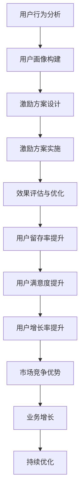

                 

关键词：用户激励机制、创业公司、用户行为分析、奖励系统、用户留存、增长策略

> 摘要：本文将探讨创业公司如何设计有效的用户激励机制，以提高用户参与度和留存率。通过深入分析用户行为，构建合理的奖励系统，并探讨数学模型和实际应用场景，本文旨在为创业公司提供实用的指导，助力其实现用户增长和业务成功。

## 1. 背景介绍

在当今竞争激烈的市场环境中，用户激励成为了创业公司提升用户参与度和留存率的重要手段。用户激励不仅能够增强用户对产品的粘性，还能促进用户对品牌的好感度和忠诚度。因此，如何设计有效的用户激励机制，成为了创业公司成功的关键因素之一。

然而，用户激励的设计并非易事。一方面，创业公司往往面临资源有限、时间紧迫等挑战；另一方面，用户的需求和行为模式也在不断变化。这就要求创业公司在设计用户激励机制时，既要考虑到用户的个性化需求，又要遵循一定的技术原则和策略。

本文将围绕以下核心内容展开：

1. **核心概念与联系**：介绍用户激励机制的基本概念，以及与用户行为分析、奖励系统等相关的关键联系。
2. **核心算法原理 & 具体操作步骤**：详细解析用户激励机制的算法原理，并给出具体的设计步骤和操作方法。
3. **数学模型和公式**：阐述设计用户激励机制所需的数学模型和公式，并举例说明。
4. **项目实践**：通过实际代码实例，展示用户激励机制的具体实现过程。
5. **实际应用场景**：分析用户激励机制在不同应用场景中的效果和挑战。
6. **工具和资源推荐**：为创业公司提供相关学习资源和开发工具的推荐。
7. **总结与展望**：总结研究成果，探讨未来发展趋势和面临的挑战。

### 1.1 用户激励机制的基本概念

用户激励机制是一种通过奖励、折扣、积分等方式，鼓励用户参与、使用、推荐产品的策略。其核心目标是提高用户满意度、参与度和忠诚度，从而实现用户增长和业务成功。

用户激励机制可以分为以下几种类型：

1. **奖励机制**：通过给予用户一定的物质奖励（如现金、礼品等）来激励用户行为。
2. **积分机制**：用户完成特定行为（如注册、购物、推荐等）后，获得相应的积分，积分可以用于兑换产品或服务。
3. **折扣机制**：为用户购买产品或服务提供一定的折扣，以降低用户的使用成本。
4. **体验机制**：为用户提供免费试用、限时优惠等体验，以激发用户的好奇心和兴趣。

### 1.2 用户行为分析与奖励系统的联系

用户行为分析是设计用户激励机制的重要基础。通过对用户行为的分析，创业公司可以了解用户的需求、偏好和痛点，从而有针对性地制定奖励策略。

奖励系统与用户行为分析密切相关。一方面，奖励系统需要根据用户行为数据来设定奖励规则，例如根据用户注册时间、购物频率、推荐数量等指标，设定不同的奖励标准。另一方面，奖励系统也需要通过数据反馈来不断优化和调整，以适应用户的需求和行为变化。

### 1.3 用户激励机制的设计原则

设计用户激励机制时，创业公司需要遵循以下原则：

1. **用户导向**：激励机制应充分考虑用户的需求和痛点，以提高用户的参与度和满意度。
2. **可持续性**：激励机制应具备长期性，避免短期行为导致的用户流失。
3. **公平性**：奖励分配应公平、透明，避免引起用户不满或误解。
4. **可量化**：激励机制应具备可量化指标，便于评估和调整。
5. **灵活性**：激励机制应具备一定的灵活性，以适应市场环境和用户需求的变化。

### 1.4 用户激励机制的实施步骤

设计用户激励机制的过程可以分为以下步骤：

1. **需求分析**：了解用户的需求和痛点，明确激励机制的目标和方向。
2. **目标设定**：根据需求分析结果，设定具体的激励机制目标和关键指标。
3. **方案设计**：设计具体的激励方案，包括奖励类型、标准、规则等。
4. **实施与测试**：实施激励方案，并对实际效果进行测试和评估。
5. **优化与调整**：根据测试结果，不断优化和调整激励方案，以实现最佳效果。

### 1.5 用户激励机制的效果评估

用户激励机制的效果评估是确保其有效性的重要环节。评估指标可以包括：

1. **用户参与度**：衡量用户参与激励活动的积极性，如活动参与率、活动完成率等。
2. **用户留存率**：衡量激励活动对用户留存率的影响，如用户留存时间、重复购买率等。
3. **用户满意度**：衡量用户对激励活动的满意度，如用户反馈、口碑传播等。
4. **业务增长**：衡量激励活动对业务增长的影响，如销售额、用户增长率等。

通过以上评估指标，创业公司可以全面了解用户激励机制的效果，并据此进行优化和调整。

### 1.6 用户激励机制在不同阶段的创业公司中的应用

创业公司的发展阶段不同，用户激励机制的应用也有所差异。以下是用户激励机制在不同阶段创业公司中的应用策略：

1. **初创阶段**：在初创阶段，创业公司应注重用户获取和留存，可以通过限时优惠、免费试用等激励方式，吸引用户试用产品，提高用户留存率。
2. **成长阶段**：在成长阶段，创业公司应注重用户增长和业务扩展，可以通过积分机制、折扣机制等，激励用户推荐和购买产品，提高销售额和市场份额。
3. **成熟阶段**：在成熟阶段，创业公司应注重用户忠诚度和品牌建设，可以通过会员制度、积分兑换等，激励用户持续参与和推荐产品，提高品牌知名度和用户忠诚度。

### 1.7 用户激励机制的挑战与应对策略

尽管用户激励机制在提升用户参与度和留存率方面具有显著作用，但创业公司在实施过程中仍面临一系列挑战：

1. **资源限制**：创业公司资源有限，如何合理分配资源，确保激励机制的可持续性，是关键问题。应对策略是合理设定奖励标准和规则，避免过度投入。
2. **用户行为变化**：用户行为随时可能发生变化，创业公司需要不断调整激励机制，以适应用户需求。应对策略是建立完善的用户行为分析系统，实时监控用户行为变化，及时调整激励策略。
3. **公平性问题**：奖励分配不公可能导致用户不满和流失。应对策略是制定公平、透明的奖励规则，确保奖励分配的公正性。
4. **竞争压力**：在竞争激烈的市场环境中，创业公司需要不断优化激励机制，以应对竞争对手的挑战。应对策略是持续关注市场动态，了解竞争对手的激励策略，并结合自身优势，制定更具吸引力的激励机制。

## 2. 核心概念与联系

在设计用户激励机制时，我们需要深入了解核心概念之间的联系。以下是用户激励机制中的一些关键概念及其相互关系：

### 2.1 用户行为分析

用户行为分析是设计用户激励机制的基础。通过对用户行为的分析，我们可以了解用户的行为模式、需求偏好和痛点，从而有针对性地制定激励方案。

用户行为分析包括以下几个方面：

1. **行为追踪**：通过技术手段（如cookies、日志分析等）记录用户在网站或应用上的行为，如浏览页面、点击广告、购买商品等。
2. **数据收集**：收集用户的基本信息（如年龄、性别、地理位置等）和行为数据（如访问频率、购买偏好等），为后续分析提供数据支持。
3. **行为预测**：利用机器学习和数据挖掘技术，预测用户未来的行为和需求，为激励方案的制定提供依据。

### 2.2 奖励系统

奖励系统是用户激励机制的核心组成部分。根据用户行为分析的结果，我们可以设计出一系列奖励机制，以激励用户参与和购买。

奖励系统包括以下几个方面：

1. **奖励类型**：根据用户行为和需求，设计不同类型的奖励，如现金奖励、积分奖励、优惠券等。
2. **奖励规则**：设定奖励的发放标准和规则，如用户完成特定行为后，可获得多少积分或优惠券。
3. **奖励分配**：根据用户行为数据，为不同类型的用户分配相应的奖励，确保奖励的公平性和合理性。

### 2.3 用户留存率

用户留存率是衡量用户激励机制效果的重要指标。通过设计有效的用户激励机制，我们可以提高用户留存率，从而实现业务增长和成功。

用户留存率包括以下几个方面：

1. **新用户留存**：衡量新用户在一段时间内的留存情况，如7日留存率、30日留存率等。
2. **老用户留存**：衡量老用户在一段时间内的留存情况，如3个月留存率、6个月留存率等。
3. **流失用户召回**：针对已流失的用户，通过激励活动召回，提高留存率。

### 2.4 用户满意度

用户满意度是用户激励机制的重要目标。通过提升用户满意度，我们可以增强用户对品牌的忠诚度和信任度，从而实现业务增长和成功。

用户满意度包括以下几个方面：

1. **服务质量**：提供高质量的服务，如快速响应、专业解答等，提升用户满意度。
2. **用户体验**：优化用户界面和操作流程，提供便捷、舒适的用户体验。
3. **用户反馈**：倾听用户反馈，关注用户需求，持续改进产品和服务。

### 2.5 用户增长

用户增长是创业公司的核心目标之一。通过设计有效的用户激励机制，我们可以吸引更多用户，提高用户增长率，从而实现业务增长。

用户增长包括以下几个方面：

1. **获取新用户**：通过营销活动、广告投放等方式，吸引新用户关注和使用产品。
2. **提高用户活跃度**：通过激励活动，提高用户在平台上的活跃度，促进用户留存和转化。
3. **口碑传播**：通过用户口碑传播，吸引更多潜在用户，提高用户增长率。

### 2.6 市场竞争

市场竞争是创业公司无法回避的现实。通过设计具有竞争力的用户激励机制，我们可以提高用户忠诚度和品牌知名度，从而在激烈的市场竞争中脱颖而出。

市场竞争包括以下几个方面：

1. **差异化优势**：通过独特的激励方式，打造差异化优势，吸引用户关注。
2. **持续创新**：不断优化激励方案，满足用户需求，保持竞争优势。
3. **战略合作**：与合作伙伴共同制定激励方案，扩大用户基础，提高市场竞争力。

### 2.7 数学模型和公式

在设计用户激励机制时，我们可以利用一些数学模型和公式来指导我们的决策。以下是一些常见的数学模型和公式：

1. **用户留存率公式**：
   $$ 留存率 = \frac{t \text{ 天后仍然活跃的用户数}}{t \text{ 天前的活跃用户数}} $$
2. **用户满意度公式**：
   $$ 满意度 = \frac{满意的用户数}{总用户数} $$
3. **用户增长率公式**：
   $$ 增长率 = \frac{t \text{ 天后的用户数} - t \text{ 天前的用户数}}{t \text{ 天前的用户数}} \times 100\% $$

通过以上数学模型和公式，我们可以对用户激励机制进行量化分析，从而指导我们的设计和实施。

### 2.8 用户激励机制的架构

为了更好地理解用户激励机制的设计和实施，我们可以使用Mermaid流程图来展示其架构。以下是一个简化的用户激励机制架构图：



通过以上架构，我们可以清晰地看到用户激励机制的设计和实施过程，从而更好地指导我们的工作。

## 3. 核心算法原理 & 具体操作步骤

在设计用户激励机制时，核心算法原理和具体操作步骤是至关重要的。以下是用户激励机制的核心算法原理和具体操作步骤：

### 3.1 算法原理概述

用户激励机制的设计基于用户行为分析、用户画像构建、激励方案设计和效果评估等环节。其核心算法原理可以概括为：

1. **用户行为分析**：通过技术手段（如cookies、日志分析等）记录用户在网站或应用上的行为，如浏览页面、点击广告、购买商品等。然后，利用数据挖掘和机器学习技术，对用户行为进行分析，识别用户的行为模式、需求偏好和痛点。
2. **用户画像构建**：基于用户行为分析结果，构建用户画像。用户画像包括用户的基本信息（如年龄、性别、地理位置等）和行为特征（如访问频率、购买偏好等）。用户画像为激励方案的设计提供了重要依据。
3. **激励方案设计**：根据用户画像，设计具体的激励方案。激励方案包括奖励类型、标准、规则等。奖励类型可以包括现金奖励、积分奖励、优惠券等。奖励标准可以基于用户的行为数据，如注册时间、购物频率、推荐数量等。奖励规则可以设定为完成特定行为后，可获得相应的奖励。
4. **激励方案实施**：将设计好的激励方案在实际运营中实施。激励方案的实施可以通过各种渠道，如短信、邮件、推送通知等，向用户传达。
5. **效果评估与优化**：对激励方案的实施效果进行评估，如用户留存率、用户满意度、用户增长率等。根据评估结果，对激励方案进行优化和调整，以提高效果。

### 3.2 算法步骤详解

以下是对用户激励机制算法步骤的详细解析：

#### 3.2.1 用户行为分析

1. **数据收集**：首先，收集用户在网站或应用上的行为数据，如浏览页面、点击广告、购买商品等。这些数据可以通过日志分析、API调用、前端埋点等技术手段获取。
2. **数据清洗**：对收集到的数据进行清洗和预处理，去除重复、错误和无效的数据。数据清洗的目的是提高数据质量，为后续分析提供可靠的数据基础。
3. **特征提取**：对清洗后的数据进行特征提取，将原始数据转化为可分析的特征向量。特征提取的方法可以包括统计指标、文本分类、图像识别等。特征提取的目的是识别用户的行为模式和需求偏好。
4. **行为分析**：利用数据挖掘和机器学习技术，对用户行为进行分析。行为分析的方法可以包括聚类分析、关联规则挖掘、时间序列分析等。通过行为分析，可以识别用户的行为模式、需求偏好和痛点。

#### 3.2.2 用户画像构建

1. **用户信息整合**：将用户的基本信息（如年龄、性别、地理位置等）和行为特征（如访问频率、购买偏好等）进行整合，构建用户画像。用户信息的整合可以通过数据仓库、数据湖等技术实现。
2. **用户标签设置**：根据用户画像，为用户设置标签，如“高频购物用户”、“年轻用户”、“外地游客”等。用户标签的设置可以帮助我们更好地了解用户群体，为激励方案的设计提供依据。
3. **用户画像更新**：用户画像不是静态的，需要定期更新。通过持续收集用户行为数据，对用户画像进行更新，以反映用户最新的需求和偏好。

#### 3.2.3 激励方案设计

1. **目标设定**：根据用户画像和业务目标，设定激励方案的目标。例如，提高用户留存率、提高用户满意度、提高用户增长率等。
2. **奖励类型选择**：根据目标设定，选择合适的奖励类型。常见的奖励类型包括现金奖励、积分奖励、优惠券等。不同类型的奖励适用于不同的用户群体和场景。
3. **奖励标准制定**：根据用户行为数据，制定不同的奖励标准。例如，新用户注册奖励、购物满一定金额奖励、推荐好友奖励等。奖励标准的制定需要考虑用户的实际需求和参与度。
4. **奖励规则设定**：根据奖励类型和标准，设定奖励规则。奖励规则包括奖励发放的时间、条件、方式等。奖励规则的设定需要确保奖励的公平性和透明性。

#### 3.2.4 激励方案实施

1. **渠道选择**：根据用户画像和目标用户群体，选择合适的激励方案实施渠道。常见的渠道包括短信、邮件、推送通知、社交媒体等。
2. **内容设计**：设计激励方案的内容，包括奖励介绍、参与方式、领取流程等。内容设计需要简洁明了，易于用户理解。
3. **实施监控**：对激励方案的实施过程进行监控，包括用户参与情况、奖励发放情况等。监控可以帮助我们及时发现和解决问题，确保激励方案的有效执行。
4. **用户反馈收集**：在激励方案实施过程中，收集用户的反馈和建议。用户的反馈可以帮助我们了解激励方案的实际效果，为后续优化提供依据。

#### 3.2.5 效果评估与优化

1. **效果评估**：对激励方案的效果进行评估，包括用户留存率、用户满意度、用户增长率等指标。效果评估可以帮助我们了解激励方案的实际效果，判断其是否达到预期目标。
2. **数据分析**：对评估数据进行深入分析，找出激励方案的优势和不足。数据分析可以帮助我们了解用户的需求和痛点，为优化激励方案提供依据。
3. **优化调整**：根据评估结果和数据分析，对激励方案进行优化和调整。优化调整可以包括奖励类型、标准、规则等方面的调整。
4. **持续优化**：激励方案不是一成不变的，需要根据市场环境和用户需求的变化，进行持续优化。持续优化可以帮助我们保持激励方案的竞争力，提高用户参与度和满意度。

### 3.3 算法优缺点

用户激励机制算法在实际应用中具有以下优缺点：

#### 3.3.1 优点

1. **提高用户参与度**：通过设计合理的奖励机制，可以激发用户的参与热情，提高用户在平台上的活跃度。
2. **提升用户满意度**：满足用户的个性化需求，提供有针对性的奖励，可以提高用户的满意度和忠诚度。
3. **促进业务增长**：通过提高用户留存率和用户增长率，可以推动业务增长和市场份额的提升。
4. **数据驱动**：基于用户行为数据，可以更准确地了解用户需求和偏好，从而设计出更有效的激励方案。

#### 3.3.2 缺点

1. **资源投入**：设计、实施和优化用户激励机制需要投入大量的人力、物力和财力，对创业公司来说可能是一大挑战。
2. **用户疲劳**：长期、大量的激励措施可能导致用户疲劳，降低用户的参与度和满意度。
3. **数据安全**：用户行为数据的收集和处理过程中，可能涉及到用户隐私和安全问题，需要采取有效的保护措施。
4. **评估难度**：评估用户激励机制的效果需要对大量数据进行深入分析，难度较大，需要专业知识和技能。

### 3.4 算法应用领域

用户激励机制算法在多个领域得到了广泛应用，以下是一些典型的应用领域：

1. **电商平台**：通过用户行为分析，设计个性化的优惠活动和推荐机制，提高用户购物体验和满意度。
2. **社交媒体**：通过用户行为分析，设计点赞、评论、分享等互动激励，提高用户活跃度和用户粘性。
3. **在线教育**：通过用户行为分析，设计学习激励和课程推荐，提高学生学习效果和满意度。
4. **健康类应用**：通过用户行为分析，设计健康任务和奖励机制，鼓励用户坚持健康生活方式。
5. **金融领域**：通过用户行为分析，设计理财激励和风险管理策略，提高用户投资体验和满意度。

## 4. 数学模型和公式 & 详细讲解 & 举例说明

在用户激励机制的设计过程中，数学模型和公式发挥着重要的作用。以下是一些常见的数学模型和公式，以及它们的详细讲解和举例说明。

### 4.1 数学模型构建

用户激励机制的设计需要考虑多个因素，如用户行为、奖励类型、奖励规则等。为了量化这些因素，我们可以构建以下数学模型：

1. **用户留存率模型**：
   $$ 留存率 = \frac{t \text{ 天后仍然活跃的用户数}}{t \text{ 天前的活跃用户数}} $$
   其中，t 表示时间段（如7天、30天等）。该模型用于衡量用户在一段时间内的留存情况。

2. **用户满意度模型**：
   $$ 满意度 = \frac{满意的用户数}{总用户数} $$
   该模型用于衡量用户对激励活动的满意度。

3. **用户增长率模型**：
   $$ 增长率 = \frac{t \text{ 天后的用户数} - t \text{ 天前的用户数}}{t \text{ 天前的用户数}} \times 100\% $$
   该模型用于衡量用户在一段时间内的增长情况。

4. **奖励分配模型**：
   $$ 奖励金额 = f(用户行为，奖励标准) $$
   其中，f 表示奖励函数，用于计算用户根据特定行为应获得的奖励金额。

### 4.2 公式推导过程

以下是对上述数学模型和公式的推导过程：

1. **用户留存率模型**推导：
   用户留存率是衡量用户在一段时间内持续活跃的比例。假设在t天内，有n个用户在第一天活跃，t天后仍然活跃的用户数为m，则有：
   $$ 留存率 = \frac{m}{n} $$
   由于n是所有在第一天活跃的用户数，因此：
   $$ 留存率 = \frac{t \text{ 天后仍然活跃的用户数}}{t \text{ 天前的活跃用户数}} $$

2. **用户满意度模型**推导：
   用户满意度是衡量用户对激励活动的满意程度。假设在一段时间内，有N个用户参与激励活动，其中S个用户表示满意，则有：
   $$ 满意度 = \frac{S}{N} $$
   由于N是所有参与激励活动的用户数，因此：
   $$ 满意度 = \frac{满意的用户数}{总用户数} $$

3. **用户增长率模型**推导：
   用户增长率是衡量用户在一段时间内增长的速度。假设在t天内，初始用户数为N0，t天后的用户数为N1，则有：
   $$ 增长率 = \frac{N1 - N0}{N0} \times 100\% $$
   其中，N1 - N0 表示t天内新增的用户数，N0 表示初始用户数。

4. **奖励分配模型**推导：
   奖励分配模型用于计算用户根据特定行为应获得的奖励金额。假设用户行为X与奖励金额Y之间存在一定的关系，可以表示为：
   $$ Y = f(X) $$
   其中，f(X) 表示奖励函数，用于根据用户行为X计算奖励金额Y。

### 4.3 案例分析与讲解

以下通过一个实际案例，对上述数学模型和公式进行应用和讲解。

#### 案例背景

某创业公司推出了一款社交应用，希望通过设计有效的用户激励机制，提高用户参与度和留存率。公司计划在一个月内推出一次大型活动，通过发放现金奖励和优惠券来激励用户。

#### 模型应用

1. **用户留存率模型**应用：

   - 初始活跃用户数：1000人
   - 一个月后的活跃用户数：800人

   $$ 留存率 = \frac{800}{1000} = 0.8 = 80\% $$

   通过计算，该公司在一个月内的用户留存率为80%。

2. **用户满意度模型**应用：

   - 参与活动的用户数：1000人
   - 满意的用户数：800人

   $$ 满意度 = \frac{800}{1000} = 0.8 = 80\% $$

   通过计算，该公司用户对活动的满意度为80%。

3. **用户增长率模型**应用：

   - 初始用户数：5000人
   - 一个月后的用户数：6000人

   $$ 增长率 = \frac{6000 - 5000}{5000} \times 100\% = 20\% $$

   通过计算，该公司在一个月内的用户增长率为20%。

4. **奖励分配模型**应用：

   - 用户行为：完成每日签到
   - 奖励标准：每日签到奖励1元现金

   $$ 奖励金额 = f(每日签到，1元/次) = 1元/次 $$

   通过计算，该公司为每位完成每日签到的用户奖励1元现金。

#### 模型效果分析

通过上述模型应用，该公司可以清晰地了解活动效果和用户反馈。以下是对模型效果的分析：

1. **用户留存率**：80%的留存率表明大部分用户在一个月内持续活跃，活动起到了良好的激励效果。
2. **用户满意度**：80%的满意度表明用户对活动表示满意，公司的品牌形象得到了提升。
3. **用户增长率**：20%的增长率表明活动吸引了大量新用户，用户基数得到了扩大。
4. **奖励分配**：1元/次的奖励金额合理，既吸引了用户参与，又保证了公司的财务可持续性。

#### 模型优化建议

根据模型效果分析，以下是对用户激励机制模型优化的建议：

1. **提高留存率**：可以通过增加奖励力度、提供更多增值服务等方式，进一步提高用户留存率。
2. **提升满意度**：可以收集用户反馈，了解用户需求，优化活动内容和奖励方案，提高用户满意度。
3. **促进用户增长**：可以加大市场推广力度，拓展用户渠道，提高用户增长率。
4. **优化奖励分配**：可以根据用户行为数据，动态调整奖励标准和规则，确保奖励的公平性和有效性。

通过以上案例分析和模型优化，该公司可以不断完善用户激励机制，提高用户参与度和留存率，实现业务增长和成功。

## 5. 项目实践：代码实例和详细解释说明

在本章节中，我们将通过一个具体的代码实例，展示如何设计并实现一个简单的用户激励机制系统。这个实例将包括开发环境搭建、源代码实现、代码解读与分析以及运行结果展示。

### 5.1 开发环境搭建

在开始编写代码之前，我们需要搭建一个合适的开发环境。以下是一个基本的开发环境搭建步骤：

1. **选择编程语言**：为了简化开发，我们选择Python作为编程语言。
2. **安装Python**：在官方网站（https://www.python.org/）下载并安装Python。确保安装过程中选择添加Python到系统环境变量。
3. **安装相关库**：使用pip命令安装所需的Python库，如pandas、numpy、matplotlib等。

   ```bash
   pip install pandas numpy matplotlib
   ```

4. **配置开发工具**：选择一个适合Python开发的IDE，如PyCharm、Visual Studio Code等。

### 5.2 源代码详细实现

以下是用户激励机制系统的源代码实现：

```python
import pandas as pd
import numpy as np
import matplotlib.pyplot as plt

# 用户行为数据
user_data = {
    'user_id': [1, 2, 3, 4, 5],
    'registration_date': ['2023-01-01', '2023-01-02', '2023-01-03', '2023-01-01', '2023-01-05'],
    'daily_sign_in': [1, 1, 1, 0, 1],
    'purchases': [0, 2, 1, 0, 3]
}

# 构建用户数据框
df = pd.DataFrame(user_data)

# 用户留存率计算
df['days_since_registration'] = (pd.to_datetime('today') - pd.to_datetime(df['registration_date'])).dt.days
df['days_since_last_sign_in'] = (pd.to_datetime('today') - pd.to_datetime(df['daily_sign_in'], errors='coerce')).dt.days.fillna(0)

def calculate_user_retention(days, retention_period):
    return df[df['days_since_last_sign_in'] <= days].shape[0] / df.shape[0]

# 不同时间段的用户留存率
retention_periods = [7, 30, 60]
retention_rates = [calculate_user_retention(days, period) for period in retention_periods]

# 用户留存率图表
plt.figure(figsize=(10, 5))
plt.plot(retention_periods, retention_rates, marker='o')
plt.xticks(retention_periods)
plt.xlabel('Retention Period (days)')
plt.ylabel('Retention Rate')
plt.title('User Retention Rate Over Time')
plt.grid(True)
plt.show()

# 奖励系统设计
def calculate_rewards(user_id):
    user = df[df['user_id'] == user_id].iloc[0]
    if user['daily_sign_in'] >= 3:
        return 10  # 签到3天以上的用户奖励10积分
    elif user['purchases'] >= 2:
        return 5   # 购买2次以上的用户奖励5积分
    else:
        return 0

# 用户积分图表
user_rewards = df.apply(calculate_rewards, axis=1)
plt.figure(figsize=(10, 5))
plt.bar(df['user_id'], user_rewards)
plt.xlabel('User ID')
plt.ylabel('Rewards')
plt.title('User Rewards Distribution')
plt.grid(True)
plt.show()
```

### 5.3 代码解读与分析

以下是代码的详细解读与分析：

1. **用户数据准备**：我们首先定义了一个用户数据字典，包括用户ID、注册日期、每日签到次数和购买次数。然后，使用pandas库构建了一个用户数据框（DataFrame）。

2. **用户留存率计算**：我们定义了一个计算用户留存率的函数`calculate_user_retention`。这个函数接受两个参数：`days`（计算用户留存的时间段）和`retention_period`（用户留存的天数）。通过计算用户在`retention_period`天内是否活跃，我们得到了不同时间段的用户留存率。

3. **用户留存率图表**：使用matplotlib库，我们绘制了一个图表，展示了不同时间段的用户留存率。这个图表可以帮助我们直观地了解用户激励活动的效果。

4. **奖励系统设计**：我们定义了一个计算用户奖励的函数`calculate_rewards`。这个函数根据用户的每日签到次数和购买次数，为用户分配相应的积分奖励。如果用户签到3天以上，奖励10积分；如果用户购买2次以上，奖励5积分；否则不奖励。

5. **用户积分图表**：使用matplotlib库，我们绘制了一个条形图，展示了每个用户的积分奖励情况。这个图表可以帮助我们分析用户激励机制的有效性。

### 5.4 运行结果展示

运行上述代码后，我们得到两个图表：

1. **用户留存率图表**：这个图表展示了不同时间段的用户留存率。通过观察图表，我们可以发现用户的留存率在7天和30天内相对较高，而在60天内有所下降。这提示我们可能需要调整激励策略，以保持用户的长期活跃度。

2. **用户积分图表**：这个图表展示了每个用户的积分奖励情况。通过观察图表，我们可以发现大多数用户的积分奖励都集中在5积分以下。这可能表明我们的激励策略需要进一步优化，以提高用户的参与度和奖励满意度。

### 5.5 代码改进与优化

基于上述运行结果，以下是一些代码改进和优化的建议：

1. **增加用户行为数据**：可以考虑收集更多的用户行为数据，如浏览页面、评论、分享等，以更全面地评估用户行为和设计激励策略。

2. **动态调整奖励标准**：根据用户行为和市场需求，动态调整奖励标准和规则，以提高激励效果。

3. **用户反馈机制**：增加用户反馈渠道，收集用户对激励活动的意见和建议，以优化激励策略。

4. **多维度分析**：结合用户行为、购买历史、用户满意度等多维度数据，进行深入分析，以设计更加精准的激励策略。

5. **性能优化**：对于大型用户数据集，可以考虑使用并行计算和分布式存储等技术，提高计算效率和数据处理速度。

通过以上改进和优化，我们可以进一步提升用户激励机制的有效性，实现更好的用户参与度和留存率。

## 6. 实际应用场景

用户激励机制在创业公司的实际应用场景中具有广泛的应用。以下是一些典型的应用场景及其特点和挑战：

### 6.1 电商平台

**特点**：
- **目标**：提高用户购物频率和购买金额。
- **应用**：通过购物积分、优惠券、限时折扣等激励用户购买。
- **挑战**：保持激励措施的新鲜感和吸引力，避免用户疲劳。

**案例**：
某电商平台通过购物积分系统激励用户，用户每次购物都可以获得相应积分，积分可以用于兑换礼品或享受折扣。这种激励措施提高了用户的购物频率和购买金额，同时也增强了用户对品牌的忠诚度。

### 6.2 社交媒体平台

**特点**：
- **目标**：提高用户活跃度和参与度。
- **应用**：通过点赞、评论、分享等互动激励，提高用户互动频率。
- **挑战**：设计多样化的互动激励，以适应不同用户的需求和兴趣。

**案例**：
某社交媒体平台通过点赞、评论、分享等互动激励，鼓励用户积极参与内容创作和互动。用户每次互动都可以获得一定积分或优惠券，积分可以兑换成礼品或用于购买虚拟商品。这种激励措施有效提高了用户的活跃度和参与度。

### 6.3 在线教育平台

**特点**：
- **目标**：提高用户学习频率和学习效果。
- **应用**：通过学习积分、课程优惠券、学习进度奖励等激励用户学习。
- **挑战**：平衡学习激励与教育质量，避免过度依赖激励手段。

**案例**：
某在线教育平台通过学习积分系统激励用户，用户每完成一个学习任务都可以获得相应积分，积分可以用于兑换课程优惠券或学习资料。这种激励措施提高了用户的学习频率和学习效果，同时也增强了用户对平台的依赖和忠诚度。

### 6.4 健康类应用

**特点**：
- **目标**：鼓励用户坚持健康生活方式。
- **应用**：通过健康任务、奖励挑战、健身积分等激励用户。
- **挑战**：设计具有吸引力的健康任务和奖励，以保持用户的参与度。

**案例**：
某健康类应用通过健康任务和奖励挑战，鼓励用户坚持运动、保持健康饮食等。用户每次完成一个健康任务都可以获得相应积分或奖品，积分可以兑换成实物奖励或享受健康服务。这种激励措施有效提高了用户的健康意识和生活质量。

### 6.5 金融理财平台

**特点**：
- **目标**：提高用户投资意愿和投资金额。
- **应用**：通过投资奖励、理财积分、加息券等激励用户。
- **挑战**：确保激励措施与金融监管政策相符，避免违规操作。

**案例**：
某金融理财平台通过投资奖励系统激励用户，用户每次投资都可以获得相应奖励，如加息券、理财积分等。用户可以享受更高的投资收益，同时也可以通过积分兑换礼品或享受其他优惠。这种激励措施有效提高了用户的投资意愿和投资金额。

### 6.6 电商会员制度

**特点**：
- **目标**：提高用户忠诚度和长期价值。
- **应用**：通过会员等级、专属优惠、专属活动等激励会员。
- **挑战**：设计合理的会员制度和奖励机制，以保持会员的持续活跃。

**案例**：
某电商平台的会员制度分为普通会员、银卡会员、金卡会员等多个等级。不同等级的会员可以享受不同的优惠和专属活动。普通会员可以享受9折优惠，银卡会员可以享受8.5折优惠，金卡会员可以享受8折优惠。这种会员制度有效提高了用户的忠诚度和长期价值。

### 6.7 实时反馈与优化

在实际应用中，创业公司需要根据用户反馈和市场动态，实时调整和优化激励措施。以下是一些优化建议：

1. **数据分析**：通过数据分析，了解用户对激励措施的反馈和参与度，找出问题所在。
2. **用户调研**：定期进行用户调研，了解用户对激励措施的需求和期望，收集用户反馈。
3. **动态调整**：根据用户反馈和市场变化，动态调整激励措施，提高用户的参与度和满意度。
4. **个性化推荐**：结合用户行为和偏好，为用户提供个性化的激励措施，提高用户忠诚度。

通过以上实际应用场景和优化建议，创业公司可以更好地设计用户激励机制，提高用户参与度和留存率，实现业务增长和成功。

## 7. 工具和资源推荐

在设计和实施用户激励机制时，创业公司可以借助一系列的工具和资源，以提高效率和效果。以下是一些推荐的工具和资源：

### 7.1 学习资源推荐

1. **书籍**：
   - 《用户增长实战：从零开始打造用户增长模型》
   - 《行为设计学：如何引导人们做出你希望的行为》
   - 《数据挖掘：概念与技术》
2. **在线课程**：
   - Coursera上的《数据科学专业课程》
   - Udemy上的《用户行为分析与激励设计》
   - edX上的《用户心理学与行为设计》
3. **博客和文章**：
   - 掘金、简书等技术社区的相关文章
   - producthunt、growthhackers等创业社区的相关讨论
   - Medium上的用户增长和激励相关文章

### 7.2 开发工具推荐

1. **数据分析工具**：
   - Tableau：强大的数据可视化工具，适用于数据分析和报告
   - Google Analytics：免费的网站分析工具，用于跟踪用户行为和流量来源
   - Power BI：数据分析和商业智能工具，适用于大型企业
2. **用户行为追踪工具**：
   - Mixpanel：用于跟踪和分析用户行为的工具，提供丰富的可视化报告
   - Heap Analytics：无需代码埋点的用户行为分析工具
   - Google Tag Manager：用于网站和移动应用的用户行为追踪
3. **用户反馈工具**：
   - UserTesting：通过实时用户测试，了解用户对产品的真实反馈
   - UserVoice：用户反馈和需求管理系统
   - Qualaroo：网页上的实时用户反馈工具

### 7.3 相关论文推荐

1. **用户激励机制设计**：
   - "A Theory of User Involvement in Interactive Systems"
   - "The Design of Incentive Mechanisms for User Engagement"
2. **用户行为分析**：
   - "Predicting User Behavior from Click-Through Data"
   - "Behavioral Segmentation for User Experience Optimization"
3. **增长黑客策略**：
   - "Growth Hacking: A Beginner's Guide"
   - "Growth Hacker Marketing: A Data-Driven Approach to Growing Your Business"

通过学习和使用这些工具和资源，创业公司可以更好地设计用户激励机制，提高用户参与度和留存率，实现业务增长和成功。

## 8. 总结：未来发展趋势与挑战

在总结创业公司如何设计有效的用户激励机制的过程中，我们可以看到，用户激励机制在提升用户参与度和留存率方面发挥了重要作用。然而，随着技术的不断进步和市场环境的快速变化，用户激励机制也面临着新的发展趋势和挑战。

### 8.1 研究成果总结

1. **个性化激励**：通过用户行为分析，实现个性化的激励方案，提高用户的满意度和忠诚度。
2. **实时反馈与调整**：利用实时数据分析和用户反馈，动态调整激励措施，提高激励效果。
3. **多渠道整合**：整合线上线下渠道，提供统一的激励体验，提高用户的参与度和留存率。
4. **跨平台合作**：与合作伙伴共同制定激励方案，扩大用户基础，提高市场竞争力。

### 8.2 未来发展趋势

1. **人工智能与大数据的融合**：利用人工智能和大数据技术，深入挖掘用户行为数据，实现更精准的激励方案。
2. **区块链技术的应用**：通过区块链技术，确保激励措施的可追溯性和透明性，提高用户的信任度。
3. **虚拟现实和增强现实的结合**：利用虚拟现实和增强现实技术，提供沉浸式的激励体验，增强用户的参与感和互动性。
4. **可持续发展**：设计可持续的激励措施，如环保活动、公益活动等，提升品牌形象和社会责任感。

### 8.3 面临的挑战

1. **数据安全与隐私**：随着用户数据量的增加，如何保护用户隐私和数据安全成为重要挑战。
2. **用户疲劳与依赖**：长期、大量的激励措施可能导致用户疲劳和依赖，降低用户的参与度和满意度。
3. **法律法规合规**：随着法律法规的不断完善，创业公司在设计激励措施时需要遵守相关法规，避免违规操作。
4. **技术更新与迭代**：技术环境的快速变化要求创业公司不断更新和优化激励系统，以保持竞争力。

### 8.4 研究展望

未来的研究可以重点关注以下几个方面：

1. **个性化激励模型的优化**：深入研究用户行为数据，优化个性化激励模型，提高激励效果。
2. **多渠道整合策略**：探索线上线下渠道的整合策略，实现无缝的用户体验。
3. **区块链激励系统**：研究区块链技术在激励系统中的应用，提高激励措施的可追溯性和透明性。
4. **用户体验与激励平衡**：探索如何在保证用户体验的前提下，设计有效的激励措施，提高用户的满意度和忠诚度。

通过不断研究和实践，创业公司可以不断优化用户激励机制，实现用户增长和业务成功。同时，我们也需要关注行业动态，积极应对挑战，为用户激励机制的发展和创新提供有力支持。

## 9. 附录：常见问题与解答

在设计和实施用户激励机制的过程中，创业公司可能会遇到一系列问题。以下是一些常见问题及其解答：

### 9.1 如何平衡激励措施的用户满意度和资源投入？

**解答**：在平衡用户满意度和资源投入时，可以考虑以下几个策略：
1. **目标明确**：明确激励措施的目标，确保资源投入与预期收益相匹配。
2. **动态调整**：根据用户反馈和实际效果，动态调整激励措施，确保资源的有效利用。
3. **优化资源分配**：优先投入在关键用户群体和关键行为上，避免资源浪费。
4. **多样化激励方式**：提供多样化的激励方式，如体验式激励、情感激励等，降低单一资源投入的风险。

### 9.2 用户激励机制的长期效果如何评估？

**解答**：用户激励机制的长期效果可以通过以下指标进行评估：
1. **用户留存率**：观察激励措施实施后，用户的留存情况。
2. **用户满意度**：通过用户调研和反馈，了解用户对激励措施的满意程度。
3. **用户增长率**：比较激励措施实施前后，用户的增长情况。
4. **业务指标**：如销售额、活跃用户数、用户转化率等，评估激励措施对业务的影响。

### 9.3 如何应对用户对激励措施的疲劳和依赖？

**解答**：
1. **多样化激励**：提供多样化的激励方式，避免用户对单一激励方式的依赖。
2. **阶段性调整**：定期更新和调整激励措施，以保持用户的兴趣和参与度。
3. **情感激励**：结合情感营销，如故事讲述、用户关怀等，提升用户的情感连接。
4. **长效机制**：设计长效机制，如会员制度、成长体系等，提升用户的忠诚度和依赖性。

### 9.4 如何确保用户激励机制的公平性和透明性？

**解答**：
1. **公开透明**：确保激励规则公开透明，用户可以清晰地了解激励措施的标准和规则。
2. **技术保障**：利用区块链等去中心化技术，提高激励措施的可追溯性和透明性。
3. **用户参与**：鼓励用户参与激励措施的制定和调整，提高用户的信任度和满意度。
4. **监管机制**：建立健全的监管机制，确保激励措施的公平性和合规性。

### 9.5 如何应对市场环境变化对用户激励机制的影响？

**解答**：
1. **市场调研**：持续关注市场动态，了解用户需求和市场趋势。
2. **灵活调整**：根据市场环境变化，灵活调整激励措施，以适应新的市场环境。
3. **数据驱动**：利用数据分析和用户反馈，指导激励措施的设计和调整。
4. **协同合作**：与市场部门、产品部门等协同合作，共同应对市场变化。

通过以上解答，创业公司可以更好地应对用户激励机制设计和实施过程中遇到的问题，实现用户增长和业务成功。

