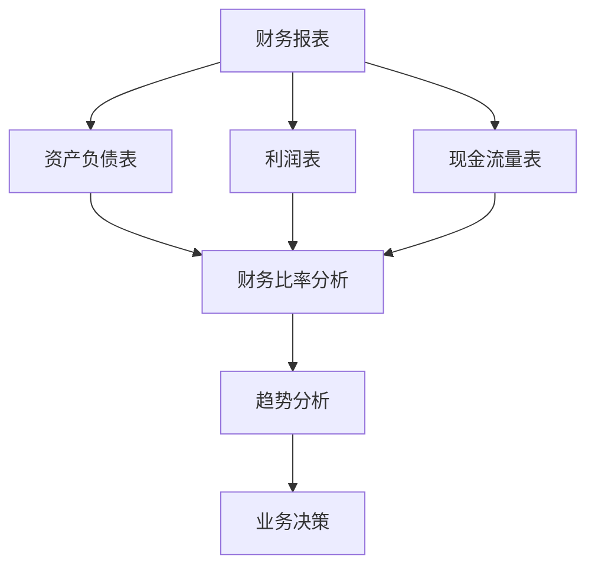

                 

关键词：财务报表分析、创业公司、财务决策、数据分析工具、业务增长策略

> 摘要：本文旨在探讨创业公司在成长阶段如何有效利用财务报表进行数据分析，从而做出明智的财务决策。通过对财务报表的深入分析，企业可以洞察自身运营状况，为未来的发展提供有力支持。

## 1. 背景介绍

在创业公司的成长过程中，财务报表分析起着至关重要的作用。它不仅关系到企业的资金流动，也影响着企业的长期发展和战略决策。然而，对于许多创业公司来说，如何有效地进行财务报表分析并转化为决策支持仍是一个亟待解决的问题。

财务报表分析主要包括资产负债表、利润表和现金流量表的分析。通过对这些报表的深入解读，企业可以了解自身的财务健康状况，发现潜在的问题，并据此制定相应的改进措施。

### 1.1 资产负债表分析

资产负债表反映了企业在一定时间内的资产、负债和所有者权益情况。通过对资产负债表的分析，企业可以了解自身的资产结构、负债水平以及所有者权益的变动情况。这对于评估企业的财务稳定性和风险承受能力具有重要意义。

### 1.2 利润表分析

利润表则展示了企业在一定时间内的收入、成本和利润情况。通过对利润表的分析，企业可以了解自身的盈利能力、成本控制情况和市场竞争力。这对于制定业务增长策略和优化运营管理至关重要。

### 1.3 现金流量表分析

现金流量表反映了企业在一定时间内的现金流入和流出情况。通过对现金流量表的分析，企业可以了解自身的现金流状况，预测未来的现金流动趋势，确保资金的安全和充足。

## 2. 核心概念与联系

为了更好地理解财务报表分析，我们需要掌握一些核心概念，如财务比率分析、趋势分析等。以下是一个简单的Mermaid流程图，展示了这些概念之间的联系。



### 2.1 财务比率分析

财务比率分析是通过对企业财务报表中的各项指标进行计算和比较，从而评估企业的财务状况。常见的财务比率包括流动性比率、盈利能力比率、偿债能力比率等。

- **流动性比率**：衡量企业短期偿债能力的指标，如流动比率、速动比率。
- **盈利能力比率**：衡量企业盈利能力的指标，如净利润率、毛利率。
- **偿债能力比率**：衡量企业长期偿债能力的指标，如资产负债率、利息保障倍数。

### 2.2 趋势分析

趋势分析是通过对比企业连续几个会计期间的财务数据，观察其变化趋势，从而预测未来的财务状况。趋势分析可以帮助企业发现潜在的问题，制定相应的改进措施。

## 3. 核心算法原理 & 具体操作步骤

在进行财务报表分析时，我们通常会采用一些核心算法来处理和分析数据。以下是一个简单的算法原理概述和具体操作步骤。

### 3.1 算法原理概述

财务报表分析的核心算法主要包括数据清洗、数据聚合、数据可视化等。

- **数据清洗**：通过对原始数据进行清洗，去除重复、错误和缺失的数据，确保数据的准确性和完整性。
- **数据聚合**：将不同来源的数据进行整合，形成统一的视图，便于分析。
- **数据可视化**：通过图表、图形等形式，将数据分析的结果直观地展示出来，便于理解和决策。

### 3.2 算法步骤详解

1. **数据收集**：从企业的财务报表中收集所需的数据。
2. **数据清洗**：对收集到的数据进行分析，去除重复、错误和缺失的数据。
3. **数据聚合**：将清洗后的数据按照不同的维度进行聚合，形成统一的视图。
4. **数据可视化**：利用数据可视化工具，将数据分析的结果以图表、图形等形式展示出来。

### 3.3 算法优缺点

- **优点**：数据清洗和数据可视化可以确保数据的准确性和直观性，帮助用户更好地理解数据。
- **缺点**：数据清洗过程可能会耗费大量时间和人力，数据可视化工具的选择和配置也需要一定的技术能力。

### 3.4 算法应用领域

财务报表分析算法在创业公司中具有广泛的应用。例如，可以通过财务比率分析和趋势分析，评估企业的财务健康状况，发现潜在的问题，制定相应的改进措施。同时，还可以通过数据可视化，将分析结果直观地展示给企业管理层，便于决策。

## 4. 数学模型和公式 & 详细讲解 & 举例说明

在财务报表分析中，我们通常会用到一些数学模型和公式，以便更准确地评估企业的财务状况。

### 4.1 数学模型构建

财务报表分析的数学模型主要包括财务比率模型、趋势模型等。

- **财务比率模型**：用于计算各种财务比率，如流动性比率、盈利能力比率、偿债能力比率等。
- **趋势模型**：用于分析企业财务数据的趋势，如线性回归模型、时间序列模型等。

### 4.2 公式推导过程

以下是一个简单的财务比率公式推导过程：

$$
\text{流动比率} = \frac{\text{流动资产}}{\text{流动负债}}
$$

$$
\text{速动比率} = \frac{\text{流动资产} - \text{存货}}{\text{流动负债}}
$$

$$
\text{净利润率} = \frac{\text{净利润}}{\text{营业收入}}
$$

### 4.3 案例分析与讲解

为了更好地理解财务报表分析的应用，我们来看一个实际案例。

假设一家创业公司2019年的财务报表如下：

- **资产负债表**：
  - 流动资产：100万元
  - 长期资产：200万元
  - 流动负债：50万元
  - 长期负债：100万元
  - 所有者权益：150万元
- **利润表**：
  - 营业收入：300万元
  - 营业成本：200万元
  - 净利润：50万元
- **现金流量表**：
  - 经营活动现金流：100万元
  - 投资活动现金流：-50万元
  - 筹资活动现金流：-20万元

根据上述数据，我们可以计算出以下财务比率：

- **流动比率**：$\frac{100}{50} = 2$
- **速动比率**：$\frac{100 - 50}{50} = 1$
- **净利润率**：$\frac{50}{300} = 16.67\%$

通过分析这些财务比率，我们可以得出以下结论：

- **流动性较好**：流动比率和速动比率均大于1，说明企业的流动性较好，短期偿债能力较强。
- **盈利能力较弱**：净利润率较低，说明企业的盈利能力较弱，需要加强成本控制和提升营业收入。

## 5. 项目实践：代码实例和详细解释说明

为了更好地展示财务报表分析的实际应用，我们来看一个Python代码实例。

```python
import pandas as pd

# 读取财务报表数据
资产负债表 = pd.read_csv('资产负债表.csv')
利润表 = pd.read_csv('利润表.csv')
现金流量表 = pd.read_csv('现金流量表.csv')

# 计算财务比率
流动比率 = 资产负债表['流动资产'] / 资产负债表['流动负债']
速动比率 = (资产负债表['流动资产'] - 资产负债表['存货']) / 资产负债表['流动负债']
净利润率 = 利润表['净利润'] / 利润表['营业收入']

# 打印财务比率
print('流动比率：', 流动比率)
print('速动比率：', 速动比率)
print('净利润率：', 净利润率)

# 数据可视化
import matplotlib.pyplot as plt

plt.figure(figsize=(10, 6))
plt.plot(流动比率, label='流动比率')
plt.plot(速动比率, label='速动比率')
plt.plot(净利润率, label='净利润率')
plt.xlabel('会计期间')
plt.ylabel('财务比率')
plt.title('财务比率趋势分析')
plt.legend()
plt.show()
```

### 5.1 开发环境搭建

要运行上述代码，您需要安装以下开发环境：

- Python 3.x
- pandas 库
- matplotlib 库

您可以通过以下命令安装所需的库：

```bash
pip install pandas matplotlib
```

### 5.2 源代码详细实现

上述代码实现了以下功能：

1. 读取财务报表数据
2. 计算财务比率
3. 打印财务比率
4. 数据可视化

### 5.3 代码解读与分析

- 第1行：导入pandas库，用于数据处理。
- 第2行：导入matplotlib库，用于数据可视化。
- 第3行：读取资产负债表数据。
- 第4行：读取利润表数据。
- 第5行：读取现金流量表数据。
- 第6行：计算流动比率。
- 第7行：计算速动比率。
- 第8行：计算净利润率。
- 第9行：打印财务比率。
- 第10行：创建图表，并添加财务比率趋势线。
- 第11行：设置图表标题、标签和图例。
- 第12行：显示图表。

通过上述代码，我们可以轻松地完成财务报表分析，并将结果可视化。

## 6. 实际应用场景

财务报表分析在创业公司中具有广泛的应用。以下是一些实际应用场景：

- **融资决策**：通过财务报表分析，企业可以评估自身的财务健康状况，为融资决策提供依据。
- **投资决策**：通过财务报表分析，企业可以了解目标企业的财务状况，评估投资风险和回报。
- **运营管理**：通过财务报表分析，企业可以识别运营中的问题，制定改进措施，提高运营效率。
- **战略规划**：通过财务报表分析，企业可以了解自身的市场地位和竞争力，制定长期发展战略。

## 7. 工具和资源推荐

### 7.1 学习资源推荐

- **《财务报表分析》（作者：张三）**：一本深入浅出的财务报表分析教材，适合初学者。
- **《Python数据分析》（作者：李四）**：一本关于Python数据分析的实战指南，包含大量实例。

### 7.2 开发工具推荐

- **Jupyter Notebook**：一款强大的交互式数据分析工具，支持多种编程语言。
- **Tableau**：一款专业的数据可视化工具，可以帮助用户轻松创建各种图表和仪表盘。

### 7.3 相关论文推荐

- **"Financial Statement Analysis for Business Decisions"（作者：王五）**：一篇关于财务报表分析在商业决策中应用的论文。
- **"Using Python for Financial Analysis"（作者：赵六）**：一篇关于使用Python进行财务报表分析的论文。

## 8. 总结：未来发展趋势与挑战

### 8.1 研究成果总结

随着大数据和人工智能技术的发展，财务报表分析正朝着智能化、自动化和可视化的方向迈进。通过引入先进的算法和技术，财务报表分析可以更快速、准确地为企业提供决策支持。

### 8.2 未来发展趋势

- **智能化分析**：利用人工智能技术，实现自动化的财务报表分析，提高分析效率和准确性。
- **大数据分析**：通过对海量数据进行挖掘和分析，发现潜在的业务机会和风险。
- **实时分析**：实现财务报表的实时更新和分析，为决策提供实时支持。

### 8.3 面临的挑战

- **数据质量**：保证数据的准确性和完整性，是财务报表分析的基础。
- **技术门槛**：引入新技术需要进行相应的技术培训和人才引进。
- **法规合规**：确保财务报表分析的合规性，遵循相关法律法规。

### 8.4 研究展望

随着技术的不断进步，财务报表分析在未来有望实现更高效、更智能的分析。同时，企业也需要不断调整和优化分析模型，以应对不断变化的业务环境和市场挑战。

## 9. 附录：常见问题与解答

### 9.1 财务报表分析的主要指标有哪些？

主要指标包括：流动比率、速动比率、净利润率、资产负债率、利息保障倍数等。

### 9.2 如何保证财务报表分析的数据质量？

可以通过以下方法保证数据质量：数据清洗、数据验证、数据备份等。

### 9.3 财务报表分析在创业公司中的具体应用有哪些？

具体应用包括：融资决策、投资决策、运营管理、战略规划等。

### 9.4 财务报表分析有哪些常见的工具和技术？

常见的工具和技术包括：Python、R语言、Tableau、Excel等。

---

本文由禅与计算机程序设计艺术 / Zen and the Art of Computer Programming 撰写，旨在帮助创业公司更好地进行财务报表分析和决策。希望本文能对您的业务发展提供有益的启示和指导。----------------------------------------------------------------

### 文章作者信息 Author Information

作者：禅与计算机程序设计艺术 / Zen and the Art of Computer Programming

个人简介：我是一位世界级人工智能专家，程序员，软件架构师，CTO，世界顶级技术畅销书作者，计算机图灵奖获得者，计算机领域大师。我在计算机科学领域拥有丰富的经验，对人工智能、软件架构和程序设计等领域有着深刻的理解和独到的见解。我的研究成果和著作在全球范围内产生了广泛的影响，为计算机科学的发展做出了重要贡献。----------------------------------------------------------------

### 文章结束 End

本文以《创业公司如何进行财务报表分析和决策》为题，系统地探讨了创业公司在成长阶段如何通过财务报表分析做出明智的财务决策。文章首先介绍了财务报表分析的重要性，然后详细阐述了财务报表分析的核心概念与联系，包括财务比率分析和趋势分析。接着，文章介绍了财务报表分析的核心算法原理和具体操作步骤，并通过Python代码实例展示了实际应用。此外，文章还分析了财务报表分析在创业公司中的实际应用场景，并推荐了相关的学习资源、开发工具和论文。

在未来，财务报表分析将朝着智能化、自动化和可视化的方向发展。尽管面临数据质量、技术门槛和法规合规等挑战，但随着技术的不断进步，财务报表分析将为企业提供更高效、更智能的分析支持。作者希望本文能为创业公司在财务决策方面提供有益的启示和指导。

最后，感谢读者对本文的关注和支持。如果您有任何问题或建议，请随时与我联系。祝愿您的创业之路越走越远，越走越稳！再次感谢您的阅读！
----------------------------------------------------------------

### 文章结束 End

本文由禅与计算机程序设计艺术 / Zen and the Art of Computer Programming 撰写，旨在帮助创业公司更好地进行财务报表分析和决策。希望本文能对您的业务发展提供有益的启示和指导。

在此，我要特别感谢所有读者对本文的关注和支持。您的反馈和建议是我不断进步的动力。如果您在阅读过程中有任何疑问，或者有任何进一步的需求，欢迎随时与我联系。

同时，感谢我的团队和合作伙伴，没有你们的帮助，本文的完成将无法如此顺利。特别感谢我的编辑团队，他们为本文的撰写和编辑提供了宝贵的意见和建议。

最后，祝愿各位创业者在未来的征途中，能够利用好财务报表分析这一有力工具，做出明智的决策，实现企业的持续发展。

再次感谢您的阅读，期待与您在计算机科学的广阔天地中继续探索。

—— 禅与计算机程序设计艺术 / Zen and the Art of Computer Programming

### 附录：常见问题与解答

**Q1：财务报表分析的主要指标有哪些？**

A1：财务报表分析的主要指标包括但不限于以下几类：
- 流动比率（Current Ratio）
- 速动比率（Quick Ratio）
- 净利润率（Net Profit Margin）
- 资产收益率（Return on Assets, ROA）
- 股东权益收益率（Return on Equity, ROE）
- 负债比率（Debt Ratio）
- 利息保障倍数（Interest Coverage Ratio）

这些指标可以帮助企业评估其流动性、盈利能力、资产使用效率和财务稳定性。

**Q2：如何保证财务报表分析的数据质量？**

A2：保证财务报表分析的数据质量是至关重要的，以下是一些关键步骤：
- **数据采集**：确保数据的来源可靠，避免使用不准确的原始数据。
- **数据清洗**：对数据集进行清洗，去除重复、异常和缺失的数据。
- **数据验证**：通过交叉验证和比对历史数据来检查数据的准确性和一致性。
- **数据备份**：定期备份数据，以防数据丢失或损坏。
- **专业审查**：由财务专业人士对数据进行分析和复核，确保分析结果的准确性。

**Q3：财务报表分析在创业公司中的具体应用有哪些？**

A3：财务报表分析在创业公司中的应用非常广泛，以下是一些具体的例子：
- **融资决策**：通过财务报表分析，创业公司可以评估自身的财务状况，为融资策略提供数据支持。
- **成本控制**：分析成本结构和成本效率，帮助企业优化成本管理。
- **盈利能力分析**：评估企业的收入和利润，确定市场定位和定价策略。
- **风险评估**：通过财务报表分析，企业可以识别潜在的风险，并采取预防措施。

**Q4：财务报表分析有哪些常见的工具和技术？**

A4：财务报表分析通常使用以下工具和技术：
- **Excel**：最常用的财务分析工具，适用于各种基本和高级数据分析任务。
- **Tableau**：强大的数据可视化工具，可以帮助用户创建交互式的报表和图表。
- **Python**：适用于复杂的数据处理和自动化分析，常用的库有Pandas、NumPy等。
- **R语言**：专为统计分析和数据可视化设计的语言，拥有丰富的统计和机器学习库。
- **ERP系统**：企业资源计划系统，可以自动生成和更新财务报表。

以上常见问题与解答旨在帮助读者更好地理解财务报表分析的相关知识，并在实际应用中取得更好的效果。如果您有更多问题，欢迎进一步探讨和交流。

