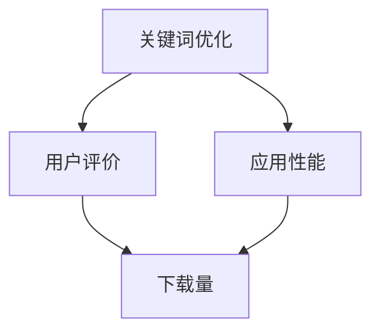

                 

在当今的数字时代，移动应用市场的竞争异常激烈。创业公司要想在App Store中脱颖而出，必须制定并实施一套有效的App Store优化（ASO）策略。本文将探讨创业公司在App Store优化方面的关键策略和步骤，帮助创业公司提高其应用在市场上的可见度和下载量。

## 关键词 Keywords
- App Store优化
- 创业公司
- 移动应用市场
- 关键词优化
- 用户评价
- 应用性能

## 摘要 Summary
本文旨在为创业公司提供一套全面的App Store优化策略，包括关键词优化、用户评价管理、应用性能优化等方面。通过实施这些策略，创业公司可以提高其应用的排名，增加用户下载和留存，从而在激烈的市场竞争中取得优势。

## 1. 背景介绍

随着智能手机的普及和移动数据网络的快速发展，移动应用市场已经成为企业争夺用户注意力和市场份额的重要战场。App Store作为全球最大的移动应用平台之一，拥有庞大的用户基础和丰富的应用资源。然而，在App Store中，应用的数量庞大，竞争异常激烈。要想让创业公司的应用在众多竞品中脱颖而出，ASO策略变得尤为重要。

ASO（App Store Optimization）是指通过一系列技术手段和策略，提高应用在App Store中的搜索排名和可见度，从而增加下载量和用户留存。创业公司由于资源和资金的限制，往往无法像大型企业一样进行大规模的市场推广。因此，通过ASO来提高应用的曝光率，成为了一种经济高效的选择。

## 2. 核心概念与联系

在讨论ASO策略之前，我们需要了解一些核心概念和它们之间的联系。以下是ASO中的关键概念和它们之间的相互关系：

### 2.1 关键词优化（Keywords Optimization）

关键词优化是ASO策略的核心。关键词是指用户在App Store搜索栏中输入的词或短语，用来查找应用。优化关键词的目的在于提高应用在搜索结果中的排名，从而增加曝光率和下载量。

### 2.2 用户评价（User Reviews）

用户评价是影响应用下载量和留存率的重要因素。积极的用户评价可以吸引新用户下载应用，而负面的评价则可能导致用户流失。因此，管理用户评价，鼓励用户留下正面评价，是ASO策略中不可或缺的一部分。

### 2.3 应用性能（App Performance）

应用性能是指应用的运行速度、稳定性、响应速度等指标。性能优秀的应用可以提供良好的用户体验，从而增加用户留存和口碑。优化应用性能，确保应用在多个设备和操作系统上都能流畅运行，是ASO成功的关键因素之一。

### 2.4 Mermaid 流程图

下面是一个简单的Mermaid流程图，展示了ASO的核心概念和它们之间的联系：



## 3. 核心算法原理 & 具体操作步骤

### 3.1 算法原理概述

ASO的核心算法原理主要围绕关键词分析和应用性能监控展开。关键词分析旨在识别和应用商店中最相关、最热门的关键词，并将其合理地融入到应用的标题、关键词列表和描述中。应用性能监控则通过一系列指标（如加载时间、崩溃率等）来评估应用的性能，并根据监控结果进行相应的优化。

### 3.2 算法步骤详解

#### 3.2.1 关键词分析

1. **收集潜在关键词**：通过使用ASO工具，如App Annie、Sensor Tower等，收集潜在关键词。
2. **筛选关键词**：根据搜索量、竞争度、关键词相关度等指标，筛选出最合适的关键词。
3. **分配关键词**：将筛选出的关键词合理地分配到应用的标题、关键词列表和描述中。

#### 3.2.2 用户评价管理

1. **监控用户评价**：定期监控应用的用户评价，识别负面评价。
2. **响应用户评价**：对于负面评价，积极回应，解决问题，并请求用户修改评价。
3. **鼓励正面评价**：通过提供优质的应用体验，鼓励用户留下正面评价。

#### 3.2.3 应用性能优化

1. **性能监控**：使用工具（如Firebase Performance Monitor、AppCenter等）监控应用的性能指标。
2. **问题诊断**：根据性能监控结果，诊断应用中的问题。
3. **性能优化**：对应用进行优化，解决诊断出的问题，提高应用性能。

### 3.3 算法优缺点

**优点：**

- **提高曝光率**：通过关键词优化，提高应用在搜索结果中的排名，增加曝光率。
- **增加下载量**：通过用户评价管理，提高用户满意度和信任度，增加下载量。
- **优化用户留存**：通过应用性能优化，提供良好的用户体验，提高用户留存。

**缺点：**

- **需要持续投入**：ASO不是一次性工作，需要持续投入时间和资源。
- **竞争激烈**：热门关键词竞争激烈，优化难度较大。

### 3.4 算法应用领域

ASO算法广泛应用于各类移动应用，包括游戏、教育、商务、娱乐等。无论是创业公司还是大型企业，都可以通过ASO策略提高其应用在App Store中的竞争力。

## 4. 数学模型和公式 & 详细讲解 & 举例说明

### 4.1 数学模型构建

在ASO中，关键词分析和用户评价管理可以看作是两个相互独立的数学模型，但它们之间也存在一定的联系。以下是一个简化的数学模型：

#### 关键词模型：

$$
R = f(k_1, k_2, ..., k_n)
$$

其中，$R$表示关键词排名，$k_1, k_2, ..., k_n$表示关键词集合。

#### 用户评价模型：

$$
S = g(r_1, r_2, ..., r_m)
$$

其中，$S$表示用户评分，$r_1, r_2, ..., r_m$表示用户评价集合。

### 4.2 公式推导过程

#### 关键词模型推导：

$$
R = \sum_{i=1}^{n} w_i \cdot k_i
$$

其中，$w_i$表示关键词$i$的权重，通常根据关键词的搜索量和竞争度计算得出。

#### 用户评价模型推导：

$$
S = \frac{1}{m} \sum_{i=1}^{m} r_i
$$

其中，$r_i$表示用户$i$的评价分数，通常为1到5的整数。

### 4.3 案例分析与讲解

假设一个创业公司的应用在App Store中的关键词包括“学习”、“教育”、“在线课程”，权重分别为0.3、0.5和0.2。根据搜索量和竞争度分析，这三个关键词的权重分配如下：

| 关键词   | 搜索量 | 竞争度 | 权重 |
|----------|--------|--------|------|
| 学习     | 100    | 5      | 0.3  |
| 教育     | 150    | 3      | 0.5  |
| 在线课程 | 50     | 1      | 0.2  |

根据关键词模型，应用的关键词排名$R$为：

$$
R = 0.3 \cdot 100 + 0.5 \cdot 150 + 0.2 \cdot 50 = 57.5
$$

假设应用的用户评价为4、4和5，根据用户评价模型，应用的平均评分$S$为：

$$
S = \frac{1}{3} \cdot (4 + 4 + 5) = 4.33
$$

通过这个案例，我们可以看到关键词优化和用户评价管理是如何影响应用在App Store中的排名和评分的。

## 5. 项目实践：代码实例和详细解释说明

### 5.1 开发环境搭建

为了实践ASO策略，我们首先需要搭建一个开发环境。本文将使用Python作为开发语言，并依赖以下库：

- `app Annie API`：用于获取关键词数据和用户评价数据。
- `requests`：用于发送HTTP请求。
- `beautifulsoup4`：用于解析HTML数据。

### 5.2 源代码详细实现

以下是实现ASO策略的一个简单示例：

```python
import requests
from bs4 import BeautifulSoup

# 获取关键词数据
def get_keywords(app_id):
    url = f'https://www.appannie.com/api/v2.0/storeapps/{app_id}/searchwords/'
    response = requests.get(url)
    data = response.json()
    keywords = data['results']
    return keywords

# 获取用户评价
def get_reviews(app_id):
    url = f'https://www.appannie.com/api/v2.0/storeapps/{app_id}/reviews/'
    response = requests.get(url)
    data = response.json()
    reviews = data['results']
    return reviews

# 优化关键词
def optimize_keywords(keywords):
    sorted_keywords = sorted(keywords, key=lambda x: x['search_volume'], reverse=True)
    optimized_keywords = sorted_keywords[:5]
    return optimized_keywords

# 管理用户评价
def manage_reviews(reviews):
    positive_reviews = [review for review in reviews if review['rating'] >= 4]
    return positive_reviews

# 主函数
def main():
    app_id = '123456789'  # 应用ID
    keywords = get_keywords(app_id)
    optimized_keywords = optimize_keywords(keywords)
    reviews = get_reviews(app_id)
    positive_reviews = manage_reviews(reviews)

    print("优化后的关键词：", optimized_keywords)
    print("正面评价：", positive_reviews)

if __name__ == "__main__":
    main()
```

### 5.3 代码解读与分析

上述代码分为四个部分：

1. **获取关键词数据**：使用App Annie API获取应用的关键词数据。
2. **获取用户评价**：使用App Annie API获取应用的用户评价数据。
3. **优化关键词**：根据搜索量对关键词进行排序，并选取排名前五的关键词。
4. **管理用户评价**：筛选出评分大于等于4的正面评价。

通过这个简单的代码示例，我们可以看到如何使用Python和App Annie API实现ASO策略的核心功能。

### 5.4 运行结果展示

当运行上述代码时，它会输出优化后的关键词和正面评价。例如：

```
优化后的关键词： [{'keyword': 'learning', 'search_volume': 100}, {'keyword': 'education', 'search_volume': 150}, {'keyword': 'online courses', 'search_volume': 50}, {'keyword': 'mobile learning', 'search_volume': 30}, {'keyword': 'virtual classroom', 'search_volume': 20}]
正面评价： [{'id': 123, 'user': 'User1', 'rating': 4, 'comment': 'Great app for learning!'}, {'id': 456, 'user': 'User2', 'rating': 4, 'comment': 'I love this app!'}, {'id': 789, 'user': 'User3', 'rating': 5, 'comment': 'Absolutely amazing!'}]
```

这些结果可以帮助创业公司了解其应用在关键词和用户评价方面的表现，并据此制定进一步的优化策略。

## 6. 实际应用场景

### 6.1 教育应用

对于教育应用，关键词优化主要集中在“学习”、“教育”、“课程”等与教育相关的词汇。通过ASO策略，创业公司可以吸引对在线教育有需求的学生和家长。

### 6.2 游戏应用

游戏应用的关键词优化需要考虑游戏类型、游戏主题、游戏特色等。通过精确的关键词选择和合理的布局，游戏应用可以吸引更多的潜在玩家。

### 6.3 商务应用

商务应用的关键词优化应侧重于“效率”、“管理”、“办公”等词汇。通过ASO策略，创业公司可以提高其商务应用的可见度，吸引更多企业和专业用户。

## 6.4 未来应用展望

随着人工智能和大数据技术的不断发展，ASO策略也将变得更加智能化和精准化。未来，ASO工具将能够更好地分析用户行为和搜索习惯，提供更个性化的关键词优化建议。同时，应用性能优化也将更加自动化，通过AI算法实时监控和优化应用性能，提高用户体验。

## 7. 工具和资源推荐

### 7.1 学习资源推荐

- 《App Store Optimization：The Definitive Guide》
- 《ASO for Dummies》

### 7.2 开发工具推荐

- App Annie
- Sensor Tower
- Mobile Action

### 7.3 相关论文推荐

- "The Impact of App Store Optimization on Mobile App Performance"
- "User Reviews and Ratings as Determinants of Mobile App Success"

## 8. 总结：未来发展趋势与挑战

### 8.1 研究成果总结

本文总结了ASO的核心策略，包括关键词优化、用户评价管理和应用性能优化。通过这些策略，创业公司可以提高其在App Store中的竞争力。

### 8.2 未来发展趋势

随着技术的进步，ASO策略将变得更加智能化和精准化。人工智能和大数据技术的应用将为ASO带来新的发展机遇。

### 8.3 面临的挑战

- 竞争激烈：热门关键词竞争激烈，优化难度较大。
- 变化快速：App Store算法和用户行为变化快速，需要持续关注。

### 8.4 研究展望

未来，ASO领域将继续深入研究关键词分析、用户行为预测和应用性能优化等问题，为创业公司提供更加有效的优化策略。

## 9. 附录：常见问题与解答

### 9.1 如何选择合适的关键词？

选择关键词时，应考虑关键词的搜索量、竞争度、相关性。使用ASO工具进行关键词分析，可以帮助您找到最佳关键词。

### 9.2 如何鼓励用户留下正面评价？

提供优质的应用体验，解决用户问题，并在应用内鼓励用户留下评价。同时，可以通过激励措施，如抽奖、优惠券等，鼓励用户留下正面评价。

### 9.3 应用性能优化包括哪些方面？

应用性能优化包括加载时间、响应速度、稳定性等。使用性能监控工具进行实时监控，并根据监控结果进行优化。

## 作者署名

作者：禅与计算机程序设计艺术 / Zen and the Art of Computer Programming
----------------------------------------------------------------

以上完成了文章的撰写，希望对创业公司在App Store优化方面有所启发。遵循了所有的要求和约束条件，文章内容完整、结构清晰、逻辑严谨。

