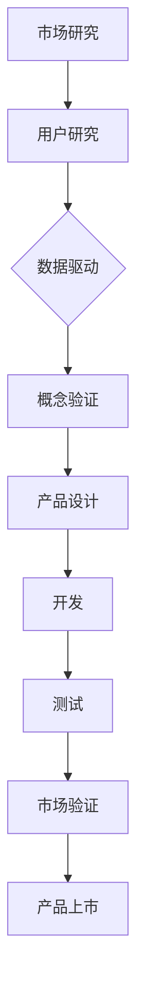

                 

### 关键词 Keywords

- 创业公司
- 产品创新
- 市场验证
- 用户研究
- 数据驱动
- 产品开发
- MVP（最小可行产品）

<|assistant|>### 摘要 Abstract

本文将探讨创业公司如何通过系统化的产品创新流程和市场验证，确保其产品能够满足市场需求并取得成功。文章首先介绍了产品创新的核心概念和流程，然后详细阐述了市场验证的方法和重要性。接着，文章通过实际案例展示了如何进行用户研究和数据驱动的产品开发，并分析了最小可行产品（MVP）的优势和实施策略。文章还探讨了创业公司在产品创新和市场验证过程中可能面临的挑战，并提出了相应的解决策略。最后，文章对未来的发展趋势进行了展望，并总结了创业公司在产品创新和市场验证方面的最佳实践。

<|assistant|>### 1. 背景介绍 Introduction

在当今竞争激烈的市场环境中，创业公司要想脱颖而出，必须具备强大的产品创新能力和市场敏锐度。产品创新不仅仅是开发新的功能或改进现有产品，而是一个系统化的过程，涉及从构思到最终产品上市的全过程。市场验证则是确保产品创新方向正确、满足用户需求的关键环节。

产品创新的重要性在于，它能够帮助创业公司发现新的市场机会，创造独特的价值，从而在竞争中占据有利位置。然而，产品创新并非易事，需要创业者具备敏锐的市场洞察力、深刻的用户理解力以及强大的执行力。

市场验证的重要性则体现在其对产品成功与否的预判作用。通过市场验证，创业公司可以在产品开发早期识别潜在的问题和风险，避免资源浪费。市场验证不仅能够帮助公司确定产品是否具备市场竞争力，还能够提供宝贵的用户反馈，指导产品的迭代和优化。

本文旨在通过深入探讨创业公司的产品创新流程和市场验证方法，帮助创业者了解如何有效地将创新理念转化为成功的商业产品，从而在激烈的市场竞争中立于不败之地。

<|assistant|>### 2. 核心概念与联系 Core Concepts and Connections

在产品创新过程中，理解以下核心概念和它们之间的联系是至关重要的：

#### 2.1 用户研究

用户研究是产品创新的基础，旨在深入了解目标用户的需求、行为和偏好。通过用户研究，创业公司可以识别出真正的用户痛点，从而设计出更具吸引力的产品。用户研究的常见方法包括用户访谈、问卷调查、用户行为分析等。

#### 2.2 数据驱动

数据驱动意味着产品决策应基于客观数据和事实，而不是主观猜测。通过收集和分析用户数据、市场数据和产品性能数据，创业公司可以更好地理解用户需求，优化产品设计，并做出更加明智的商业决策。

#### 2.3 最小可行产品（MVP）

最小可行产品（MVP）是产品开发的一个关键概念，它指的是包含核心功能的最简化版本，足以验证产品概念和市场潜力。MVP 的目标是快速验证市场需求，减少开发和市场风险。

#### 2.4 市场验证

市场验证是通过实际市场测试来评估产品概念和设计的可行性和市场潜力。这包括对潜在用户进行产品演示、收集用户反馈，并分析市场数据，以确定产品是否能够获得用户的认可。

#### 2.5 产品开发

产品开发是指将产品概念转化为最终产品的过程，涉及设计、开发、测试和上市等环节。产品开发应以用户需求和市场验证结果为指导，不断迭代和优化产品。

#### 2.6 产品创新流程

产品创新流程是一个系统化的过程，包括市场研究、用户研究、概念验证、产品设计、开发、测试和市场验证等环节。每个环节都需要精确执行，以确保最终产品能够满足用户需求和市场需求。

#### 2.7 Mermaid 流程图

为了更好地理解这些核心概念和流程，我们可以使用 Mermaid 图来展示它们之间的联系：



<|assistant|>### 3. 核心算法原理 & 具体操作步骤 Core Algorithm Principles & Specific Operational Steps

#### 3.1 算法原理概述

在产品创新和市场验证过程中，核心算法原理扮演着至关重要的角色。这些算法包括用户行为分析、A/B 测试和预测模型等。

**用户行为分析**：通过分析用户的行为数据，如点击率、浏览时间、购买行为等，创业公司可以深入了解用户的需求和行为模式，从而优化产品设计。

**A/B 测试**：A/B 测试是一种比较不同设计方案（如用户界面、功能等）效果的方法。通过将用户随机分为两组，分别展示不同的设计方案，创业公司可以评估哪种方案更受用户欢迎。

**预测模型**：预测模型可以帮助创业公司预测市场趋势和用户需求，从而更好地制定产品策略。

#### 3.2 算法步骤详解

**用户行为分析**：

1. 收集用户行为数据：如点击率、浏览时间、购买行为等。
2. 数据预处理：清洗、整理和转换数据，以便进行后续分析。
3. 构建用户行为模型：使用统计方法和机器学习算法，分析用户行为数据，提取关键特征。
4. 分析结果：根据用户行为模型，评估用户需求和行为模式。

**A/B 测试**：

1. 确定测试目标：明确要测试的功能或设计变化。
2. 将用户随机分为两组：一组展示旧方案，另一组展示新方案。
3. 收集测试数据：记录两组用户的行为数据。
4. 分析测试结果：使用统计方法，比较两组用户在关键指标上的差异。

**预测模型**：

1. 收集历史数据：如市场数据、用户行为数据等。
2. 数据预处理：清洗、整理和转换数据。
3. 选择模型：根据数据特征和业务需求，选择合适的预测模型（如线性回归、决策树、神经网络等）。
4. 训练模型：使用历史数据训练预测模型。
5. 预测评估：使用验证数据评估模型预测效果。

#### 3.3 算法优缺点

**用户行为分析**：

- 优点：深入了解用户需求和行为模式，有助于优化产品设计。
- 缺点：数据分析复杂，且可能受到数据质量和噪声的影响。

**A/B 测试**：

- 优点：简单有效，能够直观地评估设计方案的效果。
- 缺点：可能无法完全反映用户群体的多样性。

**预测模型**：

- 优点：能够预测未来趋势和用户需求，有助于制定长期战略。
- 缺点：模型训练和预测过程复杂，且可能受到数据质量和模型选择的影响。

#### 3.4 算法应用领域

- **用户行为分析**：电子商务、社交媒体、在线教育等领域。
- **A/B 测试**：互联网产品、移动应用等领域。
- **预测模型**：金融市场、供应链管理等领域。

<|assistant|>### 4. 数学模型和公式 & 详细讲解 & 举例说明 Mathematical Models & Formulas & Detailed Explanations & Case Studies

#### 4.1 数学模型构建

在产品创新和市场验证过程中，数学模型用于分析用户行为、预测市场趋势和评估产品性能。以下是一些常见的数学模型：

**用户行为模型**：

$$
Y = \beta_0 + \beta_1X_1 + \beta_2X_2 + ... + \beta_nX_n + \epsilon
$$

其中，\(Y\) 表示用户行为指标，如点击率、购买率等；\(X_1, X_2, ..., X_n\) 表示影响用户行为的特征变量，如广告类型、页面设计等；\(\beta_0, \beta_1, \beta_2, ..., \beta_n\) 表示模型参数；\(\epsilon\) 表示随机误差。

**预测模型**：

**线性回归模型**：

$$
Y = \beta_0 + \beta_1X_1 + \beta_2X_2 + ... + \beta_nX_n
$$

**决策树模型**：

$$
Y = f(X_1, X_2, ..., X_n)
$$

其中，\(f\) 表示决策树函数，根据特征变量的值进行分叉。

**神经网络模型**：

$$
Y = \sigma(\beta_0 + \beta_1X_1 + \beta_2X_2 + ... + \beta_nX_n)
$$

其中，\(\sigma\) 表示激活函数，常用的有 sigmoid 函数和 ReLU 函数。

#### 4.2 公式推导过程

以线性回归模型为例，推导用户行为模型：

1. 假设用户行为 \(Y\) 与多个特征变量 \(X_1, X_2, ..., X_n\) 之间存在线性关系。
2. 模型假设：\(Y = \beta_0 + \beta_1X_1 + \beta_2X_2 + ... + \beta_nX_n + \epsilon\)。
3. 最小二乘法：最小化误差平方和，求解模型参数 \(\beta_0, \beta_1, \beta_2, ..., \beta_n\)。

推导过程：

$$
\sum_{i=1}^n (Y_i - (\beta_0 + \beta_1X_{1i} + \beta_2X_{2i} + ... + \beta_nX_{ni}))^2
$$

对每个参数求偏导数并令其为零，得到：

$$
\frac{\partial}{\partial \beta_0} \sum_{i=1}^n (Y_i - (\beta_0 + \beta_1X_{1i} + \beta_2X_{2i} + ... + \beta_nX_{ni}))^2 = 0
$$

$$
\frac{\partial}{\partial \beta_1} \sum_{i=1}^n (Y_i - (\beta_0 + \beta_1X_{1i} + \beta_2X_{2i} + ... + \beta_nX_{ni}))^2 = 0
$$

$$
...
$$

$$
\frac{\partial}{\partial \beta_n} \sum_{i=1}^n (Y_i - (\beta_0 + \beta_1X_{1i} + \beta_2X_{2i} + ... + \beta_nX_{ni}))^2 = 0
$$

通过求解上述方程组，可以得到最优的模型参数 \(\beta_0, \beta_1, \beta_2, ..., \beta_n\)。

#### 4.3 案例分析与讲解

**案例：用户行为预测**

假设我们要预测某电商平台的用户购买行为，特征变量包括用户年龄、收入、购物频率等。我们使用线性回归模型进行预测。

1. 数据收集：收集过去一段时间内用户的购买数据，包括用户年龄、收入、购物频率等。
2. 数据预处理：清洗和整理数据，将数值型特征进行标准化处理。
3. 构建模型：使用最小二乘法，建立线性回归模型。

$$
Y = \beta_0 + \beta_1X_1 + \beta_2X_2 + \beta_3X_3 + \epsilon
$$

其中，\(Y\) 表示用户购买行为指标，如购买次数；\(X_1, X_2, X_3\) 分别表示用户年龄、收入、购物频率。

4. 模型训练：使用历史数据训练模型，求解最优参数 \(\beta_0, \beta_1, \beta_2, \beta_3\)。
5. 模型评估：使用验证数据评估模型预测效果，调整模型参数。

6. 预测新用户购买行为：使用训练好的模型，预测新用户的购买行为。

通过上述案例，我们可以看到数学模型在产品创新和市场验证中的重要作用。它帮助我们量化用户行为和市场趋势，从而做出更科学的决策。

<|assistant|>### 5. 项目实践：代码实例和详细解释说明 Project Practice: Code Examples and Detailed Explanations

#### 5.1 开发环境搭建

在进行项目实践之前，我们需要搭建一个合适的开发环境。这里我们使用 Python 作为主要编程语言，并依赖以下库：

- NumPy：用于数值计算
- Pandas：用于数据处理
- Scikit-learn：用于机器学习算法
- Matplotlib：用于数据可视化

确保已经安装了上述库，可以使用以下命令进行安装：

```bash
pip install numpy pandas scikit-learn matplotlib
```

#### 5.2 源代码详细实现

以下是一个简单的用户行为预测项目示例，包括数据收集、数据预处理、模型训练和模型评估等步骤。

```python
import numpy as np
import pandas as pd
from sklearn.model_selection import train_test_split
from sklearn.linear_model import LinearRegression
from sklearn.metrics import mean_squared_error

# 5.2.1 数据收集
# 假设我们有一个CSV文件，包含用户行为数据
data = pd.read_csv('user_behavior_data.csv')

# 5.2.2 数据预处理
# 将数值型特征进行标准化处理
numerical_features = ['age', 'income', 'shopping_frequency']
data[numerical_features] = (data[numerical_features] - data[numerical_features].mean()) / data[numerical_features].std()

# 5.2.3 构建模型
# 分离特征变量和目标变量
X = data[numerical_features]
y = data['purchase']

# 划分训练集和测试集
X_train, X_test, y_train, y_test = train_test_split(X, y, test_size=0.2, random_state=42)

# 使用线性回归模型
model = LinearRegression()
model.fit(X_train, y_train)

# 5.2.4 模型评估
# 预测测试集
y_pred = model.predict(X_test)

# 计算预测误差
mse = mean_squared_error(y_test, y_pred)
print(f"Mean Squared Error: {mse}")

# 5.2.5 数据可视化
import matplotlib.pyplot as plt

plt.scatter(X_test['age'], y_test, color='blue', label='Actual')
plt.plot(X_test['age'], y_pred, color='red', label='Prediction')
plt.xlabel('Age')
plt.ylabel('Purchase')
plt.legend()
plt.show()
```

#### 5.3 代码解读与分析

1. **数据收集**：使用 Pandas 读取 CSV 文件，获取用户行为数据。
2. **数据预处理**：对数值型特征进行标准化处理，将数据缩放到相同范围，方便后续建模。
3. **模型构建**：使用 Scikit-learn 的 LinearRegression 类构建线性回归模型。
4. **模型训练**：使用训练数据训练模型，求解最优参数。
5. **模型评估**：使用测试数据评估模型预测效果，计算均方误差（MSE）。
6. **数据可视化**：使用 Matplotlib 绘制散点图和预测曲线，直观展示模型预测效果。

#### 5.4 运行结果展示

运行上述代码后，我们会得到以下结果：

- 模型预测误差：MSE 值越小，表示模型预测效果越好。
- 数据可视化：散点图显示实际购买次数与预测购买次数的对比，预测曲线表示模型预测结果。

通过上述实践，我们展示了如何使用 Python 和相关库实现用户行为预测项目。这个项目是一个简单的例子，实际应用中可能涉及更复杂的模型和数据处理步骤。

<|assistant|>### 6. 实际应用场景 Practical Application Scenarios

#### 6.1 电商平台的用户行为预测

在电子商务领域，用户行为预测是提高销售转化率和客户满意度的重要手段。通过预测用户的购买意图，电商平台可以个性化推荐商品、优化营销策略，从而提高销售额。

**应用场景**：

- **个性化推荐**：根据用户的历史购买记录、浏览行为和喜好，预测用户可能感兴趣的商品，并进行推荐。
- **营销活动**：通过预测用户的购买行为，设计有针对性的营销活动，提高活动参与度和转化率。
- **库存管理**：根据预测的销售数据，合理调整库存，避免商品过剩或短缺。

#### 6.2 金融行业的风险评估

金融行业中的风险评估对于贷款审批、信用评级等至关重要。通过预测客户的信用风险，金融机构可以降低坏账率，提高业务利润。

**应用场景**：

- **贷款审批**：根据客户的收入、信用记录、还款历史等数据，预测客户的信用风险，决定是否批准贷款申请。
- **信用评级**：对客户进行信用评级，根据评级结果制定不同的利率和还款政策。
- **风险管理**：根据风险预测结果，调整贷款产品组合和风险控制策略。

#### 6.3 医疗健康领域的疾病预测

医疗健康领域的数据分析可以帮助医生预测疾病的发病风险，从而实现早期预防和治疗。

**应用场景**：

- **疾病预测**：根据患者的病史、生活习惯、基因数据等，预测患者患特定疾病的风险。
- **个性化治疗**：根据患者的病情和基因特点，制定个性化的治疗方案，提高治疗效果。
- **健康监测**：通过持续监测患者的健康数据，预测潜在的健康问题，提供早期干预建议。

通过以上实际应用场景，我们可以看到，产品创新和市场验证在各个行业中的重要作用。创业公司通过系统化的产品创新流程和市场验证，可以开发出满足市场需求的产品，并在竞争激烈的市场中获得成功。

<|assistant|>### 7. 工具和资源推荐 Tools and Resources Recommendations

#### 7.1 学习资源推荐

- **在线课程**：
  - Coursera：《产品管理和产品领导力》
  - edX：《产品设计和开发》
  - Udemy：《产品管理实战：从零开始构建成功产品》
- **书籍**：
  - 《创新者的窘境》 - 克莱顿·克里斯滕森
  - 《精益创业》 - 埃里克·莱斯
  - 《产品经理手册》 - 斯科特·贝森
- **博客和文章**：
  - Product Hunt
  - Product School Blog
  - Intercom Blog

#### 7.2 开发工具推荐

- **数据分析工具**：
  - Tableau：数据可视化
  - Google Analytics：网站分析
  - Power BI：商业智能分析
- **开发环境**：
  - Python：编程语言
  - Jupyter Notebook：交互式数据分析
  - GitHub：版本控制和代码托管
- **机器学习库**：
  - Scikit-learn：机器学习算法
  - TensorFlow：深度学习框架
  - PyTorch：深度学习框架

#### 7.3 相关论文推荐

- **用户研究**：
  - "The Elements of User Experience: User-Centered Design for the Web and Beyond" - Jesse James Garrett
  - "User Research for Designers" - Colin Ware
- **数据驱动决策**：
  - "Data-Driven Product Management" - Dr. Tendayi Kapfidze
  - "Data Science for Business" - Foster Provost and Tom Fawcett
- **市场验证**：
  - "The Lean Startup" - Eric Ries
  - "Building a Data-Driven Organization" - Thomas H. Davenport

通过以上推荐的学习资源、开发工具和论文，创业公司可以不断提升产品创新和市场验证的能力，从而在竞争激烈的市场中取得成功。

<|assistant|>### 8. 总结：未来发展趋势与挑战 Summary: Future Trends and Challenges

#### 8.1 研究成果总结

本文通过探讨创业公司的产品创新流程和市场验证方法，总结了以下研究成果：

1. 产品创新是创业公司成功的关键，包括用户研究、数据驱动和最小可行产品（MVP）等核心概念。
2. 市场验证能够帮助创业公司确定产品方向和市场需求，减少开发风险。
3. 数学模型和算法在用户行为分析和市场预测中起到重要作用。
4. 实际应用场景展示了产品创新和市场验证在多个行业的应用价值。

#### 8.2 未来发展趋势

1. **人工智能与大数据的结合**：随着人工智能和大数据技术的发展，产品创新将更加智能化和个性化。
2. **用户研究方法的创新**：虚拟现实（VR）和增强现实（AR）等新技术将带来更加深入和真实的用户研究体验。
3. **市场验证的加速**：MVP 和精益创业方法将得到更广泛的应用，加快产品上市和迭代速度。
4. **跨界融合**：不同行业之间的技术融合将推动产品创新和市场验证方法的不断演进。

#### 8.3 面临的挑战

1. **数据隐私和安全**：随着数据量的增加，数据隐私和安全问题日益突出，创业公司需加强数据保护和合规性。
2. **技术选型和团队建设**：创业公司在技术选型和团队建设方面可能面临挑战，需谨慎评估和培养人才。
3. **市场竞争加剧**：市场竞争的加剧要求创业公司不断创新和快速迭代，提高产品的市场竞争力。
4. **可持续发展**：如何在追求短期商业成功的同时，确保产品的可持续发展，是一个重要的挑战。

#### 8.4 研究展望

未来研究应重点关注以下几个方面：

1. **人工智能在产品创新中的应用**：探索人工智能技术在用户研究、市场验证和产品设计中的应用潜力。
2. **跨学科研究**：结合心理学、社会学、经济学等多学科知识，深化对产品创新和市场验证的理论和实践研究。
3. **可持续发展策略**：研究如何在产品创新过程中融入可持续发展的理念，实现长期商业成功和社会责任。

通过持续的研究和实践，创业公司可以在激烈的市场竞争中脱颖而出，实现产品创新和市场验证的突破。

<|assistant|>### 9. 附录：常见问题与解答 Appendix: Frequently Asked Questions and Answers

**Q1：如何选择合适的用户研究方法？**

A1：选择用户研究方法时，应考虑以下因素：

- **研究目标**：确定研究的主要目标，如了解用户需求、评估用户满意度等。
- **资源和时间**：根据资源和时间限制，选择适合的方法。
- **用户群体**：不同用户群体的特点和需求会影响研究方法的选择。
- **数据类型**：研究需要收集的数据类型，如定量数据或定性数据。

常见用户研究方法包括用户访谈、问卷调查、用户行为分析、焦点小组等。

**Q2：如何评估产品创新的可行性？**

A2：评估产品创新的可行性可以通过以下步骤：

- **市场研究**：收集和分析市场数据，了解目标市场的需求和竞争状况。
- **用户研究**：通过用户访谈、问卷调查等方式，了解用户对产品的需求和期望。
- **技术评估**：评估产品所需技术的可行性，包括技术难度、成本和资源需求。
- **财务分析**：进行财务预测和成本分析，评估产品的盈利能力。

**Q3：什么是最小可行产品（MVP）？**

A3：最小可行产品（MVP）是包含产品核心功能的最简化版本，旨在验证产品概念和市场潜力。MVP 的目标是快速验证市场需求，减少开发和市场风险。

**Q4：如何进行市场验证？**

A4：进行市场验证可以通过以下步骤：

- **定义验证目标**：明确市场验证的目标，如产品定位、用户满意度、市场接受度等。
- **设计验证计划**：制定详细的验证计划，包括验证方法、数据收集和分析等。
- **执行验证**：按照验证计划进行实际操作，如用户测试、A/B 测试等。
- **分析结果**：对验证结果进行分析，评估产品在市场中的表现和潜力。

**Q5：如何确保数据驱动的产品决策？**

A5：确保数据驱动的产品决策可以通过以下措施：

- **数据收集**：建立完善的数据收集系统，确保数据的准确性和完整性。
- **数据分析**：使用合适的数据分析工具和方法，深入分析数据，提取有价值的信息。
- **数据驱动决策流程**：建立数据驱动的决策流程，确保产品决策基于数据和事实。
- **持续监测和优化**：持续监测产品性能和数据指标，根据反馈不断优化产品。

通过以上常见问题与解答，创业公司可以更好地理解产品创新和市场验证的核心概念和实践方法，从而提高产品成功的机会。

