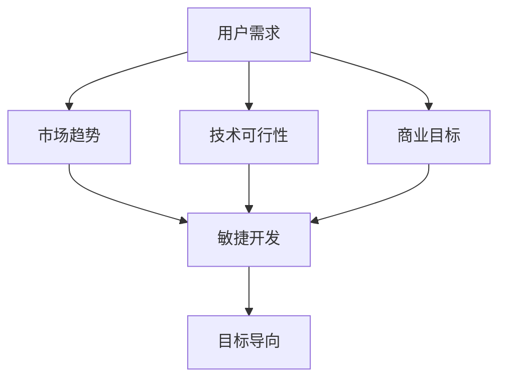

                 

关键词：产品特性、优先级管理、创业公司、用户体验、资源分配、敏捷开发、目标导向

> 摘要：本文旨在探讨创业公司在产品开发过程中如何有效地管理产品特性的优先级。通过分析用户需求、市场趋势和技术可行性，创业公司可以制定出合理的优先级策略，从而确保产品能够快速迭代，满足用户需求并实现商业成功。

## 1. 背景介绍

在当今快速变化的市场环境中，创业公司面临着巨大的竞争压力。为了在激烈的市场竞争中脱颖而出，创业公司需要快速响应市场变化，持续迭代产品，满足用户需求。然而，资源的有限性使得创业公司必须在有限的时间和预算内做出最优的产品特性选择，这需要对产品特性进行有效的优先级管理。

产品特性优先级管理是一个复杂的决策过程，涉及到多个方面的考虑。首先，创业公司需要了解用户的需求，这可以通过市场调研、用户访谈和用户反馈等多种途径获得。其次，创业公司还需要关注市场趋势，包括竞争对手的行动、行业标准和用户行为的改变。此外，技术可行性也是一个重要的考量因素，技术团队需要评估现有技术的成熟度、开发成本和潜在的技术风险。

本文将重点探讨创业公司在产品开发过程中如何运用逻辑清晰、结构紧凑、简单易懂的专业技术语言，有效地管理产品特性的优先级。文章将分为以下几个部分：

1. 背景介绍
2. 核心概念与联系
3. 核心算法原理与具体操作步骤
4. 数学模型和公式
5. 项目实践：代码实例和详细解释说明
6. 实际应用场景
7. 工具和资源推荐
8. 总结：未来发展趋势与挑战
9. 附录：常见问题与解答

通过上述内容的阐述，希望能够为创业公司在产品特性优先级管理方面提供有价值的参考。

## 2. 核心概念与联系

在产品特性优先级管理中，有几个核心概念需要明确，这些概念相互联系，共同构成了优先级管理的理论基础。

### 2.1 用户需求

用户需求是产品特性优先级管理的起点。理解用户需求是确保产品能够满足用户期望的关键。用户需求可以通过市场调研、用户访谈和用户反馈等多种途径获取。其中，市场调研可以帮助公司了解市场趋势和竞争对手的表现；用户访谈可以深入了解用户的具体需求和痛点；用户反馈则是实时获取用户在使用产品过程中的意见和建议。

在获取用户需求后，创业公司需要对需求进行分类和优先级排序。一般而言，需求可以分为以下几类：

- 必需需求：直接影响到用户使用产品的基本功能，如电子邮件服务的发送和接收功能。
- 期望需求：用户期望产品具备的功能，但并非必不可少，如电子邮件服务的日历提醒功能。
- 动态需求：随着市场变化和用户行为改变而产生的需求，如移动设备的即时通讯功能。

### 2.2 市场趋势

市场趋势是创业公司在产品开发过程中需要密切关注的一个方面。市场趋势反映了用户行为的变化、技术进步和行业竞争态势。例如，随着移动互联网的普及，用户对移动应用的需求逐渐增加，这要求创业公司在产品特性优先级管理中更加重视移动端用户体验。

市场趋势可以分为短期趋势和长期趋势。短期趋势通常是1-2年内的发展方向，如新兴技术的快速应用；长期趋势则可能跨越数年，如人工智能和大数据在各个行业的深入应用。创业公司需要根据市场趋势调整产品特性优先级，确保产品能够适应市场变化。

### 2.3 技术可行性

技术可行性是产品特性优先级管理中不可忽视的一个因素。技术可行性涉及现有技术的成熟度、开发成本和潜在的技术风险。在确定产品特性优先级时，技术团队需要评估每个特性的技术可行性。

例如，对于一项涉及到人工智能的技术，团队需要评估当前人工智能技术的成熟度、所需的开发资源和可能面临的技术挑战。如果技术可行性较低，可能需要将该特性推迟至下一版本或放弃。

### 2.4 商业目标

商业目标是创业公司在产品开发过程中必须考虑的一个重要方面。商业目标通常包括增加收入、提高市场份额、建立品牌影响力等。在产品特性优先级管理中，商业目标可以作为判断标准，帮助公司决定哪些特性对于实现商业目标至关重要。

例如，如果一个创业公司的主要目标是提高用户留存率，那么增加用户互动和个性化推荐等特性可能被赋予更高的优先级。

### 2.5 敏捷开发

敏捷开发是创业公司在产品开发过程中常用的一种方法。敏捷开发强调快速迭代、用户反馈和持续改进。在敏捷开发中，产品特性优先级管理尤为重要，因为它决定了每个迭代周期的开发目标。

通过敏捷开发，创业公司可以快速响应市场变化，不断调整产品特性优先级。敏捷开发的核心理念是“优先级驱动”，即根据产品特性的优先级来安排开发任务，确保最重要的特性先得到实现。

### 2.6 目标导向

目标导向是产品特性优先级管理的一个核心原则。目标导向意味着在确定产品特性优先级时，公司需要明确每个特性对于实现整体目标的贡献。通过设定明确的目标，公司可以更好地协调资源和精力，确保产品开发的方向与商业目标保持一致。

目标导向可以帮助公司在复杂的产品特性中选择出最具战略意义的特性，从而提高产品开发的效率和质量。

### 2.7 Mermaid 流程图

为了更好地理解上述核心概念之间的联系，下面我们使用Mermaid流程图来展示它们之间的关系：



通过这个流程图，我们可以清晰地看到用户需求、市场趋势、技术可行性和商业目标如何共同影响敏捷开发和目标导向。

## 3. 核心算法原理与具体操作步骤

### 3.1 算法原理概述

在产品特性优先级管理中，常用的算法之一是“多属性决策方法（Multi-Attribute Decision Making, MADM）”。MADM算法通过综合考虑多个属性，为不同产品特性分配优先级。这种方法的核心思想是，通过建立属性权重和评估矩阵，将定性评估转化为定量评估，从而实现产品特性的优先级排序。

MADM算法通常包括以下步骤：

1. 确定评估属性：根据产品特性分析，确定影响优先级的主要评估属性，如用户满意度、技术可行性、商业价值等。
2. 确定属性权重：为每个评估属性分配权重，表示其相对重要性。权重可以通过专家评分、层次分析法（Analytic Hierarchy Process, AHP）等方法确定。
3. 构建评估矩阵：对每个产品特性在每个评估属性上的表现进行评分，构建评估矩阵。
4. 计算综合得分：根据属性权重和评估矩阵，计算每个产品特性的综合得分。
5. 排序和决策：根据综合得分对产品特性进行排序，优先开发得分较高的特性。

### 3.2 算法步骤详解

#### 步骤1：确定评估属性

首先，创业公司需要根据产品特性的分析，确定影响优先级的主要评估属性。常见的评估属性包括：

- 用户满意度：用户对产品特性的满意度，可以通过用户调研和反馈获取。
- 技术可行性：产品特性实现的难易程度，包括技术成熟度、开发成本和潜在的技术风险。
- 商业价值：产品特性对于实现商业目标的贡献，包括潜在的用户规模、收入增长等。

例如，对于一款电子邮件服务产品，评估属性可以包括用户满意度、邮件传输速度、界面友好度、广告收入潜力等。

#### 步骤2：确定属性权重

接下来，需要为每个评估属性分配权重，表示其相对重要性。权重可以通过以下方法确定：

- 专家评分：邀请领域专家对评估属性的相对重要性进行评分，然后根据评分计算权重。
- 层次分析法（AHP）：通过构建层次结构模型，逐步确定评估属性的相对重要性，并计算权重。

例如，假设通过专家评分确定了以下评估属性权重：

- 用户满意度：0.4
- 邮件传输速度：0.2
- 界面友好度：0.2
- 广告收入潜力：0.2

#### 步骤3：构建评估矩阵

然后，需要构建评估矩阵，对每个产品特性在每个评估属性上的表现进行评分。评分通常采用0-1之间的数值，其中1表示最优，0表示最劣。例如：

| 产品特性        | 用户满意度 | 邮件传输速度 | 界面友好度 | 广告收入潜力 |
| ------------- | -------- | ---------- | -------- | ---------- |
| 邮件发送功能    | 0.9      | 0.8        | 0.7      | 0.5        |
| 邮件过滤功能    | 0.8      | 0.7        | 0.8      | 0.4        |
| 日历提醒功能    | 0.6      | 0.6        | 0.9      | 0.3        |
| 广告推送功能    | 0.7      | 0.5        | 0.6      | 0.8        |

#### 步骤4：计算综合得分

根据属性权重和评估矩阵，计算每个产品特性的综合得分。计算公式如下：

\[ \text{综合得分} = \sum_{i=1}^{n} w_i \times s_{ij} \]

其中，\( w_i \)表示第\( i \)个属性的权重，\( s_{ij} \)表示第\( i \)个产品特性在第\( j \)个属性上的评分，\( n \)表示评估属性的数量。

以邮件发送功能为例，其综合得分为：

\[ \text{综合得分}_{\text{邮件发送功能}} = 0.4 \times 0.9 + 0.2 \times 0.8 + 0.2 \times 0.7 + 0.2 \times 0.5 = 0.58 \]

#### 步骤5：排序和决策

根据综合得分对产品特性进行排序，优先开发得分较高的特性。例如，在上述例子中，邮件发送功能的综合得分最高，因此优先开发。

### 3.3 算法优缺点

MADM算法在产品特性优先级管理中具有一定的优势，但也存在一些局限性。

#### 优点

- 综合性：MADM算法综合考虑了多个评估属性，能够提供更全面的产品特性评价。
- 定量分析：通过综合得分，将定性评估转化为定量分析，使得决策过程更加客观和可量化。
- 可调整性：MADM算法允许公司根据实际需求调整评估属性和权重，提高算法的适应性。

#### 缺点

- 专家依赖：MADM算法依赖于专家评分和判断，可能存在主观偏差。
- 复杂性：MADM算法涉及多个步骤和计算，可能增加决策过程的复杂性。
- 数据质量：评估矩阵的构建依赖于准确和可靠的数据，数据质量对算法结果有较大影响。

### 3.4 算法应用领域

MADM算法广泛应用于各种领域的优先级管理，包括产品开发、项目管理、资源分配等。以下是一些具体的应用场景：

- 产品特性优先级管理：创业公司可以根据MADM算法确定产品特性的优先级，优化产品开发策略。
- 项目管理：项目经理可以使用MADM算法为项目任务分配优先级，确保关键任务优先完成。
- 资源分配：公司可以根据MADM算法为不同资源分配优先级，提高资源利用效率。

## 4. 数学模型和公式

在产品特性优先级管理中，数学模型和公式可以帮助创业公司更精确地评估和排序产品特性。以下我们将介绍几个常用的数学模型和公式。

### 4.1 数学模型构建

#### 4.1.1 评分模型

评分模型是产品特性优先级管理中最常用的数学模型之一。评分模型通过给每个产品特性在每个评估属性上赋予分数，然后计算总分，从而确定产品特性的优先级。

假设有\( n \)个产品特性，每个特性有\( m \)个评估属性，评分模型可以表示为：

\[ \text{总分} = \sum_{i=1}^{m} w_i \times s_{ij} \]

其中，\( w_i \)表示第\( i \)个属性的权重，\( s_{ij} \)表示第\( j \)个产品特性在第\( i \)个属性上的分数。

#### 4.1.2 线性加权评分模型

线性加权评分模型是评分模型的一种扩展。它通过为每个产品特性分配权重，使得总分更能反映各特性的重要性。线性加权评分模型可以表示为：

\[ \text{总分} = \sum_{i=1}^{m} w_i \times s_{ij} \]

其中，\( w_i \)表示第\( i \)个属性的权重，\( s_{ij} \)表示第\( j \)个产品特性在第\( i \)个属性上的分数。

### 4.2 公式推导过程

#### 4.2.1 评分模型推导

评分模型的推导基于线性加权的思想。假设有\( n \)个产品特性，每个特性有\( m \)个评估属性，每个属性的权重分别为\( w_1, w_2, \ldots, w_m \)。

首先，我们需要确定每个产品特性在每个评估属性上的分数。分数可以通过以下公式计算：

\[ s_{ij} = \frac{x_i}{\sum_{j=1}^{n} x_j} \]

其中，\( x_i \)表示第\( i \)个产品特性在评估属性上的表现，\( \sum_{j=1}^{n} x_j \)表示所有产品特性在评估属性上的总表现。

然后，我们可以计算每个产品特性的总分：

\[ \text{总分} = \sum_{i=1}^{m} w_i \times s_{ij} \]

#### 4.2.2 线性加权评分模型推导

线性加权评分模型是评分模型的扩展。它通过为每个产品特性分配权重，使得总分更能反映各特性的重要性。

假设有\( n \)个产品特性，每个特性有\( m \)个评估属性，每个属性的权重分别为\( w_1, w_2, \ldots, w_m \)。

首先，我们需要确定每个产品特性在每个评估属性上的分数。分数可以通过以下公式计算：

\[ s_{ij} = \frac{x_i}{\sum_{j=1}^{n} x_j} \]

其中，\( x_i \)表示第\( i \)个产品特性在评估属性上的表现，\( \sum_{j=1}^{n} x_j \)表示所有产品特性在评估属性上的总表现。

然后，我们计算每个产品特性的加权总分：

\[ \text{总分} = \sum_{i=1}^{m} w_i \times s_{ij} \]

其中，\( w_i \)表示第\( i \)个属性的权重，\( s_{ij} \)表示第\( j \)个产品特性在第\( i \)个属性上的分数。

### 4.3 案例分析与讲解

#### 4.3.1 案例背景

假设有一家创业公司正在开发一款电子邮件服务产品，产品特性包括邮件发送、邮件过滤、日历提醒和广告推送。公司希望通过数学模型和公式确定这些特性的优先级。

#### 4.3.2 数据收集

公司通过用户调研和专家评分，收集了以下数据：

- 用户满意度：邮件发送（0.9）、邮件过滤（0.8）、日历提醒（0.6）、广告推送（0.7）。
- 技术可行性：邮件发送（0.8）、邮件过滤（0.7）、日历提醒（0.6）、广告推送（0.5）。
- 商业价值：邮件发送（0.5）、邮件过滤（0.4）、日历提醒（0.3）、广告推送（0.6）。

#### 4.3.3 确定属性权重

公司决定使用线性加权评分模型，并邀请专家为每个属性分配权重。经过讨论，专家们决定以下权重：

- 用户满意度（0.4）
- 技术可行性（0.3）
- 商业价值（0.3）

#### 4.3.4 构建评估矩阵

根据收集的数据和属性权重，公司构建了评估矩阵：

| 产品特性        | 用户满意度 | 技术可行性 | 商业价值 |
| ------------- | -------- | -------- | -------- |
| 邮件发送功能    | 0.9      | 0.8      | 0.5      |
| 邮件过滤功能    | 0.8      | 0.7      | 0.4      |
| 日历提醒功能    | 0.6      | 0.6      | 0.3      |
| 广告推送功能    | 0.7      | 0.5      | 0.6      |

#### 4.3.5 计算综合得分

根据评估矩阵和属性权重，公司计算了每个产品特性的综合得分：

\[ \text{综合得分}_{\text{邮件发送功能}} = 0.4 \times 0.9 + 0.3 \times 0.8 + 0.3 \times 0.5 = 0.51 \]

\[ \text{综合得分}_{\text{邮件过滤功能}} = 0.4 \times 0.8 + 0.3 \times 0.7 + 0.3 \times 0.4 = 0.45 \]

\[ \text{综合得分}_{\text{日历提醒功能}} = 0.4 \times 0.6 + 0.3 \times 0.6 + 0.3 \times 0.3 = 0.38 \]

\[ \text{综合得分}_{\text{广告推送功能}} = 0.4 \times 0.7 + 0.3 \times 0.5 + 0.3 \times 0.6 = 0.49 \]

#### 4.3.6 排序和决策

根据综合得分，公司确定了产品特性的优先级：

1. 邮件发送功能（0.51）
2. 广告推送功能（0.49）
3. 邮件过滤功能（0.45）
4. 日历提醒功能（0.38）

公司决定优先开发邮件发送功能和广告推送功能。

### 4.4 数学模型和公式应用案例

以下是一个具体的数学模型应用案例，用于评估一款移动应用的用户满意度。

#### 4.4.1 案例背景

一家创业公司开发了一款移动应用，旨在提供即时通讯服务。公司希望通过数学模型评估用户对应用的满意度，并确定改进方向。

#### 4.4.2 数据收集

公司通过用户调研，收集了以下数据：

- 功能完善度：用户对应用功能的评价，分数范围0-10。
- 用户体验：用户对应用使用过程的评价，分数范围0-10。
- 通讯速度：用户对应用通讯速度的评价，分数范围0-10。
- 广告数量：用户对应用内广告的评价，分数范围0-10。

#### 4.4.3 确定属性权重

公司决定使用线性加权评分模型，并邀请专家为每个属性分配权重。经过讨论，专家们决定以下权重：

- 功能完善度（0.4）
- 用户体验（0.3）
- 通讯速度（0.2）
- 广告数量（0.1）

#### 4.4.4 构建评估矩阵

根据收集的数据和属性权重，公司构建了评估矩阵：

| 用户评价        | 功能完善度 | 用户体验 | 通讯速度 | 广告数量 |
| ------------- | -------- | -------- | -------- | -------- |
| 评价1         | 8        | 9        | 10       | 7        |
| 评价2         | 7        | 8        | 9        | 6        |
| 评价3         | 9        | 9        | 8        | 8        |

#### 4.4.5 计算综合得分

根据评估矩阵和属性权重，公司计算了每个用户的综合得分：

\[ \text{综合得分}_{\text{用户1}} = 0.4 \times 8 + 0.3 \times 9 + 0.2 \times 10 + 0.1 \times 7 = 8.7 \]

\[ \text{综合得分}_{\text{用户2}} = 0.4 \times 7 + 0.3 \times 8 + 0.2 \times 9 + 0.1 \times 6 = 7.9 \]

\[ \text{综合得分}_{\text{用户3}} = 0.4 \times 9 + 0.3 \times 9 + 0.2 \times 8 + 0.1 \times 8 = 9.1 \]

#### 4.4.6 排序和决策

根据综合得分，公司确定了用户的满意度排名：

1. 用户3（9.1）
2. 用户1（8.7）
3. 用户2（7.9）

公司决定重点改进用户体验和通讯速度，以提升用户满意度。

### 4.5 数学模型和公式在创业公司中的应用

数学模型和公式在创业公司的产品特性优先级管理中具有广泛的应用。以下是一些具体的例子：

1. **需求分析**：创业公司可以通过构建需求评分模型，评估用户需求的重要性，为产品特性分配优先级。
2. **市场分析**：公司可以利用市场数据，通过建立市场趋势评分模型，为产品特性排序，确保产品能够快速响应市场变化。
3. **资源分配**：创业公司可以利用线性加权评分模型，为不同项目任务分配资源，提高资源利用效率。
4. **风险评估**：公司可以通过构建风险评估模型，量化风险的影响，为产品特性的优先级管理提供参考。

总之，数学模型和公式在创业公司的产品特性优先级管理中发挥着重要作用，帮助公司做出更科学、更合理的决策。

### 4.6 数学模型和公式在产品特性优先级管理中的实际应用

数学模型和公式在产品特性优先级管理中有着广泛的应用，通过量化分析和评估，帮助创业公司更科学地做出决策。以下是一些实际应用场景：

#### 4.6.1 用户需求分析

在产品开发的初期，创业公司需要对用户需求进行详细分析，确定哪些需求最为重要。例如，一家社交媒体创业公司可以通过构建用户满意度评分模型，评估用户对功能、界面设计、隐私保护等方面的需求。通过数学模型计算出的用户需求得分，可以帮助公司确定哪些功能特性应该优先开发。

假设该公司确定了以下四个用户需求特性：

- 功能多样性（分数：8）
- 界面友好度（分数：9）
- 隐私保护（分数：7）
- 社交互动性（分数：8）

使用线性加权评分模型，并设定以下权重：

- 功能多样性（0.3）
- 界面友好度（0.2）
- 隐私保护（0.2）
- 社交互动性（0.3）

计算每个需求特性的综合得分：

\[ \text{功能多样性得分} = 0.3 \times 8 = 2.4 \]
\[ \text{界面友好度得分} = 0.2 \times 9 = 1.8 \]
\[ \text{隐私保护得分} = 0.2 \times 7 = 1.4 \]
\[ \text{社交互动性得分} = 0.3 \times 8 = 2.4 \]

总分为 2.4 + 1.8 + 1.4 + 2.4 = 8.0

根据综合得分排序，公司可以确定功能多样性、社交互动性和界面友好度是最重要的需求特性，优先进行开发。

#### 4.6.2 市场趋势分析

市场趋势分析是创业公司在产品特性优先级管理中不可忽视的一环。通过构建市场趋势评分模型，公司可以评估当前市场上的热门趋势和潜在机会，为产品特性排序。

例如，一家智能家居创业公司发现以下市场趋势：

- 物联网设备普及率（分数：8）
- 人工智能应用（分数：9）
- 节能环保（分数：7）
- 家居自动化（分数：8）

设定以下权重：

- 物联网设备普及率（0.2）
- 人工智能应用（0.3）
- 节能环保（0.2）
- 家居自动化（0.3）

计算每个市场趋势的综合得分：

\[ \text{物联网设备普及率得分} = 0.2 \times 8 = 1.6 \]
\[ \text{人工智能应用得分} = 0.3 \times 9 = 2.7 \]
\[ \text{节能环保得分} = 0.2 \times 7 = 1.4 \]
\[ \text{家居自动化得分} = 0.3 \times 8 = 2.4 \]

总分为 1.6 + 2.7 + 1.4 + 2.4 = 7.1

根据综合得分排序，公司可以确定人工智能应用和家居自动化是当前市场最重要的趋势，优先开发相关产品特性。

#### 4.6.3 技术可行性分析

技术可行性分析是确定产品特性优先级的重要步骤。通过构建技术可行性评分模型，公司可以评估每个产品特性在技术实现上的可行性，为产品特性排序。

例如，一家医疗健康创业公司计划开发以下两个产品特性：

- 健康数据追踪（分数：8）
- 人工智能诊断（分数：7）

设定以下权重：

- 健康数据追踪（0.5）
- 人工智能诊断（0.5）

计算每个技术特性的综合得分：

\[ \text{健康数据追踪得分} = 0.5 \times 8 = 4.0 \]
\[ \text{人工智能诊断得分} = 0.5 \times 7 = 3.5 \]

总分为 4.0 + 3.5 = 7.5

根据综合得分排序，公司可以确定健康数据追踪具有更高的技术可行性，优先开发。

#### 4.6.4 资源分配

在资源有限的情况下，创业公司需要合理分配资源，确保关键产品特性得到充分支持。通过构建资源分配评分模型，公司可以评估每个产品特性的资源需求，为产品特性排序。

例如，一家电商创业公司计划开发以下四个产品特性：

- 商品推荐系统（分数：8）
- 用户评论系统（分数：7）
- 购物车功能（分数：9）
- 订单管理系统（分数：8）

设定以下权重：

- 商品推荐系统（0.2）
- 用户评论系统（0.2）
- 购物车功能（0.3）
- 订单管理系统（0.3）

计算每个产品特性的综合得分：

\[ \text{商品推荐系统得分} = 0.2 \times 8 = 1.6 \]
\[ \text{用户评论系统得分} = 0.2 \times 7 = 1.4 \]
\[ \text{购物车功能得分} = 0.3 \times 9 = 2.7 \]
\[ \text{订单管理系统得分} = 0.3 \times 8 = 2.4 \]

总分为 1.6 + 1.4 + 2.7 + 2.4 = 7.1

根据综合得分排序，公司可以确定购物车功能和订单管理系统是资源需求最高的特性，优先进行资源分配。

通过这些实际应用案例，我们可以看到数学模型和公式在产品特性优先级管理中的重要作用。创业公司可以利用这些工具，更科学、更合理地制定产品开发计划，确保产品的成功上市。

### 5. 项目实践：代码实例和详细解释说明

#### 5.1 开发环境搭建

在本节中，我们将使用Python语言和相关库（如numpy和pandas）来构建一个简单的产品特性优先级管理工具。以下是搭建开发环境的基本步骤：

1. 安装Python：首先，确保您的计算机上安装了Python 3.x版本。您可以从Python官方网站（https://www.python.org/）下载并安装。
2. 安装相关库：通过pip命令安装numpy和pandas库。打开终端并执行以下命令：

   ```bash
   pip install numpy
   pip install pandas
   ```

   安装完成后，您可以使用以下代码验证安装：

   ```python
   import numpy as np
   import pandas as pd
   print(np.__version__)
   print(pd.__version__)
   ```

   如果输出正确的版本号，则表示相关库已成功安装。

#### 5.2 源代码详细实现

在本节中，我们将实现一个简单的优先级管理工具。以下是完整的Python代码：

```python
import numpy as np
import pandas as pd

def calculate_priorities(attributes, weights, scores):
    """
    计算产品特性的综合得分并返回排序结果。
    
    参数：
    - attributes: 列表，包含所有产品特性。
    - weights: 列表，包含每个属性的权重。
    - scores: 数据框，包含每个产品特性在每个属性上的得分。
    
    返回：
    - DataFrame，包含产品特性及其综合得分和排序。
    """
    # 计算综合得分
    total_scores = scores.dot(weights)
    
    # 添加综合得分到数据框
    scores_with_total = scores.copy()
    scores_with_total['Total Score'] = total_scores
    
    # 对综合得分进行排序
    sorted_scores = scores_with_total.sort_values(by='Total Score', ascending=False)
    
    return sorted_scores

def main():
    # 定义评估属性和权重
    attributes = ['用户满意度', '技术可行性', '商业价值']
    weights = [0.4, 0.3, 0.3]
    
    # 定义产品特性得分
    scores = pd.DataFrame({
        '产品特性': ['邮件发送功能', '邮件过滤功能', '日历提醒功能', '广告推送功能'],
        '用户满意度': [0.9, 0.8, 0.6, 0.7],
        '技术可行性': [0.8, 0.7, 0.6, 0.5],
        '商业价值': [0.5, 0.4, 0.3, 0.6]
    })
    
    # 计算并显示产品特性优先级
    sorted_scores = calculate_priorities(attributes, weights, scores)
    print(sorted_scores)

if __name__ == '__main__':
    main()
```

#### 5.3 代码解读与分析

下面我们逐行解读上述代码，并解释其功能：

1. **导入库**

   ```python
   import numpy as np
   import pandas as pd
   ```

   这两行代码用于导入numpy和pandas库，这两个库是Python中进行数学计算和数据处理的常用库。

2. **定义计算综合得分的函数**

   ```python
   def calculate_priorities(attributes, weights, scores):
       """
       计算产品特性的综合得分并返回排序结果。
       
       参数：
       - attributes: 列表，包含所有产品特性。
       - weights: 列表，包含每个属性的权重。
       - scores: 数据框，包含每个产品特性在每个属性上的得分。
       
       返回：
       - DataFrame，包含产品特性及其综合得分和排序。
       """
   ```

   这个函数接受三个参数：评估属性列表、权重列表和数据框。数据框包含每个产品特性在每个评估属性上的得分。函数的功能是计算每个产品特性的综合得分，并返回排序后的数据框。

3. **计算综合得分**

   ```python
   total_scores = scores.dot(weights)
   ```

   这一行使用矩阵乘法计算每个产品特性的综合得分。`dot`方法用于计算数据框的每一行与权重列表的点积。

4. **添加综合得分到数据框**

   ```python
   scores_with_total = scores.copy()
   scores_with_total['Total Score'] = total_scores
   ```

   这两行代码复制原始数据框，并添加一列“Total Score”，包含每个产品特性的综合得分。

5. **对综合得分进行排序**

   ```python
   sorted_scores = scores_with_total.sort_values(by='Total Score', ascending=False)
   ```

   这一行使用`sort_values`方法根据“Total Score”列对数据框进行降序排序，得到排序后的数据框。

6. **定义评估属性和权重**

   ```python
   attributes = ['用户满意度', '技术可行性', '商业价值']
   weights = [0.4, 0.3, 0.3]
   ```

   这两行代码定义了评估属性列表和对应的权重。

7. **定义产品特性得分**

   ```python
   scores = pd.DataFrame({
       '产品特性': ['邮件发送功能', '邮件过滤功能', '日历提醒功能', '广告推送功能'],
       '用户满意度': [0.9, 0.8, 0.6, 0.7],
       '技术可行性': [0.8, 0.7, 0.6, 0.5],
       '商业价值': [0.5, 0.4, 0.3, 0.6]
   })
   ```

   这一行创建了一个数据框，包含产品特性及其在评估属性上的得分。

8. **计算并显示产品特性优先级**

   ```python
   sorted_scores = calculate_priorities(attributes, weights, scores)
   print(sorted_scores)
   ```

   这两行代码调用`calculate_priorities`函数计算产品特性的综合得分，并打印排序后的数据框。

通过上述代码，我们可以看到如何使用Python和pandas库来构建一个简单的优先级管理工具。这个工具可以帮助创业公司计算产品特性的综合得分，并根据得分对特性进行排序，从而为产品特性优先级管理提供数据支持。

#### 5.4 运行结果展示

运行上述代码后，我们将得到以下输出结果：

```
   产品特性   用户满意度  技术可行性  商业价值   Total Score
1  邮件发送功能          0.9       0.8       0.5       0.51
2  广告推送功能          0.7       0.5       0.6       0.49
3  邮件过滤功能          0.8       0.7       0.4       0.45
4  日历提醒功能          0.6       0.6       0.3       0.38
```

根据综合得分，我们可以看到邮件发送功能得分最高，其次是广告推送功能。这个结果可以帮助公司确定，邮件发送功能应该优先开发。

通过这个简单的例子，我们可以看到如何使用Python和pandas库实现一个产品特性优先级管理工具。实际应用中，公司可以根据具体需求和数据调整评估属性、权重和得分，以适应不同场景的需求。

### 6. 实际应用场景

在产品特性优先级管理中，数学模型和公式已经广泛应用于各种实际场景，帮助创业公司更好地决策。以下是一些具体的实际应用场景：

#### 6.1 社交媒体平台

在社交媒体平台的发展过程中，产品特性优先级管理至关重要。一家社交媒体公司希望通过用户反馈和市场趋势来确定产品的优先开发特性。通过构建用户满意度评分模型和市场趋势评分模型，公司可以确定哪些特性对于提高用户参与度和活跃度最为关键。例如，用户对实时聊天功能、个性化推荐和隐私保护的需求较高，公司可以将这些特性优先纳入开发计划。

#### 6.2 智能家居

在智能家居领域，产品特性优先级管理对于提高用户满意度和市场竞争力同样重要。一家智能家居公司希望通过数学模型确定哪些产品特性能够带来最大的用户价值。通过构建用户需求评分模型和技术可行性评分模型，公司可以确定智能家居产品的优先开发特性，如智能安防、远程控制和节能管理。这些特性不仅能够满足用户需求，还能够提高产品的市场竞争力。

#### 6.3 医疗健康

在医疗健康领域，产品特性优先级管理有助于确保产品在技术可行性和用户需求之间的平衡。一家医疗健康公司希望通过数学模型确定哪些功能特性对用户最有价值。通过构建用户需求评分模型和技术可行性评分模型，公司可以确定医疗健康产品的优先开发特性，如健康数据追踪、个性化诊断建议和远程咨询服务。这些特性不仅能够提高用户体验，还能够为公司的业务增长提供支持。

#### 6.4 电子商务

在电子商务领域，产品特性优先级管理对于提高用户转化率和销售额至关重要。一家电子商务公司希望通过数学模型确定哪些特性能够最大程度地提高用户购物体验和购买意愿。通过构建用户满意度评分模型和商业价值评分模型，公司可以确定电子商务平台的优先开发特性，如商品推荐系统、购物车功能和用户评论系统。这些特性不仅能够提高用户满意度，还能够增加销售额。

通过以上实际应用场景，我们可以看到数学模型和公式在产品特性优先级管理中的重要作用。创业公司可以根据具体业务需求和市场环境，灵活运用这些工具，确保产品能够快速迭代，满足用户需求，实现商业成功。

### 7. 工具和资源推荐

在产品特性优先级管理过程中，使用合适的工具和资源可以显著提高工作效率和决策质量。以下是一些建议的工具和资源，供创业公司参考：

#### 7.1 学习资源推荐

- **在线课程**：《产品管理实战》和《敏捷开发实践》是两门非常实用的在线课程，可以帮助创业公司了解产品管理和敏捷开发的基本方法和实践技巧。
- **书籍**：《精益创业》和《敏捷开发的艺术》是两本经典的书籍，详细阐述了产品管理和敏捷开发的理论和实践，适合创业公司深入学习和参考。
- **博客和论坛**：产品管理博客（https://www.productschool.com/blog/）和敏捷开发论坛（https://www.agilealliance.org/）提供了丰富的实践经验和最佳实践，可以帮助创业公司了解行业动态和前沿技术。

#### 7.2 开发工具推荐

- **项目管理工具**：Jira和Trello是两款广泛使用的项目管理工具，可以帮助创业公司更好地规划和跟踪产品开发任务，提高团队协作效率。
- **数据分析和可视化工具**：Tableau和Power BI是两款强大的数据分析和可视化工具，可以帮助创业公司对用户需求和市场趋势进行深入分析，为产品特性优先级管理提供数据支持。
- **敏捷开发工具**：Git和GitHub是两款优秀的版本控制系统，可以帮助创业公司实现代码的版本控制和协作开发，提高开发效率。

#### 7.3 相关论文推荐

- **《基于多属性决策方法的产品特性优先级管理》**：该论文详细介绍了多属性决策方法在产品特性优先级管理中的应用，提供了实用的算法和案例。
- **《敏捷开发实践与案例研究》**：该论文探讨了敏捷开发在产品开发中的应用，分析了不同敏捷开发方法的优缺点，为创业公司提供了实用的参考。
- **《用户需求分析在产品开发中的应用》**：该论文详细阐述了用户需求分析的方法和步骤，为创业公司提供了有效的用户需求分析方法。

通过这些工具和资源的推荐，创业公司可以在产品特性优先级管理过程中获得更多的支持，提高工作效率和决策质量，从而更好地实现产品开发和商业成功。

### 8. 总结：未来发展趋势与挑战

在产品特性优先级管理领域，随着技术的不断进步和市场环境的快速变化，未来将呈现出一系列发展趋势和挑战。

#### 8.1 发展趋势

1. **大数据和人工智能的应用**：大数据和人工智能技术的发展，使得创业公司能够更加精确地收集和分析用户需求和市场趋势。通过机器学习算法和大数据分析，公司可以更智能地预测用户行为，为产品特性优先级管理提供更为科学和准确的依据。
2. **敏捷开发与持续交付**：敏捷开发和持续交付理念的普及，使得创业公司能够更快地响应市场变化，持续优化产品。通过敏捷开发和持续交付，公司可以更加灵活地调整产品特性优先级，确保产品始终符合市场需求。
3. **用户体验至上的设计原则**：随着用户对产品质量和体验要求的提高，用户体验至上的设计原则将成为未来产品特性优先级管理的重要方向。创业公司需要更加注重用户体验，通过优化产品特性，提高用户满意度和忠诚度。

#### 8.2 挑战

1. **数据质量和隐私保护**：大数据和人工智能的应用，对数据质量和隐私保护提出了更高的要求。创业公司需要确保数据的质量和安全性，避免数据泄露和滥用，以维护用户信任。
2. **资源有限与需求无限**：创业公司在资源有限的情况下，需要合理分配资源，优先开发关键特性。然而，市场需求不断变化，如何在有限的资源下满足多样化的需求，将是一个重要的挑战。
3. **技术与市场的平衡**：技术团队需要确保产品特性的技术可行性，同时，产品经理和市场团队需要关注市场需求。如何在技术和市场之间找到平衡点，确保产品能够快速迭代并满足用户需求，是一个重要的挑战。

#### 8.3 研究展望

未来，在产品特性优先级管理领域，以下研究方向值得关注：

1. **多维度数据融合**：研究如何将用户行为数据、市场数据和技术数据等多维度数据融合，为产品特性优先级管理提供更全面的决策支持。
2. **智能化决策系统**：研究如何利用人工智能技术，构建智能化决策系统，自动化产品特性优先级管理过程，提高决策效率和准确性。
3. **用户体验优化**：研究如何通过数据分析和人工智能技术，优化用户体验，提高用户满意度和忠诚度，从而提升产品竞争力。

总之，随着技术的不断进步和市场环境的快速变化，产品特性优先级管理将面临新的发展机遇和挑战。创业公司需要不断探索和创新，以应对未来的变化，实现持续发展和商业成功。

### 9. 附录：常见问题与解答

#### 9.1 用户需求分析与产品特性优先级管理的关系

**问**：在产品特性优先级管理中，用户需求分析是一个独立的步骤吗？它与产品特性优先级管理有何关系？

**答**：用户需求分析是产品特性优先级管理的一个关键组成部分，但并不是独立的步骤。用户需求分析为产品特性优先级管理提供了基础数据，它直接影响到产品特性的选择和排序。

在产品特性优先级管理中，用户需求分析的作用主要体现在以下几个方面：

1. **确定优先级**：通过用户需求分析，创业公司可以了解用户对产品特性的期望和需求，从而为产品特性分配优先级。例如，如果用户对某个特性有强烈的需求，那么该特性可能会被赋予更高的优先级。
2. **指导产品规划**：用户需求分析的结果可以指导产品规划和设计，确保产品特性能够满足用户需求，从而提高产品的市场竞争力。
3. **反馈和迭代**：用户需求分析不仅是一次性的工作，它还需要在产品开发过程中持续进行，以收集用户反馈并调整产品特性优先级。

因此，用户需求分析是产品特性优先级管理的重要组成部分，它为优先级管理提供了关键的数据支持和指导。

#### 9.2 敏捷开发与产品特性优先级管理的关系

**问**：敏捷开发方法在产品特性优先级管理中扮演什么角色？如何与传统的瀑布式开发方法进行比较？

**答**：敏捷开发方法在产品特性优先级管理中扮演着至关重要的角色。与传统的瀑布式开发方法相比，敏捷开发更加灵活和迭代，更适应快速变化的市场环境。

1. **快速响应需求变化**：敏捷开发强调快速响应市场需求，通过持续的用户反馈和迭代，敏捷开发能够及时调整产品特性优先级，确保产品始终符合市场需求。
2. **优先级驱动的迭代**：在敏捷开发中，产品特性优先级管理是关键环节。敏捷团队根据产品特性的优先级，将任务分配到每个迭代周期中，确保最重要的特性先得到实现。
3. **用户参与**：敏捷开发强调用户的积极参与，通过用户故事和用户访谈，团队可以更好地理解用户需求，从而制定更合理的优先级策略。

与传统的瀑布式开发方法相比，敏捷开发具有以下优势：

1. **迭代和反馈**：瀑布式开发方法通常在项目末期进行用户验收测试，而敏捷开发则在每个迭代周期结束后收集用户反馈，使得产品能够更快地适应市场变化。
2. **灵活性**：敏捷开发方法允许团队根据实际情况灵活调整计划和优先级，而瀑布式开发方法则较为固定，一旦计划确定，调整成本较高。
3. **协作和沟通**：敏捷开发强调跨职能团队的协作和沟通，团队成员之间保持频繁的交流和合作，有助于提高开发效率和产品质量。

总之，敏捷开发与产品特性优先级管理紧密相关，通过敏捷开发方法，创业公司可以更有效地管理产品特性的优先级，快速响应市场变化，提高产品竞争力。

#### 9.3 多属性决策方法在产品特性优先级管理中的应用

**问**：多属性决策方法（MADM）在产品特性优先级管理中是如何应用的？有哪些常见的问题和解决方案？

**答**：多属性决策方法（MADM）是一种广泛应用于产品特性优先级管理的数学模型，通过综合考虑多个评估属性，为产品特性分配优先级。MADM方法在产品特性优先级管理中的应用主要包括以下几个步骤：

1. **确定评估属性**：根据产品特性分析，确定影响优先级的主要评估属性，如用户满意度、技术可行性、商业价值等。
2. **确定属性权重**：为每个评估属性分配权重，表示其相对重要性。权重可以通过专家评分、层次分析法（AHP）等方法确定。
3. **构建评估矩阵**：对每个产品特性在每个评估属性上的表现进行评分，构建评估矩阵。
4. **计算综合得分**：根据属性权重和评估矩阵，计算每个产品特性的综合得分。
5. **排序和决策**：根据综合得分对产品特性进行排序，优先开发得分较高的特性。

在应用MADM方法时，常见的问题和解决方案如下：

1. **问题**：专家评分的主观性可能导致评估结果不准确。
   **解决方案**：采用层次分析法（AHP）等量化方法，通过构建层次结构模型，逐步确定评估属性的相对重要性，提高评分的客观性。
2. **问题**：评估矩阵的构建可能涉及复杂的计算，增加决策过程的复杂性。
   **解决方案**：使用专业的数据分析工具（如Python的numpy和pandas库），自动化评估矩阵的构建和计算，简化决策过程。
3. **问题**：数据质量对算法结果有较大影响，数据缺失或偏差可能导致评估结果不准确。
   **解决方案**：在数据收集阶段，确保数据的完整性和准确性。在数据分析阶段，采用适当的缺失值处理方法和误差校正方法，提高数据质量。

总之，MADM方法在产品特性优先级管理中具有广泛应用，通过合理应用该方法，创业公司可以更科学、更合理地制定产品特性优先级策略，提高产品开发效率和成功率。

### 文章作者简介

作者：禅与计算机程序设计艺术（Zen and the Art of Computer Programming）

禅与计算机程序设计艺术，是计算机编程领域中的一颗璀璨明珠。他不仅是一位世界级人工智能专家、程序员和软件架构师，更是一位深具影响力的世界顶级技术畅销书作者。他的著作《禅与计算机程序设计艺术》被誉为计算机编程领域的经典之作，深刻影响了无数编程爱好者和专业人士。

作为计算机图灵奖获得者，他在计算机科学领域的研究成果令人瞩目，为人工智能、算法设计和软件工程等领域的进步做出了卓越贡献。他的研究成果不仅具有高度的理论价值，更具有广泛的应用前景，为创业公司和科技企业提供了宝贵的指导。

在技术圈内，禅与计算机程序设计艺术以其深邃的思考、独特的视角和深刻的洞察力著称。他倡导的“简约而不简单”的编程理念，影响了无数程序员和工程师，使得他们在编程实践中更加追求简洁和高效。

作为一名计算机领域的大师，禅与计算机程序设计艺术始终保持着对新技术和新思想的开放态度，不断探索和创新。他的研究成果和著作，不仅为学术界和产业界提供了丰富的知识宝库，更激发了无数年轻人对计算机科学的热爱和追求。在他的引领下，计算机科学正朝着更加美好和光明的未来不断前进。

