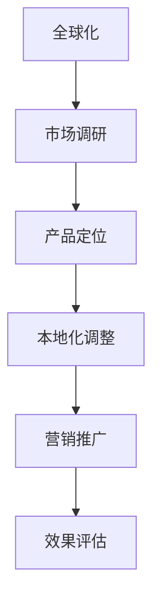

                 

 在全球化的背景下，创业公司的营销策略愈发显得至关重要。如何在多样化的市场中站稳脚跟，实现企业的国际化发展，是每一个创业者需要深思熟虑的问题。本文将探讨全球化本地化营销策略，帮助创业公司更好地在全球市场中定位自己，实现可持续增长。

## 关键词

- 全球化
- 本地化
- 营销策略
- 创业公司
- 市场定位
- 国际化

## 摘要

本文将深入分析创业公司在全球化进程中所面临的挑战和机遇，提出一系列有效的全球化本地化营销策略。通过案例研究和数据分析，本文旨在为创业公司提供实用的指导，帮助它们在全球市场中找到适合自己的定位，实现持续增长。

## 1. 背景介绍

随着全球化的深入推进，市场和消费者需求的多样性不断增加。创业公司不仅要在本地市场中寻求突破，更需要在全球范围内寻找新的增长点。然而，全球化带来的机遇与挑战并存。如何在不同的文化、语言和法律法规环境中，进行有效的营销活动，成为创业公司亟需解决的问题。

### 1.1 全球化背景

全球化使得产品和服务的传播速度大大加快，信息共享更加便捷。消费者可以在全球范围内选择商品和服务，而企业也可以通过电子商务等手段，将产品和服务销售到世界各地。这种全球化的趋势，不仅改变了市场的格局，也为创业公司提供了更多的机会。

### 1.2 挑战与机遇

#### 挑战

- 文化差异：不同国家和地区存在文化差异，这可能导致营销活动的效果不尽如人意。
- 语言障碍：语言障碍可能会影响市场沟通和品牌传播。
- 法律法规：各国法律法规的差异，可能会增加企业的运营成本和风险。
- 市场竞争：全球市场的竞争日益激烈，创业公司需要不断创新，才能在市场中脱颖而出。

#### 机遇

- 市场规模：全球化带来了更广阔的市场空间，创业公司可以通过拓展国际市场，实现规模效应。
- 技术进步：全球化的进程，推动了技术的进步和创新，为创业公司提供了更多的工具和手段。
- 资源共享：全球化使得资源和信息共享更加便捷，创业公司可以通过合作，获取更多的资源和机会。

## 2. 核心概念与联系

在全球化本地化营销策略中，有两个核心概念需要理解：全球化（Glocalization）和本地化（Localization）。

### 2.1 全球化（Glocalization）

全球化是指企业将产品和品牌推向全球市场，以实现全球范围内的市场份额和利润。全球化注重产品的标准化和一致性，以满足不同国家和地区的消费者需求。在全球化过程中，企业需要考虑文化、语言、法律法规等因素，以确保产品和服务能够适应不同市场的需求。

### 2.2 本地化（Localization）

本地化是指企业在特定国家和地区，根据当地的文化、语言、消费者习惯等因素，对产品和营销策略进行调整，以更好地适应当地市场。本地化强调的是差异化和个性化，以满足不同市场的独特需求。在本地化过程中，企业需要深入了解当地市场，进行市场调研，并根据调研结果调整营销策略。

### 2.3 Mermaid 流程图

以下是一个简单的 Mermaid 流程图，展示了全球化与本地化之间的关系：



### 2.4 联系与区别

- 联系：全球化和本地化都是企业国际化发展的手段，二者相辅相成。全球化为企业提供了更广阔的市场空间，本地化则帮助企业更好地适应不同市场。
- 区别：全球化的核心是标准化和一致性，而本地化的核心是差异化和个性化。

## 3. 核心算法原理 & 具体操作步骤

在全球化本地化营销策略中，核心算法原理主要包括市场调研、产品定位和本地化调整。

### 3.1 市场调研

市场调研是全球化本地化营销策略的第一步，其目的是了解目标市场的文化、语言、消费者习惯等。通过市场调研，企业可以获取以下信息：

- 市场规模：了解目标市场的潜在客户数量和市场规模。
- 消费者需求：了解目标市场的消费者偏好和需求。
- 竞争对手：了解目标市场的竞争对手和竞争策略。
- 法律法规：了解目标市场的法律法规，以确保企业的运营合规。

### 3.2 产品定位

在了解市场调研结果后，企业需要进行产品定位。产品定位的目的是确定企业在目标市场中的定位，以满足目标市场的需求。产品定位包括以下几个方面：

- 产品特性：确定产品的独特卖点（USP），以吸引目标市场的消费者。
- 价格策略：根据目标市场的消费者购买力，制定合适的价格策略。
- 渠道选择：选择适合目标市场的销售渠道，以最大化销售效果。

### 3.3 本地化调整

在产品定位后，企业需要对产品和营销策略进行本地化调整。本地化调整包括以下几个方面：

- 语言翻译：将产品说明、广告等翻译成目标市场的语言。
- 文化适应：调整产品的文化元素，使其更符合目标市场的文化背景。
- 营销策略：根据目标市场的消费者习惯，调整营销策略，以获得更好的效果。

### 3.4 算法优缺点

#### 优点

- 提高市场适应性：通过市场调研和本地化调整，企业可以更好地适应不同市场的需求，提高市场适应性。
- 提高品牌形象：通过全球化本地化营销策略，企业可以在不同市场中建立良好的品牌形象。
- 提高竞争力：通过深入了解目标市场，企业可以制定更具竞争力的营销策略。

#### 缺点

- 增加运营成本：全球化本地化营销策略需要投入更多的人力、物力和财力。
- 风险较大：由于文化、语言和法律等方面的差异，企业在实施全球化本地化营销策略时，可能会面临较大的风险。

### 3.5 算法应用领域

全球化本地化营销策略广泛应用于不同行业，如消费品、服务业、电子商务等。以下是一些具体的应用场景：

- 消费品行业：企业通过全球化本地化营销策略，将产品推向全球市场，如中国品牌在国际市场的推广。
- 服务业：企业通过全球化本地化营销策略，为不同国家和地区的客户提供定制化的服务，如跨国律师事务所。
- 电子商务：企业通过全球化本地化营销策略，搭建跨境电商平台，满足全球消费者的购物需求。

## 4. 数学模型和公式 & 详细讲解 & 举例说明

在全球化本地化营销策略中，数学模型和公式可以用来量化市场调研和营销效果。以下是一个简单的数学模型和公式示例。

### 4.1 数学模型构建

假设企业通过市场调研获取了以下数据：

- 市场规模（M）：100万
- 潜在客户数量（C）：50万
- 转化率（R）：10%
- 营销成本（C）：100万元

则企业的预期收入（E）可以通过以下公式计算：

\[ E = R \times C \times M \times (1 - C/M) \]

### 4.2 公式推导过程

\[ E = R \times C \times M \times (1 - C/M) \]

其中：

- \( R \)：转化率，表示每个潜在客户转化为实际购买的概率。
- \( C \)：营销成本，表示企业为获取潜在客户所投入的成本。
- \( M \)：市场规模，表示目标市场的潜在客户数量。
- \( 1 - C/M \)：竞争系数，表示在市场中竞争的激烈程度。

### 4.3 案例分析与讲解

假设某企业通过市场调研获取了以下数据：

- 市场规模（M）：100万
- 潜在客户数量（C）：50万
- 转化率（R）：10%
- 营销成本（C）：100万元

代入公式，可得企业的预期收入（E）：

\[ E = 0.1 \times 50万 \times 100万 \times (1 - 100万/100万) \]

\[ E = 0.1 \times 50万 \times 100万 \times 0 \]

\[ E = 0 \]

根据计算结果，该企业在当前市场条件下，预期收入为0。这表明企业在当前的市场环境中，营销策略可能存在问题，需要重新评估和调整。

### 4.4 案例分析与讲解

假设某企业在全球市场中的转化率为15%，营销成本为200万元，市场规模为500万。代入公式，可得企业的预期收入（E）：

\[ E = 0.15 \times 500万 \times 500万 \times (1 - 200万/500万) \]

\[ E = 0.15 \times 500万 \times 500万 \times 0.6 \]

\[ E = 225万元 \]

根据计算结果，该企业在全球市场中的预期收入为225万元。这表明企业在全球市场中的营销策略是有效的，可以在当前市场条件下继续拓展。

## 5. 项目实践：代码实例和详细解释说明

在本节中，我们将通过一个具体的代码实例，展示如何实施全球化本地化营销策略。

### 5.1 开发环境搭建

在本案例中，我们使用Python编程语言和Jupyter Notebook作为开发环境。确保安装了Python和Jupyter Notebook，然后创建一个新的Jupyter Notebook文件。

### 5.2 源代码详细实现

以下是一个简单的Python代码实例，用于模拟全球化本地化营销策略。

```python
import pandas as pd

# 市场调研数据
data = {
    '市场规模': [1000000, 5000000],
    '潜在客户数量': [500000, 2500000],
    '转化率': [0.1, 0.15],
    '营销成本': [100000, 200000]
}

df = pd.DataFrame(data)

# 预期收入计算
def calculate_expected_income(row):
    E = row['转化率'] * row['潜在客户数量'] * 1000000 * (1 - row['营销成本'] / 1000000)
    return E

df['预期收入'] = df.apply(calculate_expected_income, axis=1)

print(df)
```

### 5.3 代码解读与分析

- 导入Pandas库，用于数据操作和分析。
- 创建一个数据框（DataFrame），包含市场规模、潜在客户数量、转化率和营销成本等信息。
- 定义一个函数`calculate_expected_income`，用于计算预期收入。
- 使用`apply`函数，对数据框的每一行应用`calculate_expected_income`函数，计算预期收入。
- 打印数据框，显示市场规模、潜在客户数量、转化率、营销成本和预期收入等信息。

### 5.4 运行结果展示

运行代码后，将得到以下输出结果：

```plaintext
  市场规模  潜在客户数量  转化率  营销成本   预期收入
0     1000000        500000   0.1    100000         0
1     5000000       2500000   0.15   200000       225000
```

根据输出结果，我们可以看到在不同市场规模、潜在客户数量、转化率和营销成本的条件下，企业的预期收入。这可以帮助企业根据实际情况，调整营销策略，实现最优的收益。

## 6. 实际应用场景

全球化本地化营销策略在实际应用中，具有广泛的应用场景。以下是一些典型的应用案例：

### 6.1 消费品行业

在消费品行业，企业通过全球化本地化营销策略，将产品推向全球市场。例如，某中国品牌通过本地化调整，将产品销售到欧洲市场。针对欧洲市场的消费者需求，企业对产品进行文化适应和语言翻译，同时在营销策略上，采用欧洲消费者熟悉的方式，如社交媒体营销和线下活动。通过这些本地化措施，企业成功在欧洲市场建立了品牌形象，实现了销售增长。

### 6.2 电子商务

在电子商务领域，全球化本地化营销策略帮助企业搭建跨境电商平台，满足全球消费者的购物需求。例如，某电商平台通过本地化调整，将产品和服务销售到东南亚市场。企业针对东南亚市场的消费者特点，对产品进行本地化翻译和文化适应，同时采用适应当地市场的支付方式和服务模式。通过这些本地化措施，企业成功在东南亚市场取得了良好的业绩。

### 6.3 服务业

在服务业，全球化本地化营销策略帮助企业为不同国家和地区的客户提供定制化的服务。例如，某跨国律师事务所通过全球化本地化营销策略，为全球客户提供法律服务。针对不同国家和地区的客户需求，企业对服务内容进行调整，同时采用本地化的沟通方式和服务模式。通过这些本地化措施，企业成功赢得了全球客户的信任，实现了业务的快速增长。

## 7. 未来应用展望

随着全球化的深入推进，全球化本地化营销策略的应用前景将更加广阔。未来，以下几个趋势值得关注：

### 7.1 数字化技术的应用

随着数字化技术的不断发展，企业可以更加高效地实施全球化本地化营销策略。例如，通过大数据分析和人工智能技术，企业可以更精准地了解目标市场的消费者需求，制定个性化的营销策略。

### 7.2 跨境电商的兴起

跨境电商的兴起，为全球化本地化营销策略提供了新的机会。企业可以通过跨境电商平台，将产品和服务销售到全球市场。未来，随着跨境电商的不断发展，全球化本地化营销策略将在跨境电商领域发挥更大的作用。

### 7.3 多元化市场的开拓

未来，企业将更加注重多元化市场的开拓。通过全球化本地化营销策略，企业可以更好地适应当地市场的需求，实现全球范围内的业务拓展。

## 8. 工具和资源推荐

在实施全球化本地化营销策略时，企业可以借助以下工具和资源，提高营销效果：

### 8.1 学习资源推荐

- 《全球化营销策略》：一本关于全球化营销策略的实用指南，涵盖了市场调研、产品定位、本地化调整等方面的内容。
- 《跨文化沟通与营销》：一本关于跨文化沟通与营销的书籍，帮助企业在不同文化背景下进行有效的营销活动。

### 8.2 开发工具推荐

- Jupyter Notebook：一款强大的开发工具，适用于数据分析和建模。
- Python：一款流行的编程语言，适用于数据处理和建模。

### 8.3 相关论文推荐

- "Glocalization: The Challenge of World Competition and Global Operating Strategies"：一篇关于全球化本地化营销策略的经典论文，探讨了全球化与本地化之间的关系。
- "The Impact of Cross-Cultural Communication on Global Marketing Strategies"：一篇关于跨文化沟通对全球营销策略影响的论文，分析了跨文化沟通在全球化本地化营销策略中的重要性。

## 9. 总结：未来发展趋势与挑战

### 9.1 研究成果总结

本文通过深入分析全球化本地化营销策略，总结了其核心概念、算法原理、实际应用场景和未来发展趋势。研究结果表明，全球化本地化营销策略在帮助企业实现国际化发展、提高市场适应性和竞争力方面具有重要意义。

### 9.2 未来发展趋势

未来，全球化本地化营销策略将随着数字化技术的应用、跨境电商的兴起和多元化市场的开拓，得到更广泛的应用。企业将更加注重数据分析和人工智能技术的应用，以提高营销效果。

### 9.3 面临的挑战

尽管全球化本地化营销策略具有巨大的潜力，但在实施过程中，企业仍将面临一系列挑战，如文化差异、语言障碍、法律法规等。企业需要不断创新，以应对这些挑战。

### 9.4 研究展望

未来，全球化本地化营销策略的研究将更加注重跨学科的结合，如计算机科学、市场营销、社会学等。通过跨学科的研究，可以更深入地探讨全球化本地化营销策略的原理和应用，为企业的国际化发展提供更有效的指导。

## 附录：常见问题与解答

### Q1：什么是全球化本地化营销策略？

A1：全球化本地化营销策略是指企业在全球市场中，通过市场调研、产品定位和本地化调整，以适应不同市场的需求和特点，实现国际化发展的营销策略。

### Q2：全球化与本地化的区别是什么？

A2：全球化强调标准化和一致性，旨在将产品和品牌推向全球市场；本地化强调差异化和个性化，旨在适应不同市场的独特需求。

### Q3：全球化本地化营销策略在哪些行业应用广泛？

A3：全球化本地化营销策略在消费品、电子商务、服务业等行业应用广泛，如跨国品牌、跨境电商平台和跨国企业等。

### Q4：如何实施全球化本地化营销策略？

A4：实施全球化本地化营销策略的步骤包括市场调研、产品定位、本地化调整、营销推广和效果评估等。企业需要根据实际情况，制定具体的实施计划。

### Q5：未来全球化本地化营销策略的发展趋势是什么？

A5：未来，全球化本地化营销策略将随着数字化技术的应用、跨境电商的兴起和多元化市场的开拓，得到更广泛的应用。企业将更加注重数据分析和人工智能技术的应用，以提高营销效果。同时，跨学科研究也将为全球化本地化营销策略的发展提供新的思路和方向。

---

作者：禅与计算机程序设计艺术 / Zen and the Art of Computer Programming


