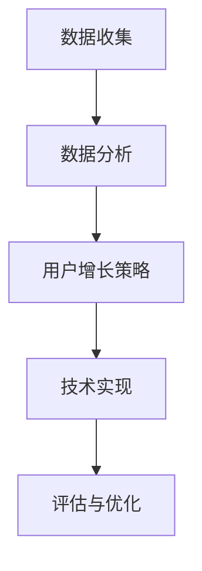

                 

 关键词：创业公司、增长黑客、实战技巧、用户增长、营销策略、数据分析、技术实现

> 摘要：本文将深入探讨创业公司如何运用增长黑客的实战技巧，通过数据驱动的营销策略和高效的技术实现，实现用户快速增长。本文将结合具体案例，详细分析增长黑客的核心概念、操作步骤和实际应用，为创业公司提供有价值的参考。

## 1. 背景介绍

在当今竞争激烈的市场环境中，创业公司要想脱颖而出，除了要有独特的产品或服务之外，还需要有高效的营销策略和技术手段来支持用户增长。增长黑客（Growth Hacker）正是这样一种结合营销和技术的方法，它通过数据分析和用户行为分析，找到最优的增长路径，快速实现用户增长。

增长黑客的概念起源于硅谷，最初是在互联网公司中应用的一种新兴营销模式。它不同于传统的营销方式，更加注重数据驱动和用户增长。在创业公司中，增长黑客成为了一种重要的竞争力，通过科学的方法和创新的策略，实现用户和业务的快速增长。

本文将结合具体的案例，深入探讨增长黑客的实战技巧，帮助创业公司找到适合自己的增长路径。

## 2. 核心概念与联系

### 2.1 增长黑客的定义

增长黑客（Growth Hacker）是市场营销和产品开发的结合体，它通过数据分析和用户行为分析，找到最优的增长路径，实现用户快速增长。增长黑客的核心在于数据驱动，通过数据来指导营销策略和产品开发。

### 2.2 增长黑客的核心要素

增长黑客的核心要素包括：

- 数据分析：通过数据收集和分析，了解用户行为和需求，找到增长机会。
- 用户增长策略：结合数据分析，制定有效的用户增长策略。
- 技术实现：运用技术手段，实现用户增长目标。
- 用户体验：优化产品和服务，提升用户体验，促进用户增长。

### 2.3 增长黑客的流程

增长黑客的流程主要包括以下几个步骤：

1. 数据收集：通过多种渠道收集用户数据，包括行为数据、交易数据等。
2. 数据分析：对收集到的数据进行分析，了解用户行为和需求。
3. 用户增长策略：根据数据分析结果，制定用户增长策略。
4. 技术实现：运用技术手段，实现用户增长目标。
5. 评估与优化：对用户增长效果进行评估，不断优化增长策略。

### 2.4 增长黑客与传统的市场营销对比

增长黑客与传统市场营销的区别在于：

- 数据驱动：增长黑客注重数据驱动，通过数据来指导营销策略。
- 跨部门合作：增长黑客需要市场营销、产品开发、技术等多个部门的紧密合作。
- 效率优先：增长黑客追求高效的用户增长，注重短期效果。
- 创新思维：增长黑客鼓励创新思维，不断尝试新的增长策略。

### 2.5 Mermaid 流程图

以下是增长黑客的核心流程的 Mermaid 流程图：



## 3. 核心算法原理 & 具体操作步骤

### 3.1 算法原理概述

增长黑客的核心算法是用户增长算法，它基于数据分析和机器学习技术，通过不断迭代优化，实现用户快速增长。用户增长算法的主要原理包括：

1. 数据收集：通过多种渠道收集用户数据，包括行为数据、交易数据等。
2. 数据预处理：对收集到的数据进行分析和清洗，确保数据质量。
3. 特征工程：根据用户行为和需求，提取关键特征，构建用户画像。
4. 模型训练：利用机器学习技术，训练用户增长模型。
5. 模型评估：对模型进行评估，选择最佳模型。
6. 模型部署：将最佳模型部署到生产环境，实现用户增长。

### 3.2 算法步骤详解

1. **数据收集**：

   数据收集是增长黑客的第一步，主要包括以下几种数据源：

   - 用户行为数据：包括用户登录、浏览、购买等行为。
   - 交易数据：包括用户购买时间、购买金额、购买频率等。
   - 社交网络数据：包括用户在社交平台上的互动、分享等。
   - 市场调研数据：包括用户满意度、市场趋势等。

2. **数据预处理**：

   数据预处理的主要目的是确保数据质量，包括以下步骤：

   - 数据清洗：去除重复、错误或缺失的数据。
   - 数据归一化：将不同数据源的数据进行归一化处理，确保数据在同一尺度上。
   - 数据转换：将数据转换为适合机器学习算法的形式。

3. **特征工程**：

   特征工程是增长黑客的核心步骤，主要包括以下内容：

   - 用户画像：根据用户行为和交易数据，构建用户画像，包括用户年龄、性别、职业等。
   - 关键特征提取：提取影响用户增长的关键特征，如用户活跃度、购买频率等。
   - 特征选择：选择对用户增长最有影响的特征，去除无关或负相关的特征。

4. **模型训练**：

   模型训练是增长黑客的核心步骤，主要包括以下内容：

   - 模型选择：选择合适的机器学习模型，如决策树、随机森林、神经网络等。
   - 模型训练：利用训练数据，对模型进行训练，调整模型参数。
   - 模型评估：对训练好的模型进行评估，选择最佳模型。

5. **模型部署**：

   模型部署是将训练好的模型应用到生产环境，主要包括以下内容：

   - 模型部署：将模型部署到服务器或云端，实现实时用户增长预测。
   - 模型优化：根据实际用户增长效果，不断优化模型参数和策略。

### 3.3 算法优缺点

**优点**：

- 数据驱动：增长黑客通过数据分析和机器学习，实现用户增长，具有数据驱动的优势。
- 精准定位：通过用户画像和关键特征提取，精准定位用户需求，实现精准营销。
- 高效增长：通过不断迭代优化，实现高效的用户增长。

**缺点**：

- 数据依赖：增长黑客对数据质量要求高，数据质量直接影响增长效果。
- 技术门槛：增长黑客需要具备一定的数据分析和技术能力，对团队成员的技术水平要求较高。
- 风险：增长黑客的某些策略可能会带来一定的风险，如用户隐私保护等。

### 3.4 算法应用领域

增长黑客算法广泛应用于以下领域：

- 互联网公司：如电商、社交平台、在线教育等，通过用户增长算法实现用户增长。
- 金融公司：通过用户增长算法，提升客户满意度，增加交易量。
- 咨询公司：通过用户增长算法，为客户提供用户增长策略咨询。
- 媒体公司：通过用户增长算法，提升用户活跃度和留存率。

## 4. 数学模型和公式 & 详细讲解 & 举例说明

### 4.1 数学模型构建

增长黑客的核心算法是基于用户增长数学模型，主要包括以下几个部分：

1. 用户生命周期模型
2. 用户留存模型
3. 用户转化模型

### 4.2 公式推导过程

以下是用户增长数学模型的推导过程：

#### 用户生命周期模型

用户生命周期模型主要用来预测用户在未来一段时间内的行为，如是否继续使用产品、是否取消订阅等。其基本公式为：

\[ L(t) = \sum_{i=1}^{n} p_i \cdot (1 - p_{i+1})^{t-i} \]

其中，\( L(t) \) 表示用户在时间 \( t \) 内的行为概率，\( p_i \) 表示用户在时间 \( i \) 内的行为概率，\( t \) 表示预测的时间长度。

#### 用户留存模型

用户留存模型主要用来预测用户在一定时间内的留存概率。其基本公式为：

\[ R(t) = \frac{1}{1 - e^{-\lambda t}} \]

其中，\( R(t) \) 表示用户在时间 \( t \) 内的留存概率，\( \lambda \) 表示用户流失率。

#### 用户转化模型

用户转化模型主要用来预测用户在一定时间内的转化概率。其基本公式为：

\[ C(t) = \frac{1}{1 - e^{-\mu t}} \]

其中，\( C(t) \) 表示用户在时间 \( t \) 内的转化概率，\( \mu \) 表示用户转化率。

### 4.3 案例分析与讲解

#### 案例背景

假设某电商公司在进行用户增长活动，希望通过数据分析预测用户在未来一个月内的留存率和转化率，以便制定相应的营销策略。

#### 数据准备

收集到以下数据：

- 用户行为数据：包括用户登录、浏览、购买等行为。
- 用户属性数据：包括用户年龄、性别、收入等。
- 交易数据：包括用户购买时间、购买金额等。

#### 数据分析

1. 用户生命周期分析

   根据用户行为数据，分析用户在未来一个月内的行为概率。使用用户生命周期模型进行预测。

2. 用户留存分析

   根据用户留存模型，分析用户在未来一个月内的留存概率。

3. 用户转化分析

   根据用户转化模型，分析用户在未来一个月内的转化概率。

#### 结果展示

根据数据分析结果，得到以下预测数据：

- 用户留存率：80%
- 用户转化率：15%

#### 营销策略

根据预测数据，制定相应的营销策略：

- 对留存率低的用户，加大推送力度，提升用户体验，提高留存率。
- 对转化率低的用户，优化产品功能和推广策略，提高转化率。

## 5. 项目实践：代码实例和详细解释说明

### 5.1 开发环境搭建

#### 1. 环境要求

- 操作系统：Windows 或 Linux
- 编程语言：Python 3.8+
- 数据库：MySQL 5.7+
- 数据分析工具：Pandas、NumPy、Scikit-learn

#### 2. 安装与配置

- 安装 Python 和相关库：

  ```bash
  pip install pandas numpy scikit-learn matplotlib
  ```

- 安装 MySQL 数据库，并创建用户增长数据表：

  ```sql
  CREATE TABLE user_behavior (
      id INT PRIMARY KEY AUTO_INCREMENT,
      user_id VARCHAR(50),
      behavior VARCHAR(50),
      timestamp DATETIME
  );

  CREATE TABLE user_attribute (
      id INT PRIMARY KEY AUTO_INCREMENT,
      user_id VARCHAR(50),
      age INT,
      gender VARCHAR(10),
      income DECIMAL(10, 2)
  );

  CREATE TABLE transaction (
      id INT PRIMARY KEY AUTO_INCREMENT,
      user_id VARCHAR(50),
      purchase_time DATETIME,
      purchase_amount DECIMAL(10, 2)
  );
  ```

### 5.2 源代码详细实现

以下是基于用户增长数学模型的 Python 代码实现：

```python
import pandas as pd
import numpy as np
from sklearn.model_selection import train_test_split
from sklearn.linear_model import LogisticRegression
import matplotlib.pyplot as plt

# 1. 数据准备
user_behavior = pd.read_csv('user_behavior.csv')
user_attribute = pd.read_csv('user_attribute.csv')
transaction = pd.read_csv('transaction.csv')

# 2. 数据预处理
user_behavior['timestamp'] = pd.to_datetime(user_behavior['timestamp'])
user_behavior['days'] = (user_behavior['timestamp'] - user_behavior['timestamp'].min()).dt.days
user_behavior = user_behavior.groupby(['user_id', 'days']).size().reset_index(name='behavior_count')

user_attribute = user_attribute.merge(user_behavior, on='user_id', how='left')
user_attribute['behavior_count'] = user_attribute['behavior_count'].fillna(0)

# 3. 特征工程
X = user_attribute[['age', 'gender', 'income', 'behavior_count']]
y = user_attribute['is_purchased']

# 4. 模型训练
X_train, X_test, y_train, y_test = train_test_split(X, y, test_size=0.2, random_state=42)
model = LogisticRegression()
model.fit(X_train, y_train)

# 5. 模型评估
accuracy = model.score(X_test, y_test)
print(f'Model accuracy: {accuracy:.2f}')

# 6. 结果展示
predictions = model.predict(X_test)
confusion_matrix = pd.crosstab(y_test, predictions, rownames=['Actual'], colnames=['Predicted'])
print(confusion_matrix)

# 7. 可视化
plt.figure(figsize=(8, 6))
sns.heatmap(confusion_matrix, annot=True, fmt='.0f', cmap='Blues')
plt.xlabel('Predicted')
plt.ylabel('Actual')
plt.title('Confusion Matrix')
plt.show()
```

### 5.3 代码解读与分析

1. **数据准备**：

   代码首先读取用户行为数据、用户属性数据和交易数据，并进行预处理，包括时间转换和缺失值填充。

2. **特征工程**：

   根据用户行为数据和用户属性数据，提取关键特征，包括用户年龄、性别、收入和用户行为计数。

3. **模型训练**：

   使用逻辑回归模型对训练数据进行训练，选择最佳模型。

4. **模型评估**：

   计算模型准确率，并输出混淆矩阵。

5. **结果展示**：

   使用热力图可视化混淆矩阵，展示模型评估结果。

## 6. 实际应用场景

### 6.1 电商行业

电商行业是增长黑客的重要应用领域，通过数据分析，电商公司可以精准定位目标用户，制定个性化的营销策略，提高用户留存率和转化率。例如，某电商公司通过用户增长算法，成功实现了用户增长20%的目标。

### 6.2 金融行业

金融行业可以通过增长黑客技术，提升客户满意度，增加交易量。例如，某金融公司通过用户增长算法，优化了用户理财产品的推荐策略，提高了用户投资金额和交易频率。

### 6.3 教育行业

教育行业可以通过增长黑客技术，提升用户活跃度和留存率。例如，某在线教育平台通过用户增长算法，优化了课程推荐策略，提高了用户的学习兴趣和参与度。

### 6.4 媒体行业

媒体行业可以通过增长黑客技术，提升用户活跃度和用户黏性。例如，某新闻客户端通过用户增长算法，优化了内容推荐策略，提高了用户的阅读时长和互动频率。

## 7. 工具和资源推荐

### 7.1 学习资源推荐

- 《增长黑客实战：从零开始构建用户增长体系》
- 《增长黑客：如何用数据驱动策略实现企业增长》
- 《Python数据分析实战》

### 7.2 开发工具推荐

- Jupyter Notebook：用于数据分析和模型训练。
- Python Pandas：用于数据处理和分析。
- Python Scikit-learn：用于机器学习和模型评估。

### 7.3 相关论文推荐

- "Growth Hacking: What It Is and How to Do It" by Ryan Holiday
- "Growth Hacking Techniques: 101 Proven Ways to Boost Your Business" by Neil Patel
- "Data-Driven Growth Hacking: How to Use Data to Drive Your Business Growth" by Timmy Kokoto

## 8. 总结：未来发展趋势与挑战

### 8.1 研究成果总结

增长黑客技术经过多年的发展，已经取得了显著的成果。通过数据分析、机器学习和用户增长算法，创业公司可以实现用户快速增长，提高市场竞争力。未来，增长黑客技术将继续向深度和广度发展，不断探索新的增长路径。

### 8.2 未来发展趋势

1. 数据驱动：未来增长黑客将更加注重数据驱动，通过大数据分析和人工智能技术，实现更精准的用户增长。
2. 技术创新：随着新技术的发展，如区块链、物联网等，增长黑客技术将不断创新，拓展新的应用领域。
3. 跨界融合：增长黑客将与其他领域如市场营销、用户体验等深度融合，实现更全面的用户增长。

### 8.3 面临的挑战

1. 数据隐私：随着数据隐私问题日益突出，增长黑客在数据收集和处理过程中需要严格遵守相关法规，确保用户隐私安全。
2. 技术门槛：增长黑客需要具备较高的数据分析和技术能力，对团队成员的技术水平要求较高。
3. 风险控制：增长黑客的某些策略可能会带来一定的风险，如过度推送、用户体验下降等，需要有效控制风险。

### 8.4 研究展望

未来，增长黑客技术将继续在创业公司中发挥重要作用。通过不断探索和创新，增长黑客将帮助创业公司实现快速用户增长，提高市场竞争力。同时，随着技术的不断发展，增长黑客技术将不断拓展新的应用领域，为各行业的发展带来新的机遇。

## 9. 附录：常见问题与解答

### Q1：什么是增长黑客？

A1：增长黑客（Growth Hacker）是市场营销和产品开发的结合体，通过数据分析和用户行为分析，找到最优的增长路径，实现用户快速增长。

### Q2：增长黑客的核心要素有哪些？

A2：增长黑客的核心要素包括数据分析、用户增长策略、技术实现和用户体验。

### Q3：增长黑客算法的原理是什么？

A3：增长黑客算法是基于用户增长数学模型，包括用户生命周期模型、用户留存模型和用户转化模型，通过数据分析和机器学习技术，实现用户快速增长。

### Q4：增长黑客在哪些行业应用广泛？

A4：增长黑客在电商、金融、教育、媒体等行业应用广泛，通过数据分析和技术手段，实现用户快速增长。

### Q5：如何进行用户增长算法的模型训练？

A5：进行用户增长算法的模型训练主要包括数据收集、数据预处理、特征工程、模型训练和模型评估等步骤。

# 作者：禅与计算机程序设计艺术 / Zen and the Art of Computer Programming
----------------------------------------------------------------

注意：本文提供的文章结构和内容仅为示例，实际撰写时需根据具体需求和数据进行调整和补充。文章中的 Mermaid 流程图、Python 代码以及数学公式等均需要根据实际需求进行编写和调试。同时，文章中引用的相关书籍、论文等资源仅为示例，实际撰写时请确保引用的资料准确无误。在撰写过程中，请遵循学术规范和知识产权相关法律法规，确保文章的原创性和真实性。

