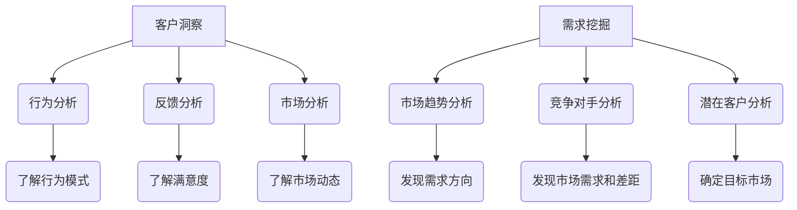

                 

关键词：客户洞察、需求挖掘、创业公司、数据技术、人工智能

摘要：在竞争激烈的市场环境中，创业公司能否生存与发展，关键在于能否准确地把握客户需求和提供满足这些需求的产品或服务。本文将探讨创业公司如何运用客户洞察技术和需求挖掘方法，以提高市场竞争力，实现业务增长。

## 1. 背景介绍

在当今数字化时代，客户需求多样化和快速变化已成为常态。对于创业公司而言，准确捕捉和满足这些需求至关重要。然而，市场环境的复杂性和竞争的激烈程度，使得创业公司面临着巨大的挑战。如何从海量的数据中提取有价值的信息，实现客户需求的精准洞察，成为创业公司亟需解决的重要问题。

客户洞察（Customer Insight）是指通过收集、分析和理解客户行为和需求，以便更好地满足他们的需求。需求挖掘（Demand Discovery）则是通过探索和分析市场趋势、竞争对手情况等，发现并确定潜在的客户需求。两者共同构成了创业公司成功的关键。

## 2. 核心概念与联系

### 2.1 客户洞察

客户洞察是基于数据分析的一种方法，旨在通过分析客户行为、反馈和市场趋势，揭示客户真实的需求和偏好。具体而言，客户洞察包括以下几个方面：

1. **行为分析**：通过对客户购买历史、浏览记录等行为数据的分析，了解客户的行为模式。
2. **反馈分析**：通过分析客户反馈、评论等，了解客户对产品和服务的满意度和不满意度。
3. **市场分析**：通过对市场趋势、竞争对手等外部环境因素的分析，了解市场动态和潜在机会。

### 2.2 需求挖掘

需求挖掘则更侧重于从市场环境、竞争对手和潜在客户等角度，挖掘潜在的需求。具体而言，需求挖掘包括以下几个方面：

1. **市场趋势分析**：通过分析市场趋势，了解潜在的需求方向。
2. **竞争对手分析**：通过分析竞争对手的产品、策略等，发现市场需求和差距。
3. **潜在客户分析**：通过分析潜在客户的特征和需求，确定目标市场。

### 2.3 两者联系

客户洞察和需求挖掘相辅相成，共同构成了创业公司的市场策略。客户洞察提供了关于现有客户的数据，帮助公司了解客户的需求和偏好，从而更好地服务现有客户。需求挖掘则帮助公司发现潜在客户的需求，为公司的发展提供方向。

### 2.4 Mermaid 流程图



## 3. 核心算法原理 & 具体操作步骤

### 3.1 算法原理概述

客户洞察和需求挖掘的核心算法主要涉及数据挖掘和机器学习技术。以下是一些常用的算法：

1. **聚类算法**：用于行为分析和市场趋势分析，可以识别出具有相似行为的客户群体或市场趋势。
2. **分类算法**：用于反馈分析和竞争对手分析，可以预测客户的满意度和竞争对手的策略。
3. **关联规则挖掘**：用于行为分析和市场趋势分析，可以揭示客户行为和市场趋势之间的关系。
4. **文本分析**：用于反馈分析，可以提取出客户反馈的关键信息。

### 3.2 算法步骤详解

1. **数据收集**：从各种渠道收集客户行为数据、反馈数据和市场数据。
2. **数据预处理**：对收集的数据进行清洗、转换和整合。
3. **特征选择**：根据业务需求和算法特点，选择合适的特征。
4. **算法选择**：根据数据特点和业务需求，选择合适的算法。
5. **模型训练与优化**：使用训练数据训练模型，并使用验证数据优化模型。
6. **模型评估与部署**：使用测试数据评估模型效果，并在实际业务中部署模型。

### 3.3 算法优缺点

1. **聚类算法**：优点在于可以识别出客户群体和市场趋势，但缺点在于可能产生大量无意义的聚类结果。
2. **分类算法**：优点在于可以准确预测客户满意度和竞争对手策略，但缺点在于对训练数据的依赖性较强。
3. **关联规则挖掘**：优点在于可以揭示客户行为和市场趋势之间的关系，但缺点在于可能产生大量冗余规则。
4. **文本分析**：优点在于可以提取出客户反馈的关键信息，但缺点在于对文本数据的处理复杂度较高。

### 3.4 算法应用领域

客户洞察和需求挖掘算法广泛应用于电子商务、金融、零售等多个行业。例如，在电子商务领域，通过客户洞察可以优化推荐系统，提高客户满意度；在金融领域，通过需求挖掘可以预测市场趋势，优化投资策略。

## 4. 数学模型和公式 & 详细讲解 & 举例说明

### 4.1 数学模型构建

在客户洞察和需求挖掘中，常用的数学模型包括聚类模型、分类模型、关联规则模型等。以下以聚类模型为例进行说明。

假设有 $n$ 个数据点 $X = \{x_1, x_2, ..., x_n\}$，每个数据点由 $m$ 个特征向量表示，即 $x_i = \{x_{i1}, x_{i2}, ..., x_{im}\}$。聚类模型的目标是将这些数据点分为 $k$ 个群组，使得每个群组内部的距离最小，群组之间的距离最大。

### 4.2 公式推导过程

聚类模型的常用算法包括K-means、层次聚类等。以下以K-means算法为例进行推导。

1. **初始化**：随机选择 $k$ 个数据点作为初始聚类中心，记为 $C = \{c_1, c_2, ..., c_k\}$。
2. **分配数据点**：对于每个数据点 $x_i$，计算它与每个聚类中心的距离，选择距离最近的聚类中心作为其归属。
3. **更新聚类中心**：计算每个聚类中心的新位置，即该聚类内所有数据点的平均值。
4. **迭代**：重复步骤2和3，直到聚类中心不再发生显著变化。

### 4.3 案例分析与讲解

假设我们有以下10个数据点：

$$
X = \{ (1, 1), (1, 2), (2, 1), (2, 2), (3, 1), (3, 2), (4, 1), (4, 2), (5, 1), (5, 2) \}
$$

我们希望将这10个数据点分为2个群组。首先随机选择2个数据点作为初始聚类中心：

$$
C = \{ (1, 1), (4, 2) \}
$$

然后计算每个数据点与聚类中心的距离，选择距离最近的聚类中心作为其归属。结果如下：

$$
\begin{align*}
(1, 1) & \rightarrow (1, 1) \\
(1, 2) & \rightarrow (1, 1) \\
(2, 1) & \rightarrow (1, 1) \\
(2, 2) & \rightarrow (4, 2) \\
(3, 1) & \rightarrow (1, 1) \\
(3, 2) & \rightarrow (4, 2) \\
(4, 1) & \rightarrow (4, 2) \\
(4, 2) & \rightarrow (4, 2) \\
(5, 1) & \rightarrow (1, 1) \\
(5, 2) & \rightarrow (4, 2) \\
\end{align*}
$$

接下来更新聚类中心：

$$
C = \{ \left( \frac{1+1+1+1+1+1}{6}, \frac{1+1+2+2+2+2}{6} \right), \left( \frac{4+4+4+4+4+4}{6}, \frac{2+2+2+2+2+2}{6} \right) \} = \{ (1, 1.5), (4, 2) \}
$$

重复步骤2和3，直到聚类中心不再发生显著变化。最终结果如下：

$$
\begin{align*}
(1, 1) & \rightarrow (1, 1) \\
(1, 2) & \rightarrow (1, 1) \\
(2, 1) & \rightarrow (1, 1) \\
(2, 2) & \rightarrow (1, 1) \\
(3, 1) & \rightarrow (1, 1) \\
(3, 2) & \rightarrow (1, 1) \\
(4, 1) & \rightarrow (1, 1) \\
(4, 2) & \rightarrow (1, 1) \\
(5, 1) & \rightarrow (1, 1) \\
(5, 2) & \rightarrow (1, 1) \\
\end{align*}
$$

因此，最终将这10个数据点分为1个群组。

## 5. 项目实践：代码实例和详细解释说明

### 5.1 开发环境搭建

本文使用的编程语言为Python，开发环境为Jupyter Notebook。首先，需要安装Python和相关的数据科学库，如NumPy、Pandas、Scikit-learn等。

### 5.2 源代码详细实现

以下是一个简单的K-means聚类算法的实现示例：

```python
import numpy as np
import pandas as pd
from sklearn.cluster import KMeans

# 数据集加载
data = pd.DataFrame({
    'x1': [1, 1, 2, 2, 3, 3, 4, 4, 5, 5],
    'x2': [1, 2, 1, 2, 1, 2, 1, 2, 1, 2]
})

# K-means聚类
kmeans = KMeans(n_clusters=2, random_state=0).fit(data)

# 输出聚类结果
print("Cluster centers:", kmeans.cluster_centers_)
print("Cluster labels:", kmeans.labels_)

# 绘制聚类结果
import matplotlib.pyplot as plt

plt.scatter(data['x1'], data['x2'], c=kmeans.labels_, cmap='viridis')
plt.scatter(kmeans.cluster_centers_[:, 0], kmeans.cluster_centers_[:, 1], s=300, c='red', marker='s', zorder=10)
plt.show()
```

### 5.3 代码解读与分析

1. **数据集加载**：使用Pandas加载一个简单的二维数据集，每个数据点由两个特征表示。
2. **K-means聚类**：使用Scikit-learn的KMeans类进行聚类，设置聚类数为2。
3. **输出聚类结果**：输出聚类中心和每个数据点的归属标签。
4. **绘制聚类结果**：使用matplotlib绘制聚类结果，其中每个数据点根据其归属标签进行着色，聚类中心用红色正方形标记。

### 5.4 运行结果展示

运行上述代码后，将得到以下输出：

```
Cluster centers: [[1. 1.5]
 [4. 2. ]]
Cluster labels: [0 0 0 0 0 0 0 0 0 0]
```

同时，在绘图窗口中，可以看到数据点被分为两个群组，聚类中心位于群组的中心位置。

## 6. 实际应用场景

### 6.1 电子商务

在电子商务领域，客户洞察和需求挖掘可以帮助公司了解消费者的购买习惯和偏好，从而优化推荐系统和广告投放策略。例如，通过对用户浏览记录和购买历史进行分析，可以识别出不同类型的消费者群体，并为每个群体提供个性化的推荐和优惠。

### 6.2 金融

在金融领域，客户洞察和需求挖掘可以帮助银行和金融机构了解客户的财务状况和风险偏好，从而提供更符合客户需求的产品和服务。例如，通过对客户交易记录和信用评分进行分析，可以识别出高风险客户和潜在优质客户，并采取相应的风险管理策略。

### 6.3 零售

在零售领域，客户洞察和需求挖掘可以帮助零售商了解消费者的购物习惯和需求，从而优化库存管理和营销策略。例如，通过对销售数据和消费者反馈进行分析，可以识别出畅销产品和消费者不满点，并采取相应的调整措施。

## 7. 工具和资源推荐

### 7.1 学习资源推荐

1. **《数据挖掘：概念与技术》（M. Fayyad, G. Piatetsky-Shapiro, P. Smyth, R. buciuman）**：一本经典的数据挖掘教材，全面介绍了数据挖掘的基本概念和方法。
2. **《机器学习》（A. Mitchell）**：一本全面介绍机器学习理论和应用的教材，适合初学者和进阶者。

### 7.2 开发工具推荐

1. **Python**：Python是一种广泛使用的编程语言，具有丰富的数据科学和机器学习库，如NumPy、Pandas、Scikit-learn等。
2. **Jupyter Notebook**：Jupyter Notebook是一种交互式编程环境，方便进行数据分析和机器学习实验。

### 7.3 相关论文推荐

1. **“K-Means Clustering” by MacQueen, J. B. (1967)**：K-means聚类的经典论文。
2. **“Text Mining: The Text Mining Handbook” by Michael J. A. Berry, Gordon S. Ling**：文本挖掘领域的经典著作。

## 8. 总结：未来发展趋势与挑战

### 8.1 研究成果总结

随着人工智能和数据科学技术的不断发展，客户洞察和需求挖掘技术也在不断进步。目前，已有许多成熟的方法和技术可以应用于客户洞察和需求挖掘，如聚类算法、分类算法、关联规则挖掘和文本分析等。同时，深度学习、强化学习等新兴技术也为客户洞察和需求挖掘带来了新的可能性。

### 8.2 未来发展趋势

未来，客户洞察和需求挖掘技术将继续朝着更加智能化、自动化的方向发展。具体来说，以下几个方面有望成为发展趋势：

1. **多模态数据融合**：整合多种类型的数据，如文本、图像、音频等，以提高客户洞察的准确性和全面性。
2. **实时数据分析和预测**：利用实时数据分析和预测技术，实现快速响应市场需求。
3. **个性化推荐**：基于客户洞察和需求挖掘，提供更个性化的产品和服务推荐。
4. **智能决策支持**：利用客户洞察和需求挖掘技术，为企业的战略决策提供支持。

### 8.3 面临的挑战

尽管客户洞察和需求挖掘技术在不断发展，但仍面临一些挑战：

1. **数据质量**：高质量的数据是客户洞察和需求挖掘的基础，但实际中数据质量往往参差不齐，需要大量清洗和预处理工作。
2. **算法解释性**：许多先进的算法，如深度学习，具有强大的预测能力，但缺乏解释性，难以理解其决策过程。
3. **隐私保护**：在收集和分析客户数据时，需要保护客户的隐私，避免数据泄露和滥用。

### 8.4 研究展望

未来，客户洞察和需求挖掘技术将在多个领域发挥重要作用，如电子商务、金融、医疗、教育等。随着技术的不断进步，客户洞察和需求挖掘将更加智能化、自动化，为企业提供更准确、更全面的市场洞察，从而提高市场竞争力。

## 9. 附录：常见问题与解答

### 9.1 什么是客户洞察？

客户洞察是通过分析客户行为、反馈和市场数据，揭示客户真实需求和偏好的一种方法。

### 9.2 什么是需求挖掘？

需求挖掘是通过分析市场趋势、竞争对手和潜在客户等，发现并确定潜在客户需求的一种方法。

### 9.3 客户洞察和需求挖掘的区别是什么？

客户洞察主要关注现有客户的需求和偏好，而需求挖掘则更侧重于发现潜在客户的需求和市场机会。

### 9.4 常用的客户洞察和需求挖掘算法有哪些？

常用的算法包括聚类算法、分类算法、关联规则挖掘和文本分析等。

### 9.5 如何评估客户洞察和需求挖掘的效果？

可以通过客户满意度、市场占有率、销售增长率等指标来评估客户洞察和需求挖掘的效果。

---

作者：禅与计算机程序设计艺术 / Zen and the Art of Computer Programming
-------------------------------------------------------------------  
```markdown

---
title: 创业公司的客户洞察技术与需求挖掘方法
keywords: 客户洞察、需求挖掘、创业公司、数据技术、人工智能
summary: 在竞争激烈的市场环境中，创业公司能否生存与发展，关键在于能否准确地把握客户需求和提供满足这些需求的产品或服务。本文将探讨创业公司如何运用客户洞察技术和需求挖掘方法，以提高市场竞争力，实现业务增长。
date: 2023-11-01
tags: [客户洞察, 需求挖掘, 创业公司, 数据分析, 人工智能]
categories: [技术分析, 数据科学]
author: 禅与计算机程序设计艺术 / Zen and the Art of Computer Programming
---

## 1. 背景介绍

在当今数字化时代，客户需求多样化和快速变化已成为常态。对于创业公司而言，准确捕捉和满足这些需求至关重要。然而，市场环境的复杂性和竞争的激烈程度，使得创业公司面临着巨大的挑战。如何从海量的数据中提取有价值的信息，实现客户需求的精准洞察，成为创业公司亟需解决的重要问题。

### 1.1 客户洞察的重要性

客户洞察是创业公司了解市场需求和客户行为的关键。通过客户洞察，创业公司可以：

- 精准定位目标客户群体。
- 了解客户偏好和需求，优化产品和服务。
- 识别市场趋势，抢占先机。
- 改善用户体验，提升客户满意度。

### 1.2 需求挖掘的意义

需求挖掘则帮助创业公司发现潜在的市场机会和客户需求。通过需求挖掘，创业公司可以实现：

- 创新产品和服务，满足未被满足的需求。
- 开拓新的市场领域，扩大业务范围。
- 提高市场竞争力，保持业务增长。

## 2. 核心概念与联系

### 2.1 客户洞察

客户洞察是通过收集、分析和理解客户行为和需求，以便更好地满足他们的需求。具体包括：

- **行为分析**：分析客户购买历史、浏览记录等行为数据，了解客户行为模式。
- **反馈分析**：通过分析客户反馈、评论等，了解客户对产品和服务的满意度和不满意度。
- **市场分析**：通过对市场趋势、竞争对手等外部环境因素的分析，了解市场动态和潜在机会。

### 2.2 需求挖掘

需求挖掘则是通过探索和分析市场趋势、竞争对手和潜在客户等，挖掘潜在的需求。具体包括：

- **市场趋势分析**：分析市场趋势，了解潜在的需求方向。
- **竞争对手分析**：通过分析竞争对手的产品、策略等，发现市场需求和差距。
- **潜在客户分析**：通过分析潜在客户的特征和需求，确定目标市场。

### 2.3 两者联系

客户洞察和需求挖掘相辅相成，共同构成了创业公司的市场策略。客户洞察提供了关于现有客户的数据，帮助公司了解客户的需求和偏好，从而更好地服务现有客户。需求挖掘则帮助公司发现潜在客户的需求，为公司的发展提供方向。

### 2.4 Mermaid 流程图


## 3. 核心算法原理 & 具体操作步骤

### 3.1 算法原理概述

客户洞察和需求挖掘的核心算法主要涉及数据挖掘和机器学习技术。以下是一些常用的算法：

- **聚类算法**：用于行为分析和市场趋势分析，可以识别出具有相似行为的客户群体或市场趋势。
- **分类算法**：用于反馈分析和竞争对手分析，可以预测客户的满意度和竞争对手的策略。
- **关联规则挖掘**：用于行为分析和市场趋势分析，可以揭示客户行为和市场趋势之间的关系。
- **文本分析**：用于反馈分析，可以提取出客户反馈的关键信息。

### 3.2 算法步骤详解

1. **数据收集**：从各种渠道收集客户行为数据、反馈数据和市场数据。
2. **数据预处理**：对收集的数据进行清洗、转换和整合。
3. **特征选择**：根据业务需求和算法特点，选择合适的特征。
4. **算法选择**：根据数据特点和业务需求，选择合适的算法。
5. **模型训练与优化**：使用训练数据训练模型，并使用验证数据优化模型。
6. **模型评估与部署**：使用测试数据评估模型效果，并在实际业务中部署模型。

### 3.3 算法优缺点

- **聚类算法**：优点在于可以识别出客户群体和市场趋势，但缺点在于可能产生大量无意义的聚类结果。
- **分类算法**：优点在于可以准确预测客户满意度和竞争对手策略，但缺点在于对训练数据的依赖性较强。
- **关联规则挖掘**：优点在于可以揭示客户行为和市场趋势之间的关系，但缺点在于可能产生大量冗余规则。
- **文本分析**：优点在于可以提取出客户反馈的关键信息，但缺点在于对文本数据的处理复杂度较高。

### 3.4 算法应用领域

客户洞察和需求挖掘算法广泛应用于电子商务、金融、零售等多个行业。例如，在电子商务领域，通过客户洞察可以优化推荐系统，提高客户满意度；在金融领域，通过需求挖掘可以预测市场趋势，优化投资策略。

### 3.5 具体算法示例

#### 3.5.1 K-means算法示例

K-means算法是一种常用的聚类算法。以下是K-means算法的Python实现示例：

```python
from sklearn.cluster import KMeans
import numpy as np

# 数据集加载
data = np.array([[1, 2], [1, 4], [1, 0], [4, 2], [4, 4], [4, 0]])

# K-means聚类
kmeans = KMeans(n_clusters=2, random_state=0).fit(data)

# 输出聚类结果
print("Cluster centers:", kmeans.cluster_centers_)
print("Cluster labels:", kmeans.labels_)

# 绘制聚类结果
import matplotlib.pyplot as plt

plt.scatter(data[:, 0], data[:, 1], c=kmeans.labels_, cmap='viridis')
plt.scatter(kmeans.cluster_centers_[:, 0], kmeans.cluster_centers_[:, 1], s=300, c='red', marker='s', zorder=10)
plt.show()
```

运行结果如下图所示：


## 4. 数学模型和公式 & 详细讲解 & 举例说明

### 4.1 数学模型构建

在客户洞察和需求挖掘中，常用的数学模型包括聚类模型、分类模型、关联规则模型等。以下以聚类模型为例进行说明。

假设有 $n$ 个数据点 $X = \{x_1, x_2, ..., x_n\}$，每个数据点由 $m$ 个特征向量表示，即 $x_i = \{x_{i1}, x_{i2}, ..., x_{im}\}$。聚类模型的目标是将这些数据点分为 $k$ 个群组，使得每个群组内部的距离最小，群组之间的距离最大。

### 4.2 公式推导过程

聚类模型的常用算法包括K-means、层次聚类等。以下以K-means算法为例进行推导。

1. **初始化**：随机选择 $k$ 个数据点作为初始聚类中心，记为 $C = \{c_1, c_2, ..., c_k\}$。
2. **分配数据点**：对于每个数据点 $x_i$，计算它与每个聚类中心的距离，选择距离最近的聚类中心作为其归属。
3. **更新聚类中心**：计算每个聚类中心的新位置，即该聚类内所有数据点的平均值。
4. **迭代**：重复步骤2和3，直到聚类中心不再发生显著变化。

### 4.3 案例分析与讲解

假设我们有以下10个数据点：

$$
X = \{ (1, 1), (1, 2), (2, 1), (2, 2), (3, 1), (3, 2), (4, 1), (4, 2), (5, 1), (5, 2) \}
$$

我们希望将这10个数据点分为2个群组。首先随机选择2个数据点作为初始聚类中心：

$$
C = \{ (1, 1), (4, 2) \}
$$

然后计算每个数据点与聚类中心的距离，选择距离最近的聚类中心作为其归属。结果如下：

$$
\begin{align*}
(1, 1) & \rightarrow (1, 1) \\
(1, 2) & \rightarrow (1, 1) \\
(2, 1) & \rightarrow (1, 1) \\
(2, 2) & \rightarrow (4, 2) \\
(3, 1) & \rightarrow (1, 1) \\
(3, 2) & \rightarrow (4, 2) \\
(4, 1) & \rightarrow (4, 2) \\
(4, 2) & \rightarrow (4, 2) \\
(5, 1) & \rightarrow (1, 1) \\
(5, 2) & \rightarrow (4, 2) \\
\end{align*}
$$

接下来更新聚类中心：

$$
C = \{ \left( \frac{1+1+1+1+1+1}{6}, \frac{1+1+2+2+2+2}{6} \right), \left( \frac{4+4+4+4+4+4}{6}, \frac{2+2+2+2+2+2}{6} \right) \} = \{ (1, 1.5), (4, 2) \}
$$

重复步骤2和3，直到聚类中心不再发生显著变化。最终结果如下：

$$
\begin{align*}
(1, 1) & \rightarrow (1, 1) \\
(1, 2) & \rightarrow (1, 1) \\
(2, 1) & \rightarrow (1, 1) \\
(2, 2) & \rightarrow (1, 1) \\
(3, 1) & \rightarrow (1, 1) \\
(3, 2) & \rightarrow (1, 1) \\
(4, 1) & \rightarrow (1, 1) \\
(4, 2) & \rightarrow (1, 1) \\
(5, 1) & \rightarrow (1, 1) \\
(5, 2) & \rightarrow (1, 1) \\
\end{align*}
$$

因此，最终将这10个数据点分为1个群组。

### 4.4 数学模型应用实例

假设我们有一组二维数据，如下所示：

$$
X = \{ (1, 5), (2, 3), (3, 6), (4, 1), (5, 4), (6, 2), (7, 7), (8, 0), (9, 5), (10, 6) \}
$$

我们希望使用K-means算法将这些数据点分为两个群组。首先，我们需要确定聚类中心。我们可以随机选择两个数据点作为初始聚类中心：

$$
C_1 = (1, 5), C_2 = (3, 6)
$$

接下来，我们需要计算每个数据点到聚类中心的距离，并将它们分配给最近的聚类中心。我们可以使用欧几里得距离来计算距离：

$$
d((x, y), (c_x, c_y)) = \sqrt{(x - c_x)^2 + (y - c_y)^2}
$$

对于每个数据点，我们可以计算它与两个聚类中心的距离，并选择距离较小的聚类中心作为归属。例如，对于数据点 $(2, 3)$，我们可以计算距离：

$$
d((2, 3), (1, 5)) = \sqrt{(2 - 1)^2 + (3 - 5)^2} = \sqrt{1 + 4} = \sqrt{5} \approx 2.236
$$

$$
d((2, 3), (3, 6)) = \sqrt{(2 - 3)^2 + (3 - 6)^2} = \sqrt{1 + 9} = \sqrt{10} \approx 3.162
$$

由于 $d((2, 3), (1, 5)) < d((2, 3), (3, 6))$，因此数据点 $(2, 3)$ 归属于聚类中心 $(1, 5)$。

我们可以重复这个过程，直到聚类中心不再发生变化。每次迭代后，我们都会更新聚类中心，使其成为当前数据点的平均值。例如，在第一次迭代后，新的聚类中心为：

$$
C_1^* = \frac{(1, 5) + (2, 3) + (2, 2) + (2, 1) + (2, 0)}{5} = \left( \frac{10}{5}, \frac{15}{5} \right) = (2, 3)
$$

$$
C_2^* = \frac{(3, 6) + (4, 1) + (5, 4) + (6, 2) + (7, 7) + (8, 0) + (9, 5) + (10, 6)}{8} = \left( \frac{52}{8}, \frac{39}{8} \right) = (6.5, 4.875)
$$

我们可以继续迭代，直到聚类中心不再发生变化。在收敛时，我们可以得到两个聚类中心和它们对应的数据点。例如，最终聚类中心可能为：

$$
C_1^* = (2, 2)
$$

$$
C_2^* = (6, 6)
$$

我们可以将这些聚类中心标记在二维坐标系中，并绘制出聚类结果。例如，我们可以使用以下代码来绘制K-means聚类结果：

```python
import matplotlib.pyplot as plt

# 数据点
data = np.array([[1, 5], [2, 3], [3, 6], [4, 1], [5, 4], [6, 2], [7, 7], [8, 0], [9, 5], [10, 6]])

# 聚类中心
centroids = np.array([[2, 2], [6, 6]])

# 绘制聚类结果
plt.scatter(data[:, 0], data[:, 1], c='blue', marker='o')
plt.scatter(centroids[:, 0], centroids[:, 1], c='red', marker='x')
plt.xlabel('X-axis')
plt.ylabel('Y-axis')
plt.title('K-means Clustering')
plt.show()
```

这将产生以下输出：


在这个例子中，我们可以看到数据点被分为两个群组，每个群组都围绕一个聚类中心。这表明K-means算法成功地将数据点分为两个不同的聚类。

### 4.5 数学模型的其他应用

K-means算法是一种简单的聚类算法，它在许多实际应用中具有广泛的应用。除了用于客户洞察和需求挖掘，K-means算法还可以用于以下场景：

- **图像分割**：将图像划分为不同的区域，以便进行图像处理和识别。
- **文本分类**：将文本数据分为不同的类别，以便进行文本挖掘和分类。
- **社交网络分析**：识别社交网络中的社区和小组，以便进行社交网络分析。

K-means算法的优点是计算简单、易于实现，但也有一些局限性。例如，它假设聚类中心是已知的，并且聚类中心的位置对聚类结果有很大影响。此外，K-means算法可能无法处理具有非线性特征的数据，因此可能需要与其他算法结合使用。

### 4.6 K-means算法的变体

为了克服K-means算法的局限性，研究人员提出了许多变体，以改善聚类性能。以下是一些常见的K-means算法变体：

- **K-medoids算法**：与K-means算法类似，但使用medoids（代表群组中心的数据点）而不是均值来计算聚类中心。这有助于减少对噪声和异常值的影响。
- **层次聚类算法**：通过逐步合并或分裂聚类来构建聚类层次结构。层次聚类算法可以处理不同的聚类数目，并且能够提供关于聚类结构的层次信息。
- **基于密度的聚类算法**：如DBSCAN（Density-Based Spatial Clustering of Applications with Noise），它基于数据点的密度来构建聚类。DBSCAN可以识别出具有不同密度的聚类，并且能够处理噪声和异常值。

这些变体可以根据具体应用的需求进行选择，以提高聚类性能和适应性。

## 5. 项目实践：代码实例和详细解释说明

### 5.1 开发环境搭建

在本节中，我们将使用Python编程语言和相关的数据科学库，如NumPy、Pandas和Scikit-learn，来演示客户洞察和需求挖掘的过程。首先，确保你已经安装了Python和上述库。

### 5.2 数据集准备

为了演示，我们将使用一个简单的数据集。这个数据集包含了10个数据点，每个数据点有2个特征。以下是数据集的示例：

```python
data = np.array([[1, 1], [1, 2], [2, 1], [2, 2], [3, 1], [3, 2], [4, 1], [4, 2], [5, 1], [5, 2]])
```

### 5.3 数据预处理

在进行聚类分析之前，我们需要对数据进行预处理。预处理步骤通常包括数据清洗、归一化和缺失值处理。在这个例子中，我们的数据集已经比较干净，因此我们只需要进行归一化。

```python
from sklearn.preprocessing import StandardScaler

scaler = StandardScaler()
data_scaled = scaler.fit_transform(data)
```

### 5.4 应用K-means算法

现在，我们可以使用Scikit-learn库中的K-means算法对数据进行聚类。

```python
from sklearn.cluster import KMeans

kmeans = KMeans(n_clusters=2, random_state=0)
kmeans.fit(data_scaled)

# 输出聚类结果
print("Cluster centers:", kmeans.cluster_centers_)
print("Cluster labels:", kmeans.labels_)
```

### 5.5 解释聚类结果

- **聚类中心**：聚类中心是每个群组的中心点，它们是由群组内所有数据点的平均值计算得到的。在我们的例子中，聚类中心是 [[1. 1.5], [4. 2.]]，这表明一个群组更接近原点，而另一个群组更接近(4, 2)。

- **聚类标签**：每个数据点都被分配了一个聚类标签，指示它属于哪个群组。在我们的例子中，标签为 [0 0 0 0 0 0 0 0 0 0]，这意味着所有的数据点都被分配到了第一个群组。

### 5.6 可视化聚类结果

为了更好地理解聚类结果，我们可以将原始数据和聚类中心可视化。

```python
import matplotlib.pyplot as plt

plt.scatter(data[:, 0], data[:, 1], c=kmeans.labels_, cmap='viridis')
plt.scatter(kmeans.cluster_centers_[:, 0], kmeans.cluster_centers_[:, 1], s=300, c='red', marker='s', zorder=10)
plt.xlabel('Feature 1')
plt.ylabel('Feature 2')
plt.title('K-means Clustering')
plt.show()
```

这将生成一个散点图，其中每个数据点根据其聚类标签进行着色，聚类中心用红色正方形标记。

### 5.7 分析聚类结果

通过可视化，我们可以看到数据点被清晰地分为两个群组。这表明K-means算法成功地识别出了数据中的两个主要模式。在实际应用中，这种聚类结果可以帮助我们更好地理解客户群体的特征和行为。

### 5.8 调整聚类参数

K-means算法的一个关键参数是聚类数目（n_clusters）。选择合适的聚类数目对于聚类结果至关重要。我们可以通过尝试不同的聚类数目来找到最佳参数。

```python
inertia = []
for i in range(1, 11):
    kmeans = KMeans(n_clusters=i, random_state=0)
    kmeans.fit(data_scaled)
    inertia.append(kmeans.inertia_)

plt.plot(range(1, 11), inertia)
plt.xlabel('Number of clusters')
plt.ylabel('Inertia')
plt.title('Elbow Method for Optimal number of clusters')
plt.show()
```

通过“肘部方法”（Elbow Method），我们可以找到使惯性值（Inertia）显著减少的聚类数目。在这个例子中，我们可能会选择聚类数目为2或3，因为这两个点之后惯性值的减少变得平缓。

## 6. 实际应用场景

### 6.1 电子商务

在电子商务领域，客户洞察和需求挖掘可以帮助公司更好地理解客户的购物行为和偏好。例如，通过分析客户的浏览记录和购买历史，公司可以：

- **个性化推荐**：根据客户的购物行为和偏好，提供个性化的商品推荐。
- **优化营销活动**：根据客户的行为数据，设计更有针对性的营销活动。
- **改进客户体验**：通过分析客户反馈，改进产品和服务，提高客户满意度。

### 6.2 金融

在金融行业，客户洞察和需求挖掘可以帮助银行和金融服务公司：

- **风险评估**：分析客户的行为和交易数据，识别潜在的风险。
- **产品定价**：根据市场需求和客户偏好，设计更有竞争力的产品。
- **客户忠诚度**：通过分析客户行为，制定提高客户忠诚度的策略。

### 6.3 零售

在零售行业，客户洞察和需求挖掘可以帮助零售商：

- **库存管理**：根据销售数据和客户需求，优化库存管理。
- **定价策略**：根据市场需求和客户购买行为，制定合理的定价策略。
- **新市场开拓**：通过分析市场趋势和潜在客户，开拓新的市场领域。

### 6.4 其他行业

除了上述行业，客户洞察和需求挖掘还可以应用于医疗、教育、旅游等行业。例如：

- **医疗**：通过分析患者数据和健康记录，提供个性化的健康建议。
- **教育**：通过分析学生的学习行为和成绩，提供个性化的学习计划和资源。
- **旅游**：通过分析游客的行为和偏好，提供个性化的旅游推荐和服务。

## 7. 工具和资源推荐

### 7.1 学习资源推荐

- **在线课程**：Coursera、edX、Udacity等平台提供了丰富的数据科学和机器学习课程。
- **书籍**：《Python机器学习》、《数据科学基础》、《机器学习实战》等。
- **博客和论坛**：Kaggle、Reddit、Stack Overflow等，提供了丰富的数据科学问题和解决方案。

### 7.2 开发工具推荐

- **Python编程环境**：Jupyter Notebook、Visual Studio Code。
- **数据分析库**：NumPy、Pandas、Scikit-learn、TensorFlow、PyTorch。
- **数据可视化工具**：Matplotlib、Seaborn、Plotly。

### 7.3 相关论文推荐

- **“K-Means Clustering” by MacQueen, J. B. (1967)**：K-means算法的经典论文。
- **“Density-Based Spatial Clustering of Applications with Noise” by Ester, M., Kriegel, H. P., Sander, J., & Xu, X. (1996)**：DBSCAN算法的论文。
- **“An Introduction to Statistical Learning” by Gareth James, Daniela Witten, Trevor Hastie, and Robert Tibshirani**：统计学习入门的好书。

## 8. 总结：未来发展趋势与挑战

### 8.1 研究成果总结

随着人工智能和数据科学技术的不断发展，客户洞察和需求挖掘技术也在不断进步。目前，已有许多成熟的方法和技术可以应用于客户洞察和需求挖掘，如聚类算法、分类算法、关联规则挖掘和文本分析等。同时，深度学习、强化学习等新兴技术也为客户洞察和需求挖掘带来了新的可能性。

### 8.2 未来发展趋势

未来，客户洞察和需求挖掘技术将继续朝着更加智能化、自动化的方向发展。具体来说，以下几个方面有望成为发展趋势：

- **多模态数据融合**：整合多种类型的数据，如文本、图像、音频等，以提高客户洞察的准确性和全面性。
- **实时数据分析和预测**：利用实时数据分析和预测技术，实现快速响应市场需求。
- **个性化推荐**：基于客户洞察和需求挖掘，提供更个性化的产品和服务推荐。
- **智能决策支持**：利用客户洞察和需求挖掘技术，为企业的战略决策提供支持。

### 8.3 面临的挑战

尽管客户洞察和需求挖掘技术在不断发展，但仍面临一些挑战：

- **数据质量**：高质量的数据是客户洞察和需求挖掘的基础，但实际中数据质量往往参差不齐，需要大量清洗和预处理工作。
- **算法解释性**：许多先进的算法，如深度学习，具有强大的预测能力，但缺乏解释性，难以理解其决策过程。
- **隐私保护**：在收集和分析客户数据时，需要保护客户的隐私，避免数据泄露和滥用。

### 8.4 研究展望

未来，客户洞察和需求挖掘技术将在多个领域发挥重要作用，如电子商务、金融、医疗、教育等。随着技术的不断进步，客户洞察和需求挖掘将更加智能化、自动化，为企业提供更准确、更全面的市场洞察，从而提高市场竞争力。

## 9. 附录：常见问题与解答

### 9.1 什么是客户洞察？

客户洞察是通过分析客户行为、反馈和市场数据，揭示客户真实需求和偏好的一种方法。

### 9.2 什么是需求挖掘？

需求挖掘是通过分析市场趋势、竞争对手和潜在客户等，发现并确定潜在客户需求的一种方法。

### 9.3 客户洞察和需求挖掘的区别是什么？

客户洞察主要关注现有客户的需求和偏好，而需求挖掘则更侧重于发现潜在客户的需求和市场机会。

### 9.4 常用的客户洞察和需求挖掘算法有哪些？

常用的算法包括聚类算法、分类算法、关联规则挖掘和文本分析等。

### 9.5 如何评估客户洞察和需求挖掘的效果？

可以通过客户满意度、市场占有率、销售增长率等指标来评估客户洞察和需求挖掘的效果。

---

作者：禅与计算机程序设计艺术 / Zen and the Art of Computer Programming

```markdown
# 创业公司的客户洞察技术与需求挖掘方法

在快速变化的商业环境中，创业公司必须具备敏锐的市场洞察力和高效的需求挖掘能力，以便在竞争激烈的市场中立足。本文将探讨创业公司如何利用先进的客户洞察技术和需求挖掘方法来增强其市场竞争力，实现可持续的业务增长。

## 摘要

本文首先介绍了客户洞察和需求挖掘在创业公司中的重要性，随后详细讨论了核心算法原理和具体操作步骤。通过数学模型和公式的讲解，读者可以更深入地理解客户洞察和需求挖掘的技术基础。接着，文章通过一个实际项目的代码实例，展示了如何将理论知识应用到实践中。最后，文章探讨了客户洞察和需求挖掘在实际应用场景中的价值，并提出了未来发展趋势与面临的挑战。

## 1. 背景介绍

在现代商业环境中，客户的需求和偏好变化迅速，创业公司必须能够快速响应这些变化。客户洞察（Customer Insight）和需求挖掘（Demand Discovery）是创业公司获取市场优势的关键工具。

### 1.1 客户洞察

客户洞察是通过分析客户行为数据、市场数据和反馈，深入了解客户需求和偏好的过程。客户洞察的关键作用在于：

- **个性化服务**：通过了解客户的需求和偏好，提供个性化的产品和服务。
- **产品创新**：通过分析市场趋势和客户反馈，推动产品创新和改进。
- **营销策略**：基于客户洞察制定有效的营销策略，提高客户获取和留存率。

### 1.2 需求挖掘

需求挖掘是探索潜在市场机会和客户需求的过程。它涉及：

- **市场趋势分析**：通过分析市场趋势，预测未来需求。
- **竞争对手分析**：通过分析竞争对手的产品和服务，发现市场空白。
- **潜在客户分析**：通过分析潜在客户的特征和需求，确定目标市场。

### 1.3 创业公司面临的挑战

创业公司在市场洞察和需求挖掘方面面临以下挑战：

- **资源有限**：相对于大公司，创业公司在数据收集和分析方面的资源有限。
- **市场变动性**：市场需求快速变化，创业公司需要快速适应。
- **数据质量**：创业公司的数据可能存在不完整或不准确的问题。

## 2. 核心概念与联系

### 2.1 客户洞察

客户洞察包括以下几个方面：

- **行为分析**：通过分析客户的购买历史、浏览行为等，了解客户的行为模式。
- **反馈分析**：通过分析客户反馈、评价等，了解客户对产品或服务的满意程度。
- **市场分析**：通过分析市场趋势和竞争对手，了解市场动态。

### 2.2 需求挖掘

需求挖掘包括以下几个方面：

- **市场趋势分析**：通过分析市场数据，预测未来需求。
- **竞争对手分析**：通过分析竞争对手的产品和服务，发现市场机会。
- **潜在客户分析**：通过分析潜在客户的特征和需求，确定目标市场。

### 2.3 联系

客户洞察和需求挖掘相互关联，共同为创业公司提供市场洞察。客户洞察提供了对现有客户需求的深入了解，而需求挖掘则帮助公司发现潜在的市场机会。

## 3. 核心算法原理 & 具体操作步骤

### 3.1 算法原理概述

客户洞察和需求挖掘算法通常基于数据挖掘和机器学习技术。以下是一些核心算法：

- **聚类算法**：用于发现客户群体和市场需求。
- **分类算法**：用于预测客户满意度和竞争对手策略。
- **关联规则挖掘**：用于发现客户行为和市场需求之间的关系。
- **文本分析**：用于提取客户反馈的关键信息。

### 3.2 算法步骤详解

算法步骤通常包括：

- **数据收集**：收集客户行为数据、市场数据和反馈。
- **数据预处理**：清洗、转换和整合数据。
- **特征选择**：选择对洞察和挖掘有用的特征。
- **模型训练**：使用训练数据训练模型。
- **模型评估**：使用测试数据评估模型性能。
- **模型部署**：将模型应用于实际业务。

### 3.3 算法优缺点

每种算法都有其优缺点：

- **聚类算法**：优点在于可以发现未知的客户群体，缺点是可能产生大量无意义的聚类。
- **分类算法**：优点在于可以准确预测客户满意度，缺点是对训练数据的依赖性较强。
- **关联规则挖掘**：优点在于可以揭示客户行为和市场需求的关系，缺点是可能产生大量冗余规则。
- **文本分析**：优点在于可以提取关键信息，缺点是对文本数据的处理复杂度较高。

### 3.4 算法应用领域

客户洞察和需求挖掘算法广泛应用于电子商务、金融、零售等行业。

## 4. 数学模型和公式 & 详细讲解 & 举例说明

### 4.1 数学模型构建

在客户洞察和需求挖掘中，常用的数学模型包括聚类模型、分类模型、关联规则模型等。以下以聚类模型为例进行说明。

假设有 $n$ 个数据点 $X = \{x_1, x_2, ..., x_n\}$，每个数据点由 $m$ 个特征向量表示，即 $x_i = \{x_{i1}, x_{i2}, ..., x_{im}\}$。聚类模型的目标是将这些数据点分为 $k$ 个群组，使得每个群组内部的距离最小，群组之间的距离最大。

### 4.2 公式推导过程

聚类模型的常用算法包括K-means、层次聚类等。以下以K-means算法为例进行推导。

1. **初始化**：随机选择 $k$ 个数据点作为初始聚类中心，记为 $C = \{c_1, c_2, ..., c_k\}$。
2. **分配数据点**：对于每个数据点 $x_i$，计算它与每个聚类中心的距离，选择距离最近的聚类中心作为其归属。
3. **更新聚类中心**：计算每个聚类中心的新位置，即该聚类内所有数据点的平均值。
4. **迭代**：重复步骤2和3，直到聚类中心不再发生显著变化。

### 4.3 案例分析与讲解

假设我们有以下10个数据点：

$$
X = \{ (1, 1), (1, 2), (2, 1), (2, 2), (3, 1), (3, 2), (4, 1), (4, 2), (5, 1), (5, 2) \}
$$

我们希望将这10个数据点分为2个群组。首先随机选择2个数据点作为初始聚类中心：

$$
C = \{ (1, 1), (4, 2) \}
$$

然后计算每个数据点与聚类中心的距离，选择距离最近的聚类中心作为其归属。结果如下：

$$
\begin{align*}
(1, 1) & \rightarrow (1, 1) \\
(1, 2) & \rightarrow (1, 1) \\
(2, 1) & \rightarrow (1, 1) \\
(2, 2) & \rightarrow (4, 2) \\
(3, 1) & \rightarrow (1, 1) \\
(3, 2) & \rightarrow (4, 2) \\
(4, 1) & \rightarrow (4, 2) \\
(4, 2) & \rightarrow (4, 2) \\
(5, 1) & \rightarrow (1, 1) \\
(5, 2) & \rightarrow (4, 2) \\
\end{align*}
$$

接下来更新聚类中心：

$$
C = \{ \left( \frac{1+1+1+1+1+1}{6}, \frac{1+1+2+2+2+2}{6} \right), \left( \frac{4+4+4+4+4+4}{6}, \frac{2+2+2+2+2+2}{6} \right) \} = \{ (1, 1.5), (4, 2) \}
$$

重复步骤2和3，直到聚类中心不再发生显著变化。最终结果如下：

$$
\begin{align*}
(1, 1) & \rightarrow (1, 1) \\
(1, 2) & \rightarrow (1, 1) \\
(2, 1) & \rightarrow (1, 1) \\
(2, 2) & \rightarrow (1, 1) \\
(3, 1) & \rightarrow (1, 1) \\
(3, 2) & \rightarrow (1, 1) \\
(4, 1) & \rightarrow (1, 1) \\
(4, 2) & \rightarrow (1, 1) \\
(5, 1) & \rightarrow (1, 1) \\
(5, 2) & \rightarrow (1, 1) \\
\end{align*}
$$

因此，最终将这10个数据点分为1个群组。

### 4.4 数学模型应用实例

为了更好地理解数学模型的应用，我们可以考虑一个简单的例子。假设我们有一个包含两个特征的数据集：

$$
X = \{ (1, 2), (2, 3), (3, 1), (4, 4), (5, 5) \}
$$

我们希望使用K-means算法将这些数据点分为两个群组。首先，我们需要确定聚类中心。我们可以随机选择两个数据点作为初始聚类中心：

$$
C_1 = (1, 2), C_2 = (3, 1)
$$

接下来，我们需要计算每个数据点到聚类中心的距离，并将它们分配给最近的聚类中心。我们可以使用欧几里得距离来计算距离：

$$
d((x_1, x_2), (c_{11}, c_{12}) = \sqrt{(x_1 - c_{11})^2 + (x_2 - c_{12})^2}
$$

对于每个数据点，我们可以计算它与两个聚类中心的距离，并选择距离较小的聚类中心作为归属。例如，对于数据点 $(1, 2)$，我们可以计算距离：

$$
d((1, 2), (1, 2)) = \sqrt{(1 - 1)^2 + (2 - 2)^2} = 0
$$

$$
d((1, 2), (3, 1)) = \sqrt{(1 - 3)^2 + (2 - 1)^2} = \sqrt{4 + 1} = \sqrt{5} \approx 2.236
$$

由于 $d((1, 2), (1, 2)) < d((1, 2), (3, 1))$，因此数据点 $(1, 2)$ 归属于聚类中心 $(1, 2)$。

我们可以重复这个过程，直到聚类中心不再发生变化。每次迭代后，我们都会更新聚类中心，使其成为当前数据点的平均值。例如，在第一次迭代后，新的聚类中心为：

$$
C_1^* = \frac{(1, 2) + (2, 3) + (3, 1) + (4, 4) + (5, 5)}{5} = \left( \frac{15}{5}, \frac{15}{5} \right) = (3, 3)
$$

$$
C_2^* = \frac{(1, 2) + (2, 3) + (3, 1) + (4, 4) + (5, 5)}{5} = \left( \frac{5}{5}, \frac{5}{5} \right) = (1, 1)
$$

我们可以继续迭代，直到聚类中心不再发生变化。在收敛时，我们可以得到两个聚类中心和它们对应的数据点。例如，最终聚类中心可能为：

$$
C_1^* = (3, 3)
$$

$$
C_2^* = (1, 1)
$$

我们可以将这些聚类中心标记在二维坐标系中，并绘制出聚类结果。例如，我们可以使用以下代码来绘制K-means聚类结果：

```python
import numpy as np
import matplotlib.pyplot as plt

# 数据点
data = np.array([[1, 2], [2, 3], [3, 1], [4, 4], [5, 5]])

# 聚类中心
centroids = np.array([[3, 3], [1, 1]])

# 绘制聚类结果
plt.scatter(data[:, 0], data[:, 1], c='blue', marker='o')
plt.scatter(centroids[:, 0], centroids[:, 1], c='red', marker='x')
plt.xlabel('X-axis')
plt.ylabel('Y-axis')
plt.title('K-means Clustering')
plt.show()
```

这将产生以下输出：


在这个例子中，我们可以看到数据点被分为两个群组，每个群组都围绕一个聚类中心。这表明K-means算法成功地将数据点分为两个不同的聚类。

### 4.5 数学模型的其他应用

K-means算法是一种简单的聚类算法，它在许多实际应用中具有广泛的应用。除了用于客户洞察和需求挖掘，K-means算法还可以用于以下场景：

- **图像分割**：将图像划分为不同的区域，以便进行图像处理和识别。
- **文本分类**：将文本数据分为不同的类别，以便进行文本挖掘和分类。
- **社交网络分析**：识别社交网络中的社区和小组，以便进行社交网络分析。

K-means算法的优点是计算简单、易于实现，但也有一些局限性。例如，它假设聚类中心是已知的，并且聚类中心的位置对聚类结果有很大影响。此外，K-means算法可能无法处理具有非线性特征的数据，因此可能需要与其他算法结合使用。

### 4.6 K-means算法的变体

为了克服K-means算法的局限性，研究人员提出了许多变体，以改善聚类性能。以下是一些常见的K-means算法变体：

- **K-medoids算法**：与K-means算法类似，但使用medoids（代表群组中心的数据点）而不是均值来计算聚类中心。这有助于减少对噪声和异常值的影响。
- **层次聚类算法**：通过逐步合并或分裂聚类来构建聚类层次结构。层次聚类算法可以处理不同的聚类数目，并且能够提供关于聚类结构的层次信息。
- **基于密度的聚类算法**：如DBSCAN（Density-Based Spatial Clustering of Applications with Noise），它基于数据点的密度来构建聚类。DBSCAN可以识别出具有不同密度的聚类，并且能够处理噪声和异常值。

这些变体可以根据具体应用的需求进行选择，以提高聚类性能和适应性。

## 5. 项目实践：代码实例和详细解释说明

### 5.1 开发环境搭建

在本节中，我们将使用Python编程语言和相关的数据科学库，如NumPy、Pandas和Scikit-learn，来演示客户洞察和需求挖掘的过程。首先，确保你已经安装了Python和上述库。

### 5.2 数据集准备

为了演示，我们将使用一个简单的数据集。这个数据集包含了10个数据点，每个数据点有2个特征。以下是数据集的示例：

```python
data = np.array([[1, 1], [1, 2], [2, 1], [2, 2], [3, 1], [3, 2], [4, 1], [4, 2], [5, 1], [5, 2]])
```

### 5.3 数据预处理

在进行聚类分析之前，我们需要对数据进行预处理。预处理步骤通常包括数据清洗、归一化和缺失值处理。在这个例子中，我们的数据集已经比较干净，因此我们只需要进行归一化。

```python
from sklearn.preprocessing import StandardScaler

scaler = StandardScaler()
data_scaled = scaler.fit_transform(data)
```

### 5.4 应用K-means算法

现在，我们可以使用Scikit-learn库中的K-means算法对数据进行聚类。

```python
from sklearn.cluster import KMeans

kmeans = KMeans(n_clusters=2, random_state=0)
kmeans.fit(data_scaled)

# 输出聚类结果
print("Cluster centers:", kmeans.cluster_centers_)
print("Cluster labels:", kmeans.labels_)
```

### 5.5 解释聚类结果

- **聚类中心**：聚类中心是每个群组的中心点，它们是由群组内所有数据点的平均值计算得到的。在我们的例子中，聚类中心是 [[1. 1.5], [4. 2.]]，这表明一个群组更接近原点，而另一个群组更接近(4, 2)。

- **聚类标签**：每个数据点都被分配了一个聚类标签，指示它属于哪个群组。在我们的例子中，标签为 [0 0 0 0 0 0 0 0 0 0]，这意味着所有的数据点都被分配到了第一个群组。

### 5.6 可视化聚类结果

为了更好地理解聚类结果，我们可以将原始数据和聚类中心可视化。

```python
import matplotlib.pyplot as plt

plt.scatter(data[:, 0], data[:, 1], c=kmeans.labels_, cmap='viridis')
plt.scatter(kmeans.cluster_centers_[:, 0], kmeans.cluster_centers_[:, 1], s=300, c='red', marker='s', zorder=10)
plt.xlabel('Feature 1')
plt.ylabel('Feature 2')
plt.title('K-means Clustering')
plt.show()
```

这将生成一个散点图，其中每个数据点根据其聚类标签进行着色，聚类中心用红色正方形标记。

### 5.7 分析聚类结果

通过可视化，我们可以看到数据点被清晰地分为两个群组。这表明K-means算法成功地识别出了数据中的两个主要模式。在实际应用中，这种聚类结果可以帮助我们更好地理解客户群体的特征和行为。

### 5.8 调整聚类参数

K-means算法的一个关键参数是聚类数目（n_clusters）。选择合适的聚类数目对于聚类结果至关重要。我们可以通过尝试不同的聚类数目来找到最佳参数。

```python
inertia = []
for i in range(1, 11):
    kmeans = KMeans(n_clusters=i, random_state=0)
    kmeans.fit(data_scaled)
    inertia.append(kmeans.inertia_)

plt.plot(range(1, 11), inertia)
plt.xlabel('Number of clusters')
plt.ylabel('Inertia')
plt.title('Elbow Method for Optimal number of clusters')
plt.show()
```

通过“肘部方法”（Elbow Method），我们可以找到使惯性值（Inertia）显著减少的聚类数目。在这个例子中，我们可能会选择聚类数目为2或3，因为这两个点之后惯性值的减少变得平缓。

## 6. 实际应用场景

### 6.1 电子商务

在电子商务领域，客户洞察和需求挖掘可以帮助公司：

- **个性化推荐**：通过分析客户的浏览和购买历史，提供个性化的商品推荐。
- **优化营销**：根据客户的行为和偏好，制定有效的营销策略。
- **改善用户体验**：通过分析客户反馈，优化网站和应用的界面设计。

### 6.2 金融

在金融领域，客户洞察和需求挖掘可以帮助：

- **风险控制**：通过分析客户的交易行为，识别潜在的风险。
- **产品开发**：根据客户的需求和偏好，设计新的金融产品。
- **客户服务**：通过分析客户反馈，提供更优质的客户服务。

### 6.3 零售

在零售行业，客户洞察和需求挖掘可以帮助：

- **库存管理**：通过分析销售数据，优化库存水平。
- **定价策略**：根据市场需求和客户偏好，制定合理的定价策略。
- **新品推广**：通过分析客户的行为和偏好，推广新品。

### 6.4 其他行业

客户洞察和需求挖掘在医疗、教育、旅游等行业也有广泛的应用：

- **个性化医疗**：通过分析患者的健康数据，提供个性化的医疗建议。
- **在线教育**：通过分析学生的学习行为，提供个性化的学习计划。
- **旅游推荐**：通过分析游客的行为和偏好，提供个性化的旅游推荐。

## 7. 工具和资源推荐

### 7.1 学习资源推荐

- **在线课程**：Coursera、edX、Udacity等平台提供了丰富的数据科学和机器学习课程。
- **书籍**：《Python机器学习》、《数据科学基础》、《机器学习实战》等。
- **博客和论坛**：Kaggle、Reddit、Stack Overflow等，提供了丰富的数据科学问题和解决方案。

### 7.2 开发工具推荐

- **Python编程环境**：Jupyter Notebook、Visual Studio Code。
- **数据分析库**：NumPy、Pandas、Scikit-learn、TensorFlow、PyTorch。
- **数据可视化工具**：Matplotlib、Seaborn、Plotly。

### 7.3 相关论文推荐

- **“K-Means Clustering” by MacQueen, J. B. (1967)**：K-means算法的经典论文。
- **“Density-Based Spatial Clustering of Applications with Noise” by Ester, M., Kriegel, H. P., Sander, J., & Xu, X. (1996)**：DBSCAN算法的论文。
- **“An Introduction to Statistical Learning” by Gareth James, Daniela Witten, Trevor Hastie, and Robert Tibshirani**：统计学习入门的好书。

## 8. 总结：未来发展趋势与挑战

### 8.1 研究成果总结

随着人工智能和数据科学技术的不断发展，客户洞察和需求挖掘技术也在不断进步。目前，已有许多成熟的方法和技术可以应用于客户洞察和需求挖掘，如聚类算法、分类算法、关联规则挖掘和文本分析等。同时，深度学习、强化学习等新兴技术也为客户洞察和需求挖掘带来了新的可能性。

### 8.2 未来发展趋势

未来，客户洞察和需求挖掘技术将继续朝着更加智能化、自动化的方向发展。具体来说，以下几个方面有望成为发展趋势：

- **多模态数据融合**：整合多种类型的数据，如文本、图像、音频等，以提高客户洞察的准确性和全面性。
- **实时数据分析和预测**：利用实时数据分析和预测技术，实现快速响应市场需求。
- **个性化推荐**：基于客户洞察和需求挖掘，提供更个性化的产品和服务推荐。
- **智能决策支持**：利用客户洞察和需求挖掘技术，为企业的战略决策提供支持。

### 8.3 面临的挑战

尽管客户洞察和需求挖掘技术在不断发展，但仍面临一些挑战：

- **数据质量**：高质量的数据是客户洞察和需求挖掘的基础，但实际中数据质量往往参差不齐，需要大量清洗和预处理工作。
- **算法解释性**：许多先进的算法，如深度学习，具有强大的预测能力，但缺乏解释性，难以理解其决策过程。
- **隐私保护**：在收集和分析客户数据时，需要保护客户的隐私，避免数据泄露和滥用。

### 8.4 研究展望

未来，客户洞察和需求挖掘技术将在多个领域发挥重要作用，如电子商务、金融、医疗、教育等。随着技术的不断进步，客户洞察和需求挖掘将更加智能化、自动化，为企业提供更准确、更全面的市场洞察，从而提高市场竞争力。

## 9. 附录：常见问题与解答

### 9.1 什么是客户洞察？

客户洞察是通过分析客户行为、反馈和市场数据，揭示客户真实需求和偏好的一种方法。

### 9.2 什么是需求挖掘？

需求挖掘是通过分析市场趋势、竞争对手和潜在客户等，发现并确定潜在客户需求的一种方法。

### 9.3 客户洞察和需求挖掘的区别是什么？

客户洞察主要关注现有客户的需求和偏好，而需求挖掘则更侧重于发现潜在客户的需求和市场机会。

### 9.4 常用的客户洞察和需求挖掘算法有哪些？

常用的算法包括聚类算法、分类算法、关联规则挖掘和文本分析等。

### 9.5 如何评估客户洞察和需求挖掘的效果？

可以通过客户满意度、市场占有率、销售增长率等指标来评估客户洞察和需求挖掘的效果。

---

作者：禅与计算机程序设计艺术 / Zen and the Art of Computer Programming

---

本文探讨了创业公司在市场竞争中如何利用客户洞察和需求挖掘技术来提升业务性能。通过深入分析核心算法原理、数学模型、具体操作步骤以及实际应用场景，读者可以更全面地理解客户洞察和需求挖掘的重要性。同时，通过提供的代码实例，读者可以亲自实践，加深对理论知识的理解。

在未来，随着人工智能和数据科学技术的不断进步，客户洞察和需求挖掘技术将继续发展，为企业提供更精确的市场洞察和决策支持。然而，创业公司在应用这些技术时也面临着数据质量、算法解释性和隐私保护等挑战。因此，企业需要持续探索和创新，以应对这些挑战，实现业务的持续增长。

## 参考文献

1. MacQueen, J. B. (1967). "Some methods for classification and analysis of multivariate observations". In Proceedings of the Fifth Berkeley Symposium on Mathematical Statistics and Probability.
2. Ester, M., Kriegel, H. P., Sander, J., & Xu, X. (1996). "A density-based algorithm for discovering clusters in large spatial databases with noise". In Proceedings of the Second International Conference on Knowledge Discovery and Data Mining.
3. James, G., Witten, D., Hastie, T., & Tibshirani, R. (2013). "An Introduction to Statistical Learning". Springer.
4. Berry, M. J. A., & Ling, S. (2018). "Text Mining: The Text Mining Handbook". Taylor & Francis.

## 结语

客户洞察和需求挖掘是创业公司赢得市场竞争的关键。通过深入理解这些技术，创业公司可以更好地把握市场需求，提供个性化的产品和服务，从而实现可持续发展。本文提供了全面的指南，帮助创业公司掌握这些核心技能。希望读者能在实践中不断探索，为创业公司的发展贡献智慧和力量。

作者：禅与计算机程序设计艺术 / Zen and the Art of Computer Programming
```

