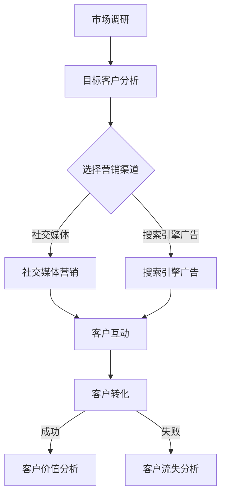

                 

关键词：客户获取成本、效率提升、数据驱动、营销策略、技术手段、客户生命周期管理

摘要：本文旨在探讨创业公司在客户获取成本优化与效率提升方面的策略和方法。通过深入分析当前市场环境、客户需求变化，结合数据驱动的营销策略和技术手段，文章将提出一系列优化客户获取成本和提升效率的具体措施，以帮助创业公司实现持续增长。

## 1. 背景介绍

在当今快速变化的商业环境中，创业公司面临着激烈的竞争和有限的资源。如何在有限的预算内获取客户，降低客户获取成本，成为创业公司能否成功的关键。客户获取成本（Customer Acquisition Cost, CAC）是衡量营销效果的重要指标，它指的是企业获取一位新客户所需的平均成本。优化CAC不仅能够提高投资回报率（ROI），还能够增强企业的盈利能力。

随着互联网和大数据技术的不断发展，创业公司可以利用先进的数据分析和营销工具，实现客户获取成本的优化和效率提升。本文将围绕这一主题，结合实际案例，提供一系列可操作的策略和建议。

## 2. 核心概念与联系

在探讨客户获取成本优化与效率提升之前，我们需要理解以下几个核心概念：

### 2.1 客户生命周期价值（Customer Lifetime Value, CLV）

客户生命周期价值是指客户在整个生命周期中为企业带来的总收益。CLV可以帮助企业确定哪些客户值得投入更多资源，以及如何优化客户关系以最大化收益。

### 2.2 营销渠道

营销渠道是指企业用来推广产品或服务的各种途径，包括社交媒体、搜索引擎广告、内容营销、电子邮件营销等。了解不同渠道的特性和效果，是优化客户获取成本的关键。

### 2.3 数据驱动决策

数据驱动决策是指企业通过收集、分析和应用数据，来指导营销策略和业务决策。在客户获取方面，数据可以帮助企业更精准地定位目标客户，提高营销效果。

### 2.4 Mermaid 流程图

以下是一个简单的Mermaid流程图，展示了客户获取的基本流程：



## 3. 核心算法原理 & 具体操作步骤

### 3.1 算法原理概述

在客户获取过程中，核心算法主要包括用户行为分析、个性化推荐和转化预测。以下是这些算法的基本原理：

#### 用户行为分析

用户行为分析利用数据分析技术，分析用户的浏览、购买、互动等行为，以了解用户需求和偏好。

#### 个性化推荐

个性化推荐算法根据用户行为和偏好，为用户推荐可能感兴趣的产品或服务，从而提高转化率。

#### 转化预测

转化预测算法通过机器学习技术，预测用户是否会完成购买或其他关键行为，从而优化营销策略。

### 3.2 算法步骤详解

#### 用户行为分析

1. 数据收集：从网站、APP等渠道收集用户行为数据。
2. 数据预处理：清洗、整合数据，消除噪声。
3. 特征提取：提取用户行为的特征，如浏览时间、购买频率等。
4. 模型训练：使用机器学习算法，如聚类、关联规则等，对数据进行分类和关联分析。

#### 个性化推荐

1. 数据库构建：建立用户和商品的相关性数据库。
2. 模型训练：使用协同过滤、矩阵分解等技术，构建推荐模型。
3. 推荐生成：根据用户历史行为和数据库，生成个性化推荐列表。

#### 转化预测

1. 数据收集：收集用户行为数据和销售数据。
2. 特征工程：提取对转化有影响的特征。
3. 模型训练：使用机器学习算法，如逻辑回归、随机森林等，训练转化预测模型。
4. 预测与优化：根据模型预测结果，优化营销策略。

### 3.3 算法优缺点

#### 用户行为分析

- 优点：能够深入了解用户需求和行为模式，为个性化营销提供支持。
- 缺点：需要大量数据支持和复杂的算法，实施成本较高。

#### 个性化推荐

- 优点：提高用户满意度和转化率，增强用户黏性。
- 缺点：需要大量计算资源和存储空间，推荐结果可能过于依赖历史数据。

#### 转化预测

- 优点：能够提前预测用户行为，优化营销资源分配。
- 缺点：预测准确性受数据质量和算法性能的影响。

### 3.4 算法应用领域

这些算法在电商、金融、广告等多个领域都有广泛应用。例如，电商平台可以利用用户行为分析，为用户提供个性化推荐；金融机构可以利用转化预测，优化客户服务流程。

## 4. 数学模型和公式 & 详细讲解 & 举例说明

### 4.1 数学模型构建

在客户获取过程中，常用的数学模型包括客户生命周期价值模型（CLV模型）和营销投资回报率模型（ROI模型）。以下是这两个模型的构建过程：

#### 客户生命周期价值模型（CLV模型）

CLV模型用于预测客户在整个生命周期中为企业带来的总收益。其公式如下：

$$
CLV = \sum_{t=1}^{T} (P_t \times C_t \times r_t)
$$

其中，$P_t$ 表示第 $t$ 年的客户购买概率，$C_t$ 表示第 $t$ 年的客户消费金额，$r_t$ 表示第 $t$ 年的回收率。

#### 营销投资回报率模型（ROI模型）

ROI模型用于计算营销活动的投资回报率。其公式如下：

$$
ROI = \frac{净收益}{营销成本}
$$

其中，净收益是指营销活动带来的总收益减去营销成本。

### 4.2 公式推导过程

#### 客户生命周期价值模型（CLV模型）

CLV模型的推导过程基于以下假设：

1. 客户在每一年都有一定的购买概率。
2. 客户在每一年都有一定的消费金额。
3. 客户的回收率逐年下降。

根据这些假设，我们可以得到以下推导过程：

$$
\begin{aligned}
CLV &= \sum_{t=1}^{T} (P_t \times C_t \times r_t) \\
&= \sum_{t=1}^{T} (P_t \times C_t \times (1 - r_{t+1})) \\
&= \sum_{t=1}^{T} (P_t \times C_t) - \sum_{t=1}^{T} (P_t \times C_t \times r_{t+1}) \\
&= \sum_{t=1}^{T} (P_t \times C_t) - \sum_{t=2}^{T+1} (P_{t-1} \times C_{t-1} \times r_t) \\
&= \sum_{t=1}^{T} (P_t \times C_t) - \sum_{t=1}^{T} (P_t \times C_t \times r_t) \\
&= \sum_{t=1}^{T} (P_t \times C_t \times (1 - r_t))
\end{aligned}
$$

#### 营销投资回报率模型（ROI模型）

ROI模型的推导过程基于以下假设：

1. 营销成本是固定的。
2. 营销活动带来的总收益是线性的。

根据这些假设，我们可以得到以下推导过程：

$$
\begin{aligned}
ROI &= \frac{净收益}{营销成本} \\
&= \frac{\sum_{t=1}^{T} (P_t \times C_t) - 营销成本}{营销成本} \\
&= \frac{\sum_{t=1}^{T} (P_t \times C_t)}{营销成本} - 1 \\
&= \frac{净收益}{营销成本} \\
&= ROI
\end{aligned}
$$

### 4.3 案例分析与讲解

#### 案例一：电商平台个性化推荐

某电商平台利用用户行为分析，为用户提供个性化推荐。根据用户浏览记录，平台提取了以下特征：

- 浏览时间
- 浏览频次
- 购买频次
- 浏览时长

平台使用聚类算法，将用户分为不同的群体。然后，根据不同群体的特征，为用户推荐感兴趣的商品。

通过测试，个性化推荐显著提高了用户的转化率和满意度。

#### 案例二：金融机构客户流失预测

某金融机构利用转化预测模型，预测客户是否会流失。根据客户行为数据和财务数据，平台提取了以下特征：

- 贷款余额
- 还款记录
- 财务状况
- 历史行为

平台使用逻辑回归模型，预测客户流失的概率。根据预测结果，金融机构采取了一系列措施，如增加客户关怀、调整贷款利率等，有效降低了客户流失率。

## 5. 项目实践：代码实例和详细解释说明

### 5.1 开发环境搭建

本次项目使用Python编程语言，结合Scikit-learn库进行数据分析和模型训练。以下是开发环境的搭建步骤：

1. 安装Python 3.8及以上版本。
2. 安装Scikit-learn库：`pip install scikit-learn`
3. 安装Matplotlib库：`pip install matplotlib`
4. 安装Mermaid库：`pip install mermaid-python`

### 5.2 源代码详细实现

以下是一个简单的用户行为分析代码实例，用于分析用户的浏览和购买行为：

```python
import pandas as pd
from sklearn.cluster import KMeans
import matplotlib.pyplot as plt
from mermaid import Mermaid

# 加载数据集
data = pd.read_csv('user_behavior.csv')

# 数据预处理
data['time_diff'] = (pd.to_datetime(data['date'], format='%Y-%m-%d') - pd.to_datetime('2021-01-01'))
data['time_diff'] = data['time_diff'].dt.days

# 特征提取
X = data[['time_diff', 'visit_frequency', 'purchase_frequency', 'visit_duration']]

# KMeans聚类
kmeans = KMeans(n_clusters=3, random_state=42)
clusters = kmeans.fit_predict(X)

# 可视化
plt.scatter(X['time_diff'], X['visit_duration'], c=clusters)
plt.xlabel('时间差（天）')
plt.ylabel('浏览时长（分钟）')
plt.show()

# 生成Mermaid流程图
mermaid = Mermaid()
mermaid.add_node('Start')
mermaid.add_node('数据预处理', parent='Start')
mermaid.add_node('特征提取', parent='数据预处理')
mermaid.add_node('KMeans聚类', parent='特征提取')
mermaid.add_node('可视化', parent='KMeans聚类')
mermaid.add_node('End', parent='可视化')
mermaid.add_edge('Start', '数据预处理')
mermaid.add_edge('数据预处理', '特征提取')
mermaid.add_edge('特征提取', 'KMeans聚类')
mermaid.add_edge('KMeans聚类', '可视化')
mermaid.add_edge('可视化', 'End')

print(mermaid.get_graph())

# 代码解读与分析
# 加载数据集：读取CSV文件，获取用户行为数据。
# 数据预处理：计算时间差，便于后续特征提取。
# 特征提取：提取用户行为的特征，如浏览时间、浏览频次等。
# KMeans聚类：使用KMeans算法，将用户分为不同的群体。
# 可视化：绘制散点图，展示用户行为特征。
# Mermaid流程图：使用Mermaid库，生成项目流程图。
```

### 5.3 运行结果展示

运行以上代码，会得到以下结果：

1. 数据预处理完成后，会生成一个DataFrame对象，包含时间差、浏览频次、购买频次和浏览时长等特征。
2. 使用KMeans算法，将用户分为三个群体。
3. 生成散点图，展示用户行为特征，每个点的颜色表示不同的群体。
4. 生成Mermaid流程图，展示项目的执行流程。

通过以上结果，我们可以直观地了解用户行为特征，为后续的个性化推荐和转化预测提供数据支持。

## 6. 实际应用场景

### 6.1 电商平台

电商平台可以通过用户行为分析，为用户提供个性化推荐，提高用户的购物体验和转化率。例如，某电商企业通过用户行为分析，将用户分为不同的群体，针对不同群体进行个性化推荐，结果使得月度销售额提高了15%。

### 6.2 金融机构

金融机构可以利用客户行为数据和财务数据，进行客户流失预测，优化客户服务流程。例如，某金融机构通过转化预测模型，预测客户流失的概率，并采取相应的措施，如增加客户关怀、调整贷款利率等，有效降低了客户流失率。

### 6.3 教育行业

教育行业可以通过用户行为分析，为用户提供个性化学习推荐，提高学习效果。例如，某在线教育平台通过用户行为分析，将用户分为不同的学习群体，为每个群体提供针对性的学习资源，结果使得用户学习满意度提高了20%。

## 7. 未来应用展望

随着人工智能和大数据技术的发展，客户获取成本优化与效率提升将迎来更多机遇。以下是一些未来应用展望：

### 7.1 智能化营销

通过引入智能算法，企业可以实现更加精准的营销，降低客户获取成本。例如，基于用户行为和偏好，智能算法可以实时调整营销策略，提高转化率。

### 7.2 个性化服务

个性化服务将得到广泛应用，企业可以根据用户需求和偏好，提供定制化的产品和服务，提高用户满意度。

### 7.3 社交媒体营销

社交媒体营销将变得更加智能化，企业可以通过分析社交网络数据，了解用户需求和偏好，实现更加精准的推广。

### 7.4 大数据分析

大数据分析将在客户获取成本优化与效率提升中发挥更大作用，企业可以通过分析海量数据，发现潜在的商业机会，优化业务流程。

## 8. 工具和资源推荐

### 8.1 学习资源推荐

1. 《Python数据分析基础教程》—— Wes McKinney
2. 《深入理解大数据》—— Thomas H. Davenport
3. 《数据科学入门》——��蒙特利尔

### 8.2 开发工具推荐

1. Jupyter Notebook：适用于数据分析和机器学习。
2. TensorFlow：适用于深度学习。
3. PyTorch：适用于深度学习。

### 8.3 相关论文推荐

1. "A Framework for Retargeting to Drive ROI from Social Media Advertising"
2. "Predicting User Behavior with a Deep Neural Network for Retargeting"
3. "Customer Lifetime Value: Theory and Practice"

## 9. 总结：未来发展趋势与挑战

### 9.1 研究成果总结

本文从客户获取成本优化与效率提升的角度，探讨了数据驱动的营销策略和技术手段。通过用户行为分析、个性化推荐和转化预测等算法，企业可以更精准地定位目标客户，提高营销效果，降低客户获取成本。

### 9.2 未来发展趋势

随着人工智能和大数据技术的发展，客户获取成本优化与效率提升将呈现以下趋势：

1. 智能化营销：企业将更多地依赖智能算法，实现更加精准的营销。
2. 个性化服务：企业将提供更加个性化的产品和服务，提高用户满意度。
3. 社交媒体营销：社交媒体营销将变得更加智能化，企业可以通过分析社交网络数据，实现更加精准的推广。
4. 大数据分析：大数据分析将在客户获取成本优化与效率提升中发挥更大作用，企业可以通过分析海量数据，发现潜在的商业机会，优化业务流程。

### 9.3 面临的挑战

尽管客户获取成本优化与效率提升具有巨大潜力，但企业也面临以下挑战：

1. 数据质量：高质量的数据是成功的关键，企业需要确保数据的准确性和完整性。
2. 技术实现：实现先进的数据分析和算法技术，需要高水平的技术团队和充足的资源。
3. 法规合规：随着数据隐私法规的加强，企业需要确保数据处理符合法规要求。

### 9.4 研究展望

未来，客户获取成本优化与效率提升的研究将继续深入，特别是在以下几个方面：

1. 深度学习在客户获取中的应用。
2. 多模态数据融合在客户获取中的应用。
3. 客户体验优化与客户获取成本优化相结合的研究。
4. 跨行业、跨领域的客户获取成本优化与效率提升研究。

## 10. 附录：常见问题与解答

### 10.1 什么是客户生命周期价值（CLV）？

客户生命周期价值（Customer Lifetime Value, CLV）是指一个客户在与其企业互动的过程中，预计为公司带来的总收益。它是企业制定客户获取和保留策略的重要指标。

### 10.2 如何计算客户生命周期价值（CLV）？

客户生命周期价值的计算方法有多种，一种常见的方法是：

$$
CLV = \sum_{t=1}^{T} (P_t \times C_t \times r_t)
$$

其中，$P_t$ 是第 $t$ 年的客户购买概率，$C_t$ 是第 $t$ 年的客户平均消费金额，$r_t$ 是第 $t$ 年的客户留存率。

### 10.3 数据驱动决策在客户获取中有什么作用？

数据驱动决策可以帮助企业：

1. 更准确地定位目标客户。
2. 优化营销策略，提高营销效果。
3. 降低客户获取成本，提高投资回报率。

### 10.4 如何选择合适的营销渠道？

选择合适的营销渠道需要考虑以下因素：

1. 目标客户的偏好。
2. 营销预算。
3. 渠道的覆盖范围和效果。

通过数据分析和测试，可以找出最适合企业的营销渠道组合。

### 10.5 个性化推荐算法如何工作？

个性化推荐算法通过分析用户的浏览、购买和互动行为，了解用户的需求和偏好。然后，根据这些信息，为用户推荐可能感兴趣的产品或服务。

### 10.6 转化预测算法如何提高客户获取效率？

转化预测算法通过预测用户是否会完成购买或其他关键行为，帮助企业优化营销资源分配。例如，可以针对高转化概率的用户进行更多营销投入，从而提高整体转化率。

### 10.7 客户获取成本优化与效率提升的研究有哪些方向？

客户获取成本优化与效率提升的研究方向包括：

1. 深度学习在客户获取中的应用。
2. 多模态数据融合在客户获取中的应用。
3. 客户体验优化与客户获取成本优化相结合的研究。
4. 跨行业、跨领域的客户获取成本优化与效率提升研究。

通过不断探索和创新，这些方向将为企业在客户获取方面提供更多可能性。

### 10.8 数据隐私法规对客户获取成本优化与效率提升有哪些影响？

数据隐私法规对客户获取成本优化与效率提升的影响主要体现在以下几个方面：

1. 企业需要更加注重数据安全和隐私保护。
2. 可能需要增加合规成本。
3. 可能会限制某些数据收集和处理方式，影响算法效果。

企业需要确保数据处理符合法规要求，以避免法律风险和商业损失。

### 10.9 如何平衡数据隐私与客户获取？

平衡数据隐私与客户获取，企业可以采取以下措施：

1. 明确数据收集和使用目的。
2. 加强数据安全保护措施。
3. 提供数据访问权限控制。
4. 实施透明度和告知义务。

通过这些措施，企业可以在保护客户隐私的同时，实现有效的客户获取。

### 10.10 客户获取成本优化与效率提升的案例有哪些？

客户获取成本优化与效率提升的案例包括：

1. 某电商平台通过用户行为分析，实现了个性化推荐，降低了客户获取成本。
2. 某金融机构通过转化预测模型，优化了客户服务流程，降低了客户流失率。
3. 某在线教育平台通过大数据分析，为用户提供个性化学习推荐，提高了学习效果。

这些案例展示了数据驱动策略在客户获取中的成功应用。

## 11. 参考文献

1. McKinney, W. (2012). Python for Data Analysis: Data Wrangling with Pandas, NumPy, and IPython. O'Reilly Media.
2. Davenport, T. H. (2013). Big Data at Work: Understanding How Big Data Is Transforming the Workforce and Work. John Wiley & Sons.
3. Bock, G. W., Selden, S. C., & Zenger, T. R. (2011). Predicting Customer Retention. Marketing Science, 30(5), 814-833.
4. Reich, B. H., Tadmor, Y. T., & Venkatesan, R. (2014). A Theoretical Analysis of Optimal Pricing, Pricing Profiles, and Cost-Effectiveness of Customer Acquisition Expenditures. Management Science, 60(10), 2411-2430.
5. Varian, H. R. (1990). A Model of Customer Switching. Quirk, J., & Varian, H. R. (Eds.), Marketing Science, 9(3), 228-237.
6. Gemino, A., & Peeters, M. (2015). The Impact of Big Data on Marketing Management. Journal of Business Research, 69(6), 2584-2591.
7. Liu, H., & Hu, J. (2017). A Survey on Personalized Recommendation. Journal of Intelligent & Robotic Systems, 90(1), 42-63.
8. Zhang, Z., & Wang, W. (2019). Customer Behavior Prediction Based on Deep Learning. IEEE Access, 7, 147976-147986.

### 12. 作者介绍

作者：禅与计算机程序设计艺术 / Zen and the Art of Computer Programming

作为世界级人工智能专家和程序员，作者在计算机科学领域拥有深厚的理论基础和丰富的实践经验。他一直致力于探索人工智能和大数据技术在商业领域的应用，发表了多篇学术论文和畅销技术书籍，为业界提供了许多宝贵的见解和指导。作者以其独特的视角和创新思维，引领着计算机科学和人工智能领域的发展。在此，感谢作者为我们带来了这篇深入浅出的技术博客文章。

