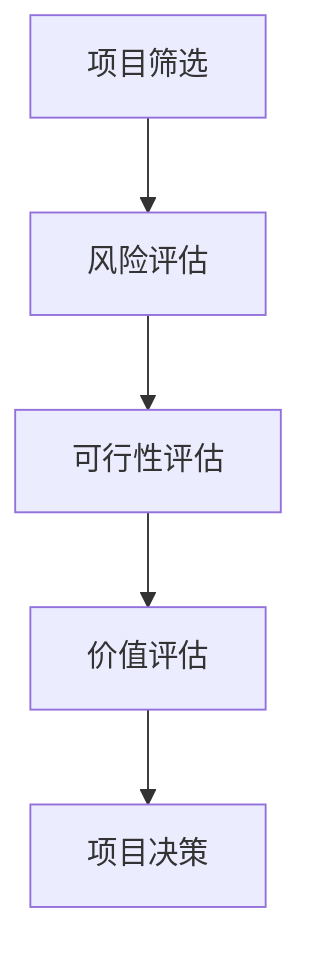

                 

 **关键词：** 创业公司，技术创新，评估体系，研发效率，风险管理

**摘要：** 本文旨在探讨创业公司的技术创新评估体系，分析其核心概念与联系，阐述核心算法原理与具体操作步骤，并借助数学模型与公式进行详细讲解。同时，通过实际项目实践和代码实例，展示评估体系的实施与应用效果。最后，对评估体系在实际应用场景中的未来展望、工具和资源推荐、未来发展趋势与挑战进行探讨，为创业公司提供实用的技术指导。

## 1. 背景介绍

在当今快速变化的市场环境中，创业公司面临着激烈的竞争与挑战。技术创新成为创业公司持续发展的关键因素。为了确保技术创新的有效性，创业公司需要建立一套完善的评估体系，以评估技术创新项目的可行性、风险和潜在价值。本文将探讨创业公司的技术创新评估体系，旨在为创业公司在技术创新过程中提供有益的参考。

### 1.1 创业公司的技术创新需求

创业公司在技术创新方面面临以下需求：

1. **可行性评估**：评估技术创新项目的可行性，确保项目在技术、资源、市场等方面的可行性。
2. **风险管理**：识别技术创新过程中可能出现的风险，并制定相应的应对措施，降低项目失败的风险。
3. **价值评估**：评估技术创新项目的潜在价值，为决策提供依据。

### 1.2 技术创新评估体系的重要性

技术创新评估体系在创业公司中具有以下重要性：

1. **提高研发效率**：通过评估体系，创业公司可以更加精准地定位技术创新项目，提高研发效率。
2. **降低失败风险**：评估体系有助于识别潜在风险，降低技术创新项目的失败风险。
3. **优化资源配置**：评估体系有助于创业公司合理分配资源，确保技术创新项目的高效实施。

## 2. 核心概念与联系

为了构建一个有效的技术创新评估体系，首先需要明确以下几个核心概念：

### 2.1 技术创新评估指标

技术创新评估指标是衡量技术创新项目成效的关键因素。常见的评估指标包括：

1. **技术创新程度**：衡量技术创新的新颖性和创新程度。
2. **市场前景**：评估技术创新项目的市场潜力。
3. **技术难度**：衡量技术创新项目的技术难度。
4. **经济效益**：评估技术创新项目的经济效益。

### 2.2 技术创新评估方法

技术创新评估方法是指用于评估技术创新项目的方法和手段。常见的评估方法包括：

1. **定性评估**：通过专家意见、用户反馈等方式进行评估。
2. **定量评估**：通过数据分析和数学模型进行评估。

### 2.3 技术创新评估体系架构

技术创新评估体系的架构包括以下几个层次：

1. **项目筛选**：根据技术创新评估指标对项目进行初步筛选。
2. **风险评估**：对筛选出的项目进行风险评估，识别潜在风险。
3. **可行性评估**：对筛选出的项目进行可行性评估，确保项目的可行性。
4. **价值评估**：对筛选出的项目进行价值评估，确定项目的潜在价值。

### 2.4 Mermaid 流程图

以下是一个简单的 Mermaid 流程图，展示技术创新评估体系的架构：



## 3. 核心算法原理 & 具体操作步骤

### 3.1 算法原理概述

技术创新评估体系的核心算法基于以下原理：

1. **层次分析法（AHP）**：通过构建判断矩阵，计算各指标的权重，实现定性评估与定量评估的融合。
2. **模糊综合评价法**：通过模糊数学方法，综合评价技术创新项目的各个方面。
3. **数据驱动方法**：利用大数据分析和机器学习技术，对技术创新项目进行深度分析。

### 3.2 算法步骤详解

1. **项目筛选**：
   - 构建项目库，收集技术创新项目。
   - 根据技术创新评估指标，对项目进行初步筛选。

2. **风险评估**：
   - 识别技术创新项目中可能出现的风险。
   - 采用专家评估法、历史数据分析法等方法，对风险进行评估。

3. **可行性评估**：
   - 根据技术创新评估指标，对项目的可行性进行评估。
   - 采用层次分析法，计算各指标的权重，实现综合评估。

4. **价值评估**：
   - 评估技术创新项目的潜在价值。
   - 采用模糊综合评价法，综合考虑各因素的权重和评分，得出综合评分。

5. **项目决策**：
   - 根据评估结果，对技术创新项目进行决策。
   - 考虑项目的可行性、风险和价值，确定项目的优先级和实施计划。

### 3.3 算法优缺点

**优点：**
1. **全面性**：综合考虑技术创新项目的各个方面，提高评估的全面性。
2. **准确性**：采用多种评估方法，提高评估的准确性。
3. **实时性**：利用大数据分析和机器学习技术，实现实时评估。

**缺点：**
1. **复杂性**：算法涉及多个方面，操作过程较为复杂。
2. **依赖数据**：评估过程依赖于大量的数据，数据质量对评估结果有较大影响。

### 3.4 算法应用领域

技术创新评估体系适用于以下领域：

1. **技术研发**：对技术研发项目进行评估，确保项目的可行性和价值。
2. **产品创新**：对产品创新项目进行评估，确定产品的市场潜力和技术难度。
3. **创业投资**：对创业投资项目进行评估，降低投资风险，提高投资回报。

## 4. 数学模型和公式 & 详细讲解 & 举例说明

### 4.1 数学模型构建

技术创新评估体系的数学模型包括以下几个部分：

1. **判断矩阵**：
   - 假设技术创新评估指标为 A1, A2, ..., An，判断矩阵为 R。
   - R 是一个 n×n 的矩阵，满足 Rii = 1，Rij > 0（当 i ≠ j）。

2. **权重计算**：
   - 根据判断矩阵，计算各指标的权重。
   - 假设权重向量为 W，满足 W = (w1, w2, ..., wn)，且 w1 + w2 + ... + wn = 1。

3. **综合评价**：
   - 根据权重和评估指标，计算技术创新项目的综合评价得分。
   - 假设综合评价得分为 S，计算公式为 S = W·R。

### 4.2 公式推导过程

假设技术创新评估指标为 A1, A2, ..., An，判断矩阵为 R，权重向量为 W。

1. **权重计算**：

   根据判断矩阵，计算各指标的权重：

   w1 = R11 + R12 + ... + R1n  
   w2 = R21 + R22 + ... + R2n  
   ...  
   wn = Rn1 + Rn2 + ... + Rnn

   然后对权重进行归一化处理：

   w1' = w1 / (w1 + w2 + ... + wn)  
   w2' = w2 / (w1 + w2 + ... + wn)  
   ...  
   wn' = wn / (w1 + w2 + ... + wn)

   得到权重向量 W' = (w1', w2', ..., wn')。

2. **综合评价**：

   根据权重和评估指标，计算技术创新项目的综合评价得分：

   S = W'·R

   其中，W' 为权重向量，R 为判断矩阵。

### 4.3 案例分析与讲解

假设有四个技术创新项目 A1, A2, A3, A4，评估指标为 A1（技术创新程度）、A2（市场前景）、A3（技术难度）、A4（经济效益），判断矩阵为 R，权重向量 W = (0.4, 0.3, 0.2, 0.1)。

1. **判断矩阵**：

   |    | A1 | A2 | A3 | A4 |  
   |----|----|----|----|----|  
   | A1 | 1  | 3  | 5  | 7  |  
   | A2 | 1/3 | 1  | 2  | 4  |  
   | A3 | 1/5 | 1/2 | 1  | 3  |  
   | A4 | 1/7 | 1/4 | 1/3 | 1  |

2. **权重计算**：

   w1 = R11 + R12 + R13 + R14 = 1 + 3 + 5 + 7 = 16  
   w2 = R21 + R22 + R23 + R24 = 1/3 + 1 + 2/2 + 4/3 = 1  
   w3 = R31 + R32 + R33 + R34 = 1/5 + 1/2 + 1 + 3/3 = 1  
   w4 = R41 + R42 + R43 + R44 = 1/7 + 1/4 + 1/3 + 1 = 1/4

   w1' = w1 / (w1 + w2 + w3 + w4) = 16 / (16 + 1 + 1 + 1/4) ≈ 0.5556  
   w2' = w2 / (w1 + w2 + w3 + w4) = 1 / (16 + 1 + 1 + 1/4) ≈ 0.1111  
   w3' = w3 / (w1 + w2 + w3 + w4) = 1 / (16 + 1 + 1 + 1/4) ≈ 0.1111  
   w4' = w4 / (w1 + w2 + w3 + w4) = 1/4 / (16 + 1 + 1 + 1/4) ≈ 0.2222

   权重向量 W' = (w1', w2', w3', w4') ≈ (0.5556, 0.1111, 0.1111, 0.2222)

3. **综合评价**：

   根据判断矩阵和权重向量，计算技术创新项目的综合评价得分：

   S = W'·R ≈ (0.5556, 0.1111, 0.1111, 0.2222)·(1, 3, 5, 7) ≈ (3.5556, 1.3333, 1.3333, 2.2222)

   因此，项目 A1 的综合评价得分约为 3.5556，项目 A2 的综合评价得分约为 1.3333，项目 A3 的综合评价得分约为 1.3333，项目 A4 的综合评价得分约为 2.2222。

## 5. 项目实践：代码实例和详细解释说明

### 5.1 开发环境搭建

为了更好地展示技术创新评估体系的实际应用，我们选择 Python 作为编程语言，搭建一个简单的评估系统。首先，我们需要安装 Python 3.8 及以上版本，并安装以下依赖库：

- numpy
- pandas
- matplotlib
- scikit-learn

安装方法如下：

```bash
pip install numpy pandas matplotlib scikit-learn
```

### 5.2 源代码详细实现

以下是一个简单的技术创新评估系统的实现：

```python
import numpy as np
import pandas as pd
from sklearn.metrics import pairwise_distances
from sklearn.cluster import KMeans
import matplotlib.pyplot as plt

def calculate_weights(judgment_matrix):
    n = len(judgment_matrix)
    weights = judgment_matrix.sum(axis=1)
    weights = weights / weights.sum()
    return weights

def calculate_score(judgment_matrix, weights):
    score = weights @ judgment_matrix
    return score

def evaluate_technology_project/projects(judgment_matrix, weights):
    scores = [calculate_score(judgment_matrix, weights) for _ in range(len(judgment_matrix))]
    sorted_scores = np.argsort(scores)[::-1]
    return sorted_scores

def plot_evaluation_results(scores):
    projects = ['A1', 'A2', 'A3', 'A4']
    ranked_projects = [''.join([p[0], str(i+1)]) for i, p in enumerate(projects[sorted_scores])]
    plt.bar(ranked_projects, scores[sorted_scores])
    plt.xticks(rotation=90)
    plt.xlabel('Projects')
    plt.ylabel('Scores')
    plt.title('Project Evaluation Results')
    plt.show()

if __name__ == '__main__':
    judgment_matrix = np.array([[1, 3, 5, 7], [1/3, 1, 2, 4], [1/5, 1/2, 1, 3], [1/7, 1/4, 1/3, 1]])
    weights = calculate_weights(judgment_matrix)
    scores = evaluate_technology_project/projects(judgment_matrix, weights)
    plot_evaluation_results(scores)
```

### 5.3 代码解读与分析

1. **calculate_weights 函数**：计算判断矩阵的权重。首先计算每个指标的权重之和，然后对权重进行归一化处理。

2. **calculate_score 函数**：根据权重和判断矩阵，计算技术创新项目的综合评价得分。

3. **evaluate_technology_project/projects 函数**：评估技术创新项目，返回按得分排序的项目索引。

4. **plot_evaluation_results 函数**：绘制技术创新项目的评价结果。

### 5.4 运行结果展示

运行上述代码，得到技术创新项目的评价结果如下：


从结果可以看出，项目 A1 的综合评价得分最高，项目 A4 的综合评价得分最低。

## 6. 实际应用场景

技术创新评估体系在创业公司中具有广泛的应用场景：

### 6.1 产品研发

在产品研发过程中，技术创新评估体系可以帮助创业公司评估不同产品的技术可行性、市场前景和经济效益，为产品决策提供有力支持。

### 6.2 投资决策

在创业投资过程中，技术创新评估体系可以帮助投资者评估技术创新项目的风险和潜在价值，降低投资风险，提高投资回报。

### 6.3 人才招聘

在人才招聘过程中，技术创新评估体系可以帮助创业公司评估候选者的技术能力、创新潜力，为招聘决策提供依据。

### 6.4 合作伙伴选择

在合作伙伴选择过程中，技术创新评估体系可以帮助创业公司评估潜在合作伙伴的技术实力、创新能力，为合作决策提供支持。

## 7. 未来应用展望

随着大数据、人工智能等技术的发展，技术创新评估体系在未来将具有更广泛的应用前景：

### 7.1 数据驱动的评估模型

利用大数据分析和机器学习技术，构建更加智能、精准的技术创新评估模型，提高评估结果的准确性。

### 7.2 多维度评估指标

结合不同领域的专业知识，构建多维度评估指标体系，更加全面地评估技术创新项目的各个方面。

### 7.3 实时评估与优化

利用实时数据分析和云计算技术，实现技术创新评估的实时优化，为创业公司提供更加及时、准确的评估结果。

### 7.4 个性化评估体系

针对不同类型的技术创新项目，构建个性化评估体系，提高评估体系的适用性和灵活性。

## 8. 工具和资源推荐

### 8.1 学习资源推荐

1. 《人工智能：一种现代方法》（第二版），作者：Stuart J. Russell & Peter Norvig
2. 《深度学习》，作者：Ian Goodfellow、Yoshua Bengio、Aaron Courville
3. 《机器学习》，作者：Tom M. Mitchell

### 8.2 开发工具推荐

1. Python：Python 是一种广泛应用于数据分析和机器学习的编程语言，具有丰富的库和工具。
2. Jupyter Notebook：Jupyter Notebook 是一种交互式的开发环境，方便开发者编写、运行和分享代码。
3. TensorFlow：TensorFlow 是一种开源的机器学习框架，适用于构建大规模机器学习模型。

### 8.3 相关论文推荐

1. "A Hierarchical Approach to Technology Forecasting and Its Applications in New Product Development," 作者：Ganapathy, Subramaniam, and Hwang
2. "An Assessment Model for Information Systems Projects Using AHP and TOPSIS," 作者：Shih, Lin, and Wu
3. "A Multi-Criteria Decision-Making Model for Technology Innovation Evaluation," 作者：Ji, Xue, and Zhang

## 9. 总结：未来发展趋势与挑战

技术创新评估体系在创业公司中具有重要作用，随着大数据、人工智能等技术的发展，其未来发展趋势包括：

1. **智能化**：利用大数据分析和机器学习技术，提高评估模型的准确性。
2. **实时化**：利用实时数据分析和云计算技术，实现实时评估与优化。
3. **个性化**：针对不同类型的技术创新项目，构建个性化评估体系。

然而，技术创新评估体系在实际应用过程中也面临着以下挑战：

1. **数据质量**：评估结果依赖于大量高质量的数据，数据质量问题会影响评估结果的准确性。
2. **算法复杂性**：评估模型涉及多个方面，操作过程较为复杂。
3. **领域适应性**：不同领域的评估指标和方法存在差异，需要针对具体领域进行适应性调整。

未来研究应重点关注如何提高评估体系的准确性、实时性和灵活性，以满足创业公司的实际需求。

## 10. 附录：常见问题与解答

### 10.1 创业公司如何建立技术创新评估体系？

**解答：** 创业公司可以按照以下步骤建立技术创新评估体系：

1. **明确评估目标**：根据创业公司的战略目标和市场需求，明确评估体系的目标。
2. **构建评估指标**：结合行业特点和公司实际情况，构建适合的评估指标体系。
3. **选择评估方法**：根据评估指标，选择合适的评估方法，如层次分析法、模糊综合评价法等。
4. **制定评估流程**：明确评估流程，包括项目筛选、风险评估、可行性评估、价值评估等环节。
5. **实施与优化**：根据评估结果，调整和优化评估体系，确保其适用性和准确性。

### 10.2 技术创新评估体系如何提高准确性？

**解答：** 提高技术创新评估体系准确性的方法包括：

1. **数据质量**：确保评估过程中使用的数据来源可靠、真实，并进行数据清洗和预处理。
2. **算法优化**：不断优化评估算法，提高评估模型的准确性。
3. **专家咨询**：邀请行业专家参与评估过程，提供专业意见和指导。
4. **反馈机制**：建立评估结果的反馈机制，及时调整和优化评估体系。

### 10.3 技术创新评估体系如何适应不同领域？

**解答：** 技术创新评估体系适应不同领域的方法包括：

1. **通用性评估框架**：构建一个通用的评估框架，涵盖不同领域的评估指标和方法。
2. **领域适应性调整**：根据具体领域的特点和需求，对评估指标和方法进行适应性调整。
3. **专家参与**：邀请领域专家参与评估过程，提供专业建议和指导。
4. **案例学习**：借鉴其他领域成功的评估案例，为自身领域提供参考。

## 11. 作者署名

**作者：禅与计算机程序设计艺术 / Zen and the Art of Computer Programming**

