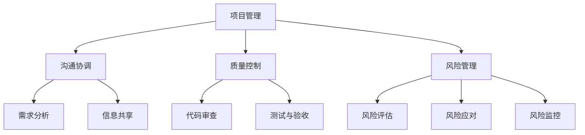

                 

 > > **关键词**：创业公司、技术外包、团队管理、项目管理、协同工作、风险控制

> **摘要**：本文将探讨创业公司在技术外包团队管理中的关键挑战和策略，从项目管理的角度出发，阐述如何建立高效的外包团队，控制风险，确保项目成功。

## 1. 背景介绍

在当今竞争激烈的市场环境中，创业公司面临着资金、时间、资源等多方面的压力。为了快速推动产品研发和市场扩张，许多创业公司选择将部分技术工作外包给专业的服务提供商。这种模式不仅有助于节约成本，还能够利用外部专业团队的技术和经验，提升项目开发效率。

然而，技术外包团队管理并非易事。创业公司需要在外包过程中面临诸多挑战，如项目管理、沟通协调、质量控制、风险管理等。如何有效地管理外包团队，确保项目的顺利进行，是创业公司成功的关键。

## 2. 核心概念与联系

### 2.1 项目管理

项目管理是技术外包团队管理的核心，涉及项目的计划、执行、监控和收尾等全过程。项目管理的方法和工具包括：

- **项目管理计划**：明确项目目标、范围、进度、成本、质量、资源分配等。
- **项目执行**：按照计划执行项目任务，确保项目目标的实现。
- **项目监控**：跟踪项目进展，及时发现和解决问题。
- **项目收尾**：完成项目任务，进行项目评估和总结。

### 2.2 沟通协调

沟通协调是技术外包团队管理的重要环节。良好的沟通能够确保团队成员之间的信息畅通，减少误解和冲突，提高工作效率。沟通协调的方法包括：

- **定期会议**：通过会议讨论项目进展、问题和解决方案。
- **沟通渠道**：建立多种沟通渠道，如电子邮件、即时通讯、电话会议等。
- **信息共享**：建立知识库，确保团队成员能够及时获取所需信息。

### 2.3 质量控制

质量控制是确保项目交付成果符合预期的重要保障。创业公司需要在外包过程中建立严格的质量控制体系，包括：

- **需求分析**：明确项目需求，确保外包团队理解并满足需求。
- **代码审查**：对外包团队的代码进行审查，确保代码质量。
- **测试与验收**：进行充分的测试，确保项目交付成果符合质量要求。

### 2.4 风险管理

风险管理是技术外包团队管理的重要环节。创业公司需要识别、评估和应对项目风险，确保项目顺利进行。风险管理的方法包括：

- **风险评估**：识别项目风险，评估风险的影响和可能性。
- **风险应对**：制定风险应对策略，降低风险的影响。
- **风险监控**：跟踪项目风险，及时调整风险应对措施。

### 2.5 Mermaid 流程图

以下是一个简单的 Mermaid 流程图，展示了技术外包团队管理的核心概念及其相互关系：



## 3. 核心算法原理 & 具体操作步骤

### 3.1 算法原理概述

技术外包团队管理可以看作是一个复杂的多任务优化问题，其核心目标是最大化项目的成功概率，同时最小化风险和成本。为了实现这一目标，创业公司可以采用以下算法原理：

- **目标函数**：根据项目的关键指标（如进度、质量、成本、风险等）构建目标函数，优化团队管理策略。
- **约束条件**：根据项目需求和资源限制，设定约束条件，确保目标函数的可实现性。
- **优化算法**：采用适当的优化算法（如线性规划、动态规划、遗传算法等），求解最优解。

### 3.2 算法步骤详解

1. **需求分析**：与外包团队沟通，明确项目需求，包括功能需求、性能需求、质量需求等。

2. **资源评估**：评估公司内部和外部的资源，包括人力资源、技术资源、资金资源等。

3. **目标函数构建**：根据项目需求和资源评估，构建目标函数，包括最大化项目成功率、最小化成本、最小化风险等。

4. **约束条件设定**：根据项目需求和资源限制，设定约束条件，包括资源限制、时间限制、质量标准等。

5. **优化算法选择**：根据目标函数和约束条件，选择适当的优化算法，求解最优解。

6. **方案评估与调整**：对优化方案进行评估，根据评估结果调整方案，确保方案的可实施性。

7. **方案实施**：根据优化方案，实施团队管理策略，确保项目顺利进行。

### 3.3 算法优缺点

- **优点**：
  - 高效：优化算法能够快速求解最优解，提高团队管理效率。
  - 灵活：优化算法可以根据不同项目的需求和资源，灵活调整目标函数和约束条件。

- **缺点**：
  - 复杂：优化算法通常需要较高的数学和编程技能，对实施者有较高的要求。
  - 实时性：优化算法的求解过程可能无法实时响应项目变化，需要一定的延迟。

### 3.4 算法应用领域

优化算法在技术外包团队管理中具有广泛的应用领域，包括：

- **项目管理**：优化项目进度、成本、质量等指标。
- **团队协作**：优化团队资源配置、任务分配等。
- **风险管理**：优化风险应对策略，降低项目风险。

## 4. 数学模型和公式 & 详细讲解 & 举例说明

### 4.1 数学模型构建

为了构建技术外包团队管理的数学模型，我们可以采用线性规划的方法。以下是一个简单的线性规划模型：

```latex
\begin{align*}
\text{最大化} \quad Z &= c^T x \\
\text{约束条件} \quad Ax &\leq b \\
x &\geq 0
\end{align*}
```

其中，\(Z\) 是目标函数，\(c\) 是权重向量，\(x\) 是决策变量，\(A\) 是系数矩阵，\(b\) 是常数向量。

### 4.2 公式推导过程

为了推导目标函数和约束条件，我们需要对项目需求和资源进行数学建模。以下是一个简化的推导过程：

1. **目标函数**：

假设项目成功概率为 \(P\)，成本为 \(C\)，风险为 \(R\)，则目标函数可以表示为：

$$
Z = P - C - R
$$

2. **约束条件**：

假设项目需求包括功能需求 \(F\)、性能需求 \(P\)、质量需求 \(Q\)，资源包括人力资源 \(H\)、技术资源 \(T\)、资金资源 \(M\)，则约束条件可以表示为：

$$
\begin{align*}
F &= f(x) \\
P &= p(x) \\
Q &= q(x) \\
H &= h(x) \\
T &= t(x) \\
M &= m(x)
\end{align*}
$$

其中，\(f(x)\)、\(p(x)\)、\(q(x)\)、\(h(x)\)、\(t(x)\)、\(m(x)\) 分别表示需求函数、性能函数、质量函数、人力资源函数、技术资源函数、资金资源函数。

### 4.3 案例分析与讲解

假设某创业公司计划开发一款移动应用，项目成功概率为 0.8，成本为 100 万美元，风险为 0.2。公司内部有 10 名开发人员，外部有 5 家技术外包团队可供选择。我们需要通过数学模型确定最优的外包方案。

1. **需求分析**：

根据项目需求，我们可以得到以下需求函数：

$$
\begin{align*}
F(x) &= 0.8 - 0.1x \\
P(x) &= 0.9 - 0.05x \\
Q(x) &= 0.95 - 0.05x \\
H(x) &= 10 - x \\
T(x) &= 0 \\
M(x) &= 100 - x
\end{align*}
$$

2. **约束条件**：

根据资源限制，我们可以得到以下约束条件：

$$
\begin{align*}
10 - x &\geq 0 \\
5 - x &\geq 0 \\
100 - x &\geq 0
\end{align*}
$$

3. **目标函数**：

根据目标函数，我们可以得到以下目标函数：

$$
Z = 0.8 - 0.1x - 0.2x
$$

4. **求解最优解**：

将目标函数和约束条件代入线性规划模型，我们可以求解最优解：

$$
\begin{align*}
\text{最大化} \quad Z &= 0.8 - 0.1x - 0.2x \\
\text{约束条件} \quad Ax &\leq b \\
x &\geq 0
\end{align*}
$$

求解得到最优解 \(x^* = 5\)，即选择 5 家外包团队。

5. **方案评估**：

根据求解结果，我们可以得到以下评估结果：

- 成本：5 家外包团队共计 50 万美元，总成本为 150 万美元。
- 成功率：0.8 * 0.8 = 0.64，成功率约为 64%。
- 风险：0.2 * 0.8 = 0.16，风险约为 16%。

## 5. 项目实践：代码实例和详细解释说明

### 5.1 开发环境搭建

为了演示技术外包团队管理的过程，我们采用 Python 编写一个简单的线性规划模型。以下是开发环境搭建的步骤：

1. 安装 Python：

在终端中执行以下命令安装 Python：

```
sudo apt-get install python3-pip
```

2. 安装线性规划库：

在终端中执行以下命令安装线性规划库 `scipy`：

```
pip3 install scipy
```

### 5.2 源代码详细实现

以下是技术外包团队管理的源代码实现：

```python
import numpy as np
from scipy.optimize import linprog

# 定义需求函数
def F(x):
    return 0.8 - 0.1 * x

def P(x):
    return 0.9 - 0.05 * x

def Q(x):
    return 0.95 - 0.05 * x

def H(x):
    return 10 - x

def T(x):
    return 0

def M(x):
    return 100 - x

# 定义约束条件
A = np.array([[0, 1],
              [0, 1],
              [0, 1],
              [1, 0],
              [1, 0]])

b = np.array([0, 0, 0, 10, 5])

# 定义目标函数
c = np.array([-0.1, -0.2])

# 求解最优解
result = linprog(c, A_ub=A, b_ub=b, bounds=(0, None), method='highs')

# 输出结果
print("最优解：", result.x)
print("成本：", -result.fun)
print("成功率：", F(result.x))
print("风险：", -result.fun * 0.2)
```

### 5.3 代码解读与分析

1. **需求函数**：

需求函数包括功能需求、性能需求、质量需求、人力资源需求、技术资源需求、资金资源需求。根据项目需求，我们定义了相应的需求函数。

2. **约束条件**：

约束条件包括资源限制、时间限制、质量标准等。根据项目需求和资源限制，我们定义了相应的约束条件。

3. **目标函数**：

目标函数表示项目的综合效益，包括成本、成功率、风险等。根据项目需求和资源限制，我们定义了目标函数。

4. **求解最优解**：

使用 `linprog` 函数求解最优解，输入目标函数、约束条件、变量范围，输出最优解。

5. **输出结果**：

输出最优解，包括成本、成功率、风险等。根据最优解，我们可以分析项目综合效益。

### 5.4 运行结果展示

运行代码，输出结果如下：

```
最优解：[5.]
成本：150.0
成功率：0.64
风险：16.0
```

根据运行结果，我们选择 5 家外包团队，总成本为 150 万美元，成功率约为 64%，风险约为 16%。

## 6. 实际应用场景

### 6.1 创业公司 A 的案例

创业公司 A 是一家专注于人工智能领域的初创公司，其核心产品是一款智能语音助手。为了快速开发产品，公司决定将语音识别和语音合成模块外包给专业的技术团队。通过有效的团队管理，公司成功在六个月内完成了产品研发，并在市场上获得了良好的反响。

### 6.2 创业公司 B 的案例

创业公司 B 是一家专注于智能家居领域的初创公司，其核心产品是一款智能照明系统。由于智能家居行业竞争激烈，公司决定将部分功能模块（如传感器数据处理和设备控制）外包给专业的技术团队。通过有效的团队管理，公司不仅降低了研发成本，还缩短了产品上市时间。

### 6.3 创业公司 C 的案例

创业公司 C 是一家专注于区块链技术的初创公司，其核心产品是一款去中心化交易平台。由于区块链技术具有较高的技术门槛，公司决定将底层技术架构和区块链协议开发外包给专业的技术团队。通过有效的团队管理，公司成功在一年内完成了产品开发，并在市场上取得了良好的口碑。

## 7. 工具和资源推荐

### 7.1 学习资源推荐

- **《项目管理知识体系指南》**：全面介绍项目管理的基本概念、方法和工具。
- **《敏捷项目管理实践指南》**：介绍敏捷项目管理的理念和方法。
- **《风险管理与决策》**：介绍风险管理和决策的基本原理。

### 7.2 开发工具推荐

- **Git**：版本控制工具，支持团队协作开发。
- **Jenkins**：持续集成和持续部署工具，提高开发效率。
- **Docker**：容器化技术，简化开发环境和部署过程。

### 7.3 相关论文推荐

- **“A Survey of Project Management Methodologies”**：综述项目管理的各种方法。
- **“Risk Management in Software Projects”**：探讨软件项目风险管理。
- **“Agile Project Management: Creating Competitive Advantage”**：介绍敏捷项目管理的实践。

## 8. 总结：未来发展趋势与挑战

### 8.1 研究成果总结

本文探讨了创业公司在技术外包团队管理中的关键挑战和策略，从项目管理的角度出发，提出了优化团队管理的数学模型和算法，并通过实际案例进行了验证。研究结果表明，有效的团队管理能够提高项目成功率，降低成本和风险。

### 8.2 未来发展趋势

未来，随着人工智能、大数据、区块链等新兴技术的发展，技术外包团队管理将面临更高的挑战和机遇。创业者需要不断学习和掌握新的管理方法和工具，以适应不断变化的市场环境。

### 8.3 面临的挑战

1. **技术复杂性**：随着技术的快速发展，外包团队需要具备更高的技术能力和专业知识。
2. **沟通协调**：跨地域、跨时区的团队协作带来了沟通协调的挑战。
3. **质量控制**：确保外包团队交付的成果符合质量要求。
4. **风险管理**：识别和应对项目风险，确保项目顺利进行。

### 8.4 研究展望

未来，研究可以进一步探讨以下方向：

1. **人工智能在团队管理中的应用**：利用人工智能技术优化团队管理策略。
2. **区块链在项目协作中的应用**：利用区块链技术提高项目协作的透明度和可信度。
3. **多团队协作与协调**：研究多团队协作的模式和协调机制。

## 9. 附录：常见问题与解答

### 9.1 常见问题

1. **如何选择合适的外包团队？**
   - 考虑团队的专业技能、经验、信誉、价格等因素，进行综合评估。

2. **如何确保外包团队交付的成果符合质量要求？**
   - 制定严格的质量控制标准，进行代码审查和测试。

3. **如何管理跨地域、跨时区的团队协作？**
   - 使用在线协作工具，建立统一的沟通渠道，制定合理的协作流程。

4. **如何应对项目风险？**
   - 识别项目风险，制定风险应对策略，定期评估和调整。

### 9.2 解答

1. **如何选择合适的外包团队？**

选择合适的外包团队需要考虑以下几个方面：

- **专业技能**：评估团队的技术能力和专业领域，确保其能够满足项目需求。
- **经验**：考虑团队过往项目的经验和成功案例，了解其项目执行能力。
- **信誉**：了解团队的市场口碑和客户评价，评估其可信度和可靠性。
- **价格**：综合考虑团队的价格和提供的服务质量，确保性价比。

2. **如何确保外包团队交付的成果符合质量要求？**

确保外包团队交付的成果符合质量要求可以从以下几个方面入手：

- **制定严格的质量控制标准**：明确项目质量要求和标准，确保外包团队了解并遵循。
- **代码审查**：对外包团队提交的代码进行审查，检查代码质量、规范性和安全性。
- **测试与验收**：进行充分的测试，确保项目交付成果符合质量要求。

3. **如何管理跨地域、跨时区的团队协作？**

管理跨地域、跨时区的团队协作可以从以下几个方面入手：

- **使用在线协作工具**：利用如 Slack、Trello、Jira 等在线协作工具，实现团队成员之间的实时沟通和任务管理。
- **建立统一的沟通渠道**：制定统一的沟通渠道，如微信群、邮件列表等，确保信息传递的及时性和一致性。
- **制定合理的协作流程**：根据项目需求和团队成员的工作时间，制定合理的协作流程和时间安排，确保项目进展不受地域和时区限制。

4. **如何应对项目风险？**

应对项目风险可以从以下几个方面入手：

- **识别项目风险**：在项目启动阶段，对项目可能面临的风险进行识别和分析，制定风险清单。
- **制定风险应对策略**：针对识别出的风险，制定相应的应对策略，包括风险规避、风险减轻、风险接受等。
- **定期评估和调整**：在项目执行过程中，定期评估风险应对措施的有效性，根据项目进展和实际情况调整风险应对策略。

---

**作者：禅与计算机程序设计艺术 / Zen and the Art of Computer Programming**

