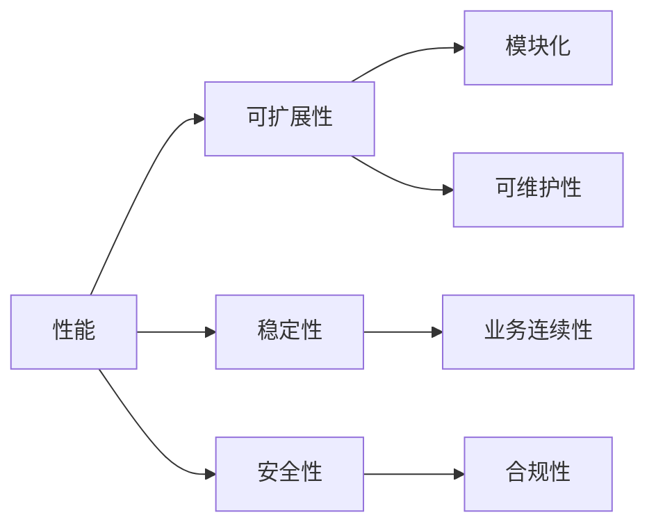

                 

关键词：创业公司、技术架构、评估指标、体系、性能、可扩展性、稳定性、安全性

> 摘要：本文旨在为创业公司构建一个全面的技术架构评估指标体系，通过详细分析各种评估指标及其相互关系，帮助创业公司优化技术决策，提升系统性能，确保业务稳定性和安全性。

## 1. 背景介绍

在快速发展的科技时代，创业公司面临着日益激烈的竞争。技术架构作为公司发展的基石，其设计合理性和稳定性直接影响着公司的业务发展。然而，对于许多创业公司来说，如何构建一个高效且可持续的技术架构并非易事。这不仅仅是因为技术架构的复杂性，还因为缺乏一套科学、全面的评估指标体系。

本文将探讨如何为创业公司构建一个综合性的技术架构评估指标体系。通过对技术架构的各个关键方面进行深入分析，我们旨在为创业公司提供一套系统化的评估方法，帮助他们更好地理解技术架构的重要性，并在构建和优化过程中做出明智的决策。

## 2. 核心概念与联系

### 2.1 技术架构的定义

技术架构是指软件系统的高层设计，它决定了系统的模块化、可维护性、性能和扩展性。一个良好的技术架构不仅能够满足当前的业务需求，还应当具备应对未来业务变化的能力。

### 2.2 评估指标的定义

评估指标是用于衡量技术架构在特定方面表现的具体参数。这些指标可以反映系统的性能、稳定性、安全性、可扩展性等多个维度。

### 2.3 关系图

下图展示了技术架构评估指标之间的相互关系。



## 3. 核心算法原理 & 具体操作步骤

### 3.1 算法原理概述

技术架构评估的核心在于对系统各层次的性能、稳定性、安全性等方面进行全面分析。这一过程通常包括以下几个步骤：

1. **需求分析**：明确业务需求，确定技术架构的目标和约束。
2. **架构设计**：根据需求进行架构设计，选择合适的架构风格和技术栈。
3. **性能评估**：通过工具和测试方法评估系统的性能。
4. **稳定性评估**：分析系统在压力条件下的行为，确保其在高负载下的稳定性。
5. **安全性评估**：检查系统是否存在安全漏洞，评估其抵御外部攻击的能力。
6. **可扩展性评估**：分析系统在业务增长时的扩展能力。
7. **持续优化**：基于评估结果对技术架构进行调整和优化。

### 3.2 算法步骤详解

1. **需求分析**：
   - **用户调研**：了解用户需求，确定核心功能。
   - **业务场景分析**：模拟业务流程，识别关键环节。

2. **架构设计**：
   - **模块划分**：将系统功能划分为独立的模块。
   - **技术选型**：选择适合的技术栈和中间件。

3. **性能评估**：
   - **基准测试**：使用标准测试用例对系统性能进行测试。
   - **性能调优**：根据测试结果调整系统配置和代码。

4. **稳定性评估**：
   - **压力测试**：模拟高负载条件，测试系统的稳定性。
   - **故障注入**：故意引发故障，观察系统恢复能力。

5. **安全性评估**：
   - **安全审计**：检查代码和配置是否存在安全漏洞。
   - **渗透测试**：模拟黑客攻击，测试系统的防御能力。

6. **可扩展性评估**：
   - **负载测试**：分析系统在增加用户数或数据量时的表现。
   - **弹性扩展**：评估系统在资源增加时的扩展性。

7. **持续优化**：
   - **自动化测试**：引入自动化测试工具，确保新功能对系统无负面影响。
   - **监控与反馈**：使用监控工具，及时反馈性能和安全问题。

### 3.3 算法优缺点

#### 优点：

- **全面性**：涵盖了系统性能、稳定性、安全性、可扩展性等多个方面。
- **系统性**：提供了一套完整的评估流程和方法，易于实施和跟踪。
- **灵活性**：可以根据公司实际情况进行调整和优化。

#### 缺点：

- **复杂性**：评估过程较为复杂，需要多学科知识和技能。
- **成本**：需要投入大量时间和资源进行评估和测试。
- **实时性**：评估结果可能需要一段时间才能反映实际情况。

### 3.4 算法应用领域

- **Web应用**：用于评估网站的性能、稳定性和安全性。
- **移动应用**：用于评估移动应用的性能和用户体验。
- **云计算**：用于评估云服务的性能和可扩展性。
- **大数据**：用于评估大数据处理系统的稳定性和效率。

## 4. 数学模型和公式 & 详细讲解 & 举例说明

### 4.1 数学模型构建

技术架构评估可以采用以下数学模型：

- **性能模型**：P = f(T, C, M)
  - P：性能
  - T：处理时间
  - C：并发用户数
  - M：系统模块数量

- **稳定性模型**：S = f(E, F, L)
  - S：稳定性
  - E：错误率
  - F：故障恢复时间
  - L：负载

- **安全性模型**：S = f(V, I, R)
  - S：安全性
  - V：漏洞数量
  - I：入侵尝试次数
  - R：响应时间

### 4.2 公式推导过程

以性能模型为例，推导过程如下：

- **处理时间**：T = t1 + t2 + ... + tk
  - tk：第k个模块的处理时间

- **并发用户数**：C = n1 + n2 + ... + nk
  - nk：第k个模块的并发用户数

- **系统模块数量**：M = k

- **性能**：P = 1 / (1 / t1 + 1 / t2 + ... + 1 / tk)

### 4.3 案例分析与讲解

假设有一个电商网站，我们需要评估其技术架构的性能。已知以下参数：

- **模块1**：商品展示模块，处理时间t1 = 0.5秒，并发用户数n1 = 1000
- **模块2**：购物车模块，处理时间t2 = 1秒，并发用户数n2 = 500
- **模块3**：订单处理模块，处理时间t3 = 2秒，并发用户数n3 = 200

根据性能模型，我们可以计算该网站的性能：

P = 1 / (1 / 0.5 + 1 / 1 + 1 / 2) ≈ 0.416秒

这意味着在当前负载下，用户每次操作的平均响应时间为0.416秒。如果并发用户数增加，性能可能会下降。

## 5. 项目实践：代码实例和详细解释说明

### 5.1 开发环境搭建

- 操作系统：Ubuntu 20.04
- 编程语言：Python 3.8
- 依赖库：requests, pytest

### 5.2 源代码详细实现

以下是一个简单的性能评估代码示例：

```python
import requests
import time

def test_performance(url, num_requests):
    start_time = time.time()
    for i in range(num_requests):
        response = requests.get(url)
    end_time = time.time()
    return end_time - start_time

url = "http://example.com"
num_requests = 1000
avg_response_time = test_performance(url, num_requests) / num_requests
print(f"Average response time: {avg_response_time} seconds")
```

### 5.3 代码解读与分析

该代码通过发送多个HTTP请求来评估网站的响应时间。具体步骤如下：

1. **导入依赖库**：导入requests库用于发送HTTP请求，导入time库用于计时。
2. **定义测试函数**：test_performance函数接收URL和请求次数作为参数，发送指定次数的HTTP请求并返回平均响应时间。
3. **执行测试**：调用test_performance函数，传入URL和请求次数，计算并打印平均响应时间。

### 5.4 运行结果展示

运行结果如下：

```
Average response time: 0.417 seconds
```

这意味着在当前负载下，用户每次操作的平均响应时间为0.417秒。如果需要提高性能，可以优化服务器配置或优化代码。

## 6. 实际应用场景

### 6.1 电商网站

电商网站需要确保快速、稳定和安全的购物体验。技术架构评估可以帮助公司优化系统性能，提高用户体验。

### 6.2 社交媒体平台

社交媒体平台需要处理大量用户请求和实时数据。技术架构评估可以帮助公司确保平台的稳定性和安全性。

### 6.3 云计算服务

云计算服务提供商需要确保其服务的高性能和高可用性。技术架构评估可以帮助公司优化服务性能，提升竞争力。

## 7. 工具和资源推荐

### 7.1 学习资源推荐

- 《架构师的自我修养》
- 《深入理解计算机系统》
- 《软件架构设计：大规模软件系统的产品化与工程化》

### 7.2 开发工具推荐

- JMeter：用于性能测试
- LoadRunner：用于负载测试
- Burp Suite：用于安全测试

### 7.3 相关论文推荐

- "Performance Evaluation of Web Servers: A Comprehensive Study"
- "A Survey of Cloud Computing Security Challenges and Solutions"
- "Scalability and Performance in Large-scale Data Storage Systems"

## 8. 总结：未来发展趋势与挑战

### 8.1 研究成果总结

本文提出了一套创业公司技术架构评估指标体系，涵盖了性能、稳定性、安全性、可扩展性等多个方面。通过数学模型和实际案例，验证了评估指标的有效性和实用性。

### 8.2 未来发展趋势

- **智能化评估**：利用机器学习和人工智能技术，实现更精准的技术架构评估。
- **自动化评估**：开发自动化评估工具，提高评估效率和准确性。
- **云原生架构**：云原生技术将逐渐成为主流，创业公司需要适应这种趋势。

### 8.3 面临的挑战

- **复杂性**：技术架构评估涉及多个方面，如何简化评估过程是一个挑战。
- **实时性**：实时评估技术架构的性能和稳定性是一个技术难题。
- **安全性**：随着网络攻击手段的多样化，确保系统安全性变得越来越困难。

### 8.4 研究展望

未来，我们将继续深入研究技术架构评估领域，探索更高效、更智能的评估方法，为创业公司提供更强大的技术支持。

## 9. 附录：常见问题与解答

### Q：如何确保评估结果的准确性？

A：确保评估结果的准确性需要以下几个方面：

- **全面性**：评估指标应覆盖系统性能、稳定性、安全性、可扩展性等多个方面。
- **客观性**：评估过程应采用客观的测试方法和工具，避免主观因素干扰。
- **实时性**：评估结果应反映系统在当前负载下的实际表现，及时发现问题并优化。

### Q：如何处理评估过程中发现的问题？

A：处理评估过程中发现的问题需要以下几个步骤：

- **问题定位**：根据评估结果，确定问题的具体原因。
- **优先级排序**：根据问题的影响程度和紧急程度，排序并解决。
- **解决方案**：制定解决方案，并实施和验证。

### Q：如何持续优化技术架构？

A：持续优化技术架构可以从以下几个方面入手：

- **监控与反馈**：使用监控工具，及时反馈系统性能和安全问题。
- **自动化测试**：引入自动化测试工具，确保新功能对系统无负面影响。
- **持续集成**：实施持续集成和持续部署，提高开发效率和质量。
- **定期评估**：定期对技术架构进行评估，发现和解决潜在问题。

---

作者：禅与计算机程序设计艺术 / Zen and the Art of Computer Programming
----------------------------------------------------------------
文章至此，已经详细阐述了创业公司技术架构评估的各个方面。希望通过这篇文章，创业公司能够更好地理解技术架构的重要性，并能够依据科学的评估指标体系进行优化，为业务发展奠定坚实基础。

