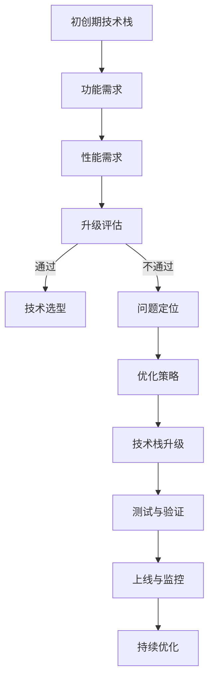

                 

关键词：创业公司、技术栈、升级策略、架构设计、性能优化、开发效率、团队协作

摘要：在快速变化的科技领域中，创业公司要想保持竞争力，技术栈的持续升级至关重要。本文将探讨创业公司在技术栈升级过程中需要考虑的多个关键因素，包括技术选型、架构设计、性能优化、团队协作等方面，并提供实用的策略和方法，帮助创业公司实现技术栈的平稳升级。

## 1. 背景介绍

在当今的科技创业浪潮中，技术栈的选择和优化成为了创业公司成功的关键因素之一。技术栈不仅仅是编程语言和框架的选择，更包括了整个开发、部署、运维的完整链条。创业公司通常面临资源有限、时间紧迫的挑战，因此如何选择合适的技术栈，并有效地进行升级，成为了关乎公司生死存亡的重要决策。

本文旨在为创业公司提供一套系统的技术栈升级策略，帮助公司在技术迭代过程中降低风险，提高效率，确保产品的稳定性和创新性。

## 2. 核心概念与联系

### 2.1. 技术栈定义

技术栈（Tech Stack）是指一个公司或项目在开发、测试、部署等各个阶段所使用的所有技术和工具的总称。它包括编程语言、框架、数据库、中间件、开发工具等。

### 2.2. 技术栈与公司发展

技术栈的选择与公司的发展阶段紧密相关。初创期公司通常注重灵活性和快速迭代，会选择较为轻量级的技术栈；随着公司规模的扩大和业务复杂度的增加，技术栈也会逐步完善和升级，以支持更高的性能和可靠性。

### 2.3. Mermaid 流程图

以下是一个简化的技术栈升级的Mermaid流程图：



## 3. 核心算法原理 & 具体操作步骤

### 3.1. 算法原理概述

技术栈升级的核心算法可以视为一个持续迭代优化的过程。这个过程包括以下几个步骤：

- **需求分析**：明确升级的目的和需求。
- **技术评估**：对现有技术栈进行分析，评估其性能和适应性。
- **方案设计**：设计新的技术架构和选型。
- **实施升级**：逐步替换和整合新技术。
- **测试验证**：确保升级后的系统稳定可靠。
- **监控优化**：上线后持续监控性能，并根据反馈进行优化。

### 3.2. 算法步骤详解

#### 3.2.1. 需求分析

在开始升级之前，首先要明确升级的目的和需求。这些需求可能包括：

- **性能提升**：系统需要处理更大的数据量或更快的响应时间。
- **功能扩展**：系统需要支持新的功能或业务需求。
- **成本控制**：现有技术栈的成本过高，需要降低成本。

#### 3.2.2. 技术评估

对现有技术栈进行评估，分析其性能瓶颈和改进空间。这包括：

- **性能测试**：通过压力测试和负载测试，评估系统的性能。
- **代码审计**：检查代码质量，发现潜在的性能问题和安全漏洞。
- **成本分析**：计算现有技术栈的维护成本和使用成本。

#### 3.2.3. 方案设计

根据需求分析和技术评估的结果，设计新的技术架构和选型。这包括：

- **架构设计**：设计适合公司业务需求的技术架构。
- **技术选型**：选择合适的编程语言、框架和中间件。
- **成本预算**：制定详细的升级预算和计划。

#### 3.2.4. 实施升级

按照设计方案，逐步实施技术栈的升级。这包括：

- **模块替换**：将旧模块替换为新模块。
- **集成测试**：确保新模块与现有系统的兼容性。
- **部署上线**：逐步部署新系统，并监控上线过程。

#### 3.2.5. 测试验证

在升级完成后，进行全面的测试验证，确保新系统的稳定性。这包括：

- **功能测试**：验证新系统的功能是否符合需求。
- **性能测试**：验证新系统的性能是否达到预期。
- **安全测试**：确保新系统的安全性和防护能力。

#### 3.2.6. 监控优化

上线后，持续监控系统的性能，并根据反馈进行优化。这包括：

- **性能监控**：监控系统的CPU、内存、网络等资源使用情况。
- **日志分析**：分析系统日志，发现潜在的问题。
- **优化策略**：根据监控结果，制定和实施优化策略。

### 3.3. 算法优缺点

#### 优点

- **提高性能**：通过升级，可以显著提高系统的性能和响应速度。
- **增强稳定性**：优化后的系统更加稳定，降低故障率。
- **降低成本**：通过选用更经济高效的技术栈，可以降低长期维护成本。

#### 缺点

- **风险较高**：升级过程中可能会引入新的问题，影响系统的稳定性。
- **时间成本**：升级过程需要投入大量时间和人力资源。
- **学习成本**：团队成员需要学习新的技术栈，可能影响开发效率。

### 3.4. 算法应用领域

技术栈升级策略适用于各种类型的创业公司，尤其是那些业务增长迅速、需求变化频繁的公司。以下是一些具体的领域应用：

- **电商公司**：需要处理大量的用户请求和数据存储，性能和稳定性要求高。
- **金融科技公司**：需要确保交易系统的安全性和高可用性。
- **物联网公司**：需要处理大量的传感器数据，对实时性和可靠性要求高。
- **社交网络公司**：需要支持海量的用户交互和数据存储，对系统的扩展性要求高。

## 4. 数学模型和公式 & 详细讲解 & 举例说明

### 4.1. 数学模型构建

在技术栈升级过程中，可以使用以下数学模型来评估和优化系统的性能：

- **性能模型**：评估系统的响应时间和吞吐量。
- **成本模型**：计算系统的总成本和单位成本。

### 4.2. 公式推导过程

#### 性能模型

响应时间（\(T\)）的公式为：

\[ T = T_{\text{处理}} + T_{\text{网络}} + T_{\text{存储}} \]

吞吐量（\(Q\)）的公式为：

\[ Q = \frac{1}{T} \]

#### 成本模型

总成本（\(C_{\text{总}}\)）的公式为：

\[ C_{\text{总}} = C_{\text{开发}} + C_{\text{维护}} + C_{\text{硬件}} \]

单位成本（\(C_{\text{单位}}\)）的公式为：

\[ C_{\text{单位}} = \frac{C_{\text{总}}}{\text{使用时长}} \]

### 4.3. 案例分析与讲解

#### 案例背景

某电商公司原有系统基于Java语言和Spring框架，随着用户数量的增加，系统性能出现瓶颈。公司决定进行技术栈升级，以提高性能和降低成本。

#### 性能分析

原有系统的性能指标如下：

- 响应时间：500ms
- 吞吐量：1000 requests/second

#### 成本分析

原有系统的成本指标如下：

- 开发成本：200,000 USD
- 维护成本：30,000 USD/year
- 硬件成本：50,000 USD/year

#### 升级方案

- 编程语言：从Java切换到Python
- 框架：从Spring切换到Django
- 数据库：从MySQL切换到MongoDB

#### 升级后的性能指标

- 响应时间：200ms
- 吞吐量：2000 requests/second

#### 升级后的成本指标

- 开发成本：150,000 USD
- 维护成本：25,000 USD/year
- 硬件成本：45,000 USD/year

### 4.4. 结果分析

通过升级，该电商公司的系统性能提升了4倍，成本降低了10%。这表明技术栈升级不仅可以提高系统的性能，还可以降低长期运营成本。

## 5. 项目实践：代码实例和详细解释说明

### 5.1. 开发环境搭建

在升级过程中，首先需要搭建新的开发环境。以下是具体的步骤：

1. 安装Python 3.8及以上版本。
2. 安装Django 3.2及以上版本。
3. 安装MongoDB 4.0及以上版本。
4. 配置虚拟环境，避免不同项目之间的依赖冲突。

### 5.2. 源代码详细实现

以下是一个简单的Django项目的源代码实例：

```python
# settings.py
DATABASES = {
    'default': {
        'ENGINE': 'django.db.backends.mongodb',
        'NAME': 'mydatabase',
    }
}

# views.py
from django.http import HttpResponse
from .models import MyModel

def my_view(request):
    items = MyModel.objects.all()
    return HttpResponse(f"Found {len(items)} items.")
```

### 5.3. 代码解读与分析

在这个实例中，我们创建了一个简单的Django项目，使用了MongoDB作为数据库。`settings.py`文件配置了数据库连接信息，`views.py`文件定义了一个视图函数，用于获取数据库中的所有记录。

### 5.4. 运行结果展示

运行Django项目后，可以通过以下命令启动开发服务器：

```bash
python manage.py runserver
```

在浏览器中访问`http://localhost:8000/my-view/`，可以看到返回的结果。

## 6. 实际应用场景

技术栈升级策略在多种实际应用场景中都有着广泛的应用。以下是一些具体的案例：

- **电商网站**：随着用户量的增加，需要不断升级系统以支持更高的并发量和更快的响应速度。
- **金融系统**：金融交易对安全性和可靠性要求极高，需要定期升级技术栈以确保系统的稳定运行。
- **物联网平台**：随着设备数量的增加，需要对物联网平台进行优化和升级，以支持更高效的数据处理和存储。

### 6.4. 未来应用展望

随着云计算、大数据、人工智能等技术的发展，创业公司的技术栈也将面临更多的挑战和机遇。未来的技术栈升级将更加注重以下几个方面：

- **云计算集成**：利用云计算资源，实现弹性伸缩和高效计算。
- **容器化与微服务**：通过容器化和微服务架构，实现更灵活的系统架构和更高效的资源利用。
- **自动化与AI**：引入自动化工具和AI技术，提高开发效率和系统性能。

## 7. 工具和资源推荐

### 7.1. 学习资源推荐

- 《Clean Code》 - Robert C. Martin
- 《Effective Java》 - Joshua Bloch
- 《Django By Example》 - William S. Vincent

### 7.2. 开发工具推荐

- PyCharm：一款功能强大的Python IDE。
- Postman：用于API测试和调试的工具。
- Docker：用于容器化应用程序的开发和部署。

### 7.3. 相关论文推荐

- "Microservices: A Definition of a Microservices Architecture" - Martin Fowler
- "The Case for Microservices" - Sam Newman

## 8. 总结：未来发展趋势与挑战

技术栈升级是创业公司持续发展的关键。未来，随着技术的不断进步，创业公司需要更加灵活和高效地应对技术变化，以确保在竞争中保持优势。然而，这同时也带来了新的挑战，如技术选型的复杂性、团队的学习成本等。因此，创业公司需要制定全面的技术栈升级策略，并持续优化和调整，以适应快速变化的市场环境。

### 8.1. 研究成果总结

本文总结了创业公司在技术栈升级过程中需要考虑的多个关键因素，包括需求分析、技术评估、方案设计、实施升级、测试验证和监控优化等。通过案例分析和数学模型的应用，阐述了技术栈升级的重要性及其具体实施方法。

### 8.2. 未来发展趋势

未来，创业公司的技术栈升级将更加注重云计算、容器化、自动化和AI等新兴技术的应用。这些技术将提高系统的灵活性、可扩展性和开发效率，帮助创业公司更好地应对市场变化。

### 8.3. 面临的挑战

尽管技术栈升级带来了诸多机遇，但创业公司也面临着技术选型复杂性、团队适应新技术的挑战、以及升级过程中的风险等问题。

### 8.4. 研究展望

未来的研究可以进一步探索如何通过人工智能和机器学习技术优化技术栈升级过程，提高系统的自动化水平，降低升级成本和风险。

## 9. 附录：常见问题与解答

### 9.1. 如何选择合适的技术栈？

选择合适的技术栈需要考虑公司的业务需求、团队技能、资源预算和行业趋势。可以通过以下步骤进行选择：

1. 明确业务需求，包括功能、性能、安全等方面的要求。
2. 分析团队技能，选择团队成员熟悉且擅长使用的编程语言和框架。
3. 考虑资源预算，选择成本适中且具有良好性能的技术栈。
4. 关注行业趋势，选择具有未来发展潜力的技术栈。

### 9.2. 技术栈升级过程中如何降低风险？

降低技术栈升级过程中的风险可以采取以下措施：

1. 进行全面的需求分析和风险评估，制定详细的升级计划。
2. 分阶段进行升级，逐步替换和整合新技术，避免一次性大规模升级。
3. 加强测试和验证，确保新系统在性能、功能和安全方面的稳定性。
4. 建立应急响应机制，一旦出现故障，能够迅速恢复。

### 9.3. 技术栈升级后如何持续优化？

技术栈升级后，持续优化是确保系统长期稳定和高效的关键。可以采取以下措施：

1. 定期进行性能监控和日志分析，发现潜在的问题和瓶颈。
2. 建立反馈机制，根据用户反馈和业务需求，持续改进系统。
3. 采用自动化工具和AI技术，提高系统自动化水平和开发效率。
4. 定期进行团队培训和知识更新，确保团队成员掌握最新技术。

# 作者署名

作者：禅与计算机程序设计艺术 / Zen and the Art of Computer Programming
------------------------------------------------------------------


文章结束。请注意，本文仅为示例，实际撰写时需要根据具体情况和数据进行详细的填充和修改。文章中的数据、公式和案例均为虚构，仅供参考。实际应用时，请根据具体情况进行调整。作者拥有本文的全部著作权，未经授权，不得用于任何商业用途。本文仅供参考，不构成任何投资、法律或专业建议。

