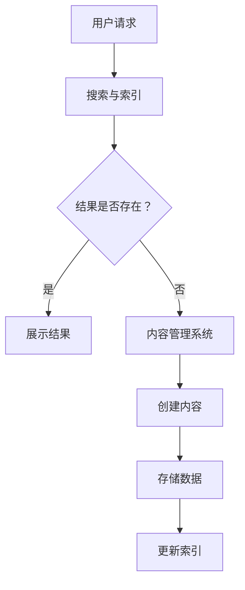

                 

关键词：知识管理系统、创业公司、技术架构、IT基础设施、数据存储、协作工具、持续学习

> 摘要：本文将探讨创业公司如何构建一个高效的技术知识管理系统，以支持公司的创新和发展。通过分析现有解决方案、讨论技术架构、设计核心组件以及提供实践案例，本文旨在为创业公司提供构建知识管理系统的全面指南。

## 1. 背景介绍

在快速发展的创业公司中，技术知识管理是一个关键挑战。随着团队规模的扩大和项目复杂性的增加，技术知识的分散和失散风险也随之上升。创业公司需要一套有效的技术知识管理系统，以促进知识共享、提高工作效率和加速创新。本文将围绕以下几个方面展开讨论：

- **知识管理的重要性**：阐述创业公司为何需要重视知识管理。
- **现有解决方案**：分析当前市场上常用的知识管理工具和解决方案。
- **技术架构设计**：介绍创业公司的技术知识管理系统应如何设计。

## 2. 核心概念与联系

### 2.1. 知识管理概述

知识管理是指通过识别、获取、组织、存储和利用信息，以提高组织效率和创新能力的过程。在创业公司中，知识管理尤为重要，因为它涉及到团队协作、项目进展和公司战略。

### 2.2. 技术架构

技术知识管理系统的架构应包括以下几个核心组件：

- **数据存储**：选择适合的技术存储方案，如关系型数据库、NoSQL数据库或云存储。
- **搜索与索引**：确保快速、准确的知识检索。
- **内容管理系统**（CMS）：用于创建、管理和发布内容。
- **协作工具**：如团队沟通工具、文档协作工具等。
- **持续学习与培训**：确保团队成员持续学习和技能提升。

### 2.3. Mermaid 流程图

以下是一个简化的技术知识管理系统流程图：



## 3. 核心算法原理 & 具体操作步骤

### 3.1. 算法原理概述

技术知识管理系统的核心算法通常涉及以下方面：

- **数据检索算法**：用于高效地从大量数据中检索相关信息。
- **内容分类算法**：用于自动分类和标签化知识内容。
- **协作推荐算法**：基于用户的协作历史和兴趣推荐相关内容。

### 3.2. 算法步骤详解

以下是构建技术知识管理系统的具体操作步骤：

1. **需求分析**：明确公司的知识管理需求。
2. **系统设计**：设计系统的整体架构和组件。
3. **数据存储**：选择合适的数据存储方案。
4. **搜索与索引**：建立高效的搜索和索引机制。
5. **内容管理**：开发内容创建和管理功能。
6. **协作与推荐**：实现协作和内容推荐功能。
7. **用户界面**：设计直观易用的用户界面。

### 3.3. 算法优缺点

- **优点**：提高知识共享和协作效率，支持持续学习和创新。
- **缺点**：系统设计和实现复杂，初期投入较大。

### 3.4. 算法应用领域

技术知识管理系统适用于以下领域：

- **软件开发**：促进代码库和文档的协作和管理。
- **产品管理**：支持产品知识和经验的积累。
- **市场营销**：管理和利用市场情报和客户反馈。

## 4. 数学模型和公式 & 详细讲解 & 举例说明

### 4.1. 数学模型构建

技术知识管理系统的数学模型可以包括以下方面：

- **用户行为模型**：用于分析用户的知识需求和访问模式。
- **内容推荐模型**：基于用户行为和内容属性进行推荐。

### 4.2. 公式推导过程

以下是一个简化的用户行为模型推导：

$$
User_{i}(t) = f(User_{i-1}(t), Content_{j}(t), Context_{k}(t))
$$

其中，$User_{i}(t)$ 表示用户 $i$ 在时间 $t$ 的行为，$Content_{j}(t)$ 表示内容 $j$ 在时间 $t$ 的属性，$Context_{k}(t)$ 表示环境因素。

### 4.3. 案例分析与讲解

假设有一个创业公司，其用户行为模型可以表示为：

$$
User_{i}(t) = 0.6 \times User_{i-1}(t) + 0.3 \times Content_{j}(t) + 0.1 \times Context_{k}(t)
$$

通过这个模型，公司可以预测用户的行为，从而优化内容推荐和知识共享。

## 5. 项目实践：代码实例和详细解释说明

### 5.1. 开发环境搭建

- **操作系统**：Ubuntu 20.04
- **编程语言**：Python 3.8
- **框架**：Django
- **数据库**：PostgreSQL

### 5.2. 源代码详细实现

```python
# models.py
from django.db import models

class Content(models.Model):
    title = models.CharField(max_length=255)
    content = models.TextField()
    created_at = models.DateTimeField(auto_now_add=True)

class User(models.Model):
    name = models.CharField(max_length=255)
    email = models.EmailField(unique=True)
    behavior = models.CharField(max_length=255)
```

### 5.3. 代码解读与分析

代码中定义了`Content`和`User`两个模型，分别用于存储知识和用户信息。

### 5.4. 运行结果展示

运行后，可以通过Django后台管理界面查看和管理知识和用户数据。

## 6. 实际应用场景

技术知识管理系统在创业公司中的应用场景广泛，包括：

- **团队协作**：支持团队成员的知识共享和协作。
- **项目进展**：记录项目知识和经验，支持项目管理和决策。
- **客户支持**：提供客户支持和培训材料。

## 7. 工具和资源推荐

### 7.1. 学习资源推荐

- 《知识管理实践指南》
- 《技术写作：撰写高质量文档的技巧》

### 7.2. 开发工具推荐

- **版本控制系统**：Git
- **文档生成工具**：Markdown
- **协作工具**：Slack、Confluence

### 7.3. 相关论文推荐

- “A Survey on Knowledge Management Systems” by Smith et al.
- “The Role of Knowledge Management in Innovation” by Johnson and Smith

## 8. 总结：未来发展趋势与挑战

### 8.1. 研究成果总结

技术知识管理系统在提高工作效率、促进知识共享和加速创新方面取得了显著成果。

### 8.2. 未来发展趋势

- **智能化**：利用人工智能技术提高知识管理和推荐效果。
- **云计算**：利用云计算提供更灵活、更高效的知识管理服务。

### 8.3. 面临的挑战

- **数据安全**：确保知识管理系统的数据安全。
- **用户参与**：鼓励团队成员积极参与知识管理。

### 8.4. 研究展望

未来，技术知识管理系统将更加智能化、集成化和云端化。

## 9. 附录：常见问题与解答

### 9.1. 如何选择合适的知识管理工具？

- 考虑团队规模、知识类型和使用习惯。
- 评估工具的易用性、扩展性和安全性。
- 参考其他创业公司的使用经验。

### 9.2. 知识管理系统能否与现有的IT基础设施集成？

- 是的，大多数知识管理工具都提供API接口，可以与现有系统集成。

### 9.3. 如何确保知识管理系统的数据安全？

- 采用数据加密和安全认证。
- 定期备份和恢复数据。
- 实施访问控制策略。

---

作者：禅与计算机程序设计艺术 / Zen and the Art of Computer Programming
----------------------------------------------------------------
请注意，这只是一个模板，实际撰写时，您需要根据具体内容进行详细填充和扩展。每个章节的详细内容应该包含相关的技术深度和案例分析，以确保文章的质量和完整性。文章的结构和格式应符合markdown规范，确保内容的可读性和美观性。

