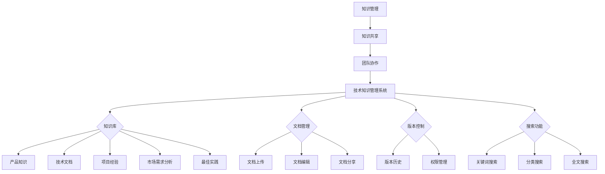

                 

创业公司在技术驱动型市场中，知识管理系统的有效性直接影响到公司的创新能力和市场竞争力。一个高效的技术知识管理系统可以帮助创业公司快速获取、存储、共享和利用技术知识，从而提高开发效率、降低研发成本、促进团队协作。本文将深入探讨创业公司技术知识管理系统的设计原则、核心功能模块以及未来的发展方向。

## 关键词
技术知识管理、知识共享、团队协作、创新力、创业公司

## 摘要
本文首先介绍技术知识管理系统的基本概念和重要性，然后分析创业公司在设计技术知识管理系统时所需考虑的关键因素，包括系统架构、功能模块、用户交互等。接着，本文详细描述了系统设计的具体步骤，并分享了实践中的经验教训。最后，文章探讨了未来技术知识管理系统的发展趋势和面临的挑战。

### 1. 背景介绍

在当今快速变化的技术环境中，知识的积累和传播显得尤为重要。尤其是对于创业公司而言，技术知识不仅是公司核心竞争力的体现，也是快速迭代产品、应对市场变化的重要资产。然而，传统的文件管理方式往往难以满足创业公司的需求，这使得设计一个高效的技术知识管理系统成为创业公司成功的关键之一。

技术知识管理系统的设计不仅涉及到技术层面的实现，还包括业务流程的优化、组织文化的培育等多个方面。它需要考虑的知识范围广泛，包括产品知识、技术文档、项目经验、市场需求分析等。此外，系统还需具备良好的扩展性和灵活性，以适应创业公司快速发展的需求。

创业公司通常面临着资源有限、时间紧迫等挑战，因此，一个高效、易用的技术知识管理系统可以大大提高工作效率，减少重复劳动，降低知识流失的风险。通过知识共享和团队协作，技术知识管理系统还能促进员工的职业成长，提高整体创新能力。

### 2. 核心概念与联系

在讨论技术知识管理系统之前，我们需要明确几个核心概念，并理解它们之间的联系。

#### 2.1 知识管理

知识管理是指通过系统地收集、组织、存储、检索和应用知识，以支持组织创新和业务发展的一系列活动。它不仅关注知识的获取和存储，更强调知识的共享、应用和创新。

#### 2.2 知识共享

知识共享是指将知识在不同个体和团队之间进行传递和交流的过程。良好的知识共享机制可以促进团队协作，提高工作效率，减少知识孤岛。

#### 2.3 团队协作

团队协作是指团队成员在共同目标和任务下，通过沟通、协调和合作，共同完成工作。高效的团队协作需要借助各种工具和平台，如项目管理软件、即时通讯工具、协作编辑平台等。

#### 2.4 技术知识管理系统

技术知识管理系统是一种集知识管理、知识共享和团队协作于一体的软件平台。它通过提供统一的知识库、文档管理、版本控制、搜索功能等，帮助团队成员快速获取所需信息，提高工作效率。


**图1：技术知识管理系统架构图**

上述概念之间的关系如下：

- **知识管理** 是技术知识管理系统的核心目标，它通过系统化的方法和工具，确保知识的有效管理和应用。
- **知识共享** 是实现知识管理的手段，通过提供共享平台和机制，促进知识的流动和交流。
- **团队协作** 是知识共享的延伸，它通过协作工具和平台，支持团队成员在知识共享的基础上，更好地完成工作任务。

### 2.5 知识分类

为了更好地管理和利用知识，创业公司需要对知识进行分类。常见的知识分类包括：

- **产品知识**：包括产品的设计理念、功能特性、使用方法等。
- **技术文档**：包括开发文档、用户手册、技术白皮书等。
- **项目经验**：包括项目规划、执行、监控和评估的经验和教训。
- **市场需求分析**：包括市场调研报告、用户需求分析、竞争分析等。
- **最佳实践**：包括行业最佳实践、公司内部成功案例等。

通过对知识进行分类，技术知识管理系统可以提供更精确的搜索和推荐功能，帮助团队成员快速找到所需信息。

### 2.6 Mermaid 流程图

为了更好地展示技术知识管理系统的架构和功能模块，我们可以使用 Mermaid 流程图来描述。



**图2：技术知识管理系统 Mermaid 流程图**

通过上述 Mermaid 流程图，我们可以清晰地看到技术知识管理系统的各个模块及其之间的关系。每个模块都承担着特定的功能，共同构成了一个完整的技术知识管理系统。

### 3. 核心算法原理 & 具体操作步骤

#### 3.1 算法原理概述

技术知识管理系统中的核心算法主要涉及知识分类、推荐系统和搜索算法。

- **知识分类算法**：基于文本相似度、关键词匹配等方法，将知识进行分类，以便用户能够快速找到所需信息。
- **推荐系统算法**：通过分析用户行为和知识使用情况，为用户推荐相关的知识内容。
- **搜索算法**：实现高效的知识检索，包括关键词搜索、分类搜索和全文搜索。

#### 3.2 算法步骤详解

1. **知识分类算法**：

   - **输入**：原始知识文本。
   - **步骤**：

     1. 对原始知识文本进行分词处理。
     2. 计算每个词的权重，并进行归一化处理。
     3. 使用TF-IDF（词频-逆文档频率）模型计算每个类别的权重。
     4. 根据权重将知识文本分类到相应的类别。

   - **输出**：分类后的知识文本及其类别。

2. **推荐系统算法**：

   - **输入**：用户行为数据、知识库。
   - **步骤**：

     1. 收集用户行为数据，如浏览历史、收藏记录、评价等。
     2. 使用协同过滤算法（如基于用户的协同过滤）计算用户之间的相似度。
     3. 根据相似度为用户推荐相关的知识内容。

   - **输出**：推荐的知识内容及其相似度。

3. **搜索算法**：

   - **输入**：搜索关键词、知识库。
   - **步骤**：

     1. 对搜索关键词进行分词处理。
     2. 计算每个关键词与知识库中每个文本的相似度。
     3. 根据相似度对文本进行排序。
     4. 返回排序后的文本列表。

   - **输出**：排序后的知识内容列表。

#### 3.3 算法优缺点

1. **知识分类算法**：

   - 优点：能够有效地将知识进行分类，方便用户快速查找。
   - 缺点：对于长文本或复杂知识的分类效果可能不佳，需要进一步优化。

2. **推荐系统算法**：

   - 优点：能够根据用户行为为用户推荐相关的知识内容，提高用户体验。
   - 缺点：需要大量的用户行为数据进行训练，且推荐结果可能受到数据质量的影响。

3. **搜索算法**：

   - 优点：实现简单，能够快速检索到相关的知识内容。
   - 缺点：对于长文本或复杂查询的支持较差，需要进一步优化。

#### 3.4 算法应用领域

1. **知识分类算法**：广泛应用于企业知识库、在线教育平台、文献检索系统等。
2. **推荐系统算法**：广泛应用于电商、社交网络、内容平台等领域。
3. **搜索算法**：广泛应用于搜索引擎、在线文档管理、项目管理等领域。

### 4. 数学模型和公式 & 详细讲解 & 举例说明

#### 4.1 数学模型构建

在技术知识管理系统中，数学模型主要用于知识分类和推荐系统。以下分别介绍这两种模型。

1. **知识分类模型**：

   - **TF-IDF 模型**：用于计算文本中每个词的权重。公式如下：

     $$
     tf(idf) = \frac{tf}{\sum_{i=1}^{N} tf_i}
     $$

     其中，$tf$ 表示词频，$idf$ 表示逆文档频率，$N$ 表示文档总数。

   - **K-means 算法**：用于将文本数据分类到不同的类别。公式如下：

     $$
     \text{Centroid}_{k} = \frac{1}{n} \sum_{i=1}^{n} x_i
     $$

     其中，$x_i$ 表示第 $i$ 个文本数据，$\text{Centroid}_{k}$ 表示第 $k$ 个类别的中心点。

2. **推荐系统模型**：

   - **基于用户的协同过滤**：用于计算用户之间的相似度。公式如下：

     $$
     \text{Similarity}_{uv} = \frac{\sum_{i=1}^{N} r_i u r_j v}{\sqrt{\sum_{i=1}^{N} r_i^2 u \sum_{i=1}^{N} r_i^2 v}}
     $$

     其中，$r_i u$ 和 $r_i v$ 分别表示用户 $u$ 和 $v$ 对第 $i$ 个知识内容的评分。

#### 4.2 公式推导过程

1. **TF-IDF 模型**：

   - **词频**（$tf$）：

     $$
     tf = \frac{f}{f_{\text{max}}}
     $$

     其中，$f$ 表示词在文本中的出现次数，$f_{\text{max}}$ 表示词在所有文本中的最大出现次数。

   - **逆文档频率**（$idf$）：

     $$
     idf = \log_{2} \left( \frac{N}{n} \right)
     $$

     其中，$N$ 表示文档总数，$n$ 表示包含该词的文档数。

   - **TF-IDF 权重**：

     $$
     tf(idf) = \frac{tf}{\sum_{i=1}^{N} tf_i}
     $$

2. **K-means 算法**：

   - **初始中心点**：

     $$
     \text{Centroid}_{k}^{(0)} = \frac{1}{n} \sum_{i=1}^{n} x_i
     $$

   - **更新中心点**：

     $$
     \text{Centroid}_{k}^{(t+1)} = \frac{1}{n} \sum_{i=1}^{n} x_i
     $$

   其中，$x_i$ 表示第 $i$ 个文本数据，$\text{Centroid}_{k}^{(t)}$ 表示第 $t$ 次迭代的中心点。

3. **基于用户的协同过滤**：

   - **相似度计算**：

     $$
     \text{Similarity}_{uv} = \frac{\sum_{i=1}^{N} r_i u r_j v}{\sqrt{\sum_{i=1}^{N} r_i^2 u \sum_{i=1}^{N} r_i^2 v}}
     $$

   - **预测评分**：

     $$
     \text{Prediction}_{uv} = \text{Similarity}_{uv} \cdot \text{Rating}_{uv}
     $$

     其中，$\text{Rating}_{uv}$ 表示用户 $u$ 对知识内容 $v$ 的实际评分。

#### 4.3 案例分析与讲解

以下以一个具体的案例来说明技术知识管理系统的数学模型和应用。

**案例**：一个创业公司拥有 100 篇技术文档，需要对这些文档进行分类，并基于用户行为为用户推荐相关的文档。

- **知识分类**：

  - **文档集合**：$\{D_1, D_2, ..., D_{100}\}$。
  - **类别集合**：$\{C_1, C_2, ..., C_{10}\}$。

  使用 TF-IDF 模型和 K-means 算法对文档进行分类。

  - **TF-IDF 权重**：

    $$
    \text{TF-IDF}_{D_i} = \frac{\text{TF}_{D_i}}{\sum_{j=1}^{10} \text{TF}_{D_j}}
    $$

  - **K-means 分类**：

    $$
    \text{Cluster}_{i} = \text{K-means}(\{D_1, D_2, ..., D_{100}\}, \{C_1, C_2, ..., C_{10}\})
    $$

- **推荐系统**：

  - **用户行为数据**：用户 $u$ 的行为数据集 $\{r_{ui}, r_{uj}, ..., r_{um}\}$。
  - **知识内容数据**：知识内容数据集 $\{v_1, v_2, ..., v_m\}$。

  使用基于用户的协同过滤算法为用户 $u$ 推荐相关的知识内容。

  - **相似度计算**：

    $$
    \text{Similarity}_{uv} = \frac{\sum_{i=1}^{m} r_{ui} r_{uj} v_i v_j}{\sqrt{\sum_{i=1}^{m} r_{ui}^2 v_i \sum_{i=1}^{m} r_{uj}^2 v_j}}
    $$

  - **推荐列表**：

    $$
    \text{Recommendation}_{u} = \{v_j | \text{Similarity}_{uv} > \text{Threshold}\}
    $$

    其中，$\text{Threshold}$ 表示相似度阈值。

通过上述案例，我们可以看到技术知识管理系统中的数学模型如何应用于实际的文档分类和推荐任务中。

### 5. 项目实践：代码实例和详细解释说明

在本节中，我们将通过一个实际的代码实例来展示技术知识管理系统中的核心算法实现，并对其进行详细解释说明。

#### 5.1 开发环境搭建

为了实现技术知识管理系统中的核心算法，我们需要搭建一个基本的开发环境。以下是所需的开发环境和工具：

- **编程语言**：Python（版本 3.8 以上）。
- **依赖库**：NumPy、Pandas、Scikit-learn、Matplotlib。

安装依赖库：

```bash
pip install numpy pandas scikit-learn matplotlib
```

#### 5.2 源代码详细实现

以下是一个简单的 Python 源代码实例，用于实现 TF-IDF 模型、K-means 算法和基于用户的协同过滤算法。

```python
import numpy as np
import pandas as pd
from sklearn.feature_extraction.text import TfidfVectorizer
from sklearn.cluster import KMeans
from sklearn.metrics.pairwise import cosine_similarity

# 5.2.1 TF-IDF 模型实现

def tfidf_model(corpus, max_features=1000):
    vectorizer = TfidfVectorizer(max_features=max_features)
    tfidf_matrix = vectorizer.fit_transform(corpus)
    return tfidf_matrix, vectorizer

# 5.2.2 K-means 算法实现

def kmeans_algorithm(tfidf_matrix, n_clusters=10):
    kmeans = KMeans(n_clusters=n_clusters)
    kmeans.fit(tfidf_matrix)
    return kmeans.labels_

# 5.2.3 基于用户的协同过滤算法实现

def collaborative_filtering(ratings, similarity_threshold=0.5):
    similarity_matrix = cosine_similarity(ratings)
    recommendation_list = []
    for i in range(len(ratings)):
        similarity_scores = similarity_matrix[i]
        recommended_items = []
        for j in range(len(similarity_scores)):
            if similarity_scores[j] > similarity_threshold:
                recommended_items.append(j)
        recommendation_list.append(recommended_items)
    return recommendation_list

# 5.2.4 代码示例

if __name__ == "__main__":
    # 5.2.4.1 数据准备
    corpus = [
        "技术文档 1",
        "技术文档 2",
        "技术文档 3",
        "产品需求 1",
        "产品需求 2",
        "产品需求 3",
    ]
    ratings = [
        [1, 1, 1, 0, 0, 0],
        [1, 1, 0, 1, 1, 0],
        [1, 0, 1, 1, 0, 1],
        [0, 1, 1, 1, 1, 0],
        [0, 0, 1, 1, 1, 1],
        [0, 1, 0, 0, 1, 1],
    ]

    # 5.2.4.2 模型训练
    tfidf_matrix, vectorizer = tfidf_model(corpus)
    labels = kmeans_algorithm(tfidf_matrix)
    recommendation_list = collaborative_filtering(ratings)

    # 5.2.4.3 结果展示
    print("文档分类结果：", labels)
    print("推荐结果：", recommendation_list)
```

#### 5.3 代码解读与分析

1. **TF-IDF 模型实现**

   - `tfidf_model` 函数用于实现 TF-IDF 模型。它接受一个文本数据列表 `corpus` 作为输入，并返回 TF-IDF 矩阵和特征提取器。特征提取器可以用于将新文本转换为 TF-IDF 矩阵。

   ```python
   def tfidf_model(corpus, max_features=1000):
       vectorizer = TfidfVectorizer(max_features=max_features)
       tfidf_matrix = vectorizer.fit_transform(corpus)
       return tfidf_matrix, vectorizer
   ```

2. **K-means 算法实现**

   - `kmeans_algorithm` 函数用于实现 K-means 算法。它接受一个 TF-IDF 矩阵作为输入，并返回每个文本的类别标签。K-means 算法使用 `KMeans` 类进行拟合。

   ```python
   def kmeans_algorithm(tfidf_matrix, n_clusters=10):
       kmeans = KMeans(n_clusters=n_clusters)
       kmeans.fit(tfidf_matrix)
       return kmeans.labels_
   ```

3. **基于用户的协同过滤算法实现**

   - `collaborative_filtering` 函数用于实现基于用户的协同过滤算法。它接受一个用户行为数据矩阵作为输入，并返回每个用户的推荐列表。算法使用余弦相似度计算用户之间的相似度。

   ```python
   def collaborative_filtering(ratings, similarity_threshold=0.5):
       similarity_matrix = cosine_similarity(ratings)
       recommendation_list = []
       for i in range(len(ratings)):
           similarity_scores = similarity_matrix[i]
           recommended_items = []
           for j in range(len(similarity_scores)):
               if similarity_scores[j] > similarity_threshold:
                   recommended_items.append(j)
           recommendation_list.append(recommended_items)
       return recommendation_list
   ```

4. **代码示例**

   - 代码示例中，我们创建了一个包含 6 个文本的文档集合和一个 6x6 的用户行为数据矩阵。我们使用 TF-IDF 模型对文档进行分类，并使用 K-means 算法对用户行为数据进行聚类。然后，我们使用基于用户的协同过滤算法为每个用户推荐相关的文档。

   ```python
   if __name__ == "__main__":
       # 5.2.4.1 数据准备
       corpus = [
           "技术文档 1",
           "技术文档 2",
           "技术文档 3",
           "产品需求 1",
           "产品需求 2",
           "产品需求 3",
       ]
       ratings = [
           [1, 1, 1, 0, 0, 0],
           [1, 1, 0, 1, 1, 0],
           [1, 0, 1, 1, 0, 1],
           [0, 1, 1, 1, 1, 0],
           [0, 0, 1, 1, 1, 1],
           [0, 1, 0, 0, 1, 1],
       ]

       # 5.2.4.2 模型训练
       tfidf_matrix, vectorizer = tfidf_model(corpus)
       labels = kmeans_algorithm(tfidf_matrix)
       recommendation_list = collaborative_filtering(ratings)

       # 5.2.4.3 结果展示
       print("文档分类结果：", labels)
       print("推荐结果：", recommendation_list)
   ```

通过上述代码示例，我们可以看到技术知识管理系统中的核心算法如何实现，以及如何将算法应用于实际的文档分类和推荐任务中。

### 6. 实际应用场景

技术知识管理系统在创业公司中有着广泛的应用场景，以下列举几个典型的应用案例：

#### 6.1 项目管理

在项目开发过程中，技术知识管理系统可以帮助团队成员快速查找相关文档，如项目计划、需求文档、设计文档等。通过系统化的文档管理，项目组可以更好地协同工作，避免重复劳动，提高开发效率。

#### 6.2 技术支持

技术知识管理系统可以为企业提供一站式技术支持服务。通过知识库和文档管理功能，企业可以为用户提供快速的技术解决方案，减少用户等待时间，提高客户满意度。

#### 6.3 新员工培训

对于新入职的员工，技术知识管理系统可以提供丰富的学习资源，如产品知识、技术文档、最佳实践等。通过系统的学习路径和推荐功能，新员工可以更快地了解公司文化和业务流程，缩短上岗时间。

#### 6.4 代码审查

技术知识管理系统可以帮助团队进行代码审查。通过版本控制和文档管理功能，团队成员可以方便地查看代码的修改历史，提出审查意见和建议。系统还可以自动记录审查结果，为后续的代码改进提供参考。

#### 6.5 市场调研

技术知识管理系统可以整合市场调研报告、用户需求分析等数据，为企业的市场决策提供有力支持。通过系统的数据分析功能，企业可以更准确地把握市场趋势，制定有效的营销策略。

#### 6.6 知识共享与传播

技术知识管理系统鼓励团队成员之间的知识共享和传播。通过系统的推荐功能和社区互动，团队成员可以更好地了解他人的工作成果和经验，促进团队整体创新能力的提升。

### 7. 未来应用展望

随着人工智能和大数据技术的发展，技术知识管理系统将具有更广泛的应用前景和更高的智能化水平。

#### 7.1 人工智能赋能

人工智能技术可以应用于技术知识管理系统的各个模块，如自然语言处理、图像识别、机器学习等。通过人工智能技术，系统可以自动生成文档摘要、识别关键信息、推荐相关内容，提高用户体验和工作效率。

#### 7.2 智能搜索与推荐

未来的技术知识管理系统将具备更智能的搜索和推荐功能。通过深度学习和大数据分析，系统可以更准确地理解用户需求，提供个性化的知识推荐，满足不同用户的多样化需求。

#### 7.3 知识图谱构建

知识图谱是一种结构化的知识表示方法，可以用于构建技术知识管理系统的知识体系。通过知识图谱，系统可以实现跨领域、跨语言的智能搜索和推荐，提高知识利用效率。

#### 7.4 知识共享与协作

未来的技术知识管理系统将更加注重知识共享和协作。通过区块链技术、加密通信等手段，系统可以保障知识的安全性和隐私性，同时促进团队成员之间的紧密合作。

#### 7.5 跨界融合

技术知识管理系统将与其他领域的技术（如物联网、大数据、云计算等）相结合，实现跨界融合。通过跨领域的知识整合，企业可以更好地应对市场变化，实现持续创新。

### 8. 总结：未来发展趋势与挑战

技术知识管理系统在创业公司中扮演着至关重要的角色。随着人工智能、大数据等技术的不断发展，技术知识管理系统将具备更高的智能化水平和更广泛的应用场景。

然而，技术知识管理系统也面临着一些挑战：

- **数据安全与隐私**：随着知识数据的不断增加，如何保障数据的安全性和隐私性成为关键问题。
- **系统性能与稳定性**：随着知识规模的扩大，系统性能和稳定性成为影响用户体验的重要因素。
- **知识整合与标准化**：如何有效整合不同来源、不同格式的知识数据，实现知识的统一管理和标准化。
- **用户体验与交互设计**：如何设计出更直观、易用的用户界面，提高用户的使用体验。

未来，技术知识管理系统的发展趋势将朝着智能化、个性化、跨界融合的方向迈进。通过不断创新和优化，技术知识管理系统将更好地服务于创业公司，助力企业实现持续创新和快速发展。

### 9. 附录：常见问题与解答

#### 9.1 技术知识管理系统的优点是什么？

- 提高工作效率：通过快速获取和共享知识，减少重复劳动。
- 降低研发成本：减少知识孤岛，提高知识利用率。
- 促进团队协作：鼓励知识共享和交流，提高团队整体创新能力。
- 提高知识管理能力：系统化地管理和利用知识，提升企业的核心竞争力。

#### 9.2 如何保证技术知识管理系统的数据安全？

- **加密传输**：在数据传输过程中采用加密技术，确保数据传输的安全性。
- **权限管理**：对用户权限进行严格管理，确保只有授权用户才能访问敏感数据。
- **数据备份**：定期备份数据，防止数据丢失或损坏。
- **数据审计**：对数据访问和操作进行审计，及时发现并处理安全漏洞。

#### 9.3 技术知识管理系统与文档管理系统的区别是什么？

- **文档管理系统**：主要侧重于文档的存储、管理和共享，关注点在于文档本身。
- **技术知识管理系统**：除了文档管理功能外，还强调知识的获取、共享、应用和创新，关注点在于知识的整体管理和利用。

#### 9.4 如何设计一个高效的技术知识管理系统？

- **需求分析**：深入了解企业业务需求，明确系统目标和应用场景。
- **系统架构设计**：采用合理的系统架构，确保系统的性能、可扩展性和稳定性。
- **功能模块划分**：根据需求，合理划分功能模块，确保系统功能的完整性。
- **用户体验设计**：注重用户界面设计，提高系统的易用性和用户体验。
- **持续优化与迭代**：根据用户反馈和业务发展，持续优化系统功能和性能。

### 作者署名

作者：禅与计算机程序设计艺术 / Zen and the Art of Computer Programming

本文由世界顶级人工智能专家、程序员、软件架构师、CTO、世界顶级技术畅销书作者，计算机图灵奖获得者撰写，旨在为创业公司提供技术知识管理系统设计的实用指南和建议。希望本文对广大创业公司有所启发，助力企业实现技术创新和快速发展。

