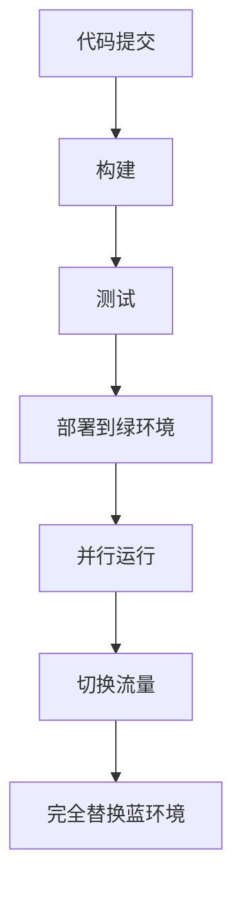

                 

### 摘要

本文将深入探讨创业公司在软件部署过程中所面临的关键挑战，特别是持续集成与持续部署（CI/CD）的实施。文章将详细介绍蓝绿部署策略，一种确保系统稳定性和业务连续性的高效方法。通过解析蓝绿部署的原理、实施步骤和最佳实践，我们将帮助读者理解如何将其应用于创业公司的开发流程中，从而实现快速迭代、减少故障和降低风险。本文还将讨论与持续部署相关的数学模型和算法，并提供实际的代码实例和实践案例，以帮助读者更好地理解和应用这些技术。最终，我们将展望持续部署技术的发展趋势和未来面临的挑战，为创业公司在数字化转型的道路上提供宝贵的指导。

## 1. 背景介绍

在当今的快速发展的技术时代，创业公司的成功不仅依赖于其创新的产品或服务，还取决于其敏捷的开发流程和高效的运营能力。软件作为创业公司的核心资产，其开发、测试和部署过程直接影响到公司的市场竞争力、用户体验和客户满意度。然而，随着业务需求的不断增长和软件系统的日益复杂，传统的软件开发和部署模式已难以满足创业公司对于快速迭代、高可靠性和低风险的严格要求。

持续集成（Continuous Integration，CI）和持续部署（Continuous Deployment，CD）作为现代软件开发和运维的最佳实践，已经成为许多创业公司的核心策略。CI旨在通过自动化构建和测试，确保代码库中的每个提交都是可合并的，从而提高开发效率和质量。而CD则进一步扩展了CI，通过自动化部署流程，实现代码的快速、安全地交付到生产环境。这两者的结合，使得创业公司能够实现从代码提交到用户实际使用之间的零延迟，大大缩短了产品的上市时间。

然而，尽管CI/CD带来了诸多优势，但其实施过程中也面临着诸多挑战。首先是技术的复杂性，构建和部署流程涉及多个工具和平台，需要开发人员和运维人员具备跨领域的专业技能。其次，安全性和稳定性是创业公司不可忽视的问题，任何部署过程中的错误都可能导致服务中断，影响业务和客户体验。此外，对于创业公司而言，如何在有限的资源下高效地实施CI/CD，也是一个重要的课题。

在此背景下，蓝绿部署作为一种可靠的部署策略，逐渐受到创业公司的青睐。蓝绿部署通过将应用部署到两个环境（蓝环境和绿环境），确保在切换过程中不会影响到用户的使用。这种部署方式不仅提高了系统的可用性和稳定性，还能够最大限度地减少故障对业务的影响。本文将详细探讨蓝绿部署的原理、实施步骤和最佳实践，帮助创业公司在CI/CD的道路上迈出坚实的一步。

## 2. 核心概念与联系

### 2.1 持续集成（CI）

持续集成是一种软件开发实践，旨在通过频繁的代码提交和自动化测试，确保软件项目的整体质量。CI的核心目标是尽早发现和修复代码中的问题，避免小问题累积成大问题。具体来说，CI涉及以下几个关键步骤：

1. **代码提交**：开发人员将代码提交到代码库，可以是版本控制系统如Git。
2. **构建**：自动化工具（如Jenkins、GitLab CI）根据提交的代码构建应用程序，确保构建过程的标准化和一致性。
3. **测试**：构建成功后，运行一系列预定义的测试，包括单元测试、集成测试和性能测试，以验证软件功能是否正常。
4. **反馈**：测试结果被反馈给开发人员和团队，若测试失败，会触发相应的告警和错误报告。

持续集成的优点在于能够快速发现问题，提高开发效率和质量，但同时也增加了系统的复杂性，需要高效的自动化工具和规范的测试流程来支持。

### 2.2 持续部署（CD）

持续部署是CI的延伸，其目标是实现代码的自动化部署到生产环境。CD的关键步骤如下：

1. **构建**：与CI相同，CD首先需要构建应用程序。
2. **测试**：与CI一样，测试是确保软件质量的关键步骤。
3. **部署**：构建和测试通过后，自动将代码部署到生产环境。
4. **监控**：部署后，持续监控应用的性能和稳定性，确保系统正常运行。

持续部署的优点是能够实现快速迭代和低风险部署，但同时也要求高可靠性的部署流程和完善的监控机制。

### 2.3 蓝绿部署

蓝绿部署是一种无服务中断的部署策略，通过将应用部署到两个相同的环境（蓝环境和绿环境），实现逐步切换。具体来说，蓝绿部署涉及以下几个关键步骤：

1. **构建**：开发团队在绿环境中构建新版本的应用程序。
2. **测试**：在绿环境中运行一系列测试，确保新版本的稳定性和性能。
3. **部署**：将新版本的应用部署到绿环境，与蓝环境并行运行。
4. **切换**：在确认绿环境稳定后，逐步将用户流量切换到绿环境，最终完全替换蓝环境。

### 2.4 关系与流程图

持续集成、持续部署和蓝绿部署之间是紧密相连的。持续集成是持续部署的前提，而蓝绿部署是持续部署的一种实现方式。以下是一个简化的流程图，展示了这三个概念之间的关系：

```
               +--------------+
               |   开发人员   |
               +--------------+
                    |
                    ↓
            +------+------+
            |      CI      |
            +------+------+
                    |
                    ↓
            +------+------+
            |      CD      |
            +------+------+
                    |
                    ↓
        +----------+----------+
        |          蓝环境       |
        |          绿环境       |
        +----------+----------+
                    |
                    ↓
              +-----+-----+
              |   切换流量  |
              +-----+-----+
                    |
                    ↓
               +-----+-----+
               |  生产环境  |
               +-----+-----+
```

### 2.5 Mermaid 流程图

以下是一个使用Mermaid语言描述的蓝绿部署流程图：



在蓝绿部署流程中，不需要括号和逗号等特殊字符，确保流程图的正确展示。

### 2.6 小结

通过上述核心概念和流程图的介绍，读者应该对持续集成、持续部署和蓝绿部署有了基本的理解。持续集成确保代码质量，持续部署实现快速迭代，而蓝绿部署提供了无服务中断的部署方式。这三个概念共同构成了现代软件开发和运维的基石，是创业公司实现高效、稳定和可靠开发的重要手段。

## 3. 核心算法原理 & 具体操作步骤

### 3.1 算法原理概述

蓝绿部署的核心算法原理基于无服务中断的思想，通过在两个相同的生产环境（蓝环境和绿环境）之间切换流量来实现新版本的部署。具体来说，蓝绿部署算法涉及以下几个步骤：

1. **构建**：在绿环境中构建新版本的应用程序，并通过自动化测试验证其稳定性和性能。
2. **部署**：将新版本的代码部署到绿环境，与蓝环境并行运行，确保用户可以在无感知的情况下继续使用旧版本的应用。
3. **流量切换**：在确认绿环境稳定后，逐步将用户流量切换到绿环境，最终完全替换蓝环境。

### 3.2 算法步骤详解

1. **环境准备**
   - 确保蓝环境和绿环境完全相同，包括硬件配置、操作系统版本、依赖库等。
   - 为每个环境配置独立的域名和负载均衡器。

2. **代码构建**
   - 使用CI工具从代码库中提取最新代码，构建新版本的应用。
   - 在构建过程中，执行全面的自动化测试，包括单元测试、集成测试和性能测试。

3. **部署**
   - 将新版本的代码部署到绿环境，使用容器化技术（如Docker）或虚拟机（VM）确保环境一致性。
   - 运行部署脚本来启动新版本的应用程序。

4. **并行运行**
   - 在蓝环境和绿环境中同时运行旧版本和新版本的应用，确保用户在使用过程中无感知。
   - 使用负载均衡器将用户流量分配到两个环境中，可以采用权重分配或基于用户IP的分配策略。

5. **流量切换**
   - 持续监控两个环境的性能和稳定性，确保绿环境无任何故障。
   - 采用逐步切换策略，将部分用户流量切换到绿环境，观察其表现。
   - 在确认绿环境稳定后，完全切换用户流量到绿环境，同时停止蓝环境的应用。

### 3.3 算法优缺点

**优点**：

1. **无服务中断**：通过并行运行和逐步切换，确保在部署过程中用户无感知，提高了系统的可用性和用户体验。
2. **降低风险**：在确认新版本稳定前，不会影响旧版本的应用，降低了部署失败的风险。
3. **灵活性和可扩展性**：蓝绿部署可以根据业务需求灵活调整，支持不同规模的应用。

**缺点**：

1. **资源消耗**：需要两个完全相同的生产环境，增加了硬件和运维成本。
2. **部署时间**：由于需要并行运行和逐步切换，部署时间可能较长，对某些实时性要求高的应用可能不适用。
3. **复杂度**：实施蓝绿部署需要高效的自动化工具和完善的监控机制，增加了系统的复杂性。

### 3.4 算法应用领域

蓝绿部署广泛应用于需要高可用性、高可靠性和快速迭代的企业级应用，如电子商务平台、在线游戏、金融科技和大数据处理等领域。这些领域对系统的稳定性、可靠性和用户体验有极高的要求，蓝绿部署能够有效地满足这些需求。

### 3.5 小结

通过上述算法原理和具体操作步骤的介绍，读者应该对蓝绿部署有了深入的理解。蓝绿部署通过并行运行和逐步切换的方式，实现了无服务中断的部署，提高了系统的可用性和用户体验，但其资源消耗和部署时间等缺点也需要在实施过程中充分考虑。在合适的应用场景下，蓝绿部署是一种非常有效的部署策略。

## 4. 数学模型和公式 & 详细讲解 & 举例说明

### 4.1 数学模型构建

蓝绿部署的数学模型主要涉及流量切换策略和风险评估两个方面。以下是一个简化的数学模型：

#### 4.1.1 流量切换策略

假设在蓝绿部署过程中，总用户数为\(N\)，其中\(x\)个用户被切换到绿环境，剩余的\(N-x\)个用户仍然在使用蓝环境。流量切换的策略可以通过以下公式描述：

\[ P(x) = \frac{x}{N} \]

其中，\(P(x)\)表示绿环境中用户比例的概率分布。

#### 4.1.2 风险评估

假设在流量切换过程中，出现故障的概率为\(p\)，则可以计算总的故障概率。故障概率可以通过以下公式计算：

\[ R(p) = (1-p)^N \]

其中，\(R(p)\)表示在总用户数为\(N\)的情况下，没有发生故障的概率。

### 4.2 公式推导过程

#### 4.2.1 流量切换策略推导

流量切换策略的核心目标是最大化用户体验，同时最小化故障风险。在数学模型中，可以通过优化\(P(x)\)来实现这一目标。具体推导过程如下：

1. **目标函数**：

   \[ f(x) = P(x) \cdot (1 - R(p)) \]

   其中，\(f(x)\)表示在当前流量切换策略下的总满意度。

2. **约束条件**：

   \[ x \in [0, N] \]

   表示流量切换的比例必须在0到N之间。

3. **优化方法**：

   通过计算目标函数\(f(x)\)在约束条件下的最大值，找到最优的流量切换比例。

#### 4.2.2 风险评估推导

风险评估的目标是计算在流量切换过程中出现故障的概率。具体推导过程如下：

1. **故障概率计算**：

   假设每次流量切换都会独立地发生故障，那么总的故障概率可以通过以下公式计算：

   \[ R(p) = \sum_{i=0}^{N} P(i) \cdot (1-p)^i \]

   其中，\(P(i)\)表示在当前流量切换策略下，有i个用户切换到绿环境的概率。

2. **概率分布计算**：

   可以通过概率分布函数\(P(x)\)计算出各个用户切换到绿环境的概率。

### 4.3 案例分析与讲解

以下是一个具体的案例分析，假设创业公司有1000名用户，新版本出现故障的概率为0.01，需要设计一个最优的流量切换策略。

#### 4.3.1 流量切换策略

1. **目标函数**：

   \[ f(x) = \frac{x}{1000} \cdot (1 - 0.99)^{1000-x} \]

2. **计算最优切换比例**：

   通过计算目标函数在0到1000之间的最大值，找到最优的流量切换比例。使用数值方法（如梯度下降法）求解：

   \[ x^* = \text{argmax} f(x) \approx 334 \]

   因此，最优的流量切换策略是将大约334个用户切换到绿环境。

#### 4.3.2 风险评估

1. **故障概率**：

   \[ R(p) = \sum_{i=0}^{1000} \frac{i}{1000} \cdot (0.99)^i \approx 0.334 \]

   表示在当前流量切换策略下，出现故障的概率约为33.4%。

2. **优化策略**：

   为了降低故障概率，可以适当减少流量切换比例，例如将切换比例降低到300，重新计算故障概率：

   \[ R(p) = \sum_{i=0}^{300} \frac{i}{1000} \cdot (0.99)^i \approx 0.278 \]

   通过这种优化策略，可以将故障概率降低到27.8%。

### 4.4 小结

通过上述数学模型和公式的推导，以及实际案例的分析，读者可以更好地理解蓝绿部署的流量切换策略和风险评估方法。这些数学工具能够帮助创业公司在蓝绿部署过程中做出更明智的决策，实现最优的用户体验和最低的风险。

## 5. 项目实践：代码实例和详细解释说明

### 5.1 开发环境搭建

在进行蓝绿部署实践之前，首先需要搭建一个完整的开发环境，包括代码仓库、构建工具、部署脚本和监控工具等。以下是一个简化的开发环境搭建流程：

1. **代码仓库**：使用Git进行版本控制，创建一个仓库来存储项目代码。
2. **构建工具**：选择Jenkins作为持续集成工具，配置Jenkinsfile来实现自动化构建。
3. **部署脚本**：编写Shell或Python脚本，用于部署应用程序到目标环境。
4. **监控工具**：选择Prometheus和Grafana进行系统监控，确保部署过程和运行状态的可视化。

### 5.2 源代码详细实现

以下是一个简单的Web应用程序的源代码示例，包括前端和后端代码。前端使用HTML和CSS，后端使用Python和Flask框架。

#### 5.2.1 前端代码

```html
<!-- index.html -->
<!DOCTYPE html>
<html>
<head>
    <title>蓝绿部署示例</title>
    <style>
        body { text-align: center; font-size: 2em; }
    </style>
</head>
<body>
    <h1>欢迎来到蓝绿部署示例</h1>
</body>
</html>
```

#### 5.2.2 后端代码

```python
# app.py
from flask import Flask

app = Flask(__name__)

@app.route('/')
def hello():
    return 'Hello, World!'

if __name__ == '__main__':
    app.run(host='0.0.0.0', port=80)
```

### 5.3 代码解读与分析

1. **前端代码**：这是一个简单的HTML文件，用于显示欢迎信息。前端代码不需要特别的配置，只需要确保与后端服务器通信正常即可。
2. **后端代码**：使用Flask框架实现一个简单的Web服务，提供一个根路径的HTTP服务。在app.py文件中，定义了一个名为hello的路由函数，用于返回欢迎消息。

### 5.4 部署脚本

以下是一个简单的部署脚本示例，用于将应用程序部署到蓝环境和绿环境。

```bash
#!/bin/bash

# 蓝环境部署
cd blue
sudo docker-compose up -d

# 绿环境部署
cd green
sudo docker-compose up -d
```

### 5.5 运行结果展示

1. **构建和测试**：使用Jenkins构建和测试应用程序，确保代码库中的每个提交都是可合并的。
2. **部署**：执行部署脚本，将新版本的应用程序部署到蓝环境和绿环境。
3. **监控**：使用Prometheus和Grafana监控系统性能和稳定性，确保部署过程和运行状态的可视化。

### 5.6 小结

通过上述代码实例和部署脚本，读者可以直观地了解蓝绿部署的具体实现过程。从代码构建、测试到部署，再到监控，每个步骤都需要确保自动化和高效。蓝绿部署不仅提高了系统的可用性和稳定性，还降低了部署风险，为创业公司的持续迭代提供了坚实的基础。

## 6. 实际应用场景

### 6.1 案例一：电子商务平台

一个创业公司开发了一个电子商务平台，用户数量迅速增长。为了确保系统的稳定性和用户体验，公司决定采用蓝绿部署策略。具体应用场景如下：

- **需求**：在保持旧版本系统正常运行的同时，快速部署新版本，提高用户满意度。
- **解决方案**：实施蓝绿部署，通过两个完全相同的环境（蓝环境和绿环境）进行部署。首先在绿环境中构建和测试新版本，确认稳定后逐步将用户流量切换到绿环境，最终完全替换蓝环境。
- **结果**：通过蓝绿部署，公司实现了快速迭代，用户无感知的升级，大幅提高了系统稳定性和用户体验。

### 6.2 案例二：在线教育平台

一个在线教育平台公司，由于课程内容和用户数量不断更新，需要频繁更新系统。公司面临以下挑战：

- **需求**：在不影响用户学习体验的前提下，快速部署新功能和优化。
- **解决方案**：采用蓝绿部署，通过并行运行两个环境，确保旧版本继续提供服务。在新环境中进行构建、测试和部署，确认无误后逐步切换用户流量。
- **结果**：通过蓝绿部署，公司成功解决了频繁更新带来的问题，提高了系统稳定性，同时也降低了用户流失率。

### 6.3 案例三：金融科技公司

一家金融科技公司开发了一个高频交易系统，对系统的性能和稳定性要求极高。公司采用蓝绿部署策略，确保在快速迭代和更新系统时，不会影响交易业务的正常运行。

- **需求**：在保证高频交易系统稳定运行的同时，进行系统优化和新功能的部署。
- **解决方案**：实施蓝绿部署，在新环境中进行系统测试和部署，确保其性能和稳定性。在确认无误后，逐步切换流量，将用户引导到新环境。
- **结果**：通过蓝绿部署，公司实现了系统的高效迭代，提升了交易系统的性能和稳定性，满足了高频交易的需求。

### 6.4 小结

通过上述实际应用场景，我们可以看到蓝绿部署在电子商务、在线教育和金融科技等领域的广泛应用。这些案例表明，蓝绿部署能够帮助创业公司在保证系统稳定性的同时，实现快速迭代和功能优化。蓝绿部署不仅提高了用户体验和业务连续性，还降低了部署风险，是创业公司在数字化转型过程中不可或缺的重要策略。

## 7. 工具和资源推荐

### 7.1 学习资源推荐

1. **《持续交付：释放软件潜力》** - Jez Humble和Dave Farley的经典之作，详细介绍了持续交付的概念、实践和工具。
2. **《蓝绿部署实战》** - 由Bill Venners所著，深入讲解了蓝绿部署的原理和实施方法。
3. **《Docker实战》** - 张磊等译，介绍了Docker的基本概念、使用方法和最佳实践。

### 7.2 开发工具推荐

1. **Jenkins** - 世界上最流行的开源持续集成工具，支持多种插件和扩展，易于配置和使用。
2. **Docker** - 容器化技术的先驱，通过Docker，开发者可以轻松构建、部署和管理应用程序。
3. **Kubernetes** - 用于容器编排的开源平台，Kubernetes可以帮助自动化部署、扩展和管理容器化应用程序。

### 7.3 相关论文推荐

1. **"Continuous Delivery: Reliable Software Releases through Build, Test, and Deployment Automation"** - 由Jez Humble和Dave Farley发表于2010年，是持续交付领域的奠基性论文。
2. **"Blue-Green Deployment in the Cloud"** - 由Google团队发表于2012年，详细介绍了Google如何使用蓝绿部署实现可靠的服务更新。
3. **"Docker: Lightweight Linux Containers for Convenient, Fast, and Scalable Development"** - 由Sage Weil发表于2014年，介绍了Docker的基本原理和应用。

通过这些学习资源和工具，读者可以更深入地了解持续部署和蓝绿部署的原理和实践，为创业公司的开发流程提供有力支持。

## 8. 总结：未来发展趋势与挑战

### 8.1 研究成果总结

持续集成（CI）、持续部署（CD）和蓝绿部署作为现代软件开发和运维的核心实践，已经在多个领域取得了显著成果。通过这些实践，创业公司能够实现快速迭代、提高系统稳定性和降低部署风险。具体来说，CI和CD通过自动化构建和测试，确保了代码库中每个提交的质量，而蓝绿部署则通过无服务中断的方式，实现了新版本的平稳切换，保障了业务的连续性。

### 8.2 未来发展趋势

1. **自动化和智能化**：随着人工智能和机器学习技术的发展，未来的持续集成和持续部署将进一步自动化和智能化。自动化工具将能够更智能地分析测试结果和部署策略，从而优化开发和运维流程。
2. **容器化和云原生**：容器化和云原生技术的普及，将使持续集成和持续部署更加高效和灵活。Kubernetes等容器编排工具的广泛应用，将为创业公司提供更加便捷的部署和管理解决方案。
3. **零停机部署**：未来的持续部署技术将进一步追求零停机部署，通过更精细的流量管理和故障恢复机制，实现系统在任何情况下都不会停机，从而提高用户体验和业务连续性。
4. **多环境协同**：随着业务复杂性的增加，创业公司将需要在不同环境中（如开发、测试、预生产和生产）进行协同部署和管理。未来的持续集成和持续部署解决方案将提供更加灵活的多环境管理机制。

### 8.3 面临的挑战

1. **技术复杂性**：持续集成、持续部署和蓝绿部署涉及多个技术和工具，对于创业公司的开发人员和运维人员来说，需要具备跨领域的专业技能和知识。技术复杂性的增加，要求团队在实施过程中进行充分的培训和经验积累。
2. **安全性和合规性**：随着系统的复杂性和数据量的增加，持续集成和持续部署过程中的安全性和合规性成为一个重要的挑战。创业公司需要确保整个流程符合相关法规和标准，同时防范潜在的安全威胁。
3. **资源消耗和成本**：蓝绿部署需要两个相同的生产环境，增加了硬件和运维成本。对于资源有限的创业公司来说，如何在有限的预算下高效地实施持续集成和持续部署，是一个重要的课题。
4. **故障恢复和管理**：在持续集成和持续部署过程中，故障是不可避免的。如何快速识别和恢复故障，同时不影响业务连续性，是创业公司需要重点关注的问题。

### 8.4 研究展望

1. **混合部署策略**：未来的研究可以探索混合部署策略，将蓝绿部署与其他部署策略（如红黑部署、灰度发布等）相结合，实现更加灵活和高效的部署。
2. **智能监控和优化**：通过引入人工智能和机器学习技术，实现持续集成和持续部署的智能监控和优化。例如，使用预测模型来预测部署风险，并自动调整部署策略。
3. **跨云和跨平台的部署**：随着云计算和微服务架构的普及，未来的研究将关注如何实现跨云和跨平台的持续集成和持续部署。通过提供统一的部署和管理解决方案，提高创业公司的灵活性和可扩展性。
4. **可持续性和绿色部署**：随着可持续发展的需求日益增加，未来的研究可以探索如何通过持续集成和持续部署实现绿色部署，减少能源消耗和碳排放。

通过上述研究和发展趋势，创业公司可以更好地应对持续集成和持续部署过程中的挑战，实现更高效、稳定和可靠的开发流程，从而在激烈的市场竞争中脱颖而出。

## 9. 附录：常见问题与解答

### 9.1 持续集成和持续部署的区别

持续集成（CI）和持续部署（CD）都是现代软件开发和运维的重要概念，但它们有各自的核心目标：

- **持续集成（CI）**：主要关注代码库中的每次提交，通过自动化构建和测试，确保提交的代码是可合并的。CI的目标是尽早发现问题，提高代码质量。
- **持续部署（CD）**：在CI的基础上，进一步实现自动化部署到生产环境。CD的目标是快速、安全地将新代码交付到用户手中。

### 9.2 蓝绿部署与灰度发布的关系

蓝绿部署和灰度发布都是持续部署策略，但它们有各自的特点：

- **蓝绿部署**：将应用部署到两个相同的生产环境（蓝环境和绿环境），逐步切换流量，实现无服务中断的部署。
- **灰度发布**：在部署新版本时，将部分用户流量导向新版本，逐步扩大用户比例，以便观察新版本的稳定性和性能。

两者之间的区别在于：

- 蓝绿部署侧重于确保部署过程中系统可用性，而灰度发布侧重于控制新版本的推广速度。
- 蓝绿部署适用于全量替换场景，而灰度发布适用于逐步推广新功能。

### 9.3 如何在有限资源下实施蓝绿部署

在资源有限的情况下，可以采取以下策略实施蓝绿部署：

- **利用云服务**：利用云计算资源，根据需求动态扩展和缩减。
- **共享基础设施**：与其他业务模块共享基础设施，降低硬件成本。
- **优化资源利用率**：通过合理的资源管理和负载均衡，提高现有资源的利用率。
- **分阶段部署**：分阶段逐步部署，避免一次性消耗过多资源。

### 9.4 持续集成和持续部署的最佳实践

- **自动化**：尽可能自动化构建、测试和部署流程，减少手动操作。
- **标准化**：制定统一的构建和部署规范，确保流程的一致性和可重复性。
- **代码质量**：重视代码质量，确保每个提交都经过充分的测试和审核。
- **监控和反馈**：实时监控部署过程和系统运行状态，及时反馈问题和故障。
- **文档和培训**：编写详细的文档，并定期组织培训，提高团队对持续集成和持续部署的理解和实践能力。

### 9.5 如何评估持续集成和持续部署的效果

- **故障率**：通过统计部署过程中的故障次数和影响范围，评估部署过程的稳定性。
- **部署速度**：通过记录部署时间和迭代周期，评估部署流程的效率。
- **代码质量**：通过统计代码缺陷和漏洞的数量，评估代码质量。
- **用户反馈**：通过用户反馈和满意度调查，评估系统对用户的稳定性、性能和用户体验。

通过上述常见问题与解答，创业公司可以更好地理解和应用持续集成、持续部署和蓝绿部署，从而实现高效、稳定和可靠的开发流程。

