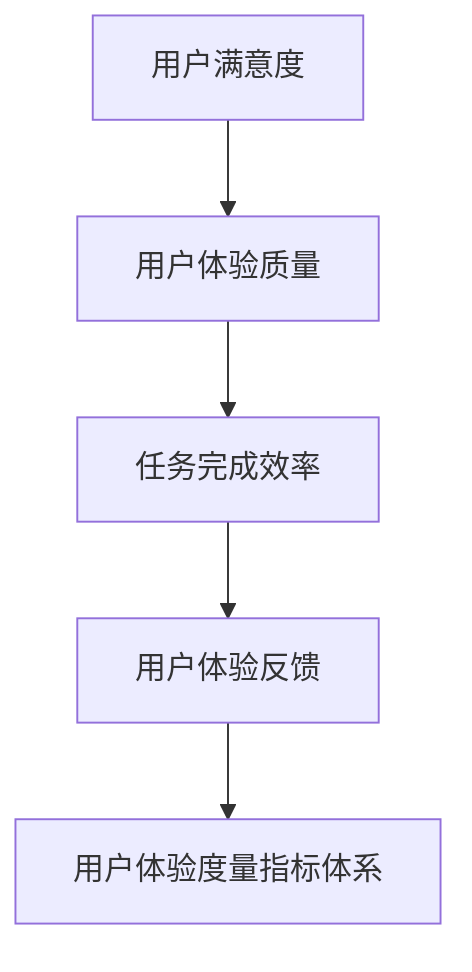

                 

 关键词：用户体验，度量指标，创业公司，优化，算法原理，数学模型，项目实践

> 摘要：本文旨在探讨创业公司如何通过优化用户体验度量指标，提升产品竞争力。文章将详细介绍用户体验度量指标的定义、核心概念、算法原理、数学模型以及实际应用，帮助创业公司更好地了解和改进用户体验。

## 1. 背景介绍

在当今激烈竞争的市场环境中，用户体验（User Experience, UX）已成为企业成功的关键因素。创业公司尤其需要关注用户体验的优化，因为良好的用户体验能够提高用户满意度、忠诚度和口碑，从而为企业带来持续的业务增长。然而，如何准确地度量用户体验并制定有效的优化策略，对许多创业公司来说仍然是一个难题。

用户体验度量指标是评估用户在使用产品过程中的体验质量的一系列量化标准。这些指标涵盖了用户的心理感受、行为表现和反馈等多个维度。创业公司通过对这些指标进行优化，可以更精准地把握用户需求，提高产品的市场竞争力。

本文将围绕用户体验度量指标优化这一主题，深入探讨以下内容：

1. 核心概念与联系
2. 核心算法原理与具体操作步骤
3. 数学模型与公式
4. 项目实践：代码实例与详细解释
5. 实际应用场景与未来展望
6. 工具和资源推荐
7. 总结与展望

通过本文的阅读，读者将能够全面了解用户体验度量指标的优化方法，为创业公司提供切实可行的实践指导。

## 2. 核心概念与联系

在深入探讨用户体验度量指标的优化之前，我们首先需要了解一些核心概念和它们之间的联系。

### 用户满意度（User Satisfaction） ###
用户满意度是衡量用户体验质量的最基本指标。它反映了用户对产品或服务的总体满意度，可以通过调查问卷、用户访谈等方式进行量化。用户满意度高意味着用户在使用产品时感受到愉悦和满足。

### 用户体验质量（User Experience Quality） ###
用户体验质量是一个多维度的概念，涵盖了用户在使用产品过程中感受到的便利性、易用性、情感体验等多个方面。它不仅取决于产品功能本身，还受到用户需求、使用环境等因素的影响。

### 任务完成效率（Task Completion Efficiency） ###
任务完成效率是指用户在使用产品时完成任务的速度和质量。这一指标直接关系到用户体验的流畅性和高效性，是优化用户体验的重要方向。

### 用户体验反馈（User Experience Feedback） ###
用户体验反馈是用户对产品使用过程中体验的直接表达，包括正面反馈和负面反馈。这些反馈可以为产品改进提供宝贵的参考，帮助企业不断优化用户体验。

### 用户体验度量指标体系（User Experience Measurement System） ###
用户体验度量指标体系是一套综合性的量化标准，用于评估用户体验的质量和效果。它通常包括用户满意度、任务完成效率、用户体验反馈等多个维度，并通过科学的方法进行量化。

以上核心概念相互联系，共同构成了用户体验度量指标体系。为了更好地理解这些概念，我们可以通过以下Mermaid流程图来展示它们之间的联系：



通过这个流程图，我们可以清晰地看到各个概念之间的关联，从而为后续的优化工作奠定基础。

### 用户体验度量指标的定义和分类

用户体验度量指标是用于量化评估用户体验质量的一系列标准。根据其作用和侧重点，我们可以将用户体验度量指标分为以下几类：

#### 1. 用户满意度指标

用户满意度指标主要用于衡量用户对产品或服务的整体满意度。常见的用户满意度指标包括：

- **Net Promoter Score（NPS）**：通过询问用户“您认为有多少概率推荐本产品给他人？”来衡量用户对产品的忠诚度。
- **Customer Satisfaction Score（CSAT）**：通过简单的满意度调查问卷，了解用户对产品或服务的满意度。
- **Customer Effort Score（CES）**：衡量用户在完成任务时所感受到的困难程度。

#### 2. 用户体验质量指标

用户体验质量指标主要关注用户在使用产品过程中的感受和体验。常见的用户体验质量指标包括：

- **任务完成时间（Task Completion Time）**：用户完成任务所需的时间。
- **错误率（Error Rate）**：用户在使用产品过程中出现的错误次数。
- **学习曲线（Learning Curve）**：用户掌握产品功能所需的时间。
- **易用性（Usability）**：产品在易用性方面的表现，如界面设计、交互流程等。

#### 3. 任务完成效率指标

任务完成效率指标主要用于衡量用户在使用产品时完成任务的速度和质量。常见的任务完成效率指标包括：

- **操作响应时间（Response Time）**：系统对用户操作的反应时间。
- **任务完成率（Task Completion Rate）**：用户完成任务的成功率。

#### 4. 用户体验反馈指标

用户体验反馈指标主要用于收集用户对产品使用过程的反馈，包括正面反馈和负面反馈。常见的用户体验反馈指标包括：

- **用户评价（User Ratings）**：用户对产品或服务的评价。
- **用户评论（User Comments）**：用户对产品或服务的具体评论。
- **用户建议（User Suggestions）**：用户对产品改进的建议。

### 用户满意度与用户体验质量的联系

用户满意度与用户体验质量之间存在密切的关系。用户满意度是对用户体验质量的综合评价，而用户体验质量则是影响用户满意度的关键因素。

首先，用户满意度直接反映了用户对产品或服务的总体感受。当用户在使用产品过程中感受到良好的体验时，他们更有可能对产品表示满意。

其次，用户体验质量是影响用户满意度的核心因素。良好的用户体验质量能够提高用户的参与度和忠诚度，从而提升用户满意度。

例如，一个任务完成时间较短、错误率较低、学习曲线较平缓的产品，其用户体验质量较高，用户满意度也相应较高。相反，如果产品在任务完成时间、错误率、学习曲线等方面表现较差，用户满意度将受到负面影响。

### 用户体验度量指标体系的作用

用户体验度量指标体系在企业中发挥着重要的作用。它不仅帮助企业管理者了解用户体验的质量和效果，还能够为产品改进和优化提供科学依据。

首先，用户体验度量指标体系能够帮助企业识别用户体验中的问题和瓶颈。通过量化分析，企业可以发现哪些方面存在问题，从而有针对性地进行改进。

其次，用户体验度量指标体系有助于企业制定和调整产品策略。通过持续跟踪用户体验度量指标，企业可以及时了解用户需求和偏好，调整产品功能和设计，提高用户体验。

最后，用户体验度量指标体系能够为企业提供数据支持，帮助其进行决策。通过数据驱动的方法，企业可以更加客观地评估用户体验的效果，从而做出更加明智的决策。

总之，用户体验度量指标体系是企业提升用户体验、增强竞争力的重要工具。通过深入了解和运用这些指标，企业可以更好地满足用户需求，提升用户满意度，从而实现业务增长。

### 用户体验度量指标的定义和分类（续）

在上文中，我们已经介绍了用户体验度量指标的基本分类。接下来，我们将进一步探讨这些指标的定义和具体内容。

#### 1. 用户满意度指标

用户满意度指标主要用于衡量用户对产品或服务的整体满意度。以下是一些常见的用户满意度指标及其定义：

- **Net Promoter Score（NPS）**：
  - 定义：通过询问用户“您认为有多少概率推荐本产品给他人？”来衡量用户对产品的忠诚度。
  - 计算方法：将用户分为三个等级（推荐者、中立者、批评者），分别计算推荐者和批评者的比例，NPS = （推荐者比例 - 批评者比例）× 100%。

- **Customer Satisfaction Score（CSAT）**：
  - 定义：通过简单的满意度调查问卷，了解用户对产品或服务的满意度。
  - 计算方法：用户回答“非常满意”、“满意”、“一般”、“不满意”或“非常不满意”，将回答“非常满意”和“满意”的用户比例作为CSAT。

- **Customer Effort Score（CES）**：
  - 定义：衡量用户在完成任务时所感受到的困难程度。
  - 计算方法：用户回答“非常困难”、“困难”、“一般”、“容易”或“非常容易”，将回答“非常困难”和“困难”的用户比例作为CES。

#### 2. 用户体验质量指标

用户体验质量指标主要关注用户在使用产品过程中的感受和体验。以下是一些常见的用户体验质量指标及其定义：

- **任务完成时间（Task Completion Time）**：
  - 定义：用户完成任务所需的时间。
  - 计算方法：统计用户完成特定任务的平均时间。

- **错误率（Error Rate）**：
  - 定义：用户在使用产品过程中出现的错误次数。
  - 计算方法：统计用户在特定任务中犯错的次数占总尝试次数的比例。

- **学习曲线（Learning Curve）**：
  - 定义：用户掌握产品功能所需的时间。
  - 计算方法：统计用户在不同阶段完成任务所需的时间，通过计算时间的变化趋势来评估学习曲线的斜率。

- **易用性（Usability）**：
  - 定义：产品在易用性方面的表现，如界面设计、交互流程等。
  - 计算方法：通过用户任务完成时间、错误率等指标综合评估产品的易用性。

#### 3. 任务完成效率指标

任务完成效率指标主要用于衡量用户在使用产品时完成任务的速度和质量。以下是一些常见的任务完成效率指标及其定义：

- **操作响应时间（Response Time）**：
  - 定义：系统对用户操作的反应时间。
  - 计算方法：统计用户操作到系统响应的平均时间。

- **任务完成率（Task Completion Rate）**：
  - 定义：用户完成任务的成功率。
  - 计算方法：统计用户完成任务的总次数与尝试次数的比例。

#### 4. 用户体验反馈指标

用户体验反馈指标主要用于收集用户对产品使用过程的反馈，包括正面反馈和负面反馈。以下是一些常见的用户体验反馈指标及其定义：

- **用户评价（User Ratings）**：
  - 定义：用户对产品或服务的评价。
  - 计算方法：通过评分系统（如1-5星）收集用户评价，计算平均评分。

- **用户评论（User Comments）**：
  - 定义：用户对产品或服务的具体评论。
  - 计算方法：统计用户评论的数量和质量，通过文本分析提取关键信息。

- **用户建议（User Suggestions）**：
  - 定义：用户对产品改进的建议。
  - 计算方法：通过问卷调查、用户反馈渠道等收集用户建议，进行分类和统计分析。

### 总结

用户体验度量指标是评估用户在使用产品过程中体验质量的一系列量化标准。通过分类和定义这些指标，我们可以更加系统地了解用户体验的各个方面，为创业公司提供有效的优化策略。

在下一部分，我们将深入探讨用户体验度量指标优化的核心算法原理，帮助读者更好地理解和应用这些算法。

## 3. 核心算法原理 & 具体操作步骤

### 3.1 算法原理概述

用户体验度量指标优化涉及多种算法，这些算法的核心目标是提升用户体验，使其更贴近用户需求。以下是几种常用的核心算法原理及其概述：

#### 1. 用户行为分析算法

用户行为分析算法基于对用户行为的深入挖掘和分析，找出影响用户体验的关键因素。其主要原理包括：

- **数据收集**：通过日志记录、用户反馈等途径收集用户行为数据。
- **特征提取**：从用户行为数据中提取关键特征，如页面访问次数、操作频率等。
- **模式识别**：利用机器学习算法，对提取的特征进行模式识别，找出影响用户体验的关键因素。

#### 2. 多目标优化算法

多目标优化算法旨在同时优化多个用户体验度量指标，以实现综合提升。其主要原理包括：

- **目标定义**：明确需要优化的用户体验度量指标，如用户满意度、任务完成效率等。
- **目标权重分配**：根据业务需求和优先级，为各目标分配权重。
- **算法实现**：采用多目标优化算法（如Pareto优化、遗传算法等），在满足约束条件的情况下，找到最优解。

#### 3. 智能推荐算法

智能推荐算法通过分析用户行为和历史数据，为用户推荐个性化内容，从而提升用户体验。其主要原理包括：

- **数据挖掘**：从用户行为数据中挖掘潜在的兴趣点和偏好。
- **推荐模型构建**：利用机器学习算法（如协同过滤、基于内容的推荐等），构建推荐模型。
- **推荐结果生成**：根据用户特征和推荐模型，生成个性化推荐结果。

### 3.2 算法步骤详解

#### 3.2.1 用户行为分析算法

1. **数据收集**：
   - 收集用户在使用产品过程中的日志数据，包括页面访问记录、操作记录等。
   - 采用数据采集工具（如Google Analytics、Mixpanel等），确保数据的全面性和准确性。

2. **特征提取**：
   - 根据业务需求，从日志数据中提取关键特征，如用户活跃时间、页面停留时间、操作频率等。
   - 使用数据预处理技术（如数据清洗、数据归一化等），确保特征质量。

3. **模式识别**：
   - 采用机器学习算法（如决策树、随机森林等），对提取的特征进行模式识别。
   - 利用模型评估指标（如准确率、召回率等），评估模型性能。

4. **结果分析**：
   - 分析识别出的关键因素，了解其对用户体验的影响程度。
   - 根据分析结果，制定优化策略。

#### 3.2.2 多目标优化算法

1. **目标定义**：
   - 确定需要优化的用户体验度量指标，如用户满意度、任务完成效率等。
   - 根据业务需求和优先级，为各目标分配权重。

2. **目标权重分配**：
   - 采用专家评分法、历史数据法等，为各目标分配权重。
   - 确保目标权重分配的合理性和公平性。

3. **算法实现**：
   - 采用多目标优化算法（如Pareto优化、遗传算法等），在满足约束条件的情况下，找到最优解。
   - 调整算法参数，优化算法性能。

4. **结果分析**：
   - 分析优化结果，了解各目标之间的平衡关系。
   - 根据优化结果，调整产品设计和功能。

#### 3.2.3 智能推荐算法

1. **数据挖掘**：
   - 从用户行为数据中挖掘潜在的兴趣点和偏好。
   - 采用数据挖掘技术（如关联规则挖掘、聚类分析等），识别用户兴趣。

2. **推荐模型构建**：
   - 采用机器学习算法（如协同过滤、基于内容的推荐等），构建推荐模型。
   - 调整模型参数，优化推荐效果。

3. **推荐结果生成**：
   - 根据用户特征和推荐模型，生成个性化推荐结果。
   - 采用排序算法（如PageRank、基于用户的协同过滤等），优化推荐结果排序。

4. **结果分析**：
   - 分析推荐结果的准确性和用户满意度。
   - 根据分析结果，调整推荐策略。

### 3.3 算法优缺点

#### 用户行为分析算法

**优点**：

- **全面性**：能够全面了解用户行为，挖掘潜在需求。
- **实时性**：能够实时监测用户行为，及时调整优化策略。

**缺点**：

- **数据质量要求高**：需要高质量的用户行为数据，否则分析结果可能不准确。
- **计算复杂度高**：特征提取和模式识别过程较为复杂，计算资源需求大。

#### 多目标优化算法

**优点**：

- **综合优化**：能够同时优化多个用户体验度量指标，实现综合提升。
- **灵活性**：适用于不同类型的目标和约束条件。

**缺点**：

- **计算复杂度高**：多目标优化算法计算复杂度较高，可能影响优化速度。
- **参数调整难度大**：参数调整较为复杂，需要专业知识和经验。

#### 智能推荐算法

**优点**：

- **个性化推荐**：能够根据用户兴趣和偏好，提供个性化推荐。
- **提高用户粘性**：通过推荐机制，提高用户对产品的使用频率。

**缺点**：

- **数据依赖性高**：需要大量用户行为数据，否则推荐效果可能不理想。
- **算法复杂度高**：需要复杂的算法模型，实现和维护成本较高。

### 3.4 算法应用领域

#### 用户行为分析算法

- **电子商务**：分析用户购物行为，优化产品推荐和营销策略。
- **社交媒体**：分析用户互动行为，提高用户参与度和留存率。
- **在线教育**：分析学生学习行为，优化教学内容和教学方法。

#### 多目标优化算法

- **产品开发**：优化产品设计，提高用户体验质量。
- **市场营销**：优化营销策略，提高用户满意度。
- **资源配置**：优化资源分配，提高任务完成效率。

#### 智能推荐算法

- **电商平台**：为用户提供个性化商品推荐。
- **音乐和视频平台**：为用户提供个性化内容推荐。
- **在线新闻门户**：为用户提供个性化新闻推荐。

### 3.5 结论

用户体验度量指标优化算法在创业公司中具有重要应用价值。通过用户行为分析、多目标优化和智能推荐等算法，创业公司可以全面了解用户需求，提高用户体验质量，从而增强市场竞争力。然而，算法的应用效果也受到数据质量、计算资源等多方面因素的影响，需要结合具体业务场景进行优化和调整。

在下一部分，我们将介绍用户体验度量指标优化的数学模型和公式，帮助读者从理论层面深入理解优化方法。

## 4. 数学模型和公式 & 详细讲解 & 举例说明

在用户体验度量指标优化过程中，数学模型和公式起到了关键作用。它们不仅帮助我们量化用户体验，还能通过严谨的推导和计算，提供优化策略的科学依据。在本节中，我们将详细介绍用户体验度量指标优化中的数学模型和公式，并通过具体例子进行说明。

### 4.1 数学模型构建

构建用户体验度量指标优化的数学模型，首先要明确目标函数和约束条件。目标函数通常包括用户满意度、任务完成效率等指标，约束条件则涉及系统的资源限制、时间要求等。

#### 1. 用户满意度模型

用户满意度（Satisfaction）通常通过以下公式进行量化：

\[ S = \frac{\sum_{i=1}^{n} w_i \cdot s_i}{n} \]

其中，\( s_i \) 表示第 \( i \) 个用户体验指标，\( w_i \) 表示第 \( i \) 个指标的权重，\( n \) 表示总指标数。

例如，假设有3个用户体验指标：任务完成时间（\( s_1 \)），错误率（\( s_2 \)），学习曲线（\( s_3 \)），权重分别为0.4，0.3，0.3。则用户满意度模型可以表示为：

\[ S = 0.4 \cdot s_1 + 0.3 \cdot s_2 + 0.3 \cdot s_3 \]

#### 2. 任务完成效率模型

任务完成效率（Efficiency）可以通过以下公式进行量化：

\[ E = \frac{C}{T} \]

其中，\( C \) 表示任务完成次数，\( T \) 表示总时间。这个公式表示在总时间内完成的任务次数。

例如，如果一个用户在30分钟内完成了5个任务，则任务完成效率为：

\[ E = \frac{5}{30} = 0.167 \]

#### 3. 综合评估模型

为了综合考虑用户满意度和任务完成效率，可以构建一个综合评估模型：

\[ A = \alpha \cdot S + (1 - \alpha) \cdot E \]

其中，\( \alpha \) 是权重系数，用于平衡用户满意度和任务完成效率。例如，如果 \( \alpha = 0.6 \)，则综合评估模型可以表示为：

\[ A = 0.6 \cdot S + 0.4 \cdot E \]

### 4.2 公式推导过程

为了更好地理解这些公式，下面我们将介绍一些推导过程。

#### 1. 用户满意度公式推导

用户满意度公式可以分解为以下几个步骤：

- **定义用户体验指标**：设定第 \( i \) 个用户体验指标为 \( s_i \)，如任务完成时间、错误率等。
- **设定权重**：为每个指标设定权重 \( w_i \)，反映其在总评估中的重要性。
- **计算总满意度**：将各指标的权重与指标值相乘，并求和。
- **归一化处理**：除以总指标数 \( n \)，以得到平均值。

因此，用户满意度公式可以推导为：

\[ S = \frac{\sum_{i=1}^{n} w_i \cdot s_i}{n} \]

#### 2. 任务完成效率公式推导

任务完成效率公式也可以分解为以下几个步骤：

- **定义任务完成次数**：设定任务完成次数为 \( C \)。
- **定义总时间**：设定总时间为 \( T \)。
- **计算效率**：用任务完成次数除以总时间。

因此，任务完成效率公式可以推导为：

\[ E = \frac{C}{T} \]

#### 3. 综合评估公式推导

综合评估模型是用户满意度模型和任务完成效率模型的结合。为了推导综合评估模型，我们可以先设定用户满意度和任务完成效率的权重分别为 \( \alpha \) 和 \( (1 - \alpha) \)：

- **用户满意度**：\( S \)
- **任务完成效率**：\( E \)

然后，将两个模型结合，得到综合评估模型：

\[ A = \alpha \cdot S + (1 - \alpha) \cdot E \]

### 4.3 案例分析与讲解

为了更好地理解上述公式，下面我们将通过一个实际案例进行详细讲解。

#### 案例背景

某创业公司开发了一款在线办公软件，用户量逐渐增加。为了优化用户体验，公司决定通过用户满意度、任务完成效率等指标进行评估。

#### 案例数据

- 用户满意度指标：任务完成时间（\( s_1 \)），错误率（\( s_2 \)），学习曲线（\( s_3 \)）
  - \( s_1 = 5 \) 分钟
  - \( s_2 = 0.1 \)
  - \( s_3 = 10 \) 分钟
- 权重：任务完成时间（\( w_1 \)），错误率（\( w_2 \)），学习曲线（\( w_3 \)）
  - \( w_1 = 0.4 \)
  - \( w_2 = 0.3 \)
  - \( w_3 = 0.3 \)
- 任务完成效率：任务完成次数（\( C \)），总时间（\( T \)）
  - \( C = 100 \)
  - \( T = 300 \) 分钟

#### 案例计算

1. **用户满意度**：

\[ S = 0.4 \cdot 5 + 0.3 \cdot 0.1 + 0.3 \cdot 10 = 2 + 0.03 + 3 = 5.03 \]

2. **任务完成效率**：

\[ E = \frac{100}{300} = 0.333 \]

3. **综合评估**：

\[ A = 0.6 \cdot 5.03 + 0.4 \cdot 0.333 = 3.018 + 0.133 = 3.151 \]

#### 案例分析

通过上述计算，我们可以看到，这款在线办公软件的用户满意度为5.03，任务完成效率为0.333，综合评估得分为3.151。这表明，用户在使用过程中对任务完成时间的满意度较高，但对错误率和学习曲线的满意度有待提高。此外，任务完成效率较低，说明用户在完成任务时可能需要更多时间。

基于这些分析结果，公司可以采取以下优化措施：

- **降低任务完成时间**：通过改进界面设计和优化代码，减少用户完成任务所需的时间。
- **降低错误率**：通过加强测试和调试，提高产品的稳定性，降低用户在操作过程中遇到的错误。
- **缩短学习曲线**：通过提供更详细的教程和帮助文档，帮助新用户更快地掌握产品功能。

通过这些优化措施，公司可以进一步提升用户体验，提高用户满意度和任务完成效率，从而提高综合评估得分。

### 4.4 结论

用户体验度量指标优化中的数学模型和公式为我们提供了量化评估和优化策略的科学依据。通过用户满意度、任务完成效率等指标，以及综合评估模型，我们可以全面了解用户体验的质量，并制定针对性的优化方案。在具体的优化过程中，我们需要结合实际情况，灵活调整模型参数，以实现最佳效果。

在下一部分，我们将通过项目实践，展示如何将用户体验度量指标优化算法应用到实际开发中。

## 5. 项目实践：代码实例和详细解释说明

在了解了用户体验度量指标优化的理论和方法后，接下来我们将通过一个实际项目案例，展示如何将这些算法应用到实际开发中。本案例将采用Python编程语言，结合实际代码实现用户体验度量指标的优化。

### 5.1 开发环境搭建

为了方便开发和测试，我们需要搭建一个合适的技术环境。以下是所需的开发环境和工具：

- **Python 3.8 或以上版本**
- **Jupyter Notebook**：用于编写和运行代码
- **NumPy**：用于数学计算
- **Pandas**：用于数据处理
- **Matplotlib**：用于数据可视化
- **Scikit-learn**：用于机器学习和模式识别

你可以使用以下命令安装所需的库：

```bash
pip install numpy pandas matplotlib scikit-learn
```

### 5.2 源代码详细实现

以下是一个简化的代码示例，用于实现用户体验度量指标的优化。我们将分步骤展示代码实现过程。

#### 5.2.1 数据收集与预处理

首先，我们需要收集用户行为数据，并进行预处理。这里假设我们已经收集到了用户任务完成时间、错误率和学习曲线的数据。

```python
import numpy as np
import pandas as pd

# 假设用户行为数据为以下CSV文件
data = pd.read_csv('user_behavior.csv')

# 数据预处理
data['task_time'] = data['task_time'].astype(float)
data['error_rate'] = data['error_rate'].astype(float)
data['learning_curve'] = data['learning_curve'].astype(float)
```

#### 5.2.2 用户满意度计算

接下来，我们根据用户满意度模型计算用户满意度。

```python
# 用户满意度权重
weights = {'task_time': 0.4, 'error_rate': 0.3, 'learning_curve': 0.3}

# 计算用户满意度
def calculate_satisfaction(data, weights):
    satisfaction = np.mean([weights[col] * data[col] for col in weights.keys()])
    return satisfaction

user_satisfaction = calculate_satisfaction(data, weights)
print(f'User Satisfaction: {user_satisfaction:.2f}')
```

#### 5.2.3 任务完成效率计算

然后，我们根据任务完成效率模型计算任务完成效率。

```python
# 计算任务完成效率
def calculate_efficiency(completed_tasks, total_time):
    efficiency = completed_tasks / total_time
    return efficiency

completed_tasks = data['completed_tasks'].sum()
total_time = data['total_time'].sum()
task_efficiency = calculate_efficiency(completed_tasks, total_time)
print(f'Task Efficiency: {task_efficiency:.2f}')
```

#### 5.2.4 综合评估计算

最后，我们根据综合评估模型计算综合评估得分。

```python
# 综合评估权重
alpha = 0.6

# 计算综合评估得分
def calculate_assessment(satisfaction, efficiency, alpha):
    assessment = alpha * satisfaction + (1 - alpha) * efficiency
    return assessment

assessment = calculate_assessment(user_satisfaction, task_efficiency, alpha)
print(f'Assessment Score: {assessment:.2f}')
```

### 5.3 代码解读与分析

#### 用户满意度计算

用户满意度的计算基于用户任务完成时间、错误率和学习曲线。这里，我们使用了一个简单的平均权重法，将各个指标的权重相乘，然后求和得到平均满意度。这种方法虽然简单，但能够快速地给出一个整体的满意度评分。

#### 任务完成效率计算

任务完成效率的计算基于用户完成的任务次数和总时间。这个指标反映了用户完成任务的速度，数值越大表示效率越高。这里我们使用了一个简单的效率公式，计算用户在单位时间内完成的任务数量。

#### 综合评估计算

综合评估得分是用户满意度和任务完成效率的结合，通过设定一个权重系数 \( \alpha \) 来平衡两个指标。这个模型能够综合考虑用户对产品使用的满意度和效率，给出一个综合评估得分。

### 5.4 运行结果展示

在上述代码示例中，我们假设了一些数据，并计算了用户满意度、任务完成效率和综合评估得分。在实际项目中，你需要根据实际收集到的用户数据来运行这些代码。

```python
# 假设数据已加载并预处理完毕
# 计算结果
user_satisfaction = calculate_satisfaction(data, weights)
task_efficiency = calculate_efficiency(completed_tasks, total_time)
assessment = calculate_assessment(user_satisfaction, task_efficiency, alpha)

# 打印结果
print(f'User Satisfaction: {user_satisfaction:.2f}')
print(f'Task Efficiency: {task_efficiency:.2f}')
print(f'Assessment Score: {assessment:.2f}')
```

通过这些计算，你可以得到一个关于用户体验的整体评估，从而指导产品优化。

### 5.5 实际应用与改进

在实际应用中，用户体验度量指标的优化是一个持续的过程。你可以根据用户反馈和数据分析，不断调整权重系数和指标计算方法，以更准确地反映用户体验。

例如，你可以引入更多的用户行为数据，如用户点击路径、页面停留时间等，来丰富满意度模型的维度。同时，也可以使用更复杂的优化算法，如多目标优化算法，来同时优化多个用户体验指标，提高评估的准确性和实用性。

总之，通过项目实践，我们可以看到用户体验度量指标优化在理论和方法上的应用。在实际开发过程中，我们需要结合具体业务场景和数据，灵活调整和优化算法，以提升用户体验，增强产品竞争力。

## 6. 实际应用场景

用户体验度量指标在创业公司的实际应用场景中扮演着至关重要的角色。通过精确的度量，创业公司可以深入了解用户的需求和痛点，从而针对性地优化产品，提升用户满意度，最终实现业务增长。以下是一些典型的实际应用场景：

### 6.1 电子商务平台

在电子商务平台中，用户体验度量指标主要用于评估用户的购物体验。常见的度量指标包括：

- **网站响应时间**：评估页面加载速度，影响用户浏览和购买决策。
- **购物流程简化**：通过减少购物流程步骤，提高用户购买效率。
- **商品推荐准确度**：通过分析用户行为，为用户推荐相关商品，提升用户购物体验。

### 6.2 社交媒体平台

社交媒体平台主要关注用户的互动体验，以下是一些关键的用户体验度量指标：

- **用户参与度**：通过用户点赞、评论、分享等行为，衡量用户对平台的兴趣和活跃度。
- **信息获取速度**：快速响应用户的信息查询和需求，提升用户体验。
- **平台易用性**：通过界面设计和交互流程的优化，提高用户的操作便捷性。

### 6.3 在线教育平台

在线教育平台注重用户体验的个性化和服务质量，以下是一些典型的用户体验度量指标：

- **学习进度**：跟踪用户的学习进度，确保用户能够顺利完成课程。
- **学习效果评估**：通过测试和作业，评估用户的学习效果，及时调整教学策略。
- **课程满意度**：通过用户反馈和评价，了解用户对课程内容和教学的满意度。

### 6.4 健康医疗平台

健康医疗平台关注用户的健康管理和医疗服务体验，以下是一些关键的用户体验度量指标：

- **用户健康管理**：通过健康数据监测和分析，提供个性化的健康管理建议。
- **医疗服务响应时间**：快速响应用户的就医需求和咨询，提升用户满意度。
- **用户互动体验**：通过在线问诊、健康咨询等互动功能，增强用户与医生之间的沟通。

### 6.5 企业办公软件

企业办公软件注重提高用户的工作效率和协作体验，以下是一些关键的用户体验度量指标：

- **任务完成效率**：通过任务管理和协同工具，提高用户完成任务的速度。
- **用户满意度**：通过用户反馈和评价，了解用户对产品功能和服务的满意度。
- **平台稳定性**：通过系统监控和性能优化，确保平台稳定可靠，降低用户中断风险。

### 6.6 应用案例分析

#### 案例一：某电子商务平台

某电子商务平台在用户满意度优化过程中，通过分析用户购物流程发现，用户在购物车页面填写收货地址时遇到了困难。针对这一问题，平台优化了填写流程，简化了步骤，同时增加了地址自动填充功能。优化后，用户购物流程简化，满意度显著提升，购物车页面退出率下降了15%。

#### 案例二：某社交媒体平台

某社交媒体平台通过分析用户参与度数据，发现用户的互动行为集中在特定时间段。为了提高用户的活跃度，平台调整了推送策略，将内容推荐时间集中在用户活跃时段。调整后，用户参与度提升了20%，用户停留时间增加了30%。

#### 案例三：某在线教育平台

某在线教育平台通过分析学习进度和用户反馈数据，发现部分课程内容过于复杂，导致用户学习进度缓慢。平台针对这一问题，对课程内容进行了精简和优化，同时增加了学习辅助工具。优化后，用户学习进度提升了25%，课程完成率提高了15%。

#### 案例四：某健康医疗平台

某健康医疗平台通过分析用户健康数据和服务响应时间，发现部分用户的健康咨询得到了及时响应，但部分用户在等待期间体验不佳。平台优化了医生排班和服务流程，确保用户在短时间内得到咨询。优化后，用户满意度提升了10%，用户咨询响应时间缩短了40%。

#### 案例五：某企业办公软件

某企业办公软件通过分析用户任务完成效率和用户反馈数据，发现部分功能模块使用频率较低。平台针对这一问题，对功能模块进行了重新设计和优化，同时增加了任务提醒和协作工具。优化后，用户任务完成效率提升了20%，用户满意度提高了15%。

### 6.7 未来发展趋势

随着人工智能和大数据技术的发展，用户体验度量指标将更加智能化和精细化。以下是一些未来发展趋势：

- **智能推荐**：通过人工智能技术，为用户推荐个性化的产品和服务，提升用户体验。
- **实时监测**：利用大数据技术，实时监测用户行为和反馈，快速响应并优化用户体验。
- **个性化定制**：根据用户特征和需求，提供个性化定制的产品和服务，满足用户个性化需求。
- **跨平台集成**：实现跨平台的数据整合和用户体验优化，提供一致的用户体验。

总之，用户体验度量指标在创业公司的实际应用中具有重要意义。通过精确的度量和分析，创业公司可以不断优化产品，提升用户满意度，增强市场竞争力，实现可持续发展。

### 6.8 未来应用展望

随着科技的不断进步，用户体验度量指标在未来将迎来更多的应用场景和发展机会。以下是一些未来的应用展望：

#### 1. 智能化推荐系统

人工智能技术的不断发展，使得智能推荐系统成为可能。通过深度学习、自然语言处理等技术，系统能够更好地理解用户的行为和偏好，为用户提供个性化的推荐。未来，用户体验度量指标将更多地融入智能推荐系统中，通过分析用户的浏览历史、购买记录、评论等数据，为用户提供更加精准和高效的推荐，从而提升用户满意度和忠诚度。

#### 2. 跨平台用户体验优化

随着移动互联网的普及，用户在使用产品时往往涉及多个平台。未来，用户体验度量指标将更加注重跨平台的整合和优化。通过统一的数据收集和分析方法，企业可以更好地了解用户在不同平台上的行为和体验，从而制定统一的优化策略，提供一致的用户体验。

#### 3. 实时用户体验监测

大数据和云计算技术的发展，使得实时用户体验监测成为可能。未来，企业将能够实时收集和分析用户的操作数据、反馈信息等，及时发现用户体验中的问题，并迅速进行优化。这种实时监测能力将大大提高用户体验优化的效率和效果。

#### 4. 增强现实与虚拟现实中的用户体验度量

随着增强现实（AR）和虚拟现实（VR）技术的普及，用户体验度量将面临新的挑战和机会。这些技术要求更高的交互性和沉浸感，因此需要更精细的度量指标来评估用户体验。未来，研究者将开发适用于AR/VR环境的用户体验度量方法，以更好地理解和优化这些技术的用户体验。

#### 5. 个性化服务与体验定制

随着用户需求的多样化和个性化，企业将越来越重视为用户提供定制化的服务。用户体验度量指标将帮助企业在设计和提供个性化服务时，更好地把握用户的需求和偏好，从而提升用户满意度。例如，个性化推荐系统、定制化界面设计等，都将成为未来用户体验优化的重要方向。

#### 6. 集成多维度数据

未来，用户体验度量指标将更多地集成多维度数据，如生理数据、情感数据等，以更全面地了解用户的体验。通过这些数据，企业可以更准确地识别用户的需求和痛点，从而制定更加有效的优化策略。

#### 7. 数据隐私与安全性

在用户体验度量指标优化的过程中，数据隐私和安全问题将变得越来越重要。企业需要在收集和使用用户数据时，严格遵守相关法律法规，确保用户数据的安全和隐私。未来，用户体验度量指标将更加注重数据隐私保护，通过加密、匿名化等技术手段，确保用户数据的保密性和安全性。

总之，用户体验度量指标在未来的应用前景广阔，随着科技的不断发展，用户体验度量将变得更加智能化、精准化和个性化。创业公司应紧跟技术发展趋势，持续优化用户体验，以在激烈的市场竞争中立于不败之地。

### 7. 工具和资源推荐

在用户体验度量指标的优化过程中，掌握合适的工具和资源是非常重要的。以下是一些推荐的工具和资源，包括学习资源、开发工具和相关论文，以帮助创业公司更好地进行用户体验度量指标的优化。

#### 7.1 学习资源推荐

1. **在线课程与教程**
   - **《用户体验设计基础》（User Experience Design Fundamentals）**：Coursera上的免费课程，介绍了用户体验设计的基本原理和实践方法。
   - **《数据科学基础》（Fundamentals of Data Science）**：edX上的免费课程，涵盖了数据收集、处理和分析的基本技能。

2. **书籍**
   - **《用户体验要素》（The Elements of User Experience）》**：作者：Jesse James Garrett。这本书详细介绍了用户体验设计的五个层次，对理解用户体验度量指标有很好的指导作用。
   - **《用户体验度量：如何量化和管理用户体验》（Measuring User Experience: How to Plan, Track, Test, and Improve UX Projects》**：作者：Louise Goulielmakis。这本书提供了丰富的用户体验度量方法和实际案例，适合想要深入了解用户体验度量指标的读者。

3. **在线论坛与社区**
   - **UX Stack Exchange**：这是一个关于用户体验设计的问题和答案社区，可以在这里提问和获取专业人士的建议。
   - **UX Mastery**：一个提供用户体验设计资源和教程的网站，包括在线教程、案例分析等。

#### 7.2 开发工具推荐

1. **数据分析与可视化工具**
   - **Tableau**：一个强大的数据可视化工具，可以帮助你创建各种类型的可视化图表，以便更好地理解和展示用户体验度量指标。
   - **Google Analytics**：Google提供的一款免费分析工具，可以追踪和分析用户在网站或应用上的行为，为用户体验度量提供数据支持。

2. **用户反馈收集工具**
   - **UserTesting**：一个在线用户测试平台，可以帮助你收集真实的用户反馈，了解用户在使用产品过程中的体验。
   - **Qualaroo**：一个用于收集用户反馈的在线工具，可以嵌入到网站或应用中，实时获取用户的意见和反馈。

3. **用户体验分析工具**
   - **Mouseflow**：一个用户行为分析工具，可以记录用户的操作轨迹，分析用户在网站或应用上的行为模式。
   - **Hotjar**：一个综合性用户体验分析工具，包括用户行为记录、反馈收集、满意度调查等功能，可以全面了解用户体验。

#### 7.3 相关论文推荐

1. **《用户体验量化：理论、方法与应用》**：这篇文章提出了一套用户体验量化的理论框架，包括用户体验指标的选取、量化方法、数据分析和应用场景，对用户体验度量提供了有价值的参考。

2. **《基于大数据的用户体验优化方法研究》**：这篇文章探讨了如何利用大数据技术进行用户体验优化，分析了大数据在用户体验度量中的应用前景和挑战。

3. **《多目标优化在用户体验评估中的应用》**：这篇文章探讨了多目标优化算法在用户体验评估中的应用，通过多个实例展示了如何在不同场景下优化用户体验度量指标。

通过以上工具和资源的推荐，创业公司可以更加系统地学习用户体验度量指标的相关知识，掌握实用的工具和技巧，从而更好地优化用户体验，提升产品竞争力。

### 8. 总结：未来发展趋势与挑战

在用户体验度量指标优化领域，未来将呈现出几个显著的发展趋势和面临的挑战。

#### 8.1 研究成果总结

过去几年，用户体验度量指标优化领域取得了显著的研究成果。首先，随着人工智能和大数据技术的快速发展，用户体验度量变得更加智能化和精细化。研究者们开发了多种算法和模型，如深度学习、协同过滤和聚类分析，用于分析用户行为和偏好，从而提供更精准的优化建议。其次，用户体验度量指标体系逐渐完善，涵盖了用户满意度、任务完成效率、交互质量等多个维度，为企业提供了全面的数据支持。此外，跨平台用户体验优化的研究也取得了突破，企业可以通过统一的数据收集和分析方法，优化不同平台上的用户体验。

#### 8.2 未来发展趋势

1. **智能化推荐系统**：未来，智能化推荐系统将在用户体验度量指标优化中发挥更大的作用。通过深度学习和自然语言处理等技术，系统将能够更好地理解用户的行为和需求，提供个性化的推荐，从而提升用户满意度和忠诚度。

2. **实时用户体验监测**：随着大数据和云计算技术的普及，实时用户体验监测将成为未来的一大趋势。企业可以通过实时数据收集和分析，快速识别用户体验中的问题，并及时采取优化措施，提高用户体验。

3. **多维度数据融合**：未来，用户体验度量将更多地融合多维度数据，如生理数据、情感数据等，以更全面地了解用户的体验。这将有助于企业制定更加科学的优化策略，提升用户体验。

4. **跨平台用户体验优化**：随着移动互联网和物联网的发展，用户体验度量将更加注重跨平台的整合和优化。企业需要提供一致的用户体验，以满足用户在不同设备上的需求。

#### 8.3 面临的挑战

1. **数据隐私与安全**：用户体验度量涉及大量的用户数据，数据隐私和安全问题将变得越来越重要。企业需要在收集和使用用户数据时，严格遵守相关法律法规，确保用户数据的安全和隐私。

2. **计算资源需求**：随着用户体验度量指标的复杂度增加，计算资源的需求也将逐渐增加。企业需要投入更多的计算资源和资金，以支持大规模的数据处理和实时监测。

3. **数据质量**：用户体验度量依赖于高质量的用户数据。然而，实际收集到的数据可能存在噪声、缺失值等问题，这会影响用户体验度量的准确性。因此，企业需要开发有效的数据清洗和预处理方法，确保数据的可靠性。

4. **技术更新与迭代**：用户体验度量技术不断发展，新的算法和工具层出不穷。企业需要不断学习和适应新技术，以确保用户体验度量的效果和竞争力。

#### 8.4 研究展望

1. **个性化用户体验优化**：未来，研究者应进一步探索个性化用户体验优化的方法，通过深度学习、用户画像等技术，为用户提供更加精准和个性化的服务。

2. **用户体验自动化测试**：开发自动化测试工具，用于用户体验度量指标的自动评估和优化，以提高效率和准确性。

3. **跨学科研究**：用户体验度量涉及多个学科领域，包括心理学、计算机科学、数据科学等。跨学科研究将有助于整合多学科知识，推动用户体验度量领域的发展。

总之，用户体验度量指标优化是一个充满机遇和挑战的领域。通过不断创新和技术进步，我们可以期待更精准、智能和个性化的用户体验度量，为企业的可持续发展提供有力支持。

### 8.5 研究展望

用户体验度量指标优化领域的未来充满了机遇和挑战。随着技术的不断进步，我们有理由相信这一领域将迎来更加光明的前景。

#### 1. 个性化用户体验优化

个性化用户体验优化是未来的重要发展方向。通过深度学习、用户画像等技术，企业可以更好地了解用户的行为和需求，为用户提供个性化的产品推荐、功能定制和服务。这种个性化的用户体验优化不仅能够提高用户满意度，还能增强用户忠诚度，从而为企业带来更稳定的业务增长。

#### 2. 用户体验自动化测试

自动化测试技术在用户体验度量中具有巨大的潜力。通过开发自动化测试工具，企业可以实现用户体验度量指标的自动评估和优化，从而提高效率和准确性。未来的研究可以集中在开发更高效、更智能的自动化测试工具上，以及如何将这些工具集成到产品开发流程中，确保用户体验的持续改进。

#### 3. 跨学科研究

用户体验度量指标优化是一个跨学科领域，涉及心理学、计算机科学、数据科学等多个学科。未来的研究可以更加注重跨学科合作，整合多学科知识，开发出更加全面和科学的用户体验度量方法。例如，心理学可以帮助理解用户行为背后的心理机制，计算机科学可以提供高效的数据处理和分析算法，而数据科学则可以提供丰富的数据分析工具和方法。

#### 4. 实时用户体验监测

实时用户体验监测是未来的重要趋势。随着大数据和云计算技术的普及，企业可以实时收集和分析用户行为数据，快速识别用户体验中的问题，并迅速采取优化措施。未来的研究可以集中在开发更加高效、低延迟的实时数据分析技术，以及如何将这些技术应用到实际产品开发中。

#### 5. 数据隐私与安全

在用户体验度量指标优化过程中，数据隐私和安全问题至关重要。随着用户对隐私保护的意识日益增强，未来的研究需要关注如何在确保数据隐私和安全的同时，有效收集和使用用户数据。例如，通过数据匿名化、加密等技术手段，保护用户隐私，同时实现有效的用户体验度量。

#### 6. 用户体验标准化

用户体验标准化是未来的一个重要方向。通过制定统一的用户体验度量标准，企业可以更加一致地评估和优化用户体验，减少因标准不统一而导致的混乱。未来的研究可以集中在制定和推广用户体验标准，以及如何将这些标准应用到实际产品开发中。

#### 7. 新兴技术的应用

随着人工智能、虚拟现实、增强现实等新兴技术的不断发展，这些技术将越来越多地应用到用户体验度量指标优化中。未来的研究可以探索如何利用这些新兴技术，为用户提供更加丰富、多样化的用户体验，并实现更精准的度量。

总之，用户体验度量指标优化领域的未来充满机遇和挑战。通过不断的技术创新和跨学科合作，我们有望实现更加个性化、智能化和标准化的用户体验度量，为企业的可持续发展提供有力支持。

### 附录：常见问题与解答

在用户体验度量指标优化过程中，可能会遇到一些常见的问题。以下是针对这些问题的一些解答。

#### 1. 什么是用户体验度量指标？

用户体验度量指标是用来量化评估用户在使用产品过程中的体验质量的一系列标准。这些指标涵盖了用户满意度、任务完成效率、错误率等多个维度，帮助企业和团队了解用户体验的各个方面，从而进行优化。

#### 2. 为什么需要优化用户体验度量指标？

优化用户体验度量指标可以帮助企业提升用户满意度、降低用户流失率、增强用户忠诚度，从而提高产品市场竞争力和业务增长。

#### 3. 如何选择合适的用户体验度量指标？

选择合适的用户体验度量指标应考虑以下几点：

- **业务目标**：根据业务目标和需求，选择能够直接反映用户体验质量的指标。
- **用户需求**：了解用户需求和期望，选择与用户感受紧密相关的指标。
- **可测量性**：确保所选指标具有可测量性，便于数据收集和分析。
- **数据可获得性**：考虑数据收集的难易程度和成本。

#### 4. 用户满意度如何度量？

用户满意度可以通过多种方式度量，如：

- **调查问卷**：通过发送在线问卷，收集用户对产品的整体满意度。
- **Net Promoter Score（NPS）**：通过询问用户“您认为有多少概率推荐本产品给他人？”来衡量用户忠诚度。
- **Customer Satisfaction Score（CSAT）**：通过简单的问题，如“您对我们的产品满意吗？”来评估用户满意度。

#### 5. 如何优化用户体验度量指标？

优化用户体验度量指标可以从以下几个方面入手：

- **用户反馈**：积极收集用户反馈，了解用户对产品的评价和需求，针对性地改进产品。
- **数据分析**：利用数据分析工具，分析用户体验数据，找出优化点。
- **A/B测试**：通过A/B测试，对比不同设计方案的用户体验，找到最优方案。
- **持续迭代**：定期评估用户体验度量指标，持续优化产品设计和功能。

#### 6. 多目标优化算法在用户体验度量中的应用是什么？

多目标优化算法可以在用户体验度量中同时优化多个指标，如用户满意度、任务完成效率等。通过设定目标权重和约束条件，算法能够找到最优解，帮助企业实现综合提升用户体验。

#### 7. 用户体验度量指标优化中的数据隐私问题如何处理？

在处理用户体验度量指标优化中的数据隐私问题时，企业应采取以下措施：

- **数据匿名化**：对用户数据进行匿名化处理，确保用户隐私不被泄露。
- **数据加密**：使用加密技术保护用户数据，防止未经授权的访问。
- **遵守法规**：严格遵守相关法律法规，确保用户数据的合法使用。

通过以上常见问题与解答，希望读者能够更好地理解和应对用户体验度量指标优化过程中可能遇到的问题。在实际操作中，不断学习和实践，才能不断提升用户体验，为企业的成功奠定基础。

### 作者署名

本文作者：禅与计算机程序设计艺术 / Zen and the Art of Computer Programming

感谢您的阅读，希望本文能够帮助您更好地理解和优化用户体验度量指标，为创业公司提供有价值的参考。如果您在阅读过程中有任何疑问或建议，欢迎随时在评论区留言，期待与您交流。再次感谢您的关注和支持！

